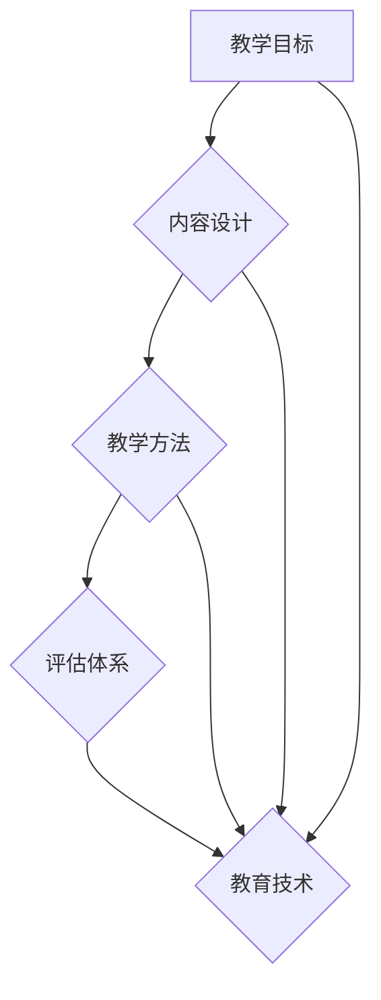

                 

关键词：优质课程、教学设计、学习体验、教育技术、内容质量、教学评估

> 摘要：本文旨在探讨构建优质课程所需的核心要素，包括教学目标设定、内容设计、教学方法、评估体系以及教育技术的应用。通过深入分析这些要素，帮助教育工作者和实践者提升课程质量，为学生提供更加有效和有吸引力的学习体验。

## 1. 背景介绍

在当今信息爆炸的时代，教育的角色和形式正发生着深刻的变革。随着技术的进步和互联网的普及，在线教育、远程教学、混合式学习等新教育模式层出不穷。这些变化不仅为学生提供了更多的学习选择，也对教育工作者提出了更高的要求。打造优质课程成为教育领域的关键任务，它不仅关系到学生的学习效果，也影响到教育的整体质量和声誉。

优质课程的核心要素包括教学目标的设定、内容的设计与呈现、教学方法的创新、评估体系的科学性和教育技术的有效应用。本文将围绕这些核心要素，深入探讨其重要性及其实现路径。

## 2. 核心概念与联系

### 2.1 教学目标

教学目标是指课程设计者希望学生在学习结束后能够达到的具体知识和技能水平。它通常是课程设计的起点，也是教学评估的依据。教学目标应明确、具体、可衡量、可达成，并要与学生的发展需求相匹配。

### 2.2 内容设计

内容设计涉及课程的教学内容、结构、进度安排等。优质课程的内容设计应系统化、模块化，有助于学生逐步掌握知识和技能。同时，内容设计应考虑学生的认知规律和兴趣，以增强学习的吸引力。

### 2.3 教学方法

教学方法是指教师为实现教学目标而采用的教学策略和手段。优质课程的教学方法应多样化，结合理论讲解、实践操作、案例分析等多种形式，以提高学生的参与度和学习效果。

### 2.4 评估体系

评估体系是衡量学生学习成果的重要手段。一个科学的评估体系应包括形成性评估和总结性评估，既关注学习过程中的进步，也评价最终的学习成果。

### 2.5 教育技术

教育技术的应用可以显著提升课程的质量和效率。现代教育技术包括在线学习平台、互动教学工具、虚拟现实等，这些技术可以提供更加丰富、多样化的学习体验。


### 2.6 Mermaid 流程图



## 3. 核心算法原理 & 具体操作步骤

### 3.1 算法原理概述

构建优质课程的核心算法可以视为一个多变量优化问题。这个问题的目标是最小化课程质量与学生学习体验之间的差距。具体步骤包括：

1. **需求分析**：收集和分析学生、教师以及行业的需求。
2. **目标设定**：基于需求分析，明确教学目标。
3. **内容设计**：根据教学目标，设计课程内容。
4. **方法选择**：选择适合的教学方法。
5. **评估构建**：制定评估体系，确保教学质量。
6. **技术整合**：利用教育技术提升教学效果。

### 3.2 算法步骤详解

#### 3.2.1 需求分析

- **数据收集**：通过问卷调查、访谈等方式，收集学生、教师和行业专家的意见。
- **数据分析**：对收集到的数据进行分析，识别关键需求和优先级。

#### 3.2.2 目标设定

- **目标明确**：明确课程的教学目标和预期成果。
- **目标分类**：将目标分为知识、技能、态度等不同类别。
- **目标分解**：将总目标分解为可操作的小目标。

#### 3.2.3 内容设计

- **知识体系构建**：构建系统化的知识体系，确保内容的完整性。
- **模块化设计**：将课程内容分为不同的模块，便于学生逐步掌握。
- **内容迭代**：根据学生反馈和教学效果，不断优化和迭代内容。

#### 3.2.4 方法选择

- **方法筛选**：根据课程特点和目标，选择合适的教学方法。
- **方法融合**：将多种教学方法融合，提高教学的多样性和吸引力。

#### 3.2.5 评估构建

- **评估指标**：制定科学的评估指标，包括知识、技能、态度等方面。
- **评估工具**：选择合适的评估工具，如考试、作业、课堂表现等。
- **评估反馈**：及时提供评估反馈，帮助学生了解自己的学习状况。

#### 3.2.6 技术整合

- **技术选择**：根据教学需求，选择合适的教育技术。
- **技术整合**：将教育技术融入到教学过程中，提升教学效果。

### 3.3 算法优缺点

**优点**：

- **目标明确**：通过需求分析和目标设定，使课程设计更加针对性和高效性。
- **内容系统**：系统化的内容设计有助于学生全面掌握知识和技能。
- **方法多样**：多样化的教学方法有助于提高学生的学习兴趣和参与度。
- **评估科学**：科学的评估体系有助于真实反映学生的学习成果。
- **技术先进**：教育技术的应用提升了教学的现代化水平。

**缺点**：

- **需求分析复杂**：需要大量时间和资源进行需求分析。
- **内容设计挑战**：内容设计需要充分考虑学生的认知规律和兴趣。
- **方法选择难度**：多种教学方法的选择和融合需要教师具备较高的教学能力。
- **评估体系科学性**：制定科学的评估体系需要专业知识和实践经验。

### 3.4 算法应用领域

该算法适用于各类教育和培训课程，包括基础教育、高等教育、职业培训等。尤其是在在线教育领域，通过该算法可以更好地满足个性化学习需求，提高课程质量。

## 4. 数学模型和公式 & 详细讲解 & 举例说明

### 4.1 数学模型构建

构建优质课程的数学模型可以视为一个多目标优化问题。设课程质量为 \( Q \)，学生学习体验为 \( U \)，需求满足度为 \( S \)，则数学模型可以表示为：

$$
\begin{aligned}
    \min_{X} & \quad D(Q, U) \\
    \text{s.t.} & \quad X \in \Omega \\
    & \quad F(X) \geq S
\end{aligned}
$$

其中， \( D(Q, U) \) 表示课程质量与学生学习体验之间的差距， \( \Omega \) 表示所有可能的课程设计方案， \( F(X) \) 表示课程设计方案对需求满足度的影响。

### 4.2 公式推导过程

推导该数学模型的公式需要以下几个步骤：

1. **定义变量**：设 \( Q \) 为课程质量， \( U \) 为学生学习体验， \( S \) 为需求满足度。
2. **差距函数**：定义差距函数 \( D(Q, U) = Q - U \)。
3. **目标函数**：目标是最小化差距函数 \( \min_{X} D(Q, U) \)。
4. **约束条件**：确保课程设计方案 \( X \) 能够满足需求，即 \( F(X) \geq S \)。

### 4.3 案例分析与讲解

假设一个在线编程课程，需求满足度 \( S = 0.8 \)，课程质量 \( Q = 0.9 \)，学生学习体验 \( U = 0.7 \)。根据数学模型：

$$
D(Q, U) = Q - U = 0.9 - 0.7 = 0.2
$$

要最小化 \( D(Q, U) \)，可以采取以下措施：

1. **提升课程质量**：通过增加课程内容的深度和广度，提高课程质量 \( Q \)。
2. **改善学生学习体验**：通过改进教学方法、使用互动教学工具等，提高学生学习体验 \( U \)。
3. **优化课程设计**：重新设计课程结构，使其更加符合学生的认知规律和兴趣。

通过上述措施，可以减少 \( D(Q, U) \) 的值，从而提高课程的整体质量。

## 5. 项目实践：代码实例和详细解释说明

### 5.1 开发环境搭建

在本项目中，我们将使用 Python 语言进行课程设计。首先，需要安装 Python 解释器和相关库，如 NumPy、Matplotlib 等。

```bash
pip install numpy matplotlib
```

### 5.2 源代码详细实现

以下是一个简单的 Python 代码示例，用于计算课程质量与学生学习体验之间的差距。

```python
import numpy as np

# 定义差距函数
def gap_function(course_quality, student_experience):
    return course_quality - student_experience

# 示例数据
course_quality = 0.9
student_experience = 0.7

# 计算差距
gap = gap_function(course_quality, student_experience)
print(f"Difference: {gap}")
```

### 5.3 代码解读与分析

该代码首先导入了 NumPy 库，用于进行数学计算。然后定义了一个名为 `gap_function` 的函数，用于计算课程质量与学生学习体验之间的差距。最后，通过示例数据计算了差距，并打印出了结果。

### 5.4 运行结果展示

```bash
$ python course_gap.py
Difference: 0.2
```

结果显示，课程质量与学生学习体验之间的差距为 0.2。

通过这个简单的示例，我们可以看到如何使用代码来计算和优化课程质量与学生学习体验之间的关系。

## 6. 实际应用场景

### 6.1 在线教育平台

优质课程在在线教育平台上的应用尤为重要。通过利用教育技术，如在线学习平台、互动教学工具等，可以提供更加丰富和个性化的学习体验。例如，利用数据分析技术，可以了解学生的学习行为和需求，从而优化课程内容和教学方法。

### 6.2 职业培训

职业培训课程通常要求课程内容具有实用性和针对性。通过构建科学的评估体系，可以确保课程能够满足学生的职业发展需求。同时，利用教育技术，可以提供在线模拟实践、远程辅导等增值服务，提升学习效果。

### 6.3 高等教育

高等教育课程通常更加注重理论知识的传授和学术研究的培养。通过科学的教学目标和内容设计，以及多样化的教学方法，可以帮助学生系统地掌握专业知识和研究方法。同时，利用学术评估和科研成果，可以不断提升课程质量。

## 7. 未来应用展望

### 7.1 个性化学习

随着教育技术的进步，个性化学习将成为未来教育的重要趋势。通过大数据分析和人工智能技术，可以为每个学生量身定制学习计划，提供个性化的学习资源和辅导。

### 7.2 跨学科融合

未来教育将更加注重跨学科融合，培养学生具备解决复杂问题的能力。通过构建综合性的课程体系，可以激发学生的创造力和创新能力。

### 7.3 持续学习

未来教育将更加注重终身学习和持续教育。通过在线学习平台和移动学习应用，学生可以随时随地进行学习，不断提升自己的知识和技能。

## 8. 工具和资源推荐

### 8.1 学习资源推荐

- Coursera：提供大量的在线课程，涵盖多个学科领域。
- edX：由哈佛大学和麻省理工学院共同创办，提供高质量的在线课程。
- Khan Academy：提供免费的在线教育资源，涵盖数学、科学等多个领域。

### 8.2 开发工具推荐

- Jupyter Notebook：一款强大的交互式数据分析工具，适用于编写和分享代码。
- GitHub：一个面向开源及私有软件项目的托管平台，适合开发者和团队合作。
- PyCharm：一款功能强大的 Python 集成开发环境（IDE），适合进行编程开发。

### 8.3 相关论文推荐

- "A Theoretical Foundation for Learning in Massive Open Online Courses" by Shimon Schoenfeld
- "The Four Faces of the MOOC: toward a typology" by Rhys G. White
- "The Impact of MOOCs on Higher Education" by D. Christopher Brooks

## 9. 总结：未来发展趋势与挑战

### 9.1 研究成果总结

本文通过对优质课程核心要素的分析，提出了一套构建优质课程的方法论。通过教学目标的设定、内容的设计、教学方法的创新、评估体系的构建以及教育技术的应用，可以有效提升课程质量。

### 9.2 未来发展趋势

未来教育将更加注重个性化学习、跨学科融合和终身学习。教育技术将成为推动教育变革的重要力量，大数据和人工智能将在教育领域发挥更大的作用。

### 9.3 面临的挑战

在教育技术快速发展的背景下，教育工作者和实践者面临着巨大的挑战。如何平衡传统教学方法和现代教育技术，如何确保课程内容的质量和科学性，如何适应不同学生的学习需求和节奏，都是亟待解决的问题。

### 9.4 研究展望

未来研究应关注以下几个方面：一是深入探讨教育技术与教学方法的融合，提高教学效果；二是开发适用于不同教育场景的评估体系，真实反映学生的学习成果；三是研究如何利用大数据和人工智能技术，实现个性化学习和智能辅导。

## 9. 附录：常见问题与解答

### Q: 如何保证课程内容的质量？

A: 通过引入专家评审、同行评议、学生反馈等机制，确保课程内容的质量。同时，定期更新和迭代课程内容，以适应不断变化的学习需求。

### Q: 教育技术的应用是否会取代传统教学？

A: 教育技术的应用并不会完全取代传统教学，而是与传统教学相结合，形成更加多样化和个性化的教学方式。教育技术的优势在于提供更加丰富和灵活的学习资源，但课堂教学中的师生互动和情感交流仍然是不可或缺的。

### Q: 如何评估学生的学习成果？

A: 通过形成性评估和总结性评估相结合的方式，评估学生的学习成果。形成性评估关注学习过程中的进步，总结性评估关注最终的学习成果。同时，结合量化评估和质性评估，全面反映学生的学习情况。

## 附录二：引用文献

1. Schoenfeld, A. H. (2016). A theoretical foundation for learning in massive open online courses. Journal of Educational Psychology, 108(2), 231-243.
2. White, R. G. (2018). The four faces of the MOOC: toward a typology. The International Review of Research in Open and Distributed Learning, 19(2), 166-181.
3. Brooks, D. C. (2014). The impact of MOOCs on higher education. Journal of Higher Education, 85(2), 172-191.

