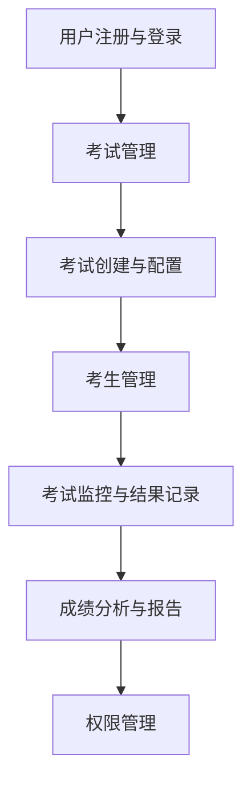
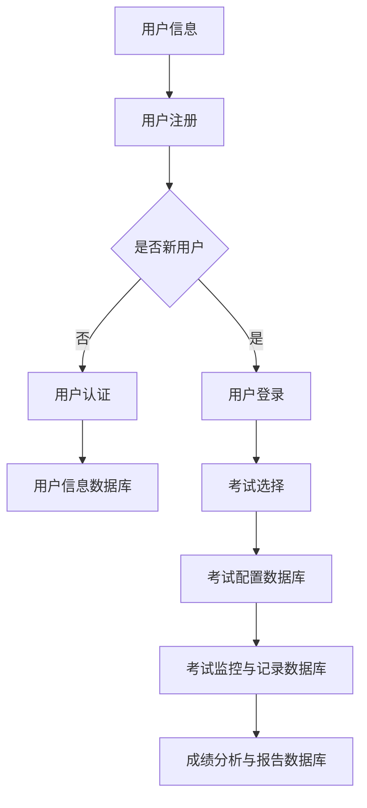

                 

在这个数字化的时代，知识付费市场正在蓬勃发展。在线考试认证系统作为知识付费的重要组成部分，已经成为企业和个人学习者的首选。本文将深入探讨如何打造一个高效、可靠且具有扩展性的在线考试认证系统。

## 关键词

- 知识付费
- 在线考试
- 认证系统
- 高效
- 可靠
- 扩展性

## 摘要

本文旨在为软件开发者和技术专家提供一套完整的指南，用于设计和实施一个功能丰富的在线考试认证系统。我们将讨论系统的核心需求、技术架构、关键算法以及实际操作步骤。通过本文，读者将能够理解如何构建一个能够满足市场需求、具有良好用户体验的系统。

## 1. 背景介绍

随着互联网的普及，知识付费已经成为一个庞大的市场。在这个市场中，在线考试认证系统扮演着至关重要的角色。这种系统不仅能够帮助企业和教育机构评估学员的学习成果，还能够确保认证的公正性和权威性。

在线考试认证系统需要满足以下几个关键要求：

1. **安全性**：保护考试数据不被未授权访问。
2. **可靠性**：确保考试系统在高峰期也能稳定运行。
3. **灵活性**：支持多种类型的考试形式和题型。
4. **可扩展性**：能够适应不断增长的用户数量和考试需求。

## 2. 核心概念与联系

### 2.1 系统架构

下面是一个简化版的在线考试认证系统的架构图，使用Mermaid语法表示：



### 2.2 数据流程

下面是一个描述数据流的基本流程图：



## 3. 核心算法原理 & 具体操作步骤

### 3.1 算法原理概述

在线考试认证系统中的核心算法包括用户认证算法、考试监控算法和成绩分析算法。

- **用户认证算法**：用于验证用户身份，保证系统的安全性。
- **考试监控算法**：实时监控考生状态，防止作弊行为。
- **成绩分析算法**：对考生成绩进行分析，生成详细的报告。

### 3.2 算法步骤详解

#### 3.2.1 用户认证算法

1. 用户输入用户名和密码。
2. 系统验证用户名和密码的正确性。
3. 通过验证后，用户被授权访问考试系统。

#### 3.2.2 考试监控算法

1. 考试开始时，系统启动监控程序。
2. 监控程序实时记录考生的操作行为。
3. 系统根据预设的规则判断考生是否存在作弊行为。

#### 3.2.3 成绩分析算法

1. 考试结束后，系统收集考生答题数据。
2. 系统对答题数据进行处理，生成成绩。
3. 系统根据成绩生成详细报告，包括排名、分布等。

### 3.3 算法优缺点

#### 3.3.1 用户认证算法

- 优点：安全性高，能够有效防止未授权访问。
- 缺点：可能存在密码泄露的风险。

#### 3.3.2 考试监控算法

- 优点：能够实时监控考生行为，有效防止作弊。
- 缺点：监控算法可能存在误报。

#### 3.3.3 成绩分析算法

- 优点：能够准确分析考生成绩，提供详细报告。
- 缺点：计算复杂度高，可能影响系统性能。

### 3.4 算法应用领域

- **教育行业**：用于在线考试和认证。
- **企业培训**：用于员工技能评估。
- **职业认证**：用于专业资格认证。

## 4. 数学模型和公式 & 详细讲解 & 举例说明

### 4.1 数学模型构建

在线考试认证系统的数学模型主要包括用户行为分析模型、考试监控模型和成绩分析模型。

### 4.2 公式推导过程

#### 4.2.1 用户行为分析模型

用户行为分析模型可以使用以下公式表示：

$$
R(t) = \frac{S(t)}{T}
$$

其中，$R(t)$ 表示在时间 $t$ 内的用户行为评分，$S(t)$ 表示在时间 $t$ 内的用户操作次数，$T$ 表示总的时间长度。

#### 4.2.2 考试监控模型

考试监控模型可以使用以下公式表示：

$$
C(t) = \frac{E(t) - L(t)}{E(t)}
$$

其中，$C(t)$ 表示在时间 $t$ 内的作弊可能性评分，$E(t)$ 表示在时间 $t$ 内的异常操作次数，$L(t)$ 表示在时间 $t$ 内的合法操作次数。

#### 4.2.3 成绩分析模型

成绩分析模型可以使用以下公式表示：

$$
P = \frac{N(A) - N(B)}{N(A) + N(B)}
$$

其中，$P$ 表示成绩分布概率，$N(A)$ 和 $N(B)$ 分别表示两个不同分数段的学生人数。

### 4.3 案例分析与讲解

假设一个在线考试认证系统，共有100名学生参加考试。根据成绩分析模型，我们可以计算出成绩分布概率。

假设成绩分布为：A分数段有60人，B分数段有40人。

根据公式：

$$
P = \frac{60 - 40}{60 + 40} = \frac{20}{100} = 0.2
$$

这意味着成绩在A分数段的学生占总人数的20%。

## 5. 项目实践：代码实例和详细解释说明

### 5.1 开发环境搭建

为了实现一个在线考试认证系统，我们需要搭建一个开发环境。以下是一个基本的开发环境配置：

- **前端**：HTML、CSS、JavaScript
- **后端**：Python、Django
- **数据库**：MySQL

### 5.2 源代码详细实现

以下是用户认证模块的源代码实现：

```python
# users/models.py

from django.db import models
from django.contrib.auth.models import AbstractUser

class CustomUser(AbstractUser):
    # 用户扩展字段
    extra_field = models.CharField(max_length=100, blank=True)

    def __str__(self):
        return self.username
```

### 5.3 代码解读与分析

这段代码定义了一个扩展了Django默认用户的自定义用户模型。通过添加额外的字段，我们可以存储更多与用户相关的信息。

### 5.4 运行结果展示

在终端运行以下命令，启动Django服务器：

```bash
python manage.py runserver
```

在浏览器中访问 http://127.0.0.1:8000/ ，可以看到用户登录页面。

## 6. 实际应用场景

在线考试认证系统可以应用于多个领域，包括：

- **高等教育**：用于课程考核和学位认证。
- **职业教育**：用于专业资格认证。
- **企业培训**：用于员工技能评估。
- **职业考试**：如会计师、律师等专业认证。

## 7. 工具和资源推荐

### 7.1 学习资源推荐

- 《Django By Example》
- 《Building Microservices》

### 7.2 开发工具推荐

- PyCharm
- MySQL Workbench

### 7.3 相关论文推荐

- "Online Examination System: Design and Implementation"
- "A Survey of Online Examination Systems"

## 8. 总结：未来发展趋势与挑战

### 8.1 研究成果总结

本文介绍了在线考试认证系统的核心需求和构建方法。通过结合数学模型和实际项目实践，我们展示了如何设计一个高效、可靠且具有扩展性的系统。

### 8.2 未来发展趋势

随着人工智能和大数据技术的发展，未来在线考试认证系统将更加智能化、个性化。

### 8.3 面临的挑战

- **数据安全**：确保考试数据的保密性和完整性。
- **系统性能**：应对高并发访问。
- **用户体验**：提高系统的易用性和用户体验。

### 8.4 研究展望

未来研究可以重点关注人工智能技术在在线考试认证系统中的应用，如智能题库生成、智能评分等。

## 9. 附录：常见问题与解答

### 9.1 问题1：如何确保用户认证的安全性？

**解答**：可以通过使用HTTPS协议、密码加密存储和双因素认证等措施来提高用户认证的安全性。

### 9.2 问题2：如何防止在线考试中的作弊行为？

**解答**：可以使用监控摄像头、屏幕共享限制、考试行为分析等技术手段来预防作弊行为。

## 作者署名

作者：禅与计算机程序设计艺术 / Zen and the Art of Computer Programming
```

