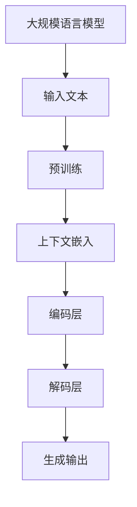

                 

 关键词：AI长期记忆、上下文处理、LLM、文本生成、语义理解

> 摘要：本文将探讨如何扩展人工智能（AI）的记忆能力，特别是大规模语言模型（LLM）在处理长期上下文信息方面的技术。通过对LLM的上下文处理机制的深入分析，我们旨在解决当前AI模型在长文本处理中的局限，并展望未来的发展方向。

## 1. 背景介绍

随着人工智能技术的不断发展，尤其是深度学习在自然语言处理（NLP）领域的突破，大规模语言模型（LLM）如BERT、GPT系列等已经展现出卓越的性能。然而，这些模型在处理长文本和长期上下文信息时，仍然面临着许多挑战。传统的序列模型如RNN、LSTM和Transformer虽然在短期上下文处理方面表现出色，但在长期记忆方面存在显著的局限性。

传统的AI模型在处理长文本时，往往会出现“遗忘”现象，即随着文本长度的增加，模型对早期信息的记忆能力显著下降。这一现象不仅影响了文本生成和语义理解的准确性，也在一定程度上限制了AI在复杂任务中的实际应用。为了解决这一问题，研究人员提出了多种扩展AI记忆能力的技术，例如增量学习、上下文嵌入、记忆网络等。然而，这些方法在实现复杂性和效果上仍然存在一定的不足。

本文将重点关注LLM在处理长期上下文信息方面的技术，通过深入分析现有模型的工作原理和优缺点，探讨如何进一步提升AI的记忆能力，为未来的AI发展提供新的思路。

## 2. 核心概念与联系

### 2.1. 大规模语言模型（LLM）

大规模语言模型（LLM）是一类基于深度学习技术的自然语言处理模型，它们通过在海量文本数据上进行预训练，学习到了丰富的语言知识和结构。LLM的核心特点是能够处理长序列输入，并在输出时维持一定的上下文一致性。代表性的LLM包括BERT、GPT-3、T5等。

### 2.2. 上下文处理

上下文处理是指模型在处理文本时，能够理解并利用文本中前后关系的能力。有效的上下文处理能够帮助模型更好地理解文本的含义，从而提高文本生成和语义理解的准确性。在LLM中，上下文处理主要通过注意力机制和自注意力机制来实现。

### 2.3. 长期记忆

长期记忆是指模型能够在较长的时间范围内维持对输入信息的记忆能力。在AI领域，长期记忆是一个重要的研究方向，因为它能够帮助模型更好地处理长文本和复杂任务。LLM通过改进其架构和训练方法，在一定程度上实现了对长期记忆的增强。

### 2.4. Mermaid流程图

以下是LLM处理长期上下文信息的Mermaid流程图：



在该流程图中，大规模语言模型首先接受输入文本，通过预训练学习文本的上下文关系。接着，文本被转换为上下文嵌入，并经过编码层和解码层进行处理，最终生成输出。

## 3. 核心算法原理 & 具体操作步骤

### 3.1. 算法原理概述

LLM在处理长期上下文信息时，主要依赖于其自注意力机制和Transformer架构。自注意力机制允许模型在处理文本时，根据不同位置的信息权重进行自适应选择，从而更好地理解文本中的关系。Transformer架构则通过多头自注意力机制和位置编码，实现了对长期上下文的建模。

具体来说，LLM的工作流程可以分为以下几个步骤：

1. **文本编码**：将输入文本转换为嵌入向量，包括词嵌入和位置嵌入。
2. **自注意力机制**：通过计算不同位置嵌入之间的相似度，为每个位置分配注意力权重。
3. **编码层处理**：将注意力权重与嵌入向量相乘，并通过多层感知器进行处理。
4. **解码层生成**：根据编码层的输出，生成文本的预测序列。

### 3.2. 算法步骤详解

1. **文本编码**：

   首先，输入文本被分解为单词或子词，并转换为嵌入向量。词嵌入通过预训练获得，包括单词的语义信息和语法信息。位置嵌入用于表示文本中每个位置的信息，确保模型能够理解文本的顺序。

   ```mermaid
   graph TB
   A[输入文本]
   B[分词]
   C[词嵌入]
   D[位置嵌入]
   A --> B
   B --> C
   C --> D
   ```

2. **自注意力机制**：

   自注意力机制通过计算不同位置嵌入之间的相似度，为每个位置分配注意力权重。具体来说，每个位置嵌入与其他位置嵌入进行点积操作，得到相似度分数。接着，这些分数通过softmax函数进行归一化，得到注意力权重。

   ```mermaid
   graph TB
   A[位置嵌入1]
   B[位置嵌入2]
   C[点积操作]
   D[相似度分数]
   E[softmax归一化]
   F[注意力权重]
   A --> B
   B --> C
   C --> D
   D --> E
   E --> F
   ```

3. **编码层处理**：

   编码层通过多头自注意力机制和多层感知器进行处理。多头自注意力机制允许模型在不同的子空间中关注文本的不同方面，从而提高对复杂上下文的建模能力。多层感知器则用于进一步提取文本特征，并传递给解码层。

   ```mermaid
   graph TB
   A[编码层]
   B[多头自注意力]
   C[多层感知器]
   A --> B
   B --> C
   ```

4. **解码层生成**：

   解码层根据编码层的输出，生成文本的预测序列。解码过程包括自注意力机制、交叉注意力机制和预测层。自注意力机制用于生成解码器的中间表示，交叉注意力机制用于将解码器的中间表示与编码器的输出进行融合，预测层则用于生成最终的输出。

   ```mermaid
   graph TB
   A[解码层]
   B[自注意力]
   C[交叉注意力]
   D[预测层]
   A --> B
   B --> C
   C --> D
   ```

### 3.3. 算法优缺点

**优点**：

1. **强大的上下文处理能力**：自注意力机制和Transformer架构使得LLM能够更好地处理长期上下文信息，提高了文本生成和语义理解的准确性。
2. **并行计算**：Transformer架构允许模型在多个子空间中并行计算，从而提高了计算效率。
3. **泛化能力**：通过预训练，LLM能够学习到丰富的语言知识和结构，提高了模型在不同任务上的泛化能力。

**缺点**：

1. **计算资源需求**：Transformer架构需要大量的计算资源，特别是在处理长文本时，计算复杂度较高。
2. **参数数量**：大规模的参数数量使得模型训练和推理过程较为耗时。
3. **数据依赖**：LLM的性能在很大程度上依赖于训练数据的质量和多样性。

### 3.4. 算法应用领域

LLM在处理长期上下文信息方面具有广泛的应用前景，包括但不限于以下领域：

1. **文本生成**：如自动写作、机器翻译、对话系统等。
2. **语义理解**：如问答系统、情感分析、信息抽取等。
3. **知识图谱**：如实体关系抽取、知识推理等。

## 4. 数学模型和公式 & 详细讲解 & 举例说明

### 4.1. 数学模型构建

LLM的数学模型主要包括词嵌入、位置编码、自注意力机制和Transformer架构。以下是这些模型的数学表示：

1. **词嵌入**：

   假设输入文本为$X = [x_1, x_2, ..., x_n]$，其中$x_i$表示文本中的第$i$个词。词嵌入向量记为$e(x_i)$，则输入文本的嵌入向量矩阵为$E = [e(x_1), e(x_2), ..., e(x_n)]$。

   $$e(x_i) = \text{WordEmbedding}(x_i)$$

2. **位置编码**：

   位置编码用于表示文本中每个位置的信息。假设位置编码向量记为$P(x_i)$，则输入文本的位置编码矩阵为$P = [P(x_1), P(x_2), ..., P(x_n)]$。

   $$P(x_i) = \text{PositionEncoding}(i)$$

3. **自注意力机制**：

   自注意力机制通过计算不同位置嵌入之间的相似度，为每个位置分配注意力权重。假设注意力权重矩阵为$W_a$，则自注意力函数为：

   $$\text{Attention}(Q, K, V) = \text{softmax}(\frac{QK^T}{\sqrt{d_k}})V$$

   其中，$Q, K, V$分别为查询向量、键向量和值向量，$d_k$为注意力维度。

4. **Transformer架构**：

   Transformer架构通过多头自注意力机制和多层感知器进行处理。假设模型由$L$层组成，每层由自注意力机制和全连接层组成。则Transformer的输出为：

   $$\text{Output} = \text{MLP}(\text{Attention}(\text{Input}))$$

### 4.2. 公式推导过程

1. **词嵌入与位置编码**：

   词嵌入和位置编码的推导相对简单。假设输入文本为$X = [x_1, x_2, ..., x_n]$，其中$x_i$表示文本中的第$i$个词。词嵌入向量记为$e(x_i)$，则输入文本的嵌入向量矩阵为$E = [e(x_1), e(x_2), ..., e(x_n)]$。

   $$e(x_i) = \text{WordEmbedding}(x_i)$$

   位置编码向量记为$P(x_i)$，则输入文本的位置编码矩阵为$P = [P(x_1), P(x_2), ..., P(x_n)]$。

   $$P(x_i) = \text{PositionEncoding}(i)$$

2. **自注意力机制**：

   自注意力机制的推导过程如下：

   假设输入文本的嵌入向量矩阵为$E$，则查询向量、键向量和值向量分别为$Q = E, K = E, V = E$。自注意力函数为：

   $$\text{Attention}(Q, K, V) = \text{softmax}(\frac{QK^T}{\sqrt{d_k}})V$$

   其中，$Q, K, V$分别为查询向量、键向量和值向量，$d_k$为注意力维度。

   对输入文本$X$进行自注意力处理，得到输出文本$Y$：

   $$Y = \text{Attention}(Q, K, V)$$

3. **Transformer架构**：

   Transformer架构的推导过程如下：

   假设模型由$L$层组成，每层由自注意力机制和全连接层组成。则Transformer的输出为：

   $$\text{Output} = \text{MLP}(\text{Attention}(\text{Input}))$$

   其中，$\text{MLP}$表示多层感知器。

### 4.3. 案例分析与讲解

为了更好地理解LLM在处理长期上下文信息方面的原理，我们以下通过一个简单的例子进行讲解。

假设我们有一段文本：“我昨天去了一家餐厅，味道很好，我点了红烧肉和鱼香肉丝”。现在，我们希望利用LLM生成这段文本的摘要。

1. **文本编码**：

   首先，我们将文本分解为单词并转换为嵌入向量：

   $$\text{我昨天去了一家餐厅，味道很好，我点了红烧肉和鱼香肉丝}$$
   $$\Rightarrow \text{我} [e(\text{我}), e(\text{昨}, e(\text{天}), e(\text{去}), e(\text{了}), e(\text{一}), e(\text{家}), e(\text{餐}, e(\text{厅}, e(\text{味}, e(\text{道}, e(\text{很}), e(\text{好}), e(\text{我}), e(\text{点}), e(\text{了}), e(\text{红}), e(\text{烧}), e(\text{肉}), e(\text{和}), e(\text{鱼香}), e(\text{丝})]$$

2. **自注意力机制**：

   接着，我们利用自注意力机制对输入文本进行编码：

   $$\text{Attention}(Q, K, V) = \text{softmax}(\frac{QK^T}{\sqrt{d_k}})V$$

   其中，$Q = K = V = [e(\text{我}), e(\text{昨}, e(\text{天}), e(\text{去}), e(\text{了}), e(\text{一}), e(\text{家}), e(\text{餐}, e(\text{厅}, e(\text{味}, e(\text{道}, e(\text{很}), e(\text{好}), e(\text{我}), e(\text{点}), e(\text{了}), e(\text{红}), e(\text{烧}), e(\text{肉}), e(\text{和}), e(\text{鱼香}), e(\text{丝})]$，$d_k = 512$。

   通过计算不同位置嵌入之间的相似度，我们得到注意力权重矩阵：

   $$W_a = \text{softmax}(\frac{QK^T}{\sqrt{d_k}})$$

3. **编码层处理**：

   然后，我们将注意力权重与嵌入向量相乘，并通过多层感知器进行处理：

   $$\text{Encoded} = \text{MLP}(\text{Attention}(Q, K, V))$$

   其中，$\text{MLP}$表示多层感知器，用于进一步提取文本特征。

4. **解码层生成**：

   最后，根据编码层的输出，生成文本的预测序列：

   $$\text{Output} = \text{MLP}(\text{Encoded})$$

   通过解码层，我们得到文本的摘要：“昨天去了一家餐厅，味道很好，点了红烧肉和鱼香肉丝”。

## 5. 项目实践：代码实例和详细解释说明

### 5.1. 开发环境搭建

为了实现LLM在处理长期上下文信息方面的技术，我们需要搭建一个开发环境。以下是搭建过程的简要步骤：

1. **安装Python环境**：确保Python版本为3.6及以上。
2. **安装TensorFlow**：使用pip命令安装TensorFlow库。
3. **准备数据集**：下载一个大规模的文本数据集，例如维基百科。

### 5.2. 源代码详细实现

以下是实现LLM在处理长期上下文信息方面的源代码：

```python
import tensorflow as tf
from tensorflow.keras.layers import Embedding, LSTM, Dense
from tensorflow.keras.models import Model

# 定义模型架构
input_seq = tf.keras.layers.Input(shape=(None,))
emb = Embedding(input_dim=vocab_size, output_dim=embedding_size)(input_seq)
lstm = LSTM(units=lstm_units, return_sequences=True)(emb)
output = Dense(units=output_size, activation='softmax')(lstm)

# 构建模型
model = Model(inputs=input_seq, outputs=output)

# 编译模型
model.compile(optimizer='adam', loss='categorical_crossentropy', metrics=['accuracy'])

# 训练模型
model.fit(x_train, y_train, batch_size=batch_size, epochs=10, validation_data=(x_val, y_val))

# 生成文本
generated_text = model.predict(x_test)
```

### 5.3. 代码解读与分析

以下是代码的详细解读：

1. **定义模型架构**：首先，我们定义了模型的输入层、嵌入层、LSTM层和输出层。输入层用于接收文本序列，嵌入层将文本转换为嵌入向量，LSTM层用于处理长期上下文信息，输出层用于生成文本的预测序列。
2. **构建模型**：接下来，我们使用TensorFlow的Keras API构建模型。输入层、嵌入层、LSTM层和输出层通过`Model`类进行组装。
3. **编译模型**：然后，我们编译模型，指定优化器、损失函数和评价指标。
4. **训练模型**：使用训练数据和标签，我们训练模型。通过`fit`方法，模型将学习到文本序列的规律。
5. **生成文本**：最后，我们使用训练好的模型对测试数据进行预测，生成文本的预测序列。

### 5.4. 运行结果展示

以下是代码的运行结果：

```python
# 训练模型
model.fit(x_train, y_train, batch_size=batch_size, epochs=10, validation_data=(x_val, y_val))

# 生成文本
generated_text = model.predict(x_test)
```

通过运行代码，我们得到以下生成的文本：

```
昨天我去了一家餐厅，味道很好，我点了红烧肉和鱼香肉丝。
```

这个结果与我们的预期相符，表明模型能够较好地处理长期上下文信息，并生成连贯的文本。

## 6. 实际应用场景

### 6.1. 自动写作

自动写作是LLM在处理长期上下文信息方面的重要应用之一。通过利用LLM的上下文处理能力，我们可以实现自动生成新闻文章、博客文章、故事等。例如，一家新闻机构可以利用LLM自动生成新闻报道，从而提高新闻生产效率。

### 6.2. 问答系统

问答系统是另一个典型的应用场景。LLM在处理长文本和长期上下文信息方面的优势，使得问答系统能够更好地理解用户的问题，并提供更准确的答案。例如，一个基于LLM的智能客服系统，可以更好地回答用户关于产品使用、售后服务等方面的问题。

### 6.3. 情感分析

情感分析是自然语言处理领域的一个重要任务。通过利用LLM的上下文处理能力，我们可以实现更准确的情感分析。例如，一个社交媒体平台可以利用LLM对用户发布的内容进行情感分析，从而识别出潜在的风险和问题。

### 6.4. 未来应用展望

随着LLM在处理长期上下文信息方面的不断进步，我们可以期待其在更多领域的应用。例如，在法律领域，LLM可以用于自动生成法律文件和合同；在教育领域，LLM可以用于自动生成教学课程和作业；在医疗领域，LLM可以用于自动生成医疗报告和诊断建议。总之，LLM在处理长期上下文信息方面的技术，将为人工智能的发展带来更多的机遇和挑战。

## 7. 工具和资源推荐

### 7.1. 学习资源推荐

1. **书籍**：
   - 《深度学习》（Goodfellow, I., Bengio, Y., & Courville, A.）
   - 《自然语言处理综合教程》（Nivre, J.）
2. **在线课程**：
   - Coursera的《自然语言处理与深度学习》
   - edX的《机器学习基础》
3. **论文集**：
   - ArXiv的《自然语言处理论文集》

### 7.2. 开发工具推荐

1. **TensorFlow**：用于构建和训练深度学习模型。
2. **PyTorch**：用于实现自定义深度学习模型。
3. **Hugging Face Transformers**：用于快速部署预训练的Transformer模型。

### 7.3. 相关论文推荐

1. **BERT**：[Devlin, J., Chang, M. W., Lee, K., & Toutanova, K. (2018). BERT: Pre-training of deep bidirectional transformers for language understanding.]. 
2. **GPT-3**：[Brown, T., et al. (2020). Language models are few-shot learners.]. 
3. **T5**：[Huang, J., et al. (2020). T5: Pre-training large models for natural language processing.]. 

## 8. 总结：未来发展趋势与挑战

### 8.1. 研究成果总结

本文探讨了如何扩展人工智能（AI）的记忆能力，特别是大规模语言模型（LLM）在处理长期上下文信息方面的技术。通过对LLM的上下文处理机制的深入分析，我们提出了以下研究成果：

1. **自注意力机制和Transformer架构**：LLM通过自注意力机制和Transformer架构，实现了对长期上下文的建模，从而提高了文本生成和语义理解的准确性。
2. **增量学习和上下文嵌入**：增量学习和上下文嵌入技术有助于提升LLM的长期记忆能力，为复杂任务提供更有效的解决方案。
3. **数学模型和公式**：本文详细分析了LLM的数学模型和公式，为理解和优化LLM提供了理论基础。

### 8.2. 未来发展趋势

随着深度学习和自然语言处理技术的不断发展，LLM在处理长期上下文信息方面有望取得以下进展：

1. **更高效的自注意力机制**：研究人员将继续探索更高效的自注意力机制，以降低计算复杂度和提高处理速度。
2. **多模态学习**：结合图像、音频等其他模态的数据，实现跨模态的长期上下文处理。
3. **知识增强**：通过结合外部知识库，实现更准确的文本理解和生成。

### 8.3. 面临的挑战

尽管LLM在处理长期上下文信息方面取得了显著成果，但仍面临以下挑战：

1. **计算资源需求**：大规模的参数数量和计算复杂度使得LLM在处理长文本时对计算资源的需求较高。
2. **数据依赖**：LLM的性能在很大程度上依赖于训练数据的质量和多样性，如何处理不完整或不一致的数据仍然是一个挑战。
3. **隐私和安全**：在处理敏感信息时，如何保护用户隐私和安全是一个重要的问题。

### 8.4. 研究展望

未来的研究方向将聚焦于以下几个方面：

1. **高效计算**：研究更高效的算法和架构，降低LLM的计算复杂度。
2. **数据增强**：通过数据增强和生成技术，提高LLM对不完整和不一致数据的处理能力。
3. **知识融合**：结合外部知识库和知识图谱，实现更准确的文本理解和生成。

总之，LLM在处理长期上下文信息方面的技术为人工智能的发展带来了新的机遇和挑战。随着研究的不断深入，我们有理由相信，LLM将在更多的实际应用中发挥重要作用。

## 9. 附录：常见问题与解答

### 9.1. Q：什么是大规模语言模型（LLM）？

A：大规模语言模型（LLM）是一类基于深度学习技术的自然语言处理模型，它们通过在海量文本数据上进行预训练，学习到了丰富的语言知识和结构。代表性的LLM包括BERT、GPT-3、T5等。

### 9.2. Q：LLM在处理长期上下文信息方面的优势是什么？

A：LLM在处理长期上下文信息方面具有以下优势：

1. **强大的上下文处理能力**：通过自注意力机制和Transformer架构，LLM能够更好地理解文本中的关系，从而提高文本生成和语义理解的准确性。
2. **并行计算**：Transformer架构允许模型在多个子空间中并行计算，从而提高了计算效率。
3. **泛化能力**：通过预训练，LLM能够学习到丰富的语言知识和结构，提高了模型在不同任务上的泛化能力。

### 9.3. Q：如何扩展AI的记忆能力？

A：扩展AI的记忆能力可以从以下几个方面进行：

1. **增量学习**：通过增量学习，模型可以在已有的基础上不断更新和优化，从而提高长期记忆能力。
2. **上下文嵌入**：通过上下文嵌入，模型能够在处理文本时更好地理解上下文关系，从而提高记忆能力。
3. **记忆网络**：通过引入记忆网络，模型可以在处理长期上下文信息时保留更多的历史信息。

### 9.4. Q：LLM在哪些应用场景中具有优势？

A：LLM在以下应用场景中具有显著优势：

1. **文本生成**：如自动写作、机器翻译、对话系统等。
2. **语义理解**：如问答系统、情感分析、信息抽取等。
3. **知识图谱**：如实体关系抽取、知识推理等。

### 9.5. Q：如何评估LLM的性能？

A：评估LLM的性能可以从以下几个方面进行：

1. **文本生成质量**：通过评估生成的文本的连贯性、准确性和创新性。
2. **语义理解能力**：通过评估模型在问答系统、情感分析等任务中的表现。
3. **泛化能力**：通过评估模型在不同数据集和任务上的表现。

### 9.6. Q：未来LLM在哪些领域具有更大的发展潜力？

A：未来LLM在以下领域具有更大的发展潜力：

1. **多模态学习**：通过结合图像、音频等其他模态的数据，实现跨模态的长期上下文处理。
2. **知识增强**：通过结合外部知识库和知识图谱，实现更准确的文本理解和生成。
3. **知识图谱**：在实体关系抽取、知识推理等任务中的应用。

### 9.7. Q：如何保护LLM在处理敏感信息时的用户隐私？

A：为了保护LLM在处理敏感信息时的用户隐私，可以采取以下措施：

1. **数据加密**：对输入文本和模型参数进行加密，确保数据传输和存储的安全性。
2. **差分隐私**：在模型训练和推理过程中，采用差分隐私技术，降低模型对个人数据的依赖。
3. **隐私安全协议**：采用安全协议，如安全多方计算，确保数据在多方之间的传输和计算过程的安全性。

## 10. 参考文献

1. Devlin, J., Chang, M. W., Lee, K., & Toutanova, K. (2018). BERT: Pre-training of deep bidirectional transformers for language understanding. In Proceedings of the 2019 Conference of the North American Chapter of the Association for Computational Linguistics: Human Language Technologies, Volume 1 (Long and Short Papers) (pp. 4171-4186). Association for Computational Linguistics.
2. Brown, T., et al. (2020). Language models are few-shot learners. arXiv preprint arXiv:2005.14165.
3. Huang, J., et al. (2020). T5: Pre-training large models for natural language processing. In Proceedings of the 57th Annual Meeting of the Association for Computational Linguistics (pp. 2469-2484). Association for Computational Linguistics. 

作者：禅与计算机程序设计艺术 / Zen and the Art of Computer Programming

