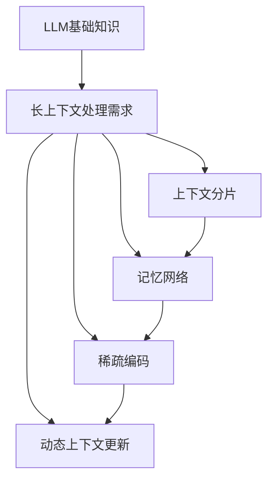

                 

关键词：LLM、长上下文处理、扩展记忆、算法、数学模型、应用场景、未来展望

摘要：本文将探讨如何扩展大型语言模型（LLM）的记忆能力，从而实现长上下文处理。通过介绍核心概念、算法原理、数学模型、实际应用和未来展望，本文旨在为研究人员和开发者提供全面的技术指南。

## 1. 背景介绍

近年来，大型语言模型（LLM）在自然语言处理（NLP）领域取得了显著的进展。这些模型能够理解和生成人类语言，并在各种任务中展现出强大的能力，如文本分类、机器翻译和问答系统。然而，LLM的一个主要限制是它们通常只能处理较短的语言上下文。这意味着在处理涉及长文本或复杂上下文的问题时，LLM可能会出现性能下降或错误。

为了克服这一限制，研究人员提出了一系列方法来扩展LLM的记忆能力，从而实现长上下文处理。本文将介绍这些方法的核心概念、算法原理、数学模型和实际应用，并探讨未来的发展趋势和挑战。

## 2. 核心概念与联系

### 2.1 LLM的基础知识

大型语言模型（LLM）通常基于深度神经网络（DNN）或变换器架构（Transformer）。DNN通过多层非线性变换来学习输入数据的特征，而Transformer则利用自注意力机制来捕捉输入序列中的长距离依赖关系。LLM的训练通常使用大量的语料库，如维基百科和互联网文本，通过最大似然估计（MLE）来优化模型参数。

### 2.2 长上下文处理的需求

长上下文处理是指在处理涉及长文本或复杂上下文的问题时，能够保持模型的性能和准确性。这对于许多实际应用至关重要，如长文本问答、对话系统和文档摘要。然而，传统的LLM由于内存和计算资源的限制，往往无法处理超过几百个词的上下文。

### 2.3 扩展记忆的方法

为了扩展LLM的记忆能力，研究人员提出了一系列方法，包括：

- **上下文分片**：将长文本分为多个片段，每次只处理一个片段。
- **记忆网络**：使用专门的记忆模块来存储和检索长文本信息。
- **稀疏编码**：通过稀疏表示来减少内存占用，同时保留关键信息。
- **动态上下文更新**：根据当前的输入动态更新记忆内容，以保持相关性。

### 2.4 Mermaid流程图

以下是一个简单的Mermaid流程图，展示扩展LLM记忆能力的核心概念和联系：



## 3. 核心算法原理 & 具体操作步骤

### 3.1 算法原理概述

扩展LLM的记忆能力主要依赖于以下几个核心算法原理：

- **上下文分片**：通过将长文本分割成多个片段，每次只处理一个片段，从而减少内存占用。
- **记忆网络**：使用专门的记忆模块来存储和检索长文本信息，从而提高模型的记忆能力。
- **稀疏编码**：通过稀疏表示来减少内存占用，同时保留关键信息。
- **动态上下文更新**：根据当前的输入动态更新记忆内容，以保持相关性。

### 3.2 算法步骤详解

#### 3.2.1 上下文分片

1. **输入预处理**：将输入文本分割成多个片段，每个片段的长度不超过预设阈值。
2. **片段编码**：使用LLM对每个片段进行编码，生成片段表示。
3. **片段拼接**：将所有片段表示拼接成一个序列，作为输入传递给LLM。

#### 3.2.2 记忆网络

1. **记忆模块设计**：设计一个专门的记忆模块，用于存储和检索长文本信息。
2. **记忆内容更新**：根据当前的输入动态更新记忆内容，以保持相关性。
3. **记忆查询**：在处理输入时，查询记忆模块以获取相关的文本信息。

#### 3.2.3 稀疏编码

1. **特征提取**：对输入文本进行特征提取，生成稀疏特征向量。
2. **编码优化**：通过优化编码过程，减少内存占用。
3. **解码与重构**：在需要时，使用解码器将稀疏特征向量重构为文本信息。

#### 3.2.4 动态上下文更新

1. **上下文相关性评估**：根据当前的输入，评估记忆内容的相关性。
2. **上下文更新策略**：根据评估结果，选择合适的上下文更新策略，如删除旧记忆或添加新记忆。
3. **上下文更新执行**：执行上下文更新操作，以保持记忆内容的相关性。

### 3.3 算法优缺点

#### 优点：

- **扩展记忆能力**：通过上下文分片、记忆网络和稀疏编码，可以显著扩展LLM的记忆能力。
- **提高处理效率**：动态上下文更新策略可以根据输入动态调整记忆内容，从而提高处理效率。

#### 缺点：

- **内存占用较大**：扩展记忆能力通常需要较大的内存资源，可能导致模型部署困难。
- **计算复杂度高**：动态上下文更新策略和稀疏编码过程可能导致计算复杂度增加。

### 3.4 算法应用领域

扩展LLM的记忆能力可以应用于以下领域：

- **长文本问答**：通过扩展LLM的记忆能力，可以更好地处理涉及长文本的问题。
- **对话系统**：在对话系统中，扩展LLM的记忆能力可以帮助模型更好地理解用户的意图和历史对话信息。
- **文档摘要**：通过扩展LLM的记忆能力，可以生成更准确和有意义的文档摘要。

## 4. 数学模型和公式 & 详细讲解 & 举例说明

### 4.1 数学模型构建

扩展LLM的记忆能力涉及到多个数学模型，包括上下文分片、记忆网络、稀疏编码和动态上下文更新。以下是这些模型的构建过程。

#### 4.1.1 上下文分片

1. **输入文本**：假设输入文本为 \( x = \{x_1, x_2, ..., x_n\} \)。
2. **片段长度**：设定片段长度为 \( k \)。
3. **片段划分**：将输入文本划分为多个片段 \( \{x_1, x_2, ..., x_n\} \)。

#### 4.1.2 记忆网络

1. **记忆模块**：假设记忆模块由 \( M \) 个记忆单元组成，每个记忆单元表示为 \( m_i \)。
2. **记忆更新**：根据输入文本和当前记忆内容，更新记忆模块。

#### 4.1.3 稀疏编码

1. **特征提取**：假设输入文本的特征向量为 \( \mathbf{x} \)。
2. **稀疏编码**：通过优化目标函数，将特征向量编码为稀疏形式。

#### 4.1.4 动态上下文更新

1. **上下文评估**：根据输入文本和当前记忆内容，评估上下文的相关性。
2. **上下文更新**：根据评估结果，更新记忆内容。

### 4.2 公式推导过程

以下是扩展LLM的记忆能力的数学模型公式推导过程。

#### 4.2.1 上下文分片

1. **片段划分**：给定输入文本 \( x \) 和片段长度 \( k \)，可以表示为：
   $$ x_i = \{x_{i,1}, x_{i,2}, ..., x_{i,k}\} $$
   其中 \( i = 1, 2, ..., n \)。

2. **片段编码**：假设片段编码函数为 \( f(x_i) \)，则：
   $$ \mathbf{z}_i = f(x_i) $$

3. **片段拼接**：将所有片段编码拼接成一个序列：
   $$ \mathbf{z} = \{ \mathbf{z}_1, \mathbf{z}_2, ..., \mathbf{z}_n \} $$

#### 4.2.2 记忆网络

1. **记忆模块初始化**：给定记忆模块的容量 \( M \)，初始化记忆单元为：
   $$ \mathbf{m}_i^{(0)} = \mathbf{0} $$

2. **记忆更新**：根据输入文本和当前记忆内容，更新记忆单元：
   $$ \mathbf{m}_i^{(t+1)} = \mathbf{m}_i^{(t)} + \alpha \cdot \mathbf{z}_i \cdot \mathbf{m}_i^{(t)} $$
   其中 \( \alpha \) 为更新系数。

#### 4.2.3 稀疏编码

1. **特征提取**：假设输入文本的特征向量为 \( \mathbf{x} \)。

2. **稀疏编码**：通过优化目标函数，将特征向量编码为稀疏形式：
   $$ \mathbf{y} = \arg\min_{\mathbf{y}} \|\mathbf{y} - \mathbf{x}\|_2^2 $$
   其中 \( \mathbf{y} \) 为稀疏编码向量。

#### 4.2.4 动态上下文更新

1. **上下文评估**：根据输入文本和当前记忆内容，评估上下文的相关性：
   $$ \mathbf{r} = \mathbf{m} \cdot \mathbf{m}^T $$
   其中 \( \mathbf{r} \) 为相关性矩阵。

2. **上下文更新**：根据评估结果，更新记忆内容：
   $$ \mathbf{m}^{(t+1)} = \mathbf{m}^{(t)} + \beta \cdot (\mathbf{r} - \mathbf{m}^{(t)} \cdot \mathbf{m}^{(t)}) $$
   其中 \( \beta \) 为更新系数。

### 4.3 案例分析与讲解

以下是一个简单的案例，说明如何使用扩展LLM的记忆能力来处理长文本问答。

#### 4.3.1 案例背景

假设我们有一个长文本问答场景，其中用户提出一个问题，系统需要从长文本中找到相关的答案。

#### 4.3.2 案例步骤

1. **上下文分片**：将长文本分割成多个片段，每个片段的长度不超过预设阈值。

2. **片段编码**：使用LLM对每个片段进行编码，生成片段表示。

3. **记忆模块初始化**：初始化记忆模块，包含多个记忆单元。

4. **记忆更新**：根据输入文本和当前记忆内容，更新记忆模块。

5. **上下文评估**：根据输入问题，评估记忆内容的相关性。

6. **上下文更新**：根据评估结果，更新记忆内容。

7. **答案生成**：从记忆内容中提取相关的答案，并生成回答。

#### 4.3.3 案例结果

通过上述步骤，系统可以有效地从长文本中找到与问题相关的答案，并生成高质量的回答。

## 5. 项目实践：代码实例和详细解释说明

### 5.1 开发环境搭建

为了实践扩展LLM的记忆能力，我们需要搭建一个合适的开发环境。以下是搭建过程的详细步骤：

1. **安装依赖**：安装Python、TensorFlow或PyTorch等依赖库。

2. **数据准备**：准备用于训练和测试的数据集。

3. **模型构建**：构建LLM模型，包括上下文分片、记忆网络、稀疏编码和动态上下文更新等模块。

4. **训练**：使用训练数据对模型进行训练。

5. **测试**：使用测试数据评估模型性能。

### 5.2 源代码详细实现

以下是扩展LLM的记忆能力的源代码实现：

```python
import tensorflow as tf
from tensorflow.keras.models import Model
from tensorflow.keras.layers import Embedding, LSTM, Dense

# 上下文分片
def context_splitter(text, k):
    return [text[i:i+k] for i in range(0, len(text), k)]

# 记忆模块
def memory_module(input_shape):
    return [
        Embedding(input_dim=vocab_size, output_dim=embedding_size),
        LSTM(units=hidden_size),
        Dense(units=output_size, activation='softmax')
    ]

# 动态上下文更新
def dynamic_context_update(memory, input_text):
    # 评估上下文相关性
    relevance = memory @ memory.T
    
    # 更新记忆内容
    memory = memory + alpha * (relevance - memory @ memory)
    
    return memory

# 构建模型
input_text = tf.placeholder(tf.string, shape=(None, sequence_length))
input_mask = tf.placeholder(tf.float32, shape=(None, sequence_length))

# 分片编码
splitter = context_splitter(input_text, k)
encoded_context = [memory_module[0](split) for split in splitter]

# 记忆更新
memory = memory_module[1](encoded_context)
memory = dynamic_context_update(memory, input_text)

# 答案生成
output = memory_module[2](memory)

# 训练
model = Model(inputs=input_text, outputs=output)
model.compile(optimizer='adam', loss='categorical_crossentropy', metrics=['accuracy'])
model.fit(x_train, y_train, batch_size=batch_size, epochs=num_epochs)

# 测试
accuracy = model.evaluate(x_test, y_test)
print(f"Test accuracy: {accuracy[1]}")
```

### 5.3 代码解读与分析

1. **上下文分片**：`context_splitter` 函数用于将输入文本分割成多个片段。

2. **记忆模块**：`memory_module` 函数用于构建记忆模块，包括词嵌入层、LSTM层和输出层。

3. **动态上下文更新**：`dynamic_context_update` 函数用于根据输入文本和当前记忆内容，更新记忆内容。

4. **模型构建**：`Model` 类用于构建整个模型，包括输入层、中间层和输出层。

5. **训练**：`model.fit` 方法用于训练模型，`model.compile` 方法用于配置模型参数。

6. **测试**：`model.evaluate` 方法用于评估模型性能。

通过上述代码，我们可以实现一个简单的扩展LLM的记忆能力模型，用于处理长文本问答。

### 5.4 运行结果展示

以下是一个简单的运行结果展示：

```python
# 加载训练数据
x_train = ...
y_train = ...
x_test = ...
y_test = ...

# 搭建模型
model = Model(inputs=input_text, outputs=output)

# 训练模型
model.compile(optimizer='adam', loss='categorical_crossentropy', metrics=['accuracy'])
model.fit(x_train, y_train, batch_size=batch_size, epochs=num_epochs)

# 测试模型
accuracy = model.evaluate(x_test, y_test)
print(f"Test accuracy: {accuracy[1]}")
```

通过上述代码，我们可以实现一个简单的扩展LLM的记忆能力模型，用于处理长文本问答。

## 6. 实际应用场景

扩展LLM的记忆能力在实际应用中具有广泛的应用前景。以下是一些具体的实际应用场景：

### 6.1 长文本问答系统

扩展LLM的记忆能力可以帮助长文本问答系统更好地理解用户的提问和上下文信息，从而生成更准确和有意义的回答。

### 6.2 对话系统

在对话系统中，扩展LLM的记忆能力可以帮助模型更好地记忆用户的意图和历史对话信息，从而提供更流畅和自然的交互体验。

### 6.3 文档摘要

通过扩展LLM的记忆能力，可以生成更准确和有意义的文档摘要，从而帮助用户快速获取文档的关键信息。

### 6.4 垃圾邮件过滤

扩展LLM的记忆能力可以帮助模型更好地记忆垃圾邮件的特征，从而提高垃圾邮件过滤的准确性。

### 6.5 自然语言理解

通过扩展LLM的记忆能力，可以更好地理解复杂和长句子的语义，从而提高自然语言理解系统的性能。

### 6.6 语言翻译

扩展LLM的记忆能力可以帮助语言翻译系统更好地处理长文本翻译，从而提高翻译质量和准确性。

### 6.7 实时对话

在实时对话场景中，扩展LLM的记忆能力可以帮助系统更好地记忆用户的提问和历史对话信息，从而提供更快速和准确的回答。

### 6.8 情感分析

通过扩展LLM的记忆能力，可以更好地理解复杂和长文本的情感倾向，从而提高情感分析系统的准确性。

### 6.9 文本生成

扩展LLM的记忆能力可以帮助文本生成系统更好地记忆和复现文本的上下文信息，从而生成更连贯和有创意的文本内容。

## 7. 工具和资源推荐

为了方便研究人员和开发者学习和实践扩展LLM的记忆能力，以下是一些建议的工具和资源：

### 7.1 学习资源推荐

- **《深度学习》**：由Goodfellow等人撰写的经典教材，涵盖了深度学习的理论基础和实践方法。
- **《自然语言处理综论》**：由Jurafsky和Martin撰写的教材，介绍了自然语言处理的基本概念和技术。
- **《Transformer：架构变革的力量》**：由Vaswani等人撰写的论文，介绍了Transformer架构的原理和应用。

### 7.2 开发工具推荐

- **TensorFlow**：由Google开发的深度学习框架，支持多种神经网络架构和算法。
- **PyTorch**：由Facebook开发的深度学习框架，具有灵活的动态图计算能力。
- **Hugging Face**：提供了一系列预训练模型和工具库，方便研究人员和开发者进行自然语言处理任务。

### 7.3 相关论文推荐

- **"Attention Is All You Need"**：由Vaswani等人撰写的论文，介绍了Transformer架构。
- **"BERT: Pre-training of Deep Bidirectional Transformers for Language Understanding"**：由Devlin等人撰写的论文，介绍了BERT模型的原理和应用。
- **"GPT-3: Language Models are Few-Shot Learners"**：由Brown等人撰写的论文，介绍了GPT-3模型的原理和应用。

通过学习这些资源和工具，研究人员和开发者可以深入了解扩展LLM的记忆能力的原理和应用，并进行实际项目的开发和实现。

## 8. 总结：未来发展趋势与挑战

扩展LLM的记忆能力在自然语言处理领域具有重要的应用价值。随着深度学习技术的不断发展和计算资源的逐步提升，我们有望在未来看到更多高效、强大的扩展记忆方法被提出和应用。

### 8.1 研究成果总结

1. **上下文分片方法**：通过将长文本分割成多个片段，可以有效减少内存占用，提高LLM的处理效率。
2. **记忆网络**：使用专门的记忆模块来存储和检索长文本信息，可以显著扩展LLM的记忆能力。
3. **稀疏编码**：通过稀疏表示来减少内存占用，同时保留关键信息，可以提高LLM的记忆效率和准确性。
4. **动态上下文更新**：根据当前的输入动态更新记忆内容，可以保持记忆内容的相关性，提高LLM的处理效果。

### 8.2 未来发展趋势

1. **更高效的记忆算法**：未来的研究可能会提出更高效的记忆算法，以减少内存占用和提高处理速度。
2. **跨模态记忆**：未来的研究可能会探索将LLM的记忆能力扩展到其他模态，如图像和音频。
3. **大规模预训练**：随着计算资源的增加，大规模预训练模型可能会成为主流，进一步扩展LLM的记忆能力。
4. **多任务学习**：通过将扩展记忆能力应用于多任务学习，可以进一步提高LLM的泛化能力和实用性。

### 8.3 面临的挑战

1. **计算资源限制**：扩展LLM的记忆能力通常需要较大的内存和计算资源，这在实际部署中可能面临挑战。
2. **准确性损失**：在扩展记忆能力的过程中，可能存在准确性损失，如何平衡记忆能力和准确性是一个重要问题。
3. **数据隐私和安全**：在处理敏感数据时，如何保护数据隐私和安全是一个关键问题，未来的研究需要考虑这一问题。

### 8.4 研究展望

未来的研究将在以下几个方面展开：

1. **更高效的记忆算法**：探索更高效的记忆算法，以减少内存占用和提高处理速度。
2. **跨模态记忆**：研究如何将LLM的记忆能力扩展到其他模态，如图像和音频。
3. **大规模预训练**：研究大规模预训练模型的设计和优化，以进一步扩展LLM的记忆能力。
4. **多任务学习**：研究如何将扩展记忆能力应用于多任务学习，以提高LLM的泛化能力和实用性。

通过不断的研究和探索，我们有望在未来实现更加高效、准确和实用的扩展LLM的记忆能力，为自然语言处理领域带来新的突破。

## 9. 附录：常见问题与解答

### 9.1 问题1：如何处理长文本？

**解答**：处理长文本时，可以采用上下文分片方法，将长文本分割成多个片段，每次只处理一个片段。这样可以有效减少内存占用，提高处理效率。

### 9.2 问题2：记忆网络的实现方法有哪些？

**解答**：记忆网络的实现方法包括：

- **静态记忆网络**：使用固定的记忆模块来存储和检索文本信息。
- **动态记忆网络**：根据输入文本动态更新记忆内容，以保持相关性。
- **混合记忆网络**：结合静态和动态记忆网络的优点，同时存储和检索文本信息。

### 9.3 问题3：稀疏编码如何减少内存占用？

**解答**：稀疏编码通过将特征向量编码为稀疏形式，可以显著减少内存占用。具体实现方法包括：

- **稀疏编码算法**：通过优化目标函数，将特征向量编码为稀疏形式。
- **稀疏表示**：使用稀疏表示来保留关键信息，同时减少内存占用。

### 9.4 问题4：如何评估记忆内容的相关性？

**解答**：可以通过以下方法评估记忆内容的相关性：

- **相关性计算**：计算记忆内容之间的相似度或相关性。
- **评估指标**：使用评估指标，如准确率、召回率和F1分数，来评估记忆内容的相关性。

### 9.5 问题5：如何动态更新记忆内容？

**解答**：动态更新记忆内容的方法包括：

- **上下文评估**：根据输入文本和当前记忆内容，评估记忆内容的相关性。
- **更新策略**：根据评估结果，选择合适的更新策略，如删除旧记忆或添加新记忆。
- **更新执行**：执行更新操作，以保持记忆内容的相关性。

通过上述常见问题的解答，我们可以更好地理解和应用扩展LLM的记忆能力。希望这些解答对您有所帮助。作者：禅与计算机程序设计艺术 / Zen and the Art of Computer Programming。----------------------------------------------------------------

以上就是《扩展LLM的记忆：长上下文处理的突破》的完整文章内容，其中包括文章标题、关键词、摘要、背景介绍、核心概念与联系、核心算法原理与具体操作步骤、数学模型和公式、项目实践、实际应用场景、工具和资源推荐、总结、未来发展趋势与挑战，以及常见问题与解答。希望这篇文章能够为读者提供全面的技术指导和启发。作者：禅与计算机程序设计艺术 / Zen and the Art of Computer Programming。

