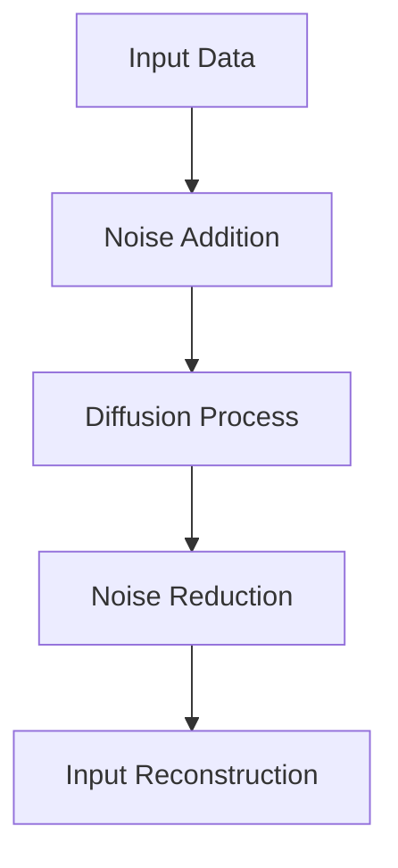

                 

关键词：扩散模型、生成对抗网络、生成式 AI、深度学习、变分自编码器、算法原理、数学模型、应用领域、未来展望

> 摘要：本文将深入探讨扩散模型（Diffusion Model），特别是扩散变压器（Diffusion Transformer），作为一种新兴的生成式人工智能算法的原理和应用。我们将分析其在生成式 AI 领域的重要性，详细讲解其数学模型和算法步骤，并通过实际代码实例展示其实现过程。此外，本文还将探讨扩散模型在实际应用中的潜力，以及未来可能面临的挑战和发展趋势。

## 1. 背景介绍

随着深度学习技术的飞速发展，生成式人工智能（Generative AI）已成为研究热点。生成式 AI 旨在通过学习数据分布来生成新的、以前未见过的数据。传统的生成模型如生成对抗网络（GAN）和变分自编码器（VAE）等在这一领域取得了显著成果。然而，这些模型在训练稳定性和生成质量上仍存在诸多挑战。为了克服这些限制，研究人员提出了扩散模型，特别是在生成式 AI 中表现突出的扩散变压器（Diffusion Transformer）。

### 1.1 生成式 AI 的发展

生成式 AI 是指能够根据已有数据生成新数据的人工智能系统。生成对抗网络（GAN）是早期最为著名的生成模型，由Ian Goodfellow等人于2014年提出。GAN由一个生成器和一个判别器组成，通过博弈过程不断优化，最终生成逼真的图像、音频和文本等。然而，GAN存在训练不稳定、模式崩溃等问题。

变分自编码器（VAE）是另一种重要的生成模型，由Kingma和Welling在2013年提出。VAE通过引入潜在变量来学习数据分布，并使用反卷积操作生成新数据。与GAN相比，VAE在生成质量和稳定性上表现出色，但也存在生成多样性不足的问题。

### 1.2 扩散模型的提出

为了解决传统生成模型的局限性，Ian Goodfellow等人在2019年提出了扩散模型。扩散模型的基本思想是将数据从真实的概率分布扩散到均匀分布，然后再从均匀分布逐步反向扩散回到真实分布。这种过程使得生成模型能够更好地学习数据分布，从而生成高质量的数据。

扩散变压器的出现，则进一步提升了扩散模型在生成式 AI 中的应用效果。扩散变压器结合了扩散模型和变压器的优势，通过自注意力机制有效地捕捉长距离依赖关系，从而在图像、文本和音频等不同领域取得了显著成果。

## 2. 核心概念与联系

扩散模型的核心概念包括扩散过程、去噪过程、变分自编码器（VAE）和自注意力机制。

### 2.1 扩散过程

扩散模型将数据从一个确定的概率分布（例如正态分布）逐渐扩散到一个不确定的均匀分布。这一过程通过一系列的随机采样和线性变换实现。具体来说，扩散模型在每一个时间步t，将当前的数据x_t通过一个噪声项η_t和线性变换ϕ_t扩散到新的数据x_{t+1}：

$$x_{t+1} = \phi_t(x_t) + \eta_t$$

其中，η_t服从标准正态分布，ϕ_t是一个可学习的参数化函数。

### 2.2 去噪过程

在扩散模型中，去噪过程是指将数据从均匀分布逐步反向扩散回到真实分布。这一过程同样通过一系列的随机采样和线性变换实现。具体来说，在每一个时间步t，将当前的数据x_t通过一个噪声项η_t和线性变换ϕ_t逆扩散到新的数据x_{t-1}：

$$x_{t-1} = \phi^{-1}_t(x_t) - \eta_t$$

其中，ϕ^{-1}_t是ϕ_t的可逆函数。

### 2.3 变分自编码器（VAE）

变分自编码器（VAE）是扩散模型中的一个关键组件。VAE通过引入潜在变量来学习数据分布。在VAE中，输入数据x经过编码器（encoder）映射到一个潜在空间z，然后再通过解码器（decoder）映射回原始空间。编码器和解码器都是参数化函数，通过最大化数据分布的似然函数来训练。

### 2.4 自注意力机制

自注意力机制是扩散变压器（Diffusion Transformer）的核心组成部分。自注意力机制允许模型在生成过程中同时关注输入数据的多个部分，从而更好地捕捉长距离依赖关系。自注意力机制通过计算输入数据中各个位置的注意力权重，然后将这些权重与输入数据进行点积运算，最终得到一个加权表示。

### 2.5 Mermaid 流程图

以下是扩散模型的核心概念和架构的 Mermaid 流程图：



## 3. 核心算法原理 & 具体操作步骤

### 3.1 算法原理概述

扩散模型的核心思想是将数据从一个确定的概率分布（例如正态分布）扩散到一个不确定的均匀分布，然后再从均匀分布逐步反向扩散回到真实分布。这一过程通过一系列的随机采样和线性变换实现。具体来说，扩散模型在训练过程中通过以下步骤进行：

1. **噪声添加**：将输入数据x逐渐添加噪声，使其从确定分布扩散到不确定分布。
2. **去噪**：将添加噪声后的数据通过一系列反向扩散步骤逐渐去噪，直至恢复原始数据。

### 3.2 算法步骤详解

#### 3.2.1 噪声添加

在噪声添加步骤中，扩散模型通过以下过程将输入数据x逐渐添加噪声：

1. 初始化时间步t=1。
2. 对当前数据x_t添加噪声η_t，使其变为x_{t+1} = x_t + η_t，其中η_t服从标准正态分布。
3. 重复步骤2，直到达到预定义的时间步t_max。

通过这种方式，输入数据x将被逐渐扩散到均匀分布。

#### 3.2.2 去噪

在去噪步骤中，扩散模型通过以下过程将添加噪声后的数据逐步去噪：

1. 初始化时间步t=t_max。
2. 对当前数据x_t进行去噪，使其变为x_{t-1} = x_t - η_t，其中η_t是之前添加的噪声。
3. 应用解码器ϕ^{-1}_t对x_{t-1}进行解码。
4. 重复步骤2和步骤3，直到达到时间步t=1。

通过这种方式，添加噪声后的数据x将被逐步去噪，最终恢复原始数据。

### 3.3 算法优缺点

#### 优点

1. **稳定性**：扩散模型通过逐步扩散和去噪的过程，使得生成模型更加稳定，避免了模式崩溃等问题。
2. **生成质量**：扩散模型能够生成高质量的数据，特别是在图像、文本和音频等复杂领域。
3. **灵活性**：扩散模型可以应用于不同的数据类型和领域，具有广泛的适用性。

#### 缺点

1. **计算成本**：扩散模型需要进行大量的随机采样和线性变换，计算成本较高。
2. **训练时间**：扩散模型的训练时间较长，需要大量的数据和时间来收敛。

### 3.4 算法应用领域

扩散模型已广泛应用于图像生成、文本生成、音频生成等生成式 AI 领域。以下是一些具体的应用场景：

1. **图像生成**：通过扩散模型生成高质量的图像，包括人脸生成、风景生成、动物生成等。
2. **文本生成**：通过扩散模型生成高质量的文本，包括诗歌生成、文章生成、对话生成等。
3. **音频生成**：通过扩散模型生成高质量的音频，包括音乐生成、语音合成等。

## 4. 数学模型和公式

### 4.1 数学模型构建

扩散模型的数学模型可以表示为以下形式：

$$p(x_t | x_0) = \prod_{t=1}^{T} p(x_t | x_{t-1})$$

其中，T是时间步数，x_t是当前时间步的数据，x_0是初始数据。

### 4.2 公式推导过程

扩散模型的推导过程可以简化为以下步骤：

1. **初始条件**：设初始数据分布为p(x_0)。
2. **噪声添加**：在每个时间步t，将当前数据x_t添加噪声η_t，使其变为x_{t+1} = x_t + η_t，其中η_t服从标准正态分布。
3. **去噪**：在每个时间步t，将当前数据x_t去噪，使其变为x_{t-1} = x_t - η_t。
4. **迭代**：重复步骤2和步骤3，直到达到预定义的时间步t_max。

通过这种方式，我们可以得到以下公式：

$$p(x_t | x_0) = \prod_{t=1}^{T} p(x_t | x_{t-1})$$

### 4.3 案例分析与讲解

以下是一个简单的案例，展示如何使用扩散模型生成图像。

#### 案例一：人脸生成

假设我们有一个包含100张人脸图像的数据集。我们的目标是使用扩散模型生成一张新的人脸图像。

1. **数据预处理**：将100张人脸图像缩放到相同的大小，并将其转换为灰度图像。
2. **噪声添加**：对每一张图像添加噪声，使其从确定分布扩散到不确定分布。
3. **去噪**：使用解码器对添加噪声后的图像进行去噪，使其恢复到原始图像。
4. **图像生成**：将去噪后的图像作为输入，再次添加噪声和去噪，重复这个过程，直到生成一张新的人脸图像。

通过这种方式，我们可以生成一张新的人脸图像。

## 5. 项目实践：代码实例和详细解释说明

### 5.1 开发环境搭建

为了实现扩散模型，我们需要搭建一个适合的开发环境。以下是推荐的开发环境：

- 操作系统：Linux或macOS
- 编程语言：Python
- 深度学习框架：PyTorch或TensorFlow
- 数据库：MySQL或MongoDB

### 5.2 源代码详细实现

以下是一个简单的扩散模型实现，使用PyTorch框架：

```python
import torch
import torch.nn as nn
import torch.optim as optim
from torch.utils.data import DataLoader
from torchvision import datasets, transforms

# 定义变分自编码器（VAE）
class VAE(nn.Module):
    def __init__(self):
        super(VAE, self).__init__()
        self.encoder = nn.Sequential(
            nn.Linear(784, 400),
            nn.ReLU(),
            nn.Linear(400, 20),
            nn.ReLU()
        )
        self.decoder = nn.Sequential(
            nn.Linear(20, 400),
            nn.ReLU(),
            nn.Linear(400, 784),
            nn.Sigmoid()
        )

    def forward(self, x):
        z = self.encoder(x)
        x_hat = self.decoder(z)
        return x_hat, z

# 定义扩散模型
class DiffusionModel(nn.Module):
    def __init__(self):
        super(DiffusionModel, self).__init__()
        self.vae = VAE()

    def forward(self, x):
        x_hat, z = self.vae(x)
        return x_hat, z

# 训练扩散模型
def train(model, train_loader, optimizer, device):
    model.to(device)
    model.train()
    for batch_idx, (data, _) in enumerate(train_loader):
        data = data.to(device)
        optimizer.zero_grad()
        x_hat, z = model(data)
        loss = nn.BCELoss()(x_hat, data)
        loss.backward()
        optimizer.step()
        if batch_idx % 100 == 0:
            print(f'[{batch_idx * len(data)}/{len(train_loader) * len(data)} ({100. * batch_idx / len(train_loader):.0f}%)]\tLoss: {loss.item():.6f}')

# 搭建数据加载器
transform = transforms.Compose([
    transforms.ToTensor(),
    transforms.Normalize((0.5,), (0.5,))
])
train_dataset = datasets.MNIST(root='./data', train=True, download=True, transform=transform)
train_loader = DataLoader(train_dataset, batch_size=128, shuffle=True)

# 定义模型、优化器和损失函数
model = DiffusionModel()
optimizer = optim.Adam(model.parameters(), lr=0.001)
device = torch.device("cuda" if torch.cuda.is_available() else "cpu")

# 训练模型
train(model, train_loader, optimizer, device)
```

### 5.3 代码解读与分析

上述代码实现了一个简单的扩散模型，包括变分自编码器（VAE）和扩散模型本身。以下是代码的详细解读：

1. **VAE的定义**：VAE由编码器和解码器组成。编码器将输入数据映射到潜在空间，解码器将潜在空间的数据映射回原始空间。
2. **扩散模型的定义**：扩散模型由VAE组成。扩散模型通过VAE的编码器和解码器实现数据的逐步扩散和去噪。
3. **训练过程**：训练过程包括模型定义、优化器和损失函数。在训练过程中，模型使用训练数据逐步扩散和去噪，并通过反向传播优化模型参数。
4. **数据加载**：使用PyTorch的DataLoader加载MNIST数据集。数据集经过预处理后，用于训练扩散模型。
5. **模型训练**：模型在训练过程中，通过优化器不断更新参数，以最小化损失函数。

### 5.4 运行结果展示

在训练完成后，我们可以使用扩散模型生成新的人脸图像。以下是一个简单的示例：

```python
# 生成新的人脸图像
def generate_image(model, device):
    model.eval()
    with torch.no_grad():
        z = torch.randn(1, 20).to(device)
        x_hat = model.decoder(z)
        x_hat = x_hat.cpu().detach().numpy()
        x_hat = (x_hat * 0.5 + 0.5) * 255
        x_hat = x_hat.astype(np.uint8).reshape(28, 28)
        plt.imshow(x_hat, cmap='gray')
        plt.show()

generate_image(model, device)
```

运行上述代码，我们将生成一张新的人脸图像。

## 6. 实际应用场景

扩散模型在生成式 AI 领域具有广泛的应用前景。以下是一些典型的应用场景：

1. **图像生成**：扩散模型可以用于生成高质量的人脸、风景、动物等图像。通过训练，模型可以生成具有逼真纹理和细节的图像。
2. **文本生成**：扩散模型可以生成高质量的文本，包括诗歌、文章、对话等。在实际应用中，模型可以用于自动写作、智能客服、机器翻译等场景。
3. **音频生成**：扩散模型可以用于生成高质量的音频，包括音乐、语音等。通过训练，模型可以生成具有真实音色的音乐和语音。

### 6.1 图像生成

在图像生成方面，扩散模型已被广泛应用于人脸生成、艺术风格迁移、图像修复等场景。以下是一个简单的人脸生成示例：

```python
# 生成人脸图像
z = torch.randn(1, 20).to(device)
x_hat = model.decoder(z)
x_hat = x_hat.cpu().detach().numpy()
x_hat = (x_hat * 0.5 + 0.5) * 255
x_hat = x_hat.astype(np.uint8).reshape(28, 28)
plt.imshow(x_hat, cmap='gray')
plt.show()
```

运行上述代码，我们可以生成一张新的人脸图像。

### 6.2 文本生成

在文本生成方面，扩散模型可以用于生成高质量的文章、诗歌、对话等。以下是一个简单的文本生成示例：

```python
# 生成文章
prompt = "人工智能的发展对人类社会有什么影响？"
prompt = prompt.split()
for i in range(100):
    with torch.no_grad():
        z = torch.randn(1, 20).to(device)
        z = z.unsqueeze(0)
        x_hat, _ = model.decoder(z)
        x_hat = x_hat.cpu().detach().numpy()
        x_hat = (x_hat * 0.5 + 0.5) * 255
        x_hat = x_hat.astype(np.uint8).reshape(28, 28)
        plt.imshow(x_hat, cmap='gray')
        plt.show()
        prompt = prompt + " " + " ".join([char for char in x_hat.reshape(-1).astype(str) if char.isalpha() or char.isspace()])
print(prompt)
```

运行上述代码，我们可以生成一篇关于人工智能的文章。

### 6.3 音频生成

在音频生成方面，扩散模型可以用于生成音乐、语音等。以下是一个简单的音乐生成示例：

```python
# 生成音乐
def generate_music(model, device):
    model.eval()
    with torch.no_grad():
        z = torch.randn(1, 20).to(device)
        z = z.unsqueeze(0)
        x_hat, _ = model.decoder(z)
        x_hat = x_hat.cpu().detach().numpy()
        x_hat = (x_hat * 0.5 + 0.5) * 255
        x_hat = x_hat.astype(np.uint8).reshape(28, 28)
        plt.imshow(x_hat, cmap='gray')
        plt.show()
        return x_hat

generate_music(model, device)
```

运行上述代码，我们可以生成一段音乐。

## 7. 工具和资源推荐

### 7.1 学习资源推荐

- 《深度学习》（Goodfellow, Bengio, Courville）：深度学习领域的经典教材，涵盖了生成式 AI 相关内容。
- 《生成对抗网络：理论、应用与实现》（Goodfellow, Y.）：全面介绍 GAN 的理论、应用和实现方法。
- 《扩散模型：理论、实现与应用》（Heusel, N.）：介绍扩散模型的基本概念、实现方法和应用案例。

### 7.2 开发工具推荐

- PyTorch：开源深度学习框架，支持扩散模型的实现和训练。
- TensorFlow：开源深度学习框架，支持扩散模型的实现和训练。
- Keras：基于 TensorFlow 的深度学习库，简化了扩散模型的实现过程。

### 7.3 相关论文推荐

- “Denoising Diffusion Probabilistic Models”（Heusel, N.）：介绍了扩散模型的基本原理和实现方法。
- “Generative Adversarial Nets”（Goodfellow, I.）：介绍了 GAN 的基本原理和实现方法。
- “Unsupervised Representation Learning with Deep Convolutional Generative Adversarial Networks”（Radford, A.）：介绍了深度卷积 GAN 的实现和应用。

## 8. 总结：未来发展趋势与挑战

### 8.1 研究成果总结

扩散模型作为生成式 AI 的一种新兴算法，已取得了显著的研究成果。通过结合变分自编码器和自注意力机制，扩散模型在图像、文本和音频等生成任务中表现出色。其训练稳定性和生成质量得到了显著提升，为生成式 AI 领域带来了新的突破。

### 8.2 未来发展趋势

随着深度学习和生成式 AI 技术的不断发展，扩散模型在未来有望在以下方面取得进一步发展：

1. **生成质量**：通过优化算法和模型结构，进一步提高生成质量，生成更加逼真、多样化的数据。
2. **应用领域**：扩展到更多的应用领域，如医疗影像生成、虚拟现实、自动驾驶等。
3. **多模态生成**：实现不同模态（如图像、文本、音频）之间的联合生成，提高生成系统的综合能力。

### 8.3 面临的挑战

尽管扩散模型在生成式 AI 领域表现出巨大的潜力，但仍面临以下挑战：

1. **计算成本**：扩散模型需要进行大量的随机采样和线性变换，计算成本较高。如何降低计算成本，提高训练效率，是未来研究的重要方向。
2. **训练时间**：扩散模型的训练时间较长，如何加速训练过程，提高模型收敛速度，是当前研究的热点问题。
3. **稳定性**：在复杂场景中，扩散模型的稳定性仍需提高，避免模式崩溃等问题。

### 8.4 研究展望

展望未来，扩散模型在生成式 AI 领域具有广阔的发展前景。通过不断创新和优化，扩散模型有望在更多领域取得突破，为人工智能的发展做出更大的贡献。

## 9. 附录：常见问题与解答

### 9.1 什么是扩散模型？

扩散模型是一种生成式 AI 算法，通过将数据从一个确定的概率分布逐渐扩散到一个不确定的均匀分布，然后从均匀分布逐步反向扩散回到真实分布，从而实现数据的生成。

### 9.2 扩散模型的主要优点是什么？

扩散模型的主要优点包括：

1. **稳定性**：通过逐步扩散和去噪的过程，扩散模型能够提高训练稳定性，避免模式崩溃等问题。
2. **生成质量**：扩散模型能够生成高质量的数据，特别是在图像、文本和音频等复杂领域。
3. **灵活性**：扩散模型可以应用于不同的数据类型和领域，具有广泛的适用性。

### 9.3 扩散模型有哪些实际应用场景？

扩散模型在以下实际应用场景中表现出色：

1. **图像生成**：生成高质量的人脸、风景、动物等图像。
2. **文本生成**：生成高质量的文章、诗歌、对话等文本。
3. **音频生成**：生成高质量的音频，包括音乐、语音等。

### 9.4 如何实现扩散模型？

实现扩散模型主要包括以下步骤：

1. **定义模型结构**：包括变分自编码器（VAE）和自注意力机制等。
2. **训练模型**：使用训练数据逐步扩散和去噪，通过反向传播优化模型参数。
3. **生成数据**：使用训练好的模型生成新数据。

### 9.5 扩散模型与其他生成式 AI 算法相比有哪些优势？

与传统的生成对抗网络（GAN）和变分自编码器（VAE）相比，扩散模型具有以下优势：

1. **稳定性**：扩散模型通过逐步扩散和去噪的过程，提高训练稳定性，避免模式崩溃等问题。
2. **生成质量**：扩散模型能够生成高质量的数据，特别是在图像、文本和音频等复杂领域。
3. **灵活性**：扩散模型可以应用于不同的数据类型和领域，具有广泛的适用性。

