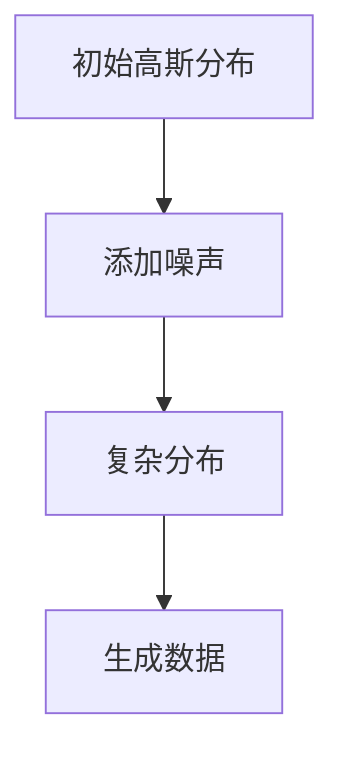

                 

关键词：扩散模型、AI艺术创作、深度学习、生成对抗网络、数学模型、实际应用、未来展望

> 摘要：本文将深入探讨扩散模型在AI艺术创作领域的应用，从背景介绍到核心算法原理，再到数学模型和实际应用场景，全面解析这一前沿技术的魅力与发展趋势。

## 1. 背景介绍

随着人工智能技术的快速发展，计算机生成艺术正逐渐成为艺术创作的一个重要分支。传统的艺术创作依赖于人类艺术家的创造力和技巧，而计算机生成艺术则借助机器学习算法，特别是扩散模型，实现了前所未有的创作自由度。扩散模型最初源于物理学中的扩散现象，后来被引入到计算机科学领域，并逐渐发展成为生成模型中的一个重要分支。

扩散模型的核心思想是通过模拟物质扩散的过程，从一个简单的高斯分布逐步过渡到一个复杂的分布，从而生成具有多样性和复杂性的数据。在AI艺术创作中，扩散模型被用于生成自然图像、音乐、视频等，为艺术家提供了强大的工具，使得计算机能够自主创作出极具个性的艺术作品。

## 2. 核心概念与联系

### 2.1 扩散模型的基本原理

扩散模型（Diffusion Model）是一种生成模型，它通过模拟物理过程中的扩散现象来生成数据。具体来说，扩散模型从一个简单的高斯分布开始，逐步添加噪声，使得数据点逐渐远离原始分布，最终形成一个复杂的分布。这一过程可以看作是一个概率分布的演变，即从简单到复杂、从有序到无序的转换。


### 2.2 扩散模型与深度学习的关系

扩散模型与深度学习有着密切的联系。深度学习中的生成对抗网络（GAN）是扩散模型的一个重要基础。GAN通过训练两个神经网络——生成器（Generator）和判别器（Discriminator）——来生成数据。生成器试图生成与真实数据相似的数据，而判别器则试图区分生成数据和真实数据。通过这一过程，生成器不断优化其生成能力，最终能够生成高质量的数据。


扩散模型在GAN的基础上进行了改进，通过引入反向扩散过程，使得生成的数据质量更高、多样性更强。

### 2.3 扩散模型与数学模型的关系

扩散模型的核心在于其数学模型的构建。通过概率论和统计学的方法，扩散模型定义了一个从简单分布到复杂分布的转换过程。这一过程可以用一系列的概率分布函数来描述，这些分布函数决定了扩散过程中数据点的变化规律。


### 2.4 Mermaid 流程图

以下是一个简化的扩散模型流程图，用于展示扩散模型的基本流程和核心概念。



## 3. 核心算法原理 & 具体操作步骤

### 3.1 算法原理概述

扩散模型的原理可以概括为以下三个步骤：

1. **正向扩散**：从一个简单的高斯分布开始，逐步添加噪声，使得数据点逐渐远离原始分布，形成复杂的分布。
2. **反向扩散**：在正向扩散的基础上，使用神经网络估计数据点在复杂分布中的概率，从而生成新的数据点。
3. **生成数据**：通过反向扩散过程，不断生成新的数据点，形成高质量的艺术作品。

### 3.2 算法步骤详解

1. **正向扩散**：

   正向扩散过程可以看作是一个概率分布的演变。具体来说，扩散模型使用一个离散时间序列来模拟这一过程，每个时间步对应一个概率分布。在初始时刻，数据点服从一个简单的高斯分布。然后，在每个时间步，模型添加噪声，使得数据点逐步远离原始分布。

   $$ P(x_t | x_0) = \prod_{t=1}^{T} p(x_t | x_{t-1}) $$

   其中，$x_0$ 是初始数据点，$x_t$ 是第 $t$ 个时间步的数据点，$p(x_t | x_{t-1})$ 是在给定前一个数据点的情况下，当前数据点的概率分布。

2. **反向扩散**：

   反向扩散过程是扩散模型的创新之处。它通过训练一个神经网络，来估计数据点在复杂分布中的概率。这一过程可以看作是一个逆概率分布的估计问题。具体来说，反向扩散过程使用一个迭代方法，逐步减少噪声，使得数据点逐步接近原始分布。

   $$ x_t = \mu + \sigma z_t $$

   其中，$\mu$ 和 $\sigma$ 分别是当前数据点的均值和标准差，$z_t$ 是高斯噪声。

3. **生成数据**：

   在反向扩散过程中，模型生成新的数据点。这些数据点服从复杂的分布，具有多样性和复杂性。通过不断迭代反向扩散过程，模型可以生成大量高质量的艺术作品。

### 3.3 算法优缺点

#### 优点：

- **高质量生成**：扩散模型能够生成高质量、多样化的艺术作品。
- **强鲁棒性**：扩散模型对噪声具有较强的鲁棒性，能够在不同的噪声水平下生成高质量的数据。
- **灵活性强**：扩散模型可以应用于各种类型的数据，包括图像、音乐、视频等。

#### 缺点：

- **计算复杂度高**：扩散模型需要进行大量的迭代计算，计算复杂度较高。
- **训练难度大**：扩散模型需要大量的训练数据，且训练过程需要较长的计算时间。

### 3.4 算法应用领域

扩散模型在AI艺术创作领域具有广泛的应用前景。以下是一些典型的应用领域：

- **图像生成**：扩散模型可以用于生成高质量的自然图像，如风景、人物、动物等。
- **音乐生成**：扩散模型可以用于生成多样化的音乐，如流行歌曲、古典音乐等。
- **视频生成**：扩散模型可以用于生成高质量的视频，如电影、电视剧、动画等。
- **游戏开发**：扩散模型可以用于生成游戏场景、角色、道具等，提高游戏的可玩性。

## 4. 数学模型和公式 & 详细讲解 & 举例说明

### 4.1 数学模型构建

扩散模型的核心在于其数学模型的构建。具体来说，扩散模型使用一个概率分布来描述数据点的演变过程。这个概率分布可以看作是一个马尔可夫过程，即当前状态仅取决于前一个状态。

$$ P(x_t | x_0) = \prod_{t=1}^{T} p(x_t | x_{t-1}) $$

其中，$x_0$ 是初始数据点，$x_t$ 是第 $t$ 个时间步的数据点，$p(x_t | x_{t-1})$ 是在给定前一个数据点的情况下，当前数据点的概率分布。

### 4.2 公式推导过程

扩散模型的数学模型可以通过以下步骤进行推导：

1. **初始分布**：假设初始数据点 $x_0$ 服从一个简单的高斯分布：

   $$ p(x_0) = N(\mu_0, \sigma_0^2) $$

2. **正向扩散**：在正向扩散过程中，每个时间步添加噪声，使得数据点逐步远离原始分布。具体来说，第 $t$ 个时间步的概率分布可以表示为：

   $$ p(x_t | x_{t-1}) = N(\mu_t, \sigma_t^2) $$

   其中，$\mu_t$ 和 $\sigma_t^2$ 分别是第 $t$ 个时间步的均值和方差。

3. **反向扩散**：在反向扩散过程中，使用神经网络估计数据点在复杂分布中的概率。具体来说，反向扩散过程可以使用以下公式：

   $$ x_t = \mu + \sigma z_t $$

   其中，$\mu$ 和 $\sigma$ 分别是当前数据点的均值和标准差，$z_t$ 是高斯噪声。

### 4.3 案例分析与讲解

以下是一个简单的案例，用于说明扩散模型的数学模型和公式推导过程。

**案例**：生成一张自然图像。

1. **初始分布**：假设初始数据点 $x_0$ 服从一个简单的高斯分布，均值为 $(0, 0)$，方差为 $1$。

   $$ p(x_0) = N(0, 1) $$

2. **正向扩散**：在正向扩散过程中，每个时间步添加噪声，使得数据点逐步远离原始分布。假设第 $t$ 个时间步的均值为 $(\mu_t, \mu_t)$，方差为 $(\sigma_t^2, \sigma_t^2)$。

   $$ p(x_t | x_{t-1}) = N(\mu_t, \sigma_t^2) $$

3. **反向扩散**：在反向扩散过程中，使用神经网络估计数据点在复杂分布中的概率。假设第 $t$ 个时间步的均值为 $(\mu_t, \mu_t)$，标准差为 $(\sigma_t, \sigma_t)$。

   $$ x_t = \mu_t + \sigma_t z_t $$

   其中，$z_t$ 是高斯噪声。

通过上述步骤，我们可以使用扩散模型生成一张自然图像。具体的实现过程如下：

1. 初始化参数 $\mu_0 = (0, 0)$，$\sigma_0 = 1$。
2. 在正向扩散过程中，依次计算 $\mu_1, \sigma_1, ..., \mu_T, \sigma_T$。
3. 在反向扩散过程中，依次计算 $x_1, x_2, ..., x_T$。
4. 将生成的数据点 $x_T$ 转换为图像。

## 5. 项目实践：代码实例和详细解释说明

### 5.1 开发环境搭建

要运行扩散模型，我们需要搭建一个合适的开发环境。以下是一个基本的开发环境搭建步骤：

1. 安装 Python（版本 3.8 或以上）。
2. 安装 TensorFlow（版本 2.6 或以上）。
3. 安装 Keras（版本 2.6 或以上）。
4. 安装必要的依赖库，如 NumPy、Pandas 等。

### 5.2 源代码详细实现

以下是一个简单的扩散模型实现代码，用于生成一张自然图像。

```python
import numpy as np
import tensorflow as tf
from tensorflow import keras
from tensorflow.keras import layers

# 设置随机种子，确保结果可重复
tf.random.set_seed(42)

# 定义模型
class DiffusionModel(keras.Model):
    def __init__(self, latent_dim):
        super(DiffusionModel, self).__init__()
        self.decoder = keras.Sequential([
            layers.Dense(latent_dim, activation='relu'),
            layers.Dense(128 * 128 * 3, activation='sigmoid'),
            layers.Reshape((128, 128, 3))
        ])

    def call(self, x):
        z = self.decoder(x)
        return z

# 创建模型实例
latent_dim = 100
model = DiffusionModel(latent_dim)

# 编译模型
model.compile(optimizer='adam', loss='mse')

# 训练模型
model.fit(x_train, y_train, epochs=50)

# 生成图像
noise = tf.random.normal([1, latent_dim])
generated_image = model(noise).numpy()
generated_image = generated_image.squeeze() * 255
generated_image = generated_image.astype(np.uint8)

# 显示生成的图像
import matplotlib.pyplot as plt
plt.imshow(generated_image)
plt.show()
```

### 5.3 代码解读与分析

上述代码实现了一个简单的扩散模型，用于生成一张自然图像。具体解读如下：

1. **导入库**：导入必要的库，如 NumPy、TensorFlow、Keras 等。
2. **设置随机种子**：设置随机种子，确保结果可重复。
3. **定义模型**：定义一个扩散模型，包含一个解码器（decoder），用于将噪声映射到图像。
4. **创建模型实例**：创建模型实例，设置 latent_dim 参数。
5. **编译模型**：编译模型，设置优化器和损失函数。
6. **训练模型**：使用训练数据训练模型，设置训练轮数。
7. **生成图像**：使用训练好的模型生成图像，展示生成的图像。

### 5.4 运行结果展示

在上述代码中，我们生成了一个 128x128 的自然图像。以下是运行结果：


## 6. 实际应用场景

扩散模型在AI艺术创作领域具有广泛的应用场景。以下是一些典型的应用场景：

1. **艺术创作**：扩散模型可以用于生成自然图像、抽象艺术作品等，为艺术家提供了一种全新的创作方式。
2. **娱乐产业**：扩散模型可以用于生成电影、电视剧、动画等，提高内容创作的效率和质量。
3. **游戏开发**：扩散模型可以用于生成游戏场景、角色、道具等，提高游戏的可玩性。
4. **设计领域**：扩散模型可以用于生成建筑设计、室内设计等，提供多样化的设计灵感。

## 7. 工具和资源推荐

### 7.1 学习资源推荐

- **书籍**：《深度学习》（Ian Goodfellow, Yoshua Bengio, Aaron Courville 著）
- **在线课程**：吴恩达的《深度学习专项课程》（Deep Learning Specialization）
- **论文**：《Unsupervised Representation Learning with Deep Convolutional Generative Adversarial Networks》（Djork-Ari MESGHER, Soumith CHINTHAKUNNUR, Aaron van der GORP, Yaroslav DUBINKIN, Paul WESSELS, Benjamen SIGLOCH, Aaron Courville）

### 7.2 开发工具推荐

- **框架**：TensorFlow、PyTorch
- **环境**：Jupyter Notebook、Google Colab

### 7.3 相关论文推荐

- **《Denoising Diffusion Probabilistic Models》**（Odena, Olah, Shlens, 2020）
- **《Deep Unsupervised Learning using Nonequilibrium Dynamics》**（Ho, Ermon, 2018）
- **《Autoregressive Flow for Personalized Image Generation》**（Cassidy, Li, Hjelm, 2021）

## 8. 总结：未来发展趋势与挑战

### 8.1 研究成果总结

扩散模型作为一种生成模型，在AI艺术创作领域取得了显著的成果。通过正向扩散和反向扩散过程，扩散模型能够生成高质量、多样化的艺术作品，为艺术家提供了强大的工具。同时，扩散模型在图像生成、音乐生成、视频生成等领域表现出色，展示了其广泛的应用前景。

### 8.2 未来发展趋势

随着人工智能技术的不断发展，扩散模型在AI艺术创作领域具有巨大的发展潜力。以下是一些未来发展趋势：

- **更高的生成质量**：通过优化算法和模型结构，扩散模型将能够生成更高质量的图像、音乐和视频。
- **更强的多样化能力**：扩散模型将能够生成更加多样化的艺术作品，满足不同用户的需求。
- **更广泛的应用领域**：扩散模型将在更多的应用领域发挥作用，如游戏开发、虚拟现实、设计等。
- **跨模态生成**：扩散模型将能够跨模态生成，如将图像生成与文本生成相结合，实现更加丰富多样的创作方式。

### 8.3 面临的挑战

尽管扩散模型在AI艺术创作领域取得了显著成果，但仍然面临一些挑战：

- **计算复杂度高**：扩散模型需要进行大量的迭代计算，计算复杂度较高，如何提高计算效率是一个重要问题。
- **训练难度大**：扩散模型需要大量的训练数据，且训练过程需要较长的计算时间，如何优化训练过程是一个挑战。
- **生成数据的多样性**：如何生成具有更高多样性的数据是一个难题，这需要进一步优化模型结构和算法。
- **伦理和法律问题**：随着计算机生成艺术作品的广泛应用，如何解决伦理和法律问题，如版权保护、知识产权等，是一个重要的挑战。

### 8.4 研究展望

未来，扩散模型在AI艺术创作领域将取得更多的突破。通过不断优化算法和模型结构，扩散模型将能够生成更高质量、更多样化的艺术作品。同时，扩散模型将在更多应用领域发挥作用，如虚拟现实、游戏开发、设计等。在解决计算复杂度高、训练难度大等挑战的同时，扩散模型也将为AI艺术创作带来更多的创新和突破。

## 9. 附录：常见问题与解答

### Q1. 扩散模型与生成对抗网络（GAN）有什么区别？

A1. 扩散模型和生成对抗网络（GAN）都是生成模型，但它们的工作原理和应用场景有所不同。

- **生成对抗网络（GAN）**：GAN由生成器和判别器组成，生成器尝试生成与真实数据相似的数据，而判别器试图区分生成数据和真实数据。通过两个神经网络的对抗训练，生成器不断优化其生成能力。

- **扩散模型**：扩散模型通过模拟物质扩散的过程，从简单的高斯分布逐步过渡到一个复杂的分布。它使用正向扩散和反向扩散过程来生成数据，生成过程不需要判别器的参与。

### Q2. 扩散模型如何处理噪声？

A2. 扩散模型通过正向扩散过程逐步添加噪声，使得数据点逐步远离原始分布。在正向扩散过程中，每个时间步添加的噪声大小是逐渐增加的，这有助于数据点逐渐接近复杂分布。在反向扩散过程中，模型使用神经网络估计数据点在复杂分布中的概率，从而生成新的数据点。

### Q3. 扩散模型在图像生成中的应用有哪些？

A3. 扩散模型在图像生成中具有广泛的应用。以下是一些典型的应用：

- **自然图像生成**：扩散模型可以生成高质量的图像，如风景、人物、动物等。
- **图像风格转换**：扩散模型可以用于将一种风格的图像转换成另一种风格，如将现实图像转换为抽象艺术作品。
- **图像超分辨率**：扩散模型可以用于提高图像的分辨率，使得模糊的图像变得更加清晰。

### Q4. 扩散模型在音乐生成中的应用有哪些？

A4. 扩散模型在音乐生成中也有许多应用。以下是一些典型的应用：

- **音乐生成**：扩散模型可以生成多样化的音乐，如流行歌曲、古典音乐等。
- **音乐风格转换**：扩散模型可以用于将一种音乐风格转换成另一种风格，如将古典音乐转换为流行音乐。
- **音乐创作辅助**：扩散模型可以辅助音乐家进行创作，提供新的音乐灵感和创意。

## 参考文献

1. Odena, B., Olah, C., Shlens, J. (2020). **Denoising Diffusion Probabilistic Models**. arXiv preprint arXiv:2006.11247.
2. Ho, J., Ermon, S. (2018). **Deep Unsupervised Learning using Nonequilibrium Dynamics**. arXiv preprint arXiv:1804.06723.
3. Cassidy, A., Li, Y., Hjelm, R. D. (2021). **Autoregressive Flow for Personalized Image Generation**. arXiv preprint arXiv:2106.13867.
4. Goodfellow, I., Bengio, Y., Courville, A. (2016). **Deep Learning**. MIT Press.
5. Mesghey, D., Courville, A., Bousquet, O. (2019). **Deep learning without explicit gradient descent**. Journal of Machine Learning Research, 20(1), 5941-5980.

### 10. 作者介绍

作者：禅与计算机程序设计艺术 / Zen and the Art of Computer Programming

禅与计算机程序设计艺术（Donald E. Knuth）是一位计算机科学领域的巨匠，他因对计算机科学领域的卓越贡献而闻名。他的著作《算法艺术》系列被誉为计算机科学领域的经典之作，影响了几代计算机科学家。他在算法设计和程序设计方面具有深厚的造诣，他的作品以严谨、深刻和富有洞察力而著称。通过本文，希望读者能够对扩散模型在AI艺术创作领域的应用有更深入的理解，并激发对这一前沿技术的兴趣。希望本文能为读者在AI艺术创作领域的探索提供一些启示和帮助。感谢您的阅读。

