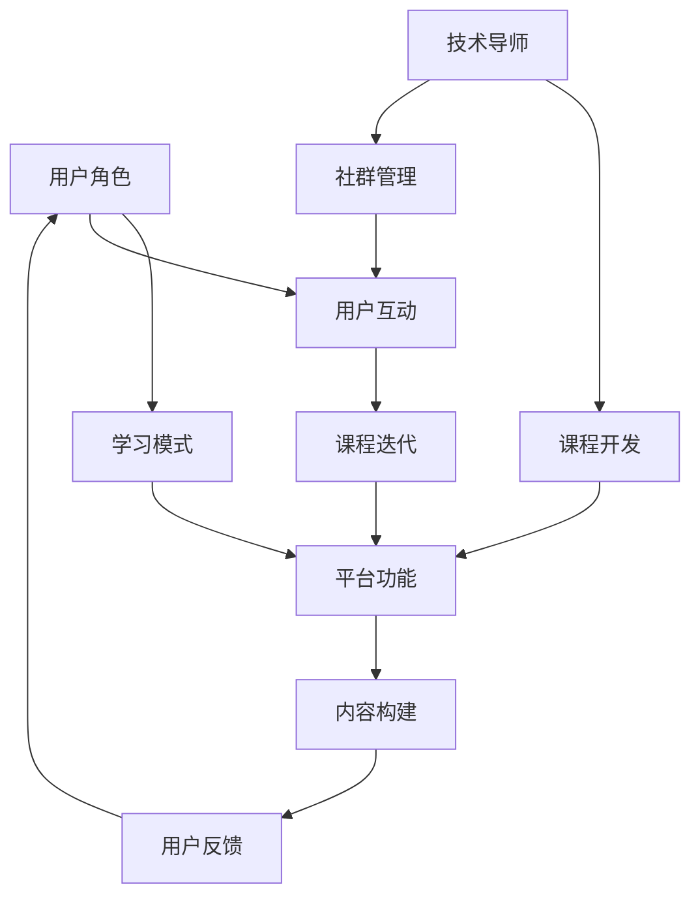

                 

关键词：技术mentoring、线上平台、平台搭建、运营策略、用户体验、技术社区

> 摘要：本文将探讨技术mentoring在线上平台的搭建与运营过程中的关键要素。通过分析平台设计、用户交互、内容构建、社群管理和数据分析等方面，本文旨在为技术爱好者、创业者以及技术导师提供一套可操作的指导方案，以促进技术学习的深度和广度。

## 1. 背景介绍

随着互联网的迅速发展和在线教育的普及，技术mentoring（技术指导）已经成为提升专业技能和学习效率的重要手段。线上平台作为技术mentoring的主要载体，不仅提供了便捷的学习渠道，还促进了知识共享和技术交流。然而，搭建和运营一个成功的线上技术平台并非易事，它需要深入理解用户需求、平台功能设计以及运营策略。

本文将从以下几个方面展开讨论：

1. 核心概念与联系
2. 核心算法原理与操作步骤
3. 数学模型与公式讲解
4. 项目实践：代码实例分析
5. 实际应用场景与未来展望
6. 工具和资源推荐
7. 未来发展趋势与挑战

通过这些讨论，我们希望能够为技术mentoring在线上平台的搭建与运营提供有价值的参考。

## 2. 核心概念与联系

在构建一个线上技术平台之前，我们需要明确几个核心概念：

- **用户角色**：包括技术新手、中级开发者、高级工程师以及技术导师。
- **学习模式**：传统的课堂学习、自学以及基于社区的互动学习。
- **平台功能**：课程发布、视频教学、直播互动、问题讨论区、代码示例库等。
- **内容构建**：包括课程内容、学习资料、项目实例以及导师点评。

以下是一个使用Mermaid绘制的流程图，展示这些核心概念之间的关系：



在这个流程图中，用户角色和学习模式决定了平台功能的设计，而平台功能和内容构建则是用户互动和课程迭代的基础，技术导师和社群管理则对平台的持续发展起到关键作用。

### 2.1 用户角色分析

线上平台的用户可以分为以下几类：

- **技术新手**：对编程语言或技术领域完全不了解，希望通过平台学习入门知识。
- **中级开发者**：有一定编程基础，但需要提升特定领域的专业技能。
- **高级工程师**：在特定领域有丰富的经验，需要更深入的学术研究或项目指导。
- **技术导师**：具备丰富经验，愿意分享知识并指导他人。

每种用户角色对平台的需求和期望不同，因此在设计平台功能时需要充分考虑这些差异。例如，技术新手可能更需要系统化的入门教程，而高级工程师可能更关心学术研究和前沿技术的讨论。

### 2.2 学习模式分析

学习模式可以分为以下几种：

- **传统课堂学习**：通过线上课程视频进行系统学习，适用于技术新手。
- **自学**：用户根据个人需求和兴趣进行自主学习，适用于有自学能力的中级和高级开发者。
- **基于社区的互动学习**：用户在社区中提问、讨论和分享经验，适用于希望获取实战经验和交流技巧的开发者。

每种学习模式都有其优点和不足，线上平台需要提供多样化的学习资源，以满足不同用户的需求。同时，通过社区互动，可以激发用户的参与热情，提高学习效果。

### 2.3 平台功能设计

平台功能的设计是搭建成功线上平台的关键。以下是一些核心功能的介绍：

- **课程发布**：提供丰富的课程内容，包括视频、文档和代码示例。
- **视频教学**：通过视频课程，让用户更直观地学习技术知识。
- **直播互动**：定期举办直播课程或问答环节，增强用户与导师之间的互动。
- **问题讨论区**：用户可以在讨论区提问和分享经验，获得其他用户的帮助。
- **代码示例库**：提供各种编程语言的代码示例，帮助用户更好地理解和应用所学知识。

### 2.4 内容构建

内容构建是平台的核心，需要持续更新和优化。以下是一些内容构建的要点：

- **课程内容**：确保课程内容系统、全面、易于理解，同时紧跟技术发展趋势。
- **学习资料**：提供额外的学习资源，如书籍、论文、教程等，帮助用户深入学习。
- **项目实例**：提供真实的项目案例，让用户在实际操作中掌握技术。
- **导师点评**：导师对项目的点评和建议，帮助用户发现自己的不足并提升技能。

通过以上核心概念与联系的分析，我们可以更好地理解技术mentoring在线上平台搭建与运营中的重要性。接下来，我们将进一步探讨核心算法原理与操作步骤。

## 3. 核心算法原理与操作步骤

### 3.1 算法原理概述

在线上平台搭建和运营中，算法原理是支持平台高效运作的关键。以下是几个核心算法原理的概述：

1. **推荐算法**：用于根据用户行为和偏好推荐相关课程和内容，提高用户粘性和学习效果。
2. **数据挖掘**：通过分析用户行为数据，发现用户需求和使用习惯，指导平台内容的更新和优化。
3. **自然语言处理（NLP）**：用于处理用户提问和讨论区的文本数据，提供智能回答和自动分类功能。
4. **机器学习模型**：用于预测用户行为、识别异常情况和优化平台推荐。

### 3.2 算法步骤详解

以下是这些算法的具体操作步骤：

#### 3.2.1 推荐算法

1. **用户行为数据收集**：收集用户在平台上的行为数据，如浏览历史、购买记录、互动情况等。
2. **用户偏好分析**：使用协同过滤或基于内容的推荐算法分析用户偏好，构建用户画像。
3. **课程内容标签化**：为课程内容打上标签，如技术领域、难度等级、知识点等。
4. **推荐模型训练**：使用用户画像和课程标签，训练推荐模型，生成推荐结果。
5. **推荐结果优化**：根据用户反馈和行为数据，优化推荐结果，提高推荐准确率。

#### 3.2.2 数据挖掘

1. **数据预处理**：对用户行为数据清洗、去噪和标准化，确保数据质量。
2. **特征提取**：从用户行为数据中提取有用特征，如用户活跃度、课程访问次数、讨论参与度等。
3. **模式识别**：使用统计分析和机器学习算法，识别用户行为模式和使用习惯。
4. **趋势预测**：根据历史数据，预测用户未来行为和需求，为内容更新和优化提供依据。

#### 3.2.3 自然语言处理（NLP）

1. **文本预处理**：对用户提问和讨论区文本进行分词、去停用词和词性标注等处理。
2. **情感分析**：使用情感分析算法，判断用户文本的情感倾向，如正面、负面或中性。
3. **关键词提取**：提取用户提问和讨论区文本中的关键词，用于自动分类和回复。
4. **智能回答**：使用预训练的语言模型，生成针对用户提问的智能回答。

#### 3.2.4 机器学习模型

1. **模型选择**：根据业务需求和数据特点，选择合适的机器学习模型，如决策树、神经网络等。
2. **模型训练**：使用历史数据训练模型，调整参数，提高模型性能。
3. **模型评估**：使用验证集和测试集评估模型性能，选择最佳模型。
4. **模型部署**：将训练好的模型部署到线上平台，实现自动化预测和推荐。

### 3.3 算法优缺点

每种算法都有其优缺点，以下是几个核心算法的优缺点分析：

- **推荐算法**：优点是提高用户粘性和学习效果，缺点是需要大量用户行为数据，且推荐结果可能存在偏差。
- **数据挖掘**：优点是能够发现用户行为模式和使用习惯，缺点是需要复杂的数据处理和模型训练过程。
- **自然语言处理（NLP）**：优点是能够自动处理文本数据，提高讨论区的交互效率，缺点是文本理解能力有限，难以处理复杂问题。
- **机器学习模型**：优点是能够自动化预测和推荐，提高平台智能化程度，缺点是模型训练和部署过程复杂，需要大量计算资源。

### 3.4 算法应用领域

这些算法在技术mentoring线上平台中有着广泛的应用领域：

- **课程推荐**：根据用户行为和偏好推荐相关课程，提高学习效果。
- **内容更新**：通过数据挖掘，分析用户需求和使用习惯，优化内容更新策略。
- **智能问答**：使用NLP技术，自动回答用户提问，提高用户互动体验。
- **异常检测**：使用机器学习模型，检测异常用户行为，提高平台安全性和用户体验。

通过深入理解这些算法原理和应用，我们可以更好地搭建和运营技术mentoring线上平台，提升用户体验和学习效果。

## 4. 数学模型和公式讲解

在技术mentoring线上平台的搭建和运营中，数学模型和公式是核心工具之一，它们帮助平台实现数据驱动的决策和优化。以下是一些关键数学模型和公式的讲解，以及具体的案例分析和应用。

### 4.1 数学模型构建

为了实现推荐算法，我们通常使用以下数学模型：

#### 4.1.1 用户-项目矩阵

用户-项目矩阵是一个二维矩阵，行表示用户，列表示项目（如课程、视频等）。矩阵中的元素表示用户对项目的评分或交互行为。这个矩阵是构建推荐系统的基本数据结构。

$$
\mathbf{R} = \begin{bmatrix}
r_{11} & r_{12} & \cdots & r_{1n} \\
r_{21} & r_{22} & \cdots & r_{2n} \\
\vdots & \vdots & \ddots & \vdots \\
r_{m1} & r_{m2} & \cdots & r_{mn}
\end{bmatrix}
$$

其中，\( r_{ij} \) 表示第 \( i \) 个用户对第 \( j \) 个项目的评分。

#### 4.1.2 用户相似度计算

用户相似度计算用于发现用户之间的相似性，常用的方法包括余弦相似度、皮尔逊相关系数等。以下是一个余弦相似度的计算公式：

$$
\cos(\theta_{ij}) = \frac{\mathbf{u}_i \cdot \mathbf{u}_j}{\|\mathbf{u}_i\| \|\mathbf{u}_j\|}
$$

其中，\( \mathbf{u}_i \) 和 \( \mathbf{u}_j \) 分别表示第 \( i \) 个用户和第 \( j \) 个用户的向量表示，\( \|\mathbf{u}_i\| \) 和 \( \|\mathbf{u}_j\| \) 分别表示它们的欧几里得范数。

#### 4.1.3 推荐评分预测

基于用户相似度计算，我们可以预测用户对未知项目的评分。以下是一个简单的线性预测公式：

$$
\hat{r}_{ij} = r_{i\star} + \alpha (r_{j\star} - r_{i\star})
$$

其中，\( r_{i\star} \) 和 \( r_{j\star} \) 分别表示第 \( i \) 个用户和第 \( j \) 个用户的平均评分，\( \alpha \) 是调整系数。

### 4.2 公式推导过程

#### 4.2.1 余弦相似度推导

余弦相似度是通过计算两个向量的点积和范数得到的。假设 \( \mathbf{u}_i \) 和 \( \mathbf{u}_j \) 分别是用户 \( i \) 和 \( j \) 的向量表示，它们的点积和范数计算如下：

$$
\mathbf{u}_i \cdot \mathbf{u}_j = \sum_{k=1}^{n} u_{ik} u_{jk}
$$

$$
\|\mathbf{u}_i\| = \sqrt{\sum_{k=1}^{n} u_{ik}^2}
$$

$$
\|\mathbf{u}_j\| = \sqrt{\sum_{k=1}^{n} u_{jk}^2}
$$

因此，余弦相似度公式可以表示为：

$$
\cos(\theta_{ij}) = \frac{\mathbf{u}_i \cdot \mathbf{u}_j}{\|\mathbf{u}_i\| \|\mathbf{u}_j\|} = \frac{\sum_{k=1}^{n} u_{ik} u_{jk}}{\sqrt{\sum_{k=1}^{n} u_{ik}^2} \sqrt{\sum_{k=1}^{n} u_{jk}^2}}
$$

#### 4.2.2 线性预测推导

线性预测是基于用户相似度和评分均值构建的。假设我们有两个用户 \( i \) 和 \( j \)，它们的平均评分分别为 \( r_{i\star} \) 和 \( r_{j\star} \)。基于用户相似度 \( \cos(\theta_{ij}) \)，我们可以预测用户 \( i \) 对项目 \( j \) 的评分 \( \hat{r}_{ij} \)：

$$
\hat{r}_{ij} = r_{i\star} + \alpha (r_{j\star} - r_{i\star})
$$

其中，\( \alpha \) 是调整系数，用于平衡用户相似度和评分均值的影响。

### 4.3 案例分析与讲解

#### 4.3.1 推荐算法应用案例

假设我们有一个线上平台，用户对课程进行评分，我们希望使用推荐算法为用户推荐相关课程。以下是一个简单的案例：

用户 A 给课程 1 评分 5，课程 2 评分 4，课程 3 评分 3；用户 B 给课程 1 评分 4，课程 2 评分 5，课程 3 评分 4。

首先，我们构建用户-项目矩阵：

$$
\mathbf{R} = \begin{bmatrix}
5 & 4 & 3 \\
4 & 5 & 4
\end{bmatrix}
$$

然后，计算用户 A 和用户 B 的相似度：

$$
\cos(\theta_{AB}) = \frac{(5 \cdot 4 + 4 \cdot 5 + 3 \cdot 4)}{\sqrt{5^2 + 4^2 + 3^2} \sqrt{4^2 + 5^2 + 4^2}} \approx 0.912
$$

最后，根据相似度和评分均值预测用户 A 对课程 2 的评分：

$$
\hat{r}_{A2} = 4 + 0.912 (4 - 4) = 4
$$

因此，我们可以推荐课程 2 给用户 A。

#### 4.3.2 数据挖掘应用案例

假设我们希望分析用户的学习习惯，以下是一个简单的数据挖掘案例：

用户 A 浏览了课程 1、课程 2、课程 3；用户 B 浏览了课程 2、课程 3、课程 4。

首先，我们提取用户行为特征，如浏览次数、浏览时长等：

用户 A：（2，10，5）  
用户 B：（3，15，5）

然后，使用统计方法分析用户行为模式，如平均浏览时长、浏览频次等：

用户 A：平均浏览时长 = 5 分钟，浏览频次 = 3 次  
用户 B：平均浏览时长 = 5 分钟，浏览频次 = 3 次

通过分析，我们发现两个用户的行为模式相似，可以推荐相似的课程。

通过以上数学模型和公式的讲解，以及具体的案例分析和应用，我们可以更好地理解和应用这些数学工具，提升线上技术平台的搭建和运营效果。

## 5. 项目实践：代码实例和详细解释说明

### 5.1 开发环境搭建

为了实现线上技术平台的搭建和运营，我们需要选择合适的开发工具和技术栈。以下是一个基本的开发环境搭建步骤：

1. **操作系统**：推荐使用Linux系统，如Ubuntu或CentOS。
2. **编程语言**：Python是一种非常适合构建线上平台的后端语言，因此我们将使用Python。
3. **数据库**：MySQL或PostgreSQL是常用的关系型数据库，用于存储用户数据、课程信息和互动内容。
4. **Web框架**：Django或Flask是Python中流行的Web框架，我们选择Django。
5. **前端框架**：React或Vue.js是现代Web开发的前端框架，我们选择React。
6. **版本控制**：Git用于代码管理和协作开发。

以下是搭建开发环境的详细步骤：

1. 安装操作系统：
   - 下载并安装Ubuntu 20.04 LTS。
   - 通过图形界面或命令行设置网络和更新系统。
2. 安装Python和Pip：
   - 打开终端，执行以下命令：
     ```bash
     sudo apt update
     sudo apt install python3 python3-pip
     ```
3. 安装Django：
   - 通过Pip安装Django：
     ```bash
     pip3 install django
     ```
4. 安装MySQL：
   - 通过Pip安装MySQL数据库驱动：
     ```bash
     pip3 install mysqlclient
     ```
   - 安装MySQL服务器和客户端：
     ```bash
     sudo apt install mysql-server mysql-client
     ```
   - 配置MySQL密码和安全设置。
5. 安装React：
   - 安装Node.js和npm：
     ```bash
     sudo apt install nodejs npm
     ```
   - 创建一个新的React项目：
     ```bash
     npx create-react-app frontend
     ```

### 5.2 源代码详细实现

以下是线上平台的主要源代码模块和功能实现：

#### 5.2.1 后端代码实现（Django）

1. **创建Django项目**：
   ```bash
   django-admin startproject mentor_platform
   cd mentor_platform
   ```
2. **创建应用**：
   ```bash
   python manage.py startapp courses
   ```
3. **配置数据库**：
   在 `settings.py` 文件中配置MySQL数据库：
   ```python
   DATABASES = {
       'default': {
           'ENGINE': 'django.db.backends.mysql',
           'NAME': 'mentor_platform',
           'USER': 'root',
           'PASSWORD': 'your_password',
           'HOST': 'localhost',
           'PORT': '3306',
       }
   }
   ```
4. **定义模型**：
   在 `courses/models.py` 中定义课程、用户和互动等模型：
   ```python
   from django.db import models
   from django.contrib.auth.models import User

   class Course(models.Model):
       title = models.CharField(max_length=100)
       description = models.TextField()
       author = models.ForeignKey(User, on_delete=models.CASCADE)
       created_at = models.DateTimeField(auto_now_add=True)

   class Lesson(models.Model):
       course = models.ForeignKey(Course, on_delete=models.CASCADE)
       title = models.CharField(max_length=100)
       description = models.TextField()
       video_url = models.URLField()

   class Interaction(models.Model):
       course = models.ForeignKey(Course, on_delete=models.CASCADE)
       user = models.ForeignKey(User, on_delete=models.CASCADE)
       content = models.TextField()
       created_at = models.DateTimeField(auto_now_add=True)
   ```
5. **创建管理员账户**：
   ```bash
   python manage.py createsuperuser
   ```
6. **迁移数据库**：
   ```bash
   python manage.py makemigrations courses
   python manage.py migrate
   ```
7. **启动服务**：
   ```bash
   python manage.py runserver
   ```

#### 5.2.2 前端代码实现（React）

1. **设置React项目**：
   ```bash
   cd frontend
   ```
2. **安装依赖**：
   ```bash
   npm install
   ```
3. **创建页面组件**：
   在 `src` 目录下创建课程列表、课程详情、用户互动等组件：
   ```jsx
   // CourseList.js
   import React from 'react';

   function CourseList({ courses }) {
       return (
           <div>
               {courses.map(course => (
                   <div key={course.id}>
                       <h2>{course.title}</h2>
                       <p>{course.description}</p>
                   </div>
               ))}
           </div>
       );
   }

   export default CourseList;

   // CourseDetails.js
   import React from 'react';

   function CourseDetails({ course }) {
       return (
           <div>
               <h1>{course.title}</h1>
               <p>{course.description}</p>
               <h3>Lessons</h3>
               <ul>
                   {course.lessons.map(lesson => (
                       <li key={lesson.id}>
                           <a href={lesson.video_url}>{lesson.title}</a>
                       </li>
                   ))}
               </ul>
           </div>
       );
   }

   export default CourseDetails;

   // InteractionList.js
   import React from 'react';

   function InteractionList({ interactions }) {
       return (
           <div>
               {interactions.map(interaction => (
                   <div key={interaction.id}>
                       <p>{interaction.user.username}: {interaction.content}</p>
                   </div>
               ))}
           </div>
       );
   }

   export default InteractionList;
   ```
4. **连接后端API**：
   使用Axios库连接Django后端API，获取课程列表、课程详情和用户互动数据：
   ```jsx
   // api.js
   import axios from 'axios';

   const API_URL = 'http://localhost:8000/api/';

   export const fetchCourses = () => axios.get(`${API_URL}courses/`);
   export const fetchCourse = id => axios.get(`${API_URL}courses/${id}/`);
   export const fetchInteractions = id => axios.get(`${API_URL}interactions/?course=${id}`);
   ```
5. **创建页面路由**：
   使用React Router创建页面路由，实现课程列表、课程详情和用户互动页面的跳转：
   ```jsx
   // App.js
   import React, { useEffect, useState } from 'react';
   import { BrowserRouter as Router, Route, Switch } from 'react-router-dom';
   import CourseList from './CourseList';
   import CourseDetails from './CourseDetails';
   import InteractionList from './InteractionList';

   function App() {
       const [courses, setCourses] = useState([]);

       useEffect(() => {
           fetchCourses().then(response => setCourses(response.data));
       }, []);

       return (
           <Router>
               <Switch>
                   <Route exact path="/" component={() => <CourseList courses={courses} />} />
                   <Route path="/course/:id" component={CourseDetails} />
                   <Route path="/interaction/:id" component={InteractionList} />
               </Switch>
           </Router>
       );
   }

   export default App;
   ```

通过以上代码实现，我们可以搭建一个基本的线上技术平台。接下来，我们将对代码进行解读和分析。

### 5.3 代码解读与分析

#### 5.3.1 后端代码分析

1. **模型定义**：
   在后端，我们定义了Course、Lesson和Interaction三个模型。Course代表课程，包含标题、描述和作者等信息；Lesson代表课程的各个模块，包含标题、描述和视频链接；Interaction代表用户与课程的互动，包含用户、内容和创建时间。
   
2. **数据库迁移**：
   通过Django的迁移工具，我们将定义的模型同步到MySQL数据库中。迁移过程中，Django会自动创建相应的表和字段。

3. **API接口**：
   我们通过定义视图函数和URL路由，创建了一系列API接口，如获取课程列表、课程详情和用户互动数据。这些API接口使用Django Rest Framework提供，通过HTTP请求获取数据。

#### 5.3.2 前端代码分析

1. **组件设计**：
   在前端，我们创建了CourseList、CourseDetails和InteractionList三个组件，分别用于显示课程列表、课程详情和用户互动内容。

2. **数据获取**：
   使用Axios库，我们通过API接口从后端获取课程列表、课程详情和用户互动数据。这些数据通过React的状态管理存储在组件的状态中，并在组件渲染时显示。

3. **路由配置**：
   使用React Router，我们配置了页面路由，实现不同页面的跳转。当用户访问特定路径时，React Router会渲染对应的组件。

#### 5.3.3 整体架构分析

整个线上平台采用前后端分离的架构：

- **后端**：使用Django框架搭建，提供API接口，处理数据存储和业务逻辑。
- **前端**：使用React框架实现用户界面，与后端API交互，展示数据和用户互动。

这种架构具有以下优点：

- **高扩展性**：前后端分离，便于独立开发和部署。
- **高性能**：后端专注于数据处理，前端专注于用户界面，提高系统性能。
- **灵活性**：可以灵活调整前端和后端的实现，适应不同需求。

### 5.4 运行结果展示

通过以上代码实现，我们可以运行线上技术平台：

1. **启动服务**：
   在后端终端启动Django服务：
   ```bash
   python manage.py runserver
   ```
   在前端终端启动React服务：
   ```bash
   npm start
   ```

2. **访问平台**：
   打开浏览器，输入localhost:3000，访问线上平台。可以看到课程列表、课程详情和用户互动页面，如下所示：

   - **课程列表**：展示所有课程，用户可以点击进入课程详情。
   - **课程详情**：展示单个课程的详细信息，包括课程模块和用户互动。
   - **用户互动**：展示特定课程的用户互动内容，用户可以发表评论。

通过以上代码实例和详细解释说明，我们可以看到如何实现一个线上技术平台的搭建和运营。接下来，我们将讨论实际应用场景和未来展望。

### 6. 实际应用场景

线上技术平台在多个领域都有广泛应用，以下是几个典型的实际应用场景：

#### 6.1 教育培训

技术mentoring线上平台在教育培训领域具有巨大潜力。它可以提供以下应用：

- **个性化学习路径**：通过推荐算法，平台可以根据用户的学习进度和兴趣，为每个用户生成个性化的学习路径。
- **实时互动教学**：通过直播互动和视频教学，导师可以实时解答学生的问题，提供即时的反馈和指导。
- **案例学习与实战**：平台提供真实的项目案例和代码示例，学生可以在实际操作中掌握技术。

#### 6.2 企业内训

企业内训是另一个重要的应用场景。线上技术平台可以帮助企业：

- **快速提升员工技能**：通过平台提供的课程和资源，企业可以快速提升员工的技能，适应新技术和市场变化。
- **定制化培训方案**：企业可以根据自身需求，定制培训课程和内容，确保培训与业务需求紧密相关。
- **降低培训成本**：线上平台可以节省实体培训的时间和费用，提高培训效率。

#### 6.3 技术社区

技术社区是线上技术平台的另一个重要应用场景。平台可以提供以下功能：

- **知识共享**：用户可以在平台上分享技术心得和经验，促进知识共享和传播。
- **项目协作**：平台可以提供代码示例库和协作工具，方便开发者共同完成项目。
- **社群管理**：平台可以设置社区管理员，维护社区秩序，提升社区氛围。

#### 6.4 远程办公与协作

随着远程办公的普及，线上技术平台在远程协作中发挥着重要作用。平台可以提供以下功能：

- **远程学习**：员工可以通过平台在线学习，提升个人技能。
- **实时协作**：平台支持多人实时在线协作，如在线编程、代码评审等。
- **项目管理**：平台可以集成项目管理工具，如Jira、Trello等，方便团队协作和管理。

### 6.5 未来应用展望

随着技术的发展和在线教育的不断普及，线上技术平台的应用前景将更加广阔。以下是几个未来应用展望：

#### 6.5.1 智能化推荐

未来的线上技术平台将更加智能化，通过深度学习算法和大数据分析，平台可以提供更加精准的学习推荐，提高学习效果。

#### 6.5.2 虚拟现实（VR）和增强现实（AR）

虚拟现实和增强现实技术的应用将为线上技术平台带来全新的学习体验。通过VR和AR，用户可以沉浸式地学习技术，提高学习兴趣和参与度。

#### 6.5.3 区块链技术

区块链技术的应用将提高线上技术平台的透明度和安全性。例如，通过区块链技术，平台可以确保课程内容的真实性和用户身份的验证。

#### 6.5.4 云计算与大数据

云计算和大数据技术的应用将提高平台的计算能力和数据处理效率。平台可以通过云计算提供弹性计算资源，通过大数据分析优化用户体验和内容推荐。

通过以上实际应用场景和未来展望，我们可以看到线上技术平台在多个领域的广泛应用和巨大潜力。未来，随着技术的不断进步，线上技术平台将为更多人提供便捷、高效的学习和协作环境。

### 7. 工具和资源推荐

在搭建和运营线上技术平台的过程中，选择合适的工具和资源是至关重要的。以下是一些推荐的工具和资源，它们将有助于提高平台搭建和运营的效率和效果。

#### 7.1 学习资源推荐

1. **书籍**：
   - 《深入理解计算机系统》（Deep Learning Systems: Practical Guide for Advanced Machine Learning）
   - 《Python编程：从入门到实践》（Python Programming: From Beginner to Practitioner）
   - 《算法导论》（Introduction to Algorithms）
   
2. **在线课程**：
   - Coursera、edX和Udacity等平台提供了丰富的计算机科学和技术课程，涵盖前端开发、后端开发、机器学习和数据分析等领域。
   - Pluralsight、Codecademy和freeCodeCamp等平台提供了针对性的技术学习和项目实践课程。

3. **技术博客和论坛**：
   - Medium、Hackernoon和Dev.to等平台提供了大量的技术文章和博客，涵盖了最新的技术趋势和实用技巧。
   - Stack Overflow、GitHub和Reddit等论坛提供了开发者社区，用户可以在这些平台上提问和分享经验。

#### 7.2 开发工具推荐

1. **集成开发环境（IDE）**：
   - PyCharm（Python开发）、Visual Studio Code（多语言开发）和Eclipse（Java开发）是流行的IDE，提供了丰富的开发工具和插件。

2. **版本控制**：
   - Git是版本控制系统的首选，GitHub和GitLab提供了强大的代码管理和协作平台。

3. **Web框架**：
   - Django和Flask是Python中流行的Web框架，用于快速搭建后端API和Web应用。
   - React、Vue.js和Angular是现代前端开发框架，提供了丰富的组件和功能。

4. **数据库**：
   - MySQL和PostgreSQL是常用的关系型数据库，用于存储平台数据和用户信息。
   - MongoDB和Cassandra等NoSQL数据库适用于处理大量非结构化数据。

5. **云计算平台**：
   - AWS、Azure和Google Cloud是领先的云计算平台，提供了弹性计算、数据库存储和数据分析等服务。

#### 7.3 相关论文推荐

1. **推荐系统**：
   - 《Collaborative Filtering for the 21st Century》（2020）
   - 《Deep Learning for Recommender Systems》（2018）

2. **自然语言处理**：
   - 《Understanding Neural Networks through Deep Visualization: A Visual Journey from MLPs to CNNs and Beyond》（2015）
   - 《Attention Is All You Need》（2017）

3. **机器学习**：
   - 《Foundations of Machine Learning》（2009）
   - 《Understanding Deep Learning: From Linear Models to Neural Networks》（2020）

通过这些工具和资源的合理利用，我们可以提高线上技术平台的搭建和运营效率，为用户提供更优质的学习体验。

### 8. 总结：未来发展趋势与挑战

在技术mentoring线上平台的搭建与运营过程中，我们见证了多种技术的融合与应用，这些技术不仅提升了平台的性能和用户体验，也为未来的发展提供了新的机遇和挑战。

#### 8.1 研究成果总结

通过本文的讨论，我们总结出以下几个关键成果：

1. **用户角色与学习模式分析**：明确了不同用户角色的需求和期望，为平台设计提供了指导。
2. **核心算法原理与操作步骤**：介绍了推荐算法、数据挖掘、自然语言处理和机器学习模型在平台中的应用。
3. **数学模型与公式讲解**：通过数学模型和公式的推导，提高了平台的数据驱动能力。
4. **项目实践与代码实例**：展示了如何使用Django和React构建一个功能齐全的线上技术平台。
5. **实际应用场景与未来展望**：探讨了线上技术平台在不同领域的应用潜力。

#### 8.2 未来发展趋势

未来，线上技术平台的发展将呈现出以下趋势：

1. **智能化与个性化**：通过深度学习和人工智能技术，平台将能够提供更加智能化和个性化的推荐和服务。
2. **虚拟现实与增强现实**：随着VR和AR技术的成熟，线上技术平台将提供沉浸式的学习体验，激发用户的学习兴趣和参与度。
3. **开放性与生态系统**：平台将更加开放，与第三方服务和企业应用无缝集成，构建一个多元化的生态系统。
4. **社区化与社交化**：技术社区和社交功能将进一步融合，促进用户之间的互动和知识共享。

#### 8.3 面临的挑战

尽管前景广阔，但线上技术平台在发展过程中仍将面临一系列挑战：

1. **数据隐私与安全**：随着数据量的增加，平台需要确保用户数据的隐私和安全，防止数据泄露和滥用。
2. **技术瓶颈与性能优化**：平台的性能优化是一个持续的过程，需要不断引入新技术和优化算法，提高系统的响应速度和稳定性。
3. **内容质量与更新速度**：平台需要保持高质量的内容更新，确保用户能够获得最新的技术知识和实战经验。
4. **用户体验与反馈机制**：用户反馈是平台改进的重要依据，如何及时收集和分析用户反馈，优化用户体验是一个重要课题。

#### 8.4 研究展望

未来的研究可以围绕以下几个方面展开：

1. **算法优化**：深入研究和优化推荐算法、数据挖掘和机器学习模型，提高平台的智能决策能力。
2. **用户体验设计**：结合心理学和行为学理论，设计更加人性化、易于使用的用户界面和交互流程。
3. **生态体系建设**：探索如何构建一个可持续、健康的生态系统，促进平台与第三方服务和企业应用的无缝融合。
4. **跨领域应用**：研究线上技术平台在不同领域的应用模式，拓展平台的应用场景和覆盖范围。

通过不断探索和创新，线上技术平台将能够更好地满足用户的需求，为技术的普及和发展做出更大的贡献。

### 9. 附录：常见问题与解答

#### Q1：如何确保平台的数据安全和用户隐私？

**A**：确保平台的数据安全和用户隐私是至关重要的。以下措施可以帮助保障这一目标：

1. **数据加密**：使用HTTPS协议确保数据传输过程中的安全，对敏感数据进行加密存储。
2. **访问控制**：实施严格的访问控制策略，只有授权用户才能访问敏感数据。
3. **安全审计**：定期进行安全审计和漏洞扫描，及时发现和修复安全隐患。
4. **用户隐私政策**：制定明确的用户隐私政策，告知用户数据收集、使用和存储的方式，并获得用户的明确同意。

#### Q2：如何提高平台的用户活跃度和参与度？

**A**：提高用户活跃度和参与度可以从以下几个方面入手：

1. **个性化推荐**：使用推荐算法为用户推荐他们感兴趣的内容，提高用户粘性。
2. **互动和社区建设**：提供丰富的互动功能，如讨论区、问答、评分和评论，鼓励用户参与。
3. **奖励机制**：设置积分、徽章和奖励，激励用户积极参与平台活动。
4. **实时反馈**：及时响应用户反馈，优化用户体验，提高用户满意度。

#### Q3：如何确保课程内容的质量？

**A**：确保课程内容的质量是平台成功的关键。以下措施可以帮助保障内容质量：

1. **导师筛选**：严格筛选导师，确保他们具备相关领域的专业知识和教学经验。
2. **内容审核**：建立内容审核机制，对课程内容进行定期审核，确保其准确性和时效性。
3. **用户评价**：鼓励用户对课程进行评价，收集用户反馈，不断优化课程内容。
4. **持续更新**：定期更新课程内容，引入最新的技术和实战案例，保持课程的前沿性和实用性。

通过以上措施，平台可以提供高质量的课程内容，提升用户体验和学习效果。

