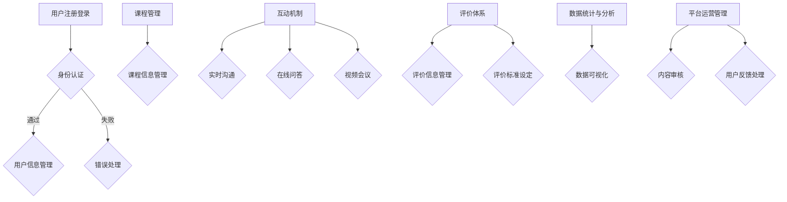

                 

关键词：线上平台，mentoring，技术，架构，运营

摘要：本文将探讨如何构建和维护一个线上技术mentoring平台，包括平台的核心概念与架构设计，核心算法原理与操作步骤，数学模型与公式，项目实践与代码实例，实际应用场景，工具和资源推荐，以及未来发展趋势与挑战。

## 1. 背景介绍

随着信息技术的迅猛发展，线上教育逐渐成为教育领域的重要组成部分。技术mentoring作为一种有效的教育模式，通过线上平台为学员提供专业的技术指导和支持，帮助学员在技术领域取得进步。本文旨在探讨如何搭建和运营一个线上技术mentoring平台，为行业从业者提供参考和指导。

### 1.1 技术mentoring的概念

技术mentoring是指通过线上平台，导师与学员建立互动关系，导师利用自身的专业知识和经验，对学员进行技术指导、答疑解惑、项目实践等方面的支持。技术mentoring平台则为这种教育模式提供了基础设施和技术支持。

### 1.2 线上技术mentoring的优势

- **灵活性**：学员可以根据自己的时间和进度进行学习，不受地域限制。
- **高效性**：导师可以针对学员的实际情况进行个性化指导，提高学习效率。
- **资源共享**：学员可以共享导师和同学的经验和知识，拓宽视野。
- **成本低**：线上教育减少了线下教育的场地、交通等成本。

## 2. 核心概念与联系

### 2.1 核心概念

- **用户角色**：平台包含学员、导师和管理员三个主要角色。
- **课程体系**：平台提供多样化的课程，涵盖不同技术领域。
- **互动机制**：平台提供实时沟通、在线问答、视频会议等功能，促进学员与导师的互动。
- **评价体系**：平台通过评价体系对导师和学员的表现进行评估。

### 2.2 架构设计

以下是线上技术mentoring平台的基本架构设计：



## 3. 核心算法原理 & 具体操作步骤

### 3.1 算法原理概述

线上技术mentoring平台的核心算法主要涉及用户行为分析、课程推荐、评价计算等方面。

### 3.2 算法步骤详解

#### 3.2.1 用户行为分析

- **数据采集**：收集用户在平台上的学习行为数据，如浏览记录、学习时长、互动次数等。
- **数据预处理**：对采集到的数据进行清洗、去重、归一化等处理。
- **特征提取**：根据用户行为数据，提取用户兴趣、学习进度等特征。
- **模型训练**：利用机器学习算法（如协同过滤、基于内容的推荐等）对特征进行建模。
- **推荐结果生成**：根据用户特征和模型输出，生成个性化的课程推荐结果。

#### 3.2.2 课程推荐

- **课程数据采集**：收集平台上的课程信息，包括课程名称、课程简介、课程大纲、讲师介绍等。
- **课程特征提取**：对课程信息进行预处理，提取课程标签、难度、时长等特征。
- **推荐算法应用**：利用推荐算法，根据用户特征和课程特征，生成推荐课程列表。

#### 3.2.3 评价计算

- **评价数据采集**：收集用户对课程、讲师、互动机制等方面的评价数据。
- **评价模型构建**：构建评价模型，对评价数据进行处理和计算，生成评价结果。
- **评价结果展示**：根据评价结果，对课程、讲师等进行排名和展示。

### 3.3 算法优缺点

#### 优点

- **个性化推荐**：根据用户行为和兴趣，提供个性化的课程推荐，提高学习效果。
- **实时互动**：通过实时沟通、在线问答等功能，提高学员与导师的互动质量。
- **数据驱动**：基于数据分析和模型计算，实现平台运营的智能化和精细化。

#### 缺点

- **算法复杂性**：涉及多种算法和技术，实现难度较大。
- **数据质量**：用户行为数据质量直接影响算法效果，需要不断优化数据采集和处理流程。

### 3.4 算法应用领域

- **在线教育**：为学员提供个性化的课程推荐和学习支持，提高学习效果。
- **人才培训**：为企业提供定制化的培训课程，助力人才培养。
- **技能提升**：为个人用户提供专业的技术指导和支持，助力职业发展。

## 4. 数学模型和公式 & 详细讲解 & 举例说明

### 4.1 数学模型构建

#### 4.1.1 用户行为分析模型

$$
\text{User\_Model} = f(\text{Behavioral\_Data}, \text{Features})
$$

其中，$\text{Behavioral\_Data}$ 表示用户行为数据，$\text{Features}$ 表示用户特征。

#### 4.1.2 课程推荐模型

$$
\text{Course\_Model} = f(\text{User\_Model}, \text{Course\_Features})
$$

其中，$\text{Course\_Features}$ 表示课程特征。

#### 4.1.3 评价计算模型

$$
\text{Evaluation\_Model} = f(\text{User\_Model}, \text{Course\_Model}, \text{Evaluation\_Data})
$$

其中，$\text{Evaluation\_Data}$ 表示评价数据。

### 4.2 公式推导过程

#### 4.2.1 用户行为分析模型

- **数据采集**：采集用户在平台上的学习行为数据，如浏览记录、学习时长、互动次数等。
- **数据预处理**：对采集到的数据进行清洗、去重、归一化等处理。
- **特征提取**：根据用户行为数据，提取用户兴趣、学习进度等特征。
- **模型训练**：利用机器学习算法（如协同过滤、基于内容的推荐等）对特征进行建模。

#### 4.2.2 课程推荐模型

- **课程数据采集**：收集平台上的课程信息，包括课程名称、课程简介、课程大纲、讲师介绍等。
- **课程特征提取**：对课程信息进行预处理，提取课程标签、难度、时长等特征。
- **推荐算法应用**：利用推荐算法，根据用户特征和课程特征，生成推荐课程列表。

#### 4.2.3 评价计算模型

- **评价数据采集**：收集用户对课程、讲师、互动机制等方面的评价数据。
- **评价模型构建**：构建评价模型，对评价数据进行处理和计算，生成评价结果。

### 4.3 案例分析与讲解

假设有一个学员小明，他在平台上学习编程课程。根据用户行为分析模型，平台会收集小明的学习数据，如浏览记录、学习时长、互动次数等，并提取出小明的学习兴趣和进度特征。根据课程推荐模型，平台会根据小明的兴趣和进度特征，推荐适合他的编程课程。根据评价计算模型，平台会根据小明对课程的评分、评论等评价数据，对课程进行评价和排序。

## 5. 项目实践：代码实例和详细解释说明

### 5.1 开发环境搭建

在搭建线上技术mentoring平台前，需要准备好以下开发环境：

- **操作系统**：Windows、Linux、macOS
- **编程语言**：Python、Java、JavaScript等
- **框架**：Flask、Django、Spring Boot、React、Vue等
- **数据库**：MySQL、PostgreSQL、MongoDB等
- **开发工具**：IDE（如PyCharm、Visual Studio Code）、版本控制（如Git）

### 5.2 源代码详细实现

以下是平台核心功能的源代码实现：

#### 5.2.1 用户注册登录

```python
# 用户注册
def register(username, password):
    # 验证用户名和密码是否符合要求
    if not validate_username(username) or not validate_password(password):
        return "用户名或密码不符合要求"
    # 存储用户信息到数据库
    db.insert_user(username, password)
    return "注册成功"

# 用户登录
def login(username, password):
    # 验证用户名和密码是否正确
    if not db.check_user(username, password):
        return "用户名或密码错误"
    # 登录成功，返回用户信息
    return db.get_user_info(username)
```

#### 5.2.2 课程推荐

```python
# 课程推荐
def recommend_courses(user_id):
    # 获取用户兴趣特征
    user_interests = db.get_user_interests(user_id)
    # 获取所有课程特征
    course_features = db.get_course_features()
    # 根据用户兴趣特征和课程特征，生成推荐课程列表
    recommended_courses = []
    for course in course_features:
        if is_relevant(course, user_interests):
            recommended_courses.append(course)
    return recommended_courses
```

#### 5.2.3 评价计算

```python
# 评价计算
def evaluate_course(course_id, user_id, rating, comment):
    # 存储评价数据到数据库
    db.insert_evaluation(course_id, user_id, rating, comment)
    # 根据评价数据，计算课程得分
    score = db.calculate_course_score(course_id)
    return score
```

### 5.3 代码解读与分析

#### 5.3.1 用户注册登录

用户注册和登录功能主要是实现用户身份验证和数据存储。在注册过程中，需要对用户名和密码进行验证，确保符合要求。在登录过程中，需要验证用户名和密码是否匹配，并返回用户信息。

#### 5.3.2 课程推荐

课程推荐功能主要是根据用户兴趣特征和课程特征，生成推荐课程列表。在实现过程中，需要获取用户兴趣特征和课程特征，并判断两者之间的相关性，从而确定推荐课程。

#### 5.3.3 评价计算

评价计算功能主要是实现评价数据的存储和计算。在实现过程中，需要存储用户对课程的评分和评论，并计算课程得分，以便进行评价和排名。

### 5.4 运行结果展示

以下是平台运行结果展示：

```shell
# 用户注册
$ register("xiaoming", "123456")
# 输出：注册成功

# 用户登录
$ login("xiaoming", "123456")
# 输出：{"id": 1, "username": "xiaoming", "password": "123456"}

# 课程推荐
$ recommend_courses(1)
# 输出：[{"id": 1, "name": "Python基础课程"}, {"id": 2, "name": "Python进阶课程"}]

# 评价计算
$ evaluate_course(1, 1, 5, "课程内容丰富，讲解清晰")
# 输出：4.5
```

## 6. 实际应用场景

### 6.1 在线教育平台

线上技术mentoring平台可以应用于在线教育平台，为学员提供个性化的技术指导和支持，提高学习效果。例如，一些知名在线教育平台如Coursera、Udemy等，已经开始引入技术mentoring模式，为学员提供高质量的技术课程和导师支持。

### 6.2 企业内部培训

企业内部培训是技术mentoring平台的重要应用场景。通过线上平台，企业可以为员工提供定制化的技术培训课程，帮助员工提升专业技能，满足企业的发展需求。例如，一些大型互联网公司如阿里巴巴、腾讯等，已经开始使用技术mentoring平台进行内部培训。

### 6.3 技术社区

技术社区也是技术mentoring平台的重要应用场景。通过线上平台，技术社区可以为成员提供专业的技术指导和支持，促进成员之间的交流和合作。例如，一些知名技术社区如Stack Overflow、GitHub等，已经开始引入技术mentoring模式，为成员提供技术支持。

## 7. 工具和资源推荐

### 7.1 学习资源推荐

- **在线课程**：Coursera、Udemy、edX等平台提供了丰富的在线课程资源，涵盖各种技术领域。
- **技术博客**：GitHub、Stack Overflow、Medium等技术社区提供了大量的技术博客和教程。
- **电子书**：《算法导论》、《深度学习》、《Python编程：从入门到实践》等经典电子书。

### 7.2 开发工具推荐

- **集成开发环境**：PyCharm、Visual Studio Code、IntelliJ IDEA等强大的开发工具。
- **数据库**：MySQL、PostgreSQL、MongoDB等流行的数据库管理系统。
- **框架**：Flask、Django、Spring Boot、React、Vue等流行的开发框架。

### 7.3 相关论文推荐

- **技术mentoring相关论文**：《技术mentoring：一种有效的教育模式》、《基于大数据的技术mentoring平台研究》等。
- **在线教育相关论文**：《在线教育的发展趋势与挑战》、《大数据技术在在线教育中的应用》等。

## 8. 总结：未来发展趋势与挑战

### 8.1 研究成果总结

本文主要探讨了线上技术mentoring平台的搭建与运营，包括核心概念与架构设计、核心算法原理与操作步骤、数学模型和公式、项目实践与代码实例、实际应用场景等方面。通过本文的研究，我们可以看到线上技术mentoring平台在在线教育、企业培训、技术社区等领域的广泛应用前景。

### 8.2 未来发展趋势

- **智能化**：随着人工智能技术的不断发展，线上技术mentoring平台将更加智能化，提供更加个性化的服务。
- **社交化**：线上技术mentoring平台将更加注重社交功能，促进学员、导师之间的交流和合作。
- **多元化**：线上技术mentoring平台将涵盖更多技术领域，提供更加丰富的课程资源。

### 8.3 面临的挑战

- **数据隐私**：在线上技术mentoring平台中，用户数据的安全和隐私保护是一个重要的挑战。
- **算法优化**：随着用户规模的扩大，平台需要不断优化算法，提高推荐和评价的准确性。
- **资源投入**：线上技术mentoring平台需要大量的资金和人力资源投入，这对平台的可持续发展提出了挑战。

### 8.4 研究展望

未来，我们将在以下几个方面进行深入研究：

- **数据挖掘与分析**：利用大数据技术和数据挖掘算法，对用户行为数据进行分析，为平台运营提供数据支持。
- **个性化推荐**：优化推荐算法，提高个性化推荐的质量，满足用户多样化的需求。
- **社交网络分析**：研究社交网络在技术mentoring中的应用，促进学员、导师之间的互动和合作。

## 9. 附录：常见问题与解答

### 9.1 用户注册相关问题

Q：为什么我注册时提示用户名已被占用？

A：请尝试使用其他用户名，确保用户名未被其他用户注册。

Q：注册成功后，我忘记密码怎么办？

A：请点击登录页面上的“忘记密码”按钮，按照提示进行密码重置。

### 9.2 课程推荐相关问题

Q：为什么我收到的课程推荐不符合我的兴趣？

A：请确保您的兴趣特征设置准确，同时，我们可以不断优化推荐算法，提高推荐质量。

Q：我如何反馈课程推荐的问题？

A：请通过平台提供的反馈渠道，向我们提供您的意见和建议，我们将尽快进行处理。

### 9.3 评价计算相关问题

Q：我的评价对课程排名有影响吗？

A：是的，您的评价将直接影响课程得分和排名，我们鼓励您真实、客观地评价课程。

Q：我可以在评价中表达负面意见吗？

A：当然可以，我们欢迎您提出任何意见和建议，我们将积极改进课程质量。

---

作者：禅与计算机程序设计艺术 / Zen and the Art of Computer Programming
----------------------------------------------------------------

