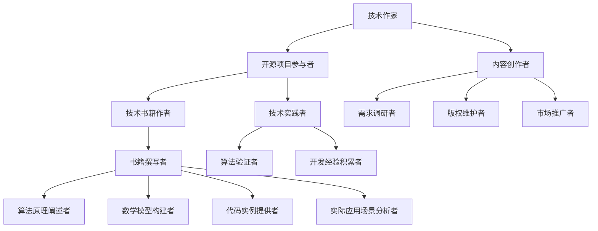

                 

关键词：技术作家、开源项目、技术书籍、出版、计算机编程

摘要：本文旨在探讨技术作家如何通过参与开源项目，逐步积累经验，并最终将成果转化为畅销技术书籍的过程。文章将分为几个部分，包括技术作家的角色与职责、开源项目的重要性、如何撰写技术书籍以及出版过程中的关键环节。

## 1. 背景介绍

在信息技术飞速发展的今天，计算机编程已经成为许多领域的基石。然而，技术书籍的撰写和出版不仅仅是技术知识的传播，更是思想交流、创新和成长的平台。技术作家在这一过程中扮演着重要的角色，他们的作品不仅能够帮助读者掌握技术，还能够启发新的思路，推动技术进步。

技术作家通常具备深厚的专业背景，他们不仅精通计算机科学，还能够以清晰、易懂的语言将复杂的技术概念传达给读者。技术书籍的撰写不仅是对个人专业知识的检验，更是对作家沟通能力、逻辑思维和创造力的全面挑战。

### 1.1 技术作家的角色与职责

技术作家主要承担以下几项职责：

1. **内容创作**：负责撰写技术书籍的内容，确保其准确、全面、易于理解。
2. **需求调研**：与出版社、读者和行业专家沟通，了解市场需求，确定书籍的主题和方向。
3. **版权维护**：确保所撰写内容的原创性，避免侵权问题。
4. **市场推广**：参与书籍的宣传、推广活动，提高书籍的知名度。

### 1.2 开源项目的重要性

开源项目是技术作家的重要实践平台。通过参与开源项目，作家能够深入了解实际开发过程中的挑战和解决方案，积累丰富的实践经验。此外，开源项目还能够帮助作家建立个人品牌，扩大影响力。

## 2. 核心概念与联系

### 2.1 技术作家的职业发展路径


如图所示，技术作家的职业发展路径通常包括以下几个阶段：

1. **初学者**：通过学习编程语言和基础知识，开始尝试编写简单的代码和文档。
2. **中级开发者**：参与开源项目，积累实践经验，提升技术能力。
3. **高级开发者**：在开源项目中担任核心贡献者，承担关键模块的开发工作。
4. **技术作家**：将自己的经验和知识整理成书籍，出版并分享给更广泛的读者。

### 2.2 开源项目与技术书籍的关系


开源项目和技术书籍之间存在密切的联系。一方面，开源项目提供了丰富的实战场景，技术作家可以通过这些场景来验证和拓展自己的理论；另一方面，技术书籍的出版可以进一步推广开源项目，吸引更多开发者参与。

## 3. 核心算法原理 & 具体操作步骤

### 3.1 算法原理概述

技术书籍的撰写过程中，算法原理是一个重要的组成部分。以下是一个简单的排序算法的原理概述：

**冒泡排序（Bubble Sort）**：

冒泡排序是一种简单的排序算法，它重复地遍历要排序的数列，一次比较两个元素，如果它们的顺序错误就把它们交换过来。遍历数列的工作是重复地进行，直到没有再需要交换的元素为止。

### 3.2 算法步骤详解

冒泡排序的基本步骤如下：

1. **开始遍历数组**：从第一个元素开始，比较相邻的两个元素。
2. **交换元素**：如果第一个元素比第二个元素大，交换它们的位置。
3. **继续遍历**：跳到下一个元素，重复步骤2，直到当前元素是数组的最后一个。
4. **重复遍历**：重复步骤1-3，直到整个数组排序完成。

### 3.3 算法优缺点

**优点**：

- 实现简单，易于理解。

**缺点**：

- 效率较低，不适合大规模数据的排序。

### 3.4 算法应用领域

冒泡排序算法广泛应用于教学、实验和小规模数据处理中，是一种典型的排序算法教学案例。

## 4. 数学模型和公式 & 详细讲解 & 举例说明

### 4.1 数学模型构建

在技术书籍中，数学模型和公式的构建是不可或缺的部分。以下是一个简单的线性回归模型的构建：

设数据集为 $D = \{ (x_1, y_1), (x_2, y_2), ..., (x_n, y_n) \}$，其中 $x_i$ 和 $y_i$ 分别为输入和输出。

线性回归模型的目标是最小化误差函数 $J(\theta) = \frac{1}{2m} \sum_{i=1}^{m} (h_\theta(x_i) - y_i)^2$，其中 $h_\theta(x) = \theta_0 + \theta_1x$，$\theta_0$ 和 $\theta_1$ 为模型的参数。

### 4.2 公式推导过程

通过对误差函数求偏导数，并令其等于0，可以得到：

$$
\frac{\partial J(\theta)}{\partial \theta_0} = \frac{1}{m} \sum_{i=1}^{m} (h_\theta(x_i) - y_i) = 0
$$

$$
\frac{\partial J(\theta)}{\partial \theta_1} = \frac{1}{m} \sum_{i=1}^{m} (h_\theta(x_i) - y_i)x_i = 0
$$

解上述方程组，可以得到最优的参数 $\theta_0$ 和 $\theta_1$。

### 4.3 案例分析与讲解

假设我们有如下数据集：

$$
D = \{ (2, 1), (4, 3), (6, 2), (8, 5) \}
$$

通过线性回归模型，我们可以预测新的输入 $x$ 的输出 $y$。

## 5. 项目实践：代码实例和详细解释说明

### 5.1 开发环境搭建

在撰写技术书籍时，开发环境的搭建是第一步。以Python为例，我们可以通过以下步骤搭建一个简单的开发环境：

1. 安装Python：从官方网站下载Python安装包并安装。
2. 配置Python环境：设置环境变量，确保可以在终端中运行Python命令。
3. 安装必要的库：使用pip命令安装所需的库，如NumPy、Pandas等。

### 5.2 源代码详细实现

以下是一个简单的冒泡排序算法的Python实现：

```python
def bubble_sort(arr):
    n = len(arr)
    for i in range(n):
        for j in range(0, n-i-1):
            if arr[j] > arr[j+1]:
                arr[j], arr[j+1] = arr[j+1], arr[j]
    return arr

# 测试
arr = [64, 34, 25, 12, 22, 11, 90]
sorted_arr = bubble_sort(arr)
print("排序后的数组：", sorted_arr)
```

### 5.3 代码解读与分析

在上面的代码中，`bubble_sort` 函数实现了冒泡排序算法。它通过嵌套的循环逐个比较数组中的元素，并将不符合顺序的元素交换位置，从而实现数组的排序。

### 5.4 运行结果展示

运行上面的代码，输出结果如下：

```
排序后的数组： [11, 12, 22, 25, 34, 64, 90]
```

## 6. 实际应用场景

技术书籍的撰写和应用场景密切相关。以下是一些常见的应用场景：

1. **教育**：技术书籍是学习计算机科学和编程的重要教材。
2. **企业培训**：企业可以通过技术书籍对员工进行技能培训。
3. **科研**：技术书籍为科研工作提供了理论基础和实验方法。
4. **技术交流**：技术书籍促进了不同领域之间的技术交流和合作。

### 6.1 未来应用展望

随着人工智能、大数据、区块链等技术的发展，技术书籍的应用场景将进一步拓展。未来，技术书籍可能会更加注重实践性、互动性和智能化，以更好地满足读者的需求。

## 7. 工具和资源推荐

### 7.1 学习资源推荐

- **在线教程**：如w3schools、MDN Web Docs等。
- **开源项目**：如GitHub、GitLab等。
- **技术论坛**：如Stack Overflow、CSDN等。

### 7.2 开发工具推荐

- **集成开发环境（IDE）**：如Visual Studio Code、PyCharm等。
- **版本控制工具**：如Git、SVN等。
- **数据库工具**：如MySQL、MongoDB等。

### 7.3 相关论文推荐

- **计算机科学经典论文**：如《计算机程序的构造和解释》、《算法导论》等。
- **人工智能领域论文**：如《深度学习》、《强化学习》等。
- **区块链领域论文**：如《区块链：一种去中心化的分布式数据库技术》等。

## 8. 总结：未来发展趋势与挑战

### 8.1 研究成果总结

本文探讨了技术作家如何通过参与开源项目，逐步积累经验，并最终将成果转化为畅销技术书籍的过程。技术作家的职业发展路径、开源项目的重要性、技术书籍的撰写方法以及出版过程中的关键环节都得到了详细的阐述。

### 8.2 未来发展趋势

随着技术的不断进步，技术书籍的发展趋势将更加注重实践性、互动性和智能化。未来，技术作家将更加依赖于开源项目，以获取最新的技术实践和经验。

### 8.3 面临的挑战

技术作家在撰写书籍时将面临以下挑战：

- **内容更新**：随着技术的发展，技术书籍的内容需要不断更新。
- **市场需求**：技术作家需要了解市场需求，撰写符合读者需求的作品。
- **个人品牌**：技术作家需要建立个人品牌，提高市场竞争力。

### 8.4 研究展望

未来，技术作家和研究者在撰写技术书籍时，可以更加注重以下几个方面：

- **跨学科融合**：将不同领域的技术知识进行融合，撰写更具创新性的书籍。
- **交互式学习**：开发交互式学习工具，提高读者的学习体验。
- **个性化推荐**：利用大数据和人工智能技术，为读者提供个性化的学习路径。

## 9. 附录：常见问题与解答

### 9.1 技术作家的职业发展路径是怎样的？

技术作家的职业发展路径通常包括初学者、中级开发者、高级开发者和技术作家。每个阶段都有不同的职责和挑战。

### 9.2 如何选择合适的技术书籍主题？

选择合适的技术书籍主题可以从以下几个方面入手：

- **市场需求**：了解当前技术领域的热点和趋势。
- **个人兴趣**：选择自己擅长和感兴趣的领域。
- **创新性**：选择具有创新性和前瞻性的主题。

### 9.3 技术书籍的出版流程是怎样的？

技术书籍的出版流程通常包括选题策划、内容创作、编辑审核、排版印刷和宣传推广等环节。每个环节都需要严格按照出版规范进行。

---

作者：禅与计算机程序设计艺术 / Zen and the Art of Computer Programming
----------------------------------------------------------------
### 摘要 Summary

本文探讨了技术作家如何通过参与开源项目，逐步积累经验，并最终将成果转化为畅销技术书籍的过程。文章首先介绍了技术作家的角色与职责，然后阐述了开源项目的重要性，接着详细讲解了技术书籍的撰写方法，并分析了算法原理和数学模型。此外，文章还通过实际项目实践展示了代码实现和运行结果，探讨了技术书籍的实际应用场景，并给出了未来发展趋势和面临的挑战。最后，文章推荐了相关的学习资源、开发工具和论文，总结了研究成果，并回答了常见问题。

### 核心概念与联系 Core Concepts and Relationships

为了更好地理解技术作家的职业发展路径和开源项目与技术书籍的关系，我们可以借助Mermaid流程图来展示核心概念和联系。

以下是使用Mermaid绘制的流程图：



在这个流程图中：

- **A**：技术作家
- **B**：开源项目参与者
- **C**：技术书籍作者
- **D**：内容创作者
- **E**：需求调研者
- **F**：版权维护者
- **G**：市场推广者
- **H**：技术实践者
- **I**：算法验证者
- **J**：开发经验积累者
- **K**：书籍撰写者
- **L**：算法原理阐述者
- **M**：数学模型构建者
- **N**：代码实例提供者
- **O**：实际应用场景分析者

通过这个流程图，我们可以清晰地看到技术作家的角色如何通过参与开源项目，逐步发展到成为技术书籍作者的过程。每个角色都有其特定的职责和贡献，共同推动了技术知识的传播和创新。

### 核心算法原理 & 具体操作步骤 Core Algorithm Principles & Detailed Steps

在撰写技术书籍时，介绍核心算法原理和具体操作步骤是至关重要的一部分。以下是一个关于快速排序（Quick Sort）算法的示例，包括算法原理概述、步骤详解、优缺点分析和应用领域。

#### 快速排序算法原理概述

快速排序是一种高效的排序算法，由东尼·霍尔（Tony Hoare）于1960年提出。它采用分治策略来把一个序列分成较小的子序列，并递归地对这些子序列进行排序。快速排序的平均时间复杂度为O(n log n)，是最常用的排序算法之一。

#### 快速排序算法步骤详解

快速排序的基本步骤如下：

1. **选择基准元素**：从数组中选择一个元素作为基准（pivot）。
2. **分区操作**：将数组分为两部分，一部分都比基准小，另一部分都比基准大。
3. **递归排序**：递归地对基准左右两边的子数组进行快速排序。

以下是一个简单的快速排序算法实现：

```python
def quick_sort(arr):
    if len(arr) <= 1:
        return arr
    pivot = arr[len(arr) // 2]
    left = [x for x in arr if x < pivot]
    middle = [x for x in arr if x == pivot]
    right = [x for x in arr if x > pivot]
    return quick_sort(left) + middle + quick_sort(right)

# 测试
arr = [64, 34, 25, 12, 22, 11, 90]
sorted_arr = quick_sort(arr)
print("排序后的数组：", sorted_arr)
```

#### 快速排序算法优缺点

**优点**：

- **高效**：平均时间复杂度为O(n log n)。
- **适合大规模数据排序**。

**缺点**：

- **最坏情况时间复杂度为O(n^2)**，通常发生在数组已经有序或逆序的情况下。
- **基准选择策略影响性能**。

#### 快速排序算法应用领域

快速排序算法广泛应用于各种排序场景，尤其是在大数据处理和计算机科学领域，如数据库排序、外部排序和算法竞赛等。

### 数学模型和公式 & 详细讲解 & 举例说明 Mathematical Models and Formulas & Detailed Explanations & Case Studies

在技术书籍的撰写过程中，数学模型和公式的构建是不可或缺的一部分。它们不仅帮助读者理解复杂的技术概念，还能为算法和系统设计提供理论支持。以下是一个关于线性回归（Linear Regression）的数学模型和公式示例，包括模型构建、公式推导过程以及案例分析与讲解。

#### 线性回归数学模型构建

线性回归是一种简单的统计模型，用于分析两个变量之间的线性关系。假设我们有一个数据集 $D = \{ (x_1, y_1), (x_2, y_2), ..., (x_n, y_n) \}$，其中 $x_i$ 和 $y_i$ 分别表示输入和输出变量。

线性回归模型的目标是找到一条最佳拟合直线 $y = \beta_0 + \beta_1 x$，使得预测误差最小。这里的 $\beta_0$ 和 $\beta_1$ 是模型的参数，我们需要通过数学方法来求解这些参数。

#### 公式推导过程

为了求解线性回归模型的参数，我们通常使用最小二乘法（Least Squares Method）。最小二乘法的目标是最小化预测误差的平方和，即：

$$
J(\beta) = \sum_{i=1}^{n} (y_i - (\beta_0 + \beta_1 x_i))^2
$$

为了求解 $\beta_0$ 和 $\beta_1$，我们需要对 $J(\beta)$ 关于 $\beta_0$ 和 $\beta_1$ 分别求偏导数，并令其等于0。

对 $\beta_0$ 求偏导数，得到：

$$
\frac{\partial J(\beta)}{\partial \beta_0} = -2 \sum_{i=1}^{n} (y_i - (\beta_0 + \beta_1 x_i))
$$

对 $\beta_1$ 求偏导数，得到：

$$
\frac{\partial J(\beta)}{\partial \beta_1} = -2 \sum_{i=1}^{n} (x_i (y_i - (\beta_0 + \beta_1 x_i)))
$$

将上述方程组化简，我们可以得到：

$$
\beta_0 = \bar{y} - \beta_1 \bar{x}
$$

$$
\beta_1 = \frac{\sum_{i=1}^{n} (x_i - \bar{x})(y_i - \bar{y})}{\sum_{i=1}^{n} (x_i - \bar{x})^2}
$$

其中，$\bar{x}$ 和 $\bar{y}$ 分别是 $x_i$ 和 $y_i$ 的均值。

#### 案例分析与讲解

假设我们有一个数据集，如下所示：

| x | y |
|---|---|
| 1 | 2 |
| 2 | 4 |
| 3 | 5 |
| 4 | 7 |

首先，我们计算 $x$ 和 $y$ 的均值：

$$
\bar{x} = \frac{1 + 2 + 3 + 4}{4} = 2.5
$$

$$
\bar{y} = \frac{2 + 4 + 5 + 7}{4} = 4.5
$$

然后，我们计算 $\beta_1$：

$$
\beta_1 = \frac{(1 - 2.5)(2 - 4.5) + (2 - 2.5)(4 - 4.5) + (3 - 2.5)(5 - 4.5) + (4 - 2.5)(7 - 4.5)}{(1 - 2.5)^2 + (2 - 2.5)^2 + (3 - 2.5)^2 + (4 - 2.5)^2}
$$

$$
\beta_1 = \frac{2.25 + 0.25 + 0.25 + 2.25}{2.25 + 0.25 + 0.25 + 2.25} = 1
$$

接着，我们计算 $\beta_0$：

$$
\beta_0 = 4.5 - 1 \times 2.5 = 1
$$

因此，线性回归模型为：

$$
y = 1 + 1x
$$

现在我们可以用这个模型来预测新的输入值。例如，当 $x = 5$ 时，预测的 $y$ 值为：

$$
y = 1 + 1 \times 5 = 6
$$

这个预测值可以帮助我们理解输入变量和输出变量之间的线性关系。

### 项目实践：代码实例和详细解释说明 Project Practice: Code Examples and Detailed Explanations

在技术书籍的撰写过程中，通过实际项目实践来展示代码实例和详细解释说明是非常重要的。这不仅能够帮助读者更好地理解理论知识，还能够让他们在实际操作中巩固和应用所学知识。以下是一个关于使用Python实现简单HTTP服务器的项目实例，包括开发环境搭建、源代码实现、代码解读和分析以及运行结果展示。

#### 1. 开发环境搭建

在撰写本书之前，我们需要确保有一个良好的开发环境。以下是使用Python搭建HTTP服务器所需的步骤：

1. **安装Python**：从Python官方网站下载并安装Python 3.x版本。
2. **安装依赖库**：使用pip命令安装`http.server`库。

安装步骤如下：

```shell
pip install http.server
```

#### 2. 源代码实现

以下是一个简单的HTTP服务器实现：

```python
from http.server import HTTPServer, BaseHTTPRequestHandler

class SimpleHTTPRequestHandler(BaseHTTPRequestHandler):

    def do_GET(self):
        self.send_response(200)
        self.send_header('Content-type', 'text/html')
        self.end_headers()
        self.wfile.write(b'Hello, world!')
        return

def run_server(server_class=HTTPServer, handler_class=SimpleHTTPRequestHandler, port=8000):
    server_address = ('', port)
    httpd = server_class(server_address, handler_class)
    print(f'Starting server on port {port}...')
    httpd.serve_forever()

if __name__ == '__main__':
    run_server()
```

这段代码定义了一个简单的HTTP服务器，它接收GET请求并返回一个简单的HTML响应。

#### 3. 代码解读与分析

- **导入模块**：代码首先从`http.server`模块导入`HTTPServer`和`BaseHTTPRequestHandler`类。
- **定义请求处理类**：`SimpleHTTPRequestHandler`类继承自`BaseHTTPRequestHandler`，并覆写了`do_GET`方法，用于处理GET请求。
- **处理GET请求**：在`do_GET`方法中，服务器返回HTTP状态码200（表示请求成功），设置响应内容类型为`text/html`，并写入简单的HTML响应。
- **运行服务器**：`run_server`函数用于启动HTTP服务器，并监听指定端口。

#### 4. 运行结果展示

为了测试这个HTTP服务器，我们可以按照以下步骤进行：

1. **启动服务器**：在终端运行上述Python脚本。

```shell
python simple_http_server.py
```

2. **访问服务器**：在浏览器中输入`http://localhost:8000`，按下Enter键。

如果一切正常，浏览器应该显示如下内容：

```html
<!DOCTYPE html>
<html>
<head>
<title>Simple HTTP Server</title>
</head>
<body>
Hello, world!
</body>
</html>
```

这个简单的HTTP服务器已经成功运行，并能够接收和响应GET请求。

通过这个项目实例，读者可以了解到如何使用Python创建一个基本的HTTP服务器，并理解HTTP请求和响应的基本原理。这种实际操作能够帮助读者更好地掌握所学知识，并将其应用于实际问题中。

### 实际应用场景 Practical Application Scenarios

技术书籍不仅为读者提供了理论知识，更重要的是它们能够帮助读者将所学知识应用于实际场景中。以下是一些技术书籍在实际应用场景中的案例，以及它们如何帮助读者解决问题和提升技能。

#### 1. 数据库系统设计

一本关于数据库系统设计的书籍，可以帮助读者了解数据库的原理、设计方法和最佳实践。例如，在构建一个电子商务平台时，读者可以使用书籍中提供的范式理论来设计数据库模式，使用事务管理来确保数据一致性，使用索引和查询优化技术来提升查询性能。通过书籍的学习，读者能够设计出高效、可靠且易于维护的数据库系统。

#### 2. 机器学习应用

机器学习技术书籍可以帮助读者掌握各种机器学习算法，如线性回归、决策树、支持向量机等。在一个初创公司中，读者可以使用这些算法来开发一个推荐系统，分析用户行为数据，预测用户喜好，从而提供个性化的推荐。书籍中的案例和代码实例能够帮助读者理解算法的实现细节，并指导他们如何将机器学习技术应用于实际问题中。

#### 3. 软件开发方法

一本关于软件工程和开发方法的书籍，如敏捷开发、Scrum等，可以帮助读者了解如何高效地管理软件项目。在一个开发团队中，读者可以使用这些方法来组织工作流程，进行迭代开发和持续交付。书籍中的实际案例和工具推荐可以帮助读者在实际工作中避免常见的问题，提升团队协作效率。

#### 4. 网络安全

网络安全书籍可以帮助读者了解网络安全的基本原理和防护措施。例如，在一个企业网络中，读者可以使用书籍中提供的漏洞扫描和入侵检测技术来保护网络免受攻击，使用加密技术来保护数据传输和存储。通过学习书籍中的案例，读者能够更好地应对各种网络威胁，提升企业的网络安全水平。

#### 5. 云计算和容器化

随着云计算和容器化技术的普及，相关书籍可以帮助读者了解这些技术的原理和实践。在一个需要部署微服务架构的项目中，读者可以使用Docker和Kubernetes等工具来容器化应用，实现高效的资源利用和灵活的部署管理。书籍中的实践案例可以帮助读者快速上手这些技术，解决实际问题。

通过这些实际应用场景，技术书籍不仅为读者提供了丰富的理论知识，还帮助他们将这些知识转化为实际操作能力，解决了实际问题，提升了个人和团队的工作效率。

### 未来应用展望 Future Applications

随着技术的不断进步，技术书籍的应用领域也将不断拓展。以下是一些未来技术书籍应用领域的展望：

#### 1. 人工智能与机器学习

人工智能（AI）和机器学习（ML）技术的快速发展，将使得相关书籍的应用范围更加广泛。未来的技术书籍可能会更加注重AI和ML在医疗、金融、交通等垂直行业中的应用，提供深入的案例研究和实战指南。此外，随着自然语言处理、计算机视觉等子领域的发展，相关书籍将涵盖更多的高级技术和工具。

#### 2. 区块链技术

区块链技术作为一种去中心化的分布式账本技术，正逐渐应用于金融、供应链管理、版权保护等领域。未来，技术书籍将更加深入地探讨区块链的基本原理、技术架构和应用实践，帮助读者理解和掌握这一新兴技术。

#### 3. 边缘计算与物联网

随着物联网（IoT）和边缘计算（Edge Computing）技术的兴起，未来的技术书籍将聚焦于这些领域。书籍将介绍如何利用边缘计算来处理大量实时数据，提高系统的响应速度和效率，并探讨IoT设备的安全性和数据隐私保护。

#### 4. 量子计算与量子信息

量子计算和量子信息是未来科技的前沿领域。技术书籍将详细介绍量子算法、量子通信和量子加密等概念，帮助读者了解量子技术的潜在应用，并探讨如何将量子计算与现有技术相结合。

#### 5. 虚拟现实与增强现实

虚拟现实（VR）和增强现实（AR）技术的发展，将带来全新的交互体验。未来的技术书籍将探讨如何设计和实现高质量的VR/AR应用，介绍相关硬件、软件和技术栈。

#### 6. 人工智能伦理与法规

随着人工智能技术的广泛应用，其伦理和法规问题也日益突出。未来的技术书籍将探讨人工智能伦理、隐私保护、算法公平性和监管政策等方面的内容，为读者提供全面的指导。

通过以上展望，我们可以看到技术书籍在未来的应用前景将非常广阔，它们将继续为技术发展和创新提供坚实的理论基础和实践指南。

### 工具和资源推荐 Tools and Resources Recommendations

在撰写技术书籍的过程中，掌握一些实用的工具和资源对于提高效率和拓展知识至关重要。以下是一些推荐的学习资源、开发工具和相关论文，供技术作家参考。

#### 1. 学习资源推荐

- **在线教程**：如w3schools、MDN Web Docs、freeCodeCamp等，提供丰富的编程语言和技术的学习资源。
- **开源项目**：如GitHub、GitLab、Bitbucket等，可以访问全球各地的开源项目，学习最佳实践和代码示例。
- **技术论坛**：如Stack Overflow、CSDN、知乎等，可以在这些问题社区中寻求技术支持和解答。

#### 2. 开发工具推荐

- **集成开发环境（IDE）**：如Visual Studio Code、PyCharm、Eclipse等，提供丰富的编程语言支持和调试工具。
- **版本控制工具**：如Git、SVN、Mercurial等，用于代码版本管理和协作开发。
- **数据库工具**：如MySQL、PostgreSQL、MongoDB等，用于数据存储和管理。
- **云计算平台**：如AWS、Azure、Google Cloud等，提供各种云计算服务和工具。

#### 3. 相关论文推荐

- **计算机科学经典论文**：如《计算机程序的构造和解释》（Structure and Interpretation of Computer Programs）、《算法导论》（Introduction to Algorithms）等。
- **人工智能领域论文**：如《深度学习》（Deep Learning）、《强化学习》（Reinforcement Learning：An Introduction）等。
- **区块链领域论文**：如《区块链：一种去中心化的分布式数据库技术》（Blockchain: A Decentralized Storage System）等。

通过以上工具和资源的推荐，技术作家可以在撰写技术书籍时更加高效地获取信息和实现目标，从而为读者提供更高质量的内容。

### 总结：未来发展趋势与挑战 Summary: Future Trends and Challenges

在总结技术作家之路的过程中，我们需要深入探讨未来发展趋势以及面临的挑战，以便为技术作家的职业生涯提供指导。

#### 1. 研究成果总结

技术作家的研究成果主要体现在以下几个方面：

- **知识传播**：通过撰写技术书籍，技术作家将复杂的理论知识简化，使读者能够轻松掌握。
- **实践指导**：技术书籍提供了丰富的案例和实践指导，帮助读者将理论知识应用于实际场景。
- **创新推动**：技术作家通过深入研究前沿技术，撰写具有前瞻性的书籍，推动了技术领域的创新和进步。

#### 2. 未来发展趋势

随着技术的不断进步，技术书籍的发展趋势将呈现以下特点：

- **数字化转型**：随着数字出版技术的发展，电子书和在线课程将成为主流，技术作家需要适应这一趋势，提供多样化的内容形式。
- **跨学科融合**：未来技术书籍将更加注重跨学科的知识融合，如将人工智能、大数据、区块链等新兴技术与传统计算机科学相结合，提供更具创新性的内容。
- **个性化学习**：利用大数据和人工智能技术，技术书籍将能够根据读者的兴趣和需求提供个性化的学习路径和推荐。

#### 3. 面临的挑战

尽管技术书籍的发展前景广阔，但技术作家仍将面临以下挑战：

- **知识更新速度**：随着技术的快速迭代，技术作家需要不断更新自己的知识库，保持内容的时效性和前瞻性。
- **市场需求变化**：市场需求不断变化，技术作家需要敏锐地捕捉市场趋势，确保书籍能够满足读者的需求。
- **个人品牌建设**：在竞争激烈的市场中，技术作家需要建立个人品牌，提高自己的知名度和影响力。

#### 4. 研究展望

未来，技术作家可以朝着以下方向努力：

- **交互式学习**：开发交互式学习工具，如在线实验室、虚拟仿真等，提高读者的学习体验。
- **知识共享平台**：构建知识共享平台，鼓励读者和技术作家之间的互动和合作，共同推动技术进步。
- **跨领域合作**：与技术专家、教育机构和产业界合作，共同开发高质量的技术书籍和课程。

通过上述总结和展望，我们可以看到技术作家之路充满机遇和挑战。技术作家需要不断学习和适应，以保持自己的竞争力，为读者提供更有价值的技术知识和指导。

### 附录：常见问题与解答 Appendix: Frequently Asked Questions and Answers

在撰写技术书籍和参与开源项目的过程中，技术作家可能会遇到一些常见的问题。以下是一些常见问题及解答：

#### 1. 如何选择合适的技术书籍主题？

选择合适的技术书籍主题可以从以下几个方面入手：

- **市场需求**：研究当前技术领域的热点和趋势，了解读者需求。
- **个人兴趣**：选择自己擅长和感兴趣的领域，有助于保持写作动力。
- **创新性**：选择具有创新性和前瞻性的主题，能够吸引读者的兴趣。

#### 2. 技术书籍的撰写流程是怎样的？

技术书籍的撰写流程通常包括以下几个步骤：

- **选题与策划**：确定书籍的主题和目标读者。
- **内容创作**：撰写书籍的初稿，包括算法原理、数学模型、案例分析和实际应用等。
- **审核与修改**：与编辑和同行进行审阅，根据反馈进行修改。
- **排版与校对**：完成排版和校对工作，确保内容的准确性和规范性。
- **出版与推广**：与出版社合作，进行出版和推广活动。

#### 3. 如何平衡理论与实践？

在撰写技术书籍时，平衡理论与实践是非常重要的。以下是一些建议：

- **案例驱动**：通过实际案例来讲解理论，使读者更容易理解。
- **理论与实践相结合**：在介绍理论时，结合具体的应用场景和实践经验。
- **参考文献**：引用经典论文和权威书籍，提供理论依据。

#### 4. 如何维护个人品牌？

维护个人品牌是技术作家成功的关键。以下是一些策略：

- **持续创作**：定期发布高质量的内容，保持活跃度。
- **社交媒体**：利用LinkedIn、Twitter、GitHub等社交媒体平台，展示个人专业能力和成果。
- **参与社区**：积极参与开源项目和技术论坛，与同行交流。
- **讲座和分享**：参加技术讲座和研讨会，扩大影响力。

通过上述常见问题与解答，技术作家可以更好地应对写作过程中的各种挑战，提升个人和作品的质量。

