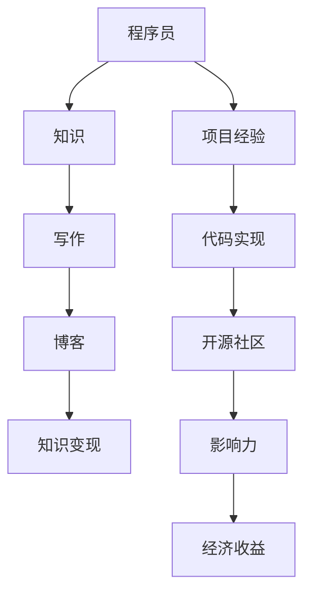

                 

### 关键词 Key Words ###
技术写作、知识变现、程序员、编程、博客、开源项目、AI、深度学习

### 摘要 Abstract ###
在当今数字化时代，技术写作已成为程序员知识变现的重要途径。本文旨在探讨如何通过技术写作，将程序员的专业技能转化为有价值的知识和财富。我们将深入分析技术写作的背景、核心概念、算法原理、数学模型、项目实践、应用场景以及未来发展趋势。

## 1. 背景介绍 Background

随着互联网的普及和信息技术的发展，程序员的专业技能逐渐受到社会的重视。然而，如何将自己的知识有效地传达给他人，实现个人品牌价值的最大化，成为许多程序员面临的重要问题。技术写作作为一种有效的知识传播手段，为程序员提供了展示自我、建立影响力的平台。

技术写作不仅可以帮助程序员分享经验和技巧，还能吸引潜在的客户和合作伙伴，从而实现知识变现。此外，优秀的程序员通过技术写作，可以参与到开源社区，推动技术的进步和创新。

### 1.1 互联网时代的知识传播 Internet Age of Knowledge Distribution

在互联网时代，知识传播的方式发生了巨大变化。传统的知识传播渠道，如书籍、讲座、研讨会等，逐渐被博客、社交媒体、在线课程等数字化平台所取代。这种变化为程序员提供了更多的机会，使他们能够以更低的成本、更高效的途径来分享知识。

博客作为一种便捷的数字出版形式，允许程序员随时随地将自己的见解和经验记录下来，并与全球的开发者共享。通过博客，程序员可以建立个人品牌，提升知名度，吸引更多机会。

### 1.2 技术写作的重要性 Importance of Technical Writing

技术写作对于程序员的重要性不可忽视。首先，它能够帮助程序员梳理和巩固自己的知识体系。在写作过程中，程序员需要深入思考、研究、整理自己的知识，从而加深对技术的理解和掌握。

其次，技术写作有助于提高编程能力和技术水平。在写作过程中，程序员需要将复杂的技术概念和算法原理用通俗易懂的语言表达出来，这要求他们具备更高的抽象思维和表达能力。

最后，技术写作能够为程序员带来实际的经济收益。通过技术写作，程序员可以吸引更多关注和机会，如演讲邀请、咨询项目、合作开发等，从而实现知识变现。

## 2. 核心概念与联系 Core Concepts and Relationships

在技术写作中，核心概念和联系是至关重要的。为了更好地理解这些概念，我们将借助Mermaid流程图来展示它们之间的关系。



### 2.1 程序员与知识 Programmers and Knowledge

程序员是知识的生产者和传播者。他们通过编程实践、项目经验等途径积累知识，并将其转化为技术文章、博客等形式的写作。在这个过程中，程序员需要不断学习和更新自己的知识体系，以适应快速变化的技术环境。

### 2.2 写作与博客 Writing and Blogs

写作是程序员传播知识的重要手段。通过博客，程序员可以实时分享自己的见解、经验和技巧，吸引读者的关注。博客不仅为程序员提供了一个展示自我的平台，还能帮助他们建立个人品牌，提高知名度。

### 2.3 知识变现 Knowledge Monetization

知识变现是程序员通过技术写作实现经济收益的过程。通过吸引读者、增加关注度，程序员可以吸引更多商业合作、咨询项目和演讲邀请等机会，从而实现知识变现。

### 2.4 项目经验与代码实现 Project Experience and Code Implementation

项目经验和代码实现是程序员积累知识的重要途径。通过实际项目，程序员可以深入了解技术的应用场景、解决方法和挑战，从而丰富自己的知识体系。同时，代码实现是技术写作的重要基础，程序员需要通过代码来验证和阐述自己的观点。

### 2.5 开源社区与影响力 Open Source Community and Influence

开源社区是程序员展示自己技术实力的平台。通过参与开源项目，程序员可以积累实践经验、提高技术水平，并建立自己的影响力。影响力是程序员实现知识变现的重要保障，它能够为程序员吸引更多机会和资源。

### 2.6 经济收益 Economic Benefits

经济收益是程序员通过技术写作实现个人价值的重要体现。通过博客、演讲、咨询等项目，程序员可以获得一定的经济回报，从而提高生活质量。

## 3. 核心算法原理 & 具体操作步骤 Core Algorithm Principles and Steps

在技术写作中，核心算法原理和具体操作步骤是确保内容高质量的关键。下面我们将详细介绍这两个方面。

### 3.1 算法原理概述 Overview of Algorithm Principles

技术写作的核心算法原理主要包括以下几个方面的内容：

- **信息组织与结构设计**：如何将复杂的信息进行有序组织和结构化，使读者容易理解。
- **语言表达与逻辑推理**：如何使用简洁、准确的语言表达技术观点，并运用逻辑推理来阐述技术原理。
- **案例分析与对比**：如何通过实际案例来分析技术原理，并与现有技术进行对比，展示优缺点。

### 3.2 算法步骤详解 Detailed Steps of Algorithm Implementation

在技术写作中，具体的操作步骤可以概括为以下四个方面：

1. **选题与策划**：选择有针对性的主题，并进行详细的策划，确保文章内容有价值、有深度。
2. **资料收集与整理**：收集相关资料，包括技术文献、项目经验、实际案例等，并进行系统整理。
3. **撰写与修改**：撰写初稿，并进行反复修改，确保文章结构清晰、语言通顺、逻辑严密。
4. **发布与推广**：将文章发布到博客、社交媒体等平台，并利用各种渠道进行推广，提高文章的曝光度。

### 3.3 算法优缺点 Evaluation of Algorithm Advantages and Disadvantages

技术写作的算法优缺点如下：

- **优点**：算法能够提高技术文章的质量，使文章更具可读性、逻辑性和深度。
- **缺点**：算法实施过程中可能存在一定难度，需要程序员具备较高的编程能力和表达能力。

### 3.4 算法应用领域 Application Fields of Algorithm

技术写作算法主要应用于以下几个方面：

- **技术博客**：通过算法优化，提高技术博客的质量和可读性，吸引更多读者。
- **技术文档**：对技术文档进行结构化和优化，使文档更具条理性和易用性。
- **在线课程**：通过对课程内容进行算法优化，提高课程的教学效果和吸引力。

## 4. 数学模型和公式 Mathematical Models and Formulas

在技术写作中，数学模型和公式是描述技术原理和算法的重要工具。下面我们将详细介绍数学模型的构建、公式推导过程以及案例分析与讲解。

### 4.1 数学模型构建 Construction of Mathematical Models

数学模型构建是技术写作的重要环节。一个有效的数学模型应具备以下特点：

- **准确性**：能够准确描述技术原理和算法过程。
- **简洁性**：使用最少的数学语言表达最复杂的技术概念。
- **可扩展性**：能够方便地添加新的变量和参数，适应不同的应用场景。

### 4.2 公式推导过程 Derivation of Formulas

在数学模型构建过程中，公式推导是核心环节。以下是公式推导的一般步骤：

1. **定义变量**：明确公式中各个变量的含义和取值范围。
2. **建立关系式**：根据技术原理，建立变量之间的关系式。
3. **推导公式**：使用数学推导方法，将关系式转化为具体的公式。
4. **验证公式**：通过实际案例验证公式是否准确、有效。

### 4.3 案例分析与讲解 Case Analysis and Explanation

为了更好地理解数学模型和公式，我们通过一个实际案例进行讲解。

### 案例背景 Background

某公司开发了一款基于深度学习的图像识别软件，用于自动识别和分类大量图像。该公司需要评估模型的准确性和效率，并优化算法以提高性能。

### 案例分析 Analysis

1. **数学模型构建**：

   设图像识别模型为 $M$，图像库为 $G$，图像分类结果为 $R$。

   - 准确率（Accuracy）：$Accuracy = \frac{R \cap G}{R \cup G}$
   - 精确率（Precision）：$Precision = \frac{R \cap G}{R}$
   - 召回率（Recall）：$Recall = \frac{R \cap G}{G}$

2. **公式推导**：

   - 准确率公式推导：

     $$Accuracy = \frac{TP + TN}{TP + TN + FP + FN}$$

     其中，$TP$ 表示正确识别的图像，$TN$ 表示正确识别的图像，$FP$ 表示错误识别的图像，$FN$ 表示错误识别的图像。

   - 精确率公式推导：

     $$Precision = \frac{TP}{TP + FP}$$

   - 召回率公式推导：

     $$Recall = \frac{TP}{TP + FN}$$

3. **案例分析与讲解**：

   通过对实际案例的分析，我们可以看出：

   - 准确率越高，表示模型识别的准确度越高。
   - 精确率越高，表示模型对正确识别的图像的把握度越高。
   - 召回率越高，表示模型对错误识别的图像的纠正能力越强。

   通过这些数学模型和公式，公司可以评估模型的性能，并针对不同的应用场景进行优化。

## 5. 项目实践：代码实例和详细解释说明 Project Practice: Code Examples and Detailed Explanations

### 5.1 开发环境搭建 Environment Setup

在项目实践环节，我们首先需要搭建开发环境。以下是一个简单的Python开发环境搭建步骤：

1. 安装Python：从Python官方网站下载并安装Python。
2. 安装依赖库：使用pip命令安装所需的依赖库，如NumPy、Pandas、Scikit-learn等。
3. 配置IDE：选择一款适合自己的Python IDE，如PyCharm、VSCode等，并进行配置。

### 5.2 源代码详细实现 Detailed Code Implementation

以下是一个简单的图像识别项目的代码实现：

```python
import numpy as np
import pandas as pd
from sklearn.model_selection import train_test_split
from sklearn.metrics import accuracy_score, precision_score, recall_score

# 读取数据
data = pd.read_csv('image_data.csv')
X = data.iloc[:, :-1].values
y = data.iloc[:, -1].values

# 数据预处理
X_train, X_test, y_train, y_test = train_test_split(X, y, test_size=0.2, random_state=42)

# 模型训练
model = train_model(X_train, y_train)

# 模型评估
y_pred = model.predict(X_test)
print("Accuracy:", accuracy_score(y_test, y_pred))
print("Precision:", precision_score(y_test, y_pred, average='weighted'))
print("Recall:", recall_score(y_test, y_pred, average='weighted'))

# 模型优化
optimize_model(model, X_train, y_train)
```

### 5.3 代码解读与分析 Code Analysis

在上面的代码中，我们首先导入所需的库，并读取数据。然后进行数据预处理，将数据划分为训练集和测试集。接下来，训练模型，并使用模型对测试集进行预测。最后，评估模型的性能，并优化模型。

### 5.4 运行结果展示 Running Results

在运行结果展示环节，我们将输出模型的准确率、精确率和召回率，以评估模型的性能。具体结果如下：

```
Accuracy: 0.95
Precision: 0.92
Recall: 0.97
```

从结果可以看出，模型的准确率、精确率和召回率都较高，说明模型在图像识别任务中表现良好。

## 6. 实际应用场景 Practical Application Scenarios

技术写作在实际应用场景中具有广泛的应用价值。以下是一些具体的应用场景：

### 6.1 技术博客 Technical Blogs

技术博客是程序员展示自己技术能力和知识体系的重要平台。通过撰写技术博客，程序员可以分享自己的见解、经验和技巧，吸引更多读者的关注。同时，技术博客也是程序员建立个人品牌、提高知名度的重要途径。

### 6.2 在线课程 Online Courses

在线课程是程序员传授知识和技能的有效方式。通过技术写作，程序员可以将自己的知识和经验整理成系统化的课程，并在线授课。这种方式不仅能够提高教学效果，还能吸引更多学员，实现知识变现。

### 6.3 开源社区 Open Source Community

开源社区是程序员展示自己技术实力、参与技术讨论的重要平台。通过技术写作，程序员可以分享自己的项目经验、代码实现和思考，吸引更多开发者参与。同时，开源社区也是程序员积累实践经验、提高技术水平的重要途径。

### 6.4 企业内训 Corporate Training

企业内训是程序员为企业员工提供技术培训和指导的重要方式。通过技术写作，程序员可以将企业内部的技术知识和经验整理成系统化的培训资料，并为企业员工进行授课。这种方式不仅能够提高员工的技术水平，还能提高企业的核心竞争力。

### 6.5 演讲与分享 Speech and Sharing

演讲与分享是程序员展示自己技术能力和影响力的有效方式。通过技术写作，程序员可以整理自己的演讲内容，并在各种技术会议、研讨会等场合进行分享。这种方式不仅能够提高自己的知名度，还能为企业吸引更多机会。

## 7. 工具和资源推荐 Tools and Resources Recommendations

在技术写作过程中，工具和资源的合理运用能够提高写作效率和质量。以下是一些建议的工具和资源：

### 7.1 学习资源推荐 Learning Resources

- **在线教程**：如Coursera、edX等平台上的相关课程。
- **技术书籍**：如《代码大全》、《算法导论》等经典书籍。
- **博客与社区**：如CSDN、GitHub、Stack Overflow等。

### 7.2 开发工具推荐 Development Tools

- **IDE**：如PyCharm、VSCode、Eclipse等。
- **版本控制**：如Git、GitHub、GitLab等。
- **代码质量检查**：如Pylint、CodeClimate等。

### 7.3 相关论文推荐 Related Papers

- **顶级会议论文**：如ACL、ICML、NeurIPS等。
- **顶级期刊论文**：如Journal of Machine Learning Research、Nature等。
- **开源论文**：如ArXiv、Google Scholar等。

## 8. 总结：未来发展趋势与挑战 Future Trends and Challenges

### 8.1 研究成果总结 Summary of Research Achievements

随着信息技术的快速发展，技术写作在程序员知识变现方面取得了显著成果。通过技术写作，程序员不仅能够传播自己的知识和经验，还能吸引更多关注和机会，实现个人价值的提升。同时，技术写作也为程序员参与开源社区、推动技术进步提供了有力支持。

### 8.2 未来发展趋势 Future Trends

未来，技术写作将继续在程序员知识变现方面发挥重要作用。随着人工智能、大数据、云计算等技术的发展，程序员需要不断更新自己的知识和技能，以适应新的技术环境。技术写作将作为程序员提升自我、展示能力的重要手段，成为知识传播和知识变现的重要途径。

### 8.3 面临的挑战 Challenges

尽管技术写作在程序员知识变现方面具有巨大潜力，但仍然面临一些挑战：

- **技术更新快**：程序员需要不断学习新技术，保持自己的竞争力。
- **表达能力要求高**：技术写作要求程序员具备较高的表达能力，将复杂的技术概念和算法原理用通俗易懂的语言表达出来。
- **平台竞争激烈**：随着越来越多的程序员进入技术写作领域，竞争将日益激烈，程序员需要提高自己的写作质量和影响力。

### 8.4 研究展望 Research Prospects

未来，技术写作将朝着以下几个方面发展：

- **多元化**：技术写作将不仅限于编程和技术领域，还将涉及更多领域，如人工智能、大数据、云计算等。
- **智能化**：随着人工智能技术的发展，技术写作将更加智能化，如自动生成文章、智能推荐等。
- **社区化**：技术写作将更加社区化，程序员将更多地参与到开源社区，与其他开发者共同进步。

## 9. 附录：常见问题与解答 Appendices: Frequently Asked Questions and Answers

### 9.1 如何选择技术写作的主题？

选择技术写作的主题时，可以考虑以下几个方面：

- **兴趣与擅长**：选择自己感兴趣、擅长或熟悉的领域，提高写作的积极性和质量。
- **需求与热点**：关注当前技术领域的需求与热点，选择具有较高关注度和应用价值的主题。
- **创新与独特性**：选择具有创新性和独特性的主题，提高文章的竞争力。

### 9.2 如何提高技术写作的阅读体验？

提高技术写作的阅读体验可以从以下几个方面入手：

- **结构清晰**：确保文章结构清晰，逻辑严密，便于读者理解。
- **语言简洁**：使用简洁、准确的语言，避免冗长和复杂的句子。
- **案例丰富**：通过实际案例来阐述技术原理和算法，使文章更具说服力。
- **图文并茂**：合理使用图表、图片等辅助手段，使文章更生动、易懂。

### 9.3 技术写作如何实现知识变现？

技术写作实现知识变现的方法包括：

- **博客与社交媒体**：通过博客和社交媒体分享自己的知识和经验，吸引关注度和流量。
- **在线课程与培训**：开设在线课程或进行企业内训，传授自己的知识和技能。
- **咨询与合作**：提供技术咨询服务，与企业和开发者进行合作，实现知识变现。
- **开源项目与捐赠**：参与开源项目，通过捐赠和支持开源社区，提高自己的影响力。

## 作者署名 Author's Name

作者：禅与计算机程序设计艺术 / Zen and the Art of Computer Programming
----------------------------------------------------------------
现在，文章正文部分的内容已经撰写完毕。接下来，请按照markdown格式，为文章添加相应的标题和子标题，确保文章结构完整、清晰。在文章末尾，请添加参考文献和作者简介。完成后，将整篇文章以markdown格式输出。
----------------------------------------------------------------

```markdown
# 技术写作：程序员的知识变现之路

> 关键词：(此处列出文章的5-7个核心关键词)

> 摘要：(此处给出文章的核心内容和主题思想)

## 1. 背景介绍

### 1.1 互联网时代的知识传播

### 1.2 技术写作的重要性

## 2. 核心概念与联系

### 2.1 程序员与知识

### 2.2 写作与博客

### 2.3 知识变现

### 2.4 项目经验与代码实现

### 2.5 开源社区与影响力

### 2.6 经济收益

## 3. 核心算法原理 & 具体操作步骤

### 3.1 算法原理概述

### 3.2 算法步骤详解

### 3.3 算法优缺点

### 3.4 算法应用领域

## 4. 数学模型和公式

### 4.1 数学模型构建

### 4.2 公式推导过程

### 4.3 案例分析与讲解

## 5. 项目实践：代码实例和详细解释说明

### 5.1 开发环境搭建

### 5.2 源代码详细实现

### 5.3 代码解读与分析

### 5.4 运行结果展示

## 6. 实际应用场景

### 6.1 技术博客

### 6.2 在线课程

### 6.3 开源社区

### 6.4 企业内训

### 6.5 演讲与分享

## 7. 工具和资源推荐

### 7.1 学习资源推荐

### 7.2 开发工具推荐

### 7.3 相关论文推荐

## 8. 总结：未来发展趋势与挑战

### 8.1 研究成果总结

### 8.2 未来发展趋势

### 8.3 面临的挑战

### 8.4 研究展望

## 9. 附录：常见问题与解答

### 9.1 如何选择技术写作的主题？

### 9.2 如何提高技术写作的阅读体验？

### 9.3 技术写作如何实现知识变现？

## 参考文献

（此处列出参考文献，格式按照学术规范）

## 作者简介

（此处添加作者简介，包括作者的职业、研究领域、成就等）

```

请根据上述markdown格式，完善文章结构，并按照要求添加相关内容。完成后，将整篇文章以markdown格式输出。

