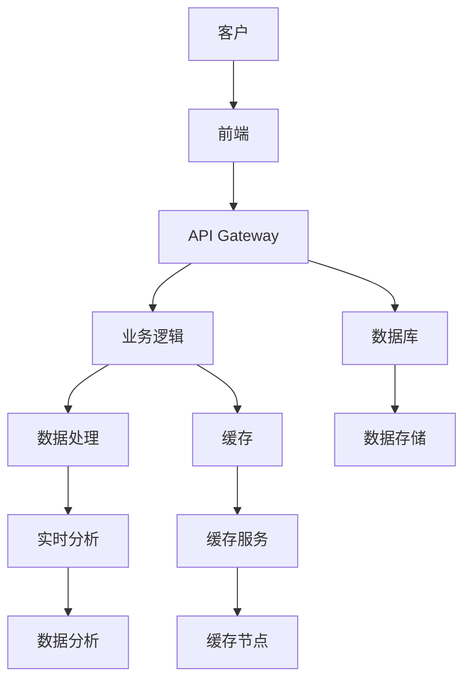
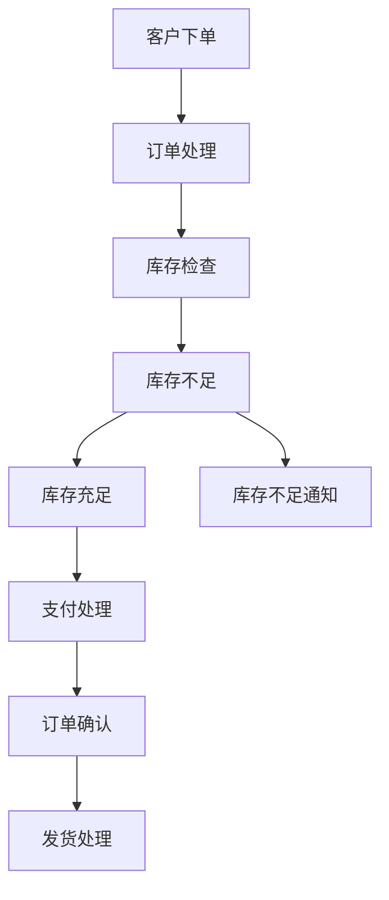
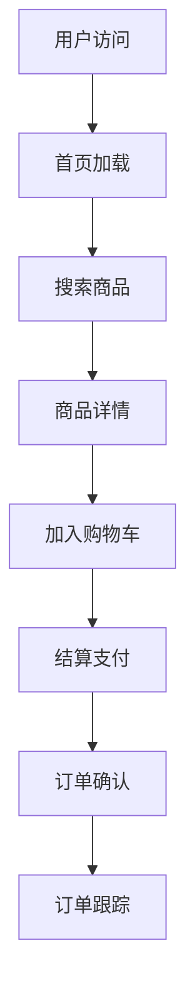
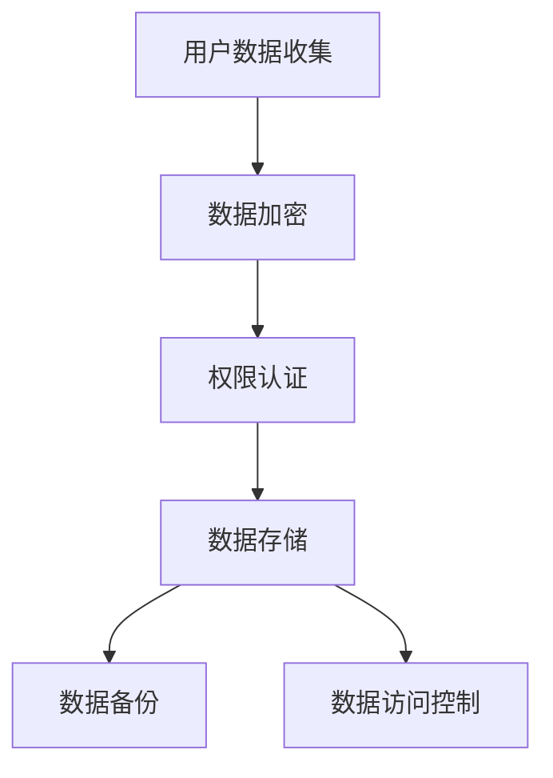

                 

关键词：数字化转型、在线化转型、技术架构、云服务、用户体验、业务流程、平台迁移、数据安全、AI 应用

> 摘要：本文将深入探讨从线下业务模式到线上平台的转变过程，分析其核心概念、关键算法、数学模型以及实际应用场景。通过对技术架构、开发实践、工具推荐等多方面的详细解读，帮助读者理解并应对这一转型过程中的各种挑战。

## 1. 背景介绍

随着互联网的普及和数字技术的飞速发展，越来越多的企业和组织开始考虑将线下业务转移到线上。这种转变不仅仅是为了跟上时代的步伐，更是为了提升效率和竞争力。从线下到线上的转变，不仅仅是地点的迁移，更是业务模式、运营逻辑、用户体验等方面的深刻变革。

### 1.1 线下业务模式的局限性

线下业务模式存在许多固有的局限性，如：
- 受地理限制，客户覆盖范围有限；
- 业务流程复杂，效率低下；
- 数据管理和分析能力不足；
- 难以实现个性化服务。

### 1.2 在线化转型的优势

在线化转型能够带来的优势包括：
- 扩大市场覆盖范围，实现全球化；
- 提升运营效率和客户体验；
- 利用大数据和人工智能进行精准营销和个性化服务；
- 降低成本，提高利润。

### 1.3 转变过程中的挑战

在线化转型过程中，企业面临以下挑战：
- 技术架构的重建与优化；
- 业务流程的重新设计；
- 用户体验的持续改进；
- 数据安全和隐私保护；
- 员工技能的培训与升级。

## 2. 核心概念与联系

在探讨从线下到线上的转变时，需要理解以下核心概念和它们之间的联系：

### 2.1. 技术架构

技术架构是线上平台的核心，决定了系统的扩展性、稳定性和安全性。以下是一个简化的技术架构流程图：



### 2.2. 业务流程

业务流程是线上平台运营的核心，需要通过自动化工具和流程优化来提升效率。以下是一个简化的业务流程：



### 2.3. 用户体验

用户体验是线上平台的生命力，需要通过不断优化界面设计、功能流程、响应速度等方面来提升。以下是一个简化的用户体验流程：



### 2.4. 数据安全和隐私保护

数据安全和隐私保护是线上平台的底线，需要通过加密、权限控制、数据备份等多种手段来保障。以下是一个简化的数据安全和隐私保护流程：



## 3. 核心算法原理 & 具体操作步骤

### 3.1 算法原理概述

在线化转型中的核心算法主要包括：

- 数据库查询优化算法；
- 分布式缓存算法；
- 实时数据分析算法；
- 机器学习算法。

### 3.2 算法步骤详解

#### 3.2.1 数据库查询优化算法

数据库查询优化算法的步骤包括：

1. 创建索引；
2. 使用SQL优化器分析查询；
3. 生成查询执行计划；
4. 执行查询并返回结果。

#### 3.2.2 分布式缓存算法

分布式缓存算法的步骤包括：

1. 数据分割与分布；
2. 节点间通信协议设计；
3. 缓存一致性算法；
4. 节点失效处理。

#### 3.2.3 实时数据分析算法

实时数据分析算法的步骤包括：

1. 数据采集与预处理；
2. 数据流处理；
3. 实时分析模型训练；
4. 分析结果存储与可视化。

#### 3.2.4 机器学习算法

机器学习算法的步骤包括：

1. 数据集准备；
2. 特征工程；
3. 模型选择与训练；
4. 模型评估与优化。

### 3.3 算法优缺点

每种算法都有其优缺点：

- **数据库查询优化算法**：提升查询性能，但可能增加系统复杂度。
- **分布式缓存算法**：提高数据访问速度，但需要解决一致性问题。
- **实时数据分析算法**：实现实时业务监控，但计算资源消耗较大。
- **机器学习算法**：提升自动化水平和智能决策能力，但需要大量数据支持和模型调优。

### 3.4 算法应用领域

这些算法广泛应用于以下领域：

- **电子商务**：数据库查询优化、实时数据分析。
- **在线教育**：分布式缓存、实时数据分析。
- **智能客服**：机器学习算法、实时数据分析。
- **金融科技**：分布式缓存、实时数据分析、机器学习算法。

## 4. 数学模型和公式 & 详细讲解 & 举例说明

### 4.1 数学模型构建

在线化转型中的数学模型主要包括：

- 数据库查询性能模型；
- 分布式缓存一致性模型；
- 实时数据分析预测模型；
- 机器学习分类与回归模型。

### 4.2 公式推导过程

以分布式缓存一致性模型为例，其基本公式推导如下：

$$
C = \sum_{i=1}^{N} P_i \times C_i
$$

其中，$C$ 表示缓存命中率，$P_i$ 表示数据分片 $i$ 的访问概率，$C_i$ 表示数据分片 $i$ 的缓存命中率。

### 4.3 案例分析与讲解

假设一个电子商务平台，其用户访问行为符合泊松分布，访问频率为 $\lambda = 0.5$ 次/秒。我们需要计算在分布式缓存系统中的缓存命中率。

根据泊松分布的公式，我们可以计算出每个数据分片的访问概率 $P_i$：

$$
P_i = \frac{\lambda}{N} = \frac{0.5}{1000} = 0.0005
$$

假设每个数据分片独立且缓存命中率均为 $C_i = 0.9$。则整个系统的缓存命中率为：

$$
C = \sum_{i=1}^{1000} P_i \times C_i = 0.0005 \times 0.9 \times 1000 = 0.45
$$

## 5. 项目实践：代码实例和详细解释说明

### 5.1 开发环境搭建

为了实现线上平台的业务功能，我们需要搭建以下开发环境：

- **编程语言**：Java、Python；
- **框架**：Spring Boot、Django；
- **数据库**：MySQL、MongoDB；
- **缓存**：Redis；
- **消息队列**：RabbitMQ；
- **前端框架**：React、Vue.js；
- **容器化技术**：Docker、Kubernetes。

### 5.2 源代码详细实现

以下是一个简单的示例，展示如何使用 Spring Boot 搭建一个基于 RESTful API 的在线购物平台。

```java
// 控制器类
@RestController
@RequestMapping("/products")
public class ProductController {

    @Autowired
    private ProductService productService;

    @GetMapping("/{id}")
    public Product getProduct(@PathVariable Long id) {
        return productService.getProductById(id);
    }

    @PostMapping("/")
    public Product createProduct(@RequestBody Product product) {
        return productService.createProduct(product);
    }
}

// 服务类
@Service
public class ProductService {

    @Autowired
    private ProductRepository productRepository;

    public Product getProductById(Long id) {
        return productRepository.findById(id).orElseThrow(() -> new ResourceNotFoundException("Product not found with id: " + id));
    }

    public Product createProduct(Product product) {
        return productRepository.save(product);
    }
}

// 数据访问层
@Entity
@Table(name = "products")
public class Product {

    @Id
    @GeneratedValue(strategy = GenerationType.IDENTITY)
    private Long id;

    private String name;

    private double price;

    // 省略其他属性和构造方法
}
```

### 5.3 代码解读与分析

上述代码实现了产品信息的查询和创建功能，主要包括以下组件：

- **控制器（Controller）**：接收 HTTP 请求，调用服务层进行业务处理，并返回响应。
- **服务层（Service）**：封装业务逻辑，调用数据访问层进行数据操作。
- **数据访问层（Repository）**：实现对数据库的操作，如查询和持久化实体对象。

### 5.4 运行结果展示

当用户访问 `/products/1` 接口时，控制器会调用服务层的方法查询产品信息，并将结果返回给用户。当用户提交一个新的产品信息时，控制器会调用服务层的方法创建新的产品，并将其存储到数据库中。

## 6. 实际应用场景

### 6.1 电子商务平台

电子商务平台是线上化转型的一个典型应用场景，涵盖了从商品展示、购物车管理、订单处理到支付和物流等各个环节。以下是一些实际应用场景：

- **个性化推荐**：利用机器学习算法分析用户行为和购买历史，实现个性化商品推荐。
- **实时库存监控**：通过实时数据分析，实现对库存的监控和预警，确保商品供应的及时性。
- **智能客服**：利用自然语言处理和机器学习算法，实现智能客服系统，提升客户满意度。

### 6.2 在线教育平台

在线教育平台是另一个重要的应用场景，通过线上平台提供课程、教学资源、作业批改和互动交流等功能。以下是一些实际应用场景：

- **课程推荐**：根据用户的学习历史和兴趣，推荐合适的课程。
- **作业批改**：利用自然语言处理和图像识别技术，自动批改作业，节省教师时间。
- **互动交流**：提供在线论坛、聊天室等功能，促进师生互动和同学交流。

### 6.3 金融科技

金融科技是线上化转型的重要领域，通过线上平台提供金融服务，如在线支付、贷款申请、投资理财等。以下是一些实际应用场景：

- **风险控制**：利用大数据分析和机器学习算法，实现对交易风险的实时监控和预警。
- **个性化理财**：根据用户的风险承受能力和投资偏好，推荐个性化的理财产品。
- **智能投顾**：利用人工智能技术，提供智能化的投资建议和理财规划。

## 7. 工具和资源推荐

### 7.1 学习资源推荐

- **《深入理解计算机系统》**：作者 Randal E. Bryant 和 David R. O’Hallaron，本书详细介绍了计算机系统的工作原理，对理解技术架构有很大帮助。
- **《机器学习》**：作者 Andrew Ng，这是一本经典的机器学习入门书籍，适合初学者学习。
- **《Web前端技术指南》**：作者张容铭，本书全面介绍了前端开发的知识体系，适合前端开发者学习。

### 7.2 开发工具推荐

- **Docker**：容器化技术，用于简化应用部署和运维。
- **Kubernetes**：容器编排工具，用于自动化管理容器化应用。
- **Redis**：高性能的内存缓存数据库，用于加速数据访问。
- **RabbitMQ**：消息队列中间件，用于实现异步通信。

### 7.3 相关论文推荐

- **《大规模分布式存储系统：设计与实践》**：本文介绍了分布式存储系统的设计原理和实践经验。
- **《深度学习在自然语言处理中的应用》**：本文讨论了深度学习在自然语言处理领域的应用和发展趋势。
- **《区块链技术原理与应用》**：本文介绍了区块链技术的基本原理和应用场景。

## 8. 总结：未来发展趋势与挑战

### 8.1 研究成果总结

在线化转型已经成为企业提升效率和竞争力的必然选择。近年来，随着云计算、大数据、人工智能等技术的发展，越来越多的企业开始将其线下业务转移到线上，取得了显著的效果。研究成果表明，在线化转型能够显著提升企业的运营效率、客户满意度和市场竞争力。

### 8.2 未来发展趋势

未来，在线化转型将继续深化和拓展，具体趋势包括：

- **智能化**：利用人工智能技术实现更智能的业务流程和用户体验。
- **个性化**：通过大数据分析实现个性化服务和推荐。
- **全球化**：通过线上平台实现全球化业务布局。
- **安全化**：加强数据安全和隐私保护，保障业务安全。

### 8.3 面临的挑战

在线化转型过程中，企业仍然面临以下挑战：

- **技术架构的复杂性**：随着业务的发展，技术架构可能变得复杂，需要持续优化。
- **数据安全和隐私保护**：数据安全和隐私保护是线上平台的底线，需要加强技术和管理措施。
- **员工技能的培训与升级**：在线化转型对员工技能提出了更高要求，需要加强培训和技能升级。
- **市场竞争**：在线化转型使得市场竞争更加激烈，企业需要不断创新和优化，以保持竞争力。

### 8.4 研究展望

未来，在线化转型将继续成为研究的热点领域，研究者可以从以下方向进行探索：

- **智能化的业务流程优化**：研究如何利用人工智能技术实现更智能的业务流程优化。
- **大数据分析技术**：研究如何利用大数据分析技术实现更精准的市场分析和业务决策。
- **区块链技术**：研究如何利用区块链技术实现更安全、透明的数据管理和业务流程。
- **云计算与边缘计算**：研究如何利用云计算和边缘计算实现更高效、灵活的业务部署。

## 9. 附录：常见问题与解答

### 9.1 什么是在线化转型？

在线化转型是指将线下业务模式转移到线上平台，通过数字化手段实现业务流程的自动化、智能化和个性化，以提升企业的运营效率和竞争力。

### 9.2 在线化转型有哪些优势？

在线化转型能够扩大市场覆盖范围、提升运营效率和客户体验、实现精准营销、降低成本、提高利润等。

### 9.3 在线化转型过程中如何保障数据安全和隐私保护？

在线化转型过程中，可以通过以下措施保障数据安全和隐私保护：

- 使用加密技术对数据进行加密存储和传输；
- 实施严格的权限控制，限制数据访问权限；
- 定期备份数据，确保数据安全；
- 建立数据安全管理体系，制定数据安全政策和流程；
- 定期进行安全审计和风险评估。

### 9.4 在线化转型需要哪些技术支持？

在线化转型需要以下技术支持：

- **云计算**：提供弹性、高效的计算和存储资源；
- **大数据分析**：提供数据采集、存储、处理和分析能力；
- **人工智能**：提供智能化的业务流程优化、推荐系统和决策支持；
- **区块链**：提供去中心化、安全透明的数据管理和业务流程；
- **物联网**：提供智能设备互联和数据采集能力；
- **前端技术**：提供丰富的用户体验和交互设计。

----------------------------------------------------------------

### 9.5 如何应对在线化转型过程中的技术挑战？

应对在线化转型过程中的技术挑战，可以采取以下策略：

- **技术选型**：根据业务需求选择合适的技术框架和工具，确保系统的稳定性和扩展性；
- **技术培训**：加强员工的技术培训和技能提升，确保团队具备应对新技术的能力；
- **团队协作**：建立跨部门的协作机制，确保技术团队、业务团队和运维团队的高效协同；
- **持续迭代**：采用敏捷开发方法，持续迭代和优化系统，以适应业务变化和市场需求。

作者：禅与计算机程序设计艺术 / Zen and the Art of Computer Programming


