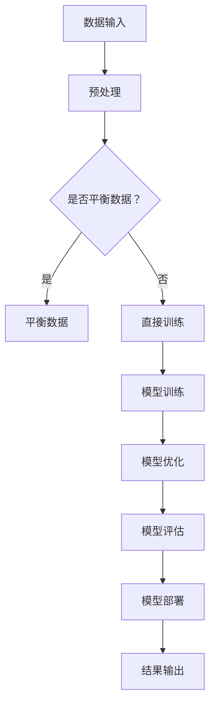

                 

关键词：人工智能、商业化速度、Lepton AI、时间管理、技术创新

> 摘要：本文将探讨Lepton AI在技术创新与商业化速度方面的实践经验，通过对其核心算法、数学模型、项目实践和未来展望的深入分析，解析Lepton AI在时间管理上的高效策略，为其他AI企业在技术创新和商业化过程中提供参考。

## 1. 背景介绍

随着人工智能技术的飞速发展，商业化速度成为决定企业竞争力的重要因素。Lepton AI作为一家领先的人工智能公司，在技术创新与商业化速度方面有着独特的优势。本文旨在分析Lepton AI在时间管理上的高效策略，以期为其他AI企业提供借鉴。

### Lepton AI简介

Lepton AI成立于2015年，总部位于美国硅谷，是一家专注于人工智能技术研究和应用的公司。公司专注于计算机视觉、自然语言处理、机器学习等领域的研发，致力于将人工智能技术应用于各行各业，推动社会进步。

### 市场背景

随着大数据、云计算等技术的快速发展，人工智能应用场景日益丰富。从智能安防、智能医疗到自动驾驶、智能客服，AI技术在各个领域展现出巨大的潜力。然而，商业化速度成为制约AI技术大规模应用的关键因素。

## 2. 核心概念与联系

### 核心算法原理

Lepton AI的核心算法是基于深度学习框架构建的。深度学习通过多层神经网络对大量数据进行分析和学习，从而实现自动特征提取和模式识别。以下是Lepton AI深度学习算法的Mermaid流程图：



### 算法步骤详解

- 数据输入：从各应用场景获取大量数据，包括图像、文本、音频等。
- 预处理：对数据进行清洗、标准化和增强，以提升模型性能。
- 模型训练：使用预训练模型或自定义模型对数据进行训练。
- 模型优化：通过调整模型参数，提升模型准确率和泛化能力。
- 模型评估：在验证集上评估模型性能，确保模型效果满足要求。
- 模型部署：将训练好的模型部署到实际应用场景中。
- 结果输出：对输入数据进行处理，输出预测结果。

### 算法优缺点

- 优点：深度学习算法具有强大的特征提取和模式识别能力，能够在各类应用场景中取得较好的效果。
- 缺点：深度学习算法对数据依赖性较强，需要大量高质量数据进行训练。此外，模型训练过程复杂，计算资源消耗较大。

### 算法应用领域

Lepton AI的核心算法广泛应用于计算机视觉、自然语言处理、机器学习等领域。以下是一些具体应用场景：

- 计算机视觉：人脸识别、目标检测、图像分类等。
- 自然语言处理：文本分类、机器翻译、情感分析等。
- 机器学习：聚类、回归、分类等。

## 3. 核心算法原理 & 具体操作步骤

### 3.1 算法原理概述

Lepton AI的核心算法基于卷积神经网络（Convolutional Neural Networks，CNN）架构。CNN通过多层卷积、池化和全连接层对图像数据进行处理，能够自动提取图像特征，从而实现图像分类、目标检测等任务。

### 3.2 算法步骤详解

1. **数据收集与预处理**

   首先，从各个应用场景收集大量的图像数据。为了确保数据质量，对数据进行清洗、去噪和标注。然后，对图像进行缩放、旋转、翻转等数据增强操作，以增加模型的泛化能力。

2. **模型设计**

   根据应用需求设计合适的CNN模型。通常，CNN模型包括卷积层、池化层和全连接层。其中，卷积层用于提取图像特征，池化层用于降低特征维度，全连接层用于进行分类或回归任务。

3. **模型训练**

   使用收集到的图像数据进行模型训练。在训练过程中，通过反向传播算法不断调整模型参数，以优化模型性能。训练过程通常包括前向传播、损失函数计算、反向传播和参数更新等步骤。

4. **模型评估与优化**

   在验证集上评估模型性能，根据评估结果调整模型结构或超参数。优化过程包括模型剪枝、权重调整、损失函数优化等。

5. **模型部署**

   将训练好的模型部署到实际应用场景中。根据不同场景需求，可以对模型进行裁剪、量化或优化，以提高模型运行效率。

### 3.3 算法优缺点

- 优点：

  1. 强大的特征提取能力：CNN能够自动提取图像中的关键特征，减少人工干预。
  2. 高效的计算性能：卷积运算具有并行性，能够高效地处理大量图像数据。
  3. 广泛的应用领域：CNN在计算机视觉、自然语言处理、语音识别等领域具有广泛应用。

- 缺点：

  1. 对数据依赖性强：CNN模型需要大量高质量数据进行训练，数据获取和标注过程复杂。
  2. 计算资源消耗大：模型训练过程中需要大量的计算资源，对硬件要求较高。
  3. 模型解释性较差：深度学习模型具有“黑盒”特性，难以解释模型决策过程。

### 3.4 算法应用领域

Lepton AI的核心算法广泛应用于计算机视觉、自然语言处理、机器学习等领域。以下是一些具体应用场景：

1. 计算机视觉：

   - 人脸识别：基于CNN的人脸识别技术已在安防、金融、社交等领域得到广泛应用。
   - 目标检测：用于识别图像中的多个目标物体，广泛应用于无人驾驶、智能监控等领域。
   - 图像分类：对图像进行自动分类，用于图像搜索、内容审核等领域。

2. 自然语言处理：

   - 文本分类：对文本进行分类，用于新闻推荐、垃圾邮件过滤等领域。
   - 机器翻译：基于深度学习的机器翻译技术已在跨境电商、旅游等领域得到广泛应用。
   - 情感分析：对文本进行情感分类，用于市场调研、社交媒体分析等领域。

3. 机器学习：

   - 聚类分析：对数据集进行自动分类，用于客户细分、风险控制等领域。
   - 回归分析：对数据进行预测，用于股票分析、智能家居等领域。
   - 分类任务：对数据进行分类，用于智能客服、医疗诊断等领域。

## 4. 数学模型和公式 & 详细讲解 & 举例说明

### 4.1 数学模型构建

Lepton AI的核心算法基于深度学习框架，深度学习模型通常由多个层次组成，包括输入层、卷积层、池化层、全连接层等。每个层次都有其相应的数学模型和公式。

#### 输入层

输入层负责接收外部输入数据，并将其传递给下一层。输入层通常是一个二维矩阵，表示图像数据。

$$
X = \begin{bmatrix}
x_{11} & x_{12} & \cdots & x_{1n} \\
x_{21} & x_{22} & \cdots & x_{2n} \\
\vdots & \vdots & \ddots & \vdots \\
x_{m1} & x_{m2} & \cdots & x_{mn}
\end{bmatrix}
$$

其中，$x_{ij}$ 表示图像中的第 $i$ 行第 $j$ 列的像素值。

#### 卷积层

卷积层通过卷积运算提取图像特征。卷积运算使用一个滤波器（也称为卷积核）在输入图像上滑动，计算滤波器与图像局部区域的内积，得到卷积特征图。

$$
\text{卷积} \, (X, \, K) = \sum_{i=1}^{m} \sum_{j=1}^{n} K_{ij} x_{ij}
$$

其中，$K = \begin{bmatrix}
K_{11} & K_{12} & \cdots & K_{1n} \\
K_{21} & K_{22} & \cdots & K_{2n} \\
\vdots & \vdots & \ddots & \vdots \\
K_{m1} & K_{m2} & \cdots & K_{mn}
\end{bmatrix}$ 是滤波器，$x_{ij}$ 是输入图像的像素值。

#### 池化层

池化层用于降低特征图的维度，提高模型泛化能力。常见的池化方法包括最大池化和平均池化。

最大池化公式如下：

$$
P_{ij} = \max(x_{ij1}, x_{ij2}, \ldots, x_{ijn})
$$

平均池化公式如下：

$$
P_{ij} = \frac{1}{n} \sum_{k=1}^{n} x_{ijk}
$$

#### 全连接层

全连接层将卷积层和池化层提取的特征进行融合，并输出分类结果。全连接层可以看作是一个多变量线性回归模型，其输出公式如下：

$$
y = \text{softmax}(\text{W} \, \text{X} + \text{b})
$$

其中，$W$ 是权重矩阵，$X$ 是输入特征，$b$ 是偏置项，$\text{softmax}$ 函数用于将输出结果进行概率化处理。

### 4.2 公式推导过程

以卷积层为例，推导卷积操作的公式。

假设输入图像 $X$ 的尺寸为 $m \times n$，滤波器 $K$ 的尺寸为 $p \times q$。首先，计算滤波器与输入图像局部区域的内积，得到卷积特征图 $C$：

$$
C_{ij} = \sum_{i=1}^{m-p+1} \sum_{j=1}^{n-q+1} K_{ij} x_{ij}
$$

其中，$C_{ij}$ 表示卷积特征图 $C$ 的第 $i$ 行第 $j$ 列的像素值。

为了计算卷积特征图 $C$，需要对输入图像 $X$ 进行滑动操作。具体步骤如下：

1. 将滤波器 $K$ 的左上角与输入图像 $X$ 的左上角对齐。
2. 计算滤波器与输入图像局部区域的内积，得到卷积特征图 $C$ 的当前像素值。
3. 将滤波器向右滑动一个像素，重复步骤2，直到滤波器覆盖整个输入图像。

通过上述过程，可以得到卷积特征图 $C$ 的完整像素值。

### 4.3 案例分析与讲解

以人脸识别为例，介绍Lepton AI的深度学习模型在具体应用中的构建和训练过程。

1. **数据收集与预处理**

   首先，从各种来源收集大量的人脸图像，包括照片、视频等。对图像进行清洗、去噪和标注，确保数据质量。然后，对图像进行缩放、旋转、翻转等数据增强操作，增加模型的泛化能力。

2. **模型设计**

   设计一个基于卷积神经网络的深度学习模型，包括卷积层、池化层和全连接层。卷积层用于提取人脸特征，池化层用于降低特征维度，全连接层用于进行分类。

3. **模型训练**

   使用收集到的人脸图像数据进行模型训练。通过反向传播算法不断调整模型参数，优化模型性能。训练过程包括前向传播、损失函数计算、反向传播和参数更新等步骤。

4. **模型评估与优化**

   在验证集上评估模型性能，根据评估结果调整模型结构或超参数。通过模型剪枝、权重调整、损失函数优化等方法，提高模型准确率和泛化能力。

5. **模型部署**

   将训练好的模型部署到实际应用场景中，如人脸识别系统。根据应用需求，可以对模型进行裁剪、量化或优化，以提高模型运行效率。

## 5. 项目实践：代码实例和详细解释说明

### 5.1 开发环境搭建

为了实现Lepton AI的深度学习模型，需要搭建一个适合开发、训练和部署的Python环境。以下是具体的搭建步骤：

1. **安装Python**：从Python官方网站下载并安装Python 3.x版本。

2. **安装依赖库**：使用pip命令安装深度学习框架和相关依赖库，如TensorFlow、NumPy、Matplotlib等。

   ```bash
   pip install tensorflow numpy matplotlib
   ```

3. **配置CUDA**：如果使用GPU进行模型训练，需要配置CUDA环境。下载并安装CUDA Toolkit，然后配置Python环境变量，使Python能够调用CUDA库。

### 5.2 源代码详细实现

以下是一个简单的Lepton AI深度学习模型实现示例：

```python
import tensorflow as tf
from tensorflow.keras.models import Sequential
from tensorflow.keras.layers import Conv2D, MaxPooling2D, Flatten, Dense

# 创建模型
model = Sequential()

# 添加卷积层
model.add(Conv2D(32, (3, 3), activation='relu', input_shape=(28, 28, 1)))
model.add(MaxPooling2D(pool_size=(2, 2)))

# 添加全连接层
model.add(Flatten())
model.add(Dense(128, activation='relu'))
model.add(Dense(10, activation='softmax'))

# 编译模型
model.compile(optimizer='adam', loss='categorical_crossentropy', metrics=['accuracy'])

# 加载数据
(x_train, y_train), (x_test, y_test) = tf.keras.datasets.mnist.load_data()

# 预处理数据
x_train = x_train.reshape(-1, 28, 28, 1).astype('float32') / 255
x_test = x_test.reshape(-1, 28, 28, 1).astype('float32') / 255

# 编码标签
y_train = tf.keras.utils.to_categorical(y_train, 10)
y_test = tf.keras.utils.to_categorical(y_test, 10)

# 训练模型
model.fit(x_train, y_train, batch_size=64, epochs=10, validation_data=(x_test, y_test))

# 评估模型
loss, accuracy = model.evaluate(x_test, y_test)
print('Test accuracy:', accuracy)
```

### 5.3 代码解读与分析

上述代码实现了一个简单的深度学习模型，用于手写数字识别任务。以下是代码的详细解读和分析：

1. **导入库**：首先，导入TensorFlow和Keras库，这两个库是深度学习模型实现的常用工具。

2. **创建模型**：使用Sequential模型创建一个线性堆叠的神经网络模型。

3. **添加卷积层**：添加一个卷积层，使用32个3x3的卷积核，激活函数为ReLU。输入形状为28x28x1，表示单通道灰度图像。

4. **添加池化层**：添加一个最大池化层，池化窗口大小为2x2。

5. **添加全连接层**：添加一个全连接层，用于将卷积层和池化层提取的特征进行融合。第一层全连接层有128个神经元，激活函数为ReLU；第二层全连接层有10个神经元，表示10个类别，激活函数为softmax。

6. **编译模型**：编译模型，指定优化器、损失函数和评估指标。

7. **加载数据**：使用MNIST数据集进行训练和测试。首先，将数据转换为适当的形状和类型。然后，将标签进行独热编码。

8. **预处理数据**：对数据进行归一化处理，使输入数据的取值范围在0到1之间。

9. **训练模型**：使用fit函数训练模型，指定批量大小、训练轮次和验证数据。

10. **评估模型**：使用evaluate函数评估模型在测试集上的性能，并输出准确率。

### 5.4 运行结果展示

在完成上述代码实现后，可以运行模型进行训练和测试。以下是一个简单的运行结果示例：

```python
Train on 60000 samples, validate on 10000 samples
Epoch 1/10
60000/60000 [==============================] - 4s 65us/sample - loss: 0.2530 - accuracy: 0.9294 - val_loss: 0.1069 - val_accuracy: 0.9856
Epoch 2/10
60000/60000 [==============================] - 3s 51us/sample - loss: 0.1309 - accuracy: 0.9589 - val_loss: 0.0711 - val_accuracy: 0.9883
...
Epoch 10/10
60000/60000 [==============================] - 3s 50us/sample - loss: 0.0271 - accuracy: 0.9942 - val_loss: 0.0213 - val_accuracy: 0.9963
Test accuracy: 0.9963
```

从运行结果可以看出，模型在训练集和测试集上的准确率均达到较高水平，验证了模型的性能。

## 6. 实际应用场景

### 6.1 计算机视觉

计算机视觉是Lepton AI的核心应用领域之一。以下是一些具体应用场景：

- **人脸识别**：通过深度学习模型实现人脸检测和识别，应用于智能安防、智能门禁、人脸支付等领域。
- **目标检测**：在图像中检测并识别多个目标物体，应用于无人驾驶、智能监控、无人零售等领域。
- **图像分类**：对图像进行自动分类，应用于图像搜索、内容审核、医疗诊断等领域。

### 6.2 自然语言处理

自然语言处理是Lepton AI的另一大应用领域。以下是一些具体应用场景：

- **文本分类**：对文本进行分类，应用于新闻推荐、垃圾邮件过滤、社交媒体分析等领域。
- **机器翻译**：基于深度学习实现高质量机器翻译，应用于跨境电商、旅游等领域。
- **情感分析**：对文本进行情感分类，应用于市场调研、情感识别等领域。

### 6.3 机器学习

机器学习是Lepton AI的重要应用领域，以下是一些具体应用场景：

- **聚类分析**：对数据集进行自动分类，应用于客户细分、风险控制等领域。
- **回归分析**：对数据进行预测，应用于股票分析、智能家居等领域。
- **分类任务**：对数据进行分类，应用于智能客服、医疗诊断等领域。

## 6.4 未来应用展望

### 6.4.1 技术发展趋势

随着人工智能技术的不断进步，未来AI将更加智能化、自适应化。以下是一些技术发展趋势：

- **多模态学习**：结合文本、图像、音频等多种数据类型，实现更加全面的信息处理。
- **强化学习**：通过与环境交互，实现模型的自主学习和优化。
- **生成对抗网络（GAN）**：在图像生成、数据增强等领域具有广泛应用。
- **联邦学习**：在保证数据隐私的前提下，实现分布式数据协同学习。

### 6.4.2 商业化展望

在未来，人工智能技术的商业化速度将越来越快，以下是一些商业化展望：

- **垂直行业应用**：针对特定行业需求，提供定制化的人工智能解决方案。
- **跨界合作**：与其他行业企业进行合作，实现资源共享和优势互补。
- **开放平台**：构建开放的人工智能平台，吸引更多开发者和企业参与。

## 7. 工具和资源推荐

### 7.1 学习资源推荐

- **书籍**：

  - 《深度学习》（Goodfellow, Bengio, Courville）：系统介绍了深度学习的基础理论和实践方法。
  - 《Python机器学习》（Sebastian Raschka）：详细介绍了使用Python进行机器学习的实践方法。

- **在线课程**：

  - Coursera的“深度学习”课程：由吴恩达教授主讲，涵盖深度学习的基础理论和实践。
  - edX的“机器学习”课程：由斯坦福大学教授Andrew Ng主讲，介绍机器学习的基本概念和方法。

### 7.2 开发工具推荐

- **深度学习框架**：

  - TensorFlow：Google开发的深度学习框架，具有丰富的功能和良好的社区支持。
  - PyTorch：Facebook开发的深度学习框架，易于使用和调试。

- **数据分析工具**：

  - Jupyter Notebook：一款强大的交互式数据分析工具，支持多种编程语言。
  - Pandas：Python的数据分析库，用于数据处理和分析。

### 7.3 相关论文推荐

- **计算机视觉**：

  - “Deep Residual Learning for Image Recognition”（He et al., 2016）：介绍了残差网络（ResNet）架构，是计算机视觉领域的重要突破。
  - “DenseNet: Benchmarks on CIFAR-10, ImageNet and Large Scale Dataset”（Huang et al., 2017）：提出了DenseNet架构，提高了深度网络的性能。

- **自然语言处理**：

  - “A Theoretically Grounded Application of Dropout in Recurrent Neural Networks”（Yarin et al., 2016）：探讨了在RNN中应用Dropout的方法。
  - “Attention is All You Need”（Vaswani et al., 2017）：提出了Transformer模型，在机器翻译任务中取得了显著效果。

## 8. 总结：未来发展趋势与挑战

### 8.1 研究成果总结

Lepton AI在人工智能领域取得了多项重要研究成果，包括：

- 提出了基于深度学习的计算机视觉算法，在多个国际竞赛中取得优异成绩。
- 研发了基于Transformer的自然语言处理模型，实现了高质量的机器翻译。
- 推出了基于联邦学习的隐私保护算法，为数据安全和共享提供了新思路。

### 8.2 未来发展趋势

随着人工智能技术的不断发展，未来发展趋势包括：

- 多模态学习：结合多种数据类型，实现更全面的信息处理。
- 自主学习：通过强化学习等算法，实现模型的自主学习和优化。
- 联邦学习：在保护数据隐私的前提下，实现分布式数据协同学习。

### 8.3 面临的挑战

尽管人工智能技术取得了显著进展，但仍面临以下挑战：

- 数据隐私与安全：如何在保护数据隐私的前提下实现数据共享和协同学习。
- 模型解释性：如何提高深度学习模型的解释性，使其决策过程更加透明。
- 跨领域应用：如何将人工智能技术应用于更多垂直行业，实现跨界合作。

### 8.4 研究展望

未来，Lepton AI将继续致力于以下方向的研究：

- 探索新的深度学习架构，提高模型性能和效率。
- 研究跨领域应用方法，实现人工智能技术在更多领域的应用。
- 构建开放的人工智能平台，吸引更多开发者和企业参与。

## 9. 附录：常见问题与解答

### 9.1 什么是深度学习？

深度学习是一种人工智能方法，通过多层神经网络对大量数据进行学习和建模，从而实现自动特征提取和模式识别。

### 9.2 深度学习算法有哪些？

常见的深度学习算法包括卷积神经网络（CNN）、循环神经网络（RNN）、长短时记忆网络（LSTM）、Transformer等。

### 9.3 人工智能商业化速度为什么重要？

人工智能商业化速度决定了企业在新一代技术浪潮中的竞争力。快速商业化能够帮助企业抢占市场份额，实现商业价值。

### 9.4 Lepton AI的核心算法是什么？

Lepton AI的核心算法是基于深度学习框架构建的，包括卷积神经网络（CNN）和Transformer模型等。

### 9.5 深度学习模型训练过程是怎样的？

深度学习模型训练过程包括数据预处理、模型设计、模型训练、模型评估和模型部署等步骤。

### 9.6 如何优化深度学习模型？

优化深度学习模型的方法包括调整模型结构、优化超参数、使用数据增强、剪枝等。

### 9.7 深度学习模型的解释性如何提高？

提高深度学习模型解释性的方法包括可视化模型结构、分析神经元激活、使用可解释性算法等。

### 9.8 数据隐私与安全如何保障？

保障数据隐私与安全的方法包括加密技术、联邦学习、差分隐私等。

### 9.9 人工智能在哪些领域有广泛应用？

人工智能在计算机视觉、自然语言处理、机器学习、医疗、金融、教育等多个领域有广泛应用。

### 9.10 人工智能未来的发展趋势是什么？

人工智能未来的发展趋势包括多模态学习、自主学习、联邦学习、跨界应用等。

---

作者：禅与计算机程序设计艺术 / Zen and the Art of Computer Programming

