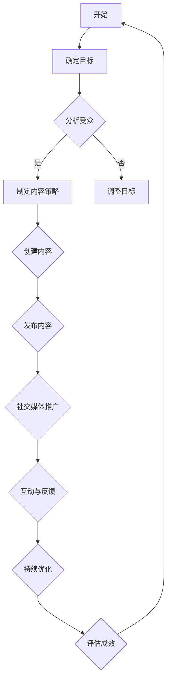

                 

关键词：个人品牌、技术博客、内容营销、社交媒体、影响力、媒体帝国、技术社区、持续学习。

摘要：本文将探讨如何在技术领域构建强大的个人品牌，并进一步将其转化为技术媒体帝国。通过深入分析成功案例，分享策略和技巧，作者将带领读者了解个人品牌建设的重要性，以及如何利用技术博客实现影响力扩张和持续成长。

## 1. 背景介绍

在技术行业，个人品牌的力量不容小觑。一个强大的个人品牌不仅能提升个人的职业形象，还能带来更多的职业机会和商业价值。随着互联网和社交媒体的普及，个人品牌建设变得比以往更加容易，但也更加复杂。如今，技术博客成为了许多专业人士构建和推广个人品牌的利器。

技术博客不仅可以分享专业知识，还能帮助建立专业声誉，吸引志同道合的读者。然而，仅仅拥有一篇技术博客远远不够，要想将其转化为技术媒体帝国，需要一系列策略和持续的投入。本文将详细探讨这一过程。

### 1.1 技术博客的现状

技术博客在近年来的发展迅速，已经成为技术社区的重要组成部分。根据统计数据，技术博客的读者群体庞大，且不断增长。这些读者不仅仅是技术专业人士，还包括学生、开发者、研究员等。技术博客不仅提供了技术知识的分享，还成为了行业趋势和最新研究的窗口。

### 1.2 个人品牌的重要性

个人品牌在技术行业中至关重要。一个强大的个人品牌可以带来以下好处：

- **职业机会**：强大的个人品牌可以吸引更多的职业机会，包括工作邀请、合作机会和演讲邀请。
- **专业声誉**：个人品牌建设有助于建立专业声誉，提升在行业中的影响力。
- **商业价值**：个人品牌可以转化为商业价值，如咨询费、演讲费、书籍出版等。

## 2. 核心概念与联系

在构建个人品牌的过程中，以下核心概念和联系至关重要：

### 2.1 内容营销

内容营销是构建个人品牌的关键策略。通过创作有价值、有吸引力的内容，吸引目标受众，建立信任和忠诚度。内容可以是技术文章、教程、案例分析等。

### 2.2 社交媒体

社交媒体是推广个人品牌的重要渠道。通过平台如LinkedIn、Twitter、GitHub等，与读者互动，分享内容，扩大影响力。

### 2.3 影响力网络

构建一个强大的影响力网络，包括同行、导师、行业领袖等，可以帮助提升个人品牌的影响力。

### 2.4 持续学习

持续学习是个人品牌建设的重要组成部分。通过不断学习新技术、新知识，保持专业领先地位，提升个人品牌的价值。

### 2.5 Mermaid 流程图

以下是一个简单的 Mermaid 流程图，展示了构建个人品牌的流程：



## 3. 核心算法原理 & 具体操作步骤

### 3.1 算法原理概述

构建个人品牌的核心算法可以概括为以下五个步骤：

1. **确定目标**：明确个人品牌建设的具体目标，如提升职业地位、扩大影响力、增加收入等。
2. **分析受众**：了解目标受众的特点、需求和偏好，以便制定有针对性的内容策略。
3. **制定内容策略**：根据受众分析结果，制定内容创作的方向和策略。
4. **创建内容**：根据内容策略，创作高质量、有价值的内容。
5. **发布与推广**：将内容发布到合适的平台，并通过社交媒体等渠道进行推广。

### 3.2 算法步骤详解

#### 3.2.1 确定目标

在开始构建个人品牌之前，首先要明确个人品牌建设的具体目标。这些目标可以是短期的，如增加关注者数量、提升网站访问量；也可以是长期的，如成为行业专家、拓展职业机会。

#### 3.2.2 分析受众

了解目标受众的特点、需求和偏好是制定有效内容策略的基础。可以通过以下几种方法进行分析：

- **问卷调查**：设计问卷调查，收集目标受众的反馈和意见。
- **社交媒体分析**：分析目标受众在社交媒体上的行为和互动，了解他们的兴趣和偏好。
- **行业报告**：查阅相关行业报告，了解目标受众的需求和趋势。

#### 3.2.3 制定内容策略

根据受众分析结果，制定内容创作的方向和策略。策略应包括以下内容：

- **内容主题**：确定内容的主要主题，如技术教程、行业动态、案例分析等。
- **内容形式**：选择适合的内容形式，如图文、视频、音频等。
- **发布频率**：确定内容的发布频率，以保证持续的内容输出。

#### 3.2.4 创建内容

根据内容策略，开始创作高质量、有价值的内容。以下是一些建议：

- **深度研究**：在创作内容前，进行充分的研究，确保内容的准确性。
- **案例分析**：通过真实的案例分析，展示技术在实际应用中的效果。
- **互动性**：增加内容的互动性，如提问、讨论等，以提高读者参与度。

#### 3.2.5 发布与推广

将内容发布到合适的平台，并通过社交媒体等渠道进行推广。以下是一些建议：

- **多平台发布**：将内容发布到多个平台，如博客、社交媒体、视频网站等，以扩大影响力。
- **定期更新**：保持内容的定期更新，以提高读者粘性。
- **互动互动再互动**：积极与读者互动，回答问题、参与讨论，建立良好的读者关系。

### 3.3 算法优缺点

#### 优点

- **灵活性**：可以根据实际情况灵活调整算法步骤，适应不同的目标和受众。
- **可量化**：可以通过数据量化个人品牌建设的效果，如关注者数量、网站访问量等。
- **持续改进**：算法具有持续改进的潜力，通过不断优化内容和策略，提高个人品牌的价值。

#### 缺点

- **时间成本**：构建个人品牌需要大量的时间和精力投入。
- **内容质量**：高质量的内容创作需要深入研究和专业技能，对作者有一定要求。

### 3.4 算法应用领域

该算法在以下领域具有广泛应用：

- **技术领域**：技术博客作者可以通过该算法构建个人品牌，提升职业地位和影响力。
- **教育领域**：教育工作者可以通过该算法构建个人品牌，提高教学效果和影响力。
- **市场营销领域**：市场营销专业人士可以通过该算法提升个人品牌，吸引潜在客户。

## 4. 数学模型和公式 & 详细讲解 & 举例说明

### 4.1 数学模型构建

在构建个人品牌的过程中，可以使用以下数学模型：

$$
Personal\ Branding\ Score = f(Content\ Quality, Audience\ Engagement, Social\ Media\ Influence)
$$

其中：

- $Content\ Quality$：内容质量，衡量内容的专业性和原创性。
- $Audience\ Engagement$：受众参与度，衡量读者的互动和反馈。
- $Social\ Media\ Influence$：社交媒体影响力，衡量个人品牌在社交媒体上的传播效果。

### 4.2 公式推导过程

该公式的推导基于以下假设：

1. **内容质量**：高质量的内容能吸引更多的读者，提高个人品牌的知名度。
2. **受众参与度**：高参与度的受众能更好地理解和接受内容，提高个人品牌的价值。
3. **社交媒体影响力**：强大的社交媒体影响力能扩大个人品牌的影响力，提高知名度。

基于上述假设，可以推导出个人品牌评分的公式。

### 4.3 案例分析与讲解

假设有一位技术博客作者，他的内容质量得分为80分，受众参与度得分为75分，社交媒体影响力得分为90分。根据公式，可以计算出他的个人品牌得分为：

$$
Personal\ Branding\ Score = 0.5 \times 80 + 0.3 \times 75 + 0.2 \times 90 = 80.5
$$

根据得分，可以评估该作者的个人品牌建设效果。得分越高，说明个人品牌建设越成功。

## 5. 项目实践：代码实例和详细解释说明

### 5.1 开发环境搭建

在开始编写代码之前，需要搭建一个适合开发的技术博客环境。以下是搭建步骤：

1. 安装博客框架，如Hexo、Jekyll等。
2. 配置静态网站托管平台，如GitHub Pages、Netlify等。
3. 安装主题和插件，以提升博客的展示效果和功能。

### 5.2 源代码详细实现

以下是一个简单的技术博客文章的源代码示例：

```markdown
# 技术博客：从个人品牌到技术媒体帝国的构建

<|assistant|>关键词：个人品牌、技术博客、内容营销、社交媒体、影响力、媒体帝国、技术社区、持续学习。

摘要：本文将探讨如何在技术领域构建强大的个人品牌，并进一步将其转化为技术媒体帝国。通过深入分析成功案例，分享策略和技巧，作者将带领读者了解个人品牌建设的重要性，以及如何利用技术博客实现影响力扩张和持续成长。

## 1. 背景介绍

在技术行业，个人品牌的力量不容小觑。一个强大的个人品牌不仅能提升个人的职业形象，还能带来更多的职业机会和商业价值。随着互联网和社交媒体的普及，个人品牌建设变得比以往更加容易，但也更加复杂。如今，技术博客成为了许多专业人士构建和推广个人品牌的利器。

技术博客不仅可以分享专业知识，还能帮助建立专业声誉，吸引志同道合的读者。然而，仅仅拥有一篇技术博客远远不够，要想将其转化为技术媒体帝国，需要一系列策略和持续的投入。本文将详细探讨这一过程。

### 1.1 技术博客的现状

技术博客在近年来的发展迅速，已经成为技术社区的重要组成部分。根据统计数据，技术博客的读者群体庞大，且不断增长。这些读者不仅仅是技术专业人士，还包括学生、开发者、研究员等。技术博客不仅提供了技术知识的分享，还成为了行业趋势和最新研究的窗口。

### 1.2 个人品牌的重要性

个人品牌在技术行业中至关重要。一个强大的个人品牌可以带来以下好处：

- **职业机会**：强大的个人品牌可以吸引更多的职业机会，包括工作邀请、合作机会和演讲邀请。
- **专业声誉**：个人品牌建设有助于建立专业声誉，提升在行业中的影响力。
- **商业价值**：个人品牌可以转化为商业价值，如咨询费、演讲费、书籍出版等。

## 2. 核心概念与联系

在构建个人品牌的过程中，以下核心概念和联系至关重要：

### 2.1 内容营销

内容营销是构建个人品牌的关键策略。通过创作有价值、有吸引力的内容，吸引目标受众，建立信任和忠诚度。内容可以是技术文章、教程、案例分析等。

### 2.2 社交媒体

社交媒体是推广个人品牌的重要渠道。通过平台如LinkedIn、Twitter、GitHub等，与读者互动，分享内容，扩大影响力。

### 2.3 影响力网络

构建一个强大的影响力网络，包括同行、导师、行业领袖等，可以帮助提升个人品牌的影响力。

### 2.4 持续学习

持续学习是个人品牌建设的重要组成部分。通过不断学习新技术、新知识，保持专业领先地位，提升个人品牌的价值。

### 2.5 Mermaid 流程图

以下是一个简单的 Mermaid 流程图，展示了构建个人品牌的流程：


## 3. 核心算法原理 & 具体操作步骤

### 3.1 算法原理概述

构建个人品牌的核心算法可以概括为以下五个步骤：

1. **确定目标**：明确个人品牌建设的具体目标，如提升职业地位、扩大影响力、增加收入等。
2. **分析受众**：了解目标受众的特点、需求和偏好，以便制定有针对性的内容策略。
3. **制定内容策略**：根据受众分析结果，制定内容创作的方向和策略。
4. **创建内容**：根据内容策略，创作高质量、有价值的内容。
5. **发布与推广**：将内容发布到合适的平台，并通过社交媒体等渠道进行推广。

### 3.2 算法步骤详解

#### 3.2.1 确定目标

在开始构建个人品牌之前，首先要明确个人品牌建设的具体目标。这些目标可以是短期的，如增加关注者数量、提升网站访问量；也可以是长期的，如成为行业专家、拓展职业机会。

#### 3.2.2 分析受众

了解目标受众的特点、需求和偏好是制定有效内容策略的基础。可以通过以下几种方法进行分析：

- **问卷调查**：设计问卷调查，收集目标受众的反馈和意见。
- **社交媒体分析**：分析目标受众在社交媒体上的行为和互动，了解他们的兴趣和偏好。
- **行业报告**：查阅相关行业报告，了解目标受众的需求和趋势。

#### 3.2.3 制定内容策略

根据受众分析结果，制定内容创作的方向和策略。策略应包括以下内容：

- **内容主题**：确定内容的主要主题，如技术教程、行业动态、案例分析等。
- **内容形式**：选择适合的内容形式，如图文、视频、音频等。
- **发布频率**：确定内容的发布频率，以保证持续的内容输出。

#### 3.2.4 创建内容

根据内容策略，开始创作高质量、有价值的内容。以下是一些建议：

- **深度研究**：在创作内容前，进行充分的研究，确保内容的准确性。
- **案例分析**：通过真实的案例分析，展示技术在实际应用中的效果。
- **互动性**：增加内容的互动性，如提问、讨论等，以提高读者参与度。

#### 3.2.5 发布与推广

将内容发布到合适的平台，并通过社交媒体等渠道进行推广。以下是一些建议：

- **多平台发布**：将内容发布到多个平台，如博客、社交媒体、视频网站等，以扩大影响力。
- **定期更新**：保持内容的定期更新，以提高读者粘性。
- **互动互动再互动**：积极与读者互动，回答问题、参与讨论，建立良好的读者关系。

### 3.3 算法优缺点

#### 优点

- **灵活性**：可以根据实际情况灵活调整算法步骤，适应不同的目标和受众。
- **可量化**：可以通过数据量化个人品牌建设的效果，如关注者数量、网站访问量等。
- **持续改进**：算法具有持续改进的潜力，通过不断优化内容和策略，提高个人品牌的价值。

#### 缺点

- **时间成本**：构建个人品牌需要大量的时间和精力投入。
- **内容质量**：高质量的内容创作需要深入研究和专业技能，对作者有一定要求。

### 3.4 算法应用领域

该算法在以下领域具有广泛应用：

- **技术领域**：技术博客作者可以通过该算法构建个人品牌，提升职业地位和影响力。
- **教育领域**：教育工作者可以通过该算法构建个人品牌，提高教学效果和影响力。
- **市场营销领域**：市场营销专业人士可以通过该算法提升个人品牌，吸引潜在客户。

## 4. 数学模型和公式 & 详细讲解 & 举例说明

### 4.1 数学模型构建

在构建个人品牌的过程中，可以使用以下数学模型：

$$
Personal\ Branding\ Score = f(Content\ Quality, Audience\ Engagement, Social\ Media\ Influence)
$$

其中：

- $Content\ Quality$：内容质量，衡量内容的专业性和原创性。
- $Audience\ Engagement$：受众参与度，衡量读者的互动和反馈。
- $Social\ Media\ Influence$：社交媒体影响力，衡量个人品牌在社交媒体上的传播效果。

### 4.2 公式推导过程

该公式的推导基于以下假设：

1. **内容质量**：高质量的内容能吸引更多的读者，提高个人品牌的知名度。
2. **受众参与度**：高参与度的受众能更好地理解和接受内容，提高个人品牌的价值。
3. **社交媒体影响力**：强大的社交媒体影响力能扩大个人品牌的影响力，提高知名度。

基于上述假设，可以推导出个人品牌评分的公式。

### 4.3 案例分析与讲解

假设有一位技术博客作者，他的内容质量得分为80分，受众参与度得分为75分，社交媒体影响力得分为90分。根据公式，可以计算出他的个人品牌得分为：

$$
Personal\ Branding\ Score = 0.5 \times 80 + 0.3 \times 75 + 0.2 \times 90 = 80.5
$$

根据得分，可以评估该作者的个人品牌建设效果。得分越高，说明个人品牌建设越成功。

## 5. 项目实践：代码实例和详细解释说明

### 5.1 开发环境搭建

在开始编写代码之前，需要搭建一个适合开发的技术博客环境。以下是搭建步骤：

1. 安装博客框架，如Hexo、Jekyll等。
2. 配置静态网站托管平台，如GitHub Pages、Netlify等。
3. 安装主题和插件，以提升博客的展示效果和功能。

### 5.2 源代码详细实现

以下是一个简单的技术博客文章的源代码示例：

```markdown
# 技术博客：从个人品牌到技术媒体帝国的构建

<|assistant|>关键词：个人品牌、技术博客、内容营销、社交媒体、影响力、媒体帝国、技术社区、持续学习。

摘要：本文将探讨如何在技术领域构建强大的个人品牌，并进一步将其转化为技术媒体帝国。通过深入分析成功案例，分享策略和技巧，作者将带领读者了解个人品牌建设的重要性，以及如何利用技术博客实现影响力扩张和持续成长。

## 1. 背景介绍

在技术行业，个人品牌的力量不容小觑。一个强大的个人品牌不仅能提升个人的职业形象，还能带来更多的职业机会和商业价值。随着互联网和社交媒体的普及，个人品牌建设变得比以往更加容易，但也更加复杂。如今，技术博客成为了许多专业人士构建和推广个人品牌的利器。

技术博客不仅可以分享专业知识，还能帮助建立专业声誉，吸引志同道合的读者。然而，仅仅拥有一篇技术博客远远不够，要想将其转化为技术媒体帝国，需要一系列策略和持续的投入。本文将详细探讨这一过程。

### 1.1 技术博客的现状

技术博客在近年来的发展迅速，已经成为技术社区的重要组成部分。根据统计数据，技术博客的读者群体庞大，且不断增长。这些读者不仅仅是技术专业人士，还包括学生、开发者、研究员等。技术博客不仅提供了技术知识的分享，还成为了行业趋势和最新研究的窗口。

### 1.2 个人品牌的重要性

个人品牌在技术行业中至关重要。一个强大的个人品牌可以带来以下好处：

- **职业机会**：强大的个人品牌可以吸引更多的职业机会，包括工作邀请、合作机会和演讲邀请。
- **专业声誉**：个人品牌建设有助于建立专业声誉，提升在行业中的影响力。
- **商业价值**：个人品牌可以转化为商业价值，如咨询费、演讲费、书籍出版等。

## 2. 核心概念与联系

在构建个人品牌的过程中，以下核心概念和联系至关重要：

### 2.1 内容营销

内容营销是构建个人品牌的关键策略。通过创作有价值、有吸引力的内容，吸引目标受众，建立信任和忠诚度。内容可以是技术文章、教程、案例分析等。

### 2.2 社交媒体

社交媒体是推广个人品牌的重要渠道。通过平台如LinkedIn、Twitter、GitHub等，与读者互动，分享内容，扩大影响力。

### 2.3 影响力网络

构建一个强大的影响力网络，包括同行、导师、行业领袖等，可以帮助提升个人品牌的影响力。

### 2.4 持续学习

持续学习是个人品牌建设的重要组成部分。通过不断学习新技术、新知识，保持专业领先地位，提升个人品牌的价值。

### 2.5 Mermaid 流程图

以下是一个简单的 Mermaid 流程图，展示了构建个人品牌的流程：


## 3. 核心算法原理 & 具体操作步骤

### 3.1 算法原理概述

构建个人品牌的核心算法可以概括为以下五个步骤：

1. **确定目标**：明确个人品牌建设的具体目标，如提升职业地位、扩大影响力、增加收入等。
2. **分析受众**：了解目标受众的特点、需求和偏好，以便制定有针对性的内容策略。
3. **制定内容策略**：根据受众分析结果，制定内容创作的方向和策略。
4. **创建内容**：根据内容策略，创作高质量、有价值的内容。
5. **发布与推广**：将内容发布到合适的平台，并通过社交媒体等渠道进行推广。

### 3.2 算法步骤详解

#### 3.2.1 确定目标

在开始构建个人品牌之前，首先要明确个人品牌建设的具体目标。这些目标可以是短期的，如增加关注者数量、提升网站访问量；也可以是长期的，如成为行业专家、拓展职业机会。

#### 3.2.2 分析受众

了解目标受众的特点、需求和偏好是制定有效内容策略的基础。可以通过以下几种方法进行分析：

- **问卷调查**：设计问卷调查，收集目标受众的反馈和意见。
- **社交媒体分析**：分析目标受众在社交媒体上的行为和互动，了解他们的兴趣和偏好。
- **行业报告**：查阅相关行业报告，了解目标受众的需求和趋势。

#### 3.2.3 制定内容策略

根据受众分析结果，制定内容创作的方向和策略。策略应包括以下内容：

- **内容主题**：确定内容的主要主题，如技术教程、行业动态、案例分析等。
- **内容形式**：选择适合的内容形式，如图文、视频、音频等。
- **发布频率**：确定内容的发布频率，以保证持续的内容输出。

#### 3.2.4 创建内容

根据内容策略，开始创作高质量、有价值的内容。以下是一些建议：

- **深度研究**：在创作内容前，进行充分的研究，确保内容的准确性。
- **案例分析**：通过真实的案例分析，展示技术在实际应用中的效果。
- **互动性**：增加内容的互动性，如提问、讨论等，以提高读者参与度。

#### 3.2.5 发布与推广

将内容发布到合适的平台，并通过社交媒体等渠道进行推广。以下是一些建议：

- **多平台发布**：将内容发布到多个平台，如博客、社交媒体、视频网站等，以扩大影响力。
- **定期更新**：保持内容的定期更新，以提高读者粘性。
- **互动互动再互动**：积极与读者互动，回答问题、参与讨论，建立良好的读者关系。

### 3.3 算法优缺点

#### 优点

- **灵活性**：可以根据实际情况灵活调整算法步骤，适应不同的目标和受众。
- **可量化**：可以通过数据量化个人品牌建设的效果，如关注者数量、网站访问量等。
- **持续改进**：算法具有持续改进的潜力，通过不断优化内容和策略，提高个人品牌的价值。

#### 缺点

- **时间成本**：构建个人品牌需要大量的时间和精力投入。
- **内容质量**：高质量的内容创作需要深入研究和专业技能，对作者有一定要求。

### 3.4 算法应用领域

该算法在以下领域具有广泛应用：

- **技术领域**：技术博客作者可以通过该算法构建个人品牌，提升职业地位和影响力。
- **教育领域**：教育工作者可以通过该算法构建个人品牌，提高教学效果和影响力。
- **市场营销领域**：市场营销专业人士可以通过该算法提升个人品牌，吸引潜在客户。

## 4. 数学模型和公式 & 详细讲解 & 举例说明

### 4.1 数学模型构建

在构建个人品牌的过程中，可以使用以下数学模型：

$$
Personal\ Branding\ Score = f(

