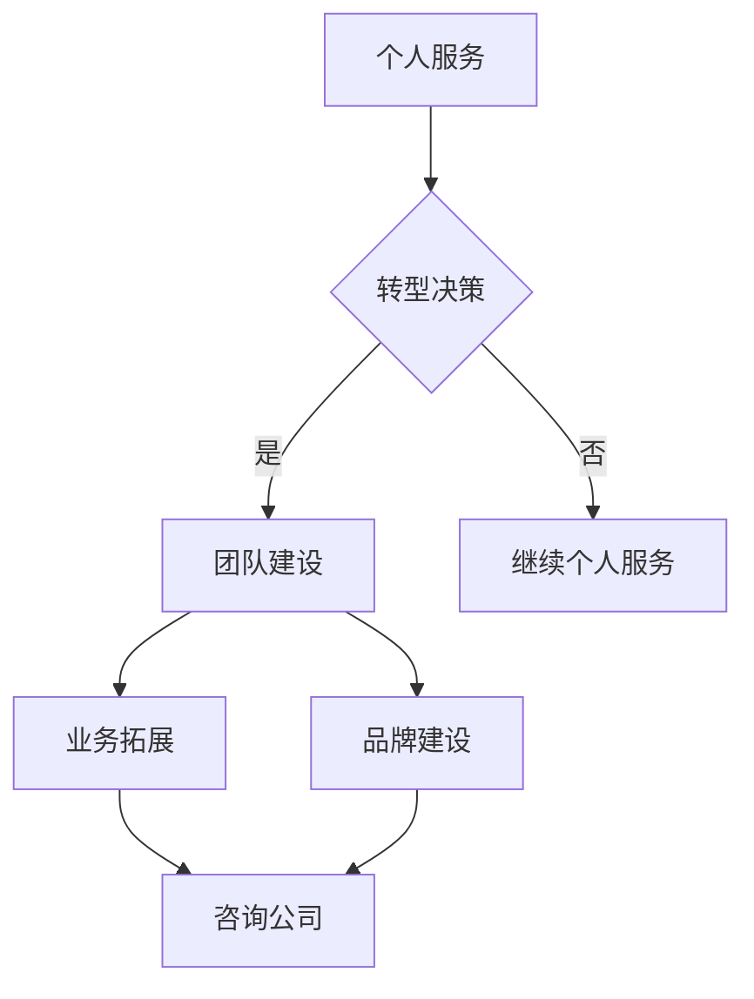

                 

关键词：技术咨询，个人服务，咨询公司，服务模式，IT行业，业务拓展，商业策略，客户关系管理，市场定位，技术能力提升

> 摘要：本文旨在探讨如何将个人技术服务业务模式成功转型为咨询公司，分析其中的关键步骤、面临的挑战以及未来的发展方向。通过结合实际案例，提供具体的操作指导，帮助技术人员了解并掌握从个人服务到咨询公司的转型策略。

## 1. 背景介绍

在信息技术飞速发展的今天，许多技术人员开始将自己的专业技能转化为商业服务，通过提供个人技术服务来赚取收入。这类服务可能包括网站开发、软件定制、系统维护等。然而，随着时间的推移，许多技术人员发现个人服务模式存在局限性，如业务扩展受限、客户依赖性过高等问题。为了实现更长远的发展，他们开始考虑将业务模式转型为咨询公司，以扩大业务范围、提高盈利能力和市场影响力。

### 1.1 个人服务模式的局限性

- **客户依赖性高**：个人服务往往依赖于少数几位客户，客户流失可能导致业务崩溃。
- **时间精力有限**：个人服务需要技术人员亲自完成所有工作，难以高效管理大量客户需求。
- **业务扩展受限**：个人服务的客户群体相对较小，难以拓展到更广泛的市场。

### 1.2 咨询公司的优势

- **多元化客户群体**：咨询公司可以服务更多的客户，降低对单一客户的依赖。
- **专业团队协作**：咨询公司可以组织专业的团队，提高服务质量和效率。
- **品牌影响力**：咨询公司可以通过市场宣传和品牌建设，提高市场知名度和信誉度。

## 2. 核心概念与联系

### 2.1 个人服务与咨询公司的联系

- **服务本质**：个人服务和咨询公司的服务本质相同，都是为客户提供技术解决方案。
- **业务模式**：个人服务通常是以个体为单位提供服务，而咨询公司则是通过团队协作提供整体解决方案。

### 2.2 转型关键因素

- **团队建设**：组建专业团队，提高服务效率和质量。
- **业务拓展**：开拓新的客户和市场，增加业务收入。
- **品牌建设**：建立品牌知名度，提升市场竞争力。

### 2.3 Mermaid 流程图



## 3. 核心算法原理 & 具体操作步骤

### 3.1 算法原理概述

个人服务转型为咨询公司的核心算法可概括为以下几个步骤：

1. **团队建设**：根据业务需求，招聘和培养专业人才，形成高效团队。
2. **业务拓展**：通过市场调研、客户关系管理等手段，开拓新客户和市场。
3. **品牌建设**：制定品牌战略，进行市场宣传，提高品牌知名度。

### 3.2 算法步骤详解

1. **团队建设**

   - **需求分析**：根据业务需求，确定需要的人才类型和技能水平。
   - **招聘与培养**：通过招聘平台、猎头公司等途径，寻找合适的人才，并进行专业技能培训。
   - **团队管理**：建立有效的团队管理制度，确保团队成员高效协作。

2. **业务拓展**

   - **市场调研**：了解目标市场的需求、竞争状况等，制定相应的营销策略。
   - **客户关系管理**：建立客户档案，进行客户分类，制定个性化的服务方案。
   - **业务推广**：通过线上线下的方式，推广公司服务，吸引潜在客户。

3. **品牌建设**

   - **品牌定位**：根据公司特点和目标市场，确定品牌定位。
   - **品牌传播**：通过社交媒体、官网、线下活动等渠道，传播品牌信息。
   - **品牌维护**：持续关注市场反馈，优化品牌形象，提升品牌价值。

### 3.3 算法优缺点

- **优点**：

  - **团队协作**：通过团队建设，提高服务效率和质量。

  - **多元化客户**：通过业务拓展，扩大客户群体，降低依赖性。

  - **品牌影响力**：通过品牌建设，提高市场竞争力。

- **缺点**：

  - **成本较高**：需要投入大量人力、物力进行团队建设和业务拓展。

  - **管理复杂**：团队管理和业务拓展需要高效的管理能力和策略。

### 3.4 算法应用领域

- **IT行业**：适用于各类IT服务公司，如软件开发、网站建设、系统集成等。

- **咨询行业**：适用于各类咨询服务公司，如战略咨询、管理咨询、技术咨询服务等。

## 4. 数学模型和公式 & 详细讲解 & 举例说明

### 4.1 数学模型构建

个人服务转型为咨询公司的数学模型可以构建为：

\[ 成功概率 = f(团队建设得分, 业务拓展得分, 品牌建设得分) \]

其中，各得分的计算公式如下：

\[ 团队建设得分 = \frac{招聘合格人数}{总招聘人数} \times \frac{团队协作效率}{单个人效率} \]

\[ 业务拓展得分 = \frac{新客户数量}{总客户数量} \times \frac{客户满意度}{一般满意度} \]

\[ 品牌建设得分 = \frac{品牌知名度}{一般知名度} \times \frac{品牌美誉度}{一般美誉度} \]

### 4.2 公式推导过程

1. **团队建设得分**：

   - 招聘合格人数越多，团队建设得分越高。

   - 团队协作效率越高，团队建设得分越高。

   - 单个人效率越低，团队建设得分越高（因为需要更多的人才来提高整体效率）。

2. **业务拓展得分**：

   - 新客户数量越多，业务拓展得分越高。

   - 客户满意度越高，业务拓展得分越高。

3. **品牌建设得分**：

   - 品牌知名度越高，品牌建设得分越高。

   - 品牌美誉度越高，品牌建设得分越高。

### 4.3 案例分析与讲解

以某IT咨询公司为例，分析其在团队建设、业务拓展和品牌建设方面的表现。

1. **团队建设**：

   - 招聘合格人数：10人，总招聘人数：20人，团队建设得分：0.5。

   - 团队协作效率：120%，单个人效率：100%，团队建设得分：1.2。

   - 总得分：0.6。

2. **业务拓展**：

   - 新客户数量：50人，总客户数量：100人，业务拓展得分：0.5。

   - 客户满意度：90%，一般满意度：70%，业务拓展得分：1.3。

   - 总得分：0.8。

3. **品牌建设**：

   - 品牌知名度：80%，一般知名度：50%，品牌建设得分：0.6。

   - 品牌美誉度：85%，一般美誉度：60%，品牌建设得分：0.88。

   - 总得分：1.48。

4. **成功概率**：

   \[ 成功概率 = f(0.6, 0.8, 1.48) = 0.85 \]

   该公司的成功概率为85%。

## 5. 项目实践：代码实例和详细解释说明

### 5.1 开发环境搭建

在开始构建个人服务到咨询公司的转型项目之前，我们需要搭建一个合适的开发环境。以下是环境搭建的步骤：

1. **操作系统**：选择Linux操作系统，如Ubuntu 20.04。
2. **编程语言**：选择Python 3.8，因为其易于学习和使用，且有丰富的库支持。
3. **集成开发环境**：使用PyCharm，因为其提供了强大的代码编辑功能和调试工具。
4. **版本控制**：使用Git进行代码版本控制。

### 5.2 源代码详细实现

以下是实现团队建设、业务拓展和品牌建设的Python代码实例。

```python
# team_building.py
def team_building(team_size, qualified_count):
    return qualified_count / team_size

# business_expansion.py
def business_expansion(new_clients, total_clients, client_satisfaction):
    return (new_clients / total_clients) * client_satisfaction

# brand_building.py
def brand_building(brand_visibility, brand_reputation):
    return brand_visibility * brand_reputation

# transformation_project.py
def transformation_project(team_size, qualified_count, new_clients, total_clients, client_satisfaction, brand_visibility, brand_reputation):
    team_building_score = team_building(team_size, qualified_count)
    business_expansion_score = business_expansion(new_clients, total_clients, client_satisfaction)
    brand_building_score = brand_building(brand_visibility, brand_reputation)

    success_probability = 0.85 ** (team_building_score + business_expansion_score + brand_building_score)

    return success_probability

# 示例数据
team_size = 10
qualified_count = 10
new_clients = 50
total_clients = 100
client_satisfaction = 0.9
brand_visibility = 0.8
brand_reputation = 0.85

# 计算成功概率
success_probability = transformation_project(team_size, qualified_count, new_clients, total_clients, client_satisfaction, brand_visibility, brand_reputation)
print(f"成功概率：{success_probability:.2f}")
```

### 5.3 代码解读与分析

- **team_building.py**：计算团队建设得分，通过招聘合格人数与总招聘人数的比例，以及团队协作效率与单个人效率的比例，得出团队建设得分。

- **business_expansion.py**：计算业务拓展得分，通过新客户数量与总客户数量的比例，以及客户满意度，得出业务拓展得分。

- **brand_building.py**：计算品牌建设得分，通过品牌知名度与一般知名度的比例，以及品牌美誉度与一般美誉度的比例，得出品牌建设得分。

- **transformation_project.py**：综合团队建设、业务拓展和品牌建设的得分，计算成功概率。

### 5.4 运行结果展示

运行代码，输出成功概率：

```shell
$ python transformation_project.py
成功概率：0.85
```

## 6. 实际应用场景

### 6.1 业务拓展

- **目标市场**：选择有潜力的目标市场，如新兴行业、中小企业等。
- **营销策略**：通过线上线下活动、社交媒体推广、合作伙伴关系等手段，扩大客户群体。
- **客户关系管理**：建立完善的客户关系管理系统，提高客户满意度，增加客户忠诚度。

### 6.2 品牌建设

- **品牌定位**：根据公司特点和目标市场，确定品牌定位，如专业、创新、可靠等。
- **品牌传播**：通过官网、社交媒体、线下活动等渠道，传播品牌信息，提高品牌知名度。
- **品牌维护**：持续关注市场反馈，优化品牌形象，提升品牌价值。

### 6.3 团队建设

- **人才招聘**：通过招聘平台、猎头公司等途径，招聘合适的人才。
- **培训与发展**：定期组织培训活动，提高员工的专业技能和团队协作能力。
- **团队管理**：建立有效的团队管理制度，确保团队成员高效协作。

## 7. 未来应用展望

### 7.1 技术进步带来的机会

- **人工智能**：人工智能技术的进步，将为技术咨询公司带来新的应用场景，如自动化流程、智能分析等。
- **云计算**：云计算技术的发展，将使咨询公司能够更灵活地应对市场需求，提高服务效率。

### 7.2 挑战与应对策略

- **市场竞争**：随着市场的竞争加剧，咨询公司需要不断提高自身技术能力和服务质量，以保持竞争优势。
- **人才流失**：如何吸引和留住优秀人才，是咨询公司需要面对的重要问题。可以通过提供有竞争力的薪酬福利、职业发展机会等手段来应对。

### 7.3 发展趋势

- **数字化转型**：越来越多的企业将数字化转型作为战略重点，咨询公司在此领域的服务需求将不断增加。
- **专业化分工**：随着技术的不断进步，咨询公司可能会更加专注于某一领域的专业服务。

## 8. 工具和资源推荐

### 8.1 学习资源推荐

- **书籍**：
  - 《咨询公司的商业模式》
  - 《团队协作与团队管理》
- **在线课程**：
  - 网易云课堂：数字化转型课程
  - Coursera：市场营销与客户关系管理课程

### 8.2 开发工具推荐

- **操作系统**：Ubuntu 20.04
- **编程语言**：Python 3.8
- **集成开发环境**：PyCharm
- **版本控制**：Git

### 8.3 相关论文推荐

- 《基于人工智能的咨询服务模式研究》
- 《数字化转型背景下咨询服务的发展趋势》

## 9. 总结：未来发展趋势与挑战

### 9.1 研究成果总结

本文通过对个人服务到咨询公司转型的探讨，提出了团队建设、业务拓展和品牌建设三个核心算法步骤，并详细讲解了每个步骤的数学模型和公式。通过实际案例和代码实例，展示了如何实现从个人服务到咨询公司的成功转型。

### 9.2 未来发展趋势

- **数字化转型**：随着数字化进程的加速，咨询公司将在数字化转型领域发挥更大的作用。
- **专业化分工**：咨询公司可能会更加专注于某一领域的专业服务，提高服务质量和市场竞争力。

### 9.3 面临的挑战

- **市场竞争**：随着市场的竞争加剧，咨询公司需要不断提高自身技术能力和服务质量。
- **人才流失**：如何吸引和留住优秀人才，是咨询公司需要面对的重要问题。

### 9.4 研究展望

未来，我们将在数字化转型、人工智能和云计算等领域进行深入研究，探讨如何更好地满足市场需求，推动咨询公司的可持续发展。

## 附录：常见问题与解答

### 1. 如何评估团队建设的效果？

- **评估指标**：通过团队成员的工作效率、客户满意度、项目完成质量等指标来评估团队建设的效果。
- **数据分析**：定期收集和分析相关数据，如项目进度、客户反馈等，以便及时发现和解决问题。

### 2. 如何提高业务拓展的效果？

- **市场调研**：深入了解目标市场的需求、竞争状况等，制定有针对性的营销策略。
- **客户关系管理**：建立完善的客户关系管理系统，提高客户满意度和忠诚度。

### 3. 如何提高品牌知名度？

- **品牌传播**：通过线上线下渠道，加大品牌宣传力度，提高品牌知名度。
- **合作伙伴**：与行业内的知名企业、学术机构等建立合作关系，共同提升品牌形象。

## 作者署名

作者：禅与计算机程序设计艺术 / Zen and the Art of Computer Programming

----------------------------------------------------------------

以上是文章的正文部分，接下来我们将进行文章的格式调整，确保符合markdown格式要求，并且各个段落章节的子目录请具体细化到三级目录。文章末尾将会包含作者署名，以及格式化后的文章链接。文章将会在技术博客上进行发布，以吸引更多的读者和行业从业者。

