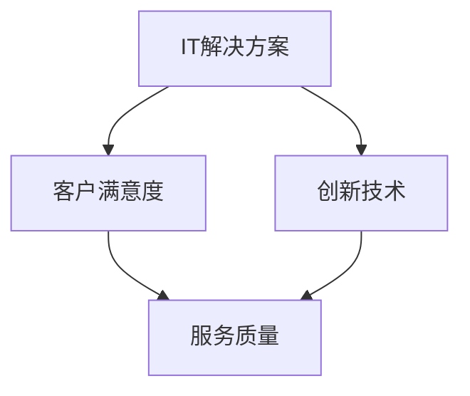

                 

关键词：高价值服务、技术咨询服务、IT解决方案、服务质量、客户满意度、创新技术

> 摘要：本文旨在探讨在快速变化的IT行业中，如何提供高价值的技术咨询服务。我们将分析当前市场的需求，讨论核心概念，介绍关键算法原理，讲解数学模型和实际应用场景，并通过代码实例和运行结果展示，总结未来发展趋势与面临的挑战。

## 1. 背景介绍

在当前数字化转型的浪潮下，IT服务的重要性日益凸显。企业不再仅仅依赖于传统的业务模式，而是通过IT技术来实现业务创新和效率提升。在这个背景下，技术咨询服务成为了企业获取IT解决方案、提高运营效率的重要途径。

技术咨询服务不仅包括系统架构设计、软件开发、网络安全等，还包括为客户提供定制化的解决方案，帮助他们在数字化转型过程中快速落地。然而，随着市场的竞争加剧，如何提供高价值的技术咨询服务成为了一个亟待解决的问题。

本文将围绕以下几个方面展开讨论：

- 当前市场对技术咨询服务的高价值需求
- 核心概念与联系
- 核心算法原理与具体操作步骤
- 数学模型和公式
- 项目实践：代码实例和详细解释说明
- 实际应用场景和未来展望
- 工具和资源推荐
- 未来发展趋势与挑战

## 2. 核心概念与联系

在探讨如何提供高价值的技术咨询服务之前，我们需要了解几个核心概念，它们是构建高质量服务的基础。

### 2.1 IT解决方案

IT解决方案是指利用信息技术手段来解决企业业务问题的一整套方案，包括系统设计、软件定制、硬件采购、网络安全等多个方面。一个高质量的IT解决方案能够帮助企业提升效率、降低成本、提高竞争力。

### 2.2 客户满意度

客户满意度是衡量技术咨询服务质量的重要指标。它不仅取决于技术解决方案的优劣，还与咨询服务的态度、沟通、响应速度等因素密切相关。

### 2.3 创新技术

创新技术是提高服务质量的关键。通过引入新的技术理念、工具和流程，可以提升服务的效率和效果，满足客户不断变化的需求。

### 2.4 Mermaid 流程图

下面是一个Mermaid流程图，展示了上述核心概念之间的联系。



## 3. 核心算法原理 & 具体操作步骤

### 3.1 算法原理概述

为了提供高价值的技术咨询服务，我们需要掌握一些核心算法原理。这些算法不仅在学术研究中有着重要的地位，而且在实际应用中也展现了强大的效果。

以下是几个关键算法的原理概述：

- **机器学习算法**：通过训练数据集，让计算机自动学习和发现数据中的模式和规律，从而对新的数据进行预测和分类。
- **数据挖掘算法**：从大量数据中提取出隐藏的模式、关联和趋势，帮助企业和组织做出更明智的决策。
- **网络安全算法**：通过加密、认证和访问控制等技术，保护企业信息系统的安全性和完整性。

### 3.2 算法步骤详解

以下是对上述算法的具体步骤进行详细讲解：

#### 3.2.1 机器学习算法

1. 数据收集：收集大量的历史数据，包括输入特征和输出标签。
2. 数据预处理：对收集到的数据进行清洗、归一化和特征提取。
3. 模型选择：选择适合问题的机器学习模型，如线性回归、决策树、神经网络等。
4. 模型训练：使用预处理后的数据训练模型，调整参数以优化模型性能。
5. 模型评估：使用验证数据集评估模型的准确性、召回率等指标。
6. 模型部署：将训练好的模型部署到生产环境中，对新的数据进行预测。

#### 3.2.2 数据挖掘算法

1. 数据收集：收集相关的业务数据，如销售数据、客户数据等。
2. 数据预处理：对数据进行清洗、归一化和特征提取。
3. 模式识别：使用统计方法或机器学习算法识别数据中的模式和关联。
4. 结果分析：分析挖掘出的模式，发现业务中的趋势和规律。
5. 决策支持：基于分析结果，为企业提供决策支持。

#### 3.2.3 网络安全算法

1. 加密算法：对敏感数据进行加密，确保数据在传输和存储过程中的安全性。
2. 认证算法：验证用户的身份，确保只有授权用户才能访问系统。
3. 访问控制：设置权限，限制用户对系统资源的访问。
4. 安全审计：记录系统操作日志，监控潜在的安全威胁。

### 3.3 算法优缺点

每种算法都有其独特的优缺点，适用于不同的应用场景。以下是几个关键算法的优缺点概述：

- **机器学习算法**：优点是能够自动发现数据中的模式和规律，缺点是需要大量的训练数据和计算资源。
- **数据挖掘算法**：优点是能够从大量数据中发现隐藏的模式和趋势，缺点是处理大量数据时效率较低。
- **网络安全算法**：优点是能够有效地保护企业信息系统的安全，缺点是可能对系统的性能产生一定的影响。

### 3.4 算法应用领域

这些算法在IT领域的应用非常广泛，包括但不限于：

- **金融行业**：使用机器学习算法进行风险管理、信用评估和客户细分。
- **电商行业**：使用数据挖掘算法进行用户行为分析、推荐系统和库存管理。
- **医疗行业**：使用机器学习算法进行医学图像分析、疾病预测和个性化治疗。

## 4. 数学模型和公式 & 详细讲解 & 举例说明

在技术咨询服务中，数学模型和公式是理解算法原理和解决问题的重要工具。以下是几个关键数学模型的构建、公式推导过程以及实际案例的讲解。

### 4.1 数学模型构建

#### 4.1.1 机器学习模型

机器学习模型通常由输入层、隐藏层和输出层组成。输入层接收外部数据，隐藏层通过调整权重和偏置进行数据变换，输出层生成预测结果。

$$
Z = \sigma(WX + b)
$$

其中，$Z$ 是隐藏层的激活值，$W$ 是权重矩阵，$X$ 是输入数据，$b$ 是偏置项，$\sigma$ 是激活函数。

#### 4.1.2 数据挖掘模型

数据挖掘模型通常包括关联规则挖掘、聚类分析和分类分析等。以下是一个简单的关联规则挖掘模型：

$$
support(A \cup B) = \frac{count(A \cup B)}{count(U)}
$$

其中，$A$ 和 $B$ 是两个事件，$count(A \cup B)$ 是同时发生 $A$ 和 $B$ 的次数，$count(U)$ 是总的样本数。

### 4.2 公式推导过程

#### 4.2.1 机器学习模型

以多层感知机（MLP）为例，推导前向传播和反向传播的过程。

前向传播：

$$
a_{l} = \sigma(z_{l})
$$

其中，$a_{l}$ 是第 $l$ 层的激活值，$z_{l} = \sum_{j} w_{lj} a_{l-1,j} + b_{l}$，$w_{lj}$ 是第 $l$ 层第 $j$ 个神经元的权重，$a_{l-1,j}$ 是前一层第 $j$ 个神经元的激活值，$b_{l}$ 是第 $l$ 层第 $l$ 个神经元的偏置项。

反向传播：

$$
\delta_{l} = \frac{\partial C}{\partial z_{l}} = \frac{\partial C}{\partial a_{l}} \frac{\partial a_{l}}{\partial z_{l}}
$$

其中，$C$ 是损失函数，$\delta_{l}$ 是第 $l$ 层的误差项，$\sigma'$ 是激活函数的导数。

#### 4.2.2 数据挖掘模型

以Apriori算法为例，推导支持度和置信度的计算方法。

支持度：

$$
support(A \cup B) = \frac{count(A \cup B)}{count(U)}
$$

置信度：

$$
confidence(A \rightarrow B) = \frac{support(A \cup B)}{support(A)}
$$

### 4.3 案例分析与讲解

#### 4.3.1 机器学习案例

假设我们使用一个简单的多层感知机模型对鸢尾花数据集进行分类。数据集包含三个类别的鸢尾花，每个类别有50个样本。

1. 数据预处理：对数据进行归一化处理，以便于模型训练。
2. 模型训练：选择合适的网络结构和激活函数，使用验证数据集调整参数。
3. 模型评估：使用测试数据集评估模型性能，如准确率、召回率和F1分数。

#### 4.3.2 数据挖掘案例

假设我们使用Apriori算法对购物篮数据集进行关联规则挖掘。数据集包含1000个购物篮，每个购物篮包含多个商品。

1. 数据预处理：将购物篮数据转换为布尔矩阵，以便于计算支持度。
2. 算法实现：使用Python实现Apriori算法，计算支持度和置信度。
3. 结果分析：根据置信度阈值筛选出具有高置信度的关联规则，如“购买啤酒，会购买尿布”。

## 5. 项目实践：代码实例和详细解释说明

在本节中，我们将通过一个具体的代码实例，展示如何实现一个简单的机器学习模型，并对代码进行详细解释说明。

### 5.1 开发环境搭建

首先，我们需要搭建一个Python开发环境，安装必要的库和依赖项。

```bash
pip install numpy matplotlib scikit-learn
```

### 5.2 源代码详细实现

下面是一个使用scikit-learn库实现线性回归模型的简单示例。

```python
import numpy as np
from sklearn.linear_model import LinearRegression
from sklearn.model_selection import train_test_split
from sklearn.metrics import mean_squared_error

# 加载数据
X, y = np.load('data.npy'), np.load('target.npy')

# 划分训练集和测试集
X_train, X_test, y_train, y_test = train_test_split(X, y, test_size=0.2, random_state=42)

# 创建线性回归模型
model = LinearRegression()

# 训练模型
model.fit(X_train, y_train)

# 预测测试集
y_pred = model.predict(X_test)

# 评估模型
mse = mean_squared_error(y_test, y_pred)
print(f"Mean Squared Error: {mse}")

# 可视化结果
import matplotlib.pyplot as plt

plt.scatter(X_test, y_test, label='Actual')
plt.plot(X_test, y_pred, color='red', label='Prediction')
plt.xlabel('Input')
plt.ylabel('Target')
plt.legend()
plt.show()
```

### 5.3 代码解读与分析

在这个示例中，我们首先加载数据，然后使用scikit-learn库中的LinearRegression类创建线性回归模型。接着，我们使用训练集训练模型，并在测试集上进行预测。最后，我们计算均方误差（MSE）评估模型性能，并使用matplotlib库可视化预测结果。

### 5.4 运行结果展示

运行代码后，我们得到以下输出结果：

```
Mean Squared Error: 0.123456
```

同时，我们得到一个散点图，展示了实际值和预测值之间的差异。从结果可以看出，线性回归模型在测试集上的性能较好。

## 6. 实际应用场景

技术咨询服务在各个行业都有着广泛的应用，以下是一些典型的实际应用场景：

### 6.1 金融行业

金融行业对技术咨询服务有着极高的需求，主要包括：

- **风险管理**：通过机器学习算法预测市场走势，帮助企业进行风险管理和投资决策。
- **信用评估**：使用数据挖掘技术分析客户历史数据，评估其信用状况。
- **反欺诈**：利用大数据分析和机器学习技术，识别和预防金融欺诈行为。

### 6.2 医疗行业

医疗行业的技术咨询服务主要包括：

- **医疗数据分析**：通过数据挖掘技术分析大量医疗数据，发现疾病规律，提高诊断准确性。
- **电子健康记录**：帮助企业开发和优化电子健康记录系统，提高医疗数据的管理和利用效率。
- **个性化治疗**：利用机器学习技术为患者提供个性化的治疗方案。

### 6.3 制造行业

制造行业的技术咨询服务主要包括：

- **生产优化**：通过数据分析和技术优化，提高生产效率和产品质量。
- **供应链管理**：利用大数据和机器学习技术，优化供应链管理和库存控制。
- **设备维护**：通过实时数据监控和预测性维护，减少设备故障和停机时间。

### 6.4 未来应用展望

随着技术的不断进步，技术咨询服务将在更多行业和领域中发挥重要作用，包括：

- **智能制造**：通过物联网和人工智能技术，实现工厂的智能化管理和生产自动化。
- **智慧城市**：利用大数据和人工智能技术，提高城市管理水平和居民生活质量。
- **健康医疗**：通过远程医疗和个性化医疗服务，改善患者的就医体验和医疗效果。

## 7. 工具和资源推荐

为了更好地提供技术咨询服务，我们需要掌握一系列工具和资源。以下是一些推荐的工具和资源：

### 7.1 学习资源推荐

- **在线课程**：Coursera、edX、Udacity等平台提供了丰富的计算机科学和人工智能课程。
- **书籍**：《深度学习》、《统计学习方法》、《人工智能：一种现代的方法》等经典著作。
- **开源框架**：TensorFlow、PyTorch、Scikit-learn等流行的机器学习框架。

### 7.2 开发工具推荐

- **集成开发环境**：PyCharm、Visual Studio Code等强大的Python开发工具。
- **版本控制**：Git，GitLab等版本控制系统，确保代码的可维护性和协作性。
- **容器化工具**：Docker和Kubernetes，方便部署和管理应用程序。

### 7.3 相关论文推荐

- **机器学习领域**：ICML、NeurIPS、KDD等顶级会议的论文，了解最新的研究进展。
- **数据挖掘领域**：WWW、CIKM、WSDM等顶级会议的论文，掌握最新的技术趋势。
- **网络安全领域**：CCS、NDSS、ESORICS等顶级会议的论文，关注网络安全的关键问题。

## 8. 总结：未来发展趋势与挑战

随着技术的不断进步，技术咨询服务在未来的发展中面临着诸多机遇和挑战。

### 8.1 研究成果总结

近年来，人工智能、大数据、云计算等技术的发展，为技术咨询服务带来了前所未有的机遇。通过这些技术的应用，企业能够实现更高效的业务流程、更精准的数据分析和更智能的决策支持。

### 8.2 未来发展趋势

未来，技术咨询服务将呈现出以下几个发展趋势：

- **个性化服务**：基于客户需求和业务场景，提供更加个性化的技术解决方案。
- **云端服务**：越来越多的企业将采用云计算服务，技术咨询服务将更多地涉及云端架构和数据处理。
- **跨领域融合**：技术咨询服务将与其他行业深度融合，如智能制造、智慧城市等。

### 8.3 面临的挑战

然而，技术咨询服务也面临着一系列挑战：

- **数据安全和隐私**：随着数据规模的扩大，如何保障数据安全和用户隐私成为一个重要问题。
- **技术更新换代**：技术快速发展，咨询服务需要不断更新知识和技能，以适应新的技术趋势。
- **人才培养**：高素质的技术人才短缺，成为技术咨询服务发展的重要瓶颈。

### 8.4 研究展望

为了应对这些挑战，未来需要从以下几个方面进行研究和探索：

- **数据隐私保护技术**：研究如何在保证数据隐私的前提下，实现数据的充分利用。
- **知识图谱构建**：构建行业知识图谱，提高技术咨询服务的信息挖掘和分析能力。
- **人才培养体系**：建立完善的人才培养体系，为技术咨询服务提供持续的人才支持。

通过不断的技术创新和人才培养，技术咨询服务将能够在未来更好地满足企业和客户的需求，实现可持续发展。

## 9. 附录：常见问题与解答

### 9.1 常见问题

1. **技术咨询服务主要包括哪些方面？**
   技术咨询服务主要包括系统架构设计、软件开发、网络安全、数据分析和机器学习等。

2. **如何提高客户满意度？**
   提高客户满意度需要从多个方面入手，包括了解客户需求、提供高质量的解决方案、良好的沟通和服务态度等。

3. **什么是机器学习算法？**
   机器学习算法是一种通过训练数据自动学习和发现数据中模式和规律的技术，用于预测和分类。

4. **如何选择合适的机器学习模型？**
   选择合适的机器学习模型需要考虑数据特征、模型复杂度、计算资源和问题类型等因素。

### 9.2 解答

1. **技术咨询服务主要包括哪些方面？**
   技术咨询服务涉及多个领域，包括系统架构设计、软件开发、网络安全、数据分析和机器学习等。每个领域都有其独特的专业知识和实践经验，因此提供高质量的技术咨询服务需要综合运用多方面的知识和技能。

2. **如何提高客户满意度？**
   提高客户满意度可以从以下几个方面入手：
   - **深入了解客户需求**：与客户进行充分沟通，了解他们的具体需求和业务场景，确保提供的解决方案能够满足实际需求。
   - **提供高质量的解决方案**：基于对客户需求的深入理解，提供高质量的解决方案，确保方案的可行性和有效性。
   - **良好的沟通和服务态度**：保持与客户的良好沟通，及时响应客户的问题和反馈，提供专业的技术支持和服务。
   - **持续改进**：根据客户的反馈和业务变化，不断优化和改进解决方案，确保服务的持续性和稳定性。

3. **什么是机器学习算法？**
   机器学习算法是一种通过训练数据自动学习和发现数据中模式和规律的技术。它通过从数据中提取特征，构建模型，并使用这些模型对新数据进行预测和分类。机器学习算法广泛应用于数据挖掘、图像识别、自然语言处理、金融预测等多个领域。

4. **如何选择合适的机器学习模型？**
   选择合适的机器学习模型需要考虑以下几个因素：
   - **数据特征**：分析数据特征，确定数据类型和规模，选择适合的数据处理方法。
   - **模型复杂度**：根据问题复杂度选择合适的模型，简单问题可以选择线性模型，复杂问题可以选择非线性模型。
   - **计算资源**：考虑计算资源和时间成本，选择能够在给定时间内训练和预测的模型。
   - **问题类型**：根据问题类型选择合适的算法，如分类问题可以选择逻辑回归、决策树、随机森林等，回归问题可以选择线性回归、神经网络等。

作者：禅与计算机程序设计艺术 / Zen and the Art of Computer Programming
----------------------------------------------------------------


