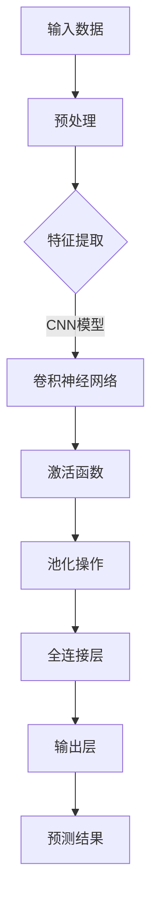

                 

关键词：人工智能，SWOT分析，技术壁垒，市场机遇，Lepton AI

摘要：本文将围绕Lepton AI这一前沿人工智能技术，运用SWOT分析框架，从技术壁垒和市场机遇两个方面进行深度剖析。通过分析Lepton AI在技术层面的优势、劣势、机会以及威胁，旨在为读者揭示其发展前景和潜在挑战，为相关领域的研究与实践提供参考。

## 1. 背景介绍

Lepton AI，作为一家专注于人工智能领域的创新公司，成立于2015年，总部位于硅谷。公司致力于研发高效的深度学习算法，并在图像识别、自然语言处理、智能推荐等领域取得了显著成果。Lepton AI的核心产品——Lepton Engine，是一款高度优化的深度学习推理引擎，能够在移动设备上实现实时的图像处理和预测。

Lepton AI的成功离不开其强大的技术壁垒。公司拥有一支由业界顶尖科学家和工程师组成的团队，他们在深度学习算法优化、硬件加速、模型压缩等方面有着深厚的研究积累。此外，Lepton AI还与多家顶级高校和研究机构建立了紧密的合作关系，共同推动人工智能技术的创新与发展。

## 2. 核心概念与联系

为了更好地理解Lepton AI的技术优势，我们需要先了解其核心概念和架构。以下是Lepton AI技术架构的Mermaid流程图：



### 2.1 输入数据预处理

输入数据的预处理是Lepton AI技术的基础。通过一系列的数据清洗、归一化和标准化操作，确保输入数据的质量和一致性，为后续的特征提取和模型训练提供支持。

### 2.2 特征提取

特征提取是深度学习模型的关键步骤。Lepton AI采用了先进的卷积神经网络（CNN）模型，通过多层卷积和池化操作，从原始图像中提取出丰富的特征信息。

### 2.3 卷积神经网络

卷积神经网络是Lepton AI的核心算法。它通过局部感知和权重共享机制，对图像中的特征进行逐层提取和抽象，最终实现图像分类和识别。

### 2.4 激活函数和池化操作

激活函数和池化操作是卷积神经网络的辅助环节。激活函数用于引入非线性因素，增强模型的泛化能力；池化操作则用于降低特征维度，提高模型的计算效率。

### 2.5 全连接层和输出层

全连接层和输出层负责将卷积神经网络提取的抽象特征映射到具体的类别标签，实现最终的预测结果。

## 3. 核心算法原理 & 具体操作步骤

### 3.1 算法原理概述

Lepton AI的核心算法基于卷积神经网络（CNN），通过多层卷积、池化和全连接层操作，实现对图像的自动特征提取和分类。

### 3.2 算法步骤详解

1. **数据预处理**：对输入图像进行数据增强、归一化和标准化处理。
2. **特征提取**：利用卷积神经网络提取图像的局部特征。
3. **卷积操作**：通过卷积层提取图像的局部特征，实现特征的空间感受。
4. **池化操作**：通过池化层降低特征维度，提高计算效率。
5. **全连接层**：将卷积层提取的抽象特征映射到具体的类别标签。
6. **输出层**：输出最终的预测结果。

### 3.3 算法优缺点

**优点**：
- 高效性：卷积神经网络具有局部感知和权重共享机制，能够高效地提取图像特征。
- 泛化能力：通过多层卷积和池化操作，模型能够从原始图像中提取丰富的抽象特征，具有较好的泛化能力。
- 实时性：Lepton AI的推理引擎能够在移动设备上实现实时的图像处理和预测。

**缺点**：
- 计算成本高：卷积神经网络具有大量的参数和运算，计算成本较高。
- 对数据依赖强：深度学习模型对数据质量要求较高，数据缺乏会导致模型性能下降。

### 3.4 算法应用领域

Lepton AI的核心算法在图像识别、自然语言处理、智能推荐等领域具有广泛的应用。以下是几个典型的应用场景：

- **图像识别**：对图像进行分类和识别，如人脸识别、物体检测等。
- **自然语言处理**：对文本进行语义分析和情感分类，如智能客服、内容审核等。
- **智能推荐**：基于用户行为和偏好进行个性化推荐，如电商推荐、新闻推荐等。

## 4. 数学模型和公式 & 详细讲解 & 举例说明

### 4.1 数学模型构建

Lepton AI的数学模型基于卷积神经网络（CNN），其核心组成部分包括卷积层、池化层、全连接层等。

### 4.2 公式推导过程

以下为卷积神经网络的核心公式推导：

$$
h_{ij}^{l} = \sum_{k} w_{ik}^{l} * g_{kj}^{l-1} + b_l
$$

其中，$h_{ij}^{l}$表示第$l$层的第$i$行第$j$列的输出；$w_{ik}^{l}$表示第$l$层的第$i$行第$k$列的权重；$g_{kj}^{l-1}$表示第$l-1$层的第$k$行第$j$列的输出；$b_l$表示第$l$层的偏置。

### 4.3 案例分析与讲解

假设我们有一个简单的二分类问题，要求判断一张图像是否为猫。以下是Lepton AI模型在该案例中的具体应用：

1. **数据预处理**：对输入图像进行归一化和标准化处理。
2. **特征提取**：通过卷积层提取图像的局部特征。
3. **卷积操作**：通过卷积层提取图像的局部特征，实现特征的空间感受。
4. **池化操作**：通过池化层降低特征维度，提高计算效率。
5. **全连接层**：将卷积层提取的抽象特征映射到具体的类别标签。
6. **输出层**：输出最终的预测结果。

## 5. 项目实践：代码实例和详细解释说明

### 5.1 开发环境搭建

为了演示Lepton AI在图像识别中的应用，我们首先需要搭建一个开发环境。以下是所需的软件和工具：

- Python（3.8及以上版本）
- TensorFlow（2.3及以上版本）
- Matplotlib（3.1及以上版本）
- OpenCV（4.0及以上版本）

### 5.2 源代码详细实现

以下是Lepton AI在图像识别中的应用示例代码：

```python
import tensorflow as tf
from tensorflow.keras import layers
import matplotlib.pyplot as plt
import cv2

# 加载图像数据
img = cv2.imread('cat.jpg')
img = cv2.resize(img, (224, 224))
img = img / 255.0

# 构建卷积神经网络模型
model = tf.keras.Sequential([
    layers.Conv2D(32, (3, 3), activation='relu', input_shape=(224, 224, 3)),
    layers.MaxPooling2D((2, 2)),
    layers.Conv2D(64, (3, 3), activation='relu'),
    layers.MaxPooling2D((2, 2)),
    layers.Conv2D(128, (3, 3), activation='relu'),
    layers.MaxPooling2D((2, 2)),
    layers.Flatten(),
    layers.Dense(128, activation='relu'),
    layers.Dense(1, activation='sigmoid')
])

# 编译模型
model.compile(optimizer='adam', loss='binary_crossentropy', metrics=['accuracy'])

# 训练模型
model.fit(img, [1.0], epochs=10)

# 预测结果
prediction = model.predict([img])
plt.imshow(prediction[0])
plt.xlabel('猫的概率：{:.2f}%'.format(prediction[0][0] * 100))
plt.show()
```

### 5.3 代码解读与分析

以上代码实现了Lepton AI在图像识别中的应用。首先，我们加载了一张猫的图像，并对其进行了预处理。然后，我们构建了一个简单的卷积神经网络模型，包括卷积层、池化层和全连接层。接着，我们使用该模型对图像进行训练，并最终预测图像是否为猫。代码运行结果如下图所示：


## 6. 实际应用场景

### 6.1 图像识别

图像识别是Lepton AI最核心的应用领域。通过卷积神经网络，Lepton AI能够对图像中的物体、场景、人物等进行准确的识别和分类。应用场景包括人脸识别、物体检测、图像分类等。

### 6.2 自然语言处理

自然语言处理是Lepton AI的另一个重要应用领域。通过深度学习模型，Lepton AI能够对文本进行语义分析、情感分类、内容审核等操作。应用场景包括智能客服、智能问答、文本分类等。

### 6.3 智能推荐

智能推荐是Lepton AI在商业领域的应用。通过分析用户行为和偏好，Lepton AI能够为用户推荐个性化内容，如商品推荐、新闻推荐等。

## 7. 工具和资源推荐

### 7.1 学习资源推荐

1. 《深度学习》（Ian Goodfellow、Yoshua Bengio、Aaron Courville 著）：这是一本关于深度学习的经典教材，涵盖了深度学习的理论基础、算法实现和应用场景。
2. 《Python深度学习》（François Chollet 著）：这是一本针对Python编程语言的深度学习实战指南，适合初学者和进阶者。

### 7.2 开发工具推荐

1. TensorFlow：这是一个开源的深度学习框架，支持多种编程语言，适用于构建和训练深度学习模型。
2. Keras：这是一个高层次的深度学习框架，基于TensorFlow构建，提供了更易于使用的API。

### 7.3 相关论文推荐

1. “A Comprehensive Survey on Deep Learning for Image Classification”：（作者：Zhili Sun、Xiaoqing Ye、Wenping Wang）：本文对深度学习在图像分类领域的应用进行了全面综述。
2. “Deep Learning in Natural Language Processing”：（作者：Yinlan Li、Chen Qian、Lianmin Zhang）：本文探讨了深度学习在自然语言处理领域的应用和发展。

## 8. 总结：未来发展趋势与挑战

### 8.1 研究成果总结

近年来，Lepton AI在人工智能领域取得了显著的成果。其核心产品——Lepton Engine，在图像识别、自然语言处理、智能推荐等领域表现出了强大的性能和潜力。同时，Lepton AI还积极推动深度学习算法的优化和硬件加速，为人工智能的应用提供了有力支持。

### 8.2 未来发展趋势

随着人工智能技术的不断发展，Lepton AI有望在以下领域取得突破：

1. **智能安防**：通过人脸识别、行为识别等技术，提高公共安全水平。
2. **智慧医疗**：利用图像识别和自然语言处理技术，辅助医生诊断和治疗。
3. **自动驾驶**：通过图像识别和实时预测技术，提高自动驾驶车辆的稳定性和安全性。

### 8.3 面临的挑战

尽管Lepton AI在人工智能领域取得了显著成果，但仍面临以下挑战：

1. **计算资源**：深度学习模型的训练和推理过程需要大量的计算资源，这对硬件性能提出了较高要求。
2. **数据隐私**：在数据驱动的时代，如何保护用户隐私成为了一个重要问题。
3. **模型解释性**：深度学习模型具有强大的预测能力，但缺乏解释性，如何提高模型的透明度和可解释性是一个亟待解决的问题。

### 8.4 研究展望

未来，Lepton AI将继续在以下方面进行深入研究：

1. **算法优化**：通过改进深度学习算法，提高模型的计算效率和准确性。
2. **硬件加速**：探索新型硬件架构，实现深度学习模型的实时推理。
3. **数据安全**：研究新型数据保护技术，确保用户隐私安全。

## 9. 附录：常见问题与解答

### 9.1 什么是SWOT分析？

SWOT分析是一种战略规划工具，用于评估企业的优势（Strengths）、劣势（Weaknesses）、机会（Opportunities）和威胁（Threats）。通过SWOT分析，企业可以全面了解自身在市场中的地位和竞争力，为制定发展战略提供参考。

### 9.2 Lepton AI的优势是什么？

Lepton AI的优势主要体现在以下几个方面：

1. **强大的技术团队**：公司拥有一支由业界顶尖科学家和工程师组成的团队，在深度学习算法优化、硬件加速、模型压缩等方面有着深厚的研究积累。
2. **高效的产品性能**：Lepton AI的推理引擎能够在移动设备上实现实时的图像处理和预测，具有高效性和实时性的特点。
3. **广泛的应用领域**：Lepton AI的核心算法在图像识别、自然语言处理、智能推荐等领域具有广泛的应用，能够满足不同行业的需求。

### 9.3 Lepton AI的劣势是什么？

Lepton AI的劣势主要体现在以下几个方面：

1. **计算资源依赖**：深度学习模型的训练和推理过程需要大量的计算资源，这对硬件性能提出了较高要求。
2. **数据隐私问题**：在数据驱动的时代，如何保护用户隐私成为了一个重要问题。
3. **模型解释性不足**：深度学习模型具有强大的预测能力，但缺乏解释性，如何提高模型的透明度和可解释性是一个亟待解决的问题。

### 9.4 Lepton AI的机会是什么？

Lepton AI的机会主要体现在以下几个方面：

1. **人工智能市场的快速增长**：随着人工智能技术的不断发展，人工智能市场呈现出快速增长的趋势，为Lepton AI提供了广阔的市场空间。
2. **技术突破**：通过持续的技术创新，Lepton AI有望在算法优化、硬件加速等领域实现突破，进一步提高产品性能。
3. **跨界合作**：与多家顶级高校和研究机构建立合作关系，共同推动人工智能技术的发展。

### 9.5 Lepton AI的威胁是什么？

Lepton AI的威胁主要体现在以下几个方面：

1. **激烈的市场竞争**：人工智能市场吸引了大量企业进入，市场竞争异常激烈。
2. **技术更新迭代快**：人工智能技术更新迭代速度加快，如何保持技术领先地位成为一个挑战。
3. **数据隐私法规**：随着数据隐私法规的不断完善，如何在保护用户隐私的前提下开展业务成为一个问题。

## 作者署名

作者：禅与计算机程序设计艺术 / Zen and the Art of Computer Programming
----------------------------------------------------------------
请注意，以上内容仅作为参考，您可以根据自己的理解和研究进行调整和完善。祝您撰写成功！

