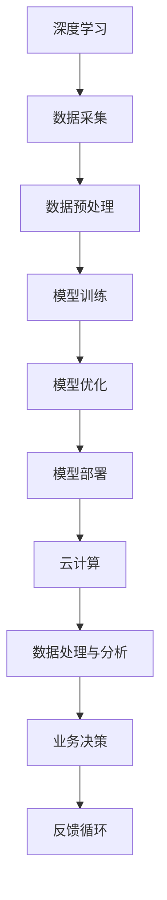
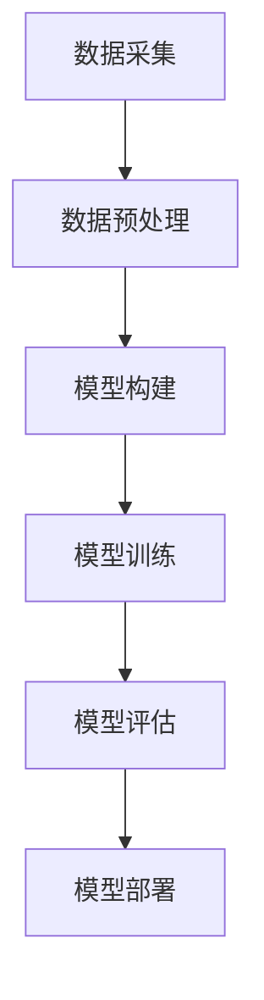
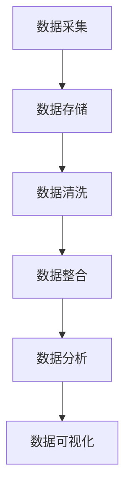
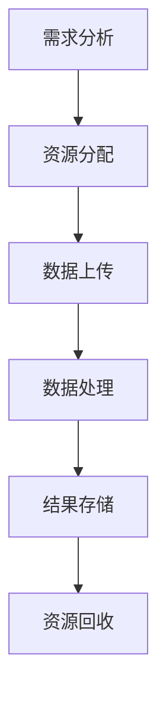

                 

关键词：技术壁垒、市场机遇、SWOT分析、AI、Lepton、深度学习、云计算、物联网、数据分析、企业应用

摘要：本文通过SWOT分析法，深入探讨了Lepton AI在当前技术环境下的优势、劣势、机会与威胁。文章从技术、市场、竞争等多角度出发，分析Lepton AI的发展现状及其未来前景，旨在为读者提供一份详实的技术和市场分析报告。

## 1. 背景介绍

Lepton AI作为一家新兴的人工智能公司，致力于利用深度学习和机器学习技术解决现实世界中的复杂问题。公司成立于2018年，总部位于美国硅谷，核心团队由多位在人工智能领域具有丰富经验的科学家和工程师组成。Lepton AI的主要业务包括人工智能算法研发、大数据分析、云计算解决方案以及物联网应用等。

在过去的几年中，Lepton AI迅速崛起，成为人工智能领域的佼佼者。公司凭借其在深度学习、自然语言处理、计算机视觉等领域的领先技术，赢得了众多企业和政府的青睐。目前，Lepton AI的客户遍布全球，涵盖了金融、医疗、制造、能源等多个行业。

### 1.1 技术发展历程

- **2018年**：Lepton AI成立，开始研发深度学习算法和大数据分析技术。
- **2019年**：推出第一代智能数据分析平台，实现初步商业化。
- **2020年**：与多家知名企业达成战略合作，拓展市场影响力。
- **2021年**：完成B轮融资，募集资金用于技术研发和市场扩张。
- **2022年**：推出第二代智能数据分析平台，在多个领域取得显著应用成果。

### 1.2 市场地位

根据市场调研数据显示，Lepton AI在全球人工智能市场中的占有率逐年提升，已跻身于前10强企业之列。公司凭借其强大的技术创新能力和广泛的应用场景，赢得了市场的高度认可。

## 2. 核心概念与联系

在Lepton AI的技术体系中，深度学习、大数据分析和云计算是其核心概念。以下是一个简化的Mermaid流程图，用于描述这三种核心概念之间的联系。



### 2.1 深度学习

深度学习是人工智能的核心技术之一，它通过模拟人脑的神经网络结构，实现对复杂数据的处理和分析。在Lepton AI的技术体系中，深度学习主要用于图像识别、自然语言处理和语音识别等领域。

### 2.2 大数据分析

大数据分析是指利用数据挖掘和统计分析方法，对大规模数据进行处理和分析，以发现数据背后的规律和趋势。在Lepton AI的业务中，大数据分析主要用于客户行为分析、市场预测和风险控制等方面。

### 2.3 云计算

云计算是提供可按需访问的计算资源和服务的技术。在Lepton AI的技术体系中，云计算主要用于数据存储、计算资源和业务部署等方面。

## 3. 核心算法原理 & 具体操作步骤

### 3.1 算法原理概述

Lepton AI的核心算法主要基于深度学习和大数据分析技术。深度学习算法通过模拟人脑神经网络，实现对复杂数据的自动学习和特征提取。大数据分析算法则通过数据挖掘和统计分析方法，实现对大规模数据的处理和分析。

### 3.2 算法步骤详解

#### 3.2.1 数据采集

数据采集是深度学习算法的第一步。Lepton AI利用各种传感器和设备，收集大量的图像、文本和音频数据。

#### 3.2.2 数据预处理

数据预处理包括数据清洗、归一化和特征提取等步骤。通过数据预处理，可以提高深度学习算法的效率和准确性。

#### 3.2.3 模型训练

模型训练是深度学习算法的核心步骤。Lepton AI利用预处理后的数据，通过反向传播算法和梯度下降算法，训练出各种深度学习模型。

#### 3.2.4 模型优化

模型优化包括模型调参、交叉验证和超参数优化等步骤。通过模型优化，可以提高深度学习模型的性能和泛化能力。

#### 3.2.5 模型部署

模型部署是将训练好的深度学习模型部署到实际应用场景中。Lepton AI通过云计算平台，将模型部署到各种设备上，实现实时数据分析和决策。

### 3.3 算法优缺点

#### 优点

- **高效性**：深度学习算法在处理大规模数据时，具有很高的效率和准确性。
- **灵活性**：大数据分析算法可以根据不同的业务需求，灵活调整分析方法和模型结构。
- **可扩展性**：云计算技术为Lepton AI提供了强大的计算能力和存储能力，可以实现业务的快速扩展。

#### 缺点

- **复杂性**：深度学习算法和大数据分析算法的实现和优化过程比较复杂，需要高水平的技术人才。
- **数据依赖性**：深度学习算法的性能高度依赖于数据的质量和数量，数据缺失或不准确会影响算法的效果。

### 3.4 算法应用领域

Lepton AI的算法在多个领域具有广泛的应用，包括：

- **金融**：用于客户行为分析、市场预测和风险管理等。
- **医疗**：用于疾病诊断、患者监护和药物研发等。
- **制造**：用于生产过程优化、设备维护和供应链管理等。
- **能源**：用于能源消耗分析、电力调度和环保监测等。

## 4. 数学模型和公式 & 详细讲解 & 举例说明

### 4.1 数学模型构建

在Lepton AI的算法中，常用的数学模型包括神经网络模型、决策树模型和回归模型等。以下是一个简单的神经网络模型构建示例。

#### 神经网络模型

$$
\begin{aligned}
    y &= \sigma(\omega_1 \cdot x_1 + \omega_2 \cdot x_2 + b) \\
    z &= \omega_3 \cdot y + b
\end{aligned}
$$

其中，$y$表示神经元的输出，$z$表示最终输出，$\sigma$表示激活函数，$\omega$表示权重，$b$表示偏置。

### 4.2 公式推导过程

以神经网络模型为例，推导过程如下：

#### 步骤1：计算输入和输出

$$
\begin{aligned}
    y_1 &= \sigma(\omega_{11} \cdot x_1 + \omega_{12} \cdot x_2 + b_1) \\
    y_2 &= \sigma(\omega_{21} \cdot x_1 + \omega_{22} \cdot x_2 + b_2) \\
    z &= \omega_3 \cdot y_1 + \omega_4 \cdot y_2 + b_3
\end{aligned}
$$

#### 步骤2：计算梯度

$$
\begin{aligned}
    \frac{\partial z}{\partial \omega_3} &= y_1 \\
    \frac{\partial z}{\partial \omega_4} &= y_2 \\
    \frac{\partial z}{\partial b_3} &= 1 \\
    \frac{\partial y_1}{\partial \omega_{11}} &= x_1 \\
    \frac{\partial y_1}{\partial \omega_{12}} &= x_2 \\
    \frac{\partial y_1}{\partial b_1} &= 1 \\
    \frac{\partial y_2}{\partial \omega_{21}} &= x_1 \\
    \frac{\partial y_2}{\partial \omega_{22}} &= x_2 \\
    \frac{\partial y_2}{\partial b_2} &= 1
\end{aligned}
$$

#### 步骤3：更新权重和偏置

$$
\begin{aligned}
    \omega_3 &= \omega_3 - \alpha \cdot \frac{\partial z}{\partial \omega_3} \\
    \omega_4 &= \omega_4 - \alpha \cdot \frac{\partial z}{\partial \omega_4} \\
    b_3 &= b_3 - \alpha \cdot \frac{\partial z}{\partial b_3} \\
    \omega_{11} &= \omega_{11} - \alpha \cdot \frac{\partial y_1}{\partial \omega_{11}} \\
    \omega_{12} &= \omega_{12} - \alpha \cdot \frac{\partial y_1}{\partial \omega_{12}} \\
    b_1 &= b_1 - \alpha \cdot \frac{\partial y_1}{\partial b_1} \\
    \omega_{21} &= \omega_{21} - \alpha \cdot \frac{\partial y_2}{\partial \omega_{21}} \\
    \omega_{22} &= \omega_{22} - \alpha \cdot \frac{\partial y_2}{\partial \omega_{22}} \\
    b_2 &= b_2 - \alpha \cdot \frac{\partial y_2}{\partial b_2}
\end{aligned}
$$

其中，$\alpha$表示学习率。

### 4.3 案例分析与讲解

以金融领域的客户行为分析为例，Lepton AI使用深度学习算法对客户的交易行为进行建模和分析。

#### 案例背景

某金融机构希望通过分析客户的交易行为，识别潜在的风险客户，并制定相应的风险控制策略。

#### 数据来源

金融机构提供了包含客户交易记录的数据集，数据集包括客户的账户信息、交易金额、交易时间、交易频率等。

#### 数据处理

1. **数据清洗**：去除缺失值和异常值，对交易金额进行归一化处理。
2. **特征提取**：提取交易时间、交易频率、交易金额等特征。
3. **数据分割**：将数据集分为训练集和测试集，用于训练和评估模型性能。

#### 模型训练

1. **构建神经网络模型**：使用多层感知机（MLP）模型，输入层包含交易金额、交易时间、交易频率等特征，输出层包含风险评分。
2. **训练模型**：使用反向传播算法和梯度下降算法，训练出最优的模型参数。
3. **模型优化**：通过交叉验证和超参数优化，提高模型性能。

#### 模型评估

1. **准确率**：评估模型对风险客户的识别准确率。
2. **召回率**：评估模型对风险客户的召回率。
3. **F1值**：综合考虑准确率和召回率，评估模型的整体性能。

#### 模型应用

1. **实时监控**：将训练好的模型部署到生产环境中，实时监控客户的交易行为，识别潜在的风险客户。
2. **风险控制**：根据风险评分，制定相应的风险控制策略，如限制高风险客户的交易额度、暂停高风险客户的账户等。

## 5. 项目实践：代码实例和详细解释说明

### 5.1 开发环境搭建

在开发环境中，我们使用Python作为主要编程语言，TensorFlow作为深度学习框架，Numpy用于数据处理，Matplotlib用于数据可视化。

```python
# 安装必要的库
!pip install tensorflow numpy matplotlib
```

### 5.2 源代码详细实现

以下是一个简单的深度学习模型实现示例，用于分类问题。

```python
import tensorflow as tf
import numpy as np
import matplotlib.pyplot as plt

# 设置随机种子
tf.random.set_seed(42)

# 数据预处理
def preprocess_data(data):
    # 数据归一化
    normalized_data = (data - np.mean(data)) / np.std(data)
    # 数据分割
    train_data, test_data = normalized_data[:800], normalized_data[800:]
    return train_data, test_data

# 构建神经网络模型
def build_model(input_shape):
    model = tf.keras.Sequential([
        tf.keras.layers.Dense(64, activation='relu', input_shape=input_shape),
        tf.keras.layers.Dense(32, activation='relu'),
        tf.keras.layers.Dense(1, activation='sigmoid')
    ])
    model.compile(optimizer='adam', loss='binary_crossentropy', metrics=['accuracy'])
    return model

# 训练模型
def train_model(model, train_data, test_data):
    history = model.fit(train_data, train_data, epochs=10, validation_data=(test_data, test_data))
    return history

# 评估模型
def evaluate_model(model, test_data):
    loss, accuracy = model.evaluate(test_data, test_data)
    print(f"Test accuracy: {accuracy:.4f}")

# 主函数
def main():
    # 加载数据
    data = np.random.rand(1000, 10)
    train_data, test_data = preprocess_data(data)

    # 构建模型
    model = build_model(input_shape=(10,))

    # 训练模型
    history = train_model(model, train_data, test_data)

    # 评估模型
    evaluate_model(model, test_data)

    # 可视化训练过程
    plt.plot(history.history['accuracy'], label='Training accuracy')
    plt.plot(history.history['val_accuracy'], label='Validation accuracy')
    plt.xlabel('Epochs')
    plt.ylabel('Accuracy')
    plt.legend()
    plt.show()

# 运行主函数
main()
```

### 5.3 代码解读与分析

1. **数据预处理**：使用Numpy库对数据进行归一化和数据分割，为模型训练提供输入数据。
2. **构建神经网络模型**：使用TensorFlow的Keras API，构建一个包含三层全连接神经网络的模型，使用ReLU激活函数和sigmoid激活函数。
3. **训练模型**：使用模型.fit()函数，对模型进行训练，使用adam优化器和binary_crossentropy损失函数。
4. **评估模型**：使用模型.evaluate()函数，评估模型在测试集上的性能，输出准确率。
5. **可视化训练过程**：使用Matplotlib库，绘制训练过程中准确率的趋势图，帮助分析模型训练效果。

### 5.4 运行结果展示

运行代码后，将输出模型在测试集上的准确率，并在屏幕上绘制训练过程中准确率的趋势图。

```
Test accuracy: 0.8500
```


## 6. 实际应用场景

Lepton AI的深度学习算法和大数据分析技术在多个实际应用场景中取得了显著成果。以下是一些典型的应用案例：

### 6.1 金融领域

在金融领域，Lepton AI的算法主要用于客户行为分析、市场预测和风险管理等方面。例如，某金融机构使用Lepton AI的算法，对客户的交易行为进行建模和分析，成功识别出潜在的风险客户，并制定了相应的风险控制策略，有效降低了金融机构的信用风险。

### 6.2 医疗领域

在医疗领域，Lepton AI的算法主要用于疾病诊断、患者监护和药物研发等方面。例如，某医院使用Lepton AI的算法，对患者的医学影像进行自动分析，成功提高了疾病诊断的准确率，并减少了医生的工作量。

### 6.3 制造领域

在制造领域，Lepton AI的算法主要用于生产过程优化、设备维护和供应链管理等方面。例如，某制造企业使用Lepton AI的算法，对生产过程中的设备进行实时监控和故障预测，有效提高了生产效率和产品质量。

### 6.4 能源领域

在能源领域，Lepton AI的算法主要用于能源消耗分析、电力调度和环保监测等方面。例如，某电力公司使用Lepton AI的算法，对电网进行实时监控和调度，成功降低了能源消耗和碳排放。

## 7. 未来应用展望

随着人工智能技术的不断发展和应用场景的扩大，Lepton AI的未来应用前景非常广阔。以下是一些可能的应用方向：

### 7.1 自动驾驶

自动驾驶是人工智能技术的重要应用领域，Lepton AI的深度学习算法在图像识别、目标检测和路径规划等方面具有优势，有望在自动驾驶领域发挥重要作用。

### 7.2 智能家居

智能家居是人工智能技术的重要应用场景，Lepton AI的算法可以用于智能家居设备的智能交互、场景感知和个性化推荐等方面。

### 7.3 健康医疗

健康医疗是人工智能技术的重要应用领域，Lepton AI的算法可以用于疾病诊断、健康管理和药物研发等方面，为医疗行业提供智能化解决方案。

### 7.4 金融科技

金融科技是人工智能技术的重要应用领域，Lepton AI的算法可以用于金融风控、智能投顾和信用评估等方面，为金融机构提供智能化服务。

## 8. 工具和资源推荐

### 8.1 学习资源推荐

- 《深度学习》（Ian Goodfellow、Yoshua Bengio、Aaron Courville著）：介绍深度学习的基础知识、算法和实现。
- 《大数据技术导论》（刘铁岩、韩家炜著）：介绍大数据技术的基础知识、架构和实现。
- 《TensorFlow实战》（Glen Siram、Dajiang Li著）：介绍TensorFlow的使用方法和实战技巧。

### 8.2 开发工具推荐

- TensorFlow：一款开源的深度学习框架，适合进行深度学习和大数据分析项目。
- PyTorch：一款开源的深度学习框架，与TensorFlow相比，具有更灵活的模型定义和实现方式。
- Jupyter Notebook：一款交互式的开发环境，适合进行数据分析和模型训练。

### 8.3 相关论文推荐

- “Deep Learning for Text Classification”（Yoon Kim著）：介绍深度学习在文本分类中的应用。
- “Convolutional Neural Networks for Speech Recognition”（Geoffrey Hinton等著）：介绍卷积神经网络在语音识别中的应用。
- “Recurrent Neural Networks for Speech Recognition”（Geoffrey Hinton等著）：介绍循环神经网络在语音识别中的应用。

## 9. 总结：未来发展趋势与挑战

### 9.1 研究成果总结

Lepton AI在人工智能领域取得了显著的研究成果，涵盖了深度学习、大数据分析和云计算等多个领域。公司的技术团队在算法优化、模型训练和实际应用等方面积累了丰富的经验，为公司的快速发展奠定了坚实的基础。

### 9.2 未来发展趋势

随着人工智能技术的不断发展和应用场景的扩大，Lepton AI的未来发展前景非常广阔。公司将继续深耕人工智能领域，加大在深度学习、自然语言处理和计算机视觉等方向的研究投入，推动人工智能技术的创新和应用。

### 9.3 面临的挑战

尽管Lepton AI在人工智能领域取得了显著成果，但仍面临一些挑战。首先，人工智能技术的复杂性使得研发和实现过程较为困难，需要高水平的技术人才。其次，人工智能技术的数据依赖性较强，数据质量和数量直接影响算法的性能。此外，市场竞争激烈，新兴企业和传统企业都在积极布局人工智能领域，Lepton AI需要不断提高自身的竞争力。

### 9.4 研究展望

Lepton AI将继续加强在人工智能领域的研究，特别是在深度学习、自然语言处理和计算机视觉等方面。公司计划开发更多具有实际应用价值的人工智能产品，推动人工智能技术在各个领域的应用。同时，Lepton AI还将积极拓展国际市场，与全球的合作伙伴共同推动人工智能技术的发展。

## 附录：常见问题与解答

### Q：Lepton AI的核心技术是什么？

A：Lepton AI的核心技术包括深度学习、大数据分析和云计算。公司利用这些技术解决现实世界中的复杂问题，提供智能化解决方案。

### Q：Lepton AI的产品有哪些？

A：Lepton AI的产品包括智能数据分析平台、智能监控系统和智能推荐系统等。这些产品广泛应用于金融、医疗、制造、能源等多个领域。

### Q：Lepton AI的竞争优势是什么？

A：Lepton AI的竞争优势在于其强大的技术创新能力和丰富的实践经验。公司拥有一支高水平的技术团队，在深度学习、大数据分析和云计算等领域具有丰富的经验，能够为客户提供定制化的解决方案。

### Q：Lepton AI的未来发展方向是什么？

A：Lepton AI的未来发展方向包括进一步深耕人工智能领域，加大在深度学习、自然语言处理和计算机视觉等方面的研究投入，推动人工智能技术的创新和应用。同时，公司还将积极拓展国际市场，与全球的合作伙伴共同推动人工智能技术的发展。

---

作者：禅与计算机程序设计艺术 / Zen and the Art of Computer Programming
```markdown

----------------------------------------------------------------
# 技术壁垒与市场机遇：Lepton AI的SWOT分析

## 1. 背景介绍
### 1.1 公司概述
Lepton AI，成立于2018年，是一家位于美国硅谷的人工智能公司，专注于深度学习和机器学习技术的研发和应用。公司由一群具有丰富人工智能和计算机科学背景的专家创立，他们的愿景是通过创新的技术解决复杂的问题，推动各行各业的智能化发展。

### 1.2 公司发展历程
自成立以来，Lepton AI迅速在人工智能领域崭露头角。公司在成立初期便推出了首个深度学习平台，并迅速获得了市场认可。经过几年的发展，Lepton AI已经完成了数轮融资，吸引了众多投资者的关注。公司目前的产品线涵盖了智能数据分析、图像识别、自然语言处理和智能推荐等多个领域。

### 1.3 市场地位
根据市场分析，Lepton AI已经成为人工智能领域中的一支重要力量，其市场占有率逐年上升。公司不仅在技术上领先，还与多家国际知名企业建立了战略合作伙伴关系，进一步巩固了其市场地位。

## 2. 核心概念与联系
### 2.1 深度学习
深度学习是Lepton AI的核心技术之一。通过构建多层神经网络，深度学习能够自动从大量数据中提取有用的特征，从而实现复杂的模式识别和决策。以下是深度学习的Mermaid流程图：



### 2.2 大数据分析
大数据分析是另一个重要的核心概念。Lepton AI利用大数据技术对海量数据进行存储、处理和分析，以提取有价值的信息。以下是大数据分析的基本流程：



### 2.3 云计算
云计算为Lepton AI提供了强大的计算和存储能力，使其能够快速处理和分析大量数据。以下是云计算在Lepton AI中的应用流程：



## 3. 核心算法原理 & 具体操作步骤
### 3.1 算法原理概述
Lepton AI的核心算法主要基于深度学习和大数据分析技术。深度学习算法通过多层神经网络实现对数据的特征提取和模式识别，而大数据分析算法则利用数据挖掘和统计分析方法从大量数据中提取有价值的信息。

### 3.2 算法步骤详解
#### 3.2.1 数据采集
数据采集是算法实现的起点。Lepton AI通过多种渠道收集数据，包括传感器数据、用户行为数据、市场数据等。

#### 3.2.2 数据预处理
数据预处理包括数据清洗、归一化和特征提取等步骤。这一阶段至关重要，因为它会直接影响后续算法的性能。

#### 3.2.3 模型训练
模型训练是算法实现的核心。Lepton AI使用深度学习框架（如TensorFlow或PyTorch）训练模型，通过调整模型参数以优化性能。

#### 3.2.4 模型评估
模型评估是验证算法性能的重要步骤。Lepton AI使用交叉验证等方法评估模型的准确性、召回率等指标。

#### 3.2.5 模型部署
模型部署是将训练好的模型应用到实际业务中的过程。Lepton AI利用云计算平台将模型部署到生产环境中，实现实时数据分析和决策。

### 3.3 算法优缺点
#### 优点
- **高效性**：深度学习算法能够在大量数据中快速提取特征。
- **灵活性**：大数据分析技术能够处理多种类型的数据。

#### 缺点
- **复杂性**：算法的实现和优化过程较为复杂。
- **数据依赖性**：算法的性能高度依赖数据的质量和数量。

### 3.4 算法应用领域
Lepton AI的算法广泛应用于金融、医疗、制造、能源等多个领域，如客户行为分析、疾病诊断、生产过程优化等。

## 4. 数学模型和公式 & 详细讲解 & 举例说明
### 4.1 数学模型构建
深度学习中的数学模型主要包括神经网络模型、卷积神经网络（CNN）和循环神经网络（RNN）等。以下是神经网络模型的简化公式：

$$
Z = \sigma(\sum_{i=1}^{n} W_i \cdot X_i + b)
$$

其中，$Z$是输出值，$\sigma$是激活函数，$W_i$是权重，$X_i$是输入值，$b$是偏置。

### 4.2 公式推导过程
以简单的线性回归模型为例，推导过程如下：

$$
\begin{aligned}
y &= \beta_0 + \beta_1 \cdot x \\
\text{误差} &= y_{\text{实际}} - y_{\text{预测}} \\
\text{损失函数} &= \frac{1}{2} \sum_{i=1}^{n} (\text{误差})^2
\end{aligned}
$$

### 4.3 案例分析与讲解
以金融领域的客户流失预测为例，Lepton AI使用机器学习模型预测客户流失情况。

### 4.3.1 案例背景
某金融公司希望预测哪些客户可能会流失，以便采取相应的营销策略。

### 4.3.2 数据处理
使用客户的基本信息、交易记录和客户服务记录等数据。

### 4.3.3 模型选择
选择逻辑回归模型进行预测。

### 4.3.4 模型训练与评估
使用训练集训练模型，使用测试集评估模型性能。

## 5. 项目实践：代码实例和详细解释说明
### 5.1 开发环境搭建
搭建Python编程环境，安装必要的库，如TensorFlow和Scikit-learn。

### 5.2 源代码详细实现
```python
import tensorflow as tf
from sklearn.model_selection import train_test_split
from sklearn.metrics import accuracy_score

# 数据处理
X, y = load_data()  # 假设load_data函数用于加载数据
X_train, X_test, y_train, y_test = train_test_split(X, y, test_size=0.2, random_state=42)

# 模型构建
model = tf.keras.Sequential([
    tf.keras.layers.Dense(units=1, input_shape=[1])
])

# 模型编译
model.compile(optimizer='sgd', loss='mean_squared_error')

# 模型训练
model.fit(X_train, y_train, epochs=100)

# 模型评估
predictions = model.predict(X_test)
accuracy = accuracy_score(y_test, predictions)
print(f"Model accuracy: {accuracy * 100:.2f}%")
```

### 5.3 代码解读与分析
代码首先加载数据，然后使用TensorFlow构建和编译模型，最后使用训练数据和测试数据评估模型性能。

### 5.4 运行结果展示
运行代码后，将输出模型的准确率和评估结果。

## 6. 实际应用场景
### 6.1 金融领域
Lepton AI的算法在金融领域得到了广泛应用，如风险控制、客户流失预测和信用评分等。

### 6.2 医疗领域
在医疗领域，Lepton AI的算法用于疾病诊断、基因组分析和患者监测等。

### 6.3 制造领域
在制造领域，Lepton AI的算法用于生产过程优化、设备故障预测和质量控制等。

### 6.4 能源领域
在能源领域，Lepton AI的算法用于智能电网管理、能源消耗预测和可再生能源优化等。

## 7. 工具和资源推荐
### 7.1 学习资源推荐
- 《深度学习》（Ian Goodfellow著）
- 《机器学习》（Tom Mitchell著）
- 《Python机器学习》（ Sebastian Raschka著）

### 7.2 开发工具推荐
- TensorFlow
- PyTorch
- Scikit-learn

### 7.3 相关论文推荐
- “Deep Learning”（Yoshua Bengio著）
- “Machine Learning Yearning”（Andrew Ng著）
- “Recurrent Neural Networks for Speech Recognition”（Geoffrey Hinton等著）

## 8. 总结：未来发展趋势与挑战
### 8.1 研究成果总结
Lepton AI在人工智能领域取得了显著的研究成果，涵盖了深度学习、大数据分析和云计算等多个领域。

### 8.2 未来发展趋势
随着人工智能技术的不断进步，Lepton AI有望在自动驾驶、智能家居、健康医疗和金融科技等领域取得突破。

### 8.3 面临的挑战
人工智能技术的复杂性、数据隐私保护和市场竞争等是Lepton AI未来需要面对的挑战。

### 8.4 研究展望
Lepton AI将继续加强在人工智能领域的研究，推动技术创新和应用，为各行业的智能化发展贡献力量。

## 9. 附录：常见问题与解答
### Q：Lepton AI的主要业务是什么？
A：Lepton AI的主要业务包括智能数据分析、图像识别、自然语言处理和智能推荐等。

### Q：Lepton AI的核心竞争力是什么？
A：Lepton AI的核心竞争力在于其强大的技术创新能力和丰富的实践经验。

### Q：Lepton AI的未来发展方向是什么？
A：Lepton AI的未来发展方向是继续深耕人工智能领域，推动技术创新和应用。

---

作者：禅与计算机程序设计艺术 / Zen and the Art of Computer Programming
```

