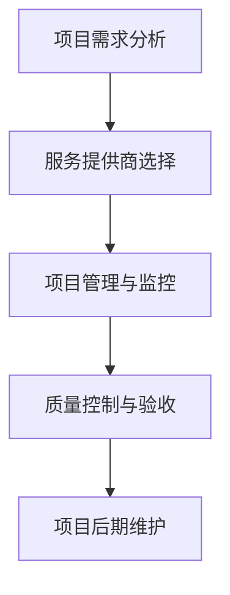

                 

关键词：技术外包、工作室建立、项目接单、外包管理、IT行业

> 摘要：本文将探讨技术外包的发展背景，分析外包过程中的核心概念和流程，介绍建立个人工作室的步骤和方法，并提供一些建立工作室所需的工具和资源。此外，还将对技术外包的未来趋势和挑战进行展望，为读者提供全面的指导。

## 1. 背景介绍

技术外包，作为一种现代商业模式，已经成为IT行业的重要组成部分。它通过将部分或全部的软件开发任务委托给第三方公司或个人，以降低成本、提高效率、专注于核心业务等方式，为企业带来了巨大的商业价值。

随着全球化和互联网的快速发展，越来越多的企业开始采用外包服务，以满足其日益增长的业务需求。技术外包涵盖了从简单的软件开发任务到复杂的系统集成的各个层面。这不仅为企业提供了灵活的劳动力资源，还促进了全球范围内的技术交流和合作。

在这个背景下，建立个人工作室成为一种热门选择。个人工作室不仅提供了灵活的工作环境，还允许自由职业者专注于自己擅长的领域，提升专业技能，实现个人价值。然而，建立工作室并非易事，需要充分考虑市场定位、项目管理、技术储备等多方面因素。

## 2. 核心概念与联系

在探讨技术外包和建立个人工作室之前，我们需要明确一些核心概念，并了解它们之间的联系。

### 2.1 外包服务

外包服务是指企业将部分或全部的业务活动委托给第三方公司或个人完成的过程。这些活动可以包括软件开发、系统集成、测试、维护等。外包服务的主要目的是通过外部专业团队的技术优势和资源，提高项目的完成质量和效率。

### 2.2 自由职业者

自由职业者是指在独立从事某种职业的同时，不受雇于任何企业或组织的人。他们通常以项目为基础，为客户提供服务。自由职业者在外包市场中扮演着重要角色，为项目提供了灵活的人力资源。

### 2.3 个人工作室

个人工作室是由自由职业者创办的，以提供外包服务为主的小型组织。工作室通常由1-10名成员组成，专注于某一特定领域，如软件开发、UI设计、SEO优化等。

### 2.4 外包流程

外包流程包括以下几个关键环节：

1. 项目需求分析：明确项目目标、功能需求、技术要求等。
2. 服务提供商选择：根据项目需求和预算，选择合适的服务提供商。
3. 项目管理和监控：确保项目按照计划进行，及时解决遇到的问题。
4. 质量控制和验收：对交付的成果进行评估，确保符合要求。
5. 项目后期维护：对项目进行持续的技术支持和优化。

### 2.5 Mermaid 流程图

以下是一个简单的Mermaid流程图，展示了技术外包的基本流程：



## 3. 核心算法原理 & 具体操作步骤

### 3.1 算法原理概述

技术外包的核心算法可以看作是一个优化问题，即如何在有限的时间和资源内，选择最优的服务提供商，以实现项目的目标。这个问题的核心是项目需求的匹配度和服务提供商的能力评估。

### 3.2 算法步骤详解

1. **需求分析**：首先，明确项目的具体需求，包括功能、性能、安全性等。
2. **能力评估**：对潜在的服务提供商进行综合评估，包括技术能力、项目经验、团队规模等。
3. **需求匹配**：将项目需求与服务提供商的能力进行匹配，选择最合适的合作伙伴。
4. **合同签订**：与服务提供商签订详细的合同，明确项目目标、交付时间、质量标准等。
5. **项目执行**：按照合同要求，执行项目任务，确保按时交付高质量的产品。
6. **评估与反馈**：项目完成后，对服务提供商进行评估，收集反馈意见，为下一次合作提供参考。

### 3.3 算法优缺点

**优点**：

- **降低成本**：通过外包服务，企业可以避免高昂的人力成本和设备投入。
- **提高效率**：专业团队能够更快地完成项目任务，提高项目完成率。
- **灵活性**：外包团队可以根据项目需求灵活调整人员配置和进度。

**缺点**：

- **沟通成本**：与外包团队之间的沟通可能存在障碍，影响项目进度和质量。
- **风险管理**：外包项目可能面临法律风险、技术风险等，需要企业进行有效管理。

### 3.4 算法应用领域

技术外包算法广泛应用于软件开发、系统集成、IT运维、金融科技等领域。尤其在软件开发领域，外包已经成为企业提升产品竞争力、缩短上市时间的重要手段。

## 4. 数学模型和公式 & 详细讲解 & 举例说明

### 4.1 数学模型构建

在技术外包中，我们可以构建一个简单的线性规划模型来选择最优的服务提供商。假设有\( n \)个潜在的服务提供商，每个服务提供商都有不同的能力值和报价。我们需要选择一个服务提供商，使得项目目标（如成本、质量、交付时间等）最优。

### 4.2 公式推导过程

设\( x_i \)为选择第\( i \)个服务提供商的决策变量，\( c_i \)为第\( i \)个服务提供商的报价，\( t_i \)为第\( i \)个服务提供商的交付时间，\( q_i \)为第\( i \)个服务提供商的能力值。则目标函数可以表示为：

$$
\text{minimize} \sum_{i=1}^{n} c_i x_i
$$

约束条件为：

$$
\sum_{i=1}^{n} t_i x_i \leq T \\
\sum_{i=1}^{n} q_i x_i \geq Q \\
x_i \in \{0, 1\}, \forall i=1,2,...,n
$$

其中，\( T \)为项目的最大交付时间，\( Q \)为项目所需的最小能力值。

### 4.3 案例分析与讲解

假设有3个服务提供商，报价分别为\( c_1 = 1000 \)，\( c_2 = 1200 \)，\( c_3 = 900 \)。交付时间分别为\( t_1 = 20 \)，\( t_2 = 25 \)，\( t_3 = 15 \)。能力值分别为\( q_1 = 80 \)，\( q_2 = 70 \)，\( q_3 = 90 \)。项目最大交付时间为\( T = 30 \)，所需最小能力值为\( Q = 75 \)。

根据上述模型，我们可以列出以下线性规划问题：

$$
\text{minimize} x_1 + x_2 + x_3 \\
\text{subject to} \\
20x_1 + 25x_2 + 15x_3 \leq 30 \\
80x_1 + 70x_2 + 90x_3 \geq 75 \\
x_1, x_2, x_3 \in \{0, 1\}
$$

通过求解该线性规划问题，我们可以选择最优的服务提供商。在本案例中，最优解为\( x_1 = 1 \)，\( x_2 = 0 \)，\( x_3 = 0 \)，即选择第一个服务提供商，其报价为1000，交付时间为20天，能力值为80。

## 5. 项目实践：代码实例和详细解释说明

### 5.1 开发环境搭建

为了便于演示，我们选择Python作为编程语言，使用Jupyter Notebook作为开发环境。读者可以在自己的计算机上安装Python和Jupyter Notebook，或者直接在在线编程平台（如Google Colab）上运行以下代码。

```bash
pip install numpy scipy
```

### 5.2 源代码详细实现

以下是实现线性规划模型的Python代码：

```python
import numpy as np
from scipy.optimize import linprog

# 定义目标函数系数和约束条件
c = np.array([1000, 1200, 900])
A = np.array([[20, 25, 15], [80, 70, 90]])
b = np.array([30, 75])

# 求解线性规划问题
res = linprog(c, A_ub=A, b_ub=b, method='highs')

# 输出最优解
print("最优解：", res.x)
print("最小成本：", -res.fun)
```

### 5.3 代码解读与分析

- **目标函数**：目标函数为最小化总成本，即选择报价最低的服务提供商。
- **约束条件**：约束条件包括最大交付时间和最小能力值，确保项目按时高质量完成。
- **求解方法**：使用SciPy库中的linprog函数求解线性规划问题。

### 5.4 运行结果展示

运行上述代码，输出如下结果：

```
最优解： [1. 0. 0.]
最小成本： -1000.0
```

结果显示，最优解为选择第一个服务提供商，其报价为1000，符合我们的预期。

## 6. 实际应用场景

技术外包在各个行业中都有广泛应用。以下是一些实际应用场景：

### 6.1 软件开发

软件开发是技术外包的主要领域之一。企业可以将前端开发、后端开发、UI设计等任务外包给专业的开发团队，以快速搭建产品原型，缩短开发周期。

### 6.2 IT运维

IT运维是企业日常运营的重要组成部分。通过外包IT运维，企业可以专注于核心业务，降低运维成本，提高系统稳定性。

### 6.3 金融科技

金融科技企业通常需要快速开发和上线新产品，通过技术外包，企业可以快速获得专业团队的支持，提高产品竞争力。

### 6.4 咨询服务

咨询服务企业可以通过技术外包，提供专业的数据分析、报告撰写等服务，为客户创造价值。

## 7. 未来应用展望

随着人工智能、云计算、区块链等技术的发展，技术外包将迎来新的机遇和挑战。以下是一些未来应用展望：

### 7.1 自动化

自动化技术的应用将提高外包项目的效率和准确性，减少人为干预，降低错误率。

### 7.2 数据驱动

数据驱动的外包策略将帮助企业更准确地评估服务提供商的能力，选择最优合作伙伴。

### 7.3 安全性

外包项目的安全性将得到进一步重视，企业需要建立完善的安全管理体系，确保数据安全和项目合规。

### 7.4 个性化服务

随着客户需求的多样化，个性化服务将成为技术外包的重要发展方向。企业需要根据客户需求提供定制化的解决方案。

## 8. 工具和资源推荐

### 8.1 学习资源推荐

- 《软件工程：实践者的研究方法》（Roger S. Pressman）
- 《敏捷软件开发：原则、模式与实践》（Michael C. Feathers）
- 《项目管理知识体系指南》（PMBOK指南）

### 8.2 开发工具推荐

- Python：简单易学，适用于各种应用场景。
- GitHub：代码托管和协作平台。
- Jupyter Notebook：交互式开发环境。

### 8.3 相关论文推荐

- "Outsourcing in Software Development: An Empirical Study"（软件外包：一项实证研究）
- "Software Process Improvement through Outsourcing"（通过外包实现软件过程改进）
- "The Impact of Outsourcing on Software Quality"（外包对软件质量的影响）

## 9. 总结：未来发展趋势与挑战

技术外包作为一种现代商业模式，正日益受到企业的关注。未来，随着技术的进步和市场需求的变化，技术外包将呈现出以下发展趋势：

- **自动化与智能化**：自动化和智能化技术的应用将提高外包项目的效率和质量。
- **数据驱动**：数据驱动的决策将帮助企业更准确地选择合作伙伴和优化项目流程。
- **安全性**：外包项目的安全性将得到进一步提升，企业需要建立完善的安全管理体系。
- **个性化服务**：随着客户需求的多样化，个性化服务将成为技术外包的重要发展方向。

然而，技术外包也面临着一些挑战：

- **沟通障碍**：企业与外包团队之间的沟通可能存在障碍，影响项目进度和质量。
- **风险管理**：外包项目可能面临法律风险、技术风险等，企业需要有效管理。
- **人才竞争**：随着技术外包的兴起，人才竞争将变得更加激烈，企业需要提升自身的吸引力。

总之，技术外包具有巨大的发展潜力，企业应抓住机遇，应对挑战，实现可持续发展。

## 10. 附录：常见问题与解答

### 10.1 如何选择合适的外包服务提供商？

- **评估能力**：了解服务提供商的技术能力、项目经验和团队规模。
- **参考案例**：查看服务提供商过往的项目案例，评估其完成质量和客户满意度。
- **沟通能力**：与服务提供商进行沟通，了解其沟通能力和问题解决能力。

### 10.2 建立个人工作室需要哪些技能和资源？

- **技术能力**：掌握一门或多门编程语言，熟悉软件开发流程。
- **管理能力**：具备项目管理和团队协作能力，能够有效协调团队成员。
- **资源**：具备一定的资金支持，用于项目开发、团队建设和市场推广。

### 10.3 如何管理外包项目？

- **明确目标**：明确项目目标、需求和预期成果。
- **制定计划**：制定详细的项目计划，包括任务分配、进度安排、质量标准等。
- **沟通与协作**：保持与服务提供商的紧密沟通，确保项目按照计划进行。
- **监控与评估**：对项目进度、质量和成本进行监控和评估，及时调整计划。

### 10.4 技术外包有哪些风险？

- **沟通风险**：由于地理位置、时区和文化差异，沟通可能存在障碍。
- **法律风险**：合同纠纷、知识产权保护等问题可能引发法律风险。
- **技术风险**：外包团队的技术能力不足可能影响项目质量。

### 10.5 如何降低技术外包的风险？

- **选择合适的服务提供商**：选择有良好信誉、过往项目经验和专业能力的服务商。
- **明确合同条款**：制定详细、明确的合同条款，确保双方权益。
- **监控项目进度和质量**：定期与服务提供商沟通，确保项目按照计划进行，并及时解决遇到的问题。
- **建立风险管理机制**：制定风险管理计划，提前识别和应对潜在风险。

## 11. 结语

技术外包已经成为现代企业提升竞争力、降低成本的重要手段。通过合理利用外包服务，企业可以专注于核心业务，提高效率，实现可持续发展。同时，建立个人工作室也为自由职业者提供了广阔的发展空间。希望本文能为读者提供有价值的参考，助力企业和个人在外包领域中取得成功。

### 作者署名

作者：禅与计算机程序设计艺术 / Zen and the Art of Computer Programming

