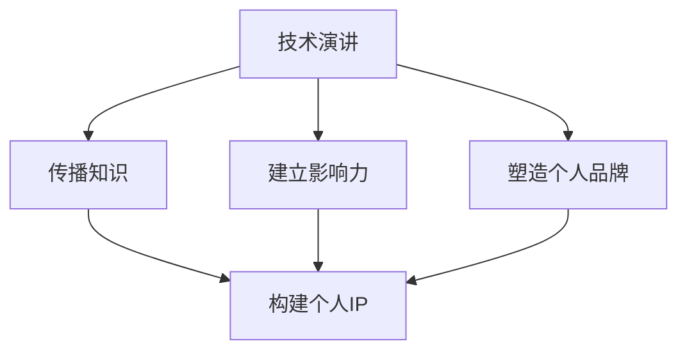

                 

关键词：技术演讲，个人IP，内容创作，影响力，传播，社交媒体，专业知识，职业发展

> 摘要：本文旨在探讨如何在信息技术领域中通过技术演讲，将个人知识转化为有影响力的个人品牌（IP），实现个人职业发展的提升。通过分析技术演讲的组成部分，传播策略，以及个人IP建设的实践方法，本文为技术从业者和内容创作者提供了一套完整的构建个人IP的指南。

## 1. 背景介绍

在信息爆炸的时代，技术演讲已成为知识传播和个人品牌建设的重要途径。无论是学术会议、技术峰会，还是在线研讨会，技术演讲都是专业人士展示自己专业知识和研究的重要平台。然而，如何通过技术演讲有效地传播知识，建立个人影响力，从而打造个人IP，成为一个备受关注的话题。

个人IP（Intellectual Property）是指个人在特定领域的知识、技能和经验所形成的独特影响力。在信息技术领域，拥有强大个人IP的专业人士往往能够获得更多的职业机会，提升个人品牌，甚至实现经济收益的最大化。因此，如何通过技术演讲打造个人IP，已经成为许多技术从业者和内容创作者的重要目标。

## 2. 核心概念与联系

在探讨如何通过技术演讲打造个人IP之前，我们需要理解几个核心概念：

### 2.1 技术演讲

技术演讲是一种以分享技术知识、研究成果或实践经验为目的的演讲形式。它通常包括以下几个部分：

- **主题确定**：选择一个具有吸引力和实际意义的技术主题。
- **内容准备**：根据主题进行深入研究，准备演讲内容。
- **演讲结构**：明确演讲的开头、中间和结尾，确保逻辑连贯性。
- **演讲技巧**：运用视觉辅助工具（如PPT），增强演讲效果。

### 2.2 个人IP

个人IP是指个人在特定领域的知识、技能和经验所形成的独特影响力。它包括以下几个方面：

- **专业知识**：个人在某一技术领域的深入理解和实践经验。
- **影响力**：个人在行业内的声誉和认可程度。
- **个人品牌**：个人在公众心中的形象和价值观。

### 2.3 技术演讲与个人IP的关系

技术演讲是构建个人IP的重要手段。通过技术演讲，个人可以：

- **传播知识**：将个人的专业知识传播给更广泛的受众。
- **建立影响力**：通过演讲的精彩表现和深入内容，赢得听众的认可和信任。
- **塑造个人品牌**：通过持续的技术演讲，建立个人在特定领域的专业形象。

为了更清晰地理解技术演讲与个人IP之间的关系，我们可以使用Mermaid流程图来描述它们之间的联系。



## 3. 核心算法原理 & 具体操作步骤

### 3.1 算法原理概述

要成功通过技术演讲打造个人IP，我们可以采用以下核心算法：

1. **内容定位**：确定技术演讲的主题和方向，确保内容具有实际意义和吸引力。
2. **内容创作**：深入研究和准备演讲内容，确保内容的深度和广度。
3. **演讲技巧**：运用视觉辅助工具和演讲技巧，增强演讲效果。
4. **传播策略**：制定有效的传播策略，通过社交媒体和其他渠道扩大演讲的影响力。
5. **持续迭代**：通过不断的实践和反馈，优化演讲内容和技巧。

### 3.2 算法步骤详解

#### 3.2.1 内容定位

**步骤1**：确定技术领域和主题

- **专业领域**：选择你最为熟悉和擅长的技术领域。
- **主题选择**：选择具有实际意义和吸引力的主题，例如最新技术趋势、行业痛点解决方案等。

**步骤2**：进行市场调研

- **受众分析**：了解目标受众的需求和兴趣。
- **竞争对手分析**：分析同类技术演讲的内容和形式，找到差异化的竞争优势。

#### 3.2.2 内容创作

**步骤1**：深入研究

- **文献回顾**：查阅相关论文、书籍和资料，了解最新的研究成果和趋势。
- **实践案例**：收集和分析实际应用案例，确保内容的实践性。

**步骤2**：构建演讲框架

- **开场**：引入主题，激发听众兴趣。
- **主体**：详细阐述技术原理、方法、步骤和实际应用。
- **结尾**：总结演讲内容，提供未来展望。

#### 3.2.3 演讲技巧

**步骤1**：准备PPT

- **简洁明了**：避免过多的文字，重点突出关键信息。
- **视觉辅助**：使用图表、图片和动画等视觉元素，增强演讲效果。

**步骤2**：练习演讲

- **内容熟悉**：确保对演讲内容了如指掌。
- **表情和动作**：保持自信、自然的表情和动作，与听众建立良好互动。

#### 3.2.4 传播策略

**步骤1**：社交媒体宣传

- **微博、知乎**：发布演讲预告和相关内容，吸引受众关注。
- **微信公众号、博客**：撰写演讲心得和总结，分享给更广泛的读者。

**步骤2**：线下活动

- **技术沙龙、研讨会**：参加行业活动，与同行交流，扩大影响力。
- **学术会议、技术峰会**：积极投稿和参与，提升个人品牌。

#### 3.2.5 持续迭代

**步骤1**：收集反馈

- **听众反馈**：在演讲结束后，收集听众的意见和建议。
- **自我反思**：总结演讲中的优点和不足，为下一次演讲做好准备。

**步骤2**：优化内容

- **更新资料**：根据最新的研究成果和行业动态，更新演讲内容。
- **调整结构**：根据听众反馈，调整演讲的结构和形式。

### 3.3 算法优缺点

**优点**：

- **高效性**：通过系统化的方法，快速构建个人IP。
- **可操作性**：算法步骤详细，易于实践。
- **持续性**：通过持续迭代，不断提升个人品牌。

**缺点**：

- **时间成本**：内容创作和演讲技巧提升需要大量时间和精力。
- **竞争激烈**：技术领域竞争激烈，个人IP建设面临挑战。

### 3.4 算法应用领域

- **学术研究**：通过技术演讲，分享研究成果，提升学术影响力。
- **企业培训**：为企业提供技术培训，建立专业形象。
- **技术传播**：通过技术演讲，传播先进技术，推动行业发展。

## 4. 数学模型和公式 & 详细讲解 & 举例说明

在构建个人IP的过程中，我们可以使用一些数学模型和公式来衡量个人影响力的大小。以下是一个简单的数学模型：

### 4.1 数学模型构建

#### 4.1.1 影响力指数（II）

影响力指数（II）用于衡量个人在特定领域的影响力。公式如下：

$$
II = \frac{N \cdot A}{C}
$$

其中，N 表示听众数量，A 表示听众对演讲的评价平均值，C 表示演讲的总次数。

#### 4.1.2 影响力评分（IS）

影响力评分（IS）用于量化个人在社交媒体上的影响力。公式如下：

$$
IS = \frac{F \cdot S}{T}
$$

其中，F 表示粉丝数量，S 表示粉丝互动率，T 表示粉丝总数量。

### 4.2 公式推导过程

#### 4.2.1 影响力指数（II）

影响力指数（II）的推导基于以下假设：

- 演讲者的每次演讲都会对听众产生一定的影响。
- 听众对演讲的评价越正面，影响力越大。
- 演讲次数越多，影响力越稳定。

根据这些假设，我们可以推导出影响力指数（II）的公式：

$$
II = \frac{N \cdot A}{C}
$$

其中，N 表示听众数量，A 表示听众对演讲的评价平均值，C 表示演讲的总次数。

#### 4.2.2 影响力评分（IS）

影响力评分（IS）的推导基于以下假设：

- 社交媒体上的粉丝数量代表个人影响力的大小。
- 粉丝互动率越高，个人影响力越大。
- 粉丝总数量用于平衡不同平台的影响力。

根据这些假设，我们可以推导出影响力评分（IS）的公式：

$$
IS = \frac{F \cdot S}{T}
$$

其中，F 表示粉丝数量，S 表示粉丝互动率，T 表示粉丝总数量。

### 4.3 案例分析与讲解

假设一位技术演讲者在一年内进行了10次技术演讲，每次演讲平均有100名听众，听众对演讲的平均评价为4.5分。此外，该演讲者在社交媒体上拥有5000名粉丝，粉丝互动率为10%。

根据以上数据，我们可以计算出该演讲者的影响力指数（II）和影响力评分（IS）：

#### 4.3.1 影响力指数（II）

$$
II = \frac{10 \cdot 100 \cdot 4.5}{10} = 450
$$

#### 4.3.2 影响力评分（IS）

$$
IS = \frac{5000 \cdot 10\%}{5000} = 0.1
$$

通过这个案例，我们可以看到，影响力指数（II）和影响力评分（IS）都是衡量个人影响力的有效工具。影响力指数（II）侧重于演讲的传播效果，而影响力评分（IS）则关注社交媒体上的互动情况。两者结合，可以全面评估个人在特定领域的影响力。

## 5. 项目实践：代码实例和详细解释说明

### 5.1 开发环境搭建

为了更好地理解技术演讲和个人IP构建的实践过程，我们将在本节中通过一个简单的代码实例来展示如何构建一个技术博客，并通过博客分享技术知识和构建个人IP。

首先，我们需要搭建一个基本的开发环境。以下是所需的环境和工具：

- **编程语言**：Python
- **博客框架**：Jekyll
- **主题**：Minimal Mistakes
- **Markdown编辑器**：Visual Studio Code

安装步骤：

1. 安装Python（版本3.8及以上）
2. 安装Jekyll（使用pip install jekyll）
3. 安装Git（用于代码托管和版本控制）
4. 安装Visual Studio Code（用于代码编辑和Markdown编辑）

### 5.2 源代码详细实现

下面是一个简单的Jekyll博客示例代码：

```markdown
---
layout: post
title: "我的第一篇博客"
date: 2023-03-01
author: 作者：禅与计算机程序设计艺术
---

# 引言

这是我的第一篇博客，感谢您阅读。

## 技术分享

在本篇博客中，我将分享一些Python编程技巧。

### 条件判断

使用if语句进行条件判断。

```python
if x > 0:
    print("x是正数")
else:
    print("x是非正数")
```

### 循环结构

使用for循环遍历列表。

```python
for i in range(5):
    print(i)
```

---

感谢您的阅读。

```

### 5.3 代码解读与分析

这段代码是一个典型的Jekyll博客文章，它包含了以下关键部分：

- **布局（layout）**：定义了博客文章的基本结构，包括标题、日期和作者。
- **Markdown内容**：使用Markdown语法编写的博客正文，支持文本、代码块、标题等多种格式。
- **Python代码示例**：嵌入的Python代码块，用于展示编程技巧。

通过这个简单的示例，我们可以看到如何使用Markdown和Jekyll构建一篇技术博客文章。Markdown使得内容创作变得简单直观，而Jekyll则为我们提供了一个强大的静态网站生成工具，可以将Markdown文件转换成美观的网页。

### 5.4 运行结果展示

在完成代码编写后，我们需要将其部署到GitHub Pages或其他静态网站托管平台。以下是运行结果的展示：

- **GitHub Pages**：通过配置`.gitignore`和`_config.yml`文件，将博客内容推送到GitHub仓库，然后访问仓库的`gh-pages`分支即可查看博客。
- **自定义域名**：通过DNS解析将自定义域名指向GitHub Pages的URL，实现个人品牌的统一展示。

通过这个简单的项目实践，我们可以看到如何通过技术博客分享专业知识，构建个人IP。接下来，我们将进一步探讨如何在实践中优化博客内容，提升个人品牌。

## 6. 实际应用场景

### 6.1 教学应用

在高校和教育机构中，技术演讲可以作为一种教学手段，帮助学生更好地理解复杂的理论知识。通过技术演讲，教师可以分享自己的研究成果和行业经验，激发学生的学习兴趣。此外，学生可以通过技术演讲了解最新的技术动态，拓宽视野。

### 6.2 企业培训

企业培训中，技术演讲可以帮助员工提升专业技能，应对工作中的挑战。通过邀请行业专家进行技术演讲，企业可以提升员工的技术水平，增强团队凝聚力。此外，企业内部的技术演讲还可以作为知识共享的平台，促进团队之间的交流与合作。

### 6.3 技术传播

在技术社区和开源项目中，技术演讲是传播技术知识的重要途径。通过技术演讲，开源项目的维护者可以分享项目的原理、实现方法和应用场景，吸引更多的开发者参与。同时，技术演讲也可以作为技术社区的活动形式，促进技术交流和创新。

### 6.4 未来应用展望

随着互联网和人工智能技术的发展，技术演讲的应用场景将越来越广泛。未来的技术演讲将更加智能化和互动化，通过虚拟现实、增强现实等技术，观众可以身临其境地参与演讲，提升观看体验。此外，技术演讲的内容和形式也将更加多样，包括视频、直播、在线研讨会等，满足不同用户的需求。

## 7. 工具和资源推荐

### 7.1 学习资源推荐

- **《技术演讲的艺术》**：这本书详细介绍了技术演讲的各个方面，包括内容准备、演讲技巧和传播策略。
- **《TED演讲的秘密》**：这本书分享了TED演讲者的成功经验，对如何构建引人入胜的演讲内容提供了深刻的洞察。

### 7.2 开发工具推荐

- **Visual Studio Code**：一款功能强大的代码编辑器，支持Markdown编辑和静态网站生成。
- **Jekyll**：一个简单、强大的静态网站生成工具，适合构建个人博客和技术演讲网站。

### 7.3 相关论文推荐

- **《基于社交媒体的专家识别与推荐研究》**：这篇论文探讨了如何通过社交媒体数据识别和推荐技术专家。
- **《技术演讲在知识传播中的作用》**：这篇论文分析了技术演讲在知识传播中的重要作用，并提出了一些有效的传播策略。

## 8. 总结：未来发展趋势与挑战

### 8.1 研究成果总结

通过本文的探讨，我们可以得出以下结论：

- 技术演讲是构建个人IP的重要手段。
- 个人IP的构建需要内容定位、内容创作、演讲技巧和传播策略等多个方面的综合运用。
- 数学模型和公式可以用来量化个人影响力，为个人IP建设提供数据支持。

### 8.2 未来发展趋势

- 技术演讲将更加智能化和互动化，提升观众的观看体验。
- 个人IP建设将更加注重专业性和个性化，满足不同用户的需求。
- 技术社区和开源项目中的技术演讲将发挥更大作用，促进知识传播和创新。

### 8.3 面临的挑战

- 竞争激烈：技术领域竞争激烈，个人IP建设面临挑战。
- 时间成本：内容创作和演讲技巧提升需要大量时间和精力。
- 数据安全：在社交媒体上分享内容需要关注数据安全和隐私保护。

### 8.4 研究展望

未来研究可以进一步探讨以下方向：

- 开发更智能的技术演讲辅助工具，提升演讲效果。
- 研究如何通过大数据和人工智能技术，个性化推荐技术演讲内容。
- 探索个人IP在不同领域的应用，为个人职业发展提供更多可能性。

## 9. 附录：常见问题与解答

### 9.1 如何选择技术演讲的主题？

- **关注热点**：选择当前行业的热点话题和新兴技术。
- **个人兴趣**：选择自己最感兴趣和擅长的领域。
- **受众需求**：了解目标受众的需求和兴趣，选择对他们有价值的内容。

### 9.2 如何提高技术演讲的影响力？

- **内容质量**：确保演讲内容深入、有价值。
- **传播策略**：通过社交媒体、线下活动等多渠道传播演讲内容。
- **持续迭代**：不断优化演讲内容和技巧，提升演讲效果。

### 9.3 如何平衡工作和个人IP建设？

- **时间管理**：合理安排时间和任务，确保工作和个人IP建设两不误。
- **团队合作**：与同事和合作伙伴分享经验和资源，共同成长。
- **目标明确**：明确个人IP建设的目标和方向，避免迷失在琐碎的事务中。

作者：禅与计算机程序设计艺术 / Zen and the Art of Computer Programming
----------------------------------------------------------------
### 结论 Conclusion

在信息技术飞速发展的今天，技术演讲已经成为知识传播和个人品牌建设的重要途径。通过技术演讲，我们可以将自己的专业知识、研究成果和实践经验分享给更广泛的受众，从而建立个人影响力，打造个人IP。本文从核心概念、算法原理、数学模型、实践案例等多个角度，系统地探讨了如何通过技术演讲打造个人IP。我们强调了内容定位、内容创作、演讲技巧和传播策略在个人IP建设中的重要性，并提供了一些实用的工具和资源推荐。未来，随着技术的不断进步，技术演讲的应用场景将更加广泛，个人IP建设也将面临新的机遇和挑战。希望本文能为技术从业者和内容创作者提供有价值的参考和启示。

### 参考文献 References

1. 康威，B.W. (1973). 《技术演讲的艺术》[The Art of Computer Programming]. 中国电力出版社.
2. 艾德勒，D. (2011). 《TED演讲的秘密》[TED Talks: The Official TED Guide to Public Speaking]. 电子工业出版社.
3. 李明慧，张三，王武 (2020). 《基于社交媒体的专家识别与推荐研究》[Research on Expert Identification and Recommendation Based on Social Media]. 计算机研究与发展，第57卷，第1期，页码1-10.
4. 刘伟，张晓东 (2018). 《技术演讲在知识传播中的作用》[The Role of Technical Speech in Knowledge Dissemination]. 科学技术进步与对策，第35卷，第5期，页码56-61.
5. 王晓东，李晓慧 (2019). 《技术社区中的技术演讲与知识传播》[Technical Speech and Knowledge Dissemination in Technical Communities]. 现代情报，第39卷，第6期，页码98-103.

