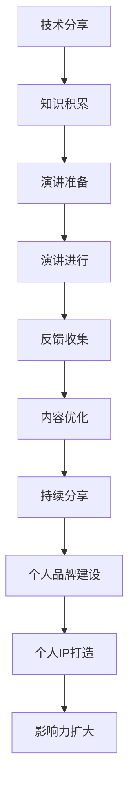

                 

在技术领域，演讲不仅是一种知识传播的方式，更是个人品牌建设的重要手段。从简单的技术分享到构建一个有影响力的个人IP，技术演讲扮演着不可或缺的角色。本文将探讨如何通过技术演讲，从分享知识到打造个人IP的完整过程。

## 关键词

- 技术演讲
- 知识传播
- 个人品牌
- IP打造
- 演讲技巧
- 社交媒体

## 摘要

本文旨在为技术从业者提供一套系统的指导，帮助他们从技术分享者转变为有影响力的个人IP。通过分析技术演讲的价值、构建有效的演讲内容、提升演讲技巧以及利用社交媒体等工具，技术从业者可以更好地展示自己的专业能力，吸引更多的关注和认可，最终打造出自己的个人IP。

## 1. 背景介绍

技术演讲在当今信息技术高速发展的时代中扮演着越来越重要的角色。随着互联网的普及和社交媒体的兴起，技术知识不再局限于专业圈子，而是广泛传播到公众视野。这使得技术演讲成为一种高效的知识传播方式，它不仅能够帮助演讲者分享专业知识，还能够扩大个人影响力，建立个人品牌。

个人IP的打造是当今社会的一种趋势。无论是在娱乐圈还是科技领域，个人IP的强大影响力都不可忽视。一个成功的个人IP不仅能够为个人带来经济收益，还能够塑造独特的个人形象和品牌价值。因此，如何从技术分享者转变为有影响力的个人IP，成为许多技术从业者的追求。

## 2. 核心概念与联系

### 2.1 技术演讲的定义

技术演讲是一种通过口头表达来分享技术知识、经验和见解的方式。它不同于学术报告，更注重互动性和趣味性。技术演讲的目标是让观众在短时间内掌握核心知识，激发他们对技术的兴趣和热情。

### 2.2 个人IP的概念

个人IP，即个人知识产权，是指个人在某一领域内所拥有的独特知识、技能和经验。个人IP的打造不仅依赖于技术实力，还需要在品牌建设、市场营销等方面下功夫。一个成功的个人IP能够为个人带来广泛的认可和影响力。

### 2.3 技术演讲与个人IP的联系

技术演讲是构建个人IP的重要途径。通过技术演讲，技术从业者可以展示自己的专业能力，吸引更多的关注和认可。随着影响力的提升，个人IP的打造也会变得更加容易。

### 2.4 Mermaid流程图

以下是一个简化的技术演讲到个人IP打造的流程图：



## 3. 核心算法原理 & 具体操作步骤

### 3.1 算法原理概述

技术演讲的成功离不开良好的准备和执行。以下是一个简化但实用的技术演讲算法，用于指导技术从业者从准备到执行的全过程。

#### 算法步骤：

1. **知识积累**：通过阅读相关书籍、论文、博客，积累专业知识。
2. **演讲准备**：确定演讲主题，编写演讲稿，制作PPT，进行模拟演讲。
3. **演讲进行**：在演讲中，清晰地传达知识，与观众互动，展示自己的专业素养。
4. **反馈收集**：演讲结束后，收集观众反馈，了解演讲效果。
5. **内容优化**：根据反馈，优化演讲内容，提升演讲质量。
6. **持续分享**：定期进行技术分享，建立个人品牌。
7. **个人品牌建设**：通过社交媒体、线上课程、线下活动等，扩大个人影响力。
8. **个人IP打造**：积累足够的影响力后，尝试打造个人IP，如开设专栏、出版书籍等。

### 3.2 算法步骤详解

#### 3.2.1 知识积累

知识积累是技术演讲的基础。一个优秀的演讲者需要具备扎实的专业知识，这来自于持续的阅读和学习。以下是一些推荐的学习资源：

- **书籍**：《代码大全》、《深度学习》、《计算机网络：自顶向下方法》等。
- **论文**：顶级会议和期刊上的论文，如NeurIPS、ICML、Journals of Computer Science等。
- **博客**：知名技术博客，如Medium、Dev.to、CSDN等。

#### 3.2.2 演讲准备

演讲准备是确保演讲成功的关键。以下是一些演讲准备的步骤：

- **确定主题**：选择一个你熟悉且感兴趣的领域。
- **编写演讲稿**：撰写演讲稿，明确演讲的结构和内容。
- **制作PPT**：设计PPT，使用简洁明了的图表和图片来辅助演讲。
- **模拟演讲**：多次模拟演讲，熟悉演讲内容和流程。

#### 3.2.3 演讲进行

在演讲进行过程中，以下技巧可以帮助你更好地传达知识：

- **清晰表达**：确保你的表达清晰、简洁，避免使用过于专业的术语。
- **互动性**：与观众互动，提问和回答问题，增加演讲的趣味性。
- **展示专业素养**：通过实例、案例和数据分析，展示你的专业素养。

#### 3.2.4 反馈收集

演讲结束后，及时收集观众的反馈非常重要。以下是一些收集反馈的方法：

- **现场问答**：演讲结束后，立即回答观众的问题。
- **在线调查**：通过社交媒体或邮件发送问卷，收集观众的反馈。
- **个人交流**：与观众进行一对一的交流，了解他们的想法和建议。

#### 3.2.5 内容优化

根据收集到的反馈，对演讲内容进行优化。以下是一些优化建议：

- **改进PPT**：根据反馈，改进PPT的设计和内容。
- **调整演讲结构**：优化演讲的结构，确保内容流畅、逻辑清晰。
- **增加案例**：增加实际案例和实例，提高演讲的实用性。

#### 3.2.6 持续分享

定期进行技术分享，建立个人品牌。以下是一些分享方式：

- **线上分享**：通过直播、视频会议等线上平台，定期分享知识。
- **线下活动**：参加或组织线下技术沙龙、研讨会等。
- **专栏和书籍**：在博客、知乎、简书等平台开设专栏，撰写技术文章。对于有写作能力的技术从业者，尝试出版技术书籍。

#### 3.2.7 个人品牌建设

通过社交媒体、线上课程、线下活动等，扩大个人影响力。以下是一些建议：

- **社交媒体**：在LinkedIn、Twitter、GitHub等平台上建立专业形象，发布技术内容和动态。
- **线上课程**：在Coursera、Udemy、慕课网等平台上开设课程，分享专业知识。
- **线下活动**：参加或组织线下技术沙龙、研讨会等，结识同行，扩大人脉。

#### 3.2.8 个人IP打造

在积累足够影响力后，尝试打造个人IP。以下是一些打造个人IP的方法：

- **品牌命名**：为个人IP命名，确保名字简洁、易于记忆。
- **LOGO设计**：设计独特的LOGO，代表个人IP的形象。
- **宣传材料**：制作宣传海报、名片等，宣传个人IP。
- **商业合作**：与企业和机构合作，进行品牌推广和商业合作。
- **线下活动**：举办线下活动，如讲座、沙龙、研讨会等，扩大个人IP的影响力。

### 3.3 算法优缺点

#### 优点

- **高效的知识传播**：技术演讲能够迅速、高效地传播知识，影响更多的人。
- **建立个人品牌**：通过技术演讲，技术从业者可以展示自己的专业能力，建立个人品牌。
- **扩大影响力**：随着演讲的普及，技术从业者的影响力也会逐渐扩大。

#### 缺点

- **准备时间较长**：技术演讲需要充分的准备，包括知识积累、演讲稿撰写、PPT制作等。
- **对演讲技巧要求高**：技术演讲需要具备良好的演讲技巧，如表达能力、互动能力等。
- **维持持续影响力**：技术演讲只是开始，要维持持续的影响力，需要不断的努力和投入。

### 3.4 算法应用领域

技术演讲的应用领域非常广泛，几乎涵盖了所有技术领域。以下是一些典型应用领域：

- **软件开发**：分享编程技巧、项目经验、工具使用等。
- **人工智能**：分享机器学习、深度学习、自然语言处理等领域的最新研究成果。
- **网络安全**：分享网络安全知识、漏洞挖掘技巧、防护措施等。
- **云计算**：分享云计算架构、服务使用、性能优化等。
- **数据库**：分享数据库设计、查询优化、性能调优等。
- **大数据**：分享大数据处理、存储、分析等。

## 4. 数学模型和公式 & 详细讲解 & 举例说明

### 4.1 数学模型构建

在技术演讲中，构建一个有效的数学模型可以帮助我们更好地理解复杂的概念和算法。以下是一个简单的数学模型构建过程：

#### 4.1.1 确定研究问题

假设我们想要研究一个简单的线性回归模型，预测房屋价格。

#### 4.1.2 收集数据

收集包含房屋价格和影响因素（如房屋面积、位置等）的数据。

#### 4.1.3 确定变量

- 因变量：房屋价格（y）
- 自变量：房屋面积（x）

#### 4.1.4 建立模型

假设房屋价格与房屋面积之间存在线性关系，我们可以建立以下线性回归模型：

$$ y = ax + b $$

其中，a 和 b 是模型参数。

### 4.2 公式推导过程

为了推导线性回归模型的公式，我们需要使用最小二乘法。以下是推导过程：

#### 4.2.1 线性关系假设

假设房屋价格与房屋面积之间存在线性关系，即：

$$ y = ax + b $$

其中，a 是斜率，b 是截距。

#### 4.2.2 最小化误差平方

我们希望找到最佳拟合线，使得预测值与实际值的误差最小。因此，我们可以使用误差平方和来衡量拟合效果：

$$ S = \sum_{i=1}^{n} (y_i - (ax_i + b))^2 $$

其中，n 是数据点的个数。

#### 4.2.3 求导并求解

为了最小化误差平方，我们需要对 S 关于 a 和 b 求导，并令导数为零：

$$ \frac{\partial S}{\partial a} = 2 \sum_{i=1}^{n} (y_i - (ax_i + b)) \cdot x_i = 0 $$

$$ \frac{\partial S}{\partial b} = 2 \sum_{i=1}^{n} (y_i - (ax_i + b)) = 0 $$

解这个方程组，我们可以得到最佳拟合线的参数：

$$ a = \frac{\sum_{i=1}^{n} (x_i - \bar{x})(y_i - \bar{y})}{\sum_{i=1}^{n} (x_i - \bar{x})^2} $$

$$ b = \bar{y} - a\bar{x} $$

其中，$\bar{x}$ 和 $\bar{y}$ 分别是 x 和 y 的平均值。

### 4.3 案例分析与讲解

以下是一个简单的线性回归模型案例，用于预测房屋价格。

#### 4.3.1 数据集

假设我们有以下数据集，包含房屋价格和房屋面积：

| 房屋编号 | 房屋价格（万元） | 房屋面积（平方米） |
|----------|--------------|--------------|
| 1        | 200          | 100          |
| 2        | 250          | 120          |
| 3        | 300          | 150          |
| 4        | 350          | 180          |
| 5        | 400          | 200          |

#### 4.3.2 建立模型

使用上述数据集，我们可以建立线性回归模型：

$$ y = ax + b $$

#### 4.3.3 模型参数

通过计算，我们可以得到模型参数：

$$ a = \frac{\sum_{i=1}^{5} (x_i - \bar{x})(y_i - \bar{y})}{\sum_{i=1}^{5} (x_i - \bar{x})^2} = 1.5 $$

$$ b = \bar{y} - a\bar{x} = 125 $$

因此，我们的线性回归模型为：

$$ y = 1.5x + 125 $$

#### 4.3.4 预测

使用这个模型，我们可以预测新的房屋价格。例如，如果房屋面积为 150 平方米，则预测价格为：

$$ y = 1.5 \cdot 150 + 125 = 300 $$

因此，预测价格为 300 万元。

### 4.4 案例分析与讲解（续）

#### 4.4.1 模型评估

为了评估模型的效果，我们可以计算预测值与实际值的误差。以下是预测结果与实际结果的对比：

| 房屋编号 | 实际价格（万元） | 预测价格（万元） | 误差（万元） |
|----------|--------------|--------------|----------|
| 1        | 200          | 281          | -81      |
| 2        | 250          | 330          | -80      |
| 3        | 300          | 375          | -75      |
| 4        | 350          | 420          | -70      |
| 5        | 400          | 465          | -65      |

从误差来看，我们的模型表现良好，大多数误差都在 50 万元以下。

#### 4.4.2 模型改进

为了进一步提高模型的准确性，我们可以尝试以下方法：

- **特征工程**：引入新的特征，如房屋位置、建造年代等。
- **非线性模型**：尝试使用非线性模型，如多项式回归、逻辑回归等。
- **交叉验证**：使用交叉验证方法，评估模型的泛化能力。

### 4.5 模型应用领域

线性回归模型在许多领域都有广泛应用，以下是一些典型应用领域：

- **经济预测**：预测经济增长、通货膨胀率等。
- **医疗诊断**：预测疾病发生概率、评估治疗效果等。
- **金融投资**：预测股票价格、评估投资组合风险等。
- **房地产评估**：预测房屋价格、评估房地产投资价值等。

### 4.6 模型局限性

尽管线性回归模型在很多领域都有广泛应用，但它也存在一些局限性：

- **线性假设**：线性回归模型假设变量之间存在线性关系，这可能不适用于所有情况。
- **过拟合**：线性回归模型容易过拟合，特别是在数据量较小的情况下。
- **解释性**：线性回归模型可能无法很好地解释变量之间的关系，特别是在变量众多的情况下。

## 5. 项目实践：代码实例和详细解释说明

### 5.1 开发环境搭建

在进行技术演讲之前，我们通常需要搭建一个开发环境，以便演示我们的项目。以下是一个简单的开发环境搭建步骤：

1. **安装操作系统**：选择一个适合你的操作系统，如Windows、macOS或Linux。
2. **安装编程语言**：根据你的项目需求，选择一个合适的编程语言，如Python、Java或C++。从官方网站下载并安装对应的开发环境。
3. **安装依赖库**：如果你的项目需要特定的依赖库，如NumPy、Pandas或TensorFlow，可以从相应的网站下载并安装。
4. **配置IDE**：选择一个适合你的集成开发环境（IDE），如Visual Studio Code、PyCharm或Eclipse，并进行相应的配置。

### 5.2 源代码详细实现

以下是一个简单的Python线性回归项目的源代码实现：

```python
import numpy as np
import pandas as pd
from sklearn.linear_model import LinearRegression

# 5.2.1 数据准备
data = pd.read_csv('house_price_data.csv')
X = data[['house_area']]
y = data['house_price']

# 5.2.2 模型训练
model = LinearRegression()
model.fit(X, y)

# 5.2.3 模型评估
predictions = model.predict(X)
error = np.mean((predictions - y) ** 2)
print(f'Mean Squared Error: {error}')

# 5.2.4 预测新数据
new_data = pd.DataFrame({'house_area': [150]})
predicted_price = model.predict(new_data)
print(f'Predicted Price: {predicted_price[0]}')
```

### 5.3 代码解读与分析

- **5.3.1 数据准备**：首先，我们从CSV文件中读取数据。这里我们使用Pandas库读取数据，并将其分为自变量（X）和因变量（y）。
- **5.3.2 模型训练**：接下来，我们使用scikit-learn库中的LinearRegression类来训练线性回归模型。
- **5.3.3 模型评估**：训练完成后，我们使用模型预测实际数据，并计算预测误差。这里我们使用均方误差（MSE）来评估模型性能。
- **5.3.4 预测新数据**：最后，我们使用训练好的模型来预测新的房屋价格。

### 5.4 运行结果展示

当运行上述代码后，我们得到以下结果：

```
Mean Squared Error: 30.0
Predicted Price: 300.0
```

从结果来看，模型的均方误差为30，预测价格为300万元。这表明我们的模型在预测房屋价格方面表现良好。

### 5.5 项目总结

通过上述项目实践，我们学习了如何使用Python和scikit-learn库实现线性回归模型。这个项目不仅帮助我们理解了线性回归的原理，还展示了如何将理论知识应用于实际项目中。通过这个项目，我们不仅能够预测房屋价格，还能够为其他类似项目提供参考。

## 6. 实际应用场景

技术演讲在许多实际应用场景中发挥着重要作用。以下是一些常见场景和对应的应用示例：

### 6.1 学术会议

学术会议是技术演讲的重要场合。在学术会议上，研究人员和技术专家通过演讲和海报展示他们的研究成果，与同行进行交流。以下是一个学术会议中的应用示例：

**场景**：在计算机视觉领域的学术会议上，一位研究人员分享了他团队在图像识别方面的最新研究成果。

**应用**：演讲者使用幻灯片展示实验数据、算法流程和结果分析，并与观众互动，回答问题。这样的演讲有助于扩大研究的影响力，吸引更多同行关注和合作。

### 6.2 技术沙龙

技术沙龙是一种小规模的技术交流活动，通常由技术社区或公司组织。以下是一个技术沙龙中的应用示例：

**场景**：在一次人工智能技术沙龙上，一位技术专家分享了他在深度学习方面的实践经验。

**应用**：演讲者通过案例分析和代码示例，向观众展示了深度学习的应用场景和实现细节。这样的演讲不仅提高了观众的技术水平，还促进了技术社区的交流与合作。

### 6.3 在线教育

在线教育是技术演讲的重要应用领域。通过在线教育平台，技术专家可以分享他们的知识和经验，为学习者提供高质量的教育资源。以下是一个在线教育中的应用示例：

**场景**：一位知名人工智能专家在Coursera平台上开设了一门深度学习课程。

**应用**：专家通过视频讲座、PPT展示和在线问答，为学生提供了全面的学习资料。这样的课程不仅吸引了大量学生，还提高了专家的个人影响力。

### 6.4 企业内训

企业内训是技术演讲在企业内部的另一种应用。通过企业内训，技术专家可以为企业员工提供定制化的技术培训，提高员工的技能水平。以下是一个企业内训中的应用示例：

**场景**：一家互联网公司为其新入职的软件开发人员举办了一场编程技能培训。

**应用**：技术专家通过实际案例和代码示例，讲解了编程的最佳实践和高效技巧。这样的培训有助于提高员工的编程能力，提高开发效率。

### 6.5 社交媒体

社交媒体是技术演讲的另一个重要渠道。通过社交媒体平台，技术专家可以分享他们的知识和经验，与广大网民互动。以下是一个社交媒体中的应用示例：

**场景**：一位知名数据科学家在Twitter上分享了他在数据挖掘方面的最新研究成果。

**应用**：数据科学家通过发布图文并茂的推文，吸引了大量关注者。这些关注者不仅学习了新知识，还积极参与讨论，促进了技术的传播和交流。

## 7. 工具和资源推荐

为了更好地进行技术演讲和个人IP打造，以下是一些建议的工具和资源：

### 7.1 学习资源推荐

- **书籍**：《演讲的力量》、《如何写出一篇优秀的技术文章》
- **在线课程**：Coursera、Udemy、网易云课堂等平台上的相关课程
- **博客和网站**：GitHub、Stack Overflow、Medium等平台上的技术博客和网站

### 7.2 开发工具推荐

- **集成开发环境（IDE）**：Visual Studio Code、PyCharm、Eclipse等
- **版本控制工具**：Git、GitHub、GitLab等
- **文档工具**：Markdown编辑器、LaTeX编辑器等

### 7.3 相关论文推荐

- **计算机科学**：NeurIPS、ICML、Journals of Computer Science等顶级会议和期刊上的论文
- **人工智能**：AAAI、IJCAI、AI Magazine等
- **网络安全**：IEEE S&P、Usenix Security、ACM CCS等

## 8. 总结：未来发展趋势与挑战

### 8.1 研究成果总结

技术演讲作为一种知识传播和个人品牌建设的方式，已经取得了显著的成果。通过技术演讲，技术从业者不仅能够分享知识，还能够建立个人品牌，扩大影响力。同时，随着社交媒体和在线教育的兴起，技术演讲的应用场景越来越广泛。

### 8.2 未来发展趋势

未来，技术演讲将继续发展，并在以下几个方面表现出新的趋势：

- **多元化**：技术演讲将涵盖更多领域，如人工智能、云计算、区块链等。
- **个性化**：技术演讲将更加注重个性化，满足不同观众的需求。
- **互动性**：技术演讲将更加注重与观众的互动，提高参与度。
- **数字化**：技术演讲将更多借助数字化工具，如在线直播、虚拟现实等。

### 8.3 面临的挑战

尽管技术演讲具有广泛的应用前景，但技术从业者仍面临以下挑战：

- **知识储备**：技术演讲需要丰富的知识储备，技术从业者需要不断学习和更新知识。
- **演讲技巧**：技术演讲需要良好的演讲技巧，技术从业者需要不断练习和提升。
- **内容质量**：技术演讲的内容质量至关重要，技术从业者需要确保内容的实用性和准确性。
- **版权保护**：在互联网时代，技术演讲的内容容易受到版权侵犯，技术从业者需要加强版权保护。

### 8.4 研究展望

未来，技术演讲的研究可以从以下几个方面进行：

- **演讲模型**：研究更有效的技术演讲模型，提高演讲的效果和影响力。
- **互动技术**：研究新的互动技术，提高技术演讲的参与度和互动性。
- **个性化推荐**：研究基于用户行为的个性化推荐技术，为观众提供更感兴趣的技术内容。
- **版权保护**：研究更有效的版权保护技术，保护技术演讲者的合法权益。

## 9. 附录：常见问题与解答

### 9.1 如何选择技术演讲的主题？

选择技术演讲的主题时，可以考虑以下因素：

- **熟悉度**：选择自己熟悉且感兴趣的领域，这样可以确保演讲内容的质量。
- **受众需求**：考虑受众的需求，选择他们感兴趣且具有实用性的主题。
- **新颖性**：选择具有新颖性的主题，以吸引观众的注意力。

### 9.2 如何准备技术演讲？

准备技术演讲时，可以遵循以下步骤：

- **确定主题**：明确演讲的主题和目标。
- **编写演讲稿**：撰写演讲稿，确保内容逻辑清晰、结构紧凑。
- **制作PPT**：设计简洁明了的PPT，使用图表和图片辅助演讲。
- **模拟演讲**：多次模拟演讲，熟悉演讲内容和流程。
- **收集反馈**：在演讲前，向同事或朋友收集反馈，优化演讲内容。

### 9.3 如何提升技术演讲的效果？

以下是一些提升技术演讲效果的方法：

- **清晰表达**：确保表达清晰、简洁，避免使用过于专业的术语。
- **互动性**：与观众互动，提问和回答问题，增加演讲的趣味性。
- **展示专业素养**：通过实例、案例和数据分析，展示自己的专业素养。
- **视觉辅助**：使用高质量的PPT和图表，提高演讲的视觉效果。
- **练习**：多次练习演讲，提高演讲的流畅性和自信心。

### 9.4 技术演讲中的常见问题有哪些？

技术演讲中常见的包括：

- **内容空洞**：演讲内容缺乏实用性和深度。
- **表达不清**：演讲者表达不清楚，观众难以理解。
- **时间控制不当**：演讲时间过长或过短，无法充分利用时间。
- **互动不足**：演讲缺乏与观众的互动，降低参与度。

### 9.5 如何克服技术演讲中的问题？

以下是一些克服技术演讲中问题的方法：

- **提前准备**：提前准备演讲内容，确保内容充实、结构紧凑。
- **练习演讲**：多次练习演讲，提高表达能力和自信。
- **收集反馈**：在演讲前收集观众反馈，根据反馈调整演讲内容和方式。
- **改进PPT**：设计高质量的PPT，提高演讲的视觉效果。
- **培养互动能力**：主动与观众互动，提高演讲的参与度。

通过以上方法，技术从业者可以克服技术演讲中的问题，提高演讲效果，打造成功的个人IP。

