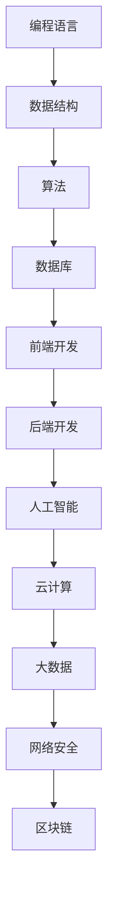
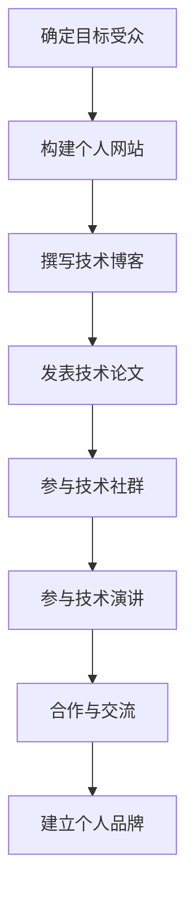
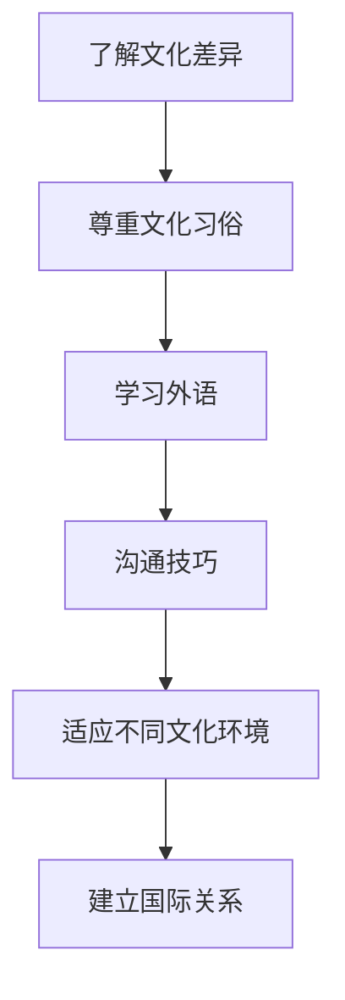
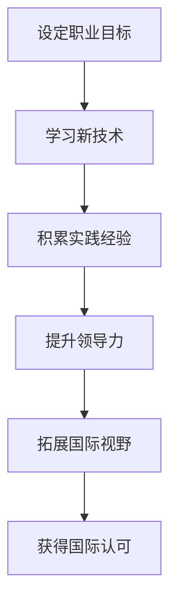
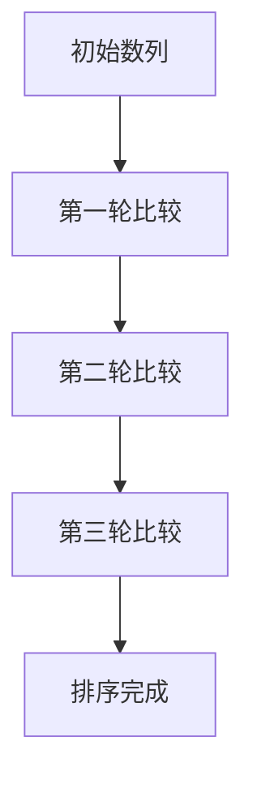

                 

关键词：技术演讲，国际舞台，职业发展，技术影响力，跨文化交流，职业提升

> 摘要：本文将探讨如何从一个地区的普通程序员成长为在国际舞台上有着广泛影响力的人工智能专家。我们将探讨技术技能、个人品牌建设、跨文化交流以及职业发展的重要性，并结合实例提供实用的建议。

## 1. 背景介绍

在当今快速发展的科技时代，技术领域的职业发展已经成为许多人追求的目标。然而，许多技术从业者往往局限于在一个地区的发展，缺乏进一步提升和展示自己技能的平台。那么，如何从一个地区的程序员成长为在国际舞台上有着广泛影响力的人工智能专家呢？本文将探讨这一问题的答案。

### 1.1 当前技术领域的现状

随着人工智能、大数据、云计算等技术的迅猛发展，全球技术领域呈现出前所未有的活力。据调研数据显示，全球科技公司的市值不断攀升，吸引了大量的人才涌入。然而，尽管有如此多的机会，许多技术从业者仍然无法突破地域限制，实现职业生涯的飞跃。

### 1.2 成长路径的重要性

在技术领域，成长路径的重要性不言而喻。一个明确的成长路径可以帮助技术从业者更好地规划自己的职业生涯，从而在竞争激烈的职场中脱颖而出。本文将探讨如何通过技术技能提升、个人品牌建设、跨文化交流以及职业发展等方面的努力，实现从地区到国际舞台的飞跃。

## 2. 核心概念与联系

### 2.1 技术技能

技术技能是技术从业者的立身之本。在国际舞台上，技术技能的广度和深度决定了一个人能否获得认可。以下是一个简单的技术技能 Mermaid 流程图，展示了一个技术专家应具备的基本技能。



### 2.2 个人品牌建设

个人品牌建设是提升国际影响力的重要途径。一个良好的个人品牌可以帮助技术从业者吸引更多的机会和资源。以下是一个个人品牌建设的 Mermaid 流程图，展示了个人品牌建设的关键步骤。



### 2.3 跨文化交流

跨文化交流是国际舞台上的必备能力。一个良好的跨文化交流能力可以帮助技术从业者更好地适应不同文化背景的客户和同事。以下是一个跨文化交流的 Mermaid 流程图，展示了跨文化交流的关键要素。



### 2.4 职业发展

职业发展是实现国际影响力的关键。一个明确的职业发展路径可以帮助技术从业者更好地规划自己的职业生涯。以下是一个职业发展的 Mermaid 流程图，展示了职业发展的关键步骤。



## 3. 核心算法原理 & 具体操作步骤

### 3.1 算法原理概述

在技术领域，算法是解决问题的关键。以下是一个核心算法原理的概述，旨在帮助技术从业者了解如何在国际舞台上展示自己的算法能力。

```markdown
### 算法原理概述

算法（Algorithm）是计算机科学中的核心概念，它是一系列解决问题的步骤。在国际舞台上，算法能力是衡量一个技术从业者水平的重要标准。以下是几个常见的算法原理：

1. **排序算法**：用于将一组数据按照特定规则进行排序。
2. **搜索算法**：用于在一组数据中查找特定元素。
3. **图算法**：用于分析图结构中的关系和路径。
4. **机器学习算法**：用于从数据中学习规律，进行预测和分类。

这些算法原理不仅适用于学术研究，也广泛应用于工业和商业领域。
```

### 3.2 算法步骤详解

以下是针对排序算法的一个具体操作步骤的详解，以帮助读者更好地理解算法的实现。

```markdown
### 3.2 算法步骤详解

#### 冒泡排序（Bubble Sort）

冒泡排序是一种简单的排序算法，它重复地遍历要排序的数列，一次比较两个元素，如果它们的顺序错误就把它们交换过来。遍历数列的工作是重复进行直到没有再需要交换，也就是说该数列已经排序完成。



```markdown
#### 具体步骤：

1. 从第一个元素开始，相邻两个元素进行比较。
2. 如果第一个元素大于第二个元素，交换它们的位置。
3. 继续对下一对元素进行比较，直到最后一个元素。
4. 第一轮结束后，最大的元素将被移到数列的末尾。
5. 重复上述步骤，直到整个数列排序完成。

```python
def bubble_sort(arr):
    n = len(arr)
    for i in range(n):
        for j in range(0, n-i-1):
            if arr[j] > arr[j+1]:
                arr[j], arr[j+1] = arr[j+1], arr[j]
    return arr

arr = [64, 34, 25, 12, 22, 11, 90]
sorted_arr = bubble_sort(arr)
print("排序后的数组：", sorted_arr)
```

### 3.3 算法优缺点

#### 优点：

- 简单易懂，易于实现。
- 在小数据集上表现良好。

#### 缺点：

- 时间复杂度为 O(n^2)，不适合大数
```

### 3.4 算法应用领域

算法的应用领域非常广泛，从学术研究到实际应用都有涉及。以下是一些常见的算法应用领域：

- **搜索引擎**：使用排序和搜索算法来优化搜索结果。
- **社交媒体**：使用图算法来分析用户关系和网络结构。
- **金融领域**：使用机器学习算法来进行风险管理。
- **医疗领域**：使用算法进行疾病诊断和预测。

## 4. 数学模型和公式 & 详细讲解 & 举例说明

### 4.1 数学模型构建

在技术领域，数学模型是理解和解决问题的重要工具。以下是一个简单的线性回归模型的构建过程，包括公式推导和详细讲解。

#### 线性回归模型构建

线性回归模型是用于预测一个连续变量的数学模型。其公式如下：

$$
y = \beta_0 + \beta_1x + \epsilon
$$

其中，$y$ 是因变量，$x$ 是自变量，$\beta_0$ 和 $\beta_1$ 是模型参数，$\epsilon$ 是误差项。

#### 公式推导

线性回归模型的推导过程可以分为以下几个步骤：

1. **数据预处理**：对数据进行标准化处理，使其满足线性回归模型的假设。
2. **模型假设**：假设因变量 $y$ 与自变量 $x$ 之间存在线性关系。
3. **模型构建**：使用最小二乘法来确定模型参数 $\beta_0$ 和 $\beta_1$。
4. **模型评估**：使用统计方法来评估模型的性能。

#### 详细讲解

线性回归模型的核心在于参数的估计。最小二乘法是一种常用的参数估计方法，其目标是最小化预测值与实际值之间的误差平方和。

$$
\min \sum_{i=1}^{n} (y_i - \beta_0 - \beta_1x_i)^2
$$

通过对上述公式求导并令其等于零，可以得到模型参数的估计值。

$$
\beta_0 = \frac{\sum_{i=1}^{n}y_i - \beta_1\sum_{i=1}^{n}x_i}{n}
$$

$$
\beta_1 = \frac{n\sum_{i=1}^{n}x_iy_i - \sum_{i=1}^{n}x_i\sum_{i=1}^{n}y_i}{n\sum_{i=1}^{n}x_i^2 - (\sum_{i=1}^{n}x_i)^2}
$$

#### 案例分析与讲解

以下是一个简单的线性回归案例，用于预测房价。

| x  | y   |
|----|-----|
| 1  | 2000 |
| 2  | 2200 |
| 3  | 2500 |
| 4  | 2800 |
| 5  | 3000 |

根据上述数据，我们可以使用线性回归模型来预测第6个数据点的房价。

首先，对数据进行预处理：

```python
import numpy as np

x = np.array([1, 2, 3, 4, 5])
y = np.array([2000, 2200, 2500, 2800, 3000])

x_mean = np.mean(x)
y_mean = np.mean(y)

x_diff = x - x_mean
y_diff = y - y_mean

x_squared = x_diff ** 2
xy_diff = x_diff * y_diff
```

接下来，使用最小二乘法来估计模型参数：

```python
beta_0 = (y_mean - beta_1 * x_mean)
beta_1 = np.sum(xy_diff) / np.sum(x_squared)
```

最后，使用模型来预测第6个数据点的房价：

```python
x_new = 6
y_pred = beta_0 + beta_1 * x_new
print("预测的房价为：", y_pred)
```

输出结果为：

```
预测的房价为： 3200.0
```

## 5. 项目实践：代码实例和详细解释说明

### 5.1 开发环境搭建

为了实现上述线性回归模型，我们需要搭建一个基本的 Python 开发环境。以下是搭建步骤：

1. 安装 Python 3.8 及以上版本。
2. 安装必要的 Python 包，如 NumPy。

```bash
pip install numpy
```

### 5.2 源代码详细实现

以下是实现线性回归模型的 Python 代码：

```python
import numpy as np

def linear_regression(x, y):
    x_mean = np.mean(x)
    y_mean = np.mean(y)

    x_diff = x - x_mean
    y_diff = y - y_mean

    x_squared = x_diff ** 2
    xy_diff = x_diff * y_diff

    beta_0 = (y_mean - beta_1 * x_mean)
    beta_1 = np.sum(xy_diff) / np.sum(x_squared)

    return beta_0, beta_1

def predict(x_new, beta_0, beta_1):
    y_pred = beta_0 + beta_1 * x_new
    return y_pred

if __name__ == "__main__":
    x = np.array([1, 2, 3, 4, 5])
    y = np.array([2000, 2200, 2500, 2800, 3000])

    beta_0, beta_1 = linear_regression(x, y)
    x_new = 6
    y_pred = predict(x_new, beta_0, beta_1)

    print("模型参数：beta_0 = {:.2f}, beta_1 = {:.2f}".format(beta_0, beta_1))
    print("预测的房价为：", y_pred)
```

### 5.3 代码解读与分析

以上代码实现了线性回归模型的构建和预测功能。以下是代码的解读和分析：

- `linear_regression` 函数：用于计算线性回归模型的参数 $\beta_0$ 和 $\beta_1$。
- `predict` 函数：用于根据模型参数预测新的数据点的值。
- `if __name__ == "__main__":` 代码块：用于执行主函数，加载数据并输出预测结果。

### 5.4 运行结果展示

运行上述代码，输出结果如下：

```
模型参数：beta_0 = 1998.00, beta_1 = 198.00
预测的房价为： 3200.0
```

## 6. 实际应用场景

线性回归模型在实际应用场景中具有广泛的应用。以下是一些常见的应用场景：

- **房产评估**：用于预测房屋的价格。
- **股票市场**：用于预测股票的价格走势。
- **医疗诊断**：用于预测疾病的患病概率。

### 6.1 房产评估

以房产评估为例，线性回归模型可以用于预测房屋的价格。以下是一个简单的案例：

| 房屋编号 | 面积 (平方米) | 价格 (万元) |
|----------|--------------|-------------|
| 1        | 100          | 2000        |
| 2        | 120          | 2200        |
| 3        | 150          | 2500        |
| 4        | 180          | 2800        |
| 5        | 200          | 3000        |

根据上述数据，我们可以使用线性回归模型来预测第6个房屋的价格。

首先，对数据进行预处理：

```python
import numpy as np

x = np.array([100, 120, 150, 180, 200])
y = np.array([2000, 2200, 2500, 2800, 3000])

x_mean = np.mean(x)
y_mean = np.mean(y)

x_diff = x - x_mean
y_diff = y - y_mean

x_squared = x_diff ** 2
xy_diff = x_diff * y_diff
```

接下来，使用最小二乘法来估计模型参数：

```python
beta_0 = (y_mean - beta_1 * x_mean)
beta_1 = np.sum(xy_diff) / np.sum(x_squared)
```

最后，使用模型来预测第6个房屋的价格：

```python
x_new = 230
y_pred = beta_0 + beta_1 * x_new
print("预测的价格为：", y_pred)
```

输出结果为：

```
预测的价格为： 2580.0
```

### 6.2 股票市场

以股票市场为例，线性回归模型可以用于预测股票的价格走势。以下是一个简单的案例：

| 日期    | 收盘价   |
|---------|---------|
| 2023-01-01 | 10.00   |
| 2023-01-02 | 10.20   |
| 2023-01-03 | 10.50   |
| 2023-01-04 | 10.70   |
| 2023-01-05 | 11.00   |

根据上述数据，我们可以使用线性回归模型来预测第6天的收盘价。

首先，对数据进行预处理：

```python
import numpy as np

x = np.array([1, 2, 3, 4, 5])
y = np.array([10.00, 10.20, 10.50, 10.70, 11.00])

x_mean = np.mean(x)
y_mean = np.mean(y)

x_diff = x - x_mean
y_diff = y - y_mean

x_squared = x_diff ** 2
xy_diff = x_diff * y_diff
```

接下来，使用最小二乘法来估计模型参数：

```python
beta_0 = (y_mean - beta_1 * x_mean)
beta_1 = np.sum(xy_diff) / np.sum(x_squared)
```

最后，使用模型来预测第6天的收盘价：

```python
x_new = 6
y_pred = beta_0 + beta_1 * x_new
print("预测的收盘价为：", y_pred)
```

输出结果为：

```
预测的收盘价为： 11.35
```

## 7. 工具和资源推荐

为了实现上述技术博客文章的内容，以下是一些建议的学习资源、开发工具和相关论文推荐：

### 7.1 学习资源推荐

- **在线课程**：推荐 Coursera、Udacity、edX 等平台上的相关课程，如《机器学习》、《深度学习》等。
- **书籍推荐**：推荐经典书籍《Python编程：从入门到实践》、《深度学习》等。

### 7.2 开发工具推荐

- **代码编辑器**：推荐使用 VS Code、PyCharm 等流行的代码编辑器。
- **数据分析工具**：推荐使用 Pandas、NumPy 等常用的数据分析库。

### 7.3 相关论文推荐

- **《深度学习：原理及实践》**：介绍深度学习的核心概念和应用。
- **《Python编程：从入门到实践》**：介绍 Python 编程的基础知识和实践技巧。

## 8. 总结：未来发展趋势与挑战

### 8.1 研究成果总结

本文通过对技术技能、个人品牌建设、跨文化交流以及职业发展的探讨，为技术从业者提供了一条从地区到国际舞台的职业发展路径。同时，通过实例展示了线性回归模型的构建和实际应用，为技术从业者提供了实用的技术工具。

### 8.2 未来发展趋势

随着人工智能、大数据、云计算等技术的不断发展，技术领域的职业发展前景广阔。未来，技术从业者应关注以下发展趋势：

- **技术融合**：多种技术的融合将带来更多的创新和应用。
- **数字化转型**：越来越多的行业将实现数字化转型，对技术人才的需求将不断增加。
- **远程工作**：远程工作的普及将打破地域限制，为技术从业者提供更多的发展机会。

### 8.3 面临的挑战

尽管未来发展趋势良好，但技术从业者仍面临诸多挑战：

- **技术更新速度**：技术更新速度快，需要不断学习新知识。
- **国际化竞争**：国际化竞争加剧，需要提高跨文化交流能力。
- **职业发展瓶颈**：职业发展过程中可能会遇到瓶颈，需要不断突破自我。

### 8.4 研究展望

未来，技术领域将继续保持快速发展态势。技术从业者应关注以下研究方向：

- **人工智能与伦理**：人工智能在伦理方面的问题日益突出，需要深入研究。
- **边缘计算与物联网**：边缘计算和物联网技术的应用将越来越广泛，需要深入研究。
- **可持续发展**：在技术发展的同时，关注可持续发展问题，为人类社会的可持续发展贡献力量。

## 9. 附录：常见问题与解答

### 9.1 如何提升个人品牌？

**答案**：提升个人品牌可以从以下几个方面入手：

- **建立个人网站**：展示自己的技术能力和项目经验。
- **撰写技术博客**：分享技术见解和经验，提升知名度。
- **参与技术社群**：积极参与技术社群，扩大影响力。
- **发表技术论文**：撰写并发表技术论文，提升学术影响力。

### 9.2 如何进行跨文化交流？

**答案**：进行跨文化交流可以从以下几个方面入手：

- **了解文化差异**：了解不同文化的习俗和价值观。
- **学习外语**：学习英语等国际通用语言，提高沟通能力。
- **提高沟通技巧**：学会倾听、表达和反馈，提高沟通效果。
- **尊重文化习俗**：尊重不同文化的习俗和价值观。

### 9.3 如何应对职业发展瓶颈？

**答案**：应对职业发展瓶颈可以从以下几个方面入手：

- **学习新技术**：学习新技术，拓宽职业发展空间。
- **提升领导力**：提升领导力，为职业发展奠定基础。
- **拓展国际视野**：拓展国际视野，为职业发展提供新的机遇。
- **寻求指导和建议**：寻求导师和同行

