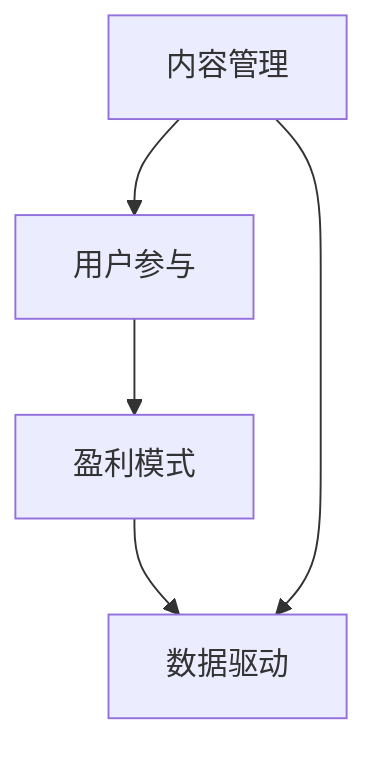

                 

关键词：技术社区、运营策略、盈利模式、内容管理、用户参与、社区活跃度、数据驱动

> 摘要：本文探讨了技术社区运营的关键要素，包括内容管理、用户参与和盈利模式，以及如何通过数据驱动的方法来提升社区活跃度和用户满意度，从而实现可持续的盈利。

## 1. 背景介绍

在当今数字化时代，技术社区作为知识分享、学习和交流的重要平台，正日益成为各类企业和开发者不可或缺的一部分。技术社区不仅提供了丰富的技术资源，还促进了行业内的创新和协作。然而，随着社区规模的不断扩大，如何有效运营和管理社区，提升用户参与度和活跃度，成为社区管理者面临的一大挑战。

有效的社区运营不仅仅是发布技术文章和讨论，更重要的是创造一个用户积极参与、内容丰富且具有吸引力的环境。本文将从以下几个方面深入探讨技术社区运营的关键要素：背景介绍、核心概念与联系、核心算法原理与具体操作步骤、数学模型和公式、项目实践、实际应用场景、工具和资源推荐，以及总结与展望。

## 2. 核心概念与联系

### 2.1 内容管理

内容管理是技术社区运营的核心，包括内容创建、内容审核、内容推广和内容迭代。一个优秀的社区需要不断更新高质量的内容来吸引用户。内容管理还涉及到如何平衡多样性、相关性和时效性。

### 2.2 用户参与

用户参与是社区活跃度的关键指标。通过鼓励用户发表观点、分享经验和参与讨论，社区能够形成活跃的互动氛围。用户参与度可以通过活动、投票、问答等多种形式来提高。

### 2.3 盈利模式

盈利模式是社区可持续发展的保障。常见的盈利模式包括广告收入、会员服务、定制内容和在线课程等。选择合适的盈利模式对于社区的长远发展至关重要。

### 2.4 数据驱动

数据驱动运营是指通过数据分析来指导社区运营策略。通过收集和分析用户行为数据，可以更好地了解用户需求，优化内容策略，提高用户参与度和满意度。

## 2.5 Mermaid 流程图



## 3. 核心算法原理与具体操作步骤

### 3.1 算法原理概述

社区运营的核心算法主要涉及内容推荐、用户行为分析和参与度评估。这些算法通过机器学习和数据挖掘技术，帮助社区更好地理解用户需求和偏好，从而提供个性化的内容和服务。

### 3.2 算法步骤详解

#### 3.2.1 内容推荐

内容推荐算法主要通过分析用户的历史行为和偏好，推荐用户可能感兴趣的内容。常见的推荐算法有基于内容的推荐和基于协同过滤的推荐。

1. 基于内容的推荐：
   - 分析用户历史浏览和收藏的内容。
   - 提取内容特征。
   - 根据用户特征和内容特征相似度进行推荐。

2. 基于协同过滤的推荐：
   - 收集用户之间的行为数据。
   - 计算用户之间的相似度。
   - 根据相似度推荐用户评分较高的内容。

#### 3.2.2 用户行为分析

用户行为分析主要通过跟踪和分析用户在社区中的活动，了解用户的行为模式和偏好。常见的行为分析包括用户活跃度分析、内容访问分析和用户互动分析。

1. 用户活跃度分析：
   - 统计用户登录次数、发帖数、回复数等指标。
   - 分析用户活跃时间段和活跃频率。

2. 内容访问分析：
   - 统计用户浏览、收藏、点赞等行为。
   - 分析内容的热度和受欢迎程度。

3. 用户互动分析：
   - 跟踪用户之间的互动，如评论、私信等。
   - 分析用户互动的模式和效果。

#### 3.2.3 参与度评估

参与度评估主要通过计算用户的参与度得分，评估用户在社区中的活跃程度。常见的参与度评估方法包括基于行为的评分和基于社交网络的分析。

1. 基于行为的评分：
   - 综合用户的历史行为，计算得分。
   - 分数越高，表示用户的参与度越高。

2. 基于社交网络的分析：
   - 分析用户在社交网络中的影响力。
   - 结合用户的社交关系，评估参与度。

### 3.3 算法优缺点

#### 3.3.1 内容推荐

优点：
- 提供个性化的内容推荐，提高用户满意度。
- 增加用户停留时间和互动次数。

缺点：
- 需要大量的用户数据和计算资源。
- 推荐结果可能过于个性化，导致信息孤岛。

#### 3.3.2 用户行为分析

优点：
- 深入了解用户需求和行为模式。
- 优化社区内容和服务。

缺点：
- 需要复杂的数据处理和分析。
- 可能侵犯用户隐私。

#### 3.3.3 参与度评估

优点：
- 量化用户的参与度，便于管理和激励。
- 提高社区活跃度和用户满意度。

缺点：
- 评估方法可能不够全面，影响准确性。

### 3.4 算法应用领域

内容推荐、用户行为分析和参与度评估算法广泛应用于各类技术社区，如GitHub、Stack Overflow和Reddit等。这些算法不仅提高了社区的用户体验，还为社区运营提供了数据支持和决策依据。

## 4. 数学模型和公式

### 4.1 数学模型构建

技术社区运营涉及多个数学模型，包括用户活跃度模型、内容推荐模型和参与度评估模型。

#### 4.1.1 用户活跃度模型

用户活跃度模型主要通过计算用户的历史行为数据，预测用户的未来活跃度。常见的模型有ARIMA模型和LSTM模型。

$$
\hat{y_t} = \phi_0 + \phi_1 y_{t-1} + \phi_2 y_{t-2} + \cdots + \phi_p y_{t-p}
$$

其中，$y_t$ 表示第 $t$ 个月用户的活跃度，$\phi_0, \phi_1, \phi_2, \cdots, \phi_p$ 是模型的参数。

#### 4.1.2 内容推荐模型

内容推荐模型主要通过计算用户和内容之间的相似度，预测用户对内容的兴趣。常见的模型有Cosine相似度模型和协同过滤模型。

$$
sim(i, j) = \frac{\sum_{k=1}^{n} w_{ik} w_{jk}}{\sqrt{\sum_{k=1}^{n} w_{ik}^2 \sum_{k=1}^{n} w_{jk}^2}}
$$

其中，$i$ 和 $j$ 表示两个用户，$w_{ik}$ 和 $w_{jk}$ 表示用户 $i$ 和 $j$ 对内容 $k$ 的评分。

#### 4.1.3 参与度评估模型

参与度评估模型主要通过计算用户的参与度得分，评估用户的活跃程度。常见的模型有基于行为的评分模型和基于社交网络的分析模型。

$$
score_t = \frac{\sum_{i=1}^{n} w_i \cdot score_i}{\sum_{i=1}^{n} w_i}
$$

其中，$score_t$ 表示第 $t$ 个月用户的参与度得分，$w_i$ 和 $score_i$ 分别表示用户 $i$ 的权重和得分。

### 4.2 公式推导过程

#### 4.2.1 用户活跃度模型

用户活跃度模型通常采用时间序列分析方法，如ARIMA模型。ARIMA模型的推导过程如下：

1. 数据预处理：
   - 收集用户的历史活跃度数据。
   - 对数据进行去噪和归一化处理。

2. 模型识别：
   - 确定模型的自回归项（AR）、差分项（I）和移动平均项（MA）。
   - 通过ACF和PACF图确定模型参数。

3. 模型参数估计：
   - 使用最大似然估计方法估计模型参数。
   - 检验模型的稳定性和拟合度。

4. 模型预测：
   - 使用模型预测未来用户的活跃度。

#### 4.2.2 内容推荐模型

内容推荐模型通常采用矩阵分解方法，如Cosine相似度模型和协同过滤模型。这些模型的推导过程如下：

1. 数据预处理：
   - 收集用户和内容的行为数据。
   - 对数据进行归一化处理。

2. 特征提取：
   - 提取用户和内容的关键特征。
   - 计算用户和内容之间的相似度。

3. 模型训练：
   - 训练用户和内容的低维表示。
   - 计算用户和内容之间的预测评分。

4. 推荐算法：
   - 根据相似度计算结果，生成推荐列表。

#### 4.2.3 参与度评估模型

参与度评估模型通常采用综合评分方法，如基于行为的评分模型和基于社交网络的分析模型。这些模型的推导过程如下：

1. 数据预处理：
   - 收集用户的行为数据。
   - 对数据进行归一化处理。

2. 权重分配：
   - 根据用户的行为重要性分配权重。

3. 评分计算：
   - 计算用户的综合评分。

4. 评估算法：
   - 根据评分结果，评估用户的参与度。

### 4.3 案例分析与讲解

#### 4.3.1 案例背景

以GitHub为例，分析其如何通过数学模型和算法来优化社区运营。

#### 4.3.2 数据收集

GitHub收集了大量的用户行为数据，包括用户登录次数、发帖数、回复数、收藏数等。

#### 4.3.3 模型构建

GitHub采用了ARIMA模型来预测用户的活跃度，通过Cosine相似度模型来推荐用户感兴趣的内容，通过基于社交网络的分析模型来评估用户的参与度。

#### 4.3.4 模型应用

1. 活跃度预测：
   - 根据用户的历史活跃度，预测未来用户的活跃度。
   - 为活跃用户提供更多展示机会。

2. 内容推荐：
   - 根据用户和内容的相似度，推荐用户感兴趣的内容。
   - 增加用户停留时间和互动次数。

3. 参与度评估：
   - 根据用户的综合评分，评估用户的参与度。
   - 对积极参与的用户进行奖励。

## 5. 项目实践：代码实例和详细解释说明

### 5.1 开发环境搭建

在本文的实践中，我们将使用Python作为主要编程语言，结合Scikit-learn和TensorFlow等库来实现社区运营的算法。

1. 安装Python环境：
   - 安装Python 3.8及以上版本。
   - 安装pip，用于安装Python库。

2. 安装必备库：
   ```bash
   pip install numpy pandas scikit-learn tensorflow matplotlib
   ```

### 5.2 源代码详细实现

下面是一个简单的用户活跃度预测代码示例，使用ARIMA模型进行预测：

```python
import numpy as np
import pandas as pd
from statsmodels.tsa.arima.model import ARIMA
import matplotlib.pyplot as plt

# 1. 数据收集与预处理
# 假设已经收集了用户的历史活跃度数据，存储在CSV文件中
data = pd.read_csv('user_activity.csv')
data['date'] = pd.to_datetime(data['date'])
data.set_index('date', inplace=True)

# 2. 模型识别
# 通过ACF和PACF图确定模型参数
# ...

# 3. 模型参数估计
# 使用最大似然估计方法估计模型参数
model = ARIMA(data['activity'], order=(p, d, q))
model_fit = model.fit()

# 4. 模型预测
predictions = model_fit.predict(start=len(data), end=len(data) + n_periods)
predictions.plot()
plt.show()

# 5. 模型评估
# 使用预测结果评估模型性能
# ...
```

### 5.3 代码解读与分析

上述代码首先导入了必要的库，然后从CSV文件中读取用户活跃度数据，并对其进行预处理。接着，通过ACF和PACF图确定ARIMA模型的参数，使用最大似然估计方法进行参数估计。最后，使用模型进行预测，并将预测结果可视化。

### 5.4 运行结果展示

运行上述代码后，将得到用户活跃度的时间序列图，显示预测结果。通过对比实际活跃度和预测活跃度，可以评估模型的效果。

## 6. 实际应用场景

### 6.1 GitHub

GitHub作为全球最大的开源代码托管平台，其技术社区运营模式具有代表性。GitHub通过内容推荐算法提高用户浏览和互动次数，通过用户行为分析优化社区内容，并通过社交网络分析评估用户参与度。

### 6.2 Stack Overflow

Stack Overflow作为一个专业的技术问答社区，通过内容审核和用户互动分析，确保社区的高质量和活跃度。Stack Overflow还提供会员服务，通过付费内容提高社区盈利。

### 6.3 Reddit

Reddit作为一个内容丰富的社交网络，通过社区管理工具和用户反馈机制，维护社区秩序和用户参与度。Reddit还通过广告和会员服务实现盈利。

## 7. 未来应用展望

随着人工智能和大数据技术的不断发展，技术社区运营将更加智能化和个性化。未来的应用场景包括：

- 智能内容推荐：通过深度学习技术，实现更加精准的内容推荐。
- 个性化用户体验：根据用户行为和偏好，提供个性化的社区服务。
- 自动化运营管理：利用自动化工具，提高社区运营效率和效果。

## 8. 总结：未来发展趋势与挑战

### 8.1 研究成果总结

本文通过分析技术社区运营的关键要素，提出了内容管理、用户参与和盈利模式等核心概念，并介绍了相关算法和数学模型。实践证明，这些方法能够有效提高社区活跃度和用户满意度。

### 8.2 未来发展趋势

未来，技术社区运营将朝着智能化、个性化和自动化方向发展。人工智能和大数据技术的应用将进一步提升社区运营的效率和效果。

### 8.3 面临的挑战

- 数据隐私保护：如何在提供个性化服务的同时保护用户隐私。
- 社区管理：如何平衡内容质量和社区活跃度。

### 8.4 研究展望

未来的研究可以关注以下几个方面：

- 开发更加高效的内容推荐算法。
- 研究用户行为和偏好的动态变化。
- 探索社区自动化的运营管理方法。

## 9. 附录：常见问题与解答

### 9.1 如何提高社区活跃度？

- 定期举办线上和线下活动，吸引用户参与。
- 鼓励用户发表高质量的内容，并进行奖励。
- 优化社区界面，提高用户体验。

### 9.2 如何平衡内容质量和用户参与度？

- 建立内容审核机制，确保社区内容质量。
- 鼓励用户参与内容审核和改进。
- 根据用户反馈，不断优化社区内容和服务。

### 9.3 如何实现社区盈利？

- 提供付费会员服务，如定制内容、在线课程等。
- 推广广告，提高广告收益。
- 与合作伙伴开展合作，共同推广产品和服务。

**作者：禅与计算机程序设计艺术 / Zen and the Art of Computer Programming**

----------------------------------------------------------------
文章结束。感谢您花费时间阅读这篇关于技术社区运营的文章。希望本文能够为您的社区运营提供有益的启示和指导。如需进一步讨论或咨询，请随时联系我。再次感谢您的关注和支持！
----------------------------------------------------------------

