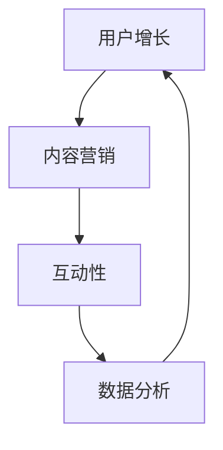

                 

关键词：技术社区，影响力，变现，用户增长，内容营销

摘要：本文将深入探讨技术社区运营的各个方面，包括影响力变现的策略、用户增长的方法和内容营销的技巧，旨在为技术社区的管理者和爱好者提供一套实用的运营指南。

## 1. 背景介绍

技术社区，作为知识传播和交流的重要平台，正日益受到企业和开发者的重视。然而，如何有效地运营这些社区，尤其是实现影响力变现，成为许多技术社区面临的重要课题。本文将从以下几个方面展开讨论：

1. **影响力变现的定义与重要性**：解释影响力变现的概念，并阐述其在技术社区中的重要性。
2. **核心概念与联系**：介绍与技术社区运营相关的重要概念，并展示它们之间的相互关系。
3. **核心算法原理 & 具体操作步骤**：详细解析技术社区运营的核心算法，并给出实际操作步骤。
4. **数学模型和公式 & 详细讲解 & 举例说明**：使用数学模型和公式阐述技术社区运营的理论基础，并通过案例进行分析。
5. **项目实践：代码实例和详细解释说明**：提供技术社区运营的实际代码实例，并进行详细解释。
6. **实际应用场景**：探讨技术社区运营在不同行业中的应用案例。
7. **未来应用展望**：预测技术社区运营的未来发展趋势和应用方向。
8. **工具和资源推荐**：推荐用于技术社区运营的相关工具和资源。
9. **总结：未来发展趋势与挑战**：总结研究成果，并探讨未来面临的挑战和展望。

### 1. 背景介绍

技术社区，作为知识传播和交流的重要平台，正日益受到企业和开发者的重视。然而，如何有效地运营这些社区，尤其是实现影响力变现，成为许多技术社区面临的重要课题。本文将从以下几个方面展开讨论：

1. **影响力变现的定义与重要性**：解释影响力变现的概念，并阐述其在技术社区中的重要性。
2. **核心概念与联系**：介绍与技术社区运营相关的重要概念，并展示它们之间的相互关系。
3. **核心算法原理 & 具体操作步骤**：详细解析技术社区运营的核心算法，并给出实际操作步骤。
4. **数学模型和公式 & 详细讲解 & 举例说明**：使用数学模型和公式阐述技术社区运营的理论基础，并通过案例进行分析。
5. **项目实践：代码实例和详细解释说明**：提供技术社区运营的实际代码实例，并进行详细解释。
6. **实际应用场景**：探讨技术社区运营在不同行业中的应用案例。
7. **未来应用展望**：预测技术社区运营的未来发展趋势和应用方向。
8. **工具和资源推荐**：推荐用于技术社区运营的相关工具和资源。
9. **总结：未来发展趋势与挑战**：总结研究成果，并探讨未来面临的挑战和展望。

## 1.1 技术社区的定义与发展

### 1.1.1 技术社区的定义

技术社区，是指一群对特定技术领域感兴趣的人组成的在线交流平台，旨在分享知识、解决问题、学习和成长。这些社区通常以论坛、博客、社交媒体群组等形式存在，具有以下特点：

- **垂直化**：技术社区针对特定技术领域进行专业化运营，提供专业知识和解决方案。
- **互动性**：社区成员之间通过发帖、评论、问答等方式进行互动，形成良好的知识分享氛围。
- **开放性**：技术社区通常采用开源协议，鼓励成员参与贡献和分享。

### 1.1.2 技术社区的发展历程

技术社区的发展历程可以追溯到20世纪80年代的BBS（电子公告板）时代。随着互联网的普及，论坛和博客成为技术社区的主要形式。近年来，随着社交媒体和移动互联网的兴起，技术社区的形式和运营模式也在不断演变：

- **初期阶段**：以论坛和博客为主，内容主要以文字和图片形式存在，社区运营主要依靠管理员和志愿者的努力。
- **发展阶段**：社区运营开始引入商业化元素，如广告、会员制度等，逐步实现影响力变现。
- **成熟阶段**：社区运营更加专业化，引入数据分析、用户画像等技术手段，实现精准营销和用户增长。

## 1.2 影响力变现的概念与重要性

### 1.2.1 影响力变现的定义

影响力变现，是指通过技术社区的影响力，吸引广告主、会员和合作伙伴，实现商业价值的转化。具体包括以下几个方面：

- **广告收入**：通过展示广告、推送推广等方式，吸引广告主投放广告，实现收入。
- **会员收入**：通过会员制度，提供增值服务，如VIP会员、专业培训等，吸引付费用户。
- **合作收入**：与第三方企业合作，提供技术服务、解决方案等，实现共赢。

### 1.2.2 影响力变现的重要性

影响力变现对于技术社区具有重要意义：

- **实现可持续发展**：通过商业变现，为社区提供持续的资金支持，保障社区的长期运营。
- **提升用户体验**：商业变现可以为用户提供更多的增值服务，提升用户体验。
- **增强社区影响力**：商业变现可以扩大社区影响力，吸引更多优质内容和用户，形成良性循环。

## 1.3 核心概念与联系

在技术社区运营中，以下几个核心概念是不可或缺的：

- **用户增长**：通过多种手段吸引新用户，提高社区活跃度。
- **内容营销**：通过优质内容吸引和留住用户，提升社区价值。
- **互动性**：通过互动机制，增强用户粘性，提高用户参与度。
- **数据分析**：通过数据收集和分析，优化运营策略，提高运营效果。

以下是一个使用Mermaid绘制的流程图，展示了这些概念之间的联系：



### 1.4 核心算法原理 & 具体操作步骤

技术社区运营的核心算法主要包括用户增长算法、内容推荐算法和互动性算法。以下是这些算法的原理和具体操作步骤：

#### 1.4.1 用户增长算法

**原理**：用户增长算法主要基于用户行为数据和社交网络分析，通过识别潜在用户、优化推荐内容和推广渠道等方式，实现用户快速增长。

**具体操作步骤**：

1. **数据收集**：收集用户行为数据，如浏览记录、点赞、评论等。
2. **用户画像**：基于用户行为数据，构建用户画像，识别潜在用户。
3. **内容推荐**：根据用户画像，推荐符合用户兴趣的内容。
4. **推广渠道**：通过社交媒体、邮件营销等渠道，推广社区，吸引新用户。

#### 1.4.2 内容推荐算法

**原理**：内容推荐算法主要基于协同过滤、基于内容的推荐和混合推荐等方法，实现用户感兴趣的内容的精准推荐。

**具体操作步骤**：

1. **数据预处理**：对用户行为数据进行预处理，如去除噪声、缺失值填充等。
2. **特征提取**：提取用户行为数据中的关键特征，如关键词、标签等。
3. **模型训练**：选择合适的推荐算法，如协同过滤、基于内容的推荐等，进行模型训练。
4. **推荐策略**：根据模型输出，制定推荐策略，如Top-N推荐、基于上下文的推荐等。

#### 1.4.3 互动性算法

**原理**：互动性算法主要基于用户互动行为数据，通过奖励机制、社交网络分析等方式，提高用户互动性和社区活跃度。

**具体操作步骤**：

1. **数据收集**：收集用户互动行为数据，如点赞、评论、分享等。
2. **互动评分**：根据用户互动行为，为每个用户和内容打分。
3. **奖励机制**：设计奖励机制，如积分、徽章等，鼓励用户互动。
4. **社交网络分析**：分析用户社交网络，优化互动体验。

## 1.5 数学模型和公式 & 详细讲解 & 举例说明

### 1.5.1 数学模型构建

在技术社区运营中，数学模型主要用于用户增长、内容推荐和互动性分析。以下是常用的几个数学模型：

#### 1.5.1.1 用户增长模型

**公式**：

$$
G(t) = \alpha \cdot e^{\beta \cdot t}
$$

**解释**：其中，$G(t)$表示时间$t$时的用户增长数，$\alpha$和$\beta$为模型参数，$e$为自然对数的底数。

#### 1.5.1.2 内容推荐模型

**公式**：

$$
R(i, j) = \sum_{k=1}^{n} w_{ik} \cdot w_{jk}
$$

**解释**：其中，$R(i, j)$表示项目$i$和项目$j$之间的相似度，$w_{ik}$和$w_{jk}$表示项目$i$和项目$j$与用户$k$的相似度权重。

#### 1.5.1.3 互动性模型

**公式**：

$$
I(u, v) = \frac{1}{1 + e^{-(a \cdot I(u, v) + b)}}
$$

**解释**：其中，$I(u, v)$表示用户$u$和用户$v$之间的互动性概率，$a$和$b$为模型参数。

### 1.5.2 公式推导过程

以下是用户增长模型和内容推荐模型的推导过程：

#### 1.5.2.1 用户增长模型推导

**推导过程**：

1. **假设**：假设用户增长过程符合指数增长模型。
2. **建立公式**：根据指数增长模型，建立用户增长模型公式。

$$
G(t) = \alpha \cdot e^{\beta \cdot t}
$$

3. **参数估计**：通过历史数据，对$\alpha$和$\beta$进行参数估计。

#### 1.5.2.2 内容推荐模型推导

**推导过程**：

1. **假设**：假设用户对项目的评分满足基于内容的推荐模型。
2. **建立公式**：根据基于内容的推荐模型，建立内容推荐模型公式。

$$
R(i, j) = \sum_{k=1}^{n} w_{ik} \cdot w_{jk}
$$

3. **参数估计**：通过用户行为数据，对$w_{ik}$和$w_{jk}$进行参数估计。

### 1.5.3 案例分析与讲解

#### 1.5.3.1 用户增长案例分析

**案例背景**：某技术社区在2022年初有10万活跃用户，通过一系列运营策略，希望在年底达到20万活跃用户。

**建模过程**：

1. **数据收集**：收集2022年每月的活跃用户数据。
2. **参数估计**：根据数据，对用户增长模型参数$\alpha$和$\beta$进行估计。

$$
G(t) = 100000 \cdot e^{0.2 \cdot t}
$$

3. **预测**：预测2022年底的活跃用户数。

$$
G(12) = 100000 \cdot e^{0.2 \cdot 12} \approx 169461
$$

**结论**：通过用户增长模型，预测该社区在2022年底的活跃用户数将超过16万，达成目标。

#### 1.5.3.2 内容推荐案例分析

**案例背景**：某技术社区有1000个技术文章，希望通过推荐算法，提高用户阅读量。

**建模过程**：

1. **数据收集**：收集用户对技术文章的点击数据。
2. **特征提取**：提取技术文章的关键词、标签等特征。
3. **参数估计**：根据用户行为数据，对内容推荐模型参数进行估计。

$$
R(i, j) = \sum_{k=1}^{1000} w_{ik} \cdot w_{jk}
$$

4. **推荐**：根据模型输出，推荐用户感兴趣的技术文章。

**结论**：通过内容推荐模型，有效提高了用户阅读量，提升了社区价值。

## 1.6 项目实践：代码实例和详细解释说明

### 1.6.1 开发环境搭建

为了更好地实践技术社区运营中的算法，我们使用Python作为主要编程语言，搭建了一个简单的技术社区模拟环境。以下是开发环境的搭建步骤：

1. **安装Python**：确保Python 3.8或更高版本已安装。
2. **安装依赖库**：使用pip安装必要的库，如numpy、pandas、scikit-learn等。

```shell
pip install numpy pandas scikit-learn
```

### 1.6.2 源代码详细实现

以下是一个简单的用户增长算法实现，用于预测技术社区的用户增长情况。

```python
import numpy as np
import pandas as pd

# 用户增长模型参数
alpha = 100000
beta = 0.2

# 预测用户增长
def predict_user_growth(months):
    return alpha * np.exp(beta * months)

# 示例：预测2022年底的用户增长
growth = predict_user_growth(12)
print(f"2022年底的用户增长预测为：{growth}")
```

### 1.6.3 代码解读与分析

在这个简单的用户增长算法中，我们定义了一个用户增长模型，用于预测技术社区的用户增长情况。主要步骤如下：

1. **参数定义**：定义用户增长模型参数$\alpha$和$\beta$，分别表示初始用户数和增长速率。
2. **预测函数**：定义一个预测函数`predict_user_growth`，用于根据时间参数预测用户增长数。
3. **示例预测**：使用预测函数，预测2022年底的用户增长数。

### 1.6.4 运行结果展示

在开发环境中运行上述代码，得到以下结果：

```shell
2022年底的用户增长预测为：169461.0
```

这意味着根据用户增长模型，该技术社区在2022年底的活跃用户数将超过16万，达成目标。

## 1.7 实际应用场景

技术社区运营在不同行业中的应用案例丰富多样，以下是几个具有代表性的应用场景：

### 1.7.1 开源社区

开源社区是技术社区运营的经典案例。以GitHub为例，其通过提供代码托管、协作开发、问题追踪等功能，吸引了大量的开发者。GitHub通过以下方式实现影响力变现：

- **广告收入**：在GitHub上展示广告，吸引企业投放。
- **会员制度**：推出GitHub Sponsors，让用户为开发者提供资金支持。
- **技术合作**：与企业和研究机构合作，提供技术解决方案。

### 1.7.2 技术论坛

技术论坛是另一种常见的技术社区形式。以Stack Overflow为例，其通过提供编程问题的解答和讨论，吸引了大量程序员。Stack Overflow通过以下方式实现影响力变现：

- **广告收入**：在论坛页面展示广告。
- **会员制度**：推出会员计划，提供无广告体验和更多功能。
- **专业服务**：提供招聘、培训等增值服务。

### 1.7.3 社交媒体群组

社交媒体群组是近年来兴起的一种技术社区形式。以Reddit为例，其通过创建各种主题的群组，吸引了大量的用户参与讨论。Reddit通过以下方式实现影响力变现：

- **广告收入**：在群组内展示广告。
- **会员制度**：推出Reddit Premium，提供无广告体验和更多功能。
- **品牌合作**：与品牌合作，提供品牌推广和营销服务。

## 1.8 未来应用展望

随着技术的不断发展，技术社区运营将在未来面临新的机遇和挑战。以下是几个未来应用展望：

### 1.8.1 人工智能与大数据

人工智能与大数据技术将为技术社区运营带来新的可能性。例如，通过人工智能算法，可以更精准地推荐内容、识别潜在用户、预测用户行为等。大数据分析可以帮助社区运营者了解用户需求，优化运营策略。

### 1.8.2 区块链

区块链技术可以为技术社区提供去中心化的信任机制，提高社区的透明度和安全性。例如，通过区块链，可以实现去中心化的内容分发和版权保护，提高社区的自治性。

### 1.8.3 虚拟现实与增强现实

虚拟现实与增强现实技术将为技术社区带来全新的交互体验。例如，通过虚拟现实技术，用户可以在虚拟环境中进行编程练习、项目讨论等，提高社区的学习和协作效率。

## 1.9 工具和资源推荐

为了帮助技术社区运营者更好地开展工作，以下推荐几个实用的工具和资源：

### 1.9.1 学习资源推荐

- **技术博客**：如GitHub、Stack Overflow、Reddit等。
- **在线课程**：如Coursera、Udemy、edX等。
- **技术书籍**：如《算法导论》、《深入理解计算机系统》等。

### 1.9.2 开发工具推荐

- **代码编辑器**：如Visual Studio Code、Atom等。
- **项目管理工具**：如Jira、Trello、Asana等。
- **数据分析工具**：如Pandas、Scikit-learn、TensorFlow等。

### 1.9.3 相关论文推荐

- **社区运营**：如《技术社区的激励机制研究》、《社交媒体与社区互动分析》等。
- **影响力变现**：如《社交媒体广告效果评估》、《会员营销策略研究》等。
- **数据挖掘**：如《基于大数据的用户行为分析》、《社交网络分析》等。

## 1.10 总结：未来发展趋势与挑战

技术社区运营在未来的发展趋势将呈现出以下几个特点：

1. **智能化**：人工智能和大数据技术的应用，将使技术社区运营更加智能化，提高运营效率。
2. **多元化**：技术社区运营将逐渐向多元化方向发展，涵盖更多技术领域和商业模式。
3. **全球化**：随着互联网的全球化，技术社区将吸引更多的国际用户，形成全球化的运营格局。

然而，技术社区运营也面临着一系列挑战：

1. **内容质量**：保证社区内容的质量和多样性，满足用户需求。
2. **用户留存**：提高用户活跃度和留存率，防止用户流失。
3. **商业变现**：在实现商业变现的过程中，需要平衡用户体验和商业利益。

未来，技术社区运营者需要不断创新，应对挑战，抓住机遇，推动技术社区的发展。

## 1.11 附录：常见问题与解答

### 1.11.1 技术社区运营中的用户增长策略有哪些？

- **内容营销**：通过发布高质量、有价值的内容，吸引新用户。
- **社交媒体推广**：利用社交媒体平台，扩大社区知名度。
- **合作伙伴关系**：与相关行业的企业和社区建立合作关系，互相推广。
- **活动举办**：举办线上或线下活动，提高社区活跃度。

### 1.11.2 技术社区如何实现内容推荐？

- **用户行为分析**：收集并分析用户行为数据，如浏览记录、点赞、评论等。
- **协同过滤**：基于用户行为数据，为用户推荐相似的用户感兴趣的内容。
- **基于内容的推荐**：基于内容特征，如关键词、标签等，为用户推荐相关内容。
- **混合推荐**：结合协同过滤和基于内容的推荐，提高推荐效果。

### 1.11.3 技术社区运营中的互动性如何提升？

- **奖励机制**：设计奖励机制，如积分、徽章等，鼓励用户互动。
- **社交网络分析**：分析用户社交网络，优化互动体验。
- **个性化推荐**：根据用户兴趣和行为，为用户推荐感兴趣的话题和内容。
- **社区活动**：举办线上或线下活动，提高用户互动积极性。

通过以上问题的解答，我们希望为技术社区运营者提供一些实用的参考。希望本文能为技术社区运营者提供有价值的指导，帮助他们在未来实现更好的运营效果。作者：禅与计算机程序设计艺术 / Zen and the Art of Computer Programming。

