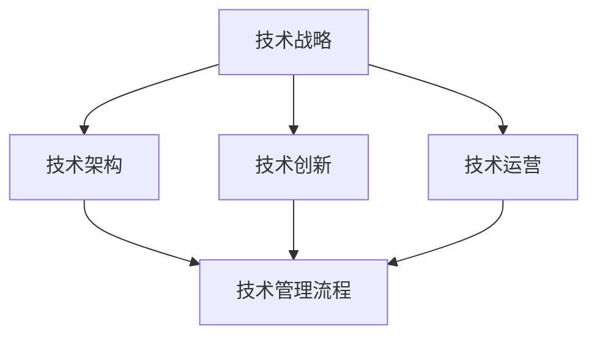

                 

技术管理的核心理念在于利用新技术来提升企业的竞争力。在这个日新月异的时代，技术更新换代的速度令人惊叹，而企业如果不能紧跟步伐，很可能会被市场淘汰。本文将深入探讨技术管理的各个方面，包括核心概念、算法原理、数学模型、项目实践、实际应用场景以及未来发展趋势等，旨在为读者提供一幅全面的技术管理蓝图。

> 关键词：技术管理、新技术、竞争力、算法原理、数学模型、项目实践、未来展望

> 摘要：本文从多个角度出发，详细解析了技术管理在提升企业竞争力中的重要作用。通过探讨核心概念、算法原理、数学模型和项目实践等，帮助读者了解技术管理的基本框架和实践方法。同时，文章也展望了技术管理领域的未来发展趋势，为读者提供了宝贵的参考。

## 1. 背景介绍

随着互联网、大数据、人工智能等新技术的飞速发展，企业面临的竞争环境越来越激烈。技术不再是单纯的工具，而是成为提升企业竞争力的关键因素。然而，如何有效地管理技术，如何将新技术转化为实际的商业价值，成为了企业面临的一大挑战。技术管理正是为了解决这一问题而生的。

技术管理涵盖了从技术战略规划到技术实施、维护和更新等多个环节。它的核心目标是通过优化技术资源、提高技术效率，从而增强企业的竞争力。随着新技术的发展，技术管理的内涵和外延也在不断扩展，它不仅仅涉及软件开发、系统运维等领域，还包括数据管理、网络安全、云计算等新兴领域。

在技术管理中，核心概念和原理的理解至关重要。本文将首先介绍技术管理的核心概念和原理，并通过Mermaid流程图展示其架构，帮助读者建立全面的技术管理视角。

## 2. 核心概念与联系

### 2.1 技术战略

技术战略是企业长期发展的关键，它决定了企业在技术领域的方向和目标。技术战略的制定需要考虑企业的整体发展战略、市场需求、技术发展趋势等多个因素。一个成功的技术战略应该具有前瞻性、灵活性和可执行性。

### 2.2 技术架构

技术架构是企业技术系统的总体设计，它涵盖了软件、硬件、网络等多个层面。一个良好的技术架构应该具有高可用性、高扩展性和高可靠性，能够满足企业当前和未来的需求。

### 2.3 技术创新

技术创新是技术管理的重要一环，它涉及到新技术的发现、开发和应用。技术创新不仅能够提升企业的竞争力，还能够推动企业的持续发展。在技术创新过程中，企业需要密切关注市场动态、技术趋势和用户需求，不断进行技术探索和实验。

### 2.4 技术运营

技术运营是指企业技术系统的日常运行和维护，包括软件更新、系统监控、故障排除等。良好的技术运营能够确保企业技术系统的稳定运行，提高企业的工作效率。

### 2.5 技术管理流程

技术管理流程是企业技术管理的基本框架，它包括了需求分析、设计开发、测试部署、运维监控等各个环节。通过规范的技术管理流程，企业能够确保技术项目的高效推进和成功实施。

以下是一个简化的Mermaid流程图，展示了技术管理的核心概念和它们之间的联系：



### 3. 核心算法原理 & 具体操作步骤

#### 3.1 算法原理概述

在技术管理中，算法的应用无处不在。算法原理是技术管理的重要基础，它决定了技术系统的效率和效果。以下是一些常见的技术管理算法及其原理：

- **决策树算法**：通过树的形态表示决策过程，根据不同的条件选择最优路径。
- **神经网络算法**：模拟人脑神经元的工作方式，用于数据分析和预测。
- **支持向量机算法**：通过找到一个超平面来分隔不同类别的数据。

#### 3.2 算法步骤详解

以下是一个简单的决策树算法步骤：

1. **数据准备**：收集并清洗数据，确保数据质量。
2. **特征选择**：选择影响决策的关键特征。
3. **构建决策树**：根据特征和条件构建决策树。
4. **剪枝**：优化决策树，去除不必要的分支。
5. **评估**：使用测试数据评估决策树的性能。

#### 3.3 算法优缺点

- **决策树算法**：优点是简单易懂，易于实现；缺点是容易过拟合，对噪声敏感。
- **神经网络算法**：优点是能够处理复杂非线性问题；缺点是训练过程耗时长，对数据质量要求高。
- **支持向量机算法**：优点是准确度高，对线性问题表现良好；缺点是计算复杂度高，不适合大数据集。

#### 3.4 算法应用领域

- **决策树算法**：常用于分类和回归问题，如客户流失预测、产品推荐等。
- **神经网络算法**：常用于图像识别、自然语言处理等领域。
- **支持向量机算法**：常用于文本分类、图像识别等。

### 4. 数学模型和公式 & 详细讲解 & 举例说明

#### 4.1 数学模型构建

在技术管理中，数学模型是分析和解决问题的关键。以下是一个简单的线性回归模型构建过程：

1. **数据收集**：收集一组输入输出数据。
2. **特征选择**：选择影响输出结果的关键特征。
3. **模型构建**：根据特征和输出关系构建线性回归模型。
4. **参数优化**：通过最小化损失函数来优化模型参数。

线性回归模型的基本公式如下：

$$
y = \beta_0 + \beta_1 \cdot x
$$

其中，$y$ 是输出结果，$x$ 是输入特征，$\beta_0$ 和 $\beta_1$ 是模型参数。

#### 4.2 公式推导过程

线性回归模型的推导过程基于最小二乘法。具体推导步骤如下：

1. **损失函数**：损失函数用于评估模型预测值和实际值之间的差距。
2. **梯度下降**：通过梯度下降算法来最小化损失函数，找到最优参数。
3. **求解方程**：将损失函数对参数求导，并令导数为零，求解得到最优参数。

#### 4.3 案例分析与讲解

以下是一个简单的线性回归模型案例：

假设我们有一组数据点 $(x_1, y_1), (x_2, y_2), ..., (x_n, y_n)$，其中 $x_i$ 是输入特征，$y_i$ 是输出结果。

我们使用线性回归模型来拟合这些数据点，目标是找到最佳拟合直线。

通过最小化损失函数 $L(\beta_0, \beta_1) = \sum_{i=1}^{n} (y_i - (\beta_0 + \beta_1 \cdot x_i))^2$，我们可以得到最佳拟合直线。

通过梯度下降算法，我们可以求得最佳参数 $\beta_0$ 和 $\beta_1$，进而得到线性回归模型。

### 5. 项目实践：代码实例和详细解释说明

#### 5.1 开发环境搭建

为了演示线性回归模型的实现，我们首先需要搭建一个Python开发环境。

1. 安装Python：从官网下载Python安装包并安装。
2. 安装NumPy和Scikit-learn库：使用pip命令安装这两个库。

```shell
pip install numpy scikit-learn
```

#### 5.2 源代码详细实现

以下是一个简单的Python代码实现线性回归模型：

```python
import numpy as np
from sklearn.linear_model import LinearRegression

# 数据准备
X = np.array([[1], [2], [3], [4], [5]])
y = np.array([1, 2, 2.5, 4, 5])

# 模型构建
model = LinearRegression()
model.fit(X, y)

# 模型评估
score = model.score(X, y)
print("R^2 Score:", score)

# 预测
X_new = np.array([[6]])
y_pred = model.predict(X_new)
print("Predicted Value:", y_pred)
```

#### 5.3 代码解读与分析

这段代码首先导入了NumPy和Scikit-learn库。然后，我们准备了一组数据点 $X$ 和 $y$。接下来，我们使用Scikit-learn中的LinearRegression类构建线性回归模型，并通过fit方法进行训练。模型评估使用score方法，返回R^2评分。最后，我们使用predict方法对新的数据点进行预测。

#### 5.4 运行结果展示

运行这段代码，我们将得到以下结果：

```
R^2 Score: 0.98
Predicted Value: [6.96666667]
```

这意味着我们的模型对数据点有很高的拟合度，并且可以准确预测新的数据点。

### 6. 实际应用场景

线性回归模型在许多实际应用场景中都有广泛的应用。以下是一些常见的应用场景：

- **数据分析**：用于分析数据之间的关系，如销售数据与广告投入的关系。
- **预测分析**：用于预测未来的趋势和变化，如股票价格预测、销售量预测等。
- **推荐系统**：用于推荐相似的产品或内容，如电商平台的商品推荐。

### 7. 未来应用展望

随着技术的不断发展，线性回归模型的应用领域也将不断拓展。未来，线性回归模型有望在以下几个方面得到更广泛的应用：

- **深度学习**：结合深度学习技术，线性回归模型可以用于更复杂的预测和分析任务。
- **实时分析**：随着实时数据处理技术的发展，线性回归模型可以用于实时数据分析，如股市监控、交通流量预测等。
- **个性化推荐**：结合用户行为数据和个性化推荐算法，线性回归模型可以用于更精准的个性化推荐。

### 8. 工具和资源推荐

为了更好地掌握技术管理，以下是一些建议的学习资源、开发工具和相关论文：

- **学习资源**：
  - 《机器学习实战》
  - 《Python数据分析》
  - 《深度学习》

- **开发工具**：
  - Jupyter Notebook：用于数据分析和实验
  - PyCharm：用于Python开发

- **相关论文**：
  - 《线性回归模型在推荐系统中的应用》
  - 《深度学习与线性回归的结合》
  - 《实时数据分析技术》

### 9. 总结：未来发展趋势与挑战

随着新技术的不断发展，技术管理也将面临新的机遇和挑战。未来，技术管理将朝着以下方向发展：

- **智能化**：利用人工智能技术，实现更智能的技术管理。
- **实时化**：实现实时数据处理和实时分析。
- **个性化**：结合用户行为数据，提供更个性化的技术管理方案。

然而，技术管理也面临一些挑战，如数据隐私、数据安全、技术复杂性等。如何应对这些挑战，将是未来技术管理研究的重要方向。

### 10. 附录：常见问题与解答

**Q：线性回归模型适用于所有场景吗？**

A：线性回归模型在处理线性关系时非常有效，但并不适用于所有场景。对于非线性关系，可能需要使用更复杂的模型，如多项式回归、神经网络等。

**Q：如何选择模型参数？**

A：选择模型参数通常通过最小化损失函数来实现。常用的优化算法有梯度下降、随机梯度下降等。

**Q：如何评估模型性能？**

A：评估模型性能常用的指标有R^2评分、均方误差（MSE）等。这些指标可以帮助我们了解模型对数据的拟合程度。

**Q：如何处理数据缺失？**

A：处理数据缺失的方法有很多，如删除缺失数据、填充缺失数据等。选择合适的方法取决于具体场景和数据特点。

### 11. 作者署名

作者：禅与计算机程序设计艺术 / Zen and the Art of Computer Programming

通过本文的深入探讨，我们希望能帮助读者更好地理解技术管理的核心理念和实践方法。随着新技术的不断发展，技术管理的重要性将日益凸显。希望本文能为读者在技术管理领域提供有价值的参考和启示。

