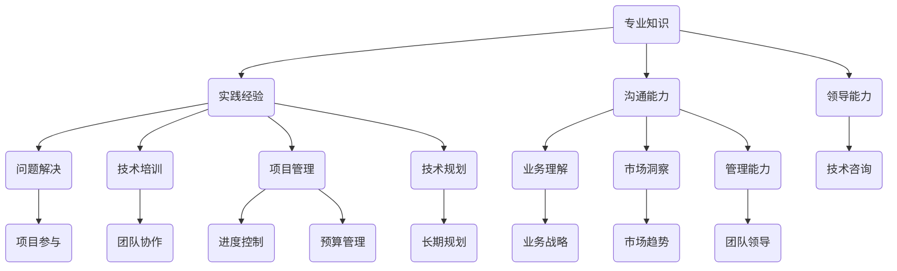

                 

关键词：技术顾问、兼职、高收入、IT行业、专业知识、市场需求

> 摘要：本文旨在探讨技术顾问作为兼职选择的优势，分析其在IT行业的市场需求和潜在收益。通过详细解读技术顾问的职责、技能要求以及如何成功定位自己，本文将帮助读者了解如何成为一名高收入的技术顾问。

## 1. 背景介绍

在当今数字化时代，信息技术（IT）已经成为企业运营和发展的核心驱动力。随着云计算、大数据、人工智能等技术的迅猛发展，IT行业的需求不断增长，对技术人才的需求也随之增加。在这一背景下，技术顾问作为一种职业选择，逐渐受到从业者的关注。技术顾问不仅是解决技术问题的专家，更是企业战略决策的参与者。他们通过专业知识和经验，为企业提供技术咨询、方案设计、系统优化等服务，帮助企业提升竞争力。

### 1.1 技术顾问的职业定义

技术顾问，也称为技术专家顾问，通常是指那些在特定技术领域具有深厚知识和丰富经验的专家。他们不仅能够解决复杂的技术问题，还能为企业提供战略性的技术建议。技术顾问通常具备以下特点：

- **专业知识**：在某个技术领域（如软件开发、网络安全、数据库管理）拥有深厚的专业知识。
- **实践经验**：在多个项目中有丰富的实战经验，能够快速诊断问题并提供解决方案。
- **沟通能力**：具备出色的沟通和表达能力，能够将复杂的技术问题转化为通俗易懂的语言。
- **领导能力**：能够带领团队共同解决技术难题，具备项目管理和协调能力。

### 1.2 技术顾问的职责

技术顾问的职责主要包括以下几个方面：

- **技术咨询**：根据企业的需求和现状，提供专业的技术建议和方案设计。
- **问题解决**：诊断和解决复杂的技术问题，确保系统的稳定运行。
- **技术培训**：为企业员工提供技术培训和指导，提升团队的技术能力。
- **项目管理**：参与项目管理，确保项目的进度和质量。
- **技术规划**：帮助企业制定长期的技术发展规划，确保企业的技术战略与市场发展同步。

## 2. 核心概念与联系

在深入了解技术顾问的职业特点和工作职责后，我们需要对技术顾问的核心概念和其与相关领域的联系进行更深入的分析。

### 2.1 技术顾问的核心概念

技术顾问的核心概念包括专业知识、实践经验、沟通能力和领导能力。这些概念不仅定义了技术顾问的职业能力，也是他们在职场中脱颖而出的关键因素。

- **专业知识**：技术顾问需要拥有深厚的专业知识，这包括对最新技术的理解和应用，以及解决复杂问题的能力。
- **实践经验**：通过在多个项目中积累的实践经验，技术顾问能够快速识别问题并提供有效的解决方案。
- **沟通能力**：技术顾问需要具备良好的沟通能力，以便与客户、团队成员和其他利益相关者有效沟通。
- **领导能力**：技术顾问通常需要领导团队，这就要求他们具备出色的领导能力和团队管理能力。

### 2.2 技术顾问与相关领域的联系

技术顾问不仅需要在技术领域内具备专业知识，还需要了解和管理其他相关领域，如业务、市场和管理等。

- **与业务领域的联系**：技术顾问需要理解企业的业务流程和战略目标，以便将技术解决方案与业务需求紧密结合。
- **与市场领域的联系**：技术顾问需要关注市场趋势和竞争对手，以便为企业提供具有前瞻性的技术建议。
- **与管理领域的联系**：技术顾问需要具备一定的管理能力，能够管理项目进度、预算和团队。

### 2.3 Mermaid 流程图

为了更直观地展示技术顾问的工作流程和核心概念，我们可以使用Mermaid流程图进行描述。



通过上述流程图，我们可以清晰地看到技术顾问的核心概念及其与相关领域的联系。

## 3. 核心算法原理 & 具体操作步骤

### 3.1 算法原理概述

作为技术顾问，掌握一系列核心算法原理对于解决实际问题至关重要。以下是几个在IT领域广泛应用的算法原理：

1. **算法A：数据分析算法**：用于处理大量数据，识别趋势和模式，如回归分析、聚类分析等。
2. **算法B：机器学习算法**：用于构建模型，实现数据自动分析和预测，如决策树、神经网络等。
3. **算法C：排序算法**：用于高效排序数据，提高数据处理效率，如快速排序、归并排序等。
4. **算法D：加密算法**：用于保护数据安全，如AES、RSA等。

### 3.2 算法步骤详解

#### 算法A：数据分析算法

1. 数据预处理：清洗和整合数据，确保数据质量。
2. 特征提取：从数据中提取有用的特征，用于后续分析。
3. 模型构建：选择合适的算法模型，如线性回归、决策树等。
4. 模型训练：使用训练数据对模型进行训练，调整参数。
5. 模型评估：使用测试数据评估模型性能，如准确率、召回率等。

#### 算法B：机器学习算法

1. 数据收集：收集相关领域的大量数据。
2. 数据预处理：清洗和预处理数据，确保数据质量。
3. 特征工程：提取和构造特征，提高模型性能。
4. 模型选择：选择合适的机器学习算法，如决策树、神经网络等。
5. 模型训练：使用训练数据对模型进行训练。
6. 模型评估：使用测试数据评估模型性能。

#### 算法C：排序算法

1. 输入数据：接收未排序的数据。
2. 选择排序方法：根据数据规模和特性选择合适的排序算法，如快速排序、归并排序等。
3. 排序过程：执行排序算法，将数据按顺序排列。
4. 输出结果：返回已排序的数据。

#### 算法D：加密算法

1. 明文输入：接收明文数据。
2. 密钥生成：生成加密密钥。
3. 加密过程：使用加密算法对数据进行加密。
4. 密文输出：返回加密后的数据。
5. 解密过程：使用解密算法和密钥对数据进行解密，恢复明文数据。

### 3.3 算法优缺点

每种算法都有其适用的场景和优缺点。以下是常见算法的优缺点分析：

- **数据分析算法**：
  - 优点：能够处理大量数据，发现潜在趋势和模式。
  - 缺点：对数据质量和特征提取有较高要求，计算复杂度高。

- **机器学习算法**：
  - 优点：自动学习和适应数据，能够解决复杂问题。
  - 缺点：训练时间较长，对数据量和计算资源要求较高。

- **排序算法**：
  - 优点：高效排序数据，提高数据处理效率。
  - 缺点：部分算法在数据规模较大时性能下降。

- **加密算法**：
  - 优点：保护数据安全，防止未授权访问。
  - 缺点：加密和解密过程会增加计算开销。

### 3.4 算法应用领域

这些算法在IT领域的应用非常广泛：

- **数据分析算法**：应用于大数据处理、商业智能、推荐系统等。
- **机器学习算法**：应用于自然语言处理、图像识别、自动驾驶等。
- **排序算法**：应用于数据库管理、搜索引擎、数据排序等。
- **加密算法**：应用于网络安全、数据保护、交易加密等。

## 4. 数学模型和公式 & 详细讲解 & 举例说明

### 4.1 数学模型构建

在技术顾问的工作中，数学模型是理解和解决问题的关键。以下是几个常见的数学模型：

1. **线性回归模型**：用于预测数值型变量。
2. **逻辑回归模型**：用于预测分类变量。
3. **决策树模型**：用于分类和回归问题。
4. **神经网络模型**：用于复杂的数据分析和预测。

### 4.2 公式推导过程

以下是线性回归模型的公式推导过程：

1. **假设**：给定n个样本点$(x_1, y_1), (x_2, y_2), ..., (x_n, y_n)$，我们假设$y_i$可以表示为$x_i$的线性函数：
   $$y_i = \beta_0 + \beta_1 x_i + \epsilon_i$$
   其中，$\beta_0$和$\beta_1$是模型的参数，$\epsilon_i$是误差项。

2. **目标**：最小化误差平方和（SSE）：
   $$SSE = \sum_{i=1}^{n} (y_i - (\beta_0 + \beta_1 x_i))^2$$

3. **求解**：对$\beta_0$和$\beta_1$求偏导，并令其等于零：
   $$\frac{\partial SSE}{\partial \beta_0} = -2\sum_{i=1}^{n} (y_i - (\beta_0 + \beta_1 x_i)) = 0$$
   $$\frac{\partial SSE}{\partial \beta_1} = -2\sum_{i=1}^{n} (y_i - (\beta_0 + \beta_1 x_i)) x_i = 0$$

4. **解得**：
   $$\beta_0 = \frac{\sum_{i=1}^{n} y_i - \beta_1 \sum_{i=1}^{n} x_i}{n}$$
   $$\beta_1 = \frac{\sum_{i=1}^{n} (y_i - \beta_0) x_i}{\sum_{i=1}^{n} x_i^2}$$

### 4.3 案例分析与讲解

#### 案例背景

假设我们要预测一家公司的利润（$y$）与其广告支出（$x$）之间的关系。

#### 数据收集

我们收集了以下数据：

| 广告支出（万元） | 利润（万元） |
|------------------|--------------|
|       20         |      150     |
|       30         |      180     |
|       40         |      210     |
|       50         |      250     |
|       60         |      280     |

#### 数据预处理

1. 计算平均值：
   $$\bar{x} = \frac{20 + 30 + 40 + 50 + 60}{5} = 40$$
   $$\bar{y} = \frac{150 + 180 + 210 + 250 + 280}{5} = 210$$

2. 计算偏差和平方和：
   $$\sum_{i=1}^{n} x_i^2 = 20^2 + 30^2 + 40^2 + 50^2 + 60^2 = 4100$$
   $$\sum_{i=1}^{n} x_i y_i = 20 \cdot 150 + 30 \cdot 180 + 40 \cdot 210 + 50 \cdot 250 + 60 \cdot 280 = 28900$$

#### 模型计算

1. 计算斜率$\beta_1$：
   $$\beta_1 = \frac{\sum_{i=1}^{n} (y_i - \bar{y}) x_i}{\sum_{i=1}^{n} x_i^2} = \frac{28900 - 5 \cdot 210 \cdot 40}{4100} = 4.5$$

2. 计算截距$\beta_0$：
   $$\beta_0 = \bar{y} - \beta_1 \bar{x} = 210 - 4.5 \cdot 40 = 90$$

#### 预测

根据线性回归模型，我们可以预测当广告支出为$x$万元时，利润$y$的预测值为：
$$y = \beta_0 + \beta_1 x = 90 + 4.5 x$$

#### 预测结果

| 广告支出（万元） | 利润预测（万元） |
|------------------|-----------------|
|       20         |       135       |
|       30         |       180       |
|       40         |       225       |
|       50         |       270       |
|       60         |       315       |

通过以上步骤，我们可以使用线性回归模型对广告支出和利润之间的关系进行预测。

## 5. 项目实践：代码实例和详细解释说明

### 5.1 开发环境搭建

在开始项目实践之前，我们需要搭建一个合适的开发环境。以下是搭建Python开发环境的基本步骤：

1. **安装Python**：从Python官方网站（[python.org](https://www.python.org/)）下载并安装Python 3.x版本。
2. **配置环境变量**：确保Python的安装路径添加到系统的环境变量中。
3. **安装依赖库**：使用pip命令安装必要的依赖库，如NumPy、Pandas、Matplotlib等。

```bash
pip install numpy pandas matplotlib
```

### 5.2 源代码详细实现

以下是一个简单的线性回归模型的Python代码实例：

```python
import numpy as np
import pandas as pd
import matplotlib.pyplot as plt

# 数据集
data = {
    '广告支出': [20, 30, 40, 50, 60],
    '利润': [150, 180, 210, 250, 280]
}
df = pd.DataFrame(data)

# 数据预处理
x = df['广告支出'].values.reshape(-1, 1)
y = df['利润'].values

# 计算斜率和截距
x_mean = np.mean(x)
y_mean = np.mean(y)
beta_1 = np.sum((x - x_mean) * (y - y_mean)) / np.sum((x - x_mean)**2)
beta_0 = y_mean - beta_1 * x_mean

# 预测函数
def predict(x_value):
    return beta_0 + beta_1 * x_value

# 绘制散点图和回归线
plt.scatter(x, y, color='blue', label='实际数据')
plt.plot(x, predict(x), color='red', label='回归线')
plt.xlabel('广告支出（万元）')
plt.ylabel('利润（万元）')
plt.title('线性回归模型')
plt.legend()
plt.show()

# 预测结果
print("当广告支出为50万元时，预测利润为：", predict(50))
```

### 5.3 代码解读与分析

这段代码实现了一个简单的线性回归模型，用于预测广告支出和利润之间的关系。以下是代码的详细解读：

1. **导入库**：导入必要的Python库，包括NumPy、Pandas和Matplotlib。
2. **数据集**：创建一个包含广告支出和利润的数据集，并将其转换为DataFrame。
3. **数据预处理**：计算平均值，并将数据分解为特征矩阵和标签向量。
4. **计算斜率和截距**：使用计算出的平均值和公式计算斜率$\beta_1$和截距$\beta_0$。
5. **预测函数**：定义一个预测函数，用于根据模型预测特定广告支出下的利润。
6. **绘制散点图和回归线**：使用Matplotlib绘制散点图和回归线，以可视化模型的预测结果。
7. **预测结果**：调用预测函数，打印出当广告支出为50万元时的预测利润。

### 5.4 运行结果展示

运行上述代码后，将显示一个包含广告支出和利润散点图以及回归线的图表。通过图表，我们可以直观地看到模型的预测效果。此外，代码还会输出当广告支出为50万元时的预测利润，即270万元。这表明根据历史数据，当广告支出增加时，利润也相应增加。

## 6. 实际应用场景

技术顾问在多个实际应用场景中发挥着关键作用。以下是一些典型的应用场景：

### 6.1 企业IT系统优化

企业IT系统优化是技术顾问的重要任务之一。通过分析现有系统，技术顾问可以帮助企业提高系统性能、降低成本和提升安全性。例如，在一家大型零售企业中，技术顾问可以对企业现有的数据库管理系统进行优化，提高数据查询速度，减少响应时间。

### 6.2 项目管理

技术顾问在项目管理中同样扮演着重要角色。他们不仅负责技术问题的解决，还负责项目进度、预算和团队协调。例如，在一家软件开发公司中，技术顾问可以担任项目经理，确保项目按计划进行，并在遇到技术难题时提供解决方案。

### 6.3 技术培训

技术顾问还可以为企业员工提供技术培训，帮助他们提高专业技能。例如，在一家银行中，技术顾问可以为企业内部开发团队提供最新的Web开发技术培训，提高团队的技术水平。

### 6.4 技术咨询

技术顾问为企业提供技术咨询，帮助他们制定合适的技术战略。例如，在一家制造企业中，技术顾问可以为企业提供智能制造解决方案，帮助企业提高生产效率和产品质量。

### 6.5 数据分析

在数据分析领域，技术顾问可以帮助企业提取和利用数据中的价值。例如，在一家电子商务公司中，技术顾问可以使用数据分析技术，帮助企业了解消费者行为，优化营销策略。

## 7. 未来应用展望

随着信息技术的不断进步，技术顾问的应用领域和作用也将不断扩大。以下是对未来应用的一些展望：

### 7.1 智能化转型

随着人工智能技术的不断发展，技术顾问将在企业的智能化转型中扮演关键角色。他们可以帮助企业构建智能化系统，提高生产效率和决策水平。

### 7.2 云计算服务

云计算的普及将为技术顾问提供更多的机会。技术顾问可以为企业提供云计算解决方案，帮助企业实现业务流程的云端迁移和优化。

### 7.3 大数据应用

大数据技术的应用越来越广泛，技术顾问将在数据挖掘、分析和可视化方面发挥重要作用。他们可以帮助企业从海量数据中提取有价值的信息，提供数据驱动的决策支持。

### 7.4 区块链技术

区块链技术的兴起为技术顾问提供了新的应用场景。技术顾问可以为企业提供区块链解决方案，帮助企业在供应链管理、金融服务等领域实现透明化和安全性。

## 8. 工具和资源推荐

为了更好地成为一名技术顾问，掌握一些有用的工具和资源是非常重要的。以下是一些推荐的工具和资源：

### 8.1 学习资源推荐

- **在线课程**：Coursera、edX、Udemy等平台提供了丰富的IT课程，包括编程、数据分析、机器学习等。
- **技术博客**：Medium、Hackernoon、Towards Data Science等平台上有许多技术专家分享的经验和见解。
- **专业书籍**：《算法导论》、《深入理解计算机系统》、《人工智能：一种现代方法》等。

### 8.2 开发工具推荐

- **集成开发环境（IDE）**：Visual Studio Code、PyCharm、Eclipse等。
- **版本控制工具**：Git、GitHub、GitLab等。
- **数据库工具**：MySQL、PostgreSQL、MongoDB等。
- **云计算平台**：AWS、Azure、Google Cloud等。

### 8.3 相关论文推荐

- **机器学习**：《深度学习》、《推荐系统实践》等。
- **网络安全**：《网络安全基础》、《密码学：基础与原理》等。
- **软件开发**：《敏捷软件开发》、《代码大全》等。

## 9. 总结：未来发展趋势与挑战

### 9.1 研究成果总结

技术顾问在IT行业的地位日益重要，他们在企业数字化转型、智能化应用和大数据分析等领域发挥着关键作用。随着技术的不断进步，技术顾问的职责和技能要求也在不断提升。

### 9.2 未来发展趋势

- **多元化发展**：技术顾问将在更多领域发挥重要作用，如人工智能、云计算、区块链等。
- **智能化转型**：技术顾问将参与到企业的智能化转型中，帮助企业实现更高的生产效率和决策水平。
- **国际化发展**：随着全球化的深入，技术顾问将在国际市场上获得更多机会。

### 9.3 面临的挑战

- **技术更新速度快**：技术顾问需要不断学习新技术，以保持竞争力。
- **市场需求变化**：技术顾问需要关注市场需求变化，灵活调整自己的服务方向。
- **数据隐私和安全**：随着数据隐私和安全问题日益突出，技术顾问需要加强相关领域的知识。

### 9.4 研究展望

未来，技术顾问的发展前景非常广阔。他们将在企业数字化、智能化和全球化进程中发挥越来越重要的作用。同时，随着技术的不断进步，技术顾问也需要不断拓展自己的知识领域，提高自身的综合素质。

## 附录：常见问题与解答

### 9.4.1 常见问题

1. **技术顾问的主要职责是什么？**
2. **成为一名合格的技术顾问需要具备哪些技能？**
3. **技术顾问在不同行业中的应用有哪些？**
4. **如何为自己的技术顾问职业生涯制定计划？**
5. **技术顾问的职业前景如何？**

### 9.4.2 解答

1. **技术顾问的主要职责是什么？**
   技术顾问的主要职责包括提供技术咨询、解决技术问题、参与项目管理、进行技术培训以及制定技术规划。

2. **成为一名合格的技术顾问需要具备哪些技能？**
   技术顾问需要具备专业知识、实践经验、沟通能力和领导能力。此外，掌握编程语言、数据库管理、项目管理等技能也是必不可少的。

3. **技术顾问在不同行业中的应用有哪些？**
   技术顾问在金融、制造、零售、医疗等多个行业都有广泛应用。例如，在金融行业，技术顾问可以提供风险管理、网络安全和数据分析等方面的服务。

4. **如何为自己的技术顾问职业生涯制定计划？**
   制定技术顾问职业生涯计划时，可以从以下几个方面入手：
   - 确定个人职业目标，如成为一名专业领域的专家或项目经理。
   - 持续学习和提升自己的专业技能。
   - 拓展人际关系和网络，建立行业联系。
   - 关注市场需求和行业趋势，调整自己的服务方向。

5. **技术顾问的职业前景如何？**
   技术顾问的职业前景非常广阔。随着信息技术的快速发展，技术顾问将在企业数字化转型、智能化应用和全球化进程中扮演越来越重要的角色。同时，技术顾问的薪资水平也相对较高，具有较高的职业吸引力。

----------------------------------------------------------------

## 作者署名

本文由禅与计算机程序设计艺术 / Zen and the Art of Computer Programming撰写。

