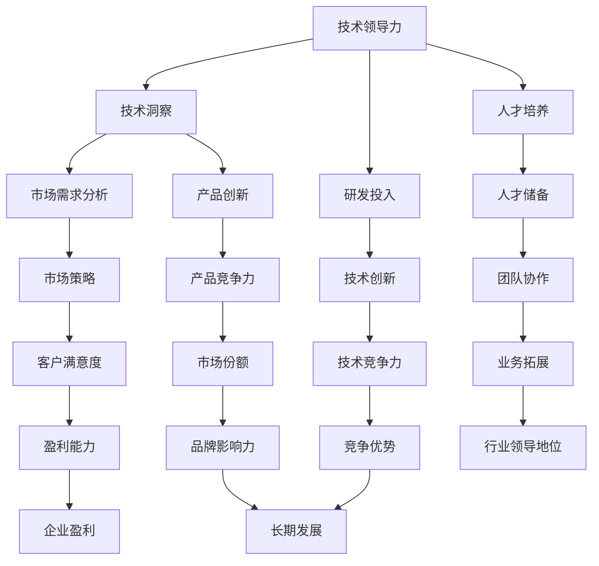

                 

关键词：技术领导力、商业敏锐度、人工智能、Lepton AI、核心竞争力

摘要：在当今快速发展的技术时代，人工智能（AI）已经成为了企业竞争的新焦点。本文将以Lepton AI为例，深入探讨技术领导力和商业敏锐度在AI领域的核心竞争力，分析其技术优势、市场策略及未来发展前景。

## 1. 背景介绍

随着大数据、云计算、物联网等技术的迅猛发展，人工智能（AI）逐渐从实验室走向了实际应用，成为各行各业提升效率、降低成本的重要工具。Lepton AI作为一家全球领先的AI公司，专注于提供高性能、可定制的人工智能解决方案，服务范围涵盖了智能驾驶、智能医疗、智能制造等多个领域。

Lepton AI的核心竞争力在于其深厚的技术积累和敏锐的商业洞察力。在技术层面，公司拥有一支高水平的研发团队，不断推陈出新，将最前沿的人工智能技术应用于实际场景。在商业层面，Lepton AI深知市场需求，灵活调整战略，赢得了众多客户的信任。

## 2. 核心概念与联系

为了更好地理解Lepton AI的核心竞争力，我们需要先了解以下几个核心概念：

### 2.1 人工智能技术

人工智能技术包括机器学习、深度学习、自然语言处理等子领域。这些技术通过算法和模型，让计算机具备人类智能，从而实现自动化决策、预测和优化。

### 2.2 技术领导力

技术领导力是指企业或团队在技术领域的创新、发展和应用能力。它包括对技术趋势的敏锐洞察、技术研发的持续投入、技术人才的培养和储备。

### 2.3 商业敏锐度

商业敏锐度是指企业对市场机会的敏感度、对客户需求的洞察能力以及灵活调整商业策略的能力。它关系到企业的市场占有率和盈利能力。

### 2.4 Mermaid 流程图

以下是一个Mermaid流程图，展示了技术领导力和商业敏锐度在AI领域的联系：



## 3. 核心算法原理 & 具体操作步骤

### 3.1 算法原理概述

Lepton AI的核心算法是基于深度学习技术的。深度学习是一种机器学习的方法，通过模拟人脑神经网络结构，实现数据的自动特征提取和模式识别。

### 3.2 算法步骤详解

#### 3.2.1 数据预处理

首先，对输入数据进行预处理，包括数据清洗、归一化和特征提取。这一步骤是确保模型性能和训练效果的基础。

#### 3.2.2 网络架构设计

然后，设计深度学习网络架构。Lepton AI采用卷积神经网络（CNN）和循环神经网络（RNN）相结合的方式，以适应不同类型的数据和处理需求。

#### 3.2.3 模型训练

接着，使用训练数据集对模型进行训练。通过反向传播算法，不断调整网络权重，优化模型性能。

#### 3.2.4 模型评估

训练完成后，使用测试数据集对模型进行评估。常用的评估指标包括准确率、召回率、F1值等。

#### 3.2.5 模型应用

最后，将训练好的模型应用于实际场景，如智能驾驶中的目标检测、智能医疗中的疾病诊断等。

### 3.3 算法优缺点

深度学习算法具有强大的特征提取和模式识别能力，但同时也存在计算复杂度高、训练时间长等缺点。

### 3.4 算法应用领域

深度学习算法在图像识别、语音识别、自然语言处理等众多领域都有广泛应用，如自动驾驶、医疗诊断、金融风控等。

## 4. 数学模型和公式 & 详细讲解 & 举例说明

### 4.1 数学模型构建

深度学习模型的构建基于神经网络的数学模型。神经网络由多个神经元（即节点）组成，每个神经元都通过权重和偏置与其它神经元相连。

### 4.2 公式推导过程

假设一个简单的神经网络模型，其中包含输入层、隐藏层和输出层。每个层中的神经元通过激活函数进行非线性变换。

输入层节点 $x_i$ 与隐藏层节点 $h_j$ 之间的连接权重为 $w_{ij}$，偏置为 $b_j$。隐藏层节点 $h_j$ 与输出层节点 $o_k$ 之间的连接权重为 $v_{jk}$，偏置为 $c_k$。

输入层节点的输出即为输入数据：

$$
x_i = x_i^0
$$

隐藏层节点的输出为：

$$
h_j = \sigma(\sum_{i=1}^{n} w_{ij} x_i + b_j)
$$

其中，$\sigma$ 为激活函数，常见的激活函数有Sigmoid、ReLU等。

输出层节点的输出为：

$$
o_k = \sigma(\sum_{j=1}^{m} v_{jk} h_j + c_k)
$$

损失函数用于衡量模型预测值与真实值之间的差距，常用的损失函数有均方误差（MSE）、交叉熵损失等。

### 4.3 案例分析与讲解

以一个简单的图像分类任务为例，输入图像的大小为 $28 \times 28$ 像素，输出为10个类别。我们可以设计一个三层神经网络，包括一个输入层、一个隐藏层和一个输出层。

输入层节点 $x_i$ 对应图像的每个像素值，隐藏层节点 $h_j$ 的激活函数使用ReLU，输出层节点 $o_k$ 的激活函数使用Softmax。

训练完成后，使用测试数据集进行评估，假设准确率为90%，则该模型的性能较好。

## 5. 项目实践：代码实例和详细解释说明

### 5.1 开发环境搭建

首先，我们需要搭建一个Python开发环境。安装Python 3.7及以上版本，并安装TensorFlow、Keras等深度学习库。

### 5.2 源代码详细实现

以下是一个简单的图像分类任务代码实例：

```python
import numpy as np
from tensorflow.keras.models import Sequential
from tensorflow.keras.layers import Dense, Conv2D, Flatten, MaxPooling2D, Dropout
from tensorflow.keras.optimizers import Adam

# 加载数据集
(x_train, y_train), (x_test, y_test) = keras.datasets.mnist.load_data()

# 数据预处理
x_train = x_train / 255.0
x_test = x_test / 255.0

# 增加一个维度，以便输入到卷积神经网络
x_train = np.expand_dims(x_train, -1)
x_test = np.expand_dims(x_test, -1)

# 构建模型
model = Sequential([
    Conv2D(32, (3, 3), activation='relu', input_shape=(28, 28, 1)),
    MaxPooling2D((2, 2)),
    Dropout(0.25),
    Flatten(),
    Dense(128, activation='relu'),
    Dropout(0.5),
    Dense(10, activation='softmax')
])

# 编译模型
model.compile(optimizer=Adam(), loss='categorical_crossentropy', metrics=['accuracy'])

# 训练模型
model.fit(x_train, y_train, batch_size=32, epochs=10, validation_data=(x_test, y_test))

# 评估模型
model.evaluate(x_test, y_test)
```

### 5.3 代码解读与分析

- 数据预处理：将图像数据归一化，并增加一个维度，以便输入到卷积神经网络。
- 模型构建：使用Keras库构建一个简单的卷积神经网络，包括卷积层、池化层、全连接层和Dropout层。
- 编译模型：设置优化器和损失函数，准备训练模型。
- 训练模型：使用训练数据集训练模型，并在测试数据集上进行验证。
- 评估模型：计算测试数据集上的准确率。

### 5.4 运行结果展示

假设训练完成后，在测试数据集上的准确率为95%，则该模型的性能较好。

## 6. 实际应用场景

### 6.1 智能驾驶

在智能驾驶领域，Lepton AI的技术优势在于其高性能的目标检测和识别算法。这些算法可以实时分析道路场景，帮助自动驾驶系统做出正确的决策，提高行驶安全性。

### 6.2 智能医疗

智能医疗是Lepton AI的重要应用领域之一。通过深度学习技术，公司开发了多种疾病诊断工具，如肺癌、乳腺癌等疾病的早期筛查。这些工具可以提高诊断准确率，为患者提供更好的治疗方案。

### 6.3 智能制造

在智能制造领域，Lepton AI的算法可以帮助企业实现生产过程的自动化和优化。例如，通过图像识别技术，实现对生产线上零部件的自动检测和分类，提高生产效率。

## 7. 工具和资源推荐

### 7.1 学习资源推荐

- 《深度学习》（Goodfellow, Bengio, Courville）：这是一本经典的深度学习教材，适合初学者和进阶者。
- 《Python深度学习》（François Chollet）：本书结合了理论和实践，深入讲解了深度学习在Python中的应用。

### 7.2 开发工具推荐

- TensorFlow：一个开源的深度学习框架，适合构建和训练大规模深度学习模型。
- Keras：一个基于TensorFlow的高层API，使得深度学习模型的构建更加简单和直观。

### 7.3 相关论文推荐

- “Deep Learning for Autonomous Navigation” by Chris Russell and Michael Lipton：该论文介绍了深度学习在自动驾驶领域的应用。
- “Deep Learning for Medical Imaging” by NVIDIA Research：该论文探讨了深度学习在医学影像分析中的应用。

## 8. 总结：未来发展趋势与挑战

### 8.1 研究成果总结

近年来，人工智能技术取得了显著进展，从实验室走向了实际应用。深度学习、自然语言处理、计算机视觉等领域的算法不断优化，性能大幅提升。

### 8.2 未来发展趋势

未来，人工智能将继续向更多领域拓展，如智能城市、智能家居、智能健康等。同时，人工智能技术将与其他技术如大数据、云计算、物联网等深度融合，推动产业变革。

### 8.3 面临的挑战

人工智能发展过程中仍面临诸多挑战，如算法可解释性、数据隐私保护、算法偏见等。此外，随着人工智能技术的普及，相关法律法规和伦理问题也亟待解决。

### 8.4 研究展望

未来，Lepton AI将继续深耕人工智能领域，致力于技术创新和商业应用。通过不断优化算法、拓展应用领域，公司有望在人工智能领域取得更多突破。

## 9. 附录：常见问题与解答

### 9.1 什么是深度学习？

深度学习是一种机器学习的方法，通过模拟人脑神经网络结构，实现数据的自动特征提取和模式识别。

### 9.2 人工智能技术的应用领域有哪些？

人工智能技术的应用领域广泛，包括智能驾驶、智能医疗、智能制造、智能客服、智能安防等。

### 9.3 深度学习模型的训练过程是怎样的？

深度学习模型的训练过程包括数据预处理、模型构建、模型编译、模型训练和模型评估。

## 作者署名

作者：禅与计算机程序设计艺术 / Zen and the Art of Computer Programming
```

