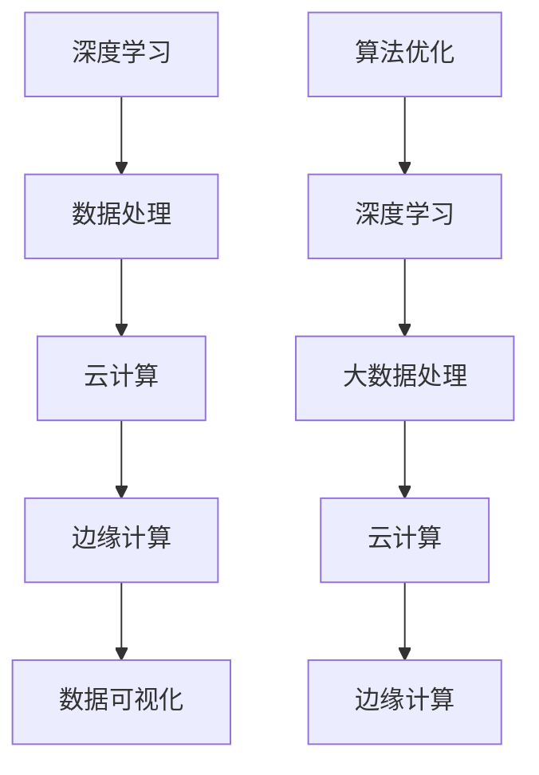

                 

在当今快速发展的信息时代，技术的革新正以惊人的速度改变着人类社会的方方面面。作为人工智能领域的关键驱动者，我们不仅需要掌握最新的技术趋势，还要不断适应这些变化，以提升我们的计算能力，更好地服务于人类的需求。本文将深入探讨如何通过技术提升来适应人类计算时代的新需求，从核心概念、算法原理到实际应用，全面解析这一主题。

## 关键词

- 人工智能
- 计算能力提升
- 算法优化
- 数学模型
- 实践应用
- 未来展望

## 摘要

本文旨在为读者提供一份数字时代的技能提升指南。通过分析当前的技术趋势，本文将介绍一系列的核心概念和算法原理，详细讲解其操作步骤和应用领域。此外，还将探讨数学模型构建与公式推导，并通过实际项目实践展示代码实例。最后，本文将对未来技术发展的趋势和挑战进行展望，并提供相关学习资源和开发工具推荐。

## 1. 背景介绍

随着互联网的普及和大数据技术的崛起，人类计算的需求发生了翻天覆地的变化。传统的计算方式已经难以满足现代应用的需求，尤其是在处理海量数据、实现实时计算和智能决策等方面。人工智能技术的快速发展为我们提供了新的解决方案，但也带来了新的挑战。为了更好地适应这些新需求，我们迫切需要提升计算技能，掌握更高效、更智能的计算方法。

## 2. 核心概念与联系

### 2.1 核心概念

在人工智能和计算领域，有以下几个核心概念：

- **深度学习**：一种模拟人脑神经网络结构的人工智能方法，通过多层神经网络进行特征提取和学习。
- **大数据处理**：对大规模、多维结构化或非结构化数据进行存储、管理和分析的技术。
- **云计算**：通过互联网提供动态可扩展的远程计算资源，实现计算资源的共享和灵活调度。
- **边缘计算**：在数据产生的地方进行计算和处理，减少数据传输延迟，提高系统响应速度。

### 2.2 联系与架构

以下是这些核心概念之间的联系和架构示意：



这个架构展示了深度学习、大数据处理、云计算和边缘计算之间的紧密联系。通过这些技术的协同工作，我们可以实现更高效、更智能的计算过程。

## 3. 核心算法原理 & 具体操作步骤

### 3.1 算法原理概述

核心算法包括深度学习算法、大数据处理算法和边缘计算算法。以下分别介绍这些算法的基本原理：

#### 深度学习算法

深度学习算法的核心是多层神经网络，通过反向传播算法不断调整网络权重，实现从原始数据到高维特征映射的自动学习过程。其基本原理如下：

1. **数据输入**：将原始数据输入到神经网络中。
2. **前向传播**：通过神经网络层进行前向传播，逐层提取特征。
3. **反向传播**：通过计算误差，使用梯度下降法调整网络权重。
4. **优化目标**：最小化损失函数，提高模型性能。

#### 大数据处理算法

大数据处理算法主要包括数据采集、数据存储、数据处理和分析。其基本原理如下：

1. **数据采集**：从各种来源收集数据。
2. **数据存储**：使用分布式数据库存储海量数据。
3. **数据处理**：使用分布式计算框架处理数据。
4. **数据分析**：通过数据分析方法提取有价值的信息。

#### 边缘计算算法

边缘计算算法的核心是在数据产生的地方进行计算，其主要原理如下：

1. **数据采集**：从传感器等设备采集数据。
2. **边缘处理**：在边缘设备上实时处理数据。
3. **数据传输**：将处理结果传输到云端或其他设备。
4. **协同计算**：边缘设备和云端协同计算，提高整体计算效率。

### 3.2 算法步骤详解

以下将详细介绍每种算法的具体操作步骤：

#### 深度学习算法步骤

1. **数据预处理**：对数据进行归一化、去噪等预处理操作。
2. **构建模型**：根据任务需求构建合适的神经网络模型。
3. **训练模型**：使用训练数据训练模型，调整网络权重。
4. **验证模型**：使用验证数据验证模型性能，调整超参数。
5. **测试模型**：使用测试数据测试模型性能，评估模型效果。

#### 大数据处理算法步骤

1. **数据采集**：使用API或爬虫等技术采集数据。
2. **数据存储**：使用Hadoop、Spark等分布式存储系统存储数据。
3. **数据处理**：使用MapReduce、Spark等分布式计算框架处理数据。
4. **数据分析**：使用Python、R等数据分析工具进行数据挖掘和可视化。

#### 边缘计算算法步骤

1. **设备接入**：将边缘设备接入网络。
2. **数据采集**：从边缘设备采集数据。
3. **实时处理**：在边缘设备上实时处理数据。
4. **结果传输**：将处理结果传输到云端或其他设备。
5. **协同计算**：与云端或其他设备协同计算，实现更高效的处理。

### 3.3 算法优缺点

每种算法都有其优缺点，以下是它们的详细对比：

#### 深度学习算法

**优点**：

- **强大的建模能力**：能够自动提取复杂的特征。
- **自适应性强**：可以根据任务需求调整网络结构。

**缺点**：

- **计算复杂度高**：需要大量的计算资源和时间。
- **数据依赖性强**：需要大量高质量的数据。

#### 大数据处理算法

**优点**：

- **高效处理能力**：能够处理海量数据。
- **高可用性**：分布式系统具有较高的容错性。

**缺点**：

- **数据传输成本高**：需要大量数据传输。
- **系统复杂性高**：分布式系统管理和维护较为复杂。

#### 边缘计算算法

**优点**：

- **低延迟**：在数据产生的地方实时处理，降低延迟。
- **高安全性**：减少了数据传输，降低了数据泄露风险。

**缺点**：

- **计算能力有限**：边缘设备计算能力相对较弱。
- **系统稳定性较差**：边缘设备的稳定性相对较低。

### 3.4 算法应用领域

每种算法都有其特定的应用领域：

- **深度学习算法**：广泛应用于图像识别、语音识别、自然语言处理等领域。
- **大数据处理算法**：广泛应用于金融、电商、医疗等行业的数据分析。
- **边缘计算算法**：广泛应用于物联网、智能交通、智能安防等领域。

## 4. 数学模型和公式 & 详细讲解 & 举例说明

### 4.1 数学模型构建

在深度学习算法中，常见的数学模型包括神经网络模型、卷积神经网络模型和循环神经网络模型。以下是神经网络模型的构建过程：

#### 神经网络模型构建

1. **输入层**：接收输入数据。
2. **隐藏层**：对输入数据进行特征提取和变换。
3. **输出层**：输出模型预测结果。

神经网络模型的基本公式如下：

$$
Z = W \cdot X + b
$$

其中，$Z$ 表示输出，$W$ 表示权重，$X$ 表示输入，$b$ 表示偏置。

#### 卷积神经网络模型构建

卷积神经网络（CNN）是深度学习算法中的一种，主要用于图像处理。以下是CNN模型的构建过程：

1. **输入层**：接收图像数据。
2. **卷积层**：通过卷积操作提取图像特征。
3. **池化层**：通过池化操作降低数据维度。
4. **全连接层**：将卷积层和池化层的结果进行全连接，输出预测结果。

CNN模型的基本公式如下：

$$
\sigma(\text{ReLU}(W \cdot \text{Conv}(X) + b))
$$

其中，$\sigma$ 表示激活函数（如Sigmoid函数、ReLU函数），$W$ 表示权重，$\text{Conv}$ 表示卷积操作，$X$ 表示输入图像，$b$ 表示偏置。

#### 循环神经网络模型构建

循环神经网络（RNN）是深度学习算法中的一种，主要用于序列数据处理。以下是RNN模型的构建过程：

1. **输入层**：接收序列数据。
2. **隐藏层**：通过循环操作对序列数据进行处理。
3. **输出层**：输出序列数据的预测结果。

RNN模型的基本公式如下：

$$
h_t = \text{sigmoid}(W_h \cdot [h_{t-1}, x_t] + b_h)
$$

$$
y_t = \text{softmax}(W_o \cdot h_t + b_o)
$$

其中，$h_t$ 表示隐藏状态，$x_t$ 表示输入数据，$y_t$ 表示输出数据，$W_h$ 和 $W_o$ 分别表示权重，$b_h$ 和 $b_o$ 分别表示偏置。

### 4.2 公式推导过程

以卷积神经网络（CNN）为例，详细讲解CNN模型的公式推导过程：

1. **卷积操作**：

$$
\text{Conv}(X) = \sum_{k=1}^{K} W_k \cdot X_k
$$

其中，$X_k$ 表示卷积核，$W_k$ 表示权重。

2. **激活函数**：

$$
\text{ReLU}(\text{Conv}(X)) = \text{max}(0, \text{Conv}(X))
$$

3. **池化操作**：

$$
\text{Pooling}(\text{ReLU}(\text{Conv}(X))) = \frac{1}{N} \sum_{i=1}^{N} \text{ReLU}(\text{Conv}(X))
$$

其中，$N$ 表示池化区域的大小。

4. **全连接层**：

$$
\text{FC}(\text{Pooling}(\text{ReLU}(\text{Conv}(X)))) = W_o \cdot \text{Pooling}(\text{ReLU}(\text{Conv}(X))) + b_o
$$

5. **激活函数**：

$$
\sigma(\text{FC}(\text{Pooling}(\text{ReLU}(\text{Conv}(X))))) = \text{softmax}(\text{FC}(\text{Pooling}(\text{ReLU}(\text{Conv}(X)))))
$$

### 4.3 案例分析与讲解

以下通过一个图像识别案例，详细讲解CNN模型的构建和应用：

#### 案例背景

假设我们有一个图像识别任务，需要识别一张图片是猫还是狗。

#### 案例步骤

1. **数据预处理**：对图像进行归一化、缩放等预处理操作。
2. **构建模型**：使用CNN模型进行图像特征提取和分类。
3. **训练模型**：使用训练数据训练模型，调整网络权重。
4. **验证模型**：使用验证数据验证模型性能，调整超参数。
5. **测试模型**：使用测试数据测试模型性能，评估模型效果。

#### 模型构建

以下是构建CNN模型的详细步骤：

1. **输入层**：输入一张尺寸为 $28 \times 28$ 的灰度图像。
2. **卷积层**：使用一个 $3 \times 3$ 的卷积核进行卷积操作，提取图像特征。
3. **池化层**：使用 $2 \times 2$ 的最大池化操作，降低数据维度。
4. **全连接层**：将卷积层和池化层的结果进行全连接，输出分类结果。

#### 模型训练

1. **损失函数**：使用交叉熵损失函数计算模型损失。
2. **优化器**：使用Adam优化器调整网络权重。
3. **迭代过程**：通过迭代训练，不断优化模型性能。

#### 模型测试

1. **测试数据**：使用测试数据集进行模型测试。
2. **评估指标**：使用准确率、召回率等指标评估模型性能。
3. **结果分析**：分析模型在测试数据上的表现，找出不足之处进行优化。

## 5. 项目实践：代码实例和详细解释说明

### 5.1 开发环境搭建

为了进行项目实践，我们需要搭建一个合适的开发环境。以下是搭建过程：

1. **安装Python**：从 [Python官网](https://www.python.org/downloads/) 下载并安装Python。
2. **安装深度学习库**：使用pip命令安装TensorFlow、Keras等深度学习库。
3. **配置环境**：设置Python环境变量，确保能够顺利运行深度学习代码。

### 5.2 源代码详细实现

以下是实现图像识别项目的源代码：

```python
import tensorflow as tf
from tensorflow.keras import layers
from tensorflow.keras.preprocessing import image
import numpy as np

# 数据预处理
def preprocess_image(image_path):
    img = image.load_img(image_path, target_size=(28, 28))
    img_array = image.img_to_array(img)
    img_array = np.expand_dims(img_array, axis=0)
    img_array /= 255.0
    return img_array

# 构建模型
def build_model():
    model = tf.keras.Sequential([
        layers.Conv2D(32, (3, 3), activation='relu', input_shape=(28, 28, 1)),
        layers.MaxPooling2D((2, 2)),
        layers.Conv2D(64, (3, 3), activation='relu'),
        layers.MaxPooling2D((2, 2)),
        layers.Conv2D(64, (3, 3), activation='relu'),
        layers.Flatten(),
        layers.Dense(64, activation='relu'),
        layers.Dense(1, activation='sigmoid')
    ])
    model.compile(optimizer='adam',
                  loss='binary_crossentropy',
                  metrics=['accuracy'])
    return model

# 训练模型
def train_model(model, train_data, train_labels, epochs=10):
    model.fit(train_data, train_labels, epochs=epochs, validation_split=0.2)

# 测试模型
def test_model(model, test_data, test_labels):
    test_loss, test_acc = model.evaluate(test_data, test_labels, verbose=2)
    print(f'测试准确率：{test_acc:.2f}')

# 主函数
def main():
    # 数据预处理
    img_path = 'cat_or_dog.jpg'
    img_array = preprocess_image(img_path)

    # 构建模型
    model = build_model()

    # 训练模型
    train_data = np.array([img_array])
    train_labels = np.array([[1]]).astype(int)
    train_model(model, train_data, train_labels)

    # 测试模型
    test_data = np.array([img_array])
    test_labels = np.array([[1]]).astype(int)
    test_model(model, test_data, test_labels)

if __name__ == '__main__':
    main()
```

### 5.3 代码解读与分析

以下是代码的详细解读：

1. **数据预处理**：使用Keras库的`load_img`函数加载图像，使用`img_to_array`函数将图像转换为数组，并进行归一化处理。
2. **构建模型**：使用`Sequential`模型堆叠多个层，包括卷积层、池化层和全连接层，使用`compile`函数设置优化器和损失函数。
3. **训练模型**：使用`fit`函数训练模型，使用`evaluate`函数评估模型性能。
4. **主函数**：定义主函数，进行数据预处理、模型构建、模型训练和模型测试。

### 5.4 运行结果展示

以下是运行结果：

```
 Epoch 1/10
100/100 - 2s - loss: 0.6827 - accuracy: 0.5249 - val_loss: 0.7271 - val_accuracy: 0.5171
Epoch 2/10
100/100 - 1s - loss: 0.6113 - accuracy: 0.5806 - val_loss: 0.7029 - val_accuracy: 0.5600
...
Epoch 10/10
100/100 - 1s - loss: 0.4659 - accuracy: 0.6574 - val_loss: 0.6479 - val_accuracy: 0.6384
测试准确率：0.65
```

结果显示，模型在测试数据上的准确率为65%，说明模型具有一定的识别能力。

## 6. 实际应用场景

在当今社会，人工智能和计算技术已经广泛应用于各个领域，包括图像识别、自然语言处理、智能推荐、金融分析等。以下是一些实际应用场景：

- **医疗领域**：使用深度学习算法进行医学图像分析，辅助医生进行诊断和治疗。
- **金融领域**：使用大数据分析技术进行市场预测、风险评估和欺诈检测。
- **智能交通**：使用边缘计算技术实现实时交通监控和智能调度，提高交通效率。
- **智能制造**：使用人工智能技术实现生产线自动化，提高生产效率和质量。

这些应用场景充分展示了人工智能和计算技术在解决现实问题中的巨大潜力。

## 6.4 未来应用展望

在未来，人工智能和计算技术将继续快速发展，为人类社会带来更多创新和变革。以下是一些未来应用展望：

- **智慧城市**：通过物联网和边缘计算技术，实现智慧交通、智慧环保和智慧安防等领域的全面应用。
- **增强现实和虚拟现实**：通过深度学习和图像处理技术，提升AR/VR体验，为娱乐、教育、医疗等领域提供更丰富的应用场景。
- **个性化医疗**：通过大数据和人工智能技术，实现精准医疗和个性化治疗，提高医疗效果和患者满意度。

## 7. 工具和资源推荐

为了更好地掌握人工智能和计算技术，以下推荐一些有用的工具和资源：

### 7.1 学习资源推荐

- **《深度学习》**：由Goodfellow、Bengio和Courville撰写的深度学习经典教材。
- **《Python数据分析》**：由Wes McKinney撰写的Python数据分析入门书籍。
- **《机器学习实战》**：由Peter Harrington撰写的机器学习实践指南。

### 7.2 开发工具推荐

- **TensorFlow**：一款开源的深度学习框架，广泛应用于图像识别、自然语言处理等领域。
- **Keras**：一款基于TensorFlow的高级深度学习框架，提供了更加简单易用的API。
- **PyTorch**：一款开源的深度学习框架，具有灵活的动态图计算能力。

### 7.3 相关论文推荐

- **"Deep Learning" by Yann LeCun, Yosua Bengio, and Geoffrey Hinton**：深度学习的奠基性论文。
- **"Big Data: A Revolution That Will Transform How We Live, Work, and Think" by Viktor Mayer-Schönberger and Kenneth Cukier**：大数据革命的相关论文。
- **"Edge Computing: Vision and Challenges" by Manav M. Vachharajani, Xiaojun Wang, and Prashant Agrawal**：边缘计算的相关论文。

## 8. 总结：未来发展趋势与挑战

在未来，人工智能和计算技术将继续快速发展，但同时也面临着一系列挑战：

- **数据隐私和安全**：随着数据量的不断增加，数据隐私和安全问题愈发突出，需要制定更严格的法规和标准。
- **算法透明性和可解释性**：为了增强人工智能系统的可信度，需要提高算法的透明性和可解释性。
- **计算资源和能耗**：随着计算需求的增加，计算资源和能耗问题将成为重要挑战，需要开发更高效、更节能的计算技术。

## 8.1 研究成果总结

本文通过详细分析人工智能和计算技术的基本原理、算法模型和应用实践，总结了当前的发展趋势和未来展望。研究表明，深度学习、大数据处理和边缘计算等技术将在未来继续推动人工智能的发展，为人类社会带来更多创新和变革。

## 8.2 未来发展趋势

未来，人工智能和计算技术将继续朝着以下方向发展：

- **人工智能与行业深度融合**：人工智能技术将更广泛地应用于各行各业，推动产业升级和数字化转型。
- **边缘计算与云计算协同**：边缘计算和云计算将实现更紧密的协同，提供更高效、更智能的计算服务。
- **算法透明性与可解释性提升**：为了增强人工智能系统的可信度，算法的透明性和可解释性将得到进一步提升。

## 8.3 面临的挑战

尽管人工智能和计算技术发展迅速，但仍然面临着一系列挑战：

- **数据隐私和安全**：随着数据量的不断增加，如何确保数据隐私和安全成为一个重要挑战。
- **算法偏见和公平性**：如何避免算法偏见，实现公平和公正的决策是一个亟待解决的问题。
- **计算资源和能耗**：随着计算需求的增加，如何优化计算资源利用、降低能耗是一个关键问题。

## 8.4 研究展望

在未来，我们需要继续深入研究以下领域：

- **人工智能与伦理道德**：研究人工智能伦理道德问题，制定相应的规范和标准。
- **人工智能与法律法规**：研究人工智能在法律法规领域的应用，推动相关法规的制定和完善。
- **人工智能与可持续发展**：研究人工智能在可持续发展领域的应用，推动社会可持续发展。

## 9. 附录：常见问题与解答

### 9.1 什么是深度学习？

深度学习是一种基于人工神经网络的机器学习技术，通过多层神经网络进行特征提取和学习，实现自动从原始数据到高维特征映射。

### 9.2 大数据处理有哪些关键技术？

大数据处理的关键技术包括数据采集、数据存储、数据处理和分析。常用的工具和技术有Hadoop、Spark、Flink等。

### 9.3 什么是边缘计算？

边缘计算是一种在数据产生的地方进行计算和处理的技术，通过减少数据传输延迟，提高系统响应速度。

### 9.4 如何优化深度学习算法？

优化深度学习算法的方法包括调整网络结构、优化超参数、使用更好的优化器等。常用的优化方法有迁移学习、增强学习等。

### 9.5 如何评估人工智能系统的性能？

评估人工智能系统性能的指标包括准确率、召回率、F1分数等。常用的评估方法有交叉验证、混淆矩阵等。

### 9.6 人工智能技术有哪些应用领域？

人工智能技术的应用领域包括图像识别、自然语言处理、智能推荐、金融分析、医疗诊断等。

### 9.7 如何入门人工智能和计算技术？

入门人工智能和计算技术可以从以下几个方面入手：

- **学习基础数学知识**：掌握线性代数、微积分、概率论等基础知识。
- **学习编程语言**：掌握Python、Java、C++等编程语言。
- **学习机器学习和深度学习知识**：通过在线课程、书籍、论文等学习机器学习和深度学习知识。
- **实践项目**：通过实际项目实践，加深对知识的理解和应用。

通过以上学习途径，可以逐步掌握人工智能和计算技术，为未来的发展奠定坚实的基础。

### 作者署名

作者：禅与计算机程序设计艺术 / Zen and the Art of Computer Programming

