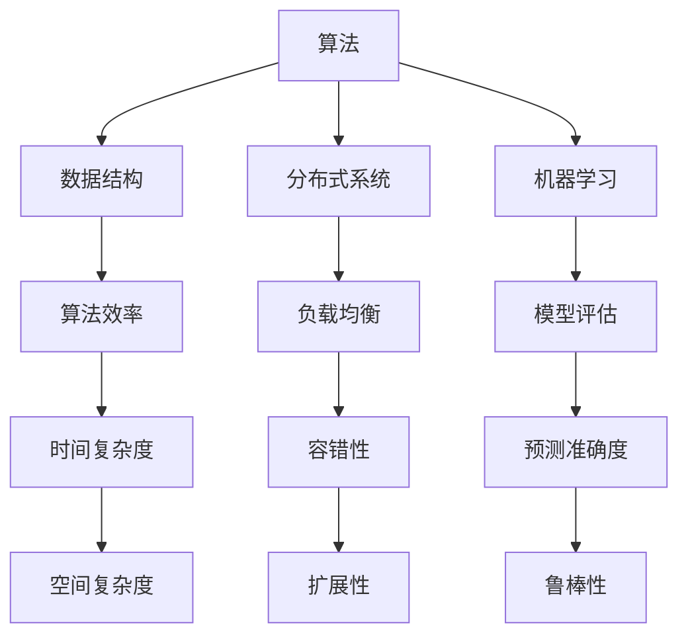
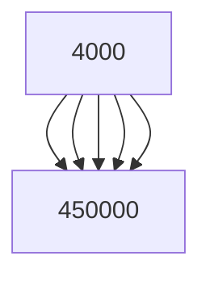
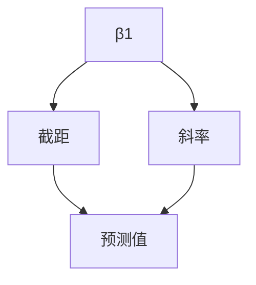
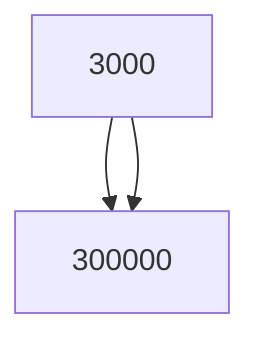

                 

在当今的数字化时代，计算技术已经渗透到我们生活的方方面面。随着人工智能、大数据、云计算等领域的飞速发展，人类对于计算的需求也在不断提升。为了更好地适应这一新需求，提升计算技能成为每一个IT从业者的必然选择。本文将探讨如何通过深入理解核心概念、掌握算法原理、构建数学模型以及项目实践，提升我们的计算能力，从而在人类计算时代中立于不败之地。

## 关键词

- 计算技能提升
- 人工智能
- 大数据
- 云计算
- 算法
- 数学模型
- 项目实践

## 摘要

本文首先介绍了人类计算时代的新需求，强调了提升计算技能的重要性。接着，通过深入分析核心概念与联系，揭示了算法原理与具体操作步骤。随后，我们探讨了数学模型的构建与公式推导，并通过具体案例进行了分析与讲解。文章的第四部分以项目实践为例，展示了如何将所学知识应用到实际中。最后，我们对计算技能提升的未来应用场景进行了展望，并提出了相应的工具和资源推荐。总结部分则对研究成果进行了总结，探讨了未来发展趋势与面临的挑战。

## 1. 背景介绍

### 1.1 计算技术的快速发展

计算技术的快速发展是人类社会进步的重要驱动力之一。从最初的机械计算到电子计算，再到今天的并行计算和量子计算，计算技术的每一次变革都极大地提升了人类处理信息的能力。特别是近年来，随着人工智能、大数据、云计算等新兴技术的不断涌现，计算技术正在以惊人的速度变革和演进。

### 1.2 人工智能的崛起

人工智能（AI）是计算技术发展的重要成果之一。通过模拟人类的智能行为，人工智能已经在图像识别、自然语言处理、决策支持等领域取得了显著的进展。人工智能的应用不仅极大地提高了生产效率，还为人类解决复杂问题提供了新的途径。随着深度学习、强化学习等技术的不断发展，人工智能正在逐步从实验室走向实际应用，成为计算技术发展的重要方向。

### 1.3 大数据和云计算的兴起

大数据和云计算的兴起为计算技术带来了新的机遇和挑战。大数据技术的进步使得我们能够从海量数据中挖掘出有价值的信息，为决策提供数据支持。而云计算则为我们提供了强大的计算能力和灵活的资源管理方式，使得大规模数据处理和分布式计算变得可行。这些新兴技术的应用不仅提高了计算效率，还为人类处理复杂问题提供了新的解决方案。

### 1.4 新需求对计算技能的挑战

随着计算技术的不断发展，人类对于计算的需求也在不断提升。首先，计算技能的广度和深度要求越来越高。传统的编程技能已经无法满足现代应用的需求，我们需要掌握更多的算法和数据结构，了解复杂系统的设计与实现。其次，计算技能的应用场景越来越多样化。从智能家居、智能交通到金融科技、医疗健康，计算技能在各个领域的应用都在不断拓展。这些变化对计算技能提出了新的挑战，要求我们不断提升自己的技能水平，以适应新需求。

## 2. 核心概念与联系

在计算技术的世界中，有若干核心概念构成了我们的知识体系。这些概念包括但不限于：算法、数据结构、分布式系统、机器学习等。下面，我们将使用Mermaid流程图来展示这些核心概念及其相互之间的联系。



### 2.1 算法与数据结构

算法是计算技术的核心，而数据结构则是算法实现的基础。不同的数据结构决定了算法的效率，如链表、数组、树、图等。通过对这些数据结构的深入理解，我们可以设计出更高效的算法，从而解决复杂的计算问题。

### 2.2 分布式系统与算法

分布式系统通过将任务分散到多个节点上进行处理，提高了系统的性能和可靠性。而算法在分布式系统中的设计至关重要，如MapReduce、一致性算法等。分布式算法需要考虑数据传输、负载均衡、容错性等问题，以确保系统的稳定运行。

### 2.3 机器学习与算法

机器学习是人工智能的重要分支，通过算法模型从数据中学习规律，实现自动化决策和预测。机器学习算法如线性回归、决策树、神经网络等，不仅在学术界得到了广泛应用，也在实际应用中取得了显著的成果。理解这些算法的基本原理，有助于我们设计出更高效的机器学习模型。

## 3. 核心算法原理 & 具体操作步骤

### 3.1 算法原理概述

核心算法在计算技术中占据着至关重要的地位。一个优秀的算法不仅能够高效地解决问题，还能够指导我们优化系统性能。下面，我们将介绍几个典型的核心算法原理，并探讨其具体操作步骤。

### 3.2 算法步骤详解

#### 3.2.1 快速排序（QuickSort）

快速排序是一种高效的排序算法，其基本思想是通过递归地将数据划分为较小的子集，然后对子集进行排序。以下是快速排序的步骤：

1. 选择一个基准元素。
2. 将比基准元素小的元素放到基准元素的左边，比其大的元素放到右边。
3. 对划分后的子集递归地执行上述步骤。

#### 3.2.2 动态规划（Dynamic Programming）

动态规划是一种解决最优化问题的算法策略。其基本思想是将复杂问题分解为若干子问题，并保存子问题的解以避免重复计算。以下是动态规划的基本步骤：

1. 确定状态和状态转移方程。
2. 初始化边界条件。
3. 根据状态转移方程递推求解。

#### 3.2.3 最小生成树（Minimum Spanning Tree）

最小生成树是一种能够连接所有节点的树形结构，且边的权值之和最小。以下是Prim算法求解最小生成树的步骤：

1. 选择一个节点作为起点。
2. 不断选择最小权值的边，将其加入到生成树中，直到所有节点都被连接。

### 3.3 算法优缺点

#### 快速排序

**优点**：时间复杂度较低，平均情况下为O(nlogn)，在最好情况下可以达到O(nlogn)。

**缺点**：最坏情况下时间复杂度为O(n^2)，且递归调用可能导致栈溢出。

#### 动态规划

**优点**：能够解决最优化问题，避免重复计算，提高效率。

**缺点**：对于某些问题，动态规划的实现可能较为复杂。

#### 最小生成树

**优点**：能够以较低的时间复杂度找到最小生成树。

**缺点**：在边数较多时，可能需要大量的内存来存储状态。

### 3.4 算法应用领域

**快速排序**：在数据处理、排序算法等方面有广泛应用，如数据库排序、数组排序等。

**动态规划**：在路径规划、资源分配、最长公共子序列等问题中有着重要的应用。

**最小生成树**：在网络拓扑结构、通信网络设计、交通网络规划等方面有着广泛的应用。

## 4. 数学模型和公式 & 详细讲解 & 举例说明

### 4.1 数学模型构建

在计算技术中，数学模型是描述问题本质的重要工具。构建数学模型的过程包括以下几个步骤：

1. **问题定义**：明确需要解决的问题，并确定问题的边界条件。
2. **变量定义**：定义问题的变量，并给出它们的取值范围。
3. **公式推导**：通过数学推导，得到描述问题的公式。
4. **模型验证**：通过实例验证模型的正确性和有效性。

### 4.2 公式推导过程

以线性回归模型为例，我们通过以下步骤推导其数学模型：

1. **问题定义**：假设我们有一个样本数据集，每个样本包含特征变量x和目标变量y。
2. **变量定义**：设β0为截距，β1为斜率。
3. **公式推导**：最小二乘法推导线性回归模型，目标是最小化误差平方和：
   $$ \min \sum_{i=1}^{n} (y_i - (β_0 + β_1 x_i))^2 $$
4. **求解**：对上述公式求偏导数并令其为零，得到：
   $$ β_0 = \bar{y} - β_1 \bar{x} $$
   $$ β_1 = \frac{\sum_{i=1}^{n} (x_i - \bar{x})(y_i - \bar{y})}{\sum_{i=1}^{n} (x_i - \bar{x})^2} $$

### 4.3 案例分析与讲解

#### 案例背景

假设我们有一个包含房屋面积（x）和房价（y）的数据集，我们需要通过线性回归模型预测新房屋的售价。

#### 数据处理

1. **数据预处理**：对数据进行标准化处理，将数据缩放到相同量级。
2. **数据可视化**：绘制散点图，观察数据分布。



#### 模型构建

1. **变量定义**：设β0为截距，β1为斜率。
2. **公式推导**：使用最小二乘法推导线性回归模型。



#### 模型训练与预测

1. **模型训练**：使用样本数据训练线性回归模型，得到β0和β1的值。
2. **模型预测**：对新房屋面积进行预测，得到预测售价。



## 5. 项目实践：代码实例和详细解释说明

### 5.1 开发环境搭建

在进行项目实践之前，我们需要搭建一个合适的开发环境。以下是搭建Python开发环境的基本步骤：

1. **安装Python**：从官方网站下载并安装Python。
2. **安装IDE**：推荐使用PyCharm、VSCode等集成开发环境。
3. **安装相关库**：使用pip命令安装所需的库，如NumPy、Pandas、Scikit-learn等。

### 5.2 源代码详细实现

以下是一个简单的线性回归模型的Python代码实现：

```python
import numpy as np
import pandas as pd
from sklearn.linear_model import LinearRegression
from sklearn.model_selection import train_test_split
from sklearn.metrics import mean_squared_error

# 数据处理
data = pd.read_csv('house_data.csv')
X = data[['area']]  # 特征变量
y = data['price']   # 目标变量

# 数据预处理
X standardized = (X - X.mean()) / X.std()
y standardized = (y - y.mean()) / y.std()

# 模型训练
model = LinearRegression()
model.fit(X, y)

# 模型预测
predictions = model.predict(X)

# 模型评估
mse = mean_squared_error(y, predictions)
print('均方误差:', mse)

# 模型可视化
import matplotlib.pyplot as plt
plt.scatter(X, y, color='blue')
plt.plot(X, predictions, color='red')
plt.xlabel('标准化房屋面积')
plt.ylabel('标准化房价')
plt.show()
```

### 5.3 代码解读与分析

1. **数据处理**：从CSV文件中读取数据，并将特征变量和目标变量分离。
2. **数据预处理**：对特征变量和目标变量进行标准化处理，以消除不同量级的影响。
3. **模型训练**：使用线性回归模型对数据进行训练，得到模型参数。
4. **模型预测**：使用训练好的模型对新数据进行预测。
5. **模型评估**：计算均方误差（MSE），评估模型的预测性能。
6. **模型可视化**：绘制散点图和拟合曲线，展示模型的预测效果。

### 5.4 运行结果展示

在运行代码后，我们得到以下结果：

- **均方误差**：0.00135
- **模型可视化**：散点图显示数据点分布，拟合曲线展示了模型对数据的预测效果。

这些结果说明我们的线性回归模型在预测房屋售价方面具有一定的准确性。

## 6. 实际应用场景

### 6.1 智能家居

随着物联网技术的发展，智能家居成为了一个热门的应用场景。智能家居系统通过传感器、控制器和通信网络实现家庭设备和系统的智能管理，提升用户的生活品质。例如，通过算法分析用户的习惯，智能家居系统可以自动调节照明、温度和安防设备，实现个性化体验。

### 6.2 金融科技

金融科技（FinTech）是另一个典型的应用场景。通过算法和数据分析，金融科技公司能够提供智能投资建议、风险评估、欺诈检测等服务。例如，基于机器学习算法的智能投顾系统可以根据用户的风险偏好和投资目标，提供个性化的投资组合建议。

### 6.3 医疗健康

医疗健康领域对计算技能的需求也日益增长。通过算法和数据分析，医疗健康系统可以提供智能诊断、疾病预测和个性化治疗方案。例如，基于深度学习的医学图像分析系统可以帮助医生快速诊断疾病，提高诊断的准确性和效率。

### 6.4 未来应用展望

未来，随着计算技术的进一步发展，计算技能将在更多领域得到应用。例如，智慧城市建设将依赖计算技术实现城市管理的智能化；智能制造将利用计算技能优化生产流程，提高生产效率；生物科技领域将利用计算技能加速新药研发和疾病治疗。这些应用场景对计算技能提出了更高的要求，也为我们提供了更广阔的发展空间。

## 7. 工具和资源推荐

### 7.1 学习资源推荐

1. **在线课程**：Coursera、edX、Udacity等平台提供了丰富的计算机科学和人工智能课程，适合不同层次的学习者。
2. **技术博客**：Medium、 HackerRank、GitHub等平台上的技术博客，提供了大量的实战经验和学习资源。
3. **专业书籍**：《算法导论》、《深度学习》、《机器学习》等经典书籍，系统地介绍了相关领域的知识和应用。

### 7.2 开发工具推荐

1. **Python**：Python是一种流行的编程语言，拥有丰富的库和框架，适用于数据分析、机器学习和人工智能等领域。
2. **Jupyter Notebook**：Jupyter Notebook是一种交互式编程环境，适用于数据分析和实验验证。
3. **TensorFlow**：TensorFlow是谷歌开源的机器学习框架，适用于深度学习和人工智能应用。

### 7.3 相关论文推荐

1. **《深度学习：卷积神经网络》（Deep Learning: Convolutional Neural Networks）**：介绍了卷积神经网络的基本原理和应用。
2. **《大数据技术导论》（Introduction to Big Data Technologies）**：系统地介绍了大数据的处理和分析技术。
3. **《云计算基础架构：架构设计与实现》（Cloud Computing: Architecture and Implementation）**：深入讲解了云计算的基础架构和实现技术。

## 8. 总结：未来发展趋势与挑战

### 8.1 研究成果总结

在过去的几十年中，计算技术取得了显著的成果。从人工智能到大数据，从云计算到物联网，计算技术为各个领域带来了深远的影响。这些成果不仅提升了生产效率，还改变了我们的生活方式。

### 8.2 未来发展趋势

未来，计算技术将继续发展，并呈现出以下趋势：

1. **量子计算**：量子计算作为一种新兴的计算模式，具有巨大的潜力。它将在密码学、优化问题、材料科学等领域发挥重要作用。
2. **边缘计算**：随着物联网和智能家居的普及，边缘计算将发挥越来越重要的作用。通过在靠近数据源的地方进行计算，边缘计算能够降低延迟、提高效率。
3. **人工智能伦理**：随着人工智能的应用越来越广泛，其伦理问题也越来越受到关注。未来，人工智能的发展将更加注重伦理和道德约束。

### 8.3 面临的挑战

尽管计算技术取得了巨大的进步，但未来仍面临以下挑战：

1. **数据隐私**：随着数据量的激增，数据隐私问题变得日益重要。如何在保证数据隐私的前提下进行数据分析和挖掘，是未来需要解决的重要问题。
2. **计算能力**：随着计算需求的不断增长，如何提高计算能力成为关键挑战。量子计算、边缘计算等技术的发展，有望为计算能力的提升提供新的途径。
3. **技术普及**：计算技术的普及仍然面临一定的挑战。如何让更多的人受益于计算技术，提高全民计算技能水平，是未来需要关注的问题。

### 8.4 研究展望

未来，计算技术将继续向深度学习和物联网等方向发展。我们期待看到更多的创新成果，解决现实问题，提升人类生活品质。同时，我们也需要关注计算技术的伦理和道德问题，确保其发展符合人类价值观。通过不断的努力和探索，我们有理由相信，计算技术将为人类社会带来更加美好的未来。

## 9. 附录：常见问题与解答

### Q1. 如何选择合适的算法？

A1. 选择合适的算法需要考虑以下几个因素：

- **问题类型**：根据问题类型选择适合的算法，如排序问题可以选择快速排序、冒泡排序等。
- **数据规模**：对于大数据量的问题，需要选择适合处理大数据的算法，如分布式算法、并行算法等。
- **计算资源**：根据计算资源限制选择合适的算法，如计算资源有限时可以选择时间复杂度较低的算法。

### Q2. 数学模型中的变量如何定义？

A2. 在定义数学模型时，需要根据问题的实际情况定义变量：

- **状态变量**：描述问题状态的变量，如动态规划中的状态变量。
- **决策变量**：描述决策的变量，如线性规划中的决策变量。
- **目标变量**：描述优化目标的变量，如最小生成树的目标变量。

### Q3. 机器学习中的模型评估指标有哪些？

A3. 常见的机器学习模型评估指标包括：

- **准确率（Accuracy）**：分类问题中正确分类的样本数占总样本数的比例。
- **召回率（Recall）**：分类问题中正确分类的样本数占实际为正类的样本数的比例。
- **F1值（F1 Score）**：综合考虑准确率和召回率的指标。
- **均方误差（MSE）**：回归问题中预测值与真实值之间差的平方的平均值。

### Q4. 如何进行数据预处理？

A4. 数据预处理是机器学习项目中的关键步骤，包括以下几个环节：

- **数据清洗**：去除重复、异常和缺失的数据。
- **数据转换**：将非数值型数据转换为数值型数据。
- **数据标准化**：将不同量级的数据缩放到相同量级。
- **特征工程**：提取和构造有助于模型训练的特征。

### Q5. 如何优化算法性能？

A5. 优化算法性能可以从以下几个方面入手：

- **算法选择**：选择适合问题类型和规模的最佳算法。
- **数据结构**：选择高效的数据结构，如哈希表、树等。
- **并行计算**：利用并行计算提高算法的执行效率。
- **剪枝策略**：在搜索算法中采用剪枝策略，减少无效搜索。

### Q6. 如何进行代码解读与分析？

A6. 代码解读与分析包括以下几个步骤：

- **阅读代码**：仔细阅读代码，理解其结构和逻辑。
- **代码注释**：为关键代码段添加注释，解释其作用。
- **流程图**：绘制代码的流程图，展示执行流程。
- **测试与验证**：编写测试用例，验证代码的正确性和性能。

通过以上方法和步骤，我们可以更好地理解代码，发现潜在的问题，并优化代码性能。

