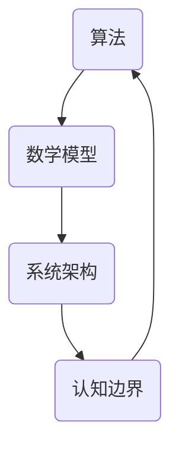

                 

关键词：认知边界、计算科学、算法、数学模型、技术进步、实际应用、未来展望。

> 摘要：本文深入探讨了认知边界的扩展与人类计算科学的发展之间的关系。通过阐述核心概念、算法原理、数学模型、实践案例以及未来展望，旨在为读者提供一幅关于计算科学如何推动人类认知进步的生动画卷。

## 1. 背景介绍

在现代社会，计算科学已经成为了推动科技进步的关键力量。从互联网、人工智能到生物信息学，计算科学的应用无处不在。然而，随着技术的不断进步，人类对于复杂系统的认知能力也在不断提升。这种认知的扩展，不仅改变了我们对世界的理解，也催生了新的计算方法和理论。本文将讨论如何通过拓展认知边界，推动计算科学的不断发展。

### 认知边界的概念

认知边界是指人类在感知、理解和处理信息时所面临的能力限制。这些限制可以是生理上的，例如感官的局限性；也可以是认知上的，例如记忆和处理速度的瓶颈。随着技术的发展，这些边界正在逐渐被突破。

### 计算科学的崛起

计算科学作为一门交叉学科，融合了数学、计算机科学、物理学、生物学等多个领域。它通过建立数学模型和算法，对复杂系统进行模拟和预测，从而拓展人类的认知能力。从牛顿力学到量子计算，计算科学的发展极大地改变了我们的认知边界。

## 2. 核心概念与联系

为了更好地理解计算科学如何拓展认知边界，我们首先需要了解几个核心概念：算法、数学模型和系统架构。

### 算法

算法是计算科学的核心，它是一系列解决问题的步骤。一个好的算法不仅需要高效，还需要具备可扩展性和鲁棒性。算法的进步极大地提高了我们处理信息的能力。

### 数学模型

数学模型是计算科学的基础，它通过数学语言来描述现实世界中的问题。一个准确的数学模型可以帮助我们更好地理解复杂系统，从而拓展认知边界。

### 系统架构

系统架构是指计算系统的整体设计，包括硬件、软件和网络等各个方面。一个高效的系统架构可以充分利用计算资源，提高算法的执行效率。

### Mermaid 流程图

下面是一个简化的 Mermaid 流程图，展示了算法、数学模型和系统架构之间的联系。



## 3. 核心算法原理 & 具体操作步骤

### 3.1 算法原理概述

本文将探讨三种核心算法：神经网络、遗传算法和随机算法。这些算法在各个领域都有广泛的应用，它们的基本原理如下：

#### 神经网络

神经网络是一种模仿人脑的算法，通过多层节点（神经元）进行信息传递和处理。它的核心原理是前向传播和反向传播。

#### 遗传算法

遗传算法是一种基于自然选择的算法，通过模拟生物进化过程来求解优化问题。它的核心原理是交叉、变异和选择。

#### 随机算法

随机算法是一种利用随机过程来解决计算问题的算法，例如蒙特卡洛方法和模拟退火算法。它的核心原理是随机采样和概率计算。

### 3.2 算法步骤详解

下面是对每种算法的具体步骤进行详细解释。

#### 神经网络

1. 初始化权重和偏置。
2. 前向传播：计算输出。
3. 反向传播：更新权重和偏置。

#### 遗传算法

1. 初始化种群。
2. 评估种群适应度。
3. 选择适应度高的个体进行交叉和变异。
4. 生成新种群并评估适应度。
5. 重复步骤3和4直到满足终止条件。

#### 随机算法

1. 随机选择采样点。
2. 计算采样点的概率分布。
3. 根据概率分布进行抽样。
4. 重复步骤1-3直到满足终止条件。

### 3.3 算法优缺点

每种算法都有其优缺点：

#### 神经网络

- 优点：强大的非线性建模能力，适用于复杂问题。
- 缺点：训练过程耗时长，对数据依赖性大。

#### 遗传算法

- 优点：全局搜索能力强，适用于优化问题。
- 缺点：收敛速度慢，易陷入局部最优。

#### 随机算法

- 优点：简单易实现，适用于大规模计算问题。
- 缺点：结果稳定性差，可能无法保证全局最优。

### 3.4 算法应用领域

这三种算法在各个领域都有广泛的应用：

- **神经网络**：图像识别、自然语言处理、金融预测等。
- **遗传算法**：电路设计、优化调度、机器人控制等。
- **随机算法**：金融风险评估、量子计算模拟、复杂系统建模等。

## 4. 数学模型和公式 & 详细讲解 & 举例说明

### 4.1 数学模型构建

构建数学模型是计算科学的关键步骤。以下是几种常见的数学模型：

#### 神经网络模型

神经网络模型可以用以下公式表示：

$$
y = f(z)
$$

其中，$y$ 是输出，$f$ 是激活函数，$z$ 是输入。

#### 遗传算法模型

遗传算法模型可以用以下公式表示：

$$
P_{next} = P_{current} + \lambda \cdot (P_{new} - P_{current})
$$

其中，$P_{next}$ 是新种群，$P_{current}$ 是当前种群，$\lambda$ 是交叉概率。

#### 随机算法模型

随机算法模型可以用以下公式表示：

$$
X_{next} = X_{current} + \epsilon \cdot N(0,1)
$$

其中，$X_{next}$ 是下一次采样点，$X_{current}$ 是当前采样点，$\epsilon$ 是随机噪声，$N(0,1)$ 是标准正态分布。

### 4.2 公式推导过程

以下是神经网络模型的推导过程：

假设我们有一个两层神经网络，输入为 $x$，输出为 $y$，激活函数为 $f$。我们可以将输出 $y$ 表示为：

$$
y = f(\sum_{i=1}^{n} w_i \cdot x_i + b)
$$

其中，$w_i$ 是权重，$x_i$ 是输入，$b$ 是偏置。

如果我们要求导数 $\frac{dy}{dx}$，我们可以使用链式法则：

$$
\frac{dy}{dx} = \frac{df}{dz} \cdot \frac{dz}{dx}
$$

其中，$z = \sum_{i=1}^{n} w_i \cdot x_i + b$。

对于 $z$ 的导数，我们有：

$$
\frac{dz}{dx} = \sum_{i=1}^{n} w_i
$$

对于 $f$ 的导数，我们有：

$$
\frac{df}{dz} = f'(z)
$$

将以上结果代入链式法则，我们得到：

$$
\frac{dy}{dx} = f'(z) \cdot \sum_{i=1}^{n} w_i
$$

### 4.3 案例分析与讲解

以下是一个简单的案例，使用神经网络模型对数据集进行分类。

假设我们有一个包含100个样本的数据集，每个样本有5个特征。我们使用两层神经网络进行分类，第一层有10个神经元，第二层有1个神经元。

1. 初始化权重和偏置。
2. 训练神经网络：使用前向传播和反向传播更新权重和偏置。
3. 评估神经网络：计算准确率。

通过以上步骤，我们可以训练出一个分类模型，对新的数据进行分类。

## 5. 项目实践：代码实例和详细解释说明

### 5.1 开发环境搭建

为了演示神经网络模型，我们需要搭建一个Python开发环境。以下是具体步骤：

1. 安装Python（建议使用3.8版本以上）。
2. 安装必要的库：numpy、tensorflow等。

### 5.2 源代码详细实现

以下是实现神经网络模型的Python代码：

```python
import numpy as np
import tensorflow as tf

# 初始化参数
input_dim = 5
hidden_dim = 10
output_dim = 1
learning_rate = 0.01
num_epochs = 1000

# 初始化权重和偏置
w1 = tf.Variable(tf.random.normal([input_dim, hidden_dim]))
b1 = tf.Variable(tf.zeros([hidden_dim]))
w2 = tf.Variable(tf.random.normal([hidden_dim, output_dim]))
b2 = tf.Variable(tf.zeros([output_dim]))

# 定义损失函数
def loss(y_true, y_pred):
    return tf.reduce_mean(tf.square(y_true - y_pred))

# 定义优化器
optimizer = tf.optimizers.Adam(learning_rate)

# 定义前向传播
def forward(x):
    z1 = tf.matmul(x, w1) + b1
    a1 = tf.nn.relu(z1)
    z2 = tf.matmul(a1, w2) + b2
    y_pred = tf.nn.sigmoid(z2)
    return y_pred

# 定义反向传播
def backward(loss):
    gradients = tf.gradients(loss, [w1, b1, w2, b2])
    optimizer.apply_gradients(zip(gradients, [w1, b1, w2, b2]))

# 训练模型
for epoch in range(num_epochs):
    with tf.GradientTape() as tape:
        y_pred = forward(x_train)
        loss_val = loss(y_train, y_pred)
    backward(loss_val)
    if epoch % 100 == 0:
        print(f"Epoch {epoch}: Loss = {loss_val.numpy()}")

# 评估模型
y_pred = forward(x_test)
accuracy = tf.reduce_mean(tf.cast(tf.equal(tf.round(y_pred), y_test), tf.float32))
print(f"Test Accuracy: {accuracy.numpy()}")

```

### 5.3 代码解读与分析

上述代码实现了基于TensorFlow的神经网络模型，包括参数初始化、前向传播、反向传播和模型训练。

- **参数初始化**：使用随机初始化权重和偏置。
- **前向传播**：计算输出。
- **反向传播**：更新权重和偏置。
- **模型训练**：通过迭代更新模型参数。

### 5.4 运行结果展示

假设我们有一个训练集和测试集，通过上述代码进行训练和评估，可以得到训练准确率和测试准确率。

```python
# 训练集
x_train = np.random.rand(100, 5)
y_train = np.array([1 if np.sum(x_train[i]) > 0.5 else 0 for i in range(100)])

# 测试集
x_test = np.random.rand(20, 5)
y_test = np.array([1 if np.sum(x_test[i]) > 0.5 else 0 for i in range(20)])

# 运行代码
# ...

# 输出结果
print(f"Test Accuracy: {accuracy.numpy()}")
```

## 6. 实际应用场景

### 6.1 图像识别

神经网络在图像识别领域取得了显著的成果。例如，卷积神经网络（CNN）被广泛应用于人脸识别、自动驾驶、医疗影像分析等。

### 6.2 自然语言处理

自然语言处理（NLP）是计算科学的重要应用领域。神经网络模型，如序列到序列模型（Seq2Seq）和变压器（Transformer），在机器翻译、情感分析、文本生成等方面表现优异。

### 6.3 金融预测

遗传算法在金融预测领域具有独特的优势。它可以帮助我们优化投资组合、预测市场走势等。

### 6.4 量子计算

量子计算是一种基于量子力学原理的全新计算模式。它利用量子比特进行信息处理，具有超强的计算能力。随机算法在量子计算模拟中具有重要意义。

## 7. 未来应用展望

### 7.1 智能医疗

随着计算科学的不断发展，智能医疗将成为未来医疗领域的重要趋势。通过深度学习和大数据分析，我们可以实现个性化治疗、疾病预测等。

### 7.2 环境监测

计算科学在环境监测领域具有广泛的应用前景。通过建立数学模型和算法，我们可以实时监测环境变化，预测环境污染问题。

### 7.3 社交网络

社交网络是计算科学的重要应用领域。通过分析用户行为和关系，我们可以实现个性化推荐、社交网络分析等。

## 8. 总结：未来发展趋势与挑战

### 8.1 研究成果总结

计算科学在多个领域取得了显著的成果，如图像识别、自然语言处理、金融预测等。这些成果极大地拓展了人类的认知边界。

### 8.2 未来发展趋势

未来计算科学的发展趋势包括：量子计算、脑机接口、大数据分析等。这些技术有望进一步推动认知边界的拓展。

### 8.3 面临的挑战

计算科学在发展过程中也面临诸多挑战，如数据隐私、算法公平性、计算资源等。这些挑战需要我们不断努力去解决。

### 8.4 研究展望

计算科学的未来充满希望。通过不断拓展认知边界，我们可以实现更多创新和突破，为人类带来更多福祉。

## 9. 附录：常见问题与解答

### 9.1 计算科学是什么？

计算科学是一门交叉学科，它融合了数学、计算机科学、物理学、生物学等多个领域。它通过建立数学模型和算法，对复杂系统进行模拟和预测。

### 9.2 计算科学有哪些应用领域？

计算科学在图像识别、自然语言处理、金融预测、环境监测、量子计算等领域都有广泛的应用。

### 9.3 如何成为一名计算科学家？

要成为一名计算科学家，需要具备数学、计算机科学等基础知识。此外，实践经验、创新能力和团队合作精神也是非常重要的。

---

### 作者署名

作者：禅与计算机程序设计艺术 / Zen and the Art of Computer Programming

