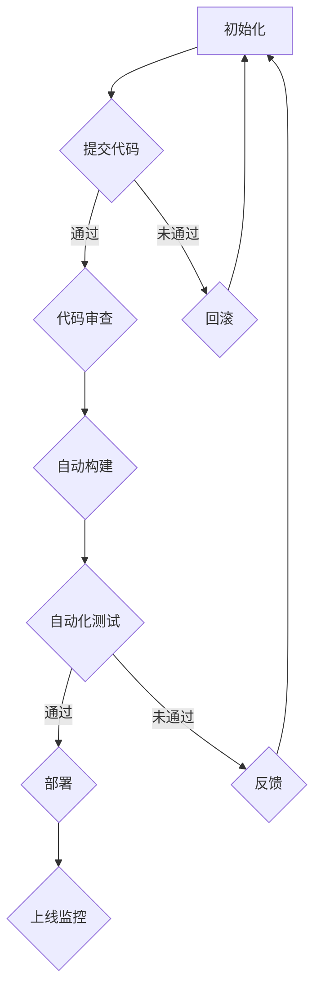

                 

关键词：持续部署、自动化部署、手动部署、CI/CD、代码质量、部署流程、风险控制、效率优化、架构设计、实践案例分析

> 摘要：本文探讨了持续部署（CI/CD）策略中自动化部署和手动部署的优缺点，分析了其在不同场景下的适用性，并结合实际案例阐述了如何优化部署流程，控制风险，提高项目效率。

## 1. 背景介绍

随着软件开发周期的不断缩短和软件需求的日益增长，持续集成（Continuous Integration, CI）和持续交付（Continuous Delivery, CD）已经成为现代软件开发中不可或缺的实践。持续部署是CI/CD流程的关键环节，它使得开发团队能够快速、安全地交付高质量的软件。

持续部署策略的核心在于如何有效地将代码更改从开发环境推向生产环境。这个过程涉及到代码的编译、测试、部署等多个环节。在这个过程中，自动化部署和手动部署两种方式各有优缺点，如何权衡并选择合适的部署策略，成为了许多开发团队面临的重要问题。

本文将深入探讨持续部署策略中的自动化和手动部署，分析它们在不同场景下的适用性，并结合实际案例提供优化部署流程的实践建议。

## 2. 核心概念与联系

持续部署（Continuous Deployment，简称CD）是一种软件开发和部署实践，其目标是自动、快速地将代码更改从开发环境推送到生产环境。它依赖于持续集成（Continuous Integration，简称CI）的实现，后者确保代码库中的每次提交都经过全面的测试。

### 2.1. 自动化部署

自动化部署是指通过预定义的脚本或工具自动执行部署流程，包括编译、测试、打包、部署和回滚等步骤。其优点包括：

- **效率提升**：自动化减少了人工干预，提高了部署速度。
- **一致性保证**：自动化部署确保每次部署都是一致的，减少了因人为操作不一致导致的问题。
- **可追溯性**：自动化部署过程可以记录日志，便于问题追踪和故障排除。

### 2.2. 手动部署

手动部署是指通过人工操作来完成部署流程，通常包括执行脚本、检查状态、手动触发部署等步骤。其优点包括：

- **灵活性**：手动部署更灵活，可以适应复杂的部署需求。
- **可控性**：手动部署使得团队可以更好地控制部署的每个环节，降低风险。

### 2.3. CI/CD架构

持续集成和持续交付通常依赖于以下核心组件：

- **版本控制系统**：如Git，用于管理代码变更。
- **构建工具**：如Jenkins，用于自动化构建和测试。
- **容器技术**：如Docker，用于打包应用和环境。
- **自动化部署工具**：如Kubernetes，用于部署和管理容器化应用。

### 2.4. Mermaid流程图

以下是一个简化的CI/CD流程的Mermaid流程图：



## 3. 核心算法原理 & 具体操作步骤

### 3.1. 算法原理概述

持续部署的核心算法原理主要包括以下几个方面：

- **版本控制**：使用版本控制系统（如Git）来跟踪代码变更。
- **自动化构建**：使用构建工具（如Maven、Gradle）来编译和打包代码。
- **自动化测试**：使用自动化测试工具（如JUnit、Selenium）来验证代码质量。
- **部署脚本**：使用脚本（如Shell、Python）来自动化执行部署流程。

### 3.2. 算法步骤详解

以下是自动化部署的详细步骤：

1. **提交代码**：开发人员将代码提交到版本控制系统。
2. **代码审查**：提交的代码经过代码审查，确保符合代码标准。
3. **自动构建**：构建工具自动编译和打包代码。
4. **自动化测试**：自动化测试工具运行测试用例，验证代码功能。
5. **部署脚本执行**：部署脚本根据测试结果自动执行部署流程，包括环境准备、代码部署、服务重启等。
6. **上线监控**：部署完成后，监控系统监控应用的运行状态，确保服务的稳定性。

### 3.3. 算法优缺点

**自动化部署的优点**：

- **提高效率**：自动化部署减少了人工操作，提高了部署速度。
- **一致性保证**：自动化部署确保每次部署都是一致的，减少了因人为操作不一致导致的问题。
- **易于回滚**：自动化部署过程中记录了详细的日志，便于快速回滚到之前版本。

**自动化部署的缺点**：

- **初始成本较高**：自动化部署需要购买或开发相应的工具和脚本，初期投入较大。
- **调试困难**：自动化部署过程中出现问题，调试和排查相对复杂。
- **对基础设施要求较高**：自动化部署依赖于稳定的版本控制系统和构建环境。

### 3.4. 算法应用领域

自动化部署广泛应用于以下领域：

- **互联网公司**：互联网公司通常有大量的代码变更，自动化部署能够显著提高工作效率。
- **金融行业**：金融行业对系统稳定性和安全性要求较高，自动化部署能够确保部署的一致性和可靠性。
- **大数据领域**：大数据处理通常涉及大量的代码和依赖库，自动化部署能够简化部署流程。

## 4. 数学模型和公式 & 详细讲解 & 举例说明

### 4.1. 数学模型构建

在持续部署过程中，可以构建以下数学模型来评估部署风险：

$$
R = f(\text{代码变更量}, \text{测试覆盖率}, \text{部署频率})
$$

其中，$R$ 表示部署风险，$\text{代码变更量}$、$\text{测试覆盖率}$ 和 $\text{部署频率}$ 分别表示代码变更的大小、测试覆盖程度和部署的频率。

### 4.2. 公式推导过程

假设：

- $A$ 表示代码变更量，$B$ 表示测试覆盖率，$C$ 表示部署频率。

根据持续部署的核心原则，可以推导出以下公式：

$$
R = A \times B \times C
$$

其中，$A$、$B$ 和 $C$ 分别表示代码变更量、测试覆盖率和部署频率的权重。通常，$A$ 的权重最大，因为代码变更量直接影响了系统的稳定性和安全性。

### 4.3. 案例分析与讲解

以下是一个简单的案例分析：

假设某个项目每月代码变更量为 100 行，测试覆盖率为 80%，部署频率为每周一次。根据上述公式，可以计算出部署风险：

$$
R = 100 \times 0.8 \times 1 = 80
$$

根据计算结果，部署风险为 80 分。为了降低风险，可以考虑以下措施：

1. **提高测试覆盖率**：通过增加测试用例，提高测试覆盖率，从而降低部署风险。
2. **降低部署频率**：减少每周一次的部署频率，例如改为每两周一次，从而降低部署风险。
3. **自动化测试**：引入自动化测试工具，提高测试效率，从而更快地发现和修复问题。

## 5. 项目实践：代码实例和详细解释说明

### 5.1. 开发环境搭建

在开始编写代码之前，首先需要搭建一个开发环境。假设我们使用Docker来构建我们的开发环境。

```shell
# 安装Docker
sudo apt-get update
sudo apt-get install docker.io

# 启动Docker服务
sudo systemctl start docker

# 拉取最新版本的Docker镜像
docker pull ubuntu:latest
```

### 5.2. 源代码详细实现

接下来，我们创建一个简单的Web应用，使用Python的Flask框架。

```python
# app.py

from flask import Flask

app = Flask(__name__)

@app.route('/')
def hello():
    return "Hello, World!"

if __name__ == '__main__':
    app.run(host='0.0.0.0', port=8080)
```

我们将这个Python文件保存为 `app.py`，并创建一个 `Dockerfile` 来构建我们的应用镜像。

```dockerfile
# Dockerfile

FROM python:3.9

WORKDIR /app

COPY requirements.txt ./
RUN pip install -r requirements.txt

COPY . .

CMD ["python", "app.py"]
```

### 5.3. 代码解读与分析

在 `Dockerfile` 中，我们使用了以下指令：

- `FROM python:3.9`：指定基础镜像为 Python 3.9。
- `WORKDIR /app`：设置工作目录为 `/app`。
- `COPY requirements.txt ./`：将 `requirements.txt` 文件复制到工作目录。
- `RUN pip install -r requirements.txt`：安装项目依赖。
- `COPY . /`：将当前目录（包含 `app.py`）复制到镜像的 `/` 目录。
- `CMD ["python", "app.py"]`：设置容器的启动命令。

### 5.4. 运行结果展示

构建并运行容器后，我们可以在本地机器的浏览器中访问 `http://localhost`，查看Web应用的运行结果。

```shell
# 构建镜像
docker build -t my-flask-app .

# 运行容器
docker run -d -p 8080:8080 my-flask-app
```

在浏览器中访问 `http://localhost`，应该可以看到 "Hello, World!" 的提示。

## 6. 实际应用场景

### 6.1. 互联网公司

在互联网公司，自动化部署被广泛应用于后端服务的持续集成和持续交付。例如，美团、阿里巴巴等公司通过自动化部署实现了每天数十次的小幅更新，保证了服务的稳定性和效率。

### 6.2. 金融行业

金融行业对系统的稳定性和安全性要求极高，因此在部署策略上更倾向于手动部署。例如，银行系统在发布重大更新前会进行多轮测试和人工审查，确保更新后的系统符合安全标准。

### 6.3. 大数据领域

大数据处理通常涉及大量的代码和依赖库，这使得自动化部署成为必要选择。例如，Hadoop生态系统中的许多项目都采用了自动化部署策略，以提高开发效率和系统稳定性。

## 7. 工具和资源推荐

### 7.1. 学习资源推荐

- 《持续交付：解放软件团队》
- 《CI/CD实践指南》
- 《Docker实战》

### 7.2. 开发工具推荐

- Jenkins
- GitLab CI/CD
- Git
- Docker

### 7.3. 相关论文推荐

- "Continuous Integration in the Cloud: Experiences and Challenges" by E. Sirer et al.
- "The Design of an Experimental Continuous Delivery Pipeline" by M. Gaševič et al.

## 8. 总结：未来发展趋势与挑战

### 8.1. 研究成果总结

持续部署策略在近年来取得了显著的研究成果。自动化部署工具和技术的不断成熟，使得开发团队能够更高效地交付高质量软件。同时，持续集成和持续交付的最佳实践也在不断推广，为团队提供了可靠的指导。

### 8.2. 未来发展趋势

- **自动化程度提高**：随着AI和机器学习技术的发展，自动化部署将进一步提高，减少人工干预。
- **多云和混合云部署**：企业将更倾向于采用多云和混合云部署策略，以提高灵活性和可扩展性。
- **DevOps文化推广**：DevOps文化的推广将进一步加强开发团队和运维团队的协作，推动持续部署的普及。

### 8.3. 面临的挑战

- **安全性保障**：自动化部署过程中，如何确保系统的安全性和数据保护是一个重要挑战。
- **部署效率与稳定性平衡**：在提高部署效率的同时，如何确保系统的稳定性和可靠性也是一个重要问题。
- **团队协作与培训**：推动持续部署实践需要团队协作和培训，以确保团队成员掌握相关技能和知识。

### 8.4. 研究展望

未来，持续部署领域的研究将重点关注以下几个方面：

- **自动化部署与安全性的结合**：研究如何在保证系统安全性的前提下，进一步提高自动化部署的效率。
- **智能部署**：利用AI和机器学习技术，实现智能化的部署策略，根据系统的运行状态自动调整部署流程。
- **跨领域应用**：探索持续部署在更多领域（如物联网、边缘计算等）的应用，推动持续部署技术的全面发展。

## 9. 附录：常见问题与解答

### 9.1. 问题1：自动化部署是否适用于所有项目？

自动化部署通常适用于代码变更频繁、部署需求高的项目。对于小型项目或变动较少的项目，手动部署可能更为合适。

### 9.2. 问题2：如何确保自动化部署的安全性？

确保自动化部署的安全性需要：

- **严格代码审查**：确保提交的代码符合安全标准。
- **使用加密技术**：对部署过程中的敏感数据进行加密。
- **日志记录与审计**：记录部署过程中的所有操作，便于问题追踪和审计。

### 9.3. 问题3：如何处理自动化部署失败的情况？

自动化部署失败时，可以：

- **自动回滚**：根据部署脚本中的回滚策略，自动回滚到上一个稳定版本。
- **人工干预**：由运维人员介入，手动解决问题。
- **故障排查**：根据日志和监控数据，快速定位问题根源。

## 作者署名

本文作者：禅与计算机程序设计艺术 / Zen and the Art of Computer Programming

