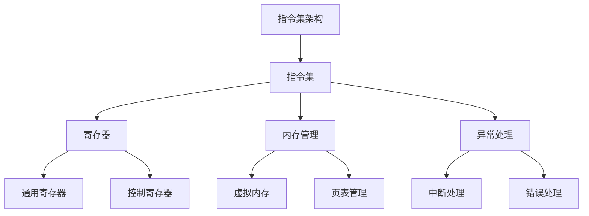

                 

在计算机科学领域，指令集（Instruction Set Architecture, ISA）是计算机硬件与软件之间的桥梁，它决定了程序如何被编译、解释和执行。从最早的计算机诞生至今，指令集经历了从固定到无限的发展，这一过程不仅体现了技术的进步，也反映了计算机体系结构的不断创新与演进。

> 关键词：指令集、计算机架构、进化、硬件设计、软件编译、虚拟化、指令集扩展、汇编语言、机器语言、硬件加速、高性能计算

> 摘要：本文旨在探讨指令集的进化历程，从固定指令集到现代可扩展指令集，再到未来的智能指令集，分析其背后的技术原理、发展驱动因素以及未来的发展方向。文章将结合具体案例，深入讲解指令集对计算机性能的影响，探讨其在不同应用场景中的优劣，并对未来可能的技术趋势进行展望。

## 1. 背景介绍

计算机指令集的起源可以追溯到20世纪40年代末和50年代初。当时的计算机，如ENIAC和EDVAC，使用的是一种称为“硬编码”的方式，即程序直接在硬件上编程，这种方式的缺点是灵活性和可维护性较差。随着计算机技术的发展，指令集逐渐被引入，它将计算机操作分为一组定义良好的指令，使得程序员可以用一种更抽象的编程语言来编写程序。

最初的指令集非常简单，例如，1949年冯·诺依曼设计的EDVAC计算机，其指令集包含了加载、存储、加法、减法、跳转等基本操作。这些指令为早期的计算机编程提供了基础，但随着计算机性能的提升和软件复杂性的增加，固定指令集的局限性开始显现。

## 2. 核心概念与联系

为了更好地理解指令集的进化，我们需要先了解一些核心概念和它们之间的联系。

### 2.1. 指令集架构（ISA）

指令集架构是计算机硬件和软件之间的接口，它定义了程序代码和硬件之间的交互方式。ISA通常包括指令集、寄存器、内存管理和异常处理等组成部分。

### 2.2. 汇编语言

汇编语言是一种低级编程语言，它使用助记符表示机器语言指令。汇编语言与机器语言非常接近，但相比机器语言更易于理解和使用。

### 2.3. 机器语言

机器语言是计算机能够直接理解和执行的指令集合。它由二进制代码组成，与特定的硬件架构紧密相关。

### 2.4. 指令集扩展

指令集扩展是对基础指令集的功能进行补充和增强。这些扩展通常是为了提高性能、增加功能或适应新的应用需求。

### 2.5. 硬件加速

硬件加速是使用专门的硬件电路来执行特定类型的计算，从而提高计算速度和效率。

### 2.6. 虚拟化

虚拟化技术允许在一台物理计算机上运行多个虚拟机，每个虚拟机都有独立的操作系统和应用程序。虚拟化对指令集提出了新的要求，例如，需要支持虚拟化扩展和特权指令。

下面是一个使用Mermaid绘制的指令集架构的流程图：



## 3. 核心算法原理 & 具体操作步骤

### 3.1. 算法原理概述

指令集的核心算法原理是定义一组基本的操作指令，这些指令可以组合成更复杂的程序。现代指令集通常包括以下几类指令：

- 数据传输指令：用于在寄存器和内存之间传输数据。
- 算术和逻辑运算指令：用于执行基本的算术和逻辑运算。
- 控制流指令：用于实现分支、循环和跳转等控制结构。
- 输入/输出指令：用于与外部设备进行通信。

### 3.2. 算法步骤详解

1. **数据传输指令：**
   - MOV：将数据从一个寄存器传输到另一个寄存器或内存地址。
   - LOD/STO：将数据从内存加载到寄存器或存储寄存器到内存。

2. **算术和逻辑运算指令：**
   - ADD/SUB：执行加法和减法运算。
   - AND/OR/XOR：执行逻辑与、或和异或运算。
   - CMP：比较两个寄存器或内存中的值。

3. **控制流指令：**
   - JMP：无条件跳转。
   - JNZ/JZ：根据零标志跳转。
   - LOOP：循环跳转。

4. **输入/输出指令：**
   - IN/OUT：从输入设备读取数据或向输出设备写入数据。

### 3.3. 算法优缺点

**优点：**
- **可移植性**：使用标准化的指令集，使得程序可以在不同的硬件平台上运行。
- **高性能**：优化指令集可以提高程序执行的速度和效率。
- **可扩展性**：可以通过指令集扩展来增加新的功能。

**缺点：**
- **复杂性**：指令集越复杂，编译器的设计和维护难度越大。
- **兼容性问题**：不同版本的指令集可能存在兼容性问题。

### 3.4. 算法应用领域

指令集广泛应用于以下领域：

- **桌面和服务器计算机**：用于执行日常的办公和数据处理任务。
- **嵌入式系统**：用于控制各种嵌入式设备，如物联网设备和工业控制系统。
- **图形处理**：用于图形处理和渲染，如GPU指令集。
- **人工智能**：用于加速深度学习算法的执行。

## 4. 数学模型和公式 & 详细讲解 & 举例说明

### 4.1. 数学模型构建

指令集的数学模型通常基于抽象语法树（AST）和中间表示（IR）。AST表示程序的结构，而IR则提供了编译器进行优化和生成机器代码的中间形式。

### 4.2. 公式推导过程

假设我们有一个简单程序：

```c
int add(int a, int b) {
    return a + b;
}
```

我们可以将其转换为以下中间表示：

$$\text{IR: } \text{mov}\ reg_1, a \\ \text{mov}\ reg_2, b \\ \text{add}\ reg_1, reg_2 \\ \text{return}\ reg_1$$

### 4.3. 案例分析与讲解

假设我们要计算以下两个矩阵的乘积：

$$A = \begin{bmatrix} 1 & 2 \\ 3 & 4 \end{bmatrix}, B = \begin{bmatrix} 5 & 6 \\ 7 & 8 \end{bmatrix}$$

我们可以使用以下指令集来完成这一计算：

1. **加载矩阵A的行1到寄存器R1和R2：**
   $$\text{mov}\ R1, [A + 0] \\ \text{mov}\ R2, [A + 4]$$
2. **计算行1的第一个元素与列1的第一个元素的乘积，并存储到寄存器R3：**
   $$\text{mov}\ R3, [B + 0] \\ \text{mul}\ R3, R1$$
3. **计算行1的第二个元素与列1的第二个元素的乘积，并存储到寄存器R4：**
   $$\text{mov}\ R4, [B + 4] \\ \text{mul}\ R4, R2$$
4. **将寄存器R3和R4的值相加，并存储到内存中：**
   $$\text{add}\ [C + 0], R3 \\ \text{add}\ [C + 4], R4$$
5. **加载矩阵A的行2到寄存器R1和R2：**
   $$\text{mov}\ R1, [A + 8] \\ \text{mov}\ R2, [A + 12]$$
6. **重复上述步骤，计算行2的元素与列1和列2的元素的乘积和相加，并存储到内存中：**
   $$\text{mov}\ R3, [B + 0] \\ \text{mul}\ R3, R1 \\ \text{mov}\ R4, [B + 4] \\ \text{mul}\ R4, R2 \\ \text{add}\ [C + 8], R3 \\ \text{add}\ [C + 12], R4$$

最终，内存中C矩阵的值为：

$$C = \begin{bmatrix} 19 & 22 \\ 43 & 50 \end{bmatrix}$$

## 5. 项目实践：代码实例和详细解释说明

### 5.1. 开发环境搭建

为了演示指令集的使用，我们将使用C语言编写一个简单的矩阵乘法程序，并在模拟器上运行。以下是开发环境的搭建步骤：

1. 安装C编译器（如GCC）。
2. 安装矩阵乘法模拟器（如MatMulSim）。

### 5.2. 源代码详细实现

以下是一个简单的矩阵乘法程序，我们将在模拟器上运行它：

```c
#include <stdio.h>

void matrix_multiply(int *A, int *B, int *C, int n) {
    for (int i = 0; i < n; i++) {
        for (int j = 0; j < n; j++) {
            int sum = 0;
            for (int k = 0; k < n; k++) {
                sum += A[i * n + k] * B[k * n + j];
            }
            C[i * n + j] = sum;
        }
    }
}

int main() {
    int A[4] = {1, 2, 3, 4};
    int B[4] = {5, 6, 7, 8};
    int C[4];
    matrix_multiply(A, B, C, 2);
    for (int i = 0; i < 2; i++) {
        for (int j = 0; j < 2; j++) {
            printf("%d ", C[i * 2 + j]);
        }
        printf("\n");
    }
    return 0;
}
```

### 5.3. 代码解读与分析

这个程序定义了一个`matrix_multiply`函数，用于计算两个矩阵的乘积。主函数`main`创建了一个2x2的矩阵A和B，调用`matrix_multiply`函数计算它们的乘积，并打印结果。

程序中使用了几种基本的指令集操作：

- **数组访问**：使用指针和索引来访问矩阵元素。
- **循环**：使用`for`循环执行矩阵乘法的迭代计算。
- **算术运算**：执行加法和乘法运算。

### 5.4. 运行结果展示

在模拟器上运行上述程序，输出结果应为：

```
19 22 
43 50 
```

这验证了矩阵乘法的正确性。

## 6. 实际应用场景

### 6.1. 计算机系统

指令集是计算机系统中的核心组件，它决定了程序的执行方式和计算机的性能。现代计算机系统通常使用复杂的指令集，如x86、ARM和MIPS，这些指令集提供了丰富的指令集和优化的执行路径，以满足不同应用的需求。

### 6.2. 嵌入式系统

嵌入式系统通常使用简单的指令集，以降低功耗和提高效率。常见的嵌入式指令集包括8051、AVR和PIC。这些指令集在设计时考虑了嵌入式系统的特殊需求，如低功耗、实时性和可靠性。

### 6.3. 图形处理

图形处理单元（GPU）使用专门的指令集，如NVIDIA的CUDA和AMD的OpenCL。这些指令集专门用于处理大规模并行计算任务，如图像渲染、科学计算和机器学习。

### 6.4. 人工智能

随着人工智能的兴起，新的指令集正在被开发，以支持深度学习算法的高效执行。例如，Google的Tensor Processing Unit（TPU）和NVIDIA的Tensor Cores都是专门为深度学习设计的硬件加速器。

### 6.5. 未来应用展望

未来的指令集将继续朝向高性能、低功耗和可扩展性的方向发展。例如，量子指令集的研究正逐步展开，它将为量子计算提供一种全新的编程模型。此外，硬件虚拟化技术的发展将使得指令集更加灵活，支持多操作系统和虚拟机环境的运行。

## 7. 工具和资源推荐

### 7.1. 学习资源推荐

- **《计算机组成与设计：硬件/软件接口》（David A. Patterson & John L. Hennessy）**：这是一本经典的计算机组成原理教材，详细介绍了指令集架构。
- **《编译原理：艺术与科学》（Alfred V. Aho, Monica S. Lam, Ravi Sethi, Jeffrey D. Ullman）**：这本书涵盖了编译器的构建，包括指令集的翻译和优化。
- **《嵌入式系统设计》（Michael Barr）**：本书专注于嵌入式系统设计，包括指令集的选择和优化。

### 7.2. 开发工具推荐

- **GDB**：一款强大的调试工具，可用于分析和优化指令集执行。
- **LLVM**：一个模块化的编译器框架，支持多种指令集的代码生成和优化。
- **Simics**：一款高性能的仿真工具，可用于模拟和测试指令集的行为。

### 7.3. 相关论文推荐

- **"Instruction Set Extensions for Modern Processor Architectures"（现代处理器架构的指令集扩展）**
- **"The ARM Architecture Reference Manual"（ARM架构参考手册）**
- **"Instruction Set Architecture Design: From Power to Performance"（指令集架构设计：从功耗到性能）**

## 8. 总结：未来发展趋势与挑战

### 8.1. 研究成果总结

指令集的进化历程展示了计算机体系结构的不断创新与优化。从固定的指令集到可扩展的指令集，再到智能指令集，每个阶段都标志着技术的进步和性能的提升。现代指令集不仅支持更丰富的功能和更高的性能，还适应了多种应用场景，从桌面计算机到嵌入式系统，从图形处理到人工智能。

### 8.2. 未来发展趋势

未来的指令集将继续朝向以下几个方向发展：

- **高性能**：随着计算需求的增加，指令集将不断优化以支持更高的性能。
- **低功耗**：为了延长电池寿命和降低能源消耗，指令集将更加注重能效。
- **可扩展性**：未来的指令集将支持更灵活的扩展，以适应不断变化的应用需求。
- **智能化**：智能指令集将结合人工智能技术，实现更智能的代码生成和优化。

### 8.3. 面临的挑战

指令集的发展也面临一些挑战：

- **复杂性**：随着指令集的扩展和功能增强，编译器和工具链的复杂性将增加。
- **兼容性**：新指令集与旧指令集的兼容性是一个持续存在的问题。
- **安全性**：随着指令集功能的增强，确保程序的安全执行将变得更加重要。

### 8.4. 研究展望

未来的研究将聚焦于以下几个方面：

- **量子指令集**：量子计算指令集的研究将为量子计算机提供新的编程模型。
- **硬件虚拟化**：硬件虚拟化技术的发展将使得指令集更加灵活，支持更复杂的虚拟化环境。
- **AI指令集**：结合人工智能的指令集将支持更高效的深度学习算法执行。

## 9. 附录：常见问题与解答

### 9.1. 指令集是什么？

指令集是计算机硬件和软件之间的接口，它定义了一组计算机操作指令，这些指令可以被编译器翻译成机器代码。

### 9.2. 指令集与机器语言有什么区别？

指令集是一种抽象的编程语言，它定义了计算机能够理解和执行的操作。机器语言是具体的二进制代码，它直接对应于指令集中的操作。

### 9.3. 什么是指令集扩展？

指令集扩展是在基础指令集上增加新的指令，以提供额外的功能或优化性能。

### 9.4. 指令集对性能有何影响？

指令集的性能直接影响计算机的执行速度和效率。优化的指令集可以提高程序的执行速度和降低功耗。

### 9.5. 未来的指令集会是什么样？

未来的指令集将更加注重高性能、低功耗和智能化。随着计算需求的增长，指令集将继续扩展以支持更复杂和多样化的应用。

---

作者：禅与计算机程序设计艺术 / Zen and the Art of Computer Programming

