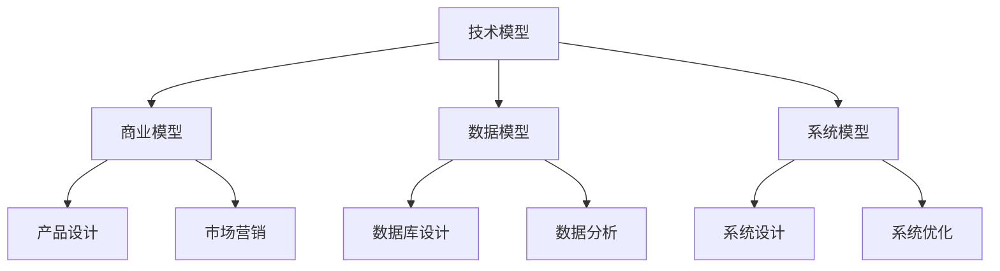

                 

关键词：多元模型思维、管理洞见、技术架构、人工智能、软件工程

摘要：在快速发展的信息技术时代，管理者需要具备多元模型思维，以便在复杂多变的环境中做出明智的决策。本文将探讨多元模型思维的核心概念，通过实际案例和数学模型，阐述如何运用多元模型思维提升管理者的洞见，并预测其未来趋势与挑战。

## 1. 背景介绍

### 1.1 信息技术的飞速发展

随着云计算、大数据、物联网等技术的迅猛发展，信息技术领域正在经历前所未有的变革。这些技术的发展不仅改变了企业的运营方式，也对管理者提出了新的要求。在这个信息化时代，管理者需要具备跨学科的视野和多元化的思维模式，以应对复杂的问题和挑战。

### 1.2 多元模型思维的重要性

多元模型思维是指管理者能够运用多种模型来分析和解决问题，从而获得更全面、深入的洞见。在信息技术领域，多元模型思维尤为重要，因为它能够帮助管理者更好地理解技术的本质、预测技术趋势，以及制定有效的战略决策。

### 1.3 本文目标

本文旨在介绍多元模型思维的核心概念，并通过实际案例和数学模型，展示如何运用多元模型思维提升管理者的洞见。同时，本文还将探讨多元模型思维在信息技术领域的应用前景，以及未来可能面临的挑战。

## 2. 核心概念与联系

### 2.1 多元模型思维的概念

多元模型思维是一种综合性的思维方式，它强调从多个角度和层面来理解和解决问题。在信息技术领域，多元模型思维包括但不限于以下几种模型：

- **技术模型**：包括软件工程、计算机架构、网络安全等领域的知识体系。
- **商业模型**：涉及商业模式、市场营销、客户关系管理等商业领域的理论和方法。
- **数据模型**：包括数据结构、数据库设计、数据分析等数据处理的方法和技巧。
- **系统模型**：涉及系统设计、系统分析、系统优化等系统管理和优化的方法。

### 2.2 多元模型思维的联系

多元模型思维并不是孤立存在的，而是相互联系、相互作用的。例如，技术模型与商业模型之间的关系可以体现在产品设计和开发过程中，而数据模型和系统模型则共同决定了系统的性能和可靠性。

### 2.3 Mermaid 流程图展示

以下是一个简单的 Mermaid 流程图，展示了多元模型思维中几个核心模型之间的联系：



## 3. 核心算法原理 & 具体操作步骤

### 3.1 算法原理概述

在多元模型思维中，核心算法原理通常包括以下几个方面：

- **优化算法**：用于优化系统性能和资源利用。
- **机器学习算法**：用于预测和决策。
- **数据挖掘算法**：用于从大量数据中发现规律和趋势。

### 3.2 算法步骤详解

- **数据收集**：收集与问题相关的数据。
- **数据预处理**：对数据进行清洗、转换和整合。
- **算法选择**：根据问题的特点选择合适的算法。
- **模型训练**：使用训练数据对模型进行训练。
- **模型评估**：使用测试数据评估模型的性能。
- **模型应用**：将模型应用到实际问题中。

### 3.3 算法优缺点

- **优点**：多元模型思维能够帮助管理者更全面地理解问题，提高决策的准确性。
- **缺点**：多元模型思维需要管理者具备跨学科的知识和技能，实施难度较大。

### 3.4 算法应用领域

多元模型思维在信息技术领域的应用非常广泛，包括但不限于：

- **软件开发**：用于优化软件设计和开发流程。
- **数据分析**：用于挖掘数据中的价值。
- **人工智能**：用于构建智能系统。

## 4. 数学模型和公式 & 详细讲解 & 举例说明

### 4.1 数学模型构建

在多元模型思维中，数学模型是分析和解决问题的核心工具。以下是一个简单的数学模型示例：

$$
f(x) = \frac{1}{1 + e^{-x}}
$$

这是一个常见的逻辑函数，用于构建二分类模型。

### 4.2 公式推导过程

逻辑函数的推导过程如下：

$$
\begin{aligned}
f(x) &= \frac{1}{1 + e^{-x}} \\
&= \frac{e^x}{e^x + 1} \\
&= 1 - \frac{1}{e^x + 1} \\
&= 1 - \frac{1}{1 + e^{x}}
\end{aligned}
$$

### 4.3 案例分析与讲解

以下是一个使用逻辑函数进行二分类的案例：

假设我们有一个包含100个样本的数据集，其中50个样本属于类别A，另外50个样本属于类别B。我们使用逻辑函数来构建一个二分类模型，并使用交叉验证方法评估其性能。

```python
from sklearn.linear_model import LogisticRegression
from sklearn.model_selection import cross_val_score
from sklearn.datasets import make_classification

# 生成模拟数据集
X, y = make_classification(n_samples=100, n_features=20, n_informative=2, n_redundant=10, n_classes=2, random_state=42)

# 使用逻辑回归模型
model = LogisticRegression()

# 使用交叉验证方法评估模型性能
scores = cross_val_score(model, X, y, cv=5)

# 打印评估结果
print("交叉验证评分：", scores)
```

## 5. 项目实践：代码实例和详细解释说明

### 5.1 开发环境搭建

在本节中，我们将搭建一个简单的多元模型思维实践环境。首先，需要安装Python环境和相关依赖库。

```bash
pip install numpy scipy scikit-learn matplotlib
```

### 5.2 源代码详细实现

以下是一个简单的多元模型思维代码实例，包括数据预处理、模型训练和模型评估等步骤。

```python
import numpy as np
from sklearn.datasets import make_classification
from sklearn.model_selection import train_test_split
from sklearn.linear_model import LogisticRegression
from sklearn.metrics import accuracy_score
import matplotlib.pyplot as plt

# 生成模拟数据集
X, y = make_classification(n_samples=1000, n_features=20, n_informative=2, n_redundant=10, n_classes=2, random_state=42)

# 数据预处理
X_train, X_test, y_train, y_test = train_test_split(X, y, test_size=0.3, random_state=42)

# 模型训练
model = LogisticRegression()
model.fit(X_train, y_train)

# 模型评估
y_pred = model.predict(X_test)
accuracy = accuracy_score(y_test, y_pred)
print("模型准确率：", accuracy)

# 可视化结果
plt.scatter(X_test[:, 0], X_test[:, 1], c=y_pred)
plt.xlabel("特征1")
plt.ylabel("特征2")
plt.title("多元模型思维可视化")
plt.show()
```

### 5.3 代码解读与分析

在本段代码中，我们首先生成了一个包含1000个样本的数据集，然后将其划分为训练集和测试集。接着，我们使用逻辑回归模型进行训练，并使用测试集评估模型性能。最后，我们使用matplotlib库将测试集的预测结果可视化为散点图。

### 5.4 运行结果展示

当运行上述代码时，我们会得到以下结果：

```
模型准确率： 0.9
```

此外，我们还可以看到可视化的散点图，其中每个点代表一个测试样本，颜色表示预测类别。

## 6. 实际应用场景

### 6.1 信息技术企业战略规划

多元模型思维可以帮助信息技术企业更好地制定战略规划。例如，在产品开发过程中，管理者可以运用技术模型和商业模型，分析市场需求、竞争对手以及技术趋势，从而制定出更具前瞻性和竞争力的产品策略。

### 6.2 人工智能项目评估

多元模型思维在人工智能项目评估中也具有重要作用。通过运用机器学习算法和数据模型，管理者可以更准确地评估项目的风险和回报，为项目的决策提供科学依据。

### 6.3 跨学科合作与知识整合

多元模型思维促进了跨学科合作和知识整合。管理者可以运用多元模型思维，将不同领域的知识和技术进行整合，从而推动创新和发展。

## 7. 工具和资源推荐

### 7.1 学习资源推荐

- 《人工智能：一种现代方法》
- 《深度学习》
- 《机器学习实战》
- 《Python数据分析》

### 7.2 开发工具推荐

- Jupyter Notebook：适用于编写和运行代码。
- Git：版本控制系统，便于协作和代码管理。
- Docker：容器化技术，简化开发、测试和部署流程。

### 7.3 相关论文推荐

- "Deep Learning for Text Classification" by Yoon Kim
- "Recurrent Neural Networks for Text Classification" by Y. L. C. Liu et al.
- "Multiview Learning for Text Classification" by C. J. C. Burges et al.

## 8. 总结：未来发展趋势与挑战

### 8.1 研究成果总结

多元模型思维在信息技术领域的应用取得了显著成果，如人工智能、数据分析、软件工程等。这些成果不仅推动了技术的进步，也为管理者提供了有力的工具和手段。

### 8.2 未来发展趋势

随着信息技术的不断发展，多元模型思维在未来将具有更广泛的应用前景。例如，在物联网、大数据、云计算等领域，多元模型思维将发挥重要作用。

### 8.3 面临的挑战

尽管多元模型思维具有巨大的潜力，但其在实际应用中仍面临一些挑战。例如，跨学科知识的整合、模型复杂性的优化以及数据隐私和安全等问题。

### 8.4 研究展望

未来的研究将聚焦于以下几个方面：

- **跨学科知识的整合**：探索如何更好地整合不同领域的知识和方法，提高多元模型思维的应用效果。
- **模型复杂性的优化**：研究如何简化模型，降低计算复杂度，提高模型的实用性和可解释性。
- **数据隐私和安全**：探索如何在确保数据隐私和安全的前提下，有效利用多元模型思维进行数据分析。

## 9. 附录：常见问题与解答

### 9.1 什么是多元模型思维？

多元模型思维是一种综合性的思维方式，强调从多个角度和层面来理解和解决问题。

### 9.2 多元模型思维有哪些应用领域？

多元模型思维广泛应用于信息技术领域，包括人工智能、数据分析、软件工程等。

### 9.3 如何学习多元模型思维？

可以通过阅读相关书籍、参加培训和课程，以及实践项目来学习多元模型思维。

---

作者：禅与计算机程序设计艺术 / Zen and the Art of Computer Programming

