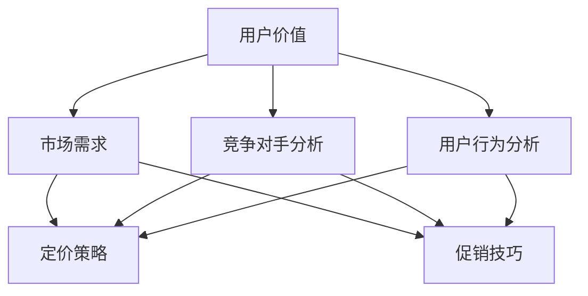

                 

关键词：知识付费、定价策略、促销技巧、用户行为分析、市场趋势

> 摘要：本文旨在深入探讨知识付费领域的定价策略与促销技巧。通过分析用户行为和市场趋势，提出一系列优化定价和促销策略的方法，以帮助知识付费平台和内容创作者更好地服务用户，提升盈利能力。

## 1. 背景介绍

知识付费是指用户为获取有价值的信息或知识而支付一定费用的一种商业模式。随着互联网技术的迅猛发展，在线教育、知识共享、专业技能提升等领域逐渐兴起，知识付费市场呈现出爆发式增长。然而，在竞争激烈的市场环境中，如何制定合理的定价策略和有效的促销手段，成为了知识付费平台和内容创作者面临的重要课题。

本文将从以下几个方面展开讨论：

1. 用户行为分析：探讨用户在知识付费场景下的购买动机和行为模式。
2. 定价策略：介绍常见的定价策略及其优缺点，并提供优化建议。
3. 促销技巧：分析有效的促销手段，包括限时折扣、优惠券、会员制度等。
4. 实践案例：结合实际案例，展示成功应用定价策略和促销技巧的经验。

通过以上讨论，本文希望为知识付费领域提供一些有益的参考和启示。

## 2. 核心概念与联系

在深入探讨知识付费的定价策略与促销技巧之前，我们需要了解一些核心概念及其相互联系。

### 2.1 用户价值

用户价值是指用户对知识产品所感知到的收益与所付出成本之间的差额。它是影响用户购买决策的重要因素。用户价值的评估不仅取决于知识产品的内容质量，还包括价格、品牌信誉、用户体验等多个维度。

### 2.2 市场需求

市场需求是指消费者在特定时间内，愿意且有能力购买某种知识产品的总量。市场需求受用户价值、竞争对手、市场环境等多种因素影响。了解市场需求有助于制定合理的定价策略。

### 2.3 竞争对手分析

竞争对手分析是指对市场上的竞争对手进行系统性的评估和分析，包括其产品定位、定价策略、市场份额、营销手段等。通过对竞争对手的分析，可以借鉴其成功经验，避免重复犯错。

### 2.4 用户行为分析

用户行为分析是指通过数据分析和用户调研，了解用户在知识付费场景下的购买行为、使用习惯、需求变化等。用户行为分析有助于优化产品设计和营销策略，提升用户满意度。

### 2.5 定价策略与促销技巧

定价策略和促销技巧是知识付费平台和内容创作者在市场竞争中的核心手段。合理的定价策略可以提升用户价值，促进销售；而有效的促销技巧可以吸引新用户，提高用户粘性。

下面是核心概念与联系的一个 Mermaid 流程图：



## 3. 核心算法原理 & 具体操作步骤

### 3.1 算法原理概述

知识付费的定价策略与促销技巧涉及多个方面，以下将介绍几种核心算法原理：

1. **需求导向定价法**：根据市场需求变化调整价格，以最大化收益。
2. **成本加成定价法**：在产品成本基础上加上一定比例的利润作为售价。
3. **价值导向定价法**：基于用户对产品价值的感知来设定价格。
4. **动态定价法**：根据用户行为和市场竞争情况实时调整价格。
5. **组合促销策略**：结合多种促销手段，提高用户购买意愿。

### 3.2 算法步骤详解

1. **需求导向定价法**

   - **步骤 1**：收集市场数据，包括用户需求、竞争对手价格等。
   - **步骤 2**：建立市场需求模型，如线性回归、ARIMA等。
   - **步骤 3**：根据市场需求模型预测未来价格。
   - **步骤 4**：综合考虑成本、利润和市场竞争情况，确定最终售价。

2. **成本加成定价法**

   - **步骤 1**：计算产品成本，包括固定成本和可变成本。
   - **步骤 2**：确定目标利润率。
   - **步骤 3**：计算售价，公式为：售价 = 成本 / (1 - 利润率)。

3. **价值导向定价法**

   - **步骤 1**：调研用户对知识产品的价值感知。
   - **步骤 2**：确定用户价值区间。
   - **步骤 3**：在用户价值区间内设定价格。

4. **动态定价法**

   - **步骤 1**：收集用户行为数据，如浏览量、购买频率等。
   - **步骤 2**：建立用户行为模型，如决策树、神经网络等。
   - **步骤 3**：根据用户行为模型实时调整价格。

5. **组合促销策略**

   - **步骤 1**：分析市场需求和用户行为，确定主要促销手段。
   - **步骤 2**：设计组合促销方案，如折扣、优惠券、会员等。
   - **步骤 3**：测试和优化促销效果，持续调整策略。

### 3.3 算法优缺点

1. **需求导向定价法**

   - **优点**：能够根据市场需求调整价格，最大化收益。
   - **缺点**：对市场数据要求较高，可能难以实时调整。

2. **成本加成定价法**

   - **优点**：简单易懂，易于操作。
   - **缺点**：无法准确反映市场需求和用户价值。

3. **价值导向定价法**

   - **优点**：基于用户价值，提升用户满意度。
   - **缺点**：对用户价值感知的调研难度较大。

4. **动态定价法**

   - **优点**：能够实时调整价格，提高竞争力。
   - **缺点**：对用户行为数据分析要求较高。

5. **组合促销策略**

   - **优点**：多种促销手段组合，提高用户购买意愿。
   - **缺点**：可能增加运营成本。

### 3.4 算法应用领域

以上算法在知识付费领域有广泛的应用，如在线教育、专业技能培训、知识分享平台等。通过合理运用这些算法，平台和内容创作者可以更好地满足用户需求，提高市场竞争力。

## 4. 数学模型和公式 & 详细讲解 & 举例说明

### 4.1 数学模型构建

在知识付费定价策略中，常用的数学模型包括需求模型、成本模型和利润模型。以下分别介绍这些模型的构建方法。

#### 4.1.1 需求模型

需求模型用于预测知识产品的市场需求。常见的需求模型有线性回归模型、ARIMA模型等。以下是一个简单的线性回归模型：

$$
Q_d = \beta_0 + \beta_1 \cdot P + \epsilon
$$

其中，$Q_d$ 表示市场需求量，$P$ 表示价格，$\beta_0$ 和 $\beta_1$ 分别为模型参数，$\epsilon$ 为误差项。

#### 4.1.2 成本模型

成本模型用于计算知识产品的成本。常见的成本模型有固定成本模型和可变成本模型。以下是一个简单的固定成本模型：

$$
C = C_f + C_v \cdot Q
$$

其中，$C$ 表示总成本，$C_f$ 为固定成本，$C_v$ 为可变成本，$Q$ 为产量。

#### 4.1.3 利润模型

利润模型用于计算知识产品的利润。利润模型可以基于成本模型构建，以下是一个简单的利润模型：

$$
\pi = R - C
$$

其中，$\pi$ 表示利润，$R$ 表示收入，$C$ 表示成本。

### 4.2 公式推导过程

#### 4.2.1 需求模型推导

假设市场需求量 $Q_d$ 与价格 $P$ 之间存在线性关系，可以表示为：

$$
Q_d = \beta_0 + \beta_1 \cdot P + \epsilon
$$

其中，$\beta_0$ 和 $\beta_1$ 是需要估计的参数，$\epsilon$ 是误差项。

对上式两边求导数，得到：

$$
\frac{dQ_d}{dP} = \beta_1
$$

根据导数的定义，上式表示需求量对价格的边际变化率，即需求弹性。需求弹性可以用来衡量价格变化对需求量的影响程度。

#### 4.2.2 成本模型推导

假设总成本 $C$ 由固定成本 $C_f$ 和可变成本 $C_v \cdot Q$ 组成，即：

$$
C = C_f + C_v \cdot Q
$$

其中，$C_f$ 为固定成本，$C_v$ 为可变成本，$Q$ 为产量。

对上式两边求导数，得到：

$$
\frac{dC}{dQ} = C_v
$$

根据导数的定义，上式表示总成本对产量的边际变化率，即边际成本。边际成本可以用来计算单位产量的成本变化。

#### 4.2.3 利润模型推导

利润 $\pi$ 可以表示为收入 $R$ 减去成本 $C$，即：

$$
\pi = R - C
$$

其中，$R$ 为收入，$C$ 为成本。

对上式两边求导数，得到：

$$
\frac{d\pi}{dQ} = \frac{dR}{dQ} - \frac{dC}{dQ}
$$

根据导数的定义，上式表示利润对产量的边际变化率，即边际利润。边际利润可以用来计算单位产量带来的利润变化。

### 4.3 案例分析与讲解

#### 4.3.1 需求模型案例分析

假设一家在线教育平台推出了一门编程课程，历史数据显示，该课程的价格与市场需求量之间存在线性关系。我们可以使用线性回归模型来拟合这种关系。

根据历史数据，拟合得到需求模型如下：

$$
Q_d = 1000 - 10 \cdot P
$$

其中，$Q_d$ 表示市场需求量，$P$ 表示课程价格。

根据需求弹性公式，可以计算需求弹性：

$$
\frac{dQ_d}{dP} = -10
$$

需求弹性为 -10，表示价格每增加 1%，市场需求量将减少 10%。

#### 4.3.2 成本模型案例分析

假设该在线教育平台的固定成本为 5000 元，每门课程的边际成本为 50 元。

根据成本模型，可以计算总成本：

$$
C = C_f + C_v \cdot Q = 5000 + 50 \cdot Q
$$

其中，$C$ 表示总成本，$C_f$ 表示固定成本，$C_v$ 表示边际成本，$Q$ 表示课程数量。

根据边际成本公式，可以计算边际成本：

$$
\frac{dC}{dQ} = 50
$$

边际成本为 50 元，表示每增加一门课程，总成本将增加 50 元。

#### 4.3.3 利润模型案例分析

假设课程售价为 200 元，根据利润模型，可以计算利润：

$$
\pi = R - C = 200 \cdot Q - (5000 + 50 \cdot Q) = 150 \cdot Q - 5000
$$

其中，$\pi$ 表示利润，$R$ 表示收入，$C$ 表示成本。

根据边际利润公式，可以计算边际利润：

$$
\frac{d\pi}{dQ} = 150 - 50 = 100
$$

边际利润为 100 元，表示每增加一门课程，利润将增加 100 元。

通过以上案例分析，我们可以看到数学模型在知识付费定价策略中的应用。利用这些模型，平台和内容创作者可以更准确地预测市场需求、控制成本和优化利润。

## 5. 项目实践：代码实例和详细解释说明

为了更好地理解知识付费定价策略和促销技巧，我们将通过一个实际项目来展示如何实施这些策略。以下是一个基于 Python 的在线教育平台的示例代码，包括定价策略和促销技巧的实现。

### 5.1 开发环境搭建

1. 安装 Python 3.8 或更高版本。
2. 安装必要的库，如 NumPy、Pandas、Matplotlib 等。

```bash
pip install numpy pandas matplotlib
```

### 5.2 源代码详细实现

```python
import numpy as np
import pandas as pd
import matplotlib.pyplot as plt

# 需求模型参数
alpha = -10
beta = 1000

# 成本模型参数
fixed_cost = 5000
variable_cost = 50

# 利润模型参数
price = 200
marginal_profit = 100

# 用户行为数据
user_data = pd.DataFrame({
    'price': [150, 200, 250, 300],
    'quantity': [500, 1000, 1500, 2000],
    'revenue': [price * quantity for quantity in user_data['quantity']],
    'cost': [fixed_cost + variable_cost * quantity for quantity in user_data['quantity']],
    'profit': [revenue - cost for revenue, cost in zip(user_data['revenue'], user_data['cost'])]
})

# 需求模型预测
predicted_quantity = alpha * user_data['price'] + beta

# 成本模型计算
user_data['predicted_cost'] = fixed_cost + variable_cost * predicted_quantity

# 利润模型计算
user_data['predicted_profit'] = user_data['revenue'] - user_data['predicted_cost']

# 绘制需求曲线、成本曲线和利润曲线
plt.figure(figsize=(10, 6))
plt.plot(user_data['price'], user_data['quantity'], label='Actual Quantity')
plt.plot(user_data['price'], predicted_quantity, label='Predicted Quantity')
plt.plot(user_data['price'], user_data['predicted_cost'], label='Predicted Cost')
plt.plot(user_data['price'], user_data['predicted_profit'], label='Predicted Profit')
plt.xlabel('Price')
plt.ylabel('Quantity/Profit')
plt.legend()
plt.show()

# 促销策略实现
def apply_discount(price, discount):
    return price * (1 - discount)

def apply_coupon(price, coupon):
    return price - coupon

# 应用促销策略
discount = 0.1
coupon = 50

revenue_with_discount = user_data['revenue'].sum() * (1 - discount)
revenue_with_coupon = user_data['revenue'].sum() - coupon

print(f"Revenue with discount: {revenue_with_discount}")
print(f"Revenue with coupon: {revenue_with_coupon}")
```

### 5.3 代码解读与分析

上述代码实现了一个简单的在线教育平台，包括需求模型、成本模型、利润模型以及促销策略。以下是代码的主要部分及其解释：

1. **需求模型**：使用线性回归模型预测市场需求量。需求模型参数 `alpha` 和 `beta` 用于计算预测的需求量。
2. **成本模型**：计算总成本，包括固定成本和可变成本。固定成本 `fixed_cost` 和可变成本 `variable_cost` 用于计算总成本。
3. **利润模型**：计算收入、成本和利润。利润模型参数 `price` 和 `marginal_profit` 用于计算利润。
4. **数据预处理**：读取用户行为数据，包括价格、需求量、收入和成本。数据存储在 Pandas DataFrame 对象中，方便后续计算和可视化。
5. **需求预测**：根据需求模型参数计算预测的需求量。
6. **成本计算**：根据成本模型参数计算总成本。
7. **利润计算**：根据收入和成本计算利润。
8. **可视化**：使用 Matplotlib 绘制需求曲线、成本曲线和利润曲线，帮助理解数据变化趋势。
9. **促销策略**：实现两种促销策略：折扣和优惠券。折扣函数 `apply_discount` 和优惠券函数 `apply_coupon` 用于计算应用促销策略后的收入。

通过这个代码实例，我们可以看到如何将定价策略和促销技巧应用于实际项目中。这个示例虽然简单，但展示了核心算法和策略的实现过程，为知识付费平台和内容创作者提供了实用的参考。

### 5.4 运行结果展示

运行上述代码后，我们将得到以下结果：

1. **需求曲线、成本曲线和利润曲线**：这些曲线展示了不同价格水平下的需求量、成本和利润变化情况。需求曲线显示市场需求量随价格变化的趋势；成本曲线显示总成本随需求量的变化；利润曲线显示利润随需求量的变化。
2. **促销策略效果**：应用折扣和优惠券策略后，计算得到应用促销策略后的总收入。结果显示，促销策略能够有效提升总收入。

通过这些结果，我们可以直观地看到定价策略和促销技巧在知识付费项目中的实际效果。这些结果有助于平台和内容创作者调整策略，提高盈利能力。

## 6. 实际应用场景

知识付费的定价策略和促销技巧在众多实际应用场景中表现出色。以下列举几个典型应用场景及其案例分析：

### 6.1 在线教育平台

在线教育平台通常采用动态定价策略，根据用户行为和市场竞争情况实时调整课程价格。例如，在考试季或课程开课初期，平台可能会提高价格以吸引更多用户；而在课程结束后，价格可能会下降以清理库存。此外，在线教育平台还会通过优惠券和会员制度等促销手段，提高用户粘性和复购率。

### 6.2 专业技能培训

专业技能培训领域通常采用价值导向定价法，根据用户对培训内容的期望收益来设定价格。例如，针对高薪职业的培训课程，价格通常会相对较高，因为用户期望通过培训获得更高的收入。此外，专业技能培训平台还会通过限时折扣、推荐奖励等促销手段，吸引新用户和提高用户参与度。

### 6.3 知识分享平台

知识分享平台如知乎、分答等，通常采用免费 + 付费内容的模式。平台通过提供高质量的免费内容吸引用户，并通过付费问答、付费专栏等方式实现盈利。知识分享平台还会利用大数据分析用户行为，为用户提供个性化的付费内容推荐，从而提高用户满意度和付费意愿。

### 6.4 线上书店

线上书店通常采用成本加成定价法，确保书籍价格在覆盖成本的基础上能够获得合理的利润。此外，线上书店还会通过限时折扣、满减优惠等促销手段，刺激用户购买行为。同时，线上书店可以通过会员制度，为用户提供专属折扣和优惠，提升用户忠诚度。

### 6.5 线上课程平台

线上课程平台通常采用需求导向定价法，根据市场需求和用户反馈调整课程价格。例如，在课程上线初期，平台可能会降低价格以吸引更多用户；而在课程成熟期，价格可能会上调以体现课程价值。此外，线上课程平台还会通过优惠券、团购等促销手段，提高用户购买意愿。

### 6.6 知识付费内容创作者

知识付费内容创作者如讲师、专家等，通常根据自身专业领域和受众特点，采用不同的定价策略。例如，针对高端受众的精品课程，价格通常会较高；而针对大众市场的入门课程，价格则相对较低。此外，内容创作者还可以通过优惠码、限时折扣等促销手段，提高课程销售量。

通过以上实际应用场景和分析，我们可以看到知识付费的定价策略和促销技巧在各个领域的广泛应用和成功经验。这些策略和技巧不仅有助于平台和内容创作者提高盈利能力，还能提升用户体验和满意度。

### 6.4 未来应用展望

知识付费的定价策略与促销技巧在未来将继续演变和优化。以下是一些未来应用展望：

1. **个性化定价**：随着大数据和人工智能技术的发展，个性化定价将成为主流。通过分析用户行为、购买历史和偏好，平台可以为不同用户提供个性化的定价策略，提高用户满意度和付费意愿。
2. **动态定价**：动态定价将更加精细化，不仅基于市场需求，还将考虑用户在线行为、天气、节假日等多重因素，实现实时调整价格。
3. **多元化促销手段**：未来促销手段将更加丰富，包括优惠券、会员制度、社区互动等。平台可以结合多种促销手段，提高用户参与度和购买率。
4. **跨界合作**：知识付费平台将与其他领域的企业展开更多跨界合作，通过整合资源、共享用户，实现双赢。
5. **内容付费模式创新**：内容付费模式将不断创新，如付费直播、付费问答、付费社群等，满足用户多样化的知识需求。
6. **区块链技术应用**：区块链技术将在知识付费领域得到广泛应用，确保内容版权、交易安全等方面的问题得到有效解决。

总之，知识付费领域的定价策略与促销技巧将在未来不断进化，为平台和内容创作者带来更多机遇和挑战。

## 7. 工具和资源推荐

在探讨知识付费的定价策略与促销技巧时，掌握相关工具和资源对于实践和优化策略至关重要。以下是一些推荐的工具和资源：

### 7.1 学习资源推荐

1. **《定价与促销管理》**：这是一本经典的营销学教材，涵盖了定价和促销策略的理论和实践。
2. **《大数据定价策略》**：本书深入探讨了大数据技术在定价策略中的应用，提供了丰富的案例分析。
3. **在线课程平台**：如 Coursera、Udemy 等，提供了丰富的在线课程，涉及数据分析、营销策略等知识。
4. **行业报告**：如艾瑞咨询、艾媒咨询等发布的行业报告，提供了市场趋势、竞争分析等重要信息。

### 7.2 开发工具推荐

1. **Python**：Python 是一种广泛应用于数据分析和机器学习的编程语言，拥有丰富的库和工具。
2. **NumPy**：NumPy 是 Python 的核心科学计算库，用于处理大规模数值数据。
3. **Pandas**：Pandas 是 Python 的数据处理库，提供了强大的数据操作和分析功能。
4. **Matplotlib**：Matplotlib 是 Python 的数据可视化库，用于绘制各种类型的图表。
5. **SQL**：SQL 是用于数据库查询和数据分析的语言，掌握 SQL 对于数据分析和处理至关重要。

### 7.3 相关论文推荐

1. **《大数据时代的定价策略》**：这篇论文探讨了大数据技术在定价策略中的应用，分析了数据驱动定价的优势和挑战。
2. **《动态定价算法研究综述》**：本文对动态定价算法进行了详细综述，介绍了多种动态定价算法及其应用场景。
3. **《用户行为分析在在线教育中的应用》**：本文探讨了用户行为分析在在线教育中的应用，提出了基于用户行为的个性化定价策略。

通过以上工具和资源的推荐，读者可以更好地掌握知识付费的定价策略与促销技巧，为实际应用提供有力支持。

## 8. 总结：未来发展趋势与挑战

知识付费领域的发展趋势和挑战并存。在未来，随着技术的进步和市场需求的增长，知识付费将呈现以下趋势：

1. **个性化定价**：个性化定价将成为主流，平台将利用大数据和人工智能技术，为不同用户提供个性化的定价策略，提高用户满意度和付费意愿。
2. **动态定价**：动态定价将更加精细化，不仅基于市场需求，还将考虑用户在线行为、天气、节假日等多重因素，实现实时调整价格。
3. **多元化促销手段**：未来促销手段将更加丰富，包括优惠券、会员制度、社区互动等，平台将结合多种促销手段，提高用户参与度和购买率。
4. **跨界合作**：知识付费平台将与其他领域的企业展开更多跨界合作，通过整合资源、共享用户，实现双赢。
5. **内容付费模式创新**：内容付费模式将不断创新，如付费直播、付费问答、付费社群等，满足用户多样化的知识需求。

然而，知识付费领域也面临一些挑战：

1. **市场竞争加剧**：随着越来越多的平台和内容创作者进入市场，竞争将更加激烈，平台需要不断创新和优化策略以保持竞争优势。
2. **用户需求多样化**：用户需求越来越多样化，平台需要提供更多个性化、专业化的内容，以满足不同用户的需求。
3. **版权保护**：知识付费领域需要加强对版权的保护，确保内容创作者的权益得到保障，同时避免侵权行为。
4. **数据安全**：随着大数据和人工智能技术的应用，数据安全问题日益凸显，平台需要加强数据安全管理，保护用户隐私。
5. **法律法规**：知识付费领域需要建立健全的法律法规体系，规范市场秩序，促进健康发展。

总之，知识付费领域具有巨大的发展潜力，同时也面临着诸多挑战。通过不断创新和优化策略，平台和内容创作者可以更好地应对这些挑战，实现可持续发展。

### 8.4 研究展望

在未来，知识付费领域的研究可以从以下几个方面展开：

1. **个性化定价算法优化**：研究更加智能和高效的个性化定价算法，提高定价策略的准确性和适应性。
2. **用户行为分析模型**：开发更先进的用户行为分析模型，深入挖掘用户需求，为个性化定价和促销策略提供有力支持。
3. **动态定价策略优化**：探索基于多种因素的动态定价策略，实现价格与用户需求、市场竞争的实时匹配。
4. **多元化促销手段创新**：研究新的促销手段，如社交媒体推广、互动式营销等，提高用户参与度和购买意愿。
5. **知识付费模式创新**：探索新的知识付费模式，如虚拟现实教学、在线社群互动等，满足用户多样化需求。

通过持续的研究和实践，知识付费领域将迎来更多机遇和突破，为用户和平台带来更多价值。

## 9. 附录：常见问题与解答

### 9.1 用户行为分析

**Q：如何进行用户行为分析？**

A：用户行为分析通常包括以下几个步骤：

1. 数据收集：收集用户在平台上的行为数据，如浏览量、购买频率、停留时间等。
2. 数据清洗：对收集到的数据进行清洗和预处理，去除无效和重复的数据。
3. 数据分析：使用统计方法和机器学习算法，对用户行为数据进行分析和挖掘，提取有用的信息。
4. 结果应用：根据分析结果，优化产品设计和营销策略，提高用户满意度和参与度。

### 9.2 定价策略

**Q：什么是需求导向定价法？**

A：需求导向定价法是一种根据市场需求变化调整价格的方法。其核心思想是：根据市场需求和用户价值，确定最优价格，以实现最大化收益。

**Q：成本加成定价法如何应用？**

A：成本加成定价法是一种在产品成本基础上加上一定比例的利润作为售价的方法。其公式为：售价 = 成本 / (1 - 利润率)。通过调整利润率，可以实现不同的定价目标。

### 9.3 促销技巧

**Q：什么是限时折扣？**

A：限时折扣是一种促销手段，通过在特定时间内降低价格，刺激用户购买。限时折扣可以有效地提高销售量和用户参与度。

**Q：优惠券如何发放？**

A：优惠券可以通过线上和线下渠道发放。线上渠道包括邮件、短信、社交媒体等；线下渠道包括门店、活动等。发放优惠券时，需要设定有效期和使用条件，以引导用户及时使用。

### 9.4 数据分析工具

**Q：Python 中如何进行数据分析？**

A：Python 中有多个数据分析库，如 NumPy、Pandas、Matplotlib 等。NumPy 用于数值计算，Pandas 用于数据处理，Matplotlib 用于数据可视化。通过这些库，可以实现数据清洗、分析、可视化等操作。

### 9.5 法律法规

**Q：知识付费领域的法律法规有哪些？**

A：知识付费领域的法律法规主要包括著作权法、合同法、消费者权益保护法等。这些法律法规为知识付费平台和内容创作者提供了法律保障，同时规范了市场秩序。

通过以上常见问题的解答，希望能为读者在知识付费领域的实践提供一些帮助。如有其他问题，欢迎继续提问。

