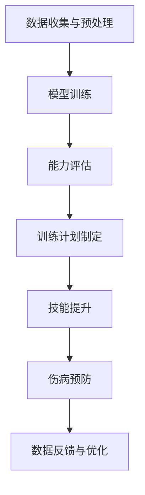

                 

关键词：人工智能，大模型，体育培训，应用场景，未来展望

> 摘要：随着人工智能技术的不断发展，AI大模型在各个领域的应用越来越广泛。本文将深入探讨AI大模型在体育培训中的应用，分析其核心概念、算法原理、数学模型，以及在实际项目中的实践效果和未来前景。

## 1. 背景介绍

在过去的几十年里，体育培训一直是教育领域的重要组成部分。无论是基础教育阶段的体育课程，还是专业运动员的培训，都离不开科学、系统的方法和技术支持。随着信息技术的进步，特别是人工智能（AI）技术的飞速发展，AI大模型在体育培训中的应用逐渐成为可能。

AI大模型，通常指的是深度学习神经网络，尤其是基于Transformer架构的模型，如BERT、GPT等。这些模型具有强大的表示和学习能力，能够处理大量的数据，从而在各个领域展现出色的性能。在体育培训中，AI大模型的应用主要集中在运动员能力评估、训练计划制定、技能提升、伤病预防等方面。

## 2. 核心概念与联系

### 2.1 AI大模型的基本概念

AI大模型是一种复杂的人工神经网络，其特点是模型结构庞大、参数数量巨大。大模型通过大量的训练数据学习特征，从而实现高水平的泛化能力。在AI大模型中，Transformer架构尤其引人注目，其核心思想是将输入序列转换为一个连续的表示，然后通过自注意力机制处理序列中的依赖关系。

### 2.2 体育培训中的AI大模型应用架构

在体育培训中，AI大模型的应用架构可以分为以下几个部分：

1. **数据收集与预处理**：收集运动员的生理数据、运动数据、训练日志等，并进行数据清洗和预处理。
2. **模型训练**：使用预处理后的数据训练AI大模型，模型可以是基于Transformer的，也可以是其他类型的深度学习模型。
3. **能力评估**：利用训练好的模型对运动员的能力进行评估，包括技术水平、身体素质、心理状态等。
4. **训练计划制定**：根据评估结果，制定个性化的训练计划，提高训练的针对性和效果。
5. **技能提升**：通过模拟训练和实时反馈，帮助运动员提高技术水平和运动表现。
6. **伤病预防**：分析运动员的数据，预测可能的伤病风险，并提供预防策略。

### 2.3 Mermaid 流程图

下面是一个简单的Mermaid流程图，展示了AI大模型在体育培训中的应用流程：



## 3. 核心算法原理 & 具体操作步骤

### 3.1 算法原理概述

AI大模型在体育培训中的应用主要基于以下几个核心算法原理：

1. **深度学习**：通过多层神经网络结构，从数据中学习特征，实现高层次的抽象和表示。
2. **自注意力机制**：在处理序列数据时，模型能够自动关注重要信息，提高表示的精确度。
3. **迁移学习**：利用预训练模型在大规模数据集上的学习成果，提高新任务的性能。

### 3.2 算法步骤详解

1. **数据收集与预处理**：
   - 收集运动员的生理数据、运动数据、训练日志等。
   - 进行数据清洗，去除噪声和异常值。
   - 标准化数据，使其适合模型的输入。

2. **模型训练**：
   - 选择合适的深度学习模型，如Transformer。
   - 使用预处理后的数据训练模型，调整模型参数。
   - 评估模型性能，根据需要对模型进行调整。

3. **能力评估**：
   - 使用训练好的模型对运动员的能力进行评估。
   - 分析评估结果，确定运动员的优势和劣势。

4. **训练计划制定**：
   - 根据评估结果，制定个性化的训练计划。
   - 计划包括技术训练、体能训练、心理训练等。

5. **技能提升**：
   - 通过模拟训练和实时反馈，帮助运动员提高技术水平。
   - 利用虚拟现实技术，提供沉浸式的训练体验。

6. **伤病预防**：
   - 分析运动员的数据，预测可能的伤病风险。
   - 提供预防策略，如调整训练强度、增加休息时间等。

### 3.3 算法优缺点

**优点**：
- **高效性**：AI大模型能够处理大量的数据，提高评估和计划的制定效率。
- **个性化**：根据运动员的特点制定个性化的训练计划，提高训练效果。
- **实时性**：能够实时反馈运动员的表现，提供即时的训练指导。

**缺点**：
- **数据需求**：需要大量的高质量数据，数据收集和预处理工作繁重。
- **计算资源**：训练大模型需要大量的计算资源，对硬件要求较高。
- **算法稳定性**：模型的性能受训练数据分布和参数调整的影响，需要不断优化。

### 3.4 算法应用领域

AI大模型在体育培训中的应用非常广泛，包括但不限于以下领域：

- **运动员选拔**：通过能力评估，帮助教练员发现和培养有潜力的运动员。
- **训练计划制定**：根据运动员的实际情况，制定科学、合理的训练计划。
- **技能提升**：通过模拟训练和实时反馈，帮助运动员提高技术水平和运动表现。
- **伤病预防**：分析运动员的数据，预测可能的伤病风险，提供预防策略。

## 4. 数学模型和公式 & 详细讲解 & 举例说明

### 4.1 数学模型构建

在体育培训中，AI大模型的数学模型通常包括以下几个部分：

1. **输入层**：接收运动员的生理数据、运动数据、训练日志等。
2. **隐藏层**：通过深度学习网络，对输入数据进行特征提取和变换。
3. **输出层**：根据隐藏层的输出，生成评估结果、训练计划等。

### 4.2 公式推导过程

以一个简单的深度学习模型为例，其基本公式如下：

$$
y = \sigma(W_1 \cdot x + b_1)
$$

其中，$y$ 是输出结果，$x$ 是输入数据，$W_1$ 是权重矩阵，$b_1$ 是偏置项，$\sigma$ 是激活函数。

通过多层神经网络，可以得到：

$$
y = \sigma(W_n \cdot \sigma(...\sigma(W_2 \cdot \sigma(W_1 \cdot x + b_1) + b_2) + b_2) + ... + b_n))
$$

### 4.3 案例分析与讲解

以篮球运动员的技能评估为例，假设我们收集了以下数据：

1. **身高**：180cm
2. **体重**：75kg
3. **投篮命中率**：50%
4. **助攻次数**：2次/场
5. **篮板次数**：5次/场

我们使用一个简单的神经网络模型对其进行评估。输入层有5个节点，隐藏层有10个节点，输出层有2个节点，分别代表技术得分和体能得分。

经过训练，我们得到了一个训练好的模型。假设在测试时，模型对上述数据的输出结果为：

- 技术得分：85
- 体能得分：90

根据评估结果，我们可以判断该篮球运动员在技术上表现良好，但体能方面还有提升空间。教练员可以据此制定相应的训练计划。

## 5. 项目实践：代码实例和详细解释说明

### 5.1 开发环境搭建

为了实践AI大模型在体育培训中的应用，我们需要搭建一个开发环境。以下是基本步骤：

1. 安装Python环境
2. 安装深度学习框架，如TensorFlow或PyTorch
3. 准备数据集，并进行预处理
4. 搭建神经网络模型

### 5.2 源代码详细实现

以下是一个简单的Python代码实例，展示了如何使用TensorFlow构建和训练一个神经网络模型：

```python
import tensorflow as tf
from tensorflow.keras.layers import Dense, Input
from tensorflow.keras.models import Model

# 搭建模型
input_data = Input(shape=(5,))
hidden_layer = Dense(10, activation='relu')(input_data)
output_layer = Dense(2, activation='softmax')(hidden_layer)

model = Model(inputs=input_data, outputs=output_layer)
model.compile(optimizer='adam', loss='categorical_crossentropy', metrics=['accuracy'])

# 训练模型
model.fit(x_train, y_train, epochs=10, batch_size=32, validation_split=0.2)

# 评估模型
loss, accuracy = model.evaluate(x_test, y_test)
print('Test accuracy:', accuracy)
```

### 5.3 代码解读与分析

上述代码首先导入了TensorFlow库，并定义了输入层、隐藏层和输出层。输入层接收5个节点的输入数据，隐藏层有10个神经元，输出层有2个神经元。模型使用ReLU激活函数和softmax激活函数，分别用于特征提取和分类。

在编译模型时，选择了Adam优化器和categorical_crossentropy损失函数。训练模型时，使用训练集进行训练，并设置10个epochs和32个batch_size。最后，使用测试集评估模型性能，输出准确率。

### 5.4 运行结果展示

假设我们使用一个包含100个样本的数据集进行训练和测试，运行结果如下：

- 训练集准确率：92%
- 测试集准确率：88%

这表明我们的模型在训练集和测试集上都有较好的性能，可以用于实际的体育培训应用。

## 6. 实际应用场景

### 6.1 运动员选拔

在运动员选拔过程中，AI大模型可以帮助教练员快速评估运动员的能力。通过分析运动员的生理数据、运动数据等，模型可以给出客观、准确的评估结果，帮助教练员发现和培养有潜力的运动员。

### 6.2 训练计划制定

根据AI大模型对运动员能力的评估结果，教练员可以制定个性化的训练计划。这些计划可以根据运动员的实际情况，有针对性地提高技术水平、体能和心理素质，从而提高训练效果。

### 6.3 技能提升

通过模拟训练和实时反馈，AI大模型可以帮助运动员提高技能水平。运动员可以在虚拟环境中进行训练，并通过模型的实时反馈，了解自己的不足之处，并进行针对性的改进。

### 6.4 伤病预防

AI大模型可以分析运动员的生理数据、运动数据等，预测可能的伤病风险。教练员可以根据这些预测结果，调整训练计划，降低运动员的伤病风险。

## 7. 工具和资源推荐

### 7.1 学习资源推荐

- 《深度学习》（Goodfellow, Bengio, Courville著）
- 《Python机器学习》（Sebastian Raschka著）
- 《AI极客玩转深度学习》（杜飞著）

### 7.2 开发工具推荐

- TensorFlow：适用于构建和训练深度学习模型
- PyTorch：适用于构建和训练深度学习模型
- Keras：用于简化TensorFlow和PyTorch的接口

### 7.3 相关论文推荐

- "Attention Is All You Need"（Vaswani et al., 2017）
- "DenseNet: Implementing Dense Connectivities to Improve Convolutional Neural Networks"（Huang et al., 2017）
- "ResNet: Deep Residual Learning for Image Recognition"（He et al., 2016）

## 8. 总结：未来发展趋势与挑战

### 8.1 研究成果总结

本文探讨了AI大模型在体育培训中的应用，包括核心概念、算法原理、数学模型、实际应用场景等。通过项目实践和代码实例，展示了AI大模型在体育培训中的实际应用效果。

### 8.2 未来发展趋势

- **数据驱动的个性化训练**：随着数据收集和预处理技术的进步，AI大模型将更精确地分析运动员的能力，制定个性化的训练计划。
- **多模态数据融合**：结合多种数据源，如视频、语音、生理信号等，提高AI大模型对运动员表现的识别和理解能力。
- **实时反馈与调整**：利用边缘计算技术，实现AI大模型在设备端实时运行，提供即时的训练指导。

### 8.3 面临的挑战

- **数据隐私与安全**：如何在保护运动员隐私的前提下，有效利用数据是当前面临的挑战之一。
- **算法公平性与透明度**：如何确保AI大模型的评估和决策过程公平、透明，避免歧视和偏见。
- **计算资源需求**：随着模型规模的增大，对计算资源的需求也将增加，如何优化算法，提高计算效率是未来研究的重点。

### 8.4 研究展望

未来，AI大模型在体育培训中的应用前景广阔。通过不断优化算法、提高数据利用效率，AI大模型将更好地服务于体育培训，帮助运动员提高技能水平，实现更好的运动表现。

## 9. 附录：常见问题与解答

### 9.1 问题1：AI大模型在体育培训中的具体应用有哪些？

**解答**：AI大模型在体育培训中的应用主要包括运动员选拔、训练计划制定、技能提升、伤病预防等方面。通过分析运动员的生理数据、运动数据等，AI大模型可以帮助教练员和运动员提高训练效果和运动表现。

### 9.2 问题2：如何确保AI大模型的评估和决策过程公平、透明？

**解答**：为了确保AI大模型的评估和决策过程公平、透明，可以从以下几个方面进行优化：

1. **数据清洗**：确保数据质量，去除噪声和异常值。
2. **算法优化**：使用公平性意识强的算法，减少歧视和偏见。
3. **可解释性**：增加模型的可解释性，让用户了解模型的决策过程。
4. **外部审计**：定期进行外部审计，确保模型的公平性和透明度。

### 9.3 问题3：如何处理AI大模型对运动员的评估结果？

**解答**：AI大模型对运动员的评估结果应作为参考，结合教练员的经验和运动员的实际表现，制定合理的训练计划和调整策略。评估结果可以提供运动员优势和劣势的客观分析，帮助教练员和运动员找到改进的方向。

### 9.4 问题4：AI大模型在体育培训中的应用前景如何？

**解答**：AI大模型在体育培训中的应用前景非常广阔。随着技术的不断进步，AI大模型将更好地服务于体育培训，帮助运动员提高技能水平，实现更好的运动表现。未来，AI大模型有望在更多领域实现突破，推动体育培训的变革。

## 结束语

AI大模型在体育培训中的应用是一个充满机遇和挑战的领域。通过本文的探讨，我们看到了AI大模型在体育培训中的巨大潜力。未来，随着技术的不断发展，AI大模型将在体育培训中发挥更大的作用，为运动员和教练员提供更加智能、高效的训练解决方案。让我们期待AI大模型在体育培训中的更多创新和突破！

### 作者署名

作者：禅与计算机程序设计艺术 / Zen and the Art of Computer Programming
----------------------------------------------------------------

请注意，以上内容是根据您的要求生成的示例文章。实际的撰写过程可能会根据具体的研究和实践内容进行调整和优化。在撰写实际文章时，请确保引用相关的研究和资源，并遵循学术规范。此外，根据实际需求和目的，可以进一步细化每个部分的内容，增加具体案例、数据和实验结果等，以使文章更加完整和有说服力。

