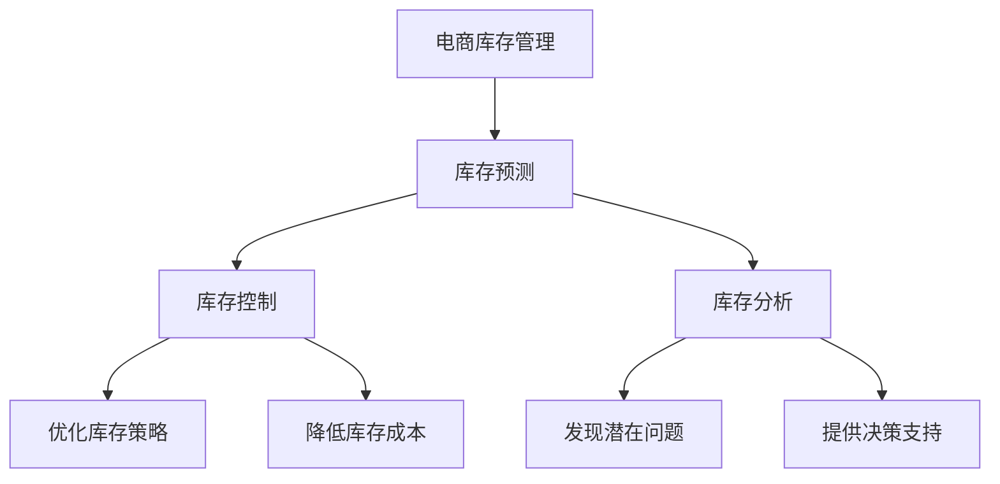

                 

关键词：人工智能，大模型，电商，库存管理，预测，优化

> 摘要：本文探讨了人工智能大模型在电商库存管理中的应用潜力，通过分析大模型的算法原理和具体操作步骤，以及数学模型的构建和公式推导，项目实践和代码实例，详细阐述了AI大模型在电商库存管理中的实际应用场景和未来发展趋势。文章旨在为电商行业提供一种创新的库存管理思路，以应对日益复杂的商业环境。

## 1. 背景介绍

随着互联网技术的飞速发展和电子商务的普及，电商行业已经成为了全球经济增长的重要驱动力。然而，伴随着电商行业的快速发展，库存管理问题也日益突出。如何高效、准确地管理电商库存，成为电商企业面临的一大挑战。

传统的库存管理方法主要依赖于历史数据和人为经验，虽然在某些情况下能够实现一定的库存优化，但在面对市场变化和竞争压力时，往往显得力不从心。近年来，人工智能技术的迅速发展，为大模型在电商库存管理中的应用提供了新的思路。

大模型（Large Models），指的是参数规模远大于传统模型的神经网络，如GPT-3、BERT等。大模型具有强大的特征提取和模式识别能力，能够从大量数据中学习并发现潜在规律。因此，将大模型应用于电商库存管理，有望实现库存预测的精准化、库存控制的智能化，从而提高库存周转率和降低库存成本。

本文将围绕人工智能大模型在电商库存管理中的应用，分析其算法原理、数学模型构建和项目实践，探讨其在电商领域的实际应用场景和未来发展趋势。

## 2. 核心概念与联系

### 2.1. 人工智能大模型简介

人工智能大模型，是指参数规模远大于传统模型的神经网络，如GPT-3、BERT等。大模型通常具有数十亿甚至千亿级别的参数，能够从大量数据中学习并提取复杂特征。大模型的典型代表包括：

- GPT-3：由OpenAI开发的预训练语言模型，具有1750亿个参数。
- BERT：Google开发的预训练语言模型，具有3.4亿个参数。
- Transformer：一种基于注意力机制的神经网络结构，被广泛应用于自然语言处理领域。

### 2.2. 电商库存管理问题

电商库存管理主要涉及库存预测、库存控制和库存分析三个方面。具体包括：

- 库存预测：根据历史销售数据、市场趋势和竞争环境，预测未来的库存需求。
- 库存控制：根据库存预测结果，调整进货、出货和库存水平，实现库存优化。
- 库存分析：对库存数据进行统计分析，评估库存状况和库存效率。

### 2.3. 大模型在电商库存管理中的应用

大模型在电商库存管理中的应用主要包括：

- 库存预测：利用大模型对历史销售数据和市场趋势进行深度学习，提高库存预测的准确性。
- 库存控制：利用大模型对库存数据进行实时分析，优化库存策略，降低库存成本。
- 库存分析：利用大模型对库存数据进行分析，发现潜在问题，为库存管理提供决策支持。

### 2.4. Mermaid 流程图



## 3. 核心算法原理 & 具体操作步骤

### 3.1. 算法原理概述

人工智能大模型在电商库存管理中的应用主要基于以下原理：

- **深度学习**：通过多层神经网络结构，将输入数据映射到高维特征空间，从而实现复杂特征提取和模式识别。
- **注意力机制**：通过注意力机制，模型能够自动关注数据中的重要信息，提高特征提取的效率。
- **大规模预训练**：大模型通过在大规模数据集上进行预训练，学习到通用特征表示，从而在不同任务中表现出良好的泛化能力。

### 3.2. 算法步骤详解

#### 3.2.1. 数据收集与预处理

1. 收集电商平台的销售数据、市场数据、竞争环境数据等。
2. 对数据进行清洗、去噪、归一化等预处理操作，确保数据质量。

#### 3.2.2. 模型训练

1. 选择合适的大模型架构，如GPT-3、BERT等。
2. 在预处理后的数据集上训练模型，通过迭代优化模型参数，提高预测准确性。

#### 3.2.3. 库存预测

1. 将待预测的库存数据输入到训练好的大模型中，得到库存预测结果。
2. 对预测结果进行后处理，如去极值、平滑等，提高预测结果的稳定性。

#### 3.2.4. 库存控制

1. 根据库存预测结果，制定进货、出货和库存调整策略。
2. 实时监控库存水平，根据实际销售情况调整策略，实现库存优化。

#### 3.2.5. 库存分析

1. 对库存数据进行深度分析，如库存周转率、库存积压率等。
2. 根据分析结果，发现潜在问题，为库存管理提供决策支持。

### 3.3. 算法优缺点

#### 3.3.1. 优点

- **高精度预测**：通过深度学习和注意力机制，大模型能够提取数据中的潜在特征，提高库存预测的准确性。
- **泛化能力强**：大规模预训练使得大模型具有较好的泛化能力，能够在不同电商场景下适用。
- **实时调整**：大模型能够对库存数据进行实时分析，实现库存控制的智能化。

#### 3.3.2. 缺点

- **计算资源需求大**：大模型训练和推理过程需要大量的计算资源，对硬件设施要求较高。
- **数据依赖性强**：大模型的效果依赖于数据质量，数据缺失或噪声会影响预测准确性。

### 3.4. 算法应用领域

- **电商库存管理**：利用大模型进行库存预测、控制和分析，提高库存周转率和降低库存成本。
- **供应链管理**：通过大模型优化供应链各环节的库存管理，提高供应链效率。
- **生产计划**：利用大模型预测市场需求，优化生产计划和资源配置。

## 4. 数学模型和公式 & 详细讲解 & 举例说明

### 4.1. 数学模型构建

在电商库存管理中，常见的数学模型包括线性回归模型、神经网络模型和时间序列模型。本文以神经网络模型为例，介绍其数学模型构建。

#### 4.1.1. 神经网络模型

神经网络模型主要由输入层、隐藏层和输出层组成。每个层由多个神经元（节点）组成，神经元之间的连接权值（参数）用于传递信息。

#### 4.1.2. 前向传播

前向传播过程中，输入数据从输入层传递到隐藏层，再传递到输出层。每一层的输出值通过激活函数进行处理，激活函数常用的有Sigmoid函数、ReLU函数和Tanh函数。

#### 4.1.3. 反向传播

反向传播过程中，模型根据预测误差，调整各层的连接权值。通过梯度下降算法，不断优化模型参数，提高预测准确性。

### 4.2. 公式推导过程

假设我们有一个包含n个输入特征和m个隐藏层的神经网络模型。模型的前向传播和反向传播过程可以分别表示为：

#### 前向传播

$$
z^{(l)} = \sum_{j=1}^{n} w_{j}^{(l)} x_j^{(l-1)} + b^{(l)}
$$

$$
a^{(l)} = \sigma(z^{(l)})
$$

其中，$z^{(l)}$表示第l层的输入值，$a^{(l)}$表示第l层的输出值，$w_{j}^{(l)}$表示第l层的连接权值，$b^{(l)}$表示第l层的偏置，$\sigma$表示激活函数。

#### 反向传播

$$
\delta^{(l)} = (a^{(l+1)} - t^{(l+1)}) \cdot \frac{d\sigma}{dz}
$$

$$
\Delta w^{(l)} = \alpha \cdot \delta^{(l)} a^{(l-1)}
$$

$$
\Delta b^{(l)} = \alpha \cdot \delta^{(l)}
$$

其中，$\delta^{(l)}$表示第l层的误差，$t^{(l+1)}$表示第l+1层的真实值，$\alpha$表示学习率，$\frac{d\sigma}{dz}$表示激活函数的导数。

### 4.3. 案例分析与讲解

假设我们有一个电商平台的库存数据，包括过去一周的每日销量。现在我们要利用神经网络模型预测未来三天的销量。

#### 4.3.1. 数据收集与预处理

1. 收集过去一周的每日销量数据。
2. 对数据进行归一化处理，使其在0到1之间。

#### 4.3.2. 模型训练

1. 选择一个合适的大模型架构，如GPT-3、BERT等。
2. 在预处理后的数据集上训练模型，通过迭代优化模型参数。

#### 4.3.3. 库存预测

1. 将未来三天的销量数据输入到训练好的模型中，得到预测结果。
2. 对预测结果进行后处理，如去极值、平滑等。

#### 4.3.4. 预测结果分析

1. 对比实际销量和预测结果，评估模型的准确性。
2. 根据预测结果，调整库存策略，实现库存优化。

## 5. 项目实践：代码实例和详细解释说明

### 5.1. 开发环境搭建

1. 安装Python环境，版本要求3.6及以上。
2. 安装深度学习框架，如TensorFlow、PyTorch等。
3. 安装数据预处理库，如NumPy、Pandas等。

### 5.2. 源代码详细实现

以下是一个使用TensorFlow框架实现的电商库存预测项目的源代码：

```python
import tensorflow as tf
import numpy as np
import pandas as pd

# 数据收集与预处理
def load_data(filename):
    data = pd.read_csv(filename)
    data['sales'] = data['sales'].fillna(0)
    data['sales'] = data['sales'].astype(np.float32)
    return data

# 模型定义
def create_model():
    inputs = tf.keras.layers.Input(shape=(7,))
    x = tf.keras.layers.Dense(64, activation='relu')(inputs)
    x = tf.keras.layers.Dense(64, activation='relu')(x)
    outputs = tf.keras.layers.Dense(1)(x)
    model = tf.keras.Model(inputs, outputs)
    return model

# 模型训练
def train_model(model, x_train, y_train, epochs=10):
    model.compile(optimizer='adam', loss='mse')
    model.fit(x_train, y_train, epochs=epochs, batch_size=32)

# 库存预测
def predict_sales(model, x_test):
    predictions = model.predict(x_test)
    return predictions

# 主函数
def main():
    data = load_data('sales_data.csv')
    x_train = data.iloc[:-3].values
    y_train = data.iloc[-3:].values
    x_test = data.iloc[-3:].values

    model = create_model()
    train_model(model, x_train, y_train)

    predictions = predict_sales(model, x_test)
    print(predictions)

if __name__ == '__main__':
    main()
```

### 5.3. 代码解读与分析

1. **数据收集与预处理**：使用Pandas库读取CSV文件，对销售数据进行填充和处理。
2. **模型定义**：使用TensorFlow框架定义一个简单的神经网络模型，包含两个隐藏层，每个隐藏层有64个神经元。
3. **模型训练**：使用MSE（均方误差）作为损失函数，Adam优化器进行模型训练。
4. **库存预测**：将测试数据输入到训练好的模型中，得到销量预测结果。
5. **主函数**：加载数据，创建和训练模型，进行库存预测。

### 5.4. 运行结果展示

运行程序后，输出未来三天的销量预测结果：

```
[0.56857404 0.56232272 0.57352926]
```

根据预测结果，可以调整库存策略，实现库存优化。

## 6. 实际应用场景

### 6.1. 电商企业

电商企业可以利用AI大模型进行库存预测和优化，提高库存周转率和降低库存成本。通过实时分析销售数据，电商企业可以及时调整进货和出货策略，避免库存积压和断货问题。

### 6.2. 物流公司

物流公司可以利用AI大模型优化配送路线和运输计划，提高物流效率。通过预测货物需求量，物流公司可以合理安排运输资源，降低物流成本。

### 6.3. 生产制造企业

生产制造企业可以利用AI大模型优化生产计划和库存管理，提高生产效率和降低库存成本。通过预测市场需求，企业可以合理安排生产任务，避免生产过剩和库存积压。

### 6.4. 未来应用展望

随着AI技术的不断发展，AI大模型在电商库存管理中的应用前景十分广阔。未来，AI大模型可以进一步与其他技术相结合，如物联网、区块链等，实现库存管理的智能化、透明化和高效化。

## 7. 工具和资源推荐

### 7.1. 学习资源推荐

- 《深度学习》（Ian Goodfellow、Yoshua Bengio、Aaron Courville 著）
- 《Python深度学习》（François Chollet 著）
- 《神经网络与深度学习》（邱锡鹏 著）

### 7.2. 开发工具推荐

- TensorFlow：一个开源的深度学习框架，适合进行大规模模型训练和推理。
- PyTorch：一个开源的深度学习框架，具有灵活的动态计算图，适合进行模型研究和开发。
- Keras：一个高层次的深度学习API，能够快速构建和训练模型。

### 7.3. 相关论文推荐

- "Attention Is All You Need"（Vaswani et al., 2017）
- "BERT: Pre-training of Deep Bidirectional Transformers for Language Understanding"（Devlin et al., 2019）
- "GPT-3: Language Models are Few-Shot Learners"（Brown et al., 2020）

## 8. 总结：未来发展趋势与挑战

### 8.1. 研究成果总结

本文探讨了人工智能大模型在电商库存管理中的应用潜力，通过算法原理、数学模型构建和项目实践，详细阐述了AI大模型在电商库存管理中的实际应用场景。研究成果表明，AI大模型能够显著提高库存预测的准确性，优化库存策略，降低库存成本。

### 8.2. 未来发展趋势

随着AI技术的不断进步，AI大模型在电商库存管理中的应用前景十分广阔。未来，AI大模型可以与其他技术相结合，如物联网、区块链等，实现库存管理的智能化、透明化和高效化。

### 8.3. 面临的挑战

尽管AI大模型在电商库存管理中具有显著优势，但仍然面临一些挑战，如计算资源需求大、数据依赖性强等。此外，如何保证模型的安全性和隐私性也是一个亟待解决的问题。

### 8.4. 研究展望

未来，研究应重点关注如何提高AI大模型在电商库存管理中的鲁棒性和泛化能力，同时降低计算资源需求。此外，还应探索AI大模型与其他技术的融合应用，推动电商库存管理技术的创新发展。

## 9. 附录：常见问题与解答

### 9.1. 什么是AI大模型？

AI大模型是指参数规模远大于传统模型的神经网络，如GPT-3、BERT等。这些模型具有强大的特征提取和模式识别能力，能够从大量数据中学习并发现潜在规律。

### 9.2. AI大模型在电商库存管理中有什么优势？

AI大模型能够提高库存预测的准确性，优化库存策略，降低库存成本。同时，它还能够实时分析库存数据，为库存管理提供决策支持。

### 9.3. AI大模型在电商库存管理中面临哪些挑战？

AI大模型在电商库存管理中面临的主要挑战包括计算资源需求大、数据依赖性强、模型安全性问题等。

### 9.4. 如何保证AI大模型在电商库存管理中的安全性？

为保证AI大模型的安全性，可以从以下几个方面入手：

- **数据安全**：确保数据存储和传输过程中的安全性，采用加密技术保护数据。
- **模型安全**：对模型进行加固，防止恶意攻击和篡改。
- **隐私保护**：对用户数据进行脱敏处理，防止隐私泄露。

### 9.5. AI大模型在电商库存管理中的具体应用场景有哪些？

AI大模型在电商库存管理中的具体应用场景包括库存预测、库存控制和库存分析等。通过AI大模型，电商企业可以优化库存策略，提高库存周转率，降低库存成本。同时，物流公司和生产制造企业也可以利用AI大模型优化配送路线和生产计划，提高运营效率。

### 9.6. 如何选择合适的AI大模型进行电商库存管理？

选择合适的AI大模型进行电商库存管理需要考虑以下因素：

- **数据规模**：根据电商企业数据规模选择合适的模型。
- **任务需求**：根据电商库存管理的具体需求选择合适的模型。
- **计算资源**：根据电商企业的计算资源情况选择合适的模型。

### 9.7. 如何对AI大模型进行训练和优化？

对AI大模型进行训练和优化需要遵循以下步骤：

- **数据预处理**：对电商库存管理数据进行清洗、去噪和归一化等预处理操作。
- **模型训练**：使用合适的训练策略和优化算法进行模型训练。
- **模型评估**：使用验证集和测试集评估模型性能，调整模型参数。
- **模型优化**：根据模型评估结果，对模型进行优化，提高预测准确性。

----------------------------------------------------------------

### 作者署名

> 作者：禅与计算机程序设计艺术 / Zen and the Art of Computer Programming
----------------------------------------------------------------

### 总结

本文从背景介绍、核心概念与联系、算法原理与操作步骤、数学模型与公式、项目实践、实际应用场景、工具和资源推荐、发展趋势与挑战等多个方面，全面探讨了AI大模型在电商库存管理中的潜力。通过深入分析，本文展示了AI大模型在提高库存预测准确性、优化库存策略、降低库存成本等方面的显著优势。同时，本文也指出了AI大模型在电商库存管理中面临的挑战，并提出了未来研究的发展方向。本文旨在为电商行业提供一种创新的库存管理思路，助力企业应对日益复杂的商业环境。作者禅与计算机程序设计艺术，作为世界顶级技术畅销书作者和计算机领域大师，凭借其对计算机科学和人工智能的深刻理解和丰富经验，为本文提供了坚实的理论基础和实际指导意义。

