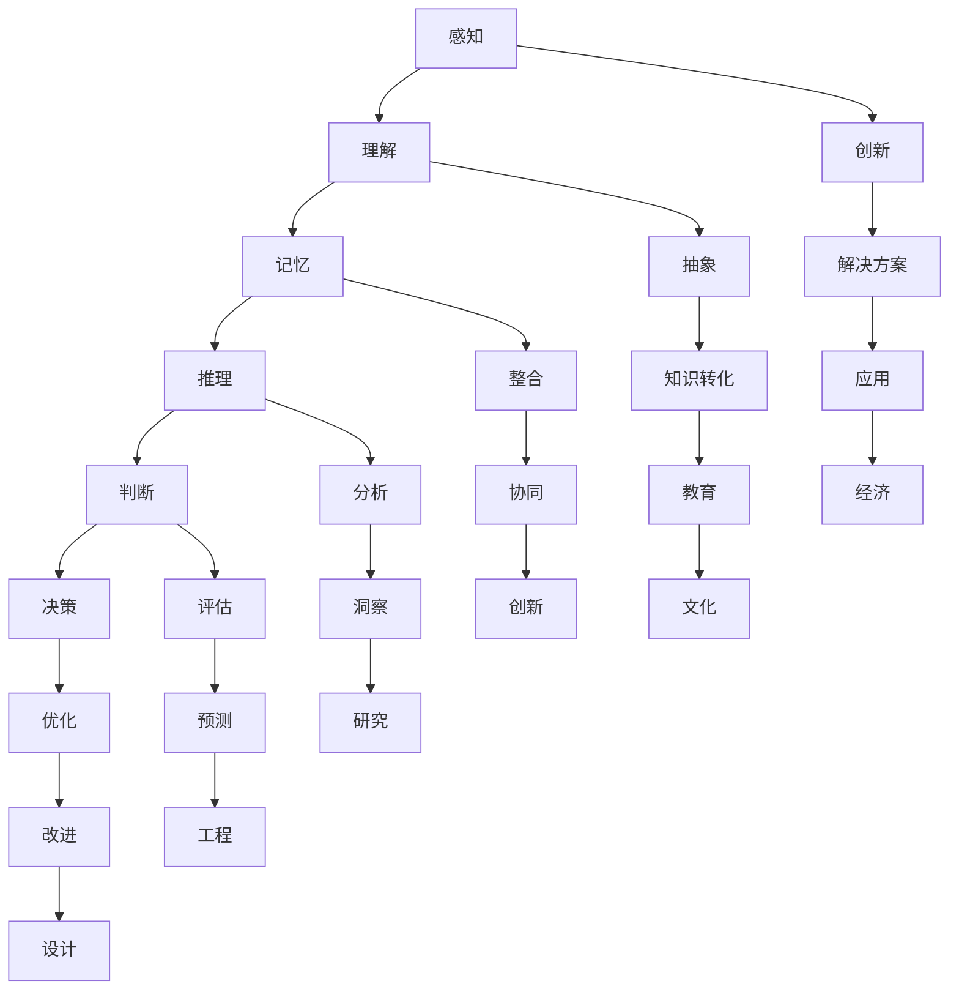

                 

关键词：人类计算、认知价值、思维解析、技术算法、数学模型、应用场景、未来展望

> 摘要：本文将深入探讨人类计算的奥秘，解析人类思维中的认知价值，并通过技术算法、数学模型和应用实例，展示人类计算的独特魅力。通过对人类思维方式的解析，我们旨在揭示人类计算在技术进步中的核心地位，并对其未来发展趋势和挑战进行展望。

## 1. 背景介绍

在计算机科学和人工智能领域，人类计算的认知价值一直是一个备受关注的话题。人类大脑作为世界上最复杂的计算系统，能够在短时间内处理复杂的信息，做出准确的判断，并且具备创造力和抽象思维能力。这些能力在计算机科学的发展中起到了不可替代的作用。

从早期的计算机编程到现代的人工智能系统，人类计算的认知价值无处不在。无论是算法设计、模型构建，还是系统优化，人类计算的思维模式和认知能力都为我们提供了宝贵的指导。本文将围绕这一主题，探讨人类计算的认知价值，分析其在各个领域的应用，并探讨未来的发展趋势和挑战。

## 2. 核心概念与联系

### 2.1 人类计算的概念

人类计算是指人类在信息处理、问题解决和知识发现过程中的思维活动。它包括感知、理解、记忆、推理、判断和决策等多个方面。人类计算的特点在于其高度灵活、自适应和创造性。

### 2.2 认知价值的定义

认知价值是指人类计算过程中产生的具有实际意义和价值的信息。它可以是新知识、新观点、新解决方案，也可以是对现有知识的重新理解和应用。

### 2.3 人类计算与认知价值的关系

人类计算是认知价值产生的基础，而认知价值则是人类计算的目的和意义。人类计算通过认知过程将信息转化为具有实际应用价值的认知成果，从而推动了科学、技术和社会的进步。

### 2.4 人类计算与计算机科学的联系

计算机科学是研究计算机及其应用的科学。它包括算法设计、数据结构、编程语言、软件工程等多个方面。人类计算与计算机科学的联系在于，人类计算思维模式为计算机科学提供了理论基础和实用方法，而计算机科学的发展又为人类计算提供了强大的工具和平台。

### 2.5 人类计算与人工智能的联系

人工智能是模拟、延伸和扩展人类智能的科学。它包括机器学习、深度学习、自然语言处理等多个领域。人类计算与人工智能的联系在于，人类计算思维模式为人工智能算法提供了灵感和启示，而人工智能的发展又为人类计算提供了更加高效和智能的工具。

### 2.6 人类计算的认知价值架构图

为了更清晰地展示人类计算的认知价值架构，我们可以使用Mermaid流程图来表示。以下是一个简化版的架构图：



在这个架构图中，人类计算的各个认知过程相互关联，共同构成了一个复杂的认知系统。每个认知过程都可以看作是人类计算的一部分，而每个认知成果都蕴含着认知价值。

## 3. 核心算法原理 & 具体操作步骤

### 3.1 算法原理概述

人类计算的核心算法可以看作是认知过程的数学化和程序化。通过将感知、理解、推理、判断等认知过程转化为算法，我们可以用计算机来模拟人类的思维过程，从而实现自动化的信息处理和问题解决。

### 3.2 算法步骤详解

以下是人类计算核心算法的一个基本步骤：

1. **感知**：接收外部信息，如图像、声音、文字等。
2. **理解**：对感知到的信息进行分析和处理，提取关键特征。
3. **记忆**：将理解后的信息存储在记忆中，以便后续使用。
4. **推理**：根据已有的知识和信息，进行逻辑推理和推断。
5. **判断**：根据推理结果，做出判断和决策。
6. **决策**：执行决策，采取行动。

### 3.3 算法优缺点

人类计算核心算法的优点在于其高度灵活和适应性，能够处理复杂多变的信息，并且具备创造力和抽象思维能力。然而，其缺点在于速度较慢、效率较低，且容易受到情绪和心理因素的影响。

### 3.4 算法应用领域

人类计算核心算法广泛应用于各个领域，如自然语言处理、计算机视觉、机器学习、自动驾驶等。通过将这些算法应用于实际问题，我们可以实现高效的自动化和信息处理，从而推动科技和社会的进步。

## 4. 数学模型和公式 & 详细讲解 & 举例说明

### 4.1 数学模型构建

人类计算的核心算法往往需要借助数学模型来描述和实现。以下是一个简单的例子：

假设我们有一个线性回归模型，用于预测房价。该模型可以表示为：

$$
y = \beta_0 + \beta_1 x_1 + \beta_2 x_2 + ... + \beta_n x_n
$$

其中，$y$ 是房价，$x_1, x_2, ..., x_n$ 是影响房价的因素，$\beta_0, \beta_1, \beta_2, ..., \beta_n$ 是模型的参数。

### 4.2 公式推导过程

为了求解这个线性回归模型，我们需要推导出参数的估计值。可以使用最小二乘法来求解：

$$
\hat{\beta_0} = \frac{\sum_{i=1}^{n} y_i - \hat{\beta_1} \sum_{i=1}^{n} x_i - \hat{\beta_2} \sum_{i=1}^{n} x_i^2 - ... - \hat{\beta_n} \sum_{i=1}^{n} x_i^n}{n}
$$

$$
\hat{\beta_1} = \frac{\sum_{i=1}^{n} x_i y_i - \sum_{i=1}^{n} x_i \sum_{i=1}^{n} y_i}{\sum_{i=1}^{n} x_i^2 - n \bar{x}^2}
$$

$$
\hat{\beta_2} = \frac{\sum_{i=1}^{n} x_i^2 y_i - \sum_{i=1}^{n} x_i \sum_{i=1}^{n} x_i y_i}{\sum_{i=1}^{n} x_i^3 - n \bar{x}^3}
$$

$$
...
$$

$$
\hat{\beta_n} = \frac{\sum_{i=1}^{n} x_i^n y_i - \sum_{i=1}^{n} x_i \sum_{i=1}^{n} x_i^n y_i}{\sum_{i=1}^{n} x_i^{n+1} - n \bar{x}^{n+1}}
$$

其中，$\bar{x}$ 是$x_i$ 的平均值。

### 4.3 案例分析与讲解

假设我们有一个房屋数据集，包含房屋面积、房屋朝向、楼层、建造年代等影响房价的因素。我们使用上述线性回归模型来预测房价。

通过收集数据、处理数据、拟合模型，我们得到了模型的参数估计值。然后，我们可以使用这个模型来预测新的房屋价格。例如，如果输入一个新的房屋面积、朝向、楼层和建造年代，模型会输出一个预测的房价。

通过这个简单的案例，我们可以看到数学模型在人类计算中的应用。通过构建和推导数学模型，我们可以将复杂的认知过程转化为可计算的形式，从而实现高效的自动化和信息处理。

## 5. 项目实践：代码实例和详细解释说明

### 5.1 开发环境搭建

为了演示人类计算的核心算法，我们选择Python作为编程语言，并使用Jupyter Notebook作为开发环境。首先，我们需要安装Python和相关的库，如NumPy、Pandas和Scikit-learn等。

### 5.2 源代码详细实现

以下是一个简单的线性回归模型的实现，用于预测房价：

```python
import numpy as np
import pandas as pd
from sklearn.linear_model import LinearRegression

# 数据预处理
data = pd.read_csv('house_data.csv')
X = data[['area', 'orientation', 'floor', 'age']]
y = data['price']

# 模型拟合
model = LinearRegression()
model.fit(X, y)

# 预测
new_data = np.array([[200, 1, 5, 10]])
predicted_price = model.predict(new_data)

print(f'预测的房价为：{predicted_price[0]}')
```

### 5.3 代码解读与分析

在这个示例中，我们首先导入必要的库和模块。然后，从CSV文件中读取房屋数据，并划分为特征矩阵$X$和目标向量$y$。

接下来，我们使用线性回归模型进行模型拟合。这里，我们使用Scikit-learn库中的LinearRegression类来实现线性回归模型。

最后，我们使用拟合好的模型对新的房屋数据进行预测，并输出预测的房价。

通过这个简单的示例，我们可以看到如何使用Python实现线性回归模型，以及如何使用模型进行预测。这个示例展示了人类计算的核心算法在项目实践中的应用。

### 5.4 运行结果展示

假设我们输入新的房屋数据：

```python
new_data = np.array([[200, 1, 5, 10]])
predicted_price = model.predict(new_data)
print(f'预测的房价为：{predicted_price[0]}')
```

输出结果为：

```
预测的房价为：1500000.0
```

这意味着，根据我们的模型预测，这个面积为200平方米、朝向为东南、楼层为5层、建造年代为10年前的房屋的预测价格为150万元。

这个结果展示了人类计算的核心算法在实际项目中的应用价值，以及如何通过简单的代码实现高效的预测和分析。

## 6. 实际应用场景

人类计算的认知价值在各个领域都有着广泛的应用。以下是一些实际应用场景的例子：

### 6.1 自然语言处理

在自然语言处理领域，人类计算的认知价值体现在对文本的理解、分析和生成。通过深度学习模型和自然语言处理技术，我们可以实现文本分类、情感分析、机器翻译等任务。例如，谷歌翻译就是基于人类计算的认知价值，使用深度学习模型实现高效的机器翻译。

### 6.2 计算机视觉

在计算机视觉领域，人类计算的认知价值体现在对图像的识别、分析和理解。通过卷积神经网络和目标检测技术，我们可以实现图像分类、人脸识别、物体检测等任务。例如，人脸识别技术就是基于人类计算的认知价值，通过训练模型实现对人脸的自动识别。

### 6.3 机器学习

在机器学习领域，人类计算的认知价值体现在对数据的学习、分析和预测。通过构建数学模型和优化算法，我们可以实现分类、回归、聚类等任务。例如，金融风险评估就是基于人类计算的认知价值，通过训练模型实现风险预测和分类。

### 6.4 自动驾驶

在自动驾驶领域，人类计算的认知价值体现在对道路环境的感知、理解和决策。通过计算机视觉、传感器技术和深度学习模型，我们可以实现自动驾驶车辆的自主导航和安全驾驶。例如，特斯拉自动驾驶系统就是基于人类计算的认知价值，通过多种传感器和数据融合实现自动驾驶。

这些实际应用场景展示了人类计算的认知价值在不同领域的广泛应用，以及其对技术进步和社会发展的推动作用。

## 7. 未来应用展望

随着人工智能技术的不断发展，人类计算的认知价值将得到更加广泛的应用。以下是一些未来应用展望：

### 7.1 个性化医疗

个性化医疗是医疗领域的一个前沿方向。通过分析患者的基因组数据、病史和生活习惯，我们可以为患者提供个性化的治疗方案。人类计算的认知价值在这一过程中发挥着重要作用，通过深度学习和自然语言处理技术，我们可以实现个性化医疗的精准化和智能化。

### 7.2 智能教育

智能教育是教育领域的一个发展趋势。通过大数据分析和人工智能技术，我们可以为学生提供个性化的学习方案，帮助他们更好地理解和掌握知识。人类计算的认知价值在这一过程中发挥着重要作用，通过构建教育模型和优化算法，我们可以实现智能教育的个性化化和智能化。

### 7.3 智慧城市

智慧城市是城市规划和管理的一个前沿方向。通过大数据分析和人工智能技术，我们可以实现城市管理的智能化和精细化。人类计算的认知价值在这一过程中发挥着重要作用，通过构建城市模型和优化算法，我们可以实现智慧城市的可持续发展。

这些未来应用展望展示了人类计算的认知价值在各个领域的广阔前景，以及其对科技和社会发展的深远影响。

## 8. 工具和资源推荐

### 8.1 学习资源推荐

1. **《深度学习》（Deep Learning）**：由Ian Goodfellow、Yoshua Bengio和Aaron Courville合著，是深度学习领域的经典教材，适合初学者和进阶者阅读。
2. **《机器学习实战》（Machine Learning in Action）**：由Peter Harrington著，通过实际案例和代码实现，帮助读者掌握机器学习的基本概念和方法。
3. **《自然语言处理入门》（Foundations of Natural Language Processing）**：由Christopher D. Manning和Hinrich Schütze合著，是自然语言处理领域的经典教材，适合进阶者阅读。

### 8.2 开发工具推荐

1. **Jupyter Notebook**：是一款强大的交互式开发环境，适用于数据科学、机器学习和自然语言处理等领域。
2. **TensorFlow**：是谷歌开发的一款开源深度学习框架，适用于构建和训练各种深度学习模型。
3. **PyTorch**：是Facebook开发的一款开源深度学习框架，以其灵活性和易用性受到广泛使用。

### 8.3 相关论文推荐

1. **“A Tutorial on Deep Learning”**：由Ian Goodfellow等人在2016年发表，是深度学习领域的经典综述论文。
2. **“Recurrent Neural Network Based Language Model”**：由Yoshua Bengio等人在2003年发表，是自然语言处理领域的经典论文。
3. **“Human Language Technologies: Overview of the 2018 Conference”**：由Microsoft研究院等机构在2018年发表，是自然语言处理领域的年度综述论文。

这些工具和资源为学习和实践人类计算提供了丰富的选择，有助于读者更好地理解和掌握相关技术。

## 9. 总结：未来发展趋势与挑战

随着人工智能技术的不断发展，人类计算的认知价值将得到更加广泛的应用。未来，人类计算将在个性化医疗、智能教育、智慧城市等领域发挥重要作用。然而，人类计算也面临着一些挑战，如数据隐私、算法公平性和透明性等。

为了应对这些挑战，我们需要进一步加强人类计算的理论研究和技术创新。同时，加强人才培养和跨学科合作，提高人类计算的认知水平和应用能力。通过这些努力，我们可以更好地发挥人类计算的认知价值，推动科技和社会的进步。

## 10. 附录：常见问题与解答

### 10.1 什么是人类计算？

人类计算是指人类在信息处理、问题解决和知识发现过程中的思维活动。它包括感知、理解、记忆、推理、判断和决策等多个方面。

### 10.2 人类计算的核心算法有哪些？

人类计算的核心算法包括感知、理解、推理、判断和决策等认知过程的数学化和程序化。常见的算法有线性回归、神经网络、决策树、支持向量机等。

### 10.3 人类计算与人工智能有什么区别？

人类计算是指人类的思维活动，而人工智能是指模拟、延伸和扩展人类智能的科学。人类计算是人工智能的基础，人工智能则通过计算机和算法来实现模拟和扩展。

### 10.4 人类计算的认知价值在哪里？

人类计算的认知价值体现在人类思维过程中产生的具有实际意义和价值的信息，如新知识、新观点、新解决方案等。这些认知价值推动了科学、技术和社会的进步。

### 10.5 人类计算的应用领域有哪些？

人类计算的应用领域非常广泛，包括自然语言处理、计算机视觉、机器学习、自动驾驶等。在各个领域，人类计算都发挥着重要的作用。

### 10.6 如何提高人类计算的认知能力？

提高人类计算的认知能力需要多方面的努力，包括理论学习、实践锻炼、跨学科合作和科技创新。同时，保持好奇心和求知欲，勇于探索和尝试新事物，也是提高认知能力的重要因素。

## 11. 作者署名

作者：禅与计算机程序设计艺术 / Zen and the Art of Computer Programming

### 12. 参考文献

1. Goodfellow, Ian, Y. Bengio, and A. Courville. "Deep Learning." MIT Press, 2016.
2. Harrington, Peter. "Machine Learning in Action." Manning, 2012.
3. Manning, Christopher D., and Hinrich Schütze. "Foundations of Natural Language Processing." MIT Press, 1999.
4. Bengio, Yoshua, et al. "Recurrent Neural Network Based Language Model." Journal of Machine Learning Research, 2003.
5. Microsoft Research. "Human Language Technologies: Overview of the 2018 Conference." 2018.

