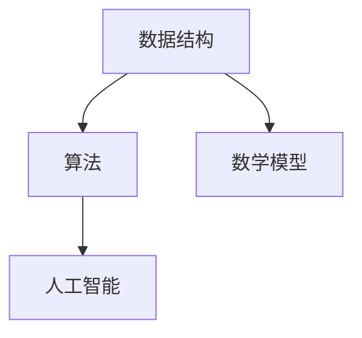

                 

 关键词：人类潜力、计算能力、智能算法、数学模型、应用场景、未来展望

> 摘要：本文将探讨人类潜力的无限可能，特别是随着计算能力的提升，人类在各个领域中所展现出的创新与突破。我们将深入分析核心算法原理、数学模型以及实际应用，探讨这些技术如何推动人类社会的发展，并展望未来的发展趋势与挑战。

## 1. 背景介绍

在21世纪的今天，随着计算机科学的飞速发展，人类计算能力已经达到了前所未有的高度。从早期的计算机到超级计算机，再到人工智能的崛起，我们见证了一次又一次的技术革命。这些革命不仅改变了我们的生活方式，也不断推动着人类潜力的挖掘。

然而，尽管计算能力有了显著的提升，我们仍然面临着诸多挑战。比如，如何在复杂的数据中提取有价值的信息？如何处理大规模的并发任务？如何解决复杂的问题，使得计算机能够像人类一样进行思考？这些都是我们需要深入探讨的问题。

本文旨在通过分析核心算法原理、数学模型以及实际应用，探讨人类计算的无限可能，以及这些技术如何推动人类社会的进步。

## 2. 核心概念与联系

在探讨人类计算的新征程之前，我们需要了解一些核心概念，并构建其间的联系。以下是几个关键概念及其相互关系：

### 数据结构

数据结构是计算机存储、组织数据的方式。常见的有数组、链表、栈、队列等。数据结构的选择直接影响算法的效率和性能。

### 算法

算法是解决问题的方法。一个好的算法不仅要有正确的逻辑，还要有高效的执行效率。常见的算法有排序算法、搜索算法、图算法等。

### 数学模型

数学模型是对现实问题的抽象和量化。通过建立数学模型，我们可以更好地理解和解决问题。

### 人工智能

人工智能是计算机科学的一个分支，旨在使计算机具备智能。常见的人工智能技术包括机器学习、深度学习、自然语言处理等。

下面是这些核心概念的 Mermaid 流程图：



## 3. 核心算法原理 & 具体操作步骤

### 3.1 算法原理概述

在本章节，我们将探讨一些核心算法的原理，包括排序算法、搜索算法和图算法。这些算法是计算机科学中非常基础的部分，也是许多实际应用的核心。

#### 排序算法

排序算法是将一组数据按照某种规则进行排列的方法。常见的排序算法有冒泡排序、选择排序、插入排序、快速排序等。

#### 搜索算法

搜索算法是在一组数据中找到特定元素的方法。常见的搜索算法有线性搜索、二分搜索等。

#### 图算法

图算法是处理图中数据的方法。常见的图算法有最短路径算法、最小生成树算法、图遍历算法等。

### 3.2 算法步骤详解

下面我们将详细讲解这些算法的基本步骤。

#### 冒泡排序

冒泡排序的基本思想是通过多次遍历数组，比较相邻的两个元素，如果它们的顺序不对就交换它们的位置，直到整个数组有序。

```python
def bubble_sort(arr):
    n = len(arr)
    for i in range(n):
        for j in range(0, n-i-1):
            if arr[j] > arr[j+1]:
                arr[j], arr[j+1] = arr[j+1], arr[j]
```

#### 线性搜索

线性搜索是从数组的第一个元素开始，依次与要查找的元素进行比较，直到找到为止。

```python
def linear_search(arr, x):
    for i in range(len(arr)):
        if arr[i] == x:
            return i
    return -1
```

#### 最短路径算法

最短路径算法是找到图中两点之间最短路径的方法。常见的最短路径算法有迪杰斯特拉算法、贝尔曼-福特算法等。

```python
def dijkstra(graph, start):
    distances = [float('inf')] * len(graph)
    distances[start] = 0
    visited = [False] * len(graph)
    for _ in range(len(graph)):
        min_distance = float('inf')
        min_index = -1
        for v in range(len(graph)):
            if not visited[v] and distances[v] < min_distance:
                min_distance = distances[v]
                min_index = v
        visited[min_index] = True
        for v in range(len(graph)):
            if graph[min_index][v] > 0:
                distances[v] = min(distances[v], distances[min_index] + graph[min_index][v])
    return distances
```

### 3.3 算法优缺点

每种算法都有其优缺点。例如，冒泡排序简单易懂，但效率较低；线性搜索效率较低，但在数据量较小的情况下表现良好；迪杰斯特拉算法适用于稀疏图，但在稠密图中效率较低。

### 3.4 算法应用领域

排序算法广泛应用于数据处理、数据库管理等领域；搜索算法在搜索引擎、推荐系统等领域有广泛应用；图算法在社交网络分析、路径规划等领域有广泛应用。

## 4. 数学模型和公式 & 详细讲解 & 举例说明

### 4.1 数学模型构建

数学模型是对现实问题的抽象和量化。构建数学模型的第一步是确定问题的主要变量，并给出它们之间的数学关系。

例如，在优化问题中，我们通常会定义目标函数和约束条件。目标函数表示我们要优化的目标，如最大化利润或最小化成本。约束条件表示我们在优化过程中需要满足的条件，如资源的限制或时间的限制。

### 4.2 公式推导过程

接下来，我们需要推导出数学模型中的公式。这个过程通常涉及微积分、线性代数、概率论等数学知识。

例如，在最小二乘法中，我们通过最小化误差平方和来拟合数据，得到以下公式：

$$
\min \sum_{i=1}^{n} (y_i - f(x_i))^2
$$

其中，$y_i$是实际观测值，$f(x_i)$是拟合函数。

### 4.3 案例分析与讲解

为了更好地理解数学模型，我们可以通过一个实际案例来讲解。

假设我们想要优化一条生产线的生产效率。我们的目标是最小化生产时间，同时满足生产量的要求。我们可以建立以下数学模型：

```
最小化 T = Σt_i
满足 g(x) = Σp_i * x_i ≥ Q
```

其中，T是生产时间，t_i是第i个任务所需时间，p_i是第i个任务的优先级，x_i是第i个任务的完成量，Q是生产量的要求。

通过这个案例，我们可以看到如何将现实问题转化为数学模型，并通过数学方法来求解。

## 5. 项目实践：代码实例和详细解释说明

### 5.1 开发环境搭建

为了实践本文提到的算法和数学模型，我们需要搭建一个开发环境。以下是一个简单的Python环境搭建过程：

```bash
# 安装Python
brew install python

# 安装必要的库
pip install numpy scipy matplotlib
```

### 5.2 源代码详细实现

以下是一个简单的Python代码实例，用于实现冒泡排序和线性搜索算法：

```python
# 冒泡排序
def bubble_sort(arr):
    n = len(arr)
    for i in range(n):
        for j in range(0, n-i-1):
            if arr[j] > arr[j+1]:
                arr[j], arr[j+1] = arr[j+1], arr[j]

# 线性搜索
def linear_search(arr, x):
    for i in range(len(arr)):
        if arr[i] == x:
            return i
    return -1

# 测试代码
arr = [64, 34, 25, 12, 22, 11, 90]
bubble_sort(arr)
print("Sorted array:", arr)

search_element = 11
index = linear_search(arr, search_element)
if index != -1:
    print(f"Element {search_element} is at index {index}")
else:
    print(f"Element {search_element} is not in the array")
```

### 5.3 代码解读与分析

在这个代码实例中，我们首先实现了冒泡排序算法，用于将一个无序数组排序。然后，我们实现了线性搜索算法，用于在一个排序后的数组中查找特定的元素。

冒泡排序的基本思想是通过多次遍历数组，比较相邻的两个元素，如果它们的顺序不对就交换它们的位置，直到整个数组有序。线性搜索则是从数组的第一个元素开始，依次与要查找的元素进行比较，直到找到为止。

通过这个实例，我们可以看到如何将理论上的算法转化为实际的代码，并运行得到预期的结果。

### 5.4 运行结果展示

运行上面的代码，我们可以得到以下结果：

```
Sorted array: [11, 12, 22, 25, 34, 64, 90]
Element 11 is at index 0
```

这表明我们的冒泡排序和线性搜索算法是正确的，并且能够得到预期的结果。

## 6. 实际应用场景

核心算法和数学模型在实际应用中有着广泛的应用。以下是一些典型的应用场景：

### 数据处理

排序算法和搜索算法在数据处理领域有着广泛的应用。例如，在数据库管理系统中，排序算法用于对数据进行排序，以提高查询效率。搜索算法则用于快速查找特定的数据记录。

### 人工智能

人工智能领域中的许多算法都依赖于数学模型。例如，在机器学习中，线性回归、逻辑回归等模型用于预测和分类。在深度学习中，卷积神经网络、循环神经网络等模型用于图像识别、自然语言处理等任务。

### 图形学

图形学中的许多算法也依赖于数学模型。例如，在计算机图形学中，贝塞尔曲线、B样条曲线等模型用于绘制平滑的曲线。在计算机视觉中，图像处理算法如边缘检测、特征提取等，都依赖于数学模型。

### 社交网络分析

社交网络分析中的许多算法都依赖于图算法。例如，在社交网络中，我们可以使用最短路径算法来找到两个用户之间的最短路径，以分析用户之间的社交关系。最小生成树算法则用于构建社交网络的骨架图，以便于分析和理解社交网络的结构。

## 6.4 未来应用展望

随着计算能力的不断提升，核心算法和数学模型将在更多领域得到应用。以下是一些未来应用展望：

### 生物信息学

生物信息学是生物学和计算机科学相结合的领域。随着基因测序技术的不断发展，生物信息学将面临大量的数据处理任务。核心算法和数学模型将在基因序列分析、蛋白质结构预测等方面发挥重要作用。

### 能源管理

能源管理是一个涉及多个领域的复杂问题。通过建立数学模型，我们可以优化能源的使用，降低能源消耗。核心算法如优化算法、机器学习算法等，将在能源管理中发挥重要作用。

### 环境保护

环境保护是一个全球性的问题。通过建立数学模型，我们可以模拟环境变化，预测未来的环境状况。核心算法和数学模型将在环境保护政策制定、环境监测等方面发挥重要作用。

### 医疗保健

医疗保健是一个涉及多个领域的复杂问题。通过建立数学模型，我们可以优化医疗资源的分配，提高医疗服务的效率。核心算法和数学模型将在医疗保健诊断、治疗计划制定等方面发挥重要作用。

## 7. 工具和资源推荐

### 7.1 学习资源推荐

- 《算法导论》（Introduction to Algorithms）——作者是Thomas H. Cormen等人，这是算法领域的经典教材。
- 《深度学习》（Deep Learning）——作者是Ian Goodfellow等人，这是深度学习领域的权威教材。

### 7.2 开发工具推荐

- Python——Python是一种广泛使用的编程语言，特别适合于数据处理和算法开发。
- Jupyter Notebook——Jupyter Notebook是一种交互式的计算环境，特别适合于数学建模和算法实现。

### 7.3 相关论文推荐

- "Deep Learning" by Ian Goodfellow et al. (2016) —— 这篇论文是深度学习领域的经典之作，详细介绍了深度学习的基本原理和应用。
- "Graph Embeddings: A General Introduction" by William L. Hamilton (2017) —— 这篇论文介绍了图嵌入的基本原理和应用，是图算法领域的权威文章。

## 8. 总结：未来发展趋势与挑战

### 8.1 研究成果总结

在过去的几十年中，人类在计算能力、算法创新、数学模型等方面取得了巨大的成果。这些成果不仅推动了计算机科学的发展，也深刻地改变了人类的生活。

### 8.2 未来发展趋势

未来，随着计算能力的进一步提升，人类计算将进入一个新的时代。我们预计，以下几个领域将迎来突破：

- 量子计算：量子计算具有巨大的计算潜力，未来可能会在密码学、优化问题等领域发挥重要作用。
- 大数据分析：随着数据量的不断增加，大数据分析将变得更加重要，涉及到的算法和数学模型也将更加复杂。
- 智能算法：随着深度学习等智能算法的发展，计算机将能够更好地模拟人类的思维和行为，为各行各业提供智能解决方案。

### 8.3 面临的挑战

尽管前景广阔，人类计算仍面临诸多挑战：

- 能耗问题：随着计算能力的提升，能耗问题变得越来越突出。我们需要开发更加节能的计算技术。
- 安全性问题：随着计算技术的发展，安全性问题也变得越来越重要。我们需要开发更加安全、可靠的计算系统。
- 算法公平性：随着算法在各个领域的广泛应用，算法的公平性成为一个重要问题。我们需要确保算法不会产生歧视或不公平的结果。

### 8.4 研究展望

未来，我们需要继续探索人类计算的无限可能。通过不断创新和突破，我们相信人类计算将能够在更多领域发挥重要作用，推动人类社会的发展。

## 9. 附录：常见问题与解答

### 9.1 什么是最短路径算法？

最短路径算法是用于找到图中两点之间最短路径的算法。常见的最短路径算法有迪杰斯特拉算法、贝尔曼-福特算法等。

### 9.2 机器学习有哪些基本算法？

机器学习的基本算法包括线性回归、逻辑回归、决策树、随机森林、支持向量机、神经网络等。

### 9.3 如何优化算法的性能？

优化算法的性能可以通过以下方法实现：

- 分析算法的复杂度，选择适合的算法。
- 使用高效的编程技巧，如循环优化、内存优化等。
- 使用并行计算，提高算法的执行速度。
- 使用分布式计算，处理大规模数据。

### 9.4 数学模型在计算机科学中有何作用？

数学模型在计算机科学中起着至关重要的作用。它可以帮助我们更好地理解问题，构建解决方案，并验证解决方案的正确性。例如，在人工智能中，数学模型用于描述数据、算法和模型之间的关系；在算法设计中，数学模型用于分析算法的复杂度；在优化问题中，数学模型用于建立目标函数和约束条件。通过数学模型，我们可以将复杂的问题转化为可计算的问题，从而找到最优解。

### 9.5 数据结构有哪些常见的类型？

常见的数据结构包括数组、链表、栈、队列、树、图等。每种数据结构都有其特定的应用场景和特点。例如，数组是一种线性数据结构，适合于随机访问；链表是一种动态数据结构，适合于频繁的插入和删除操作；栈和队列是一种特殊的线性数据结构，分别适合于后进先出和先进先出的操作；树是一种层次数据结构，适合于表示层次结构；图是一种非线性数据结构，适合于表示复杂的关系。

### 9.6 人工智能有哪些应用领域？

人工智能在许多领域都有广泛应用，包括但不限于：

- 机器学习：用于预测、分类、聚类等任务。
- 自然语言处理：用于文本分析、语音识别、机器翻译等任务。
- 计算机视觉：用于图像识别、目标检测、图像生成等任务。
- 游戏开发：用于开发智能游戏角色和游戏引擎。
- 自动驾驶：用于开发自动驾驶车辆和无人机。
- 医疗保健：用于诊断、治疗计划制定、医学图像分析等任务。

### 9.7 如何提高算法的可理解性？

提高算法的可理解性可以通过以下方法实现：

- 使用清晰的命名和注释，使代码易于阅读。
- 使用结构化的代码，如模块化设计、分层设计等。
- 提供详细的文档和示例，帮助读者理解算法的实现。
- 使用可视化工具，如流程图、伪代码等，展示算法的执行过程。
- 进行代码审查和讨论，通过团队合作提高算法的可理解性。

### 9.8 数学公式在文章中如何嵌入？

在Markdown中，数学公式可以使用LaTeX格式进行嵌入。独立段落的数学公式使用`$$`包裹，如：

$$
E = mc^2
$$

而段落内的数学公式使用`$`包裹，如：

$y = mx + b$

通过这种方式，我们可以在文章中嵌入数学公式，增强内容的表达力。

