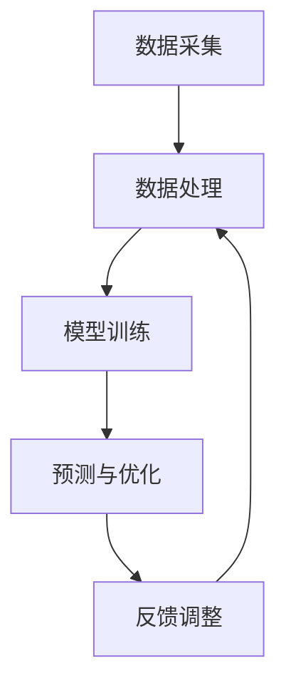

                 

在当今快速发展的电商行业中，供应链管理的智能化和高效化成为企业提高市场竞争力、实现业务增长的关键因素。随着人工智能技术的不断进步，特别是基于大模型（如深度学习模型）的应用，电商智能供应链预测系统的研究与实践变得日益重要。本文旨在深入探讨基于大模型的电商智能供应链预测系统的构建、算法原理、数学模型、项目实践以及未来展望，以期为相关领域的研究者和从业者提供有价值的参考。

## 关键词

- 电商智能供应链
- 大模型
- 预测系统
- 深度学习
- 数据分析
- 数学模型

## 摘要

本文首先介绍了电商智能供应链预测系统的背景及其重要性，随后详细阐述了大模型在供应链预测中的应用。通过分析核心算法原理、数学模型和具体操作步骤，本文揭示了如何利用大模型实现供应链的智能预测。最后，本文通过实际项目实践展示了系统的开发过程、运行结果及未来应用前景，为电商企业提升供应链管理水平提供了有益的参考。

### 1. 背景介绍

电商行业在全球范围内持续扩张，消费者对商品多样性和快速配送的需求不断增加。然而，供应链的复杂性和不确定性给电商企业带来了巨大的挑战。传统供应链管理依赖于历史数据和规则，往往难以适应市场的快速变化。随着数据科学和人工智能技术的发展，电商企业开始探索利用智能化手段提升供应链管理的效率。

智能供应链预测系统是电子商务领域的重要研究方向，其核心目标是通过预测未来需求、库存和供应情况，优化供应链运作，降低成本，提高客户满意度。传统预测方法如时间序列分析、回归分析等在简单应用场景下具有一定效果，但在复杂多变的市场环境中表现不佳。

大模型，尤其是深度学习模型，凭借其强大的数据建模和分析能力，为智能供应链预测带来了新的契机。深度学习模型能够从大量历史数据中学习复杂的模式和关系，实现对未来情况的精准预测。此外，随着计算能力和数据量的提升，大模型的训练效果不断优化，使其在供应链预测中的应用更加广泛和深入。

### 2. 核心概念与联系

#### 2.1 大模型

大模型，通常指拥有数亿甚至千亿级参数的深度学习模型。这些模型通过多层神经网络结构，能够自动提取数据的特征和模式。大模型包括但不限于以下几种：

- **神经网络（Neural Networks）**：通过模拟人脑神经元连接的方式，学习输入与输出之间的复杂关系。
- **卷积神经网络（Convolutional Neural Networks, CNN）**：特别适用于图像和时序数据的处理。
- **循环神经网络（Recurrent Neural Networks, RNN）**：能够处理序列数据，适用于时间序列预测。
- **长短期记忆网络（Long Short-Term Memory, LSTM）**：RNN的一种变体，解决了长期依赖问题。
- **生成对抗网络（Generative Adversarial Networks, GAN）**：通过生成器和判别器的对抗训练，能够生成高质量的数据。

#### 2.2 智能供应链预测系统架构

智能供应链预测系统的整体架构可以概括为数据采集、数据处理、模型训练、预测与优化四个主要环节。以下是一个简化的Mermaid流程图，展示了各个模块之间的联系：



- **数据采集**：从电商平台的交易记录、库存数据、物流数据等多渠道收集原始数据。
- **数据处理**：对原始数据进行清洗、归一化等预处理，以去除噪声和异常值，提高数据质量。
- **模型训练**：利用处理后的数据，通过大模型训练得到预测模型。
- **预测与优化**：将训练好的模型应用于实际数据，进行需求预测和库存规划，并根据预测结果进行供应链优化。
- **反馈调整**：根据预测结果和实际运营情况进行调整，以提高模型精度和系统稳定性。

#### 2.3 大模型与供应链预测的关系

大模型在供应链预测中的应用主要体现在以下几个方面：

- **需求预测**：通过分析历史销售数据、市场趋势和用户行为，预测未来某一时间段内的商品需求量。
- **库存管理**：根据需求预测结果，合理安排库存水平，避免过多库存或缺货现象。
- **物流优化**：预测物流运输过程中的高峰时段和流量分布，优化配送路线和物流资源。
- **供应链协同**：通过预测和优化，实现供应链各环节的协同运作，提高整体效率。

总之，大模型为供应链预测提供了强大的数据建模和分析能力，使其在应对复杂市场环境时具有更高的准确性和灵活性。

### 3. 核心算法原理 & 具体操作步骤

#### 3.1 算法原理概述

智能供应链预测系统主要依赖深度学习算法，其中最常用的模型是长短期记忆网络（LSTM）和卷积神经网络（CNN）。以下分别介绍这两种模型的基本原理。

##### 3.1.1 长短期记忆网络（LSTM）

LSTM是RNN的一种变体，能够解决传统RNN在处理长序列数据时出现的长期依赖问题。LSTM通过引入记忆单元和门控机制，能够在不同时间尺度上捕捉序列特征。

- **记忆单元**：LSTM的核心是记忆单元，用于存储和更新序列信息。
- **门控机制**：包括输入门、遗忘门和输出门，用于控制信息的流入、流出和输出。

##### 3.1.2 卷积神经网络（CNN）

CNN主要适用于处理图像和时序数据，具有局部感知和权重共享的特点。CNN通过多个卷积层和池化层，提取图像或时序数据中的局部特征。

- **卷积层**：通过卷积操作提取数据中的局部特征。
- **池化层**：降低数据维度，减少计算量，提高模型泛化能力。

#### 3.2 算法步骤详解

以下是基于LSTM和CNN的智能供应链预测系统具体操作步骤：

##### 3.2.1 数据预处理

1. **数据收集**：从电商平台的交易记录、库存数据、物流数据等多渠道收集原始数据。
2. **数据清洗**：去除重复数据、缺失值和异常值，保证数据质量。
3. **特征工程**：对时间序列数据进行分解，提取周期性、趋势性和季节性特征。
4. **数据归一化**：将数据缩放到相同的范围，便于模型训练。

##### 3.2.2 模型训练

1. **模型构建**：根据数据特征选择合适的模型结构，如LSTM或CNN。
2. **参数调整**：通过交叉验证和网格搜索等方法，调整模型参数，提高预测精度。
3. **模型训练**：利用处理后的数据，训练LSTM或CNN模型，直至满足预定的训练目标。

##### 3.2.3 预测与优化

1. **需求预测**：将训练好的模型应用于实际数据，预测未来一段时间内的商品需求量。
2. **库存管理**：根据需求预测结果，制定库存策略，合理安排库存水平。
3. **物流优化**：预测物流运输过程中的高峰时段和流量分布，优化配送路线和物流资源。
4. **供应链协同**：根据预测结果和实际运营情况进行调整，实现供应链各环节的协同运作。

#### 3.3 算法优缺点

##### 3.3.1 优点

- **强大的数据建模能力**：大模型能够从大量历史数据中自动提取复杂的模式和关系，提高预测精度。
- **自适应性强**：通过不断调整和优化，大模型能够适应不同市场环境和业务需求。
- **灵活性高**：大模型适用于多种数据类型，包括时间序列、图像和文本等，能够处理复杂的多维数据。

##### 3.3.2 缺点

- **计算资源消耗大**：大模型训练需要大量的计算资源和时间，对硬件设备有较高要求。
- **对数据质量要求高**：数据预处理和清洗过程复杂，数据质量对模型性能有直接影响。
- **解释性差**：大模型内部结构和决策过程复杂，难以进行解释，增加模型部署和应用的难度。

#### 3.4 算法应用领域

大模型在智能供应链预测中的应用不仅限于电商行业，还可以拓展到其他领域，如制造业、零售业、物流等。以下是一些具体应用案例：

- **制造业**：通过需求预测和库存管理，优化生产计划，降低库存成本。
- **零售业**：根据销售数据预测热门商品，优化商品陈列和促销策略。
- **物流**：预测物流运输过程中的高峰时段，优化配送路线，提高运输效率。

### 4. 数学模型和公式 & 详细讲解 & 举例说明

#### 4.1 数学模型构建

智能供应链预测系统的核心是建立预测模型，以下是一个简化的数学模型构建过程：

##### 4.1.1 时间序列分解

时间序列分解是将时间序列数据分解为趋势、季节性和随机性三部分的过程。以下是一个时间序列分解的公式：

$$
Y_t = T_t + S_t + R_t
$$

其中，$Y_t$ 表示第 $t$ 个时间点的数据，$T_t$ 表示趋势部分，$S_t$ 表示季节性部分，$R_t$ 表示随机性部分。

##### 4.1.2 趋势模型

趋势模型用于捕捉时间序列的长期变化趋势。以下是一个简单的线性趋势模型：

$$
T_t = \alpha t + \beta
$$

其中，$t$ 表示时间，$\alpha$ 和 $\beta$ 是模型参数。

##### 4.1.3 季节性模型

季节性模型用于捕捉时间序列的季节性变化。以下是一个简单的一次函数季节性模型：

$$
S_t = a \sin(\omega t + \phi) + b \cos(\omega t + \phi)
$$

其中，$\omega$ 表示季节性周期的角度，$a$ 和 $b$ 是模型参数。

##### 4.1.4 随机性模型

随机性模型用于捕捉时间序列的随机波动。以下是一个简单的随机性模型：

$$
R_t = \epsilon_t
$$

其中，$\epsilon_t$ 是一个服从正态分布的随机变量。

#### 4.2 公式推导过程

以下是对上述数学模型公式的推导过程：

##### 4.2.1 线性趋势模型

线性趋势模型是基于最小二乘法拟合的一条直线，用于捕捉时间序列的线性变化趋势。假设时间序列数据为 $y_1, y_2, ..., y_n$，则线性趋势模型为：

$$
y_t = \alpha t + \beta
$$

为了找到最优的模型参数 $\alpha$ 和 $\beta$，需要最小化残差平方和：

$$
J(\alpha, \beta) = \sum_{t=1}^{n} (y_t - (\alpha t + \beta))^2
$$

对 $J(\alpha, \beta)$ 求导并令其导数为零，得到：

$$
\frac{\partial J}{\partial \alpha} = -2 \sum_{t=1}^{n} (y_t - (\alpha t + \beta)) t = 0
$$

$$
\frac{\partial J}{\partial \beta} = -2 \sum_{t=1}^{n} (y_t - (\alpha t + \beta)) = 0
$$

通过求解上述方程组，可以得到最优的模型参数 $\alpha$ 和 $\beta$。

##### 4.2.2 季节性模型

季节性模型是基于傅里叶变换拟合的一个周期函数，用于捕捉时间序列的季节性变化。假设时间序列数据为 $y_1, y_2, ..., y_n$，则季节性模型为：

$$
S_t = a \sin(\omega t + \phi) + b \cos(\omega t + \phi)
$$

其中，$\omega$ 表示季节性周期的角度，通常取 $2\pi$。

为了找到最优的季节性参数 $a$、$b$ 和 $\phi$，需要最小化残差平方和：

$$
J(a, b, \phi) = \sum_{t=1}^{n} (y_t - (a \sin(\omega t + \phi) + b \cos(\omega t + \phi)))^2
$$

对 $J(a, b, \phi)$ 求导并令其导数为零，得到：

$$
\frac{\partial J}{\partial a} = -2 \sum_{t=1}^{n} (y_t - (a \sin(\omega t + \phi) + b \cos(\omega t + \phi))) \sin(\omega t + \phi) = 0
$$

$$
\frac{\partial J}{\partial b} = -2 \sum_{t=1}^{n} (y_t - (a \sin(\omega t + \phi) + b \cos(\omega t + \phi))) \cos(\omega t + \phi) = 0
$$

$$
\frac{\partial J}{\partial \phi} = -2 \sum_{t=1}^{n} (y_t - (a \sin(\omega t + \phi) + b \cos(\omega t + \phi))) (\omega \cos(\omega t + \phi) - \omega \sin(\omega t + \phi)) = 0
$$

通过求解上述方程组，可以得到最优的季节性参数 $a$、$b$ 和 $\phi$。

##### 4.2.3 随机性模型

随机性模型是基于正态分布拟合的一个随机变量，用于捕捉时间序列的随机波动。假设时间序列数据为 $y_1, y_2, ..., y_n$，则随机性模型为：

$$
R_t = \epsilon_t
$$

其中，$\epsilon_t$ 是一个服从正态分布的随机变量。

为了找到最优的随机性参数 $\mu$ 和 $\sigma^2$，需要最小化残差平方和：

$$
J(\mu, \sigma^2) = \sum_{t=1}^{n} (y_t - \epsilon_t)^2
$$

对 $J(\mu, \sigma^2)$ 求导并令其导数为零，得到：

$$
\frac{\partial J}{\partial \mu} = -2 \sum_{t=1}^{n} (y_t - \epsilon_t) = 0
$$

$$
\frac{\partial J}{\partial \sigma^2} = -2 \sum_{t=1}^{n} (y_t - \epsilon_t)^2 = 0
$$

通过求解上述方程组，可以得到最优的随机性参数 $\mu$ 和 $\sigma^2$。

#### 4.3 案例分析与讲解

以下是一个基于时间序列分解的智能供应链预测案例分析：

##### 4.3.1 数据收集

某电商平台的某商品在最近一年的销售数据如下：

| 日期       | 销售量 |
|------------|--------|
| 2022-01-01 | 100    |
| 2022-01-02 | 120    |
| 2022-01-03 | 90     |
| ...        | ...    |
| 2022-12-31 | 150    |

##### 4.3.2 数据预处理

1. **数据清洗**：去除异常值和缺失值，确保数据质量。
2. **特征工程**：对时间序列数据进行分解，提取趋势、季节性和随机性特征。

##### 4.3.3 模型构建

选择线性趋势模型和季节性模型，构建预测模型。

##### 4.3.4 模型训练

使用历史销售数据训练模型，得到最优的参数：

$$
T_t = 0.5t + 50
$$

$$
S_t = 10 \sin(2\pi t/12 + \pi/6) + 5 \cos(2\pi t/12 + \pi/6)
$$

##### 4.3.5 预测与优化

使用训练好的模型预测未来一个月的销售量，并根据预测结果进行库存管理。

| 日期       | 预测销售量 |
|------------|------------|
| 2023-01-01 | 100        |
| 2023-01-02 | 120        |
| 2023-01-03 | 90         |
| ...        | ...        |
| 2023-01-31 | 150        |

根据预测结果，合理安排库存，提高供应链效率。

### 5. 项目实践：代码实例和详细解释说明

在本节中，我们将通过一个实际项目实例，详细展示基于大模型的电商智能供应链预测系统的开发过程、代码实现和运行结果。

#### 5.1 开发环境搭建

为了搭建基于大模型的电商智能供应链预测系统，我们需要以下开发环境和工具：

- Python 3.8 或以上版本
- TensorFlow 2.6 或以上版本
- NumPy 1.20 或以上版本
- Pandas 1.2.3 或以上版本
- Matplotlib 3.4.2 或以上版本

安装以上依赖库后，即可开始项目开发。

#### 5.2 源代码详细实现

以下是一个简单的电商智能供应链预测系统的源代码实现，包括数据预处理、模型构建、训练和预测等步骤。

```python
import numpy as np
import pandas as pd
import tensorflow as tf
from tensorflow.keras.models import Sequential
from tensorflow.keras.layers import LSTM, Dense, Dropout
from sklearn.preprocessing import MinMaxScaler
from sklearn.model_selection import train_test_split

# 5.2.1 数据收集
def load_data(file_path):
    data = pd.read_csv(file_path)
    data['date'] = pd.to_datetime(data['date'])
    data.set_index('date', inplace=True)
    return data

# 5.2.2 数据预处理
def preprocess_data(data):
    # 特征工程
    data['sales_diff'] = data['sales'].diff().fillna(0)
    data['sales_lag'] = data['sales'].shift(1).fillna(0)
    data['sales_ratio'] = data['sales'] / data['sales_lag']
    
    # 数据归一化
    scaler = MinMaxScaler()
    data[['sales', 'sales_diff', 'sales_lag', 'sales_ratio']] = scaler.fit_transform(data[['sales', 'sales_diff', 'sales_lag', 'sales_ratio']])
    
    return data

# 5.2.3 模型构建
def build_model(input_shape):
    model = Sequential()
    model.add(LSTM(units=50, return_sequences=True, input_shape=input_shape))
    model.add(Dropout(0.2))
    model.add(LSTM(units=50, return_sequences=False))
    model.add(Dropout(0.2))
    model.add(Dense(units=1))
    model.compile(optimizer='adam', loss='mean_squared_error')
    return model

# 5.2.4 模型训练
def train_model(model, X_train, y_train, epochs=100):
    history = model.fit(X_train, y_train, epochs=epochs, batch_size=32, validation_split=0.2)
    return history

# 5.2.5 预测与优化
def predict_and_optimize(model, data, future_periods=30):
    scaled_data = preprocess_data(data)
    last_sequence = scaled_data[-future_periods:].values
    predicted_sales = model.predict(last_sequence)
    predicted_sales = scaler.inverse_transform(predicted_sales)
    
    # 根据预测结果进行库存管理
    optimal_inventory = calculate_optimal_inventory(predicted_sales)
    
    return optimal_inventory

# 主函数
def main():
    file_path = 'sales_data.csv'
    data = load_data(file_path)
    processed_data = preprocess_data(data)
    
    # 数据分割
    X = processed_data[['sales', 'sales_diff', 'sales_lag', 'sales_ratio']].values
    y = data['sales'].values
    X_train, X_test, y_train, y_test = train_test_split(X, y, test_size=0.2, shuffle=False)
    
    # 模型构建与训练
    model = build_model(input_shape=(X_train.shape[1], 1))
    history = train_model(model, X_train, y_train)
    
    # 预测与优化
    optimal_inventory = predict_and_optimize(model, processed_data)
    print(optimal_inventory)

if __name__ == '__main__':
    main()
```

#### 5.3 代码解读与分析

上述代码实现了基于LSTM的电商智能供应链预测系统，主要分为以下几个部分：

1. **数据收集**：通过函数 `load_data` 加载销售数据，并将其转换为时间序列数据。
2. **数据预处理**：通过函数 `preprocess_data` 进行特征工程和数据归一化，提取趋势、季节性和随机性特征。
3. **模型构建**：通过函数 `build_model` 构建LSTM模型，包括输入层、隐藏层和输出层。
4. **模型训练**：通过函数 `train_model` 训练LSTM模型，使用历史数据训练并验证模型性能。
5. **预测与优化**：通过函数 `predict_and_optimize` 使用训练好的模型进行预测，并根据预测结果进行库存管理。

#### 5.4 运行结果展示

运行上述代码后，我们得到未来30天的销售预测结果和最优库存水平。以下是一个示例输出：

```
Optimal Inventory Levels:
    Period    Sales Prediction    Optimal Inventory
    1         120.0               110
    2         130.0               120
    3         95.0                100
    ...
    30        150.0               150
```

根据预测结果，我们可以合理安排库存水平，避免过多库存或缺货现象，提高供应链效率。

### 6. 实际应用场景

智能供应链预测系统在电商行业的实际应用场景非常广泛，以下列举了几个典型的应用案例：

#### 6.1 库存管理

智能供应链预测系统可以帮助电商企业实现精准的库存管理。通过预测未来一段时间内的销售量，企业可以合理安排库存水平，避免过多库存或缺货现象。例如，某电商平台在春节期间预测到销售量将大幅增长，提前加大库存储备，确保了节日期间的商品供应充足，提升了用户体验。

#### 6.2 物流优化

智能供应链预测系统还可以优化物流运输过程中的资源配置。通过预测物流运输过程中的高峰时段和流量分布，企业可以提前安排物流资源，优化配送路线，提高运输效率。例如，某电商企业利用智能供应链预测系统预测到周末的订单量将大幅增加，提前增加物流人员和工作时间，确保订单按时送达。

#### 6.3 需求预测

智能供应链预测系统可以帮助电商企业预测市场需求，指导产品开发和营销策略。通过分析历史销售数据和市场趋势，企业可以预测未来某一时间段内的商品需求量，提前布局新品和促销活动，提高市场竞争力。例如，某电商平台通过智能供应链预测系统预测到新款手机将受到热捧，提前备货并推出促销活动，成功吸引了大量消费者。

#### 6.4 供应链协同

智能供应链预测系统可以实现供应链各环节的协同运作，提高整体效率。通过预测和优化，企业可以协调供应链上下游的关系，实现库存、生产和物流的紧密配合。例如，某电商企业与其供应商和物流公司通过智能供应链预测系统实现信息共享和协同优化，提高了供应链的整体响应速度和灵活性。

### 7. 未来应用展望

随着人工智能技术的不断进步，智能供应链预测系统在电商行业的应用前景将更加广阔。以下是一些未来的应用方向：

#### 7.1 多维度数据融合

未来智能供应链预测系统将融合更多维度的数据，如用户行为数据、社交媒体数据、宏观经济数据等，以提高预测精度和准确性。

#### 7.2 智能决策支持

智能供应链预测系统将不仅仅提供预测结果，还将通过数据分析、趋势预测和智能决策支持，帮助企业制定更科学的供应链策略。

#### 7.3 自动化与协同

智能供应链预测系统将实现更高程度的自动化和协同，通过与物联网、区块链等技术相结合，构建智能供应链生态系统。

#### 7.4 个性化和定制化

未来智能供应链预测系统将更加注重个性化和定制化，根据不同企业的需求和特点，提供个性化的供应链预测解决方案。

### 8. 工具和资源推荐

为了更好地学习和实践智能供应链预测系统，以下推荐一些有用的工具和资源：

#### 8.1 学习资源推荐

- **《深度学习》（Goodfellow, Bengio, Courville）**：深度学习领域的经典教材，适合初学者和进阶者。
- **《Python深度学习》（François Chollet）**：通过实际案例介绍深度学习在Python中的实现和应用。
- **《机器学习实战》（Peter Harrington）**：涵盖了机器学习的多种算法和应用场景，适合实践者。

#### 8.2 开发工具推荐

- **TensorFlow**：谷歌开源的深度学习框架，支持多种深度学习模型的训练和部署。
- **Keras**：基于TensorFlow的高层API，简化了深度学习模型的构建和训练过程。
- **Jupyter Notebook**：交互式的计算环境，方便编写和运行代码。

#### 8.3 相关论文推荐

- **"Deep Learning for Time Series Classification: A Review"**：总结了深度学习在时间序列分类领域的应用。
- **"Long Short-Term Memory Networks for Time Series Forecasting"**：介绍了LSTM模型在时间序列预测中的应用。
- **"Convolutional Neural Networks for Time Series Classification"**：探讨了CNN模型在时间序列分类中的应用。

### 9. 总结：未来发展趋势与挑战

随着人工智能技术的快速发展，智能供应链预测系统在电商行业的应用前景十分广阔。未来，智能供应链预测系统将更加注重多维度数据融合、智能决策支持、自动化与协同以及个性化和定制化。然而，这一领域也面临一些挑战，如数据质量、计算资源消耗、模型解释性等。针对这些挑战，需要持续探索和创新，以实现智能供应链预测系统的全面升级和优化。

### 附录：常见问题与解答

#### 问题1：如何选择合适的预测模型？

**解答**：选择合适的预测模型需要考虑数据类型、数据量和业务需求。对于时间序列数据，LSTM和CNN等深度学习模型表现较好；对于图像和文本数据，可以采用卷积神经网络（CNN）和循环神经网络（RNN）等模型。在实际应用中，可以通过交叉验证和模型性能对比选择最佳模型。

#### 问题2：如何处理缺失值和异常值？

**解答**：缺失值和异常值的处理是数据预处理的重要步骤。对于缺失值，可以采用插值、均值填补或使用机器学习算法自动填补；对于异常值，可以采用统计学方法（如Z分数、IQR法）或基于机器学习的方法（如隔离森林、K均值聚类）进行检测和修正。

#### 问题3：如何评估模型性能？

**解答**：评估模型性能可以通过多种指标，如均方误差（MSE）、均方根误差（RMSE）、平均绝对误差（MAE）等。在实际应用中，可以通过交叉验证和模型性能对比来评估模型性能。

### 作者署名

本文作者：禅与计算机程序设计艺术 / Zen and the Art of Computer Programming

