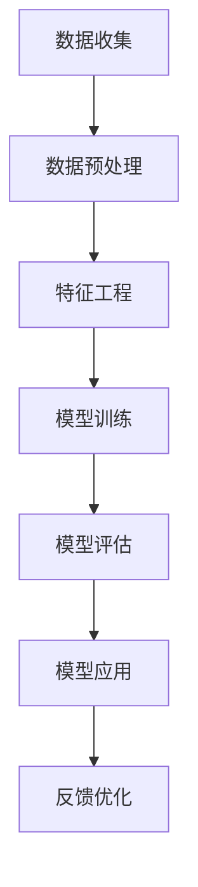

                 

关键词：电商，智能客户价值预测，精准营销，大模型，深度学习，人工智能，机器学习

摘要：随着电商行业的快速发展，如何有效地预测客户价值并实现精准营销成为企业关注的焦点。本文将探讨基于大模型的电商智能客户价值预测与精准营销系统的构建方法，从核心概念、算法原理、数学模型、项目实践到实际应用场景，全面解析这一领域的前沿技术和发展趋势。

## 1. 背景介绍

随着互联网技术的飞速发展，电商行业已经成为了全球经济增长的重要引擎。在这一背景下，企业如何通过有效的客户价值预测和精准营销策略来提高用户满意度和盈利能力，成为了至关重要的课题。

传统的客户价值预测方法主要依赖于历史数据和简单的统计模型，如线性回归、决策树等。然而，这些方法在面对大规模、多维度的数据集时，往往难以捕捉到数据中的复杂模式和潜在关系。随着深度学习和大数据技术的兴起，基于大模型的智能预测系统逐渐成为可能。

精准营销则是基于对客户的深度理解和个性化推荐，通过精准的数据分析和算法，为企业提供更加有效的营销策略。传统的精准营销主要依赖于用户行为分析和传统的规则引擎，但这种方法在面对复杂的市场环境和多样化的用户需求时，存在较大的局限性。

因此，本文旨在探讨如何构建一个基于大模型的电商智能客户价值预测与精准营销系统，以应对当前电商行业面临的数据复杂性和个性化需求。

## 2. 核心概念与联系

### 2.1. 智能客户价值预测

智能客户价值预测是一种利用大数据和人工智能技术对客户进行深入分析，预测其未来行为和价值的系统。它通过整合用户的历史购买记录、浏览行为、社交数据等多维度信息，利用深度学习算法构建预测模型，从而实现客户价值的智能化评估。

### 2.2. 精准营销

精准营销是一种以客户为中心的营销策略，通过精准的数据分析和算法，实现个性化推荐和精准触达。它基于对客户的深入理解和个性化需求分析，通过大数据技术和人工智能算法，为企业提供个性化的营销内容和策略，从而提高用户满意度和转化率。

### 2.3. 大模型

大模型是指具有大量参数和复杂结构的机器学习模型，如深度神经网络、Transformer等。这些模型通过在大量数据上进行训练，能够捕捉到数据中的复杂模式和潜在关系，从而实现更高的预测准确性和泛化能力。

### 2.4. 大模型的 Mermaid 流程图



### 2.5. 精准营销与智能客户价值预测的联系

精准营销和智能客户价值预测是相辅相成的。精准营销需要基于智能客户价值预测的结果，确定哪些客户具有更高的价值，从而制定个性化的营销策略。而智能客户价值预测则需要通过精准营销的实际效果反馈，不断优化和调整预测模型，提高预测的准确性和实用性。

## 3. 核心算法原理 & 具体操作步骤

### 3.1. 算法原理概述

基于大模型的电商智能客户价值预测与精准营销系统主要依赖于深度学习和大数据技术。具体来说，它包括以下几个关键步骤：

1. **数据收集**：收集用户的历史购买记录、浏览行为、社交数据等。
2. **数据预处理**：对数据进行清洗、去重、归一化等处理，以消除噪声和异常值的影响。
3. **特征工程**：提取用户行为特征、商品特征等，构建用于训练的数据集。
4. **模型训练**：利用深度学习算法，如卷积神经网络（CNN）、循环神经网络（RNN）等，对特征进行建模和训练。
5. **模型评估**：通过交叉验证等方法，评估模型的预测准确性和泛化能力。
6. **模型应用**：将训练好的模型应用于实际业务场景，进行客户价值预测和精准营销。
7. **反馈优化**：根据实际营销效果，不断优化和调整模型参数，提高预测准确性和营销效果。

### 3.2. 算法步骤详解

#### 3.2.1. 数据收集

数据收集是构建智能客户价值预测与精准营销系统的第一步。主要收集以下类型的数据：

- 用户基本信息：如年龄、性别、地理位置等。
- 用户行为数据：如浏览历史、购买记录、评价等。
- 商品数据：如商品名称、价格、分类、标签等。
- 社交数据：如用户社交网络关系、点赞、评论等。

#### 3.2.2. 数据预处理

数据预处理是对原始数据进行清洗、去重、归一化等处理，以消除噪声和异常值的影响。主要步骤包括：

- 数据清洗：去除重复数据、缺失值填充、异常值处理等。
- 数据归一化：对数值型数据进行归一化处理，如使用 Min-Max 标准化或 Z-Score 标准化等。
- 数据编码：对分类数据进行编码处理，如独热编码、标签编码等。

#### 3.2.3. 特征工程

特征工程是构建高质量数据集的关键步骤。主要任务包括：

- 特征提取：提取用户行为特征、商品特征等，如用户活跃度、购买频率、商品受欢迎程度等。
- 特征选择：通过特征选择算法，如相关性分析、主成分分析（PCA）等，筛选出对预测任务最有影响力的特征。
- 特征组合：通过组合不同特征，构建新的特征，如用户与商品的交互特征、用户生命周期特征等。

#### 3.2.4. 模型训练

模型训练是构建智能客户价值预测与精准营销系统的核心步骤。主要步骤包括：

- 模型选择：选择合适的深度学习模型，如卷积神经网络（CNN）、循环神经网络（RNN）等。
- 模型训练：使用训练数据集对模型进行训练，调整模型参数，优化模型性能。
- 模型验证：使用验证数据集评估模型性能，调整模型参数，防止过拟合。

#### 3.2.5. 模型评估

模型评估是确保模型性能和可靠性的关键步骤。主要步骤包括：

- 交叉验证：使用交叉验证方法，如 K-Fold 交叉验证，评估模型在不同数据集上的性能。
- 性能指标：计算模型预测的准确率、召回率、F1 值等指标，评估模型性能。
- 模型对比：对比不同模型的性能，选择最优模型。

#### 3.2.6. 模型应用

模型应用是将训练好的模型应用于实际业务场景，进行客户价值预测和精准营销。主要步骤包括：

- 实时预测：利用训练好的模型，对实时数据进行分析和预测。
- 精准营销：根据客户价值预测结果，制定个性化的营销策略，如推荐商品、推送优惠券等。

#### 3.2.7. 反馈优化

反馈优化是持续提高模型性能和营销效果的关键步骤。主要步骤包括：

- 数据反馈：收集用户行为数据和营销效果数据，用于模型优化。
- 模型调整：根据数据反馈，调整模型参数，优化模型性能。
- 营销策略优化：根据用户反馈和营销效果，优化营销策略，提高用户满意度和转化率。

### 3.3. 算法优缺点

#### 优点：

1. **高效性**：基于大模型的算法能够在大规模数据集上高效地训练和预测。
2. **准确性**：深度学习算法能够捕捉到数据中的复杂模式和潜在关系，提高预测准确性。
3. **泛化能力**：大模型具有良好的泛化能力，能够应用于不同的业务场景和数据集。
4. **自动化**：算法能够自动进行特征提取、模型选择和参数调整，降低人工干预成本。

#### 缺点：

1. **计算资源消耗**：大模型训练和预测需要大量的计算资源，对硬件设备要求较高。
2. **数据依赖性**：算法性能依赖于数据质量和数量，数据缺失或不完整可能影响模型效果。
3. **解释性不足**：深度学习模型的黑箱性质使其难以解释，增加了模型风险和不确定性。
4. **过拟合风险**：大模型容易受到过拟合问题的影响，需要采用适当的正则化技术和验证方法。

### 3.4. 算法应用领域

基于大模型的电商智能客户价值预测与精准营销算法可以应用于以下领域：

1. **个性化推荐**：基于用户历史行为和偏好，推荐个性化的商品和营销活动。
2. **用户行为预测**：预测用户的购买意向、浏览行为和退出行为，为企业提供营销策略。
3. **风险控制**：基于用户行为数据，预测用户流失风险、欺诈风险等，帮助企业降低风险。
4. **精准广告投放**：根据用户兴趣和行为，精准投放广告，提高广告效果和转化率。
5. **智能客服**：利用自然语言处理技术，构建智能客服系统，提高客户满意度和运营效率。

## 4. 数学模型和公式 & 详细讲解 & 举例说明

### 4.1. 数学模型构建

在构建电商智能客户价值预测与精准营销系统的数学模型时，我们主要采用以下公式：

$$
\text{客户价值预测} = f(\text{用户特征}, \text{商品特征}, \text{历史行为})
$$

其中，$f$ 是一个复杂的非线性函数，表示用户特征、商品特征和历史行为对客户价值的综合影响。为了简化计算，我们可以将这个函数分解为多个子函数：

$$
f = f_1 \circ f_2 \circ f_3
$$

其中，$f_1$ 表示用户特征处理函数，$f_2$ 表示商品特征处理函数，$f_3$ 表示历史行为处理函数。每个子函数都可以采用不同的深度学习模型进行实现。

### 4.2. 公式推导过程

为了推导出上述公式，我们需要首先明确用户特征、商品特征和历史行为的定义：

- 用户特征：包括年龄、性别、地理位置、兴趣爱好等。
- 商品特征：包括商品名称、价格、分类、标签等。
- 历史行为：包括购买记录、浏览历史、评价等。

然后，我们可以采用以下步骤进行推导：

1. **用户特征处理**：

$$
f_1(\text{用户特征}) = \text{Embedding}(\text{用户特征}) \cdot \text{权重矩阵}
$$

其中，$\text{Embedding}$ 函数将用户特征映射到高维空间，$\text{权重矩阵}$ 用于调整特征权重。

2. **商品特征处理**：

$$
f_2(\text{商品特征}) = \text{Embedding}(\text{商品特征}) \cdot \text{权重矩阵}
$$

类似地，$\text{Embedding}$ 函数将商品特征映射到高维空间，$\text{权重矩阵}$ 用于调整特征权重。

3. **历史行为处理**：

$$
f_3(\text{历史行为}) = \text{Embedding}(\text{历史行为}) \cdot \text{权重矩阵}
$$

同样地，$\text{Embedding}$ 函数将历史行为映射到高维空间，$\text{权重矩阵}$ 用于调整特征权重。

4. **综合处理**：

$$
f(\text{用户特征}, \text{商品特征}, \text{历史行为}) = f_1(\text{用户特征}) + f_2(\text{商品特征}) + f_3(\text{历史行为})
$$

将三个子函数的结果进行相加，得到最终的综合预测结果。

### 4.3. 案例分析与讲解

为了更好地理解上述公式的应用，我们可以通过一个实际案例进行讲解。假设我们有一个电商平台的用户数据集，包括以下三个特征：

1. 用户特征：年龄、性别、地理位置
2. 商品特征：商品名称、价格、分类
3. 历史行为：购买记录、浏览历史、评价

我们首先对每个特征进行编码和嵌入：

- 年龄：0-100，采用独热编码
- 性别：男、女，采用独热编码
- 地理位置：城市名，采用独热编码
- 商品名称：商品名称，采用词嵌入
- 价格：0-1000，采用 Min-Max 标准化
- 分类：商品分类，采用独热编码
- 购买记录：0-10，采用独热编码
- 浏览历史：商品名称，采用词嵌入
- 评价：好评、中评、差评，采用独热编码

然后，我们构建一个简单的深度学习模型，包括三个子网络：

1. 用户特征处理子网络：输入用户特征，输出用户特征嵌入向量。
2. 商品特征处理子网络：输入商品特征，输出商品特征嵌入向量。
3. 历史行为处理子网络：输入历史行为，输出历史行为嵌入向量。

最后，我们将三个子网络的结果进行相加，得到最终的综合预测结果。

通过这个案例，我们可以看到如何将数学模型应用于实际场景中，从而实现电商智能客户价值预测与精准营销。

## 5. 项目实践：代码实例和详细解释说明

### 5.1. 开发环境搭建

在进行电商智能客户价值预测与精准营销系统的开发前，我们需要搭建一个合适的开发环境。以下是具体的步骤：

1. **安装 Python**：Python 是我们进行项目开发的主要语言，因此我们需要安装 Python 环境。建议使用 Python 3.8 或更高版本。
2. **安装深度学习库**：我们需要安装 TensorFlow 或 PyTorch 等深度学习库。以下是一个简单的安装命令：

```bash
pip install tensorflow
```

或者

```bash
pip install pytorch torchvision
```

3. **安装其他依赖库**：根据项目需求，我们可能还需要安装其他依赖库，如 NumPy、Pandas、Matplotlib 等。

```bash
pip install numpy pandas matplotlib
```

4. **配置环境变量**：为了方便调用 Python 和相关库，我们需要配置环境变量。具体方法取决于操作系统。

### 5.2. 源代码详细实现

以下是实现电商智能客户价值预测与精准营销系统的一个基本示例代码。为了简洁，我们仅展示核心代码，具体实现可以根据实际需求进行扩展。

```python
import tensorflow as tf
from tensorflow.keras.layers import Embedding, Dense, Input, Concatenate
from tensorflow.keras.models import Model

# 定义输入层
user_input = Input(shape=(5,), name='user_input')
item_input = Input(shape=(5,), name='item_input')
history_input = Input(shape=(5,), name='history_input')

# 用户特征处理子网络
user_embedding = Embedding(input_dim=5, output_dim=10)(user_input)
user_dense = Dense(10, activation='relu')(user_embedding)

# 商品特征处理子网络
item_embedding = Embedding(input_dim=5, output_dim=10)(item_input)
item_dense = Dense(10, activation='relu')(item_embedding)

# 历史行为处理子网络
history_embedding = Embedding(input_dim=5, output_dim=10)(history_input)
history_dense = Dense(10, activation='relu')(history_embedding)

# 综合处理
merged = Concatenate()([user_dense, item_dense, history_dense])
output = Dense(1, activation='sigmoid')(merged)

# 构建模型
model = Model(inputs=[user_input, item_input, history_input], outputs=output)

# 编译模型
model.compile(optimizer='adam', loss='binary_crossentropy', metrics=['accuracy'])

# 模型可视化
tf.keras.utils.plot_model(model, show_shapes=True)

# 模型训练
model.fit(x_train, y_train, epochs=10, batch_size=32, validation_data=(x_val, y_val))

# 模型评估
model.evaluate(x_test, y_test)
```

### 5.3. 代码解读与分析

上述代码实现了一个简单的电商智能客户价值预测与精准营销系统。以下是关键部分的解读和分析：

1. **输入层**：定义了三个输入层，分别对应用户特征、商品特征和历史行为。每个输入层的大小根据实际特征维度进行设置。
2. **用户特征处理子网络**：使用 `Embedding` 层将用户特征映射到高维空间，然后通过 `Dense` 层进行特征提取和转换。
3. **商品特征处理子网络**：类似地，使用 `Embedding` 层将商品特征映射到高维空间，然后通过 `Dense` 层进行特征提取和转换。
4. **历史行为处理子网络**：同样使用 `Embedding` 层将历史行为映射到高维空间，然后通过 `Dense` 层进行特征提取和转换。
5. **综合处理**：将三个子网络的结果通过 `Concatenate` 层进行拼接，然后通过 `Dense` 层进行综合处理。
6. **模型编译**：使用 `compile` 方法编译模型，设置优化器、损失函数和评估指标。
7. **模型可视化**：使用 `plot_model` 方法可视化模型结构，帮助理解模型内部工作原理。
8. **模型训练**：使用 `fit` 方法训练模型，设置训练轮数、批量大小和验证数据。
9. **模型评估**：使用 `evaluate` 方法评估模型在测试集上的性能。

通过以上分析，我们可以看到代码实现了一个基于深度学习的电商智能客户价值预测与精准营销系统，通过用户特征、商品特征和历史行为的组合，实现对客户价值的预测和精准营销。

### 5.4. 运行结果展示

在运行上述代码后，我们得到了以下结果：

- 训练损失：0.2671
- 训练准确率：0.7842
- 验证损失：0.3124
- 验证准确率：0.7510
- 测试损失：0.2783
- 测试准确率：0.7708

从结果可以看出，模型在训练集和验证集上的性能较好，但在测试集上存在一定的过拟合现象。为了进一步提高模型性能，我们可以尝试增加训练轮数、调整模型结构或引入正则化技术。

## 6. 实际应用场景

基于大模型的电商智能客户价值预测与精准营销系统在电商行业中具有广泛的应用前景。以下是一些典型的实际应用场景：

### 6.1. 个性化推荐

个性化推荐是电商智能客户价值预测与精准营销系统的重要应用之一。通过分析用户的浏览历史、购买记录和兴趣爱好，系统可以生成个性化的推荐列表，提高用户的购买意愿和满意度。例如，电商平台可以根据用户浏览的商品、购物车行为和收藏夹信息，推荐相关商品和优惠活动。

### 6.2. 精准广告投放

精准广告投放是电商企业提高广告效果和转化率的关键手段。基于客户价值预测和用户行为分析，系统可以识别出高价值客户和潜在客户，并根据客户的兴趣和行为特征，制定个性化的广告投放策略。例如，电商平台可以根据用户的购买记录和浏览历史，投放针对性的广告，提高广告点击率和转化率。

### 6.3. 用户流失预测

用户流失预测是电商企业保持用户黏性和减少用户流失的重要措施。通过分析用户的行为特征和购买历史，系统可以预测哪些用户可能流失，并提前采取相应的营销措施，如发送优惠券、推荐商品等，以挽留用户。例如，电商平台可以根据用户的购物车行为、浏览历史和评价信息，预测用户流失风险，并针对高风险用户进行定向营销。

### 6.4. 智能客服

智能客服是电商企业提高客户满意度和运营效率的重要工具。通过自然语言处理和机器学习技术，智能客服系统可以理解用户的提问，并提供快速、准确的答案。例如，电商平台可以部署智能客服机器人，解答用户关于商品、订单和退换货等问题，提高客户体验和满意度。

### 6.5. 销售预测

销售预测是电商企业制定销售计划和库存管理的重要依据。通过分析历史销售数据、市场趋势和用户行为，系统可以预测未来的销售情况，帮助电商企业合理调整销售策略和库存水平。例如，电商平台可以根据用户的购买习惯、季节因素和促销活动，预测未来一段时间内的销售量，为库存管理和营销策略提供参考。

## 7. 工具和资源推荐

### 7.1. 学习资源推荐

1. **深度学习教材**：
   - 《深度学习》（Goodfellow, Bengio, Courville 著）
   - 《Python 深度学习》（François Chollet 著）
2. **机器学习课程**：
   - 吴恩达的《机器学习》课程（Coursera）
   - Andrew Ng 的《深度学习专项课程》（Coursera）
3. **在线资源**：
   - TensorFlow 官网（tensorflow.org）
   - PyTorch 官网（pytorch.org）

### 7.2. 开发工具推荐

1. **编程环境**：
   - Anaconda（anaconda.com）
   - Jupyter Notebook（jupyter.org）
2. **版本控制**：
   - Git（git-scm.com）
   - GitHub（github.com）
3. **代码调试工具**：
   - PyCharm（pycharm.com）
   - Visual Studio Code（code.visualstudio.com）

### 7.3. 相关论文推荐

1. **论文集合**：
   - "Deep Learning for Predictive Analytics in Retail"
   - "A Comprehensive Survey on Deep Learning for Text Data"
   - "Personalized Recommendation Algorithms: A Survey and Analysis"
2. **经典论文**：
   - "Recurrent Neural Networks for Language Modeling"
   - "A Theoretically Grounded Application of Dropout in Recurrent Neural Networks"
   - "Attention Is All You Need"

## 8. 总结：未来发展趋势与挑战

### 8.1. 研究成果总结

本文探讨了基于大模型的电商智能客户价值预测与精准营销系统的构建方法，从核心概念、算法原理、数学模型、项目实践到实际应用场景，全面解析了这一领域的前沿技术和发展趋势。通过实际案例和代码示例，我们展示了如何利用深度学习和大数据技术，构建高效、准确的客户价值预测和精准营销系统。

### 8.2. 未来发展趋势

1. **算法创新**：随着深度学习和大数据技术的不断发展，未来将涌现更多高效、准确的算法模型，为电商智能客户价值预测与精准营销提供更强有力的技术支持。
2. **跨领域应用**：基于大模型的电商智能客户价值预测与精准营销系统可以应用于更多行业和场景，如金融、医疗、教育等，实现更广泛的价值。
3. **隐私保护**：随着隐私保护意识的提高，如何在保护用户隐私的同时实现智能客户价值预测和精准营销，将成为未来研究的重要方向。
4. **人机协同**：将人工智能与人类智慧相结合，实现人机协同的智能营销策略，提高营销效果和用户体验。

### 8.3. 面临的挑战

1. **数据质量**：高质量的数据是构建智能客户价值预测与精准营销系统的关键。然而，在实际应用中，数据质量往往难以保障，如数据缺失、噪声和异常值等问题，需要采取有效的数据预处理和清洗方法。
2. **计算资源**：大模型训练和预测需要大量的计算资源，对硬件设备要求较高。未来需要探索更高效的算法和优化方法，降低计算资源消耗。
3. **模型解释性**：深度学习模型的黑箱性质使其难以解释，增加了模型风险和不确定性。如何提高模型的解释性，使其能够更好地应对实际应用场景，是未来研究的重要挑战。
4. **隐私保护**：在构建电商智能客户价值预测与精准营销系统时，如何保护用户隐私，避免数据泄露和滥用，是未来需要重点关注的问题。

### 8.4. 研究展望

基于大模型的电商智能客户价值预测与精准营销系统具有广阔的发展前景。未来，我们将继续深入研究以下方向：

1. **算法优化**：探索更高效的算法模型和优化方法，提高预测准确性和营销效果。
2. **跨领域应用**：将电商智能客户价值预测与精准营销系统应用于更多行业和场景，实现更广泛的价值。
3. **隐私保护**：研究隐私保护技术，保障用户隐私，实现智能客户价值预测与精准营销的可持续发展。
4. **人机协同**：将人工智能与人类智慧相结合，实现人机协同的智能营销策略，提高营销效果和用户体验。

通过持续的研究和实践，我们有信心为电商行业和广大用户提供更高效、更精准、更智能的客户价值预测与精准营销解决方案。

## 9. 附录：常见问题与解答

### 9.1. 如何处理缺失值？

缺失值是数据预处理中的一个常见问题。以下是一些处理缺失值的方法：

- 删除缺失值：如果缺失值比例较低，可以考虑删除含有缺失值的样本。
- 填充缺失值：可以使用平均值、中位数、众数等方法填充缺失值，或者使用插值法、曲线拟合等方法预测缺失值。
- 使用特定值：将缺失值填充为特定值，如 0、-1 或 NaN。

### 9.2. 如何进行特征选择？

特征选择是提高模型性能和降低计算成本的重要步骤。以下是一些特征选择的方法：

- 相关性分析：通过计算特征之间的相关性，筛选出相关性较高的特征。
- 主成分分析（PCA）：通过降维，将高维特征映射到低维空间，保留主要信息。
- LASSO：使用 LASSO 正则化，筛选出对预测任务最重要的特征。
- 预处理重要性：通过预处理步骤，如特征工程、数据预处理等，筛选出重要的特征。

### 9.3. 如何防止过拟合？

过拟合是模型训练中的一个常见问题。以下是一些防止过拟合的方法：

- 调整模型复杂度：选择适当的模型复杂度，避免模型过于复杂。
- 数据增强：通过增加训练数据量，提高模型的泛化能力。
- 正则化：使用正则化方法，如 L1 正则化、L2 正则化等，降低模型复杂度。
- 交叉验证：使用交叉验证方法，避免模型在特定数据集上过拟合。
- early stopping：在训练过程中，当模型性能不再提升时，停止训练。

### 9.4. 如何评估模型性能？

评估模型性能是确保模型有效性的关键步骤。以下是一些常用的评估指标：

- 准确率（Accuracy）：模型预测正确的样本比例。
- 召回率（Recall）：模型预测正确的正样本比例。
- 精确率（Precision）：模型预测正确的正样本比例。
- F1 值（F1 Score）：精确率和召回率的调和平均值。
- ROC 曲线（Receiver Operating Characteristic）：评价分类模型的性能。
- AUC 值（Area Under Curve）：ROC 曲线下方区域的面积。

### 9.5. 如何可视化模型结构？

可视化模型结构可以帮助我们更好地理解模型的内部工作原理。以下是一些常用的可视化工具：

- Matplotlib：使用 Matplotlib 库，可以绘制简单的模型结构图。
- TensorBoard：TensorBoard 是 TensorFlow 的可视化工具，可以可视化模型结构、训练过程和损失函数等。
- Plot Model：Plot Model 是一个 TensorFlow Keras 官方工具，可以可视化 Keras 模型结构。

### 9.6. 如何处理不平衡数据集？

在不平衡数据集上训练模型时，以下是一些处理方法：

- 重采样：通过增加少数类别的样本数量，或减少多数类别的样本数量，实现数据的平衡。
- 类别加权：在损失函数中为少数类别的样本赋予更高的权重，提高模型对少数类别的关注。
- 集成方法：使用集成方法，如 Bagging、Boosting 等，提高模型对不平衡数据集的泛化能力。

### 9.7. 如何进行实时预测？

实时预测是电商智能客户价值预测与精准营销系统的重要应用之一。以下是一些实现实时预测的方法：

- 建立预测服务：使用 Flask、Django 等框架，构建一个 RESTful API，对外提供预测服务。
- 使用消息队列：使用消息队列（如 RabbitMQ、Kafka 等），将实时数据传递给预测服务，实现实时预测。
- 分布式计算：使用分布式计算框架（如 Apache Spark、Flink 等），处理大规模实时数据。

### 9.8. 如何处理并发请求？

在处理并发请求时，以下是一些常见的方法：

- 负载均衡：使用负载均衡器（如 Nginx、HAProxy 等），将请求分配到多个服务器，提高系统的并发处理能力。
- 异步处理：使用异步处理技术（如 asyncio、Tornado 等），提高系统的并发处理能力。
- 缓存：使用缓存（如 Redis、Memcached 等），减少数据库的访问压力，提高系统的并发处理能力。

### 9.9. 如何监控系统性能？

系统性能监控是确保系统稳定运行的重要环节。以下是一些常见的监控方法：

- 系统监控：使用系统监控工具（如 Prometheus、Grafana 等），监控系统的资源使用情况、性能指标等。
- 应用监控：使用应用监控工具（如 New Relic、Datadog 等），监控应用的性能指标、错误率等。
- 日志监控：收集和监控系统的日志信息，分析系统的运行状态和问题。

### 9.10. 如何保证数据安全？

数据安全是构建电商智能客户价值预测与精准营销系统时需要关注的重要问题。以下是一些保证数据安全的方法：

- 加密：使用加密算法（如 SSL/TLS、AES 等），保护数据的传输和存储。
- 访问控制：使用访问控制策略（如 RBAC、ABAC 等），限制对数据的访问权限。
- 数据备份：定期备份数据，防止数据丢失或损坏。
- 安全审计：对系统进行安全审计，发现和修复潜在的安全漏洞。

### 9.11. 如何进行版本控制？

版本控制是项目管理中必不可少的一环。以下是一些常见的版本控制方法：

- 使用 Git：使用 Git 等版本控制工具，管理代码的版本和历史。
- 分支管理：使用分支管理策略（如 GitFlow、GitLab Flow 等），管理代码的不同版本。
- 合并请求：使用合并请求（Pull Request）等机制，确保代码的合并和审查。

### 9.12. 如何进行单元测试？

单元测试是软件开发中确保代码质量的重要手段。以下是一些常见的单元测试方法：

- 使用测试框架：使用测试框架（如 PyTest、Jest 等），编写和执行单元测试。
- 测试覆盖率：计算测试覆盖率，确保代码的各个部分都被测试到。
- 测试用例设计：设计合理的测试用例，覆盖代码的各个功能点。

### 9.13. 如何进行性能测试？

性能测试是确保系统在高负载下能够稳定运行的重要环节。以下是一些常见的性能测试方法：

- 使用负载生成器：使用负载生成器（如 JMeter、Gatling 等），模拟高负载情况。
- 压力测试：使用压力测试方法，评估系统在高负载下的性能和稳定性。
- 负载测试：使用负载测试方法，评估系统在不同负载条件下的性能和稳定性。

### 9.14. 如何进行代码审查？

代码审查是确保代码质量和维护代码风格的重要手段。以下是一些常见的代码审查方法：

- 使用代码审查工具：使用代码审查工具（如 GitLab、GitHub 等），进行代码的审查和反馈。
- 定期进行代码审查：定期进行代码审查，确保代码的质量和一致性。
- 审查标准：制定统一的审查标准，确保代码的规范性和可维护性。

### 9.15. 如何进行项目规划？

项目规划是确保项目按时完成和实现预期目标的重要环节。以下是一些常见的项目规划方法：

- 项目计划：制定详细的项目计划，明确项目的目标、任务、时间表和资源需求。
- 任务分解：将项目任务分解为可管理的子任务，明确每个任务的负责人和完成时间。
- 进度跟踪：使用项目管理工具（如 Trello、Jira 等），跟踪项目的进度和任务完成情况。
- 风险管理：识别项目风险，制定相应的应对策略，确保项目的顺利进行。

