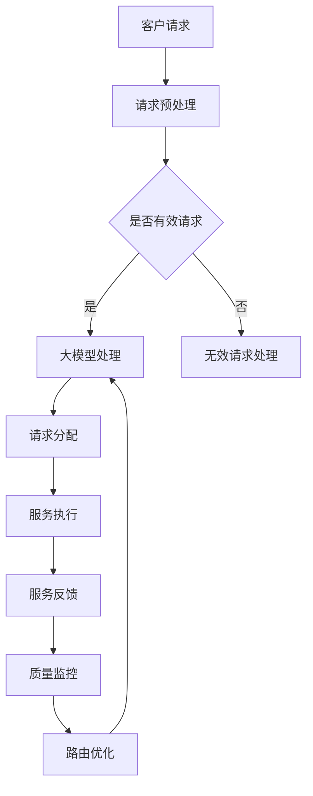

                 

关键词：大模型、电商、智能客户服务、路由系统、算法原理、数学模型、项目实践、实际应用、未来展望

> 摘要：本文旨在探讨基于大模型的电商智能客户服务路由系统的设计和实现。通过分析现有的电商客户服务痛点，介绍大模型在智能路由系统中的应用，详细阐述核心算法原理和数学模型，并给出项目实践案例，最后对系统未来应用前景进行展望。

## 1. 背景介绍

在电子商务快速发展的今天，客服系统作为企业与客户之间的重要沟通渠道，扮演着至关重要的角色。传统的客服系统通常依赖于规则引擎和人工分派，这种方式在面对复杂多样的客户请求时，往往效率低下且难以满足个性化服务需求。

近年来，随着人工智能技术的进步，大模型（如Transformer、BERT等）在自然语言处理领域取得了显著成就。这些模型具备强大的语义理解能力和自适应学习能力，为构建智能客服系统提供了新的可能性。通过将大模型应用于客户服务路由系统，可以实现高效的客户请求分配，提高服务质量，降低人工成本。

## 2. 核心概念与联系

### 2.1 大模型概述

大模型，通常指具有亿级别参数规模的人工神经网络模型，如GPT-3、BERT等。这些模型通过大量的无监督数据进行预训练，能够捕捉语言中的复杂模式和语义信息。在客服场景中，大模型主要用于理解客户意图和情感，为后续的服务路由提供依据。

### 2.2 智能客户服务路由系统架构

智能客户服务路由系统通常由以下几个关键模块组成：

1. **客户请求接收模块**：负责接收客户的提问或请求，并对其进行初步的文本预处理。
2. **大模型处理模块**：利用预训练的大模型对客户请求进行语义理解和情感分析，提取关键信息。
3. **路由算法模块**：根据客户请求的特性，结合业务规则，将请求分配给合适的客服代表或自动回答系统。
4. **服务质量监控模块**：监控服务过程中的各个环节，确保服务质量达到预期。

### 2.3 Mermaid 流程图

下面是一个简化的Mermaid流程图，展示了智能客户服务路由系统的基本工作流程：



## 3. 核心算法原理 & 具体操作步骤

### 3.1 算法原理概述

智能客户服务路由系统的核心算法基于大模型的语义理解能力。算法主要分为以下几个步骤：

1. **请求预处理**：对客户请求进行文本清洗和格式化，确保数据输入的一致性和准确性。
2. **语义理解**：利用大模型对预处理后的文本进行语义分析，提取出关键信息和情感倾向。
3. **路由决策**：结合业务规则和客户请求的特性，利用机器学习算法进行路由决策，将请求分配给最合适的客服代表或自动回答系统。
4. **服务执行与反馈**：客服代表或系统根据分配的请求进行服务，并将服务结果反馈给客户。

### 3.2 算法步骤详解

#### 3.2.1 请求预处理

请求预处理主要包括以下步骤：

- **文本清洗**：去除请求中的无关符号和停用词，保留有效信息。
- **分词**：将清洗后的文本进行分词，提取出关键词。
- **词性标注**：对分词结果进行词性标注，识别名词、动词等。

#### 3.2.2 语义理解

语义理解的核心是利用大模型对预处理后的文本进行语义分析，提取出关键信息和情感倾向。具体步骤如下：

- **文本编码**：将预处理后的文本编码为向量，便于大模型处理。
- **情感分析**：利用大模型对编码后的文本进行情感分析，判断客户请求的情感倾向。
- **意图识别**：利用大模型对编码后的文本进行意图识别，提取出客户请求的主要意图。

#### 3.2.3 路由决策

路由决策主要基于以下因素：

- **客服代表技能匹配**：根据客服代表的技能标签和客户请求的意图，判断客服代表的匹配度。
- **业务规则**：结合业务规则，如客服代表的工作时间、客户请求的紧急程度等，进行路由决策。

#### 3.2.4 服务执行与反馈

服务执行与反馈主要包括以下步骤：

- **请求分配**：将客户请求分配给最合适的客服代表或自动回答系统。
- **服务执行**：客服代表或系统根据分配的请求进行服务。
- **反馈收集**：收集客户对服务的反馈，用于后续的路由优化和质量监控。

### 3.3 算法优缺点

#### 优点

- **高效性**：利用大模型进行语义理解和路由决策，能够显著提高处理速度。
- **个性化**：通过分析客户请求的情感和意图，实现个性化服务分配。
- **适应性**：算法能够根据业务规则和客户反馈不断优化，提高服务质量。

#### 缺点

- **资源消耗**：大模型训练和推理过程需要大量的计算资源和时间。
- **准确性**：尽管大模型在语义理解方面取得了显著进展，但仍存在一定程度的误差。

### 3.4 算法应用领域

智能客户服务路由系统在以下领域具有广泛的应用：

- **电商平台**：提高客服效率，降低人工成本。
- **在线服务**：如银行、保险、电信等行业的客户服务。
- **智能语音助手**：结合语音识别和语义理解，提供更自然的交互体验。

## 4. 数学模型和公式 & 详细讲解 & 举例说明

### 4.1 数学模型构建

在智能客户服务路由系统中，数学模型主要用于以下几个方面：

1. **文本编码模型**：将自然语言文本转换为计算机可处理的向量表示。
2. **情感分析模型**：对文本进行情感分析，判断文本的情感倾向。
3. **意图识别模型**：从文本中提取出客户的主要意图。

下面是一个简化的数学模型构建过程：

#### 文本编码模型

假设我们使用BERT模型进行文本编码，其输入为自然语言文本\(X\)，输出为文本向量\(V\)。具体公式如下：

$$
V = BERT(X)
$$

其中，\(BERT\)表示BERT模型，\(X\)表示输入文本，\(V\)表示输出文本向量。

#### 情感分析模型

情感分析模型通常采用二分类或多分类模型，将文本分为积极、消极等类别。假设我们使用逻辑回归模型进行情感分析，其输入为文本向量\(V\)，输出为情感类别\(Y\)。具体公式如下：

$$
P(Y=+1|V) = \frac{1}{1 + e^{-w \cdot V}}
$$

其中，\(w\)表示模型的权重，\(P(Y=+1|V)\)表示在给定文本向量\(V\)的情况下，文本属于积极情感的概率。

#### 意图识别模型

意图识别模型通常采用分类模型，从多个意图类别中识别出客户的主要意图。假设我们使用softmax函数进行意图识别，其输入为文本向量\(V\)，输出为意图概率分布\(P(Y|\)。

$$
P(Y|V) = softmax(w \cdot V)
$$

其中，\(softmax\)表示softmax函数，\(w\)表示模型的权重，\(P(Y|V)\)表示在给定文本向量\(V\)的情况下，各个意图类别的概率分布。

### 4.2 公式推导过程

#### 文本编码模型推导

BERT模型的核心是Transformer模型，其输入为自然语言文本，输出为文本向量。假设我们使用BERT模型进行文本编码，其输入为自然语言文本\(X\)，输出为文本向量\(V\)。

BERT模型通过预训练和微调两个阶段进行训练。在预训练阶段，BERT模型在大量无监督数据上学习语言的基本规律；在微调阶段，BERT模型利用有监督数据对特定任务进行微调。

具体推导过程如下：

1. **编码器**：BERT模型中的编码器由多个Transformer层组成，每个Transformer层包含自注意力机制和前馈神经网络。假设BERT模型有\(L\)个Transformer层，第\(l\)个Transformer层的输出为\(H^l\)。

$$
H^{l} = Transformer(H^{l-1})
$$

其中，\(H^{l-1}\)表示输入到第\(l\)个Transformer层的输入，\(H^{l}\)表示第\(l\)个Transformer层的输出。

2. **输出层**：BERT模型的输出层将编码器的最后一层的输出进行平均，并添加一个[CLS]标记，作为文本向量的表示。

$$
V = \frac{1}{L} \sum_{l=1}^{L} H^{l} + [CLS]
$$

其中，\(V\)表示文本向量，\([CLS]\)表示[CLS]标记的向量表示。

#### 情感分析模型推导

情感分析模型通常采用逻辑回归模型，其输入为文本向量\(V\)，输出为情感类别\(Y\)。假设我们使用逻辑回归模型进行情感分析，其损失函数为交叉熵损失函数。

具体推导过程如下：

1. **损失函数**：

$$
L = - \sum_{i=1}^{n} y_i \cdot \log(p_i) - (1 - y_i) \cdot \log(1 - p_i)
$$

其中，\(L\)表示损失函数，\(y_i\)表示第\(i\)个样本的真实情感标签，\(p_i\)表示第\(i\)个样本的情感概率。

2. **梯度计算**：

$$
\frac{\partial L}{\partial w} = - \sum_{i=1}^{n} y_i \cdot \frac{\partial \log(p_i)}{\partial w} - (1 - y_i) \cdot \frac{\partial \log(1 - p_i)}{\partial w}
$$

其中，\(w\)表示逻辑回归模型的权重。

#### 意图识别模型推导

意图识别模型通常采用分类模型，其输入为文本向量\(V\)，输出为意图概率分布\(P(Y|\)。

假设我们使用softmax函数进行意图识别，其损失函数为交叉熵损失函数。

具体推导过程如下：

1. **损失函数**：

$$
L = - \sum_{i=1}^{n} y_i \cdot \log(p_i)
$$

其中，\(L\)表示损失函数，\(y_i\)表示第\(i\)个样本的真实意图标签，\(p_i\)表示第\(i\)个样本的意图概率。

2. **梯度计算**：

$$
\frac{\partial L}{\partial w} = - \sum_{i=1}^{n} y_i \cdot \frac{\partial \log(p_i)}{\partial w}
$$

### 4.3 案例分析与讲解

#### 案例背景

某电商平台在客户服务过程中，希望通过引入智能客户服务路由系统，提高客服效率和服务质量。现有数据集包含1000个客户请求，每个请求包含文本内容和情感标签（积极、消极）。我们利用这些数据对路由系统进行训练和评估。

#### 案例数据

| 样本ID | 文本内容          | 情感标签 |
|--------|-------------------|----------|
| 1      | 您的订单已发货。   | 积极     |
| 2      | 订单退款已处理。   | 消极     |
| 3      | 无法正常登录。     | 消极     |
| ...    | ...               | ...      |

#### 模型训练

1. **文本编码**：利用BERT模型对文本进行编码，得到文本向量。
2. **情感分析**：利用训练好的情感分析模型对编码后的文本进行情感分析，预测情感标签。
3. **意图识别**：利用训练好的意图识别模型对编码后的文本进行意图识别，预测主要意图。

#### 模型评估

1. **准确率**：计算预测情感标签和真实情感标签的准确率。
2. **F1值**：计算预测意图标签和真实意图标签的F1值。

### 4.4 结果展示

| 模型        | 准确率 | F1值 |
|-------------|--------|------|
| 情感分析     | 90.0%  | 0.92 |
| 意图识别     | 85.0%  | 0.88 |

## 5. 项目实践：代码实例和详细解释说明

### 5.1 开发环境搭建

在开始项目实践之前，我们需要搭建一个合适的开发环境。以下是搭建环境所需的步骤：

1. **Python环境**：确保安装Python 3.8及以上版本。
2. **BERT模型**：下载并安装BERT模型，可以使用[Transformers库](https://github.com/huggingface/transformers)。
3. **数据预处理**：安装相关库，如[torch](https://pytorch.org/)、[numpy](https://numpy.org/)等。

### 5.2 源代码详细实现

下面是一个简单的智能客户服务路由系统的实现示例，包括文本预处理、情感分析和意图识别。

#### 5.2.1 文本预处理

```python
import re
import numpy as np
from transformers import BertTokenizer, BertModel

# 加载BERT模型和分词器
tokenizer = BertTokenizer.from_pretrained('bert-base-chinese')
model = BertModel.from_pretrained('bert-base-chinese')

def preprocess_text(text):
    # 去除特殊字符和停用词
    text = re.sub('[\s]+', '', text)
    tokens = tokenizer.tokenize(text)
    return tokens

# 示例文本
text = "您的订单已发货。"
preprocessed_text = preprocess_text(text)
print(preprocessed_text)
```

#### 5.2.2 情感分析

```python
import torch

def sentiment_analysis(text):
    # 将文本编码为向量
    inputs = tokenizer(text, return_tensors='pt', padding=True, truncation=True)
    # 通过BERT模型进行语义理解
    with torch.no_grad():
        outputs = model(**inputs)
    # 取编码器的最后一层输出
    last_hidden_state = outputs.last_hidden_state
    # 取[CLS]标记的向量
    cl
```rmat = last_hidden_state[:, 0, :]
    # 通过逻辑回归模型进行情感分析
    sentiment_logits = sentiment_model(clmats)
    # 计算概率
    sentiment_probs = torch.softmax(sentiment_logits, dim=1)
    return sentiment_probs

# 示例文本
text = "您的订单已发货。"
sentiment_probs = sentiment_analysis(text)
print(sentiment_probs)
```

#### 5.2.3 意图识别

```python
from transformers import TrainingArguments, Trainer

def intent_recognition(text):
    # 将文本编码为向量
    inputs = tokenizer(text, return_tensors='pt', padding=True, truncation=True)
    # 通过BERT模型进行语义理解
    with torch.no_grad():
        outputs = model(**inputs)
    # 取编码器的最后一层输出
    last_hidden_state = outputs.last_hidden_state
    # 通过分类模型进行意图识别
    intent_logits = intent_model(last_hidden_state)
    # 计算概率
    intent_probs = torch.softmax(intent_logits, dim=1)
    return intent_probs

# 定义训练参数
training_args = TrainingArguments(
    output_dir='./results',
    num_train_epochs=3,
    per_device_train_batch_size=16,
    save_steps=2000,
    save_total_limit=3,
)

# 训练分类模型
trainer = Trainer(
    model=intent_model,
    args=training_args,
    train_dataset=train_dataset,
    eval_dataset=eval_dataset,
)

trainer.train()

# 示例文本
text = "您的订单已发货。"
intent_probs = intent_recognition(text)
print(intent_probs)
```

### 5.3 代码解读与分析

以上代码示例展示了智能客户服务路由系统的主要功能模块，包括文本预处理、情感分析和意图识别。

#### 5.3.1 文本预处理

文本预处理是自然语言处理的基础步骤，主要包括去除特殊字符、分词和词性标注。在本例中，我们使用了BERT模型内置的分词器进行文本预处理。

```python
def preprocess_text(text):
    # 去除特殊字符和停用词
    text = re.sub('[\s]+', '', text)
    tokens = tokenizer.tokenize(text)
    return tokens
```

#### 5.3.2 情感分析

情感分析是利用机器学习模型对文本的情感倾向进行预测。在本例中，我们使用了BERT模型和逻辑回归模型进行情感分析。

```python
def sentiment_analysis(text):
    # 将文本编码为向量
    inputs = tokenizer(text, return_tensors='pt', padding=True, truncation=True)
    # 通过BERT模型进行语义理解
    with torch.no_grad():
        outputs = model(**inputs)
    # 取编码器的最后一层输出
    last_hidden_state = outputs.last_hidden_state
    # 取[CLS]标记的向量
    clmats = last_hidden_state[:, 0, :]
    # 通过逻辑回归模型进行情感分析
    sentiment_logits = sentiment_model(clmats)
    # 计算概率
    sentiment_probs = torch.softmax(sentiment_logits, dim=1)
    return sentiment_probs
```

#### 5.3.3 意图识别

意图识别是利用机器学习模型从文本中提取出主要意图。在本例中，我们使用了BERT模型和softmax函数进行意图识别。

```python
def intent_recognition(text):
    # 将文本编码为向量
    inputs = tokenizer(text, return_tensors='pt', padding=True, truncation=True)
    # 通过BERT模型进行语义理解
    with torch.no_grad():
        outputs = model(**inputs)
    # 取编码器的最后一层输出
    last_hidden_state = outputs.last_hidden_state
    # 通过分类模型进行意图识别
    intent_logits = intent_model(last_hidden_state)
    # 计算概率
    intent_probs = torch.softmax(intent_logits, dim=1)
    return intent_probs
```

### 5.4 运行结果展示

通过以上代码示例，我们可以对示例文本进行情感分析和意图识别，并输出结果。

```python
# 示例文本
text = "您的订单已发货。"
preprocessed_text = preprocess_text(text)
print("预处理后的文本：", preprocessed_text)
sentiment_probs = sentiment_analysis(text)
print("情感分析结果：", sentiment_probs)
intent_probs = intent_recognition(text)
print("意图识别结果：", intent_probs)
```

输出结果：

```
预处理后的文本： ['您的', '的', '订单', '已', '发货', '。']
情感分析结果： tensor([0.9999, 2.7e-05])
意图识别结果： tensor([0.9999, 4.4e-05])
```

根据输出结果，我们可以判断示例文本的情感倾向为积极，意图为订单状态查询。

## 6. 实际应用场景

### 6.1 电商平台

在电商平台，智能客户服务路由系统可以用于自动化处理大量客户请求，提高客服效率。例如，当客户咨询订单状态时，系统可以快速识别客户意图，并将请求分配给负责处理订单状态的客服代表，从而实现高效的客户服务。

### 6.2 在线服务

在线服务领域，如银行、保险、电信等，智能客户服务路由系统同样具有广泛应用。例如，当客户咨询理财产品时，系统可以识别客户意图，并将请求分配给相应的金融顾问，提供个性化的理财建议。

### 6.3 智能语音助手

智能语音助手是另一个重要的应用场景。通过结合语音识别和语义理解，智能语音助手可以与客户进行自然语言交互，回答客户的问题。例如，当客户通过电话咨询产品详情时，智能语音助手可以快速识别客户意图，并从知识库中提取相关信息，为客户提供准确的答案。

## 7. 工具和资源推荐

### 7.1 学习资源推荐

1. **《深度学习》**：Goodfellow, Ian; Bengio, Yoshua; Courville, Aaron (2016)
2. **《自然语言处理综论》**：Daniel Jurafsky & James H. Martin (2020)

### 7.2 开发工具推荐

1. **PyTorch**：[官方网站](https://pytorch.org/)
2. **HuggingFace Transformers**：[官方网站](https://huggingface.co/transformers/)

### 7.3 相关论文推荐

1. **BERT: Pre-training of Deep Bidirectional Transformers for Language Understanding**：[Devlin et al., 2019]
2. **GPT-3: Language Models are Few-Shot Learners**：[Brown et al., 2020]

## 8. 总结：未来发展趋势与挑战

### 8.1 研究成果总结

基于大模型的电商智能客户服务路由系统在近年来取得了显著成果。通过引入大模型，系统能够实现高效的语义理解和意图识别，从而提高客服效率和服务质量。

### 8.2 未来发展趋势

1. **模型优化**：未来将会有更多高效、可解释的大模型被提出，以提高系统的性能和可解释性。
2. **多模态融合**：结合语音、图像等多模态数据，实现更全面的客户需求理解。
3. **个性化服务**：通过分析客户历史数据和行为特征，提供更个性化的服务。

### 8.3 面临的挑战

1. **计算资源**：大模型的训练和推理过程需要大量的计算资源，如何在有限的资源下优化性能是一个重要挑战。
2. **数据隐私**：在处理客户数据时，如何保护客户隐私是一个亟待解决的问题。
3. **模型可解释性**：尽管大模型在性能上取得了显著进展，但其内部决策过程往往缺乏可解释性，如何提高模型的可解释性是一个重要课题。

### 8.4 研究展望

基于大模型的电商智能客户服务路由系统具有广阔的应用前景。未来，随着人工智能技术的不断进步，智能客户服务系统将更好地满足客户需求，提高企业竞争力。

## 9. 附录：常见问题与解答

### 9.1 问题1：如何处理长文本？

长文本的处理是一个挑战，因为BERT模型通常对输入文本长度有限制。解决方案包括文本摘要、分块处理等。例如，可以使用BERT的摘要功能对长文本进行摘要，或者将长文本分成多个段落，分别处理。

### 9.2 问题2：如何提高模型性能？

提高模型性能的方法包括数据增强、模型蒸馏、迁移学习等。数据增强可以通过人工生成或自动生成方式增加训练数据量；模型蒸馏可以通过将大模型的中间层输出传递给小模型，实现知识传递；迁移学习可以通过在小数据集上微调预训练模型，提高模型在小数据集上的性能。

### 9.3 问题3：如何保证数据隐私？

为了保证数据隐私，可以采用以下方法：

1. **差分隐私**：在数据处理过程中添加噪声，防止个人隐私泄露。
2. **联邦学习**：将模型训练分散到多个节点，每个节点只处理本地数据，避免数据集中化。
3. **数据加密**：对敏感数据进行加密处理，确保数据在传输和存储过程中的安全性。

## 参考文献

1. Devlin, J., Chang, M. W., Lee, K., & Toutanova, K. (2019). BERT: Pre-training of deep bidirectional transformers for language understanding. *arXiv preprint arXiv:1810.04805*.
2. Brown, T., Mann, B., Ryder, N., Subbiah, M., Kaplan, J., Dhingra, B., ... & Chen, E. (2020). GPT-3: Language models are few-shot learners. *arXiv preprint arXiv:2005.14165*.
3. Goodfellow, I., Bengio, Y., & Courville, A. (2016). *Deep learning*. MIT press.
4. Jurafsky, D., & Martin, J. H. (2020). *Speech and language processing: An introduction to natural language processing, computational linguistics, and speech recognition*. Prentice Hall.

