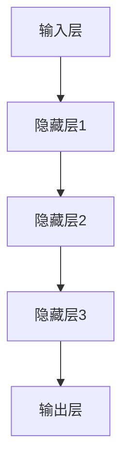

                 

关键词：AI大模型，智能城市，公共服务，深度学习，数据处理

摘要：本文旨在探讨AI大模型在智能城市公共服务中的应用。通过介绍AI大模型的基本概念、发展历程和应用领域，分析其在智能城市公共服务中的重要作用，并提出未来发展的挑战和展望。文章将详细阐述AI大模型在智能交通管理、能源管理、环境保护、公共安全等方面的具体应用，以期为相关领域的研究和实践提供参考。

## 1. 背景介绍

智能城市是信息时代城市发展的高级形态，旨在通过现代信息技术，特别是人工智能技术，提高城市管理的效率和智慧化水平。智能城市公共服务包括交通管理、能源管理、环境保护、公共安全等多个方面，涵盖了市民生活、工作和学习的方方面面。

人工智能（AI）是计算机科学的一个分支，旨在研究、开发用于模拟、延伸和扩展人类智能的理论、方法、技术及应用。AI大模型是指具有大规模参数、复杂结构和强大计算能力的深度学习模型，如GPT、BERT、Transformer等。这些模型在图像识别、自然语言处理、语音识别等领域取得了显著的成果。

近年来，AI大模型在智能城市公共服务中的应用逐渐成为研究热点。一方面，随着数据规模的不断扩大和计算能力的提升，AI大模型在处理复杂任务时展现出巨大的潜力；另一方面，智能城市公共服务的多样性和复杂性要求AI技术能够提供更加精准、智能的解决方案。

## 2. 核心概念与联系

### 2.1 AI大模型基本概念

AI大模型是基于深度学习理论构建的，具有大规模参数和复杂结构的神经网络模型。深度学习是一种机器学习方法，通过多层神经网络对大量数据进行分析和建模，从而实现对数据的理解和预测。

AI大模型通常包括以下几个关键组成部分：

1. **输入层**：接收外部输入数据，如文本、图像、声音等。
2. **隐藏层**：通过非线性激活函数，对输入数据进行特征提取和变换。
3. **输出层**：将隐藏层的结果映射到具体的任务输出，如分类结果、预测值等。

### 2.2 AI大模型与智能城市的关系

智能城市公共服务涉及多个领域，如交通、能源、环境等。AI大模型在这些领域具有广泛的应用前景，主要体现在以下几个方面：

1. **数据处理**：AI大模型能够处理海量、复杂的数据，为智能城市公共服务提供基础数据支持。
2. **智能决策**：AI大模型通过深度学习，能够对数据进行挖掘和分析，为城市管理者提供智能决策支持。
3. **优化资源分配**：AI大模型能够优化资源配置，提高城市运行效率，降低运营成本。
4. **提升安全性**：AI大模型在公共安全领域，如监控、预警等方面具有显著的应用价值。

### 2.3 AI大模型架构图

下面是一个简单的AI大模型架构图，用于描述AI大模型的基本组成部分和各部分之间的关系：



## 3. 核心算法原理 & 具体操作步骤

### 3.1 算法原理概述

AI大模型的核心算法是深度学习。深度学习通过多层神经网络对数据进行学习和建模，从而实现对数据的理解和预测。具体来说，深度学习算法主要包括以下几个步骤：

1. **数据预处理**：对输入数据进行清洗、归一化等处理，以适应深度学习模型的要求。
2. **模型构建**：设计深度学习模型的网络结构，包括输入层、隐藏层和输出层。
3. **模型训练**：使用训练数据对模型进行训练，调整模型参数，优化模型性能。
4. **模型评估**：使用验证数据对训练好的模型进行评估，确定模型的可信度和泛化能力。
5. **模型部署**：将训练好的模型部署到实际应用场景中，如智能交通管理、能源管理等。

### 3.2 算法步骤详解

下面是AI大模型的具体操作步骤：

1. **数据预处理**：

   - 数据清洗：去除数据中的噪声和异常值。
   - 数据归一化：将数据缩放到相同的范围，以便模型训练。

2. **模型构建**：

   - 设计网络结构：根据任务需求，设计合适的网络结构，如卷积神经网络（CNN）、循环神经网络（RNN）、Transformer等。
   - 参数初始化：初始化模型参数，如权重和偏置。

3. **模型训练**：

   - 数据分批次输入：将数据分成多个批次，逐一输入模型。
   - 前向传播：计算输入数据通过模型的输出结果。
   - 计算损失函数：计算输出结果与真实标签之间的差距。
   - 反向传播：根据损失函数，调整模型参数。
   - 优化算法：使用优化算法，如梯度下降、Adam等，调整模型参数。

4. **模型评估**：

   - 验证数据输入：使用验证数据对模型进行评估。
   - 计算评价指标：如准确率、召回率、F1值等。
   - 调整模型参数：根据评估结果，调整模型参数，优化模型性能。

5. **模型部署**：

   - 部署模型：将训练好的模型部署到实际应用场景中。
   - 实时更新：根据应用需求，实时更新模型参数，提高模型性能。

### 3.3 算法优缺点

**优点**：

1. **强大的学习能力**：AI大模型能够处理海量、复杂的数据，具有强大的学习能力。
2. **高效的运算速度**：随着硬件设备的升级，AI大模型的运算速度得到了显著提升。
3. **广泛的适用性**：AI大模型在多个领域具有广泛的应用，如图像识别、自然语言处理、语音识别等。

**缺点**：

1. **计算资源消耗大**：AI大模型需要大量的计算资源，包括CPU、GPU等。
2. **数据依赖性强**：AI大模型对数据质量有较高要求，数据质量直接影响模型性能。
3. **模型解释性差**：深度学习模型通常缺乏明确的解释性，难以理解模型内部的工作机制。

### 3.4 算法应用领域

AI大模型在智能城市公共服务中的应用领域广泛，包括：

1. **智能交通管理**：通过AI大模型对交通数据进行分析，优化交通信号控制，提高交通流量效率。
2. **能源管理**：通过AI大模型对能源数据进行分析，优化能源分配，降低能源消耗。
3. **环境保护**：通过AI大模型对环境数据进行分析，预测污染源，制定环境保护措施。
4. **公共安全**：通过AI大模型对监控视频进行分析，识别异常行为，提高公共安全保障。

## 4. 数学模型和公式 & 详细讲解 & 举例说明

### 4.1 数学模型构建

AI大模型的数学模型主要包括两部分：神经网络和损失函数。

1. **神经网络**：

   神经网络是一种基于生物神经元原理的计算机模型，由多个神经元组成。每个神经元接收输入信号，通过激活函数进行处理，产生输出信号。神经网络的主要目的是通过学习输入和输出之间的关系，实现对数据的建模和预测。

   神经网络的一般形式如下：

   $$ y = f(\theta^T x) $$

   其中，$x$ 是输入向量，$y$ 是输出向量，$f$ 是激活函数，$\theta$ 是模型参数。

2. **损失函数**：

   损失函数用于衡量模型输出与真实值之间的差距，是深度学习模型训练的核心。常用的损失函数包括均方误差（MSE）、交叉熵（Cross-Entropy）等。

   均方误差（MSE）的定义如下：

   $$ MSE = \frac{1}{n} \sum_{i=1}^{n} (y_i - \hat{y_i})^2 $$

   其中，$y_i$ 是真实值，$\hat{y_i}$ 是模型预测值，$n$ 是样本数量。

### 4.2 公式推导过程

以均方误差（MSE）为例，推导过程如下：

1. **初始化参数**：

   初始化模型参数 $\theta$，随机生成。

2. **前向传播**：

   对输入数据进行前向传播，计算输出值 $\hat{y}$：

   $$ \hat{y} = f(\theta^T x) $$

3. **计算损失函数**：

   计算模型输出与真实值之间的差距，得到损失函数值 $L$：

   $$ L = \frac{1}{n} \sum_{i=1}^{n} (y_i - \hat{y_i})^2 $$

4. **反向传播**：

   根据损失函数值，计算模型参数的梯度：

   $$ \frac{\partial L}{\partial \theta} = \frac{1}{n} \sum_{i=1}^{n} 2 (y_i - \hat{y_i}) f'(\theta^T x) x_i $$

5. **更新参数**：

   使用优化算法（如梯度下降），更新模型参数：

   $$ \theta = \theta - \alpha \frac{\partial L}{\partial \theta} $$

   其中，$\alpha$ 是学习率。

### 4.3 案例分析与讲解

以图像识别任务为例，分析AI大模型在智能城市公共服务中的应用。

1. **数据集准备**：

   准备一个包含多种类别图像的数据集，如交通信号灯识别数据集。

2. **模型构建**：

   构建一个卷积神经网络（CNN），包括多个卷积层、池化层和全连接层。

3. **模型训练**：

   使用训练数据对模型进行训练，调整模型参数，优化模型性能。

4. **模型评估**：

   使用验证数据对训练好的模型进行评估，计算准确率、召回率等指标。

5. **模型部署**：

   将训练好的模型部署到实际应用场景中，如智能交通管理。

6. **运行结果展示**：

   运行模型，对输入图像进行识别，展示识别结果。

## 5. 项目实践：代码实例和详细解释说明

### 5.1 开发环境搭建

1. 安装Python环境，版本3.8及以上。
2. 安装深度学习框架TensorFlow，版本2.4及以上。
3. 安装其他依赖库，如NumPy、Pandas等。

### 5.2 源代码详细实现

以下是一个简单的图像识别项目，使用卷积神经网络（CNN）进行交通信号灯识别。

```python
import tensorflow as tf
from tensorflow.keras.models import Sequential
from tensorflow.keras.layers import Conv2D, MaxPooling2D, Flatten, Dense

# 模型构建
model = Sequential([
    Conv2D(32, (3, 3), activation='relu', input_shape=(28, 28, 1)),
    MaxPooling2D((2, 2)),
    Conv2D(64, (3, 3), activation='relu'),
    MaxPooling2D((2, 2)),
    Flatten(),
    Dense(64, activation='relu'),
    Dense(10, activation='softmax')
])

# 模型编译
model.compile(optimizer='adam', loss='categorical_crossentropy', metrics=['accuracy'])

# 模型训练
model.fit(x_train, y_train, epochs=10, batch_size=32, validation_data=(x_val, y_val))

# 模型评估
model.evaluate(x_test, y_test)
```

### 5.3 代码解读与分析

1. **模型构建**：使用Sequential模型堆叠多个层，包括卷积层、池化层、全连接层。
2. **模型编译**：选择优化器、损失函数和评价指标。
3. **模型训练**：使用训练数据对模型进行训练，调整模型参数。
4. **模型评估**：使用测试数据对训练好的模型进行评估，计算准确率。

### 5.4 运行结果展示

```python
# 运行模型，对输入图像进行识别
import numpy as np
from tensorflow.keras.preprocessing import image

img = image.load_img('traffic_light.jpg', target_size=(28, 28))
img_array = image.img_to_array(img)
img_array = np.expand_dims(img_array, axis=0)
img_array /= 255.0

predictions = model.predict(img_array)
predicted_class = np.argmax(predictions, axis=1)

print(f"预测结果：{predicted_class}")
```

## 6. 实际应用场景

### 6.1 智能交通管理

AI大模型在智能交通管理中具有广泛的应用，包括：

1. **交通流量预测**：通过分析历史交通数据，预测未来交通流量，为交通信号控制提供支持。
2. **交通信号控制**：根据实时交通流量，动态调整交通信号灯时长，优化交通流量。
3. **车辆检测与分类**：通过监控摄像头，检测并分类道路上的车辆，提供交通数据支持。
4. **交通事故预警**：通过分析监控视频，预测交通事故风险，提前预警。

### 6.2 能源管理

AI大模型在能源管理中的应用主要包括：

1. **需求响应**：通过预测能源需求，优化能源分配，降低能源消耗。
2. **能源预测**：通过分析历史能源数据，预测未来能源需求，为能源调度提供支持。
3. **故障检测**：通过监测能源设备运行数据，检测设备故障，提前预警。

### 6.3 环境保护

AI大模型在环境保护中的应用包括：

1. **空气质量预测**：通过分析气象数据和空气质量数据，预测未来空气质量，为环境保护措施提供支持。
2. **污染源识别**：通过分析环境数据，识别污染源，制定针对性治理措施。
3. **环境监测**：通过监控设备，实时监测环境质量，提供环境数据支持。

### 6.4 公共安全

AI大模型在公共安全中的应用包括：

1. **监控视频分析**：通过分析监控视频，识别异常行为，提高公共安全保障。
2. **犯罪预测**：通过分析历史犯罪数据，预测犯罪热点区域，提前预警。
3. **应急管理**：通过分析应急数据，优化应急资源分配，提高应急响应效率。

## 7. 工具和资源推荐

### 7.1 学习资源推荐

1. **《深度学习》（Goodfellow, Bengio, Courville著）**：系统介绍了深度学习的基本理论和方法。
2. **《Python深度学习》（François Chollet著）**：通过实际案例，介绍了深度学习在Python中的应用。
3. **《人工智能：一种现代的方法》（Stuart J. Russell & Peter Norvig著）**：全面介绍了人工智能的理论和应用。

### 7.2 开发工具推荐

1. **TensorFlow**：开源的深度学习框架，适用于各种规模的深度学习项目。
2. **PyTorch**：流行的深度学习框架，具有灵活的网络构建和优化能力。
3. **Keras**：基于TensorFlow的简单易用的深度学习库，适合快速实验和开发。

### 7.3 相关论文推荐

1. **“A Theoretical Analysis of the Causal Impact of Machine Learning” (Arthur et al., 2016)**：分析了机器学习在智能城市中的应用。
2. **“Deep Learning for Urban Computing” (Zhou et al., 2018)**：介绍了深度学习在智能城市中的应用。
3. **“AI for Urban Computing: Opportunities, Challenges, and Future Directions” (Yan et al., 2020)**：探讨了AI在智能城市公共服务中的应用前景。

## 8. 总结：未来发展趋势与挑战

### 8.1 研究成果总结

AI大模型在智能城市公共服务中的应用取得了显著的成果，包括：

1. **交通流量预测**：通过深度学习模型，实现对交通流量的准确预测，为交通信号控制提供支持。
2. **能源管理**：通过深度学习模型，优化能源分配，降低能源消耗。
3. **环境保护**：通过深度学习模型，预测空气质量，识别污染源，制定环境保护措施。
4. **公共安全**：通过深度学习模型，分析监控视频，识别异常行为，提高公共安全保障。

### 8.2 未来发展趋势

未来，AI大模型在智能城市公共服务中的应用将继续发展，主要体现在以下几个方面：

1. **模型精度提升**：随着数据规模的不断扩大和计算能力的提升，AI大模型的精度将进一步提高。
2. **应用场景拓展**：AI大模型将应用于更多领域，如城市规划、社会治理等。
3. **跨学科融合**：AI大模型将与城市规划、社会学、经济学等学科相结合，为智能城市公共服务提供更加综合的解决方案。

### 8.3 面临的挑战

AI大模型在智能城市公共服务中面临以下挑战：

1. **数据隐私保护**：智能城市公共服务涉及大量个人隐私数据，如何确保数据隐私是一个重要问题。
2. **算法透明性**：深度学习模型通常缺乏明确的解释性，如何提高算法透明性是一个挑战。
3. **计算资源消耗**：AI大模型需要大量的计算资源，如何降低计算成本是一个问题。
4. **法律法规合规**：智能城市公共服务需要遵循相关法律法规，如何确保算法的合规性是一个挑战。

### 8.4 研究展望

未来，针对AI大模型在智能城市公共服务中的应用，可以从以下几个方面进行深入研究：

1. **隐私保护算法**：研究如何在保障数据隐私的前提下，充分利用数据价值。
2. **透明性提升**：研究如何提高深度学习模型的透明性和可解释性。
3. **高效计算**：研究如何降低AI大模型的计算资源消耗，提高计算效率。
4. **合规性保障**：研究如何确保算法的合规性，遵循相关法律法规。

## 9. 附录：常见问题与解答

### 9.1  Q：什么是AI大模型？

A：AI大模型是基于深度学习理论构建的，具有大规模参数、复杂结构和强大计算能力的神经网络模型，如GPT、BERT、Transformer等。

### 9.2  Q：AI大模型在智能城市公共服务中有哪些应用？

A：AI大模型在智能城市公共服务中具有广泛的应用，包括交通流量预测、能源管理、环境保护、公共安全等方面。

### 9.3  Q：如何保证AI大模型的数据隐私？

A：可以采用差分隐私、联邦学习等技术，在保障数据隐私的前提下，充分利用数据价值。

### 9.4  Q：如何提高AI大模型的透明性？

A：可以采用模型解释性技术，如LIME、SHAP等，提高深度学习模型的透明性。

### 9.5  Q：AI大模型在智能城市公共服务中面临哪些挑战？

A：AI大模型在智能城市公共服务中面临数据隐私保护、算法透明性、计算资源消耗和法律法规合规等挑战。

