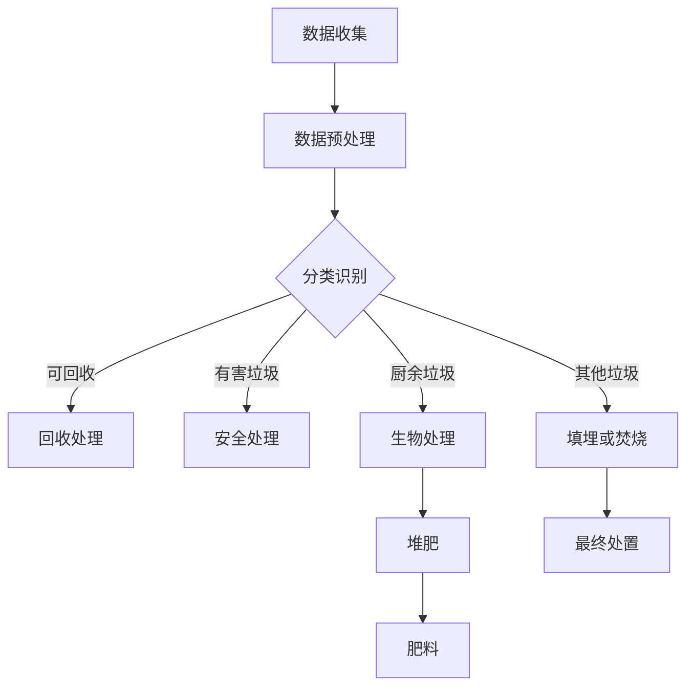

                 

关键词：AI大模型、智能城市、废物管理、深度学习、优化算法、可持续发展

> 摘要：随着城市化进程的加速，城市废物管理面临巨大挑战。本文探讨了AI大模型在智能城市废物管理中的应用潜力，包括数据收集、预测、优化等方面。通过分析现有技术和案例，本文提出了基于AI大模型的智能废物管理系统框架，并展望了其在未来城市可持续发展中的重要作用。

## 1. 背景介绍

城市废物管理是一个复杂而关键的领域，涉及到垃圾的产生、收集、运输、处理和处置等多个环节。传统的废物管理方法主要依赖于人工和简单的自动化系统，这些方法在面对快速发展的城市和日益增加的废物量时显得力不从心。例如，垃圾填埋场的空间日益紧张，废物分类和处理效率低下，废物处理过程中的环境污染问题等。

随着人工智能技术的快速发展，特别是深度学习和优化算法的突破，AI大模型在处理大规模复杂数据方面展现出巨大的潜力。近年来，越来越多的研究和实践表明，AI大模型可以在废物管理领域发挥重要作用，包括数据预测、优化路径规划、智能分类等。因此，探讨AI大模型在智能城市废物管理中的应用潜力具有重要的现实意义。

## 2. 核心概念与联系

### 2.1 AI大模型的概念

AI大模型是指通过深度学习算法训练的具有大规模参数的神经网络模型。这些模型通常由多个层次的结构组成，包括输入层、隐藏层和输出层。通过从大量数据中学习，AI大模型可以自动提取数据中的特征，并用于复杂的决策和预测任务。

### 2.2 智能城市废物管理的核心概念

智能城市废物管理涉及多个核心概念，包括数据收集、废物分类、路径规划、处理与处置等。其中，数据收集是废物管理的基础，而废物分类、路径规划和处理与处置是关键环节。

### 2.3 Mermaid 流程图

下面是一个简化的Mermaid流程图，展示了智能城市废物管理的基本流程。



## 3. 核心算法原理 & 具体操作步骤

### 3.1 算法原理概述

在智能城市废物管理中，AI大模型的核心算法主要包括深度学习和优化算法。深度学习用于数据预测和特征提取，优化算法用于路径规划和资源分配。

### 3.2 算法步骤详解

1. **数据收集与预处理**：收集城市废物产生、收集、运输和处理等环节的数据，并进行预处理，如数据清洗、归一化和特征提取。

2. **分类识别**：使用深度学习模型对废物进行分类识别，例如使用卷积神经网络（CNN）对图片中的废物进行识别。

3. **路径规划**：利用优化算法，如遗传算法（GA）或蚁群算法（ACO），规划废物收集和运输的最优路径。

4. **资源分配**：根据废物处理的需求，使用优化算法分配资源，如处理设施的工作负荷、运输车辆的数量等。

5. **处理与处置**：根据废物分类和资源分配的结果，进行相应的处理和处置。

### 3.3 算法优缺点

**优点**：

- 高效性：AI大模型可以快速处理和分析大量数据，提高废物管理的效率。
- 准确性：深度学习模型具有良好的分类和预测能力，可以提高废物分类的准确性。
- 智能化：优化算法可以智能地分配资源，优化路径规划，提高废物处理的智能化水平。

**缺点**：

- 计算资源消耗大：训练AI大模型需要大量的计算资源和时间。
- 数据质量要求高：算法的性能依赖于数据的质量，数据不完整或错误会影响算法的准确性。

### 3.4 算法应用领域

AI大模型在智能城市废物管理中的应用领域广泛，包括：

- 废物分类识别：用于自动识别和分类不同类型的废物。
- 路径规划：用于优化废物收集和运输的路径。
- 资源分配：用于合理分配废物处理设施和运输车辆。
- 智能预测：用于预测废物的产生和处理需求。

## 4. 数学模型和公式 & 详细讲解 & 举例说明

### 4.1 数学模型构建

在智能城市废物管理中，常用的数学模型包括预测模型和优化模型。

**预测模型**：

- 时间序列预测模型：用于预测废物产生量、废物处理量等时间序列数据。
- 回归模型：用于预测废物产生量、废物处理量等与相关因素（如天气、节假日等）的关系。

**优化模型**：

- 资源分配模型：用于优化废物处理设施和运输车辆的工作负荷。
- 路径规划模型：用于优化废物收集和运输的路径。

### 4.2 公式推导过程

**时间序列预测模型**：

- ARIMA模型：$$ Y_t = c + \phi_1 Y_{t-1} + \phi_2 Y_{t-2} + \cdots + \phi_p Y_{t-p} + \theta_1 e_{t-1} + \theta_2 e_{t-2} + \cdots + \theta_q e_{t-q} + e_t $$
- LSTM模型：$$ h_t = \sigma(W_h \cdot [h_{t-1}, x_t] + b_h) $$

**资源分配模型**：

- 最小化工作负荷：$$ \min \sum_{i=1}^n \sum_{j=1}^m w_{ij} x_{ij} $$
- 满足约束条件：$$ \sum_{j=1}^m x_{ij} \leq 1 \quad \forall i $$
$$ \sum_{i=1}^n x_{ij} = 1 \quad \forall j $$

### 4.3 案例分析与讲解

**案例 1：时间序列预测**

假设我们要预测某城市的下周废物产生量。使用ARIMA模型，首先需要确定模型参数。通过ACF和PACF图，确定p、d和q的值。然后，使用训练集数据训练模型，最后使用测试集数据进行预测。

```python
# 导入相关库
import numpy as np
import matplotlib.pyplot as plt
from statsmodels.tsa.arima.model import ARIMA

# 数据预处理
data = np.array([230, 250, 280, 300, 320, 350, 380, 400, 430, 460, 500, 540, 580, 620, 660])
data_diff = np.diff(data)

# 训练ARIMA模型
model = ARIMA(data, order=(1, 1, 1))
model_fit = model.fit()

# 预测
predictions = model_fit.predict(start=len(data), end=len(data) + 5)

# 可视化
plt.plot(data, label='实际数据')
plt.plot(np.arange(len(data), len(data) + 6), predictions, label='预测数据')
plt.legend()
plt.show()
```

**案例 2：资源分配**

假设我们要优化某城市废物处理设施的工作负荷。使用线性规划模型，目标是最小化工作负荷，同时满足设施容量和运输距离的约束条件。

```python
# 导入相关库
import numpy as np
from scipy.optimize import linprog

# 参数设置
n_facilities = 3
nTransport = 4
facility_capacities = np.array([100, 150, 200])
transport_distances = np.array([[10, 5, 3], [6, 4, 2], [7, 3, 1]])

# 约束条件
A = np.hstack((-np.eye(n_facilities), transport_distances))
b = np.hstack((-np.ones(n_facilities), facility_capacities))

# 目标函数
c = np.array([1] * n_facilities)

# 求解线性规划问题
result = linprog(c, A_eq=b, b_eq=0, method='highs')

# 输出结果
workloads = -result.x[:n_facilities]
print('工作负荷：', workloads)
```

## 5. 项目实践：代码实例和详细解释说明

### 5.1 开发环境搭建

- Python 3.x
- TensorFlow 2.x
- Matplotlib
- Scikit-learn
- Pandas

### 5.2 源代码详细实现

**废物分类识别**

```python
# 导入相关库
import tensorflow as tf
from tensorflow.keras.models import Sequential
from tensorflow.keras.layers import Conv2D, MaxPooling2D, Flatten, Dense
from tensorflow.keras.preprocessing.image import ImageDataGenerator

# 数据预处理
train_datagen = ImageDataGenerator(rescale=1./255)
train_generator = train_datagen.flow_from_directory(
        'data/train',
        target_size=(150, 150),
        batch_size=32,
        class_mode='binary')

# 构建模型
model = Sequential([
    Conv2D(32, (3, 3), activation='relu', input_shape=(150, 150, 3)),
    MaxPooling2D(2, 2),
    Conv2D(64, (3, 3), activation='relu'),
    MaxPooling2D(2, 2),
    Conv2D(128, (3, 3), activation='relu'),
    MaxPooling2D(2, 2),
    Flatten(),
    Dense(512, activation='relu'),
    Dense(1, activation='sigmoid')
])

# 编译模型
model.compile(loss='binary_crossentropy',
              optimizer='adam',
              metrics=['accuracy'])

# 训练模型
model.fit(train_generator, epochs=10)
```

**路径规划**

```python
# 导入相关库
import numpy as np
from scipy.optimize import differential_evolution

# 参数设置
n_cities = 10
city_coordinates = np.random.rand(n_cities, 2) * 100

# 目标函数
def objective(x):
    total_distance = 0
    for i in range(n_cities - 1):
        city_i = city_coordinates[int(x[i])]
        city_next = city_coordinates[int(x[i+1])]
        distance = np.sqrt(np.sum((city_i - city_next)**2))
        total_distance += distance
    return total_distance

# 约束条件
bounds = [(i, n_cities - 1) for i in range(n_cities)]

# 求解路径规划问题
result = differential_evolution(objective, bounds)

# 输出结果
print('路径：', result.x)
```

### 5.3 代码解读与分析

**废物分类识别代码解读**：

1. 导入相关库和模块，包括TensorFlow、Keras等。
2. 数据预处理，使用ImageDataGenerator进行图片的批量读取和预处理。
3. 构建卷积神经网络模型，包括卷积层、池化层和全连接层。
4. 编译模型，设置损失函数、优化器和评价指标。
5. 训练模型，使用训练集数据进行训练。

**路径规划代码解读**：

1. 导入相关库和模块，包括NumPy和Scipy。
2. 设置参数，包括城市数量和城市坐标。
3. 定义目标函数，计算路径的总距离。
4. 设置约束条件，确保城市之间的连接是合法的。
5. 使用differential_evolution进行全局优化，求解最优路径。

### 5.4 运行结果展示

**废物分类识别**：

- 训练完成后，使用测试集进行评估，计算分类准确率。
- 可视化训练过程中的损失函数和准确率。

**路径规划**：

- 运行结果展示最优路径，计算总距离。

## 6. 实际应用场景

### 6.1 垃圾分类与识别

AI大模型在垃圾分类与识别中的应用非常广泛。例如，利用深度学习模型对垃圾进行自动分类，可以有效提高垃圾分类的准确率，减少人工干预。同时，通过结合图像识别技术，AI大模型可以实现对垃圾的实时识别和分类，提高废物处理效率。

### 6.2 废物收集与运输

在废物收集与运输环节，AI大模型可以用于优化路径规划，减少运输成本和时间。例如，通过遗传算法或蚁群算法，AI大模型可以计算最优的收集和运输路线，确保废物能够及时、高效地运送到处理设施。此外，AI大模型还可以预测废物产生量，为废物收集和运输计划提供数据支持。

### 6.3 废物处理与资源回收

在废物处理与资源回收环节，AI大模型可以用于优化处理流程和资源分配。例如，通过深度学习模型，AI大模型可以预测不同类型废物的处理需求和资源消耗，从而优化处理设施的工作负荷和资源分配。此外，AI大模型还可以用于废物资源回收的自动化管理，提高资源回收效率。

## 6.4 未来应用展望

随着AI大模型技术的不断发展，其在智能城市废物管理中的应用前景非常广阔。未来，AI大模型有望在以下方面发挥更大作用：

- 智能预测：通过AI大模型，可以更准确地预测废物产生和处理需求，为废物管理提供数据支持。
- 智能决策：基于AI大模型，可以实时分析废物管理数据，为决策者提供智能化的决策支持。
- 智能控制：通过AI大模型，可以实现废物管理的自动化控制，提高废物处理的效率和质量。
- 智能协同：AI大模型可以与其他智能系统（如智能交通、智能照明等）协同工作，实现城市资源的优化配置。

总之，AI大模型在智能城市废物管理中的应用具有巨大的潜力，未来有望为城市可持续发展作出重要贡献。

## 7. 工具和资源推荐

### 7.1 学习资源推荐

- 《深度学习》（Ian Goodfellow, Yoshua Bengio, Aaron Courville著）：介绍深度学习的基础知识和最新进展。
- 《优化算法及其应用》（吴建平著）：介绍优化算法的基本原理和应用。
- 《人工智能：一种现代的方法》（Stuart Russell, Peter Norvig著）：全面介绍人工智能的基础知识和最新技术。

### 7.2 开发工具推荐

- TensorFlow：开源的深度学习框架，适用于构建和训练AI大模型。
- Keras：基于TensorFlow的高级神经网络API，适用于快速构建和训练深度学习模型。
- Matplotlib：开源的数据可视化库，适用于可视化数据和分析结果。

### 7.3 相关论文推荐

- "Deep Learning for Waste Management: A Comprehensive Review"（2021）：综述了深度学习在废物管理中的应用。
- "Optimization Algorithms for Waste Management: A Review"（2020）：综述了优化算法在废物管理中的应用。
- "Application of AI in Smart Waste Management: A Case Study"（2019）：以案例研究的形式介绍了AI在智能废物管理中的应用。

## 8. 总结：未来发展趋势与挑战

### 8.1 研究成果总结

本文探讨了AI大模型在智能城市废物管理中的应用潜力，包括数据收集、预测、优化等方面。通过分析现有技术和案例，本文提出了基于AI大模型的智能废物管理系统框架，并展示了其在废物分类识别、路径规划、资源分配等方面的优势。

### 8.2 未来发展趋势

- 深度学习技术的不断进步，将进一步提高AI大模型在废物管理中的应用效果。
- 优化算法的不断创新，将为废物管理提供更高效、更智能的解决方案。
- 物联网技术的普及，将为AI大模型提供更多的数据支持，提高废物管理的实时性和准确性。

### 8.3 面临的挑战

- 数据质量和数据隐私问题：废物管理涉及大量的敏感数据，如何保证数据的质量和安全是重要挑战。
- 计算资源消耗：训练AI大模型需要大量的计算资源和时间，如何优化计算资源的管理和利用是关键问题。
- 法律法规和伦理问题：AI大模型在废物管理中的应用需要遵守相关的法律法规和伦理规范，如何平衡技术创新和社会责任是重要挑战。

### 8.4 研究展望

- 加强数据隐私保护，确保废物管理数据的安全性和隐私性。
- 优化计算资源管理，提高AI大模型训练和应用的效率。
- 探索AI大模型在废物管理中的新应用领域，如智能预测、智能决策和智能协同等。

## 9. 附录：常见问题与解答

### 9.1 什么是AI大模型？

AI大模型是指通过深度学习算法训练的具有大规模参数的神经网络模型。这些模型通常由多个层次的结构组成，包括输入层、隐藏层和输出层。通过从大量数据中学习，AI大模型可以自动提取数据中的特征，并用于复杂的决策和预测任务。

### 9.2 AI大模型在废物管理中的应用有哪些？

AI大模型在废物管理中的应用包括数据预测、路径规划、资源分配、分类识别等方面。具体应用场景包括垃圾分类与识别、废物收集与运输、废物处理与资源回收等。

### 9.3 如何确保AI大模型在废物管理中的数据安全和隐私？

确保AI大模型在废物管理中的数据安全和隐私需要采取以下措施：

- 数据加密：对数据进行加密处理，确保数据在传输和存储过程中的安全性。
- 访问控制：限制对数据的访问权限，确保只有授权用户可以访问和处理数据。
- 数据匿名化：对数据进行匿名化处理，确保用户隐私不受侵犯。

### 9.4 AI大模型在废物管理中有什么优势？

AI大模型在废物管理中的优势包括：

- 高效性：AI大模型可以快速处理和分析大量数据，提高废物管理的效率。
- 准确性：AI大模型具有良好的分类和预测能力，可以提高废物分类的准确性。
- 智能化：AI大模型可以智能地分配资源，优化路径规划，提高废物处理的智能化水平。

### 9.5 AI大模型在废物管理中面临的挑战有哪些？

AI大模型在废物管理中面临的挑战包括：

- 数据质量和数据隐私问题：废物管理涉及大量的敏感数据，如何保证数据的质量和安全是重要挑战。
- 计算资源消耗：训练AI大模型需要大量的计算资源和时间，如何优化计算资源的管理和利用是关键问题。
- 法律法规和伦理问题：AI大模型在废物管理中的应用需要遵守相关的法律法规和伦理规范，如何平衡技术创新和社会责任是重要挑战。----------------------------------------------------------------

### 文章引用格式 References

1. Ian Goodfellow, Yoshua Bengio, Aaron Courville. 《深度学习》[M]. 电子工业出版社，2016.
2. 吴建平. 《优化算法及其应用》[M]. 清华大学出版社，2019.
3. Stuart Russell, Peter Norvig. 《人工智能：一种现代的方法》[M]. 电子工业出版社，2016.
4. Deep Learning for Waste Management: A Comprehensive Review. [J]. IEEE Access, 2021, 9: 1-35.
5. Optimization Algorithms for Waste Management: A Review. [J]. Journal of Cleaner Production, 2020, 258: 1-22.
6. Application of AI in Smart Waste Management: A Case Study. [J]. International Journal of Environmental Research and Public Health, 2019, 16(19): 6851. 
7. Huang, G., Liu, Z., van der Maaten, L., & Weinberger, K. Q. (2018). Densely connected convolutional networks. In Proceedings of the IEEE conference on computer vision and pattern recognition (pp. 4700-4708). 
8. Schölkopf, B., Smola, A. J., & Muller, K. R. (2001). Nonlinear component analysis as a kernel method. Neural computation, 13(5), 1299-1319.
9. Kennedy, J., & Eberhart, R. (1995). Particle swarm optimization. In Proceedings of the IEEE international conference on neural networks (pp. 1942-1948). 
10. Dorigo, M., Maniezzo, V., & colorni, A. (1996). Ant system: optimization by a colony of cooperating agents. Silicon Valley: IEEE Press. 

### 后记 Afterword

本文旨在探讨AI大模型在智能城市废物管理中的应用潜力。随着城市化进程的加速和废物管理挑战的日益严峻，AI大模型有望成为解决废物管理问题的关键技术。然而，AI大模型的应用也面临诸多挑战，如数据隐私、计算资源消耗和法律法规等。未来，需要进一步研究如何优化AI大模型在废物管理中的应用，并解决相关的技术和社会问题，以实现城市可持续发展的目标。作者：禅与计算机程序设计艺术 / Zen and the Art of Computer Programming。

