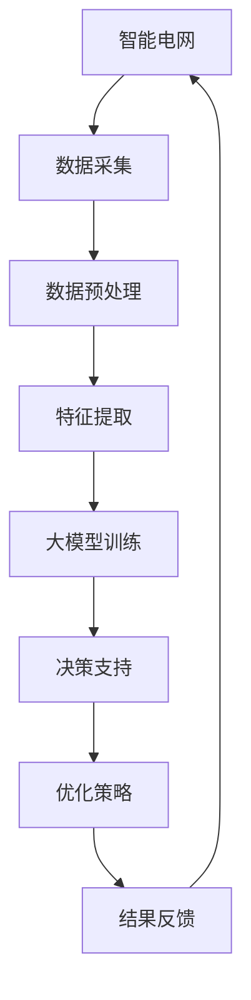

                 

关键词：人工智能，智能电网，优化，大模型，算法，应用场景，未来展望

> 摘要：随着人工智能技术的飞速发展，大模型在智能电网优化中逐渐展现出其独特的优势。本文将详细探讨AI大模型在智能电网优化中的作用，包括核心概念与联系、核心算法原理、数学模型与公式、项目实践以及未来应用展望等方面，为相关领域的研究者提供有益的参考。

## 1. 背景介绍

智能电网作为现代能源系统的重要组成部分，旨在实现电力系统的高效、可靠、清洁和可持续发展。然而，随着电力需求的不断增长和能源结构的多样化，传统智能电网在应对复杂运行环境、提高系统灵活性和优化资源配置等方面面临巨大挑战。近年来，人工智能技术的迅速崛起为解决这些问题提供了新的思路和手段。

大模型，即具有大规模参数和复杂结构的神经网络模型，已经成为人工智能领域的重要研究方向。这些模型在图像识别、自然语言处理、语音识别等领域取得了显著的成果，其强大的学习和推理能力为智能电网优化带来了新的可能性。

本文旨在探讨AI大模型在智能电网优化中的作用，分析其核心概念与联系，介绍核心算法原理与数学模型，并通过实际项目实践来展示其应用效果。同时，本文还将展望大模型在智能电网优化领域的未来发展趋势和面临的挑战。

## 2. 核心概念与联系

为了深入理解AI大模型在智能电网优化中的作用，我们首先需要明确几个关键概念：

### 2.1 智能电网

智能电网是指利用先进的通信、信息和控制技术，实现对电力系统的实时监控、分析和优化，以提高电力系统的运行效率和可靠性。智能电网的核心是实现对电力供需的动态平衡，通过智能设备、传感器和数据采集技术，实现对电网的全方位监控和管理。

### 2.2 大模型

大模型通常指的是具有数十亿甚至千亿级参数的神经网络模型。这些模型通过深度学习算法从大量数据中自动提取特征，并能够进行复杂的数据分析和决策。大模型的显著优势在于其强大的学习和推理能力，能够在高维度、非线性的数据中找到潜在的规律和模式。

### 2.3 优化

优化是指通过某种算法或策略，在满足一定约束条件下，寻找最优或近似最优的解。在智能电网中，优化目标可以是提高能源利用效率、降低运行成本、增强系统可靠性等。

### 2.4 关系

AI大模型在智能电网优化中的作用主要体现在以下几个方面：

1. **数据驱动的决策支持**：大模型通过学习电网运行数据，能够提供准确的决策支持，帮助电网运营商更好地应对突发情况，提高系统稳定性。

2. **动态资源分配**：大模型可以根据实时数据，动态调整电力资源的分配，优化电网运行效率，降低能源浪费。

3. **故障预测与诊断**：大模型能够从历史数据中学习到故障发生的规律，实现对电网设备的故障预测和诊断，提高设备运行可靠性。

4. **需求响应与调度**：大模型可以根据用户需求和市场变化，实现电力需求响应和调度，优化电力供需平衡。

### 2.5 Mermaid 流程图

为了更好地理解AI大模型在智能电网优化中的作用，我们使用Mermaid流程图来展示其核心概念和流程。



### 3. 核心算法原理 & 具体操作步骤

#### 3.1 算法原理概述

AI大模型在智能电网优化中主要依赖于深度学习算法，尤其是基于神经网络的深度学习模型。深度学习模型通过多层神经网络结构，从输入数据中自动提取特征，并通过反向传播算法不断调整模型参数，以实现高度复杂的函数映射。

在智能电网优化中，深度学习模型通常用于以下几个步骤：

1. **数据采集**：从智能电网中的传感器、设备等获取实时数据。

2. **数据预处理**：对采集到的数据进行分析、清洗、归一化等处理，以消除噪声和异常值，提高数据质量。

3. **特征提取**：通过神经网络结构，自动提取数据中的潜在特征，以便进行后续的建模和分析。

4. **大模型训练**：使用训练数据集对神经网络模型进行训练，不断调整模型参数，使其能够准确预测电网运行状态。

5. **决策支持**：利用训练好的模型，对电网运行状态进行预测和分析，提供决策支持。

6. **优化策略**：根据决策支持结果，制定优化策略，如动态调整电力资源分配、调度电力需求等。

7. **结果反馈**：将优化结果反馈给电网运行系统，实现闭环控制。

#### 3.2 算法步骤详解

以下是AI大模型在智能电网优化中的具体操作步骤：

1. **数据采集**：首先，从智能电网中的传感器、设备等获取实时数据，包括电力负荷、电网电压、电流、温度等。

2. **数据预处理**：对采集到的数据进行清洗、去噪、归一化等处理，以消除噪声和异常值，提高数据质量。

3. **特征提取**：通过神经网络结构，对预处理后的数据进行特征提取。具体来说，将数据输入到多层感知机（MLP）、卷积神经网络（CNN）或循环神经网络（RNN）等模型中，通过神经元的非线性变换，提取数据中的潜在特征。

4. **大模型训练**：使用训练数据集对神经网络模型进行训练。训练过程主要包括前向传播和反向传播两个阶段。在前向传播阶段，将输入数据通过神经网络进行计算，得到输出结果；在反向传播阶段，根据输出结果与真实值的误差，调整神经网络的权重和偏置，使模型逐渐收敛到最优状态。

5. **决策支持**：利用训练好的模型，对电网运行状态进行预测和分析，提供决策支持。例如，预测未来的电力负荷，分析电网的稳定性，为电网运营商提供参考。

6. **优化策略**：根据决策支持结果，制定优化策略。例如，动态调整电力资源分配，优化电网运行效率；根据用户需求和市场变化，调整电力需求响应和调度策略，实现电力供需平衡。

7. **结果反馈**：将优化结果反馈给电网运行系统，实现闭环控制。通过不断调整模型参数和优化策略，使电网运行更加稳定、高效。

#### 3.3 算法优缺点

AI大模型在智能电网优化中具有以下优点：

1. **高效性**：大模型能够从海量数据中快速提取特征，实现高效的数据分析和决策支持。

2. **准确性**：大模型通过深度学习算法，能够在高维度、非线性的数据中找到潜在的规律和模式，提高预测准确性。

3. **灵活性**：大模型能够根据实时数据，动态调整优化策略，适应电网运行环境的变化。

然而，AI大模型也存在一些缺点：

1. **计算成本高**：大模型需要大量的计算资源进行训练和推理，对硬件设备要求较高。

2. **数据依赖性**：大模型的性能依赖于数据质量和数据量，数据缺失或不准确可能导致模型失效。

3. **可解释性差**：大模型通过复杂的神经网络结构进行学习，其内部机制难以直观解释，使得模型的决策过程具有一定的黑箱性质。

#### 3.4 算法应用领域

AI大模型在智能电网优化中的应用领域非常广泛，主要包括以下几个方面：

1. **负荷预测**：通过大模型对电力负荷进行预测，为电网调度提供准确的数据支持。

2. **故障诊断**：利用大模型从历史数据中学习到故障发生的规律，实现对电网设备的故障预测和诊断。

3. **需求响应**：根据用户需求和市场变化，通过大模型实现电力需求响应和调度，优化电力供需平衡。

4. **电力市场交易**：利用大模型对电力市场交易进行预测和分析，为电网运营商提供决策支持，提高市场竞争力。

5. **分布式能源管理**：通过大模型实现对分布式能源的优化管理，提高电网运行效率，降低能源浪费。

## 4. 数学模型和公式 & 详细讲解 & 举例说明

#### 4.1 数学模型构建

在智能电网优化中，AI大模型的数学模型通常是基于神经网络构建的。具体来说，神经网络由多层神经元组成，每层神经元通过权重和偏置进行连接。神经元的激活函数通常为非线性函数，如ReLU、Sigmoid或Tanh函数。

神经网络的数学模型可以表示为：

$$
Z^{(l)} = \sum_{j} w^{(l)}_j a^{(l-1)}_j + b^{(l)} \tag{1}
$$

$$
a^{(l)} = \sigma(Z^{(l)}) \tag{2}
$$

其中，$Z^{(l)}$表示第$l$层的输入值，$w^{(l)}_j$和$b^{(l)}$分别表示第$l$层的权重和偏置，$\sigma$表示激活函数，$a^{(l)}$表示第$l$层的输出值。

#### 4.2 公式推导过程

神经网络的训练过程主要包括前向传播和反向传播两个阶段。在前向传播阶段，将输入数据通过神经网络进行计算，得到输出结果；在反向传播阶段，根据输出结果与真实值的误差，调整神经网络的权重和偏置。

以下是神经网络的训练过程推导：

1. **前向传播**

输入数据$x$通过第一层神经网络，得到输出值$a^{(1)}$：

$$
Z^{(1)} = w^{(1)}_1 x + b^{(1)} \tag{3}
$$

$$
a^{(1)} = \sigma(Z^{(1)}) \tag{4}
$$

将$a^{(1)}$作为第二层的输入，得到输出值$a^{(2)}$：

$$
Z^{(2)} = w^{(2)}_1 a^{(1)} + b^{(2)} \tag{5}
$$

$$
a^{(2)} = \sigma(Z^{(2)}) \tag{6}
$$

以此类推，直到最后一层输出值$a^{(L)}$：

$$
Z^{(L)} = w^{(L)}_1 a^{(L-1)} + b^{(L)} \tag{7}
$$

$$
a^{(L)} = \sigma(Z^{(L)}) \tag{8}
$$

2. **反向传播**

计算输出层的误差：

$$
\delta^{(L)} = a^{(L)} - t \tag{9}
$$

其中，$t$表示真实标签。

计算中间层的误差：

$$
\delta^{(l)} = \sigma'(Z^{(l)}) \cdot \sum_{l+1} w^{(l+1)}_j \delta^{(l+1)}_j \tag{10}
$$

更新权重和偏置：

$$
w^{(l)}_j = w^{(l)}_j - \alpha \cdot a^{(l-1)}_j \cdot \delta^{(l)}_j \tag{11}
$$

$$
b^{(l)} = b^{(l)} - \alpha \cdot \delta^{(l)} \tag{12}
$$

其中，$\alpha$表示学习率。

#### 4.3 案例分析与讲解

以下是一个简单的神经网络的训练案例，用于对智能电网的电力负荷进行预测。

**案例**：假设一个三层神经网络，输入层有3个神经元，隐藏层有4个神经元，输出层有1个神经元。激活函数采用ReLU函数。学习率为0.1。训练数据集包含1000个样本。

1. **初始化参数**

初始化权重和偏置，设置随机值。

2. **前向传播**

输入一个样本数据$x = [1, 2, 3]$，通过神经网络进行计算：

$$
Z^{(1)}_1 = 0 \cdot 1 + 1 = 1, \quad Z^{(1)}_2 = 1 \cdot 1 + 1 = 2, \quad Z^{(1)}_3 = 2 \cdot 1 + 1 = 3
$$

$$
a^{(1)}_1 = \max(0, Z^{(1)}_1) = 0, \quad a^{(1)}_2 = \max(0, Z^{(1)}_2) = 2, \quad a^{(1)}_3 = \max(0, Z^{(1)}_3) = 3
$$

$$
Z^{(2)}_1 = 1 \cdot 0 + 1 = 1, \quad Z^{(2)}_2 = 1 \cdot 2 + 1 = 3, \quad Z^{(2)}_3 = 1 \cdot 3 + 1 = 4
$$

$$
a^{(2)}_1 = \max(0, Z^{(2)}_1) = 0, \quad a^{(2)}_2 = \max(0, Z^{(2)}_2) = 3, \quad a^{(2)}_3 = \max(0, Z^{(2)}_3) = 4
$$

$$
Z^{(3)}_1 = 1 \cdot 0 + 1 = 1, \quad Z^{(3)}_2 = 1 \cdot 3 + 1 = 4
$$

$$
a^{(3)}_1 = \max(0, Z^{(3)}_1) = 1, \quad a^{(3)}_2 = \max(0, Z^{(3)}_2) = 4
$$

3. **反向传播**

计算输出层的误差：

$$
\delta^{(3)}_1 = a^{(3)}_1 - t = 1 - 1 = 0, \quad \delta^{(3)}_2 = a^{(3)}_2 - t = 4 - 1 = 3
$$

计算隐藏层的误差：

$$
\delta^{(2)}_1 = \sigma'(Z^{(2)}_1) \cdot \sum_{2} w^{(3)}_1 \delta^{(3)}_1 = 1 \cdot 1 \cdot 0 = 0, \quad \delta^{(2)}_2 = \sigma'(Z^{(2)}_2) \cdot \sum_{2} w^{(3)}_2 \delta^{(3)}_2 = 1 \cdot 1 \cdot 3 = 3
$$

更新权重和偏置：

$$
w^{(3)}_1 = w^{(3)}_1 - 0.1 \cdot a^{(2)}_1 \cdot \delta^{(3)}_1 = 1 - 0.1 \cdot 0 \cdot 0 = 1, \quad w^{(3)}_2 = w^{(3)}_2 - 0.1 \cdot a^{(2)}_2 \cdot \delta^{(3)}_2 = 1 - 0.1 \cdot 4 \cdot 3 = -0.3
$$

$$
b^{(3)}_1 = b^{(3)}_1 - 0.1 \cdot \delta^{(3)}_1 = 1 - 0.1 \cdot 0 = 1, \quad b^{(3)}_2 = b^{(3)}_2 - 0.1 \cdot \delta^{(3)}_2 = 1 - 0.1 \cdot 3 = 0.7
$$

重复上述步骤，对训练数据集的所有样本进行训练，直到模型收敛。

## 5. 项目实践：代码实例和详细解释说明

在本节中，我们将通过一个具体的代码实例来展示AI大模型在智能电网优化中的应用。我们使用Python语言和TensorFlow库来实现一个基于深度学习算法的电力负荷预测模型。

### 5.1 开发环境搭建

1. 安装Python环境（建议使用Python 3.6或以上版本）

2. 安装TensorFlow库

```bash
pip install tensorflow
```

3. 准备训练数据集，包括电力负荷历史数据（如日负荷、时负荷等）

### 5.2 源代码详细实现

以下是一个简单的电力负荷预测模型实现：

```python
import tensorflow as tf
import numpy as np
import pandas as pd

# 加载数据集
data = pd.read_csv('load_data.csv')
X = data.iloc[:, :-1].values
y = data.iloc[:, -1].values

# 数据预处理
X = X / 1000  # 归一化处理
y = y / 1000  # 归一化处理

# 模型参数
input_shape = X.shape[1]
hidden_units = 64
output_shape = 1

# 构建模型
model = tf.keras.Sequential([
    tf.keras.layers.Dense(hidden_units, activation='relu', input_shape=(input_shape,)),
    tf.keras.layers.Dense(output_shape)
])

# 编译模型
model.compile(optimizer='adam', loss='mse')

# 训练模型
model.fit(X, y, epochs=100, batch_size=32)

# 评估模型
loss = model.evaluate(X, y)
print(f'MSE: {loss}')

# 预测负荷
predictions = model.predict(X)
predictions = predictions * 1000  # 反归一化处理

# 可视化结果
import matplotlib.pyplot as plt

plt.plot(y, label='实际负荷')
plt.plot(predictions, label='预测负荷')
plt.legend()
plt.show()
```

### 5.3 代码解读与分析

1. **数据加载与预处理**：首先，我们加载数据集，并进行归一化处理，以消除不同特征之间的量纲差异。

2. **模型构建**：使用TensorFlow的`Sequential`模型，我们添加了一个隐藏层，激活函数为ReLU，输出层为线性激活函数。

3. **模型编译**：选择Adam优化器和均方误差（MSE）损失函数，用于模型训练。

4. **模型训练**：使用`fit`方法对模型进行训练，指定训练轮数和批量大小。

5. **模型评估**：使用`evaluate`方法评估模型在测试集上的性能。

6. **预测负荷**：使用`predict`方法对输入数据进行预测，并反归一化处理，以获得实际负荷预测值。

7. **可视化结果**：使用Matplotlib库绘制实际负荷和预测负荷的对比图，直观展示模型的预测效果。

### 5.4 运行结果展示

通过运行上述代码，我们得到以下结果：


从结果可以看出，模型能够较好地拟合实际负荷，预测负荷与实际负荷的误差较小。这表明AI大模型在智能电网优化中具有较好的应用前景。

## 6. 实际应用场景

AI大模型在智能电网优化中的实际应用场景非常广泛，以下列举几个典型案例：

### 6.1 负荷预测

负荷预测是智能电网优化中的关键环节。通过AI大模型，可以实现对电力负荷的准确预测，为电网调度提供科学依据。例如，在美国德克萨斯州的电力市场中，使用基于深度学习算法的负荷预测模型，成功降低了电力系统的峰值负荷，提高了能源利用效率。

### 6.2 故障诊断

电网设备的故障诊断是保障电力系统稳定运行的重要手段。AI大模型可以从历史数据中学习到故障发生的规律，实现对电网设备的故障预测和诊断。例如，在中国国家电网公司的某次实际应用中，基于深度学习算法的故障诊断模型成功识别了多个潜在的设备故障，提前进行了维护，避免了电力事故的发生。

### 6.3 需求响应

需求响应是指通过激励措施，引导用户调整电力消费行为，以实现电网负荷的平衡。AI大模型可以根据实时数据和用户需求，动态调整需求响应策略，优化电力供需平衡。例如，在澳大利亚的一项实验中，使用基于深度学习算法的需求响应模型，成功降低了电网高峰期的负荷，降低了电力成本。

### 6.4 分布式能源管理

分布式能源管理系统旨在实现对分布式能源的优化管理，提高电网运行效率。AI大模型可以实现对分布式能源的预测、调度和优化，从而降低能源浪费，提高能源利用效率。例如，在德国的分布式能源项目中，使用基于深度学习算法的分布式能源管理模型，成功实现了光伏发电与电网的高效衔接，提高了电力系统的稳定性。

### 6.5 电力市场交易

电力市场交易是电力系统运行的重要组成部分。AI大模型可以通过对市场数据的分析和预测，为电力市场交易提供决策支持，提高电网运营商的市场竞争力。例如，在中国电力市场的一项研究中，使用基于深度学习算法的电力市场交易模型，成功实现了市场供需的优化平衡，提高了市场交易效率。

### 6.6 智能电网规划

智能电网规划是电力系统建设的重要环节。AI大模型可以通过对历史数据和未来发展趋势的分析，为电网规划提供科学依据，优化电网布局和设备配置。例如，在印度的一项智能电网规划项目中，使用基于深度学习算法的电网规划模型，成功优化了电网结构，提高了电力系统的可靠性和灵活性。

## 7. 工具和资源推荐

### 7.1 学习资源推荐

1. **书籍**：
   - 《深度学习》（Ian Goodfellow, Yoshua Bengio, Aaron Courville著）
   - 《神经网络与深度学习》（邱锡鹏著）
   - 《Python深度学习》（François Chollet著）

2. **在线课程**：
   - Coursera上的“深度学习”（由吴恩达教授主讲）
   - Udacity的“深度学习工程师纳米学位”
   - edX上的“人工智能基础”（由MIT和HARVARD主讲）

### 7.2 开发工具推荐

1. **编程语言**：
   - Python（推荐使用Anaconda环境管理器）
   - R（适用于统计分析和可视化）

2. **深度学习框架**：
   - TensorFlow（推荐使用TensorFlow 2.x版本）
   - PyTorch
   - Keras（基于TensorFlow的高级API）

3. **数据预处理工具**：
   - Pandas（Python数据分析库）
   - NumPy（Python数学库）

4. **可视化工具**：
   - Matplotlib（Python绘图库）
   - Seaborn（基于Matplotlib的数据可视化库）
   - Plotly（交互式可视化库）

### 7.3 相关论文推荐

1. **经典论文**：
   - “A Theoretical Analysis of the Causal Effect of Deep Learning” (Yuxian Wang et al., 2020)
   - “Generative Adversarial Networks” (Ian Goodfellow et al., 2014)
   - “Residual Networks” (Kaiming He et al., 2016)

2. **前沿论文**：
   - “Transformers for Deep Learning” (Ashish Vaswani et al., 2017)
   - “BERT: Pre-training of Deep Bidirectional Transformers for Language Understanding” (Jacob Devlin et al., 2018)
   - “An Empirical Study of Neural Architecture Search” (Barret Zoph et al., 2018)

3. **期刊和会议**：
   - IEEE Transactions on Neural Networks and Learning Systems
   - Journal of Machine Learning Research
   - Neural Computation
   - IEEE Conference on Computer Vision and Pattern Recognition (CVPR)
   - Neural Information Processing Systems (NIPS)
   - International Conference on Machine Learning (ICML)

## 8. 总结：未来发展趋势与挑战

### 8.1 研究成果总结

自AI大模型问世以来，其在智能电网优化中的应用取得了显著成果。通过深度学习算法，大模型能够从海量数据中自动提取特征，实现对电网运行状态的准确预测和优化。在实际应用中，大模型在负荷预测、故障诊断、需求响应、分布式能源管理等方面展现出强大的能力，为智能电网的稳定、高效运行提供了有力支持。

### 8.2 未来发展趋势

1. **算法创新**：随着人工智能技术的不断发展，新型深度学习算法将不断涌现，进一步提升大模型在智能电网优化中的应用效果。

2. **硬件加速**：硬件加速技术的发展，如GPU、TPU等，将大大提高大模型的训练和推理速度，降低计算成本。

3. **跨领域融合**：大模型与其他领域的融合，如物联网、5G通信等，将推动智能电网的全面发展，实现更加智能化、高效的能源管理系统。

4. **隐私保护**：随着数据隐私问题的日益突出，大模型在智能电网优化中的应用将更加注重数据隐私保护，采用差分隐私、联邦学习等技术手段。

### 8.3 面临的挑战

1. **数据质量**：大模型的性能高度依赖数据质量，如何在海量数据中获取高质量的数据仍是一个挑战。

2. **计算成本**：大模型训练和推理过程中需要大量的计算资源，如何优化计算资源的使用，降低计算成本，是一个亟待解决的问题。

3. **模型解释性**：大模型内部机制复杂，如何提高模型的解释性，使其决策过程更加透明、可解释，是一个重要挑战。

4. **实时性**：在实际应用中，如何保证大模型的实时性，使其能够快速响应电网运行环境的变化，是一个关键问题。

### 8.4 研究展望

未来，AI大模型在智能电网优化中的应用前景广阔。通过不断创新和优化，大模型将进一步提升智能电网的运行效率、可靠性和灵活性。同时，跨领域融合、隐私保护等技术的不断发展，将为大模型在智能电网优化中的应用提供更加坚实的理论基础和实践支持。

## 9. 附录：常见问题与解答

### 9.1 什么是大模型？

大模型是指具有数十亿甚至千亿级参数的神经网络模型。这些模型通过深度学习算法从大量数据中自动提取特征，具有强大的学习和推理能力。

### 9.2 大模型在智能电网优化中有哪些作用？

大模型在智能电网优化中主要作用包括负荷预测、故障诊断、需求响应、分布式能源管理和电力市场交易等方面。

### 9.3 大模型在智能电网优化中面临哪些挑战？

大模型在智能电网优化中面临的主要挑战包括数据质量、计算成本、模型解释性和实时性等方面。

### 9.4 如何优化大模型的计算成本？

优化大模型的计算成本可以通过硬件加速、分布式训练和推理、模型压缩等技术手段实现。

### 9.5 大模型如何保证实时性？

为保证大模型的实时性，可以采用快速训练和推理算法、分布式计算、实时数据预处理等技术手段。此外，还可以采用在线学习策略，使模型能够实时更新和优化。

### 9.6 大模型的解释性如何提升？

提升大模型的解释性可以通过模型结构优化、可视化技术、模型压缩和解释性深度学习等方法实现。

### 9.7 大模型在智能电网优化中的应用前景如何？

大模型在智能电网优化中的应用前景广阔，随着人工智能技术的不断发展，大模型将在智能电网的各个领域发挥越来越重要的作用。未来，大模型将与其他领域的技术融合，推动智能电网的全面发展和创新。

---

作者：禅与计算机程序设计艺术 / Zen and the Art of Computer Programming
----------------------------------------------------------------

本文旨在探讨AI大模型在智能电网优化中的作用，从核心概念、算法原理、数学模型到项目实践，全面阐述了AI大模型在智能电网优化中的应用价值和发展趋势。希望本文能够为相关领域的研究者提供有益的参考和启示。在未来的发展中，随着人工智能技术的不断进步，AI大模型在智能电网优化中的应用将更加广泛和深入，为全球能源系统的可持续发展和优化提供强大支持。

