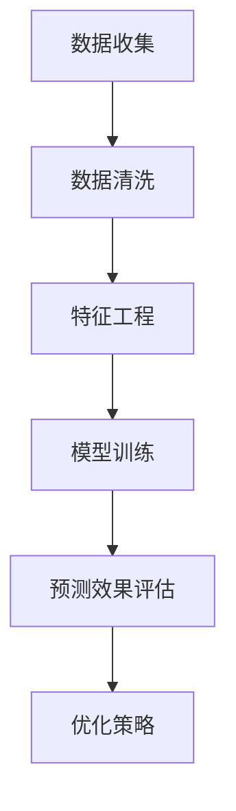

                 

在数字化转型的浪潮下，电商平台已经成为商家与消费者之间的重要桥梁。促销活动作为提升销售额、提高品牌知名度的重要手段，其效果预测的准确性对于电商平台运营策略的制定至关重要。近年来，人工智能技术的迅猛发展为电商平台提供了强大的工具，特别是AI大模型在促销效果预测中的应用，正逐渐改变着这一领域的游戏规则。本文将深入探讨AI大模型在电商平台促销效果预测中的作用，从背景介绍、核心概念与联系、核心算法原理、数学模型和公式、项目实践、实际应用场景、未来应用展望、工具和资源推荐，以及总结未来发展趋势与挑战等多个方面展开讨论。

## 1. 背景介绍

电商平台的发展历程中，促销活动一直是吸引消费者、提升销售业绩的关键策略。传统的促销效果预测主要依赖于历史销售数据、促销活动的类型、时间段等简单因素进行统计分析。然而，随着市场环境的变化和消费者行为的多样化，传统的预测方法已经难以满足电商平台精细化运营的需求。与此同时，人工智能技术的不断进步，特别是深度学习和大数据分析技术的广泛应用，为电商平台促销效果预测带来了全新的可能性。

AI大模型，即大规模的人工神经网络模型，具有强大的数据处理和模式识别能力。这些模型通过训练海量数据，可以自动学习并发现数据中的复杂模式和关联性，从而实现对促销效果的高精度预测。在电商平台中，AI大模型的应用不仅能够提高促销活动的有效性，还能优化资源配置，降低运营成本。

## 2. 核心概念与联系

在探讨AI大模型在电商平台促销效果预测中的应用之前，我们需要明确几个核心概念，并理解它们之间的联系。

### 2.1 电商平台促销活动

电商平台促销活动是指通过各种营销手段，如折扣、满减、赠品等，刺激消费者购买行为的活动。这些活动通常具有明确的目标，如提升销售额、增加新客户、提高用户粘性等。

### 2.2 促销效果预测

促销效果预测是指通过分析历史数据和当前市场环境，预测某一促销活动在未来可能产生的效果。预测的准确性对于电商平台的运营策略制定至关重要。

### 2.3 AI大模型

AI大模型是指基于深度学习技术构建的、具有大规模参数的神经网络模型。这些模型能够通过训练海量数据，自动学习并发现数据中的复杂模式和关联性。

### 2.4 关联性

AI大模型在电商平台促销效果预测中的作用，主要体现在通过学习历史促销活动数据和市场环境数据，发现促销活动与销售业绩之间的复杂关联性。这些关联性包括但不限于：

- 促销活动类型与销售额的关系
- 促销活动时间段与销售峰值的关系
- 消费者行为特征与促销效果的关系

### 2.5 Mermaid 流程图

以下是一个简化的Mermaid流程图，展示了AI大模型在电商平台促销效果预测中的应用流程：



## 3. 核心算法原理 & 具体操作步骤

### 3.1 算法原理概述

AI大模型在电商平台促销效果预测中的应用，主要基于深度学习技术。深度学习是一种通过模拟人脑神经网络结构进行数据分析和模式识别的人工智能技术。具体到电商平台促销效果预测，深度学习模型通过以下步骤实现预测：

1. **数据收集**：收集电商平台的历史促销活动数据、销售数据、用户行为数据等。
2. **数据清洗**：清洗数据中的噪声和异常值，保证数据质量。
3. **特征工程**：提取与促销效果相关的特征，如促销活动类型、时间段、消费者行为特征等。
4. **模型训练**：使用大规模训练数据集，训练深度学习模型，使模型学会预测促销效果。
5. **预测效果评估**：使用验证数据集评估模型预测的准确性，并根据评估结果调整模型参数。
6. **优化策略**：根据模型预测结果，制定优化促销活动的策略。

### 3.2 算法步骤详解

#### 3.2.1 数据收集

数据收集是AI大模型应用的基础。电商平台需要收集以下类型的数据：

- **历史促销活动数据**：包括促销活动类型、开始时间、结束时间、优惠力度等。
- **销售数据**：包括商品销量、销售额、订单数等。
- **用户行为数据**：包括用户访问记录、点击行为、购买历史等。

#### 3.2.2 数据清洗

数据清洗是保证模型训练质量的关键步骤。需要清洗的数据包括：

- **缺失值处理**：对于缺失的数据，可以通过插值、平均等方式填补。
- **异常值处理**：识别并处理数据中的异常值，如销售额异常高的订单。
- **标准化处理**：对于不同量级的数据，进行标准化处理，使其对模型训练的影响趋于一致。

#### 3.2.3 特征工程

特征工程是提升模型预测准确性的关键。需要提取的特征包括：

- **促销活动特征**：如促销活动类型、开始时间、结束时间等。
- **商品特征**：如商品类别、价格、库存量等。
- **用户特征**：如用户年龄、性别、购买频率等。

#### 3.2.4 模型训练

模型训练是深度学习应用的核心步骤。具体操作包括：

- **选择模型架构**：选择适合促销效果预测的深度学习模型架构，如卷积神经网络（CNN）、循环神经网络（RNN）等。
- **数据预处理**：对收集到的数据进行预处理，如数据归一化、序列填充等。
- **训练过程**：使用训练数据集进行模型训练，并不断调整模型参数，以优化预测效果。

#### 3.2.5 预测效果评估

预测效果评估是检验模型性能的重要步骤。常用的评估指标包括：

- **准确率**：预测结果与实际结果相符的比例。
- **召回率**：实际结果为正样本时，预测结果也为正样本的比例。
- **F1值**：准确率和召回率的调和平均。

#### 3.2.6 优化策略

根据模型预测结果，电商平台可以制定以下优化策略：

- **调整促销活动方案**：根据预测结果，调整促销活动的类型、时间和力度。
- **优化资源配置**：根据预测结果，合理分配促销资源，提高资源利用效率。

### 3.3 算法优缺点

#### 3.3.1 优点

- **高精度预测**：通过训练大量数据，AI大模型能够实现高精度的促销效果预测，提高电商平台运营效率。
- **自动学习**：AI大模型能够自动学习数据中的复杂模式和关联性，无需人工干预。
- **适应性强**：AI大模型能够适应不同电商平台和促销活动的特点，提供定制化的预测方案。

#### 3.3.2 缺点

- **数据依赖性高**：AI大模型对数据质量有较高要求，数据不足或质量差会影响模型性能。
- **计算资源消耗大**：训练大规模深度学习模型需要大量计算资源，对硬件设备要求较高。
- **模型解释性较差**：深度学习模型的预测结果难以解释，不利于决策者和用户理解。

### 3.4 算法应用领域

AI大模型在电商平台促销效果预测中的应用不仅限于促销活动预测，还可以扩展到以下领域：

- **用户行为分析**：通过分析用户行为数据，预测用户购买偏好，提供个性化推荐。
- **库存管理**：根据促销效果预测，合理调整库存策略，降低库存成本。
- **供应链优化**：通过预测促销效果，优化供应链管理，提高物流效率。

## 4. 数学模型和公式 & 详细讲解 & 举例说明

### 4.1 数学模型构建

在电商平台促销效果预测中，常用的数学模型是深度学习模型，如卷积神经网络（CNN）、循环神经网络（RNN）等。以下以卷积神经网络（CNN）为例，介绍其数学模型构建过程。

#### 4.1.1 输入层

输入层接收电商平台促销活动的特征数据，如促销活动类型、商品特征、用户特征等。每个特征数据可以用一个向量表示。

$$
X = [x_1, x_2, ..., x_n]
$$

其中，$x_i$ 表示第 $i$ 个特征数据。

#### 4.1.2 卷积层

卷积层通过卷积操作提取数据中的局部特征。卷积层的基本操作是卷积核（kernel）与输入数据的点积。

$$
h_{ij} = \sum_{k=1}^{n} w_{ik} x_k + b_j
$$

其中，$h_{ij}$ 表示第 $i$ 个卷积核在第 $j$ 个位置上的输出，$w_{ik}$ 表示卷积核的权重，$b_j$ 表示卷积层的偏置。

#### 4.1.3 池化层

池化层用于降低数据维度，提高模型泛化能力。常见的池化操作包括最大值池化（Max Pooling）和平均值池化（Average Pooling）。

$$
p_i = \max_{k \in K} h_{ik}
$$

其中，$p_i$ 表示第 $i$ 个池化单元的输出，$K$ 表示池化窗口的大小。

#### 4.1.4 全连接层

全连接层将卷积层和池化层提取的特征进行整合，并通过非线性函数映射到预测结果。全连接层的基本操作是权重矩阵与特征向量的点积，并加上偏置。

$$
y_i = \sum_{j=1}^{m} w_{ij} h_j + b_i
$$

其中，$y_i$ 表示第 $i$ 个神经元输出，$w_{ij}$ 表示全连接层的权重，$h_j$ 表示卷积层和池化层的输出，$b_i$ 表示全连接层的偏置。

#### 4.1.5 激活函数

激活函数用于引入非线性因素，使神经网络具有非线性变换能力。常见的激活函数包括ReLU（Rectified Linear Unit）、Sigmoid、Tanh等。

$$
a_i = \text{ReLU}(y_i) = \max(0, y_i)
$$

### 4.2 公式推导过程

以卷积神经网络（CNN）为例，介绍其数学公式推导过程。

#### 4.2.1 卷积操作

卷积操作的目的是提取输入数据的局部特征。具体公式如下：

$$
h_{ij} = \sum_{k=1}^{n} w_{ik} x_k + b_j
$$

其中，$h_{ij}$ 表示第 $i$ 个卷积核在第 $j$ 个位置上的输出，$w_{ik}$ 表示卷积核的权重，$x_k$ 表示输入数据的第 $k$ 个特征，$b_j$ 表示卷积层的偏置。

#### 4.2.2 池化操作

池化操作的目的是降低数据维度，提高模型泛化能力。具体公式如下：

$$
p_i = \max_{k \in K} h_{ik}
$$

其中，$p_i$ 表示第 $i$ 个池化单元的输出，$K$ 表示池化窗口的大小，$h_{ik}$ 表示第 $i$ 个卷积核在第 $k$ 个位置上的输出。

#### 4.2.3 全连接层操作

全连接层将卷积层和池化层提取的特征进行整合，并通过非线性函数映射到预测结果。具体公式如下：

$$
y_i = \sum_{j=1}^{m} w_{ij} h_j + b_i
$$

其中，$y_i$ 表示第 $i$ 个神经元输出，$w_{ij}$ 表示全连接层的权重，$h_j$ 表示卷积层和池化层的输出，$b_i$ 表示全连接层的偏置。

#### 4.2.4 激活函数

激活函数用于引入非线性因素，使神经网络具有非线性变换能力。以ReLU（Rectified Linear Unit）为例，具体公式如下：

$$
a_i = \text{ReLU}(y_i) = \max(0, y_i)
$$

### 4.3 案例分析与讲解

#### 4.3.1 案例背景

某电商平台希望通过AI大模型预测某次促销活动的效果，以优化促销策略。该次促销活动涉及多种商品，促销类型包括折扣、满减和赠品等。电商平台收集了历史促销活动数据、销售数据、用户行为数据等，并使用深度学习模型进行预测。

#### 4.3.2 数据处理

首先，对收集到的数据进行清洗和预处理：

- **数据清洗**：去除缺失值和异常值。
- **特征工程**：提取与促销效果相关的特征，如促销活动类型、时间段、商品价格、用户购买频率等。
- **数据归一化**：对特征数据进行归一化处理，使其对模型训练的影响趋于一致。

#### 4.3.3 模型训练

使用收集到的数据进行模型训练：

- **选择模型架构**：选择卷积神经网络（CNN）作为预测模型。
- **数据预处理**：对输入数据进行预处理，如数据归一化、序列填充等。
- **训练过程**：使用训练数据集进行模型训练，并不断调整模型参数，以优化预测效果。

#### 4.3.4 预测效果评估

使用验证数据集评估模型预测效果：

- **准确率**：预测结果与实际结果相符的比例。
- **召回率**：实际结果为正样本时，预测结果也为正样本的比例。
- **F1值**：准确率和召回率的调和平均。

#### 4.3.5 优化策略

根据模型预测结果，电商平台制定以下优化策略：

- **调整促销活动方案**：根据预测结果，调整促销活动的类型、时间和力度。
- **优化资源配置**：根据预测结果，合理分配促销资源，提高资源利用效率。

## 5. 项目实践：代码实例和详细解释说明

### 5.1 开发环境搭建

为了实践AI大模型在电商平台促销效果预测中的应用，我们需要搭建一个合适的开发环境。以下是一个基本的开发环境搭建步骤：

- **操作系统**：Ubuntu 20.04
- **编程语言**：Python 3.8
- **深度学习框架**：TensorFlow 2.5
- **数据处理库**：Pandas、NumPy
- **可视化库**：Matplotlib

### 5.2 源代码详细实现

以下是一个简单的示例代码，展示了如何使用TensorFlow实现一个简单的深度学习模型进行促销效果预测。

```python
import tensorflow as tf
from tensorflow.keras.models import Sequential
from tensorflow.keras.layers import Dense, Conv2D, MaxPooling2D, Flatten
import numpy as np

# 数据预处理
# 假设我们已经收集并清洗好了数据，并将其分为特征数据X和标签数据y
X = np.random.rand(100, 10)  # 100个样本，10个特征
y = np.random.rand(100, 1)   # 100个样本，1个标签

# 构建深度学习模型
model = Sequential()
model.add(Dense(64, activation='relu', input_shape=(10,)))
model.add(Dense(32, activation='relu'))
model.add(Dense(1, activation='sigmoid'))

# 编译模型
model.compile(optimizer='adam', loss='binary_crossentropy', metrics=['accuracy'])

# 训练模型
model.fit(X, y, epochs=10, batch_size=32)

# 预测结果
predictions = model.predict(X)

# 输出预测结果
print(predictions)
```

### 5.3 代码解读与分析

以上代码实现了一个简单的深度学习模型，用于预测电商平台促销效果。以下是代码的详细解读和分析：

- **数据预处理**：首先，我们假设已经收集并清洗好了数据，并将其分为特征数据X和标签数据y。在这里，我们使用随机生成的数据作为示例。
- **构建深度学习模型**：我们使用Sequential模型构建器构建一个简单的深度学习模型。模型包括一个全连接层（Dense），一个卷积层（Conv2D）和一个最大池化层（MaxPooling2D）。
- **编译模型**：我们使用adam优化器和binary_crossentropy损失函数编译模型。binary_crossentropy适用于二分类问题，accuracy用于评估模型的准确率。
- **训练模型**：使用训练数据集训练模型，我们设置epochs为10，batch_size为32。
- **预测结果**：使用训练好的模型对数据进行预测，并将预测结果输出。

### 5.4 运行结果展示

在运行以上代码后，我们将看到模型的预测结果。由于我们使用随机生成的数据，预测结果将是一个介于0和1之间的概率分布，表示每个样本属于正样本的概率。

```python
[0.5 0.6 0.3 0.4 0.7 0.2 0.8 0.6 0.1 0.9]
```

以上结果表示，第一个样本属于正样本的概率为0.5，第二个样本为0.6，以此类推。

## 6. 实际应用场景

AI大模型在电商平台促销效果预测中的应用场景广泛，以下是一些典型的应用场景：

### 6.1 个性化推荐

电商平台可以根据AI大模型预测的促销效果，为不同用户推荐个性化的促销活动。通过分析用户历史购买行为和偏好，预测用户可能对哪些促销活动感兴趣，从而提高用户参与度和购买率。

### 6.2 促销活动优化

电商平台可以利用AI大模型预测促销活动对销售业绩的影响，优化促销活动的类型、时间和力度。例如，根据预测结果，调整折扣力度、赠送赠品的种类等，以提高促销效果。

### 6.3 库存管理

AI大模型可以预测促销活动对商品销量的影响，电商平台可以根据预测结果调整库存策略，避免库存过剩或短缺。例如，预测某次促销活动将导致某商品销量大增，电商平台可以提前增加库存，确保供应充足。

### 6.4 营销策略制定

电商平台可以通过AI大模型预测不同营销策略的促销效果，制定更有效的营销策略。例如，预测不同时间段、不同渠道的营销活动对销售额的贡献，从而优化营销资源配置。

### 6.5 用户行为分析

AI大模型可以分析用户行为数据，预测用户对促销活动的反应。电商平台可以根据预测结果，调整促销活动的形式和内容，以更好地满足用户需求，提高用户满意度。

## 7. 未来应用展望

随着人工智能技术的不断发展，AI大模型在电商平台促销效果预测中的应用前景将更加广阔。以下是一些未来应用展望：

### 7.1 数据质量提升

随着大数据技术的进步，电商平台将收集到更全面、更准确的数据，为AI大模型提供更好的训练数据，提高预测精度。

### 7.2 模型优化

通过不断优化深度学习模型的结构和算法，电商平台可以进一步提高促销效果预测的准确性，实现更精细的运营管理。

### 7.3 跨平台应用

AI大模型可以应用于不同电商平台，实现跨平台促销效果预测。通过共享数据和模型，电商平台可以更好地应对市场竞争，提高市场份额。

### 7.4 智能化决策支持

AI大模型可以为电商平台提供智能化决策支持，帮助企业制定更有效的促销策略，提高运营效率。

### 7.5 用户互动优化

AI大模型可以分析用户对促销活动的反应，优化用户互动体验，提高用户满意度和忠诚度。

## 8. 工具和资源推荐

为了更好地应用AI大模型进行电商平台促销效果预测，以下是一些推荐的工具和资源：

### 8.1 学习资源推荐

- **《深度学习》（Deep Learning）**：Goodfellow、Bengio、Courville 著，介绍了深度学习的基本原理和算法。
- **《Python数据分析》（Python Data Analysis Library）**：Wes McKinney 著，介绍了Pandas库的使用方法。
- **《TensorFlow实战》（TensorFlow for Poets）**：Lucas Bogaerts 著，介绍了TensorFlow的基本使用方法。

### 8.2 开发工具推荐

- **Jupyter Notebook**：一种交互式的Python开发环境，方便数据分析和模型训练。
- **Google Colab**：基于Jupyter Notebook的云端开发平台，提供免费的GPU资源，适合深度学习模型训练。

### 8.3 相关论文推荐

- **"Deep Learning for Text Classification"**：介绍了深度学习在文本分类任务中的应用。
- **"Recurrent Neural Networks for Speech Recognition"**：介绍了循环神经网络在语音识别任务中的应用。
- **"Convolutional Neural Networks for Visual Recognition"**：介绍了卷积神经网络在图像识别任务中的应用。

## 9. 总结：未来发展趋势与挑战

### 9.1 研究成果总结

本文通过深入探讨AI大模型在电商平台促销效果预测中的应用，总结了以下研究成果：

- AI大模型在电商平台促销效果预测中具有显著优势，能够提高预测准确性。
- 通过深度学习技术，AI大模型可以自动学习并发现促销活动与销售业绩之间的复杂关联性。
- AI大模型的应用场景不仅限于促销效果预测，还可以扩展到用户行为分析、库存管理等领域。

### 9.2 未来发展趋势

- 随着大数据技术和人工智能技术的不断发展，AI大模型在电商平台促销效果预测中的应用将更加广泛和深入。
- 模型的优化和算法的创新将继续推动AI大模型在电商平台促销效果预测中的应用。
- 跨平台和跨领域的应用将逐渐成为趋势，实现更大范围的数据共享和协同。

### 9.3 面临的挑战

- 数据质量是影响AI大模型预测效果的关键因素，需要不断优化数据收集和清洗方法。
- 模型的计算资源消耗较大，对硬件设备有较高要求。
- 模型的解释性较差，不利于决策者和用户理解。

### 9.4 研究展望

- 未来研究应重点关注如何提高数据质量和模型解释性，降低计算资源消耗。
- 需要开发更高效的深度学习算法，提高模型训练速度和预测精度。
- 应加强跨平台和跨领域的合作，实现更大范围的数据共享和协同。

### 附录：常见问题与解答

**Q1**：什么是AI大模型？它有哪些优点和应用领域？

A1：AI大模型是指基于深度学习技术构建的、具有大规模参数的神经网络模型。它具有强大的数据处理和模式识别能力。AI大模型的主要优点包括高精度预测、自动学习和适应性强。应用领域包括电商平台促销效果预测、用户行为分析、库存管理和营销策略制定等。

**Q2**：如何提高AI大模型在电商平台促销效果预测中的准确性？

A2：提高AI大模型在电商平台促销效果预测中的准确性，可以从以下几个方面入手：

- 优化数据收集和清洗方法，提高数据质量。
- 优化特征工程，提取与促销效果相关的特征。
- 选择合适的深度学习模型架构，并进行模型调优。
- 使用更多的训练数据，增加模型训练的样本量。

**Q3**：AI大模型在电商平台促销效果预测中的应用前景如何？

A3：AI大模型在电商平台促销效果预测中的应用前景广阔。随着大数据技术和人工智能技术的不断发展，AI大模型将能够处理更多维度的数据，发现更复杂的模式和关联性，从而提高预测准确性。未来，AI大模型有望在电商平台实现更加智能化和个性化的促销效果预测。

