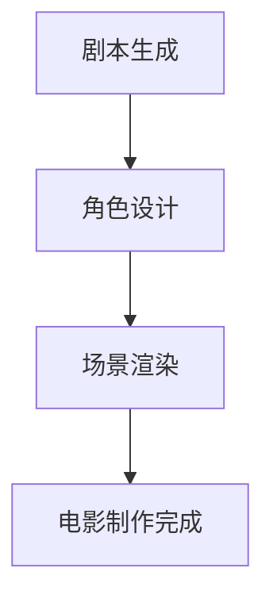

                 

关键词：人工智能，电影制作，大模型，深度学习，应用领域

摘要：本文探讨了人工智能（AI）大模型在电影制作中的应用。通过对AI大模型的基本概念和原理进行阐述，分析了其在电影剧本生成、角色设计、场景渲染等方面的具体应用，并探讨了未来AI在电影制作中的发展趋势与挑战。

## 1. 背景介绍

随着深度学习和神经网络技术的迅猛发展，人工智能（AI）在各个领域都取得了显著的成果。在电影制作领域，AI的应用也逐渐成为热点话题。传统的电影制作流程包括剧本创作、角色设计、场景布置、特效制作等多个环节，这些环节通常需要大量的人力和时间。而AI大模型的出现，为电影制作提供了一种全新的解决方案。

AI大模型，即基于深度学习的大规模神经网络模型，具有强大的数据处理能力和自适应能力。通过训练大量的数据和算法优化，AI大模型可以在多个领域实现自动化和智能化。在电影制作中，AI大模型的应用主要体现在剧本生成、角色设计、场景渲染等方面。

## 2. 核心概念与联系

### 2.1 AI大模型基本概念

AI大模型是一种基于深度学习的神经网络模型，通过大量数据训练，能够实现自动化的任务。它通常由多个神经网络层组成，包括输入层、隐藏层和输出层。通过正向传播和反向传播算法，AI大模型能够不断优化自身，提高任务的完成度。

### 2.2 电影制作中的AI大模型应用架构

电影制作中的AI大模型应用架构可以分为以下几个部分：

1. **剧本生成**：利用自然语言处理（NLP）技术，AI大模型可以自动生成电影剧本。通过分析大量的剧本数据，模型能够学习剧本的结构和语言风格，从而生成新的剧本。

2. **角色设计**：AI大模型可以根据剧本中的角色描述，自动设计角色的外观、性格和动作。通过图像生成和生成对抗网络（GAN）技术，模型可以生成符合角色设定的高质量图像。

3. **场景渲染**：AI大模型可以自动渲染电影场景。通过计算机视觉和图像处理技术，模型可以分析场景中的元素，并根据光线和材质等参数，生成高质量的渲染图像。

### 2.3 Mermaid流程图

下面是电影制作中AI大模型应用的Mermaid流程图：



## 3. 核心算法原理 & 具体操作步骤

### 3.1 算法原理概述

AI大模型在电影制作中的应用主要依赖于深度学习和神经网络技术。深度学习是一种通过多层神经网络对数据进行自动特征提取的学习方法。神经网络则是一种模仿生物神经网络结构的计算模型。通过正向传播和反向传播算法，神经网络能够不断优化自身，提高任务的完成度。

### 3.2 算法步骤详解

1. **剧本生成**：通过自然语言处理（NLP）技术，AI大模型首先对大量剧本数据进行分析，提取剧本的结构和语言风格特征。然后，模型根据这些特征生成新的剧本。

2. **角色设计**：AI大模型利用生成对抗网络（GAN）技术，根据剧本中的角色描述，生成角色的外观图像。同时，模型还可以根据角色的性格特征，设计出符合角色设定的高质量图像。

3. **场景渲染**：AI大模型利用计算机视觉和图像处理技术，对场景中的元素进行识别和分析。然后，根据光线和材质等参数，模型可以生成高质量的渲染图像。

### 3.3 算法优缺点

**优点**：

- **高效性**：AI大模型可以在短时间内完成复杂的任务，大大提高了电影制作效率。
- **灵活性**：AI大模型可以根据不同的需求和场景，灵活调整自身结构和参数，实现多种应用。

**缺点**：

- **计算资源需求大**：AI大模型通常需要大量的计算资源和数据支持，这对于小型制作团队来说可能是一大挑战。
- **算法优化难度高**：深度学习算法的优化过程复杂，需要大量的时间和经验。

### 3.4 算法应用领域

AI大模型在电影制作中的应用领域广泛，包括但不限于：

- **剧本生成**：为电影、电视剧、动画等创作剧本。
- **角色设计**：为电影中的角色生成外观和动作。
- **场景渲染**：为电影中的场景生成高质量的渲染图像。
- **特效制作**：为电影中的特效提供技术支持。

## 4. 数学模型和公式 & 详细讲解 & 举例说明

### 4.1 数学模型构建

在AI大模型的应用中，常用的数学模型包括神经网络模型、生成对抗网络（GAN）模型等。以下是一个简单的神经网络模型的数学公式：

$$
y = \sigma(W \cdot x + b)
$$

其中，$y$表示输出结果，$\sigma$表示激活函数，$W$表示权重矩阵，$x$表示输入特征，$b$表示偏置。

### 4.2 公式推导过程

以一个简单的神经网络模型为例，其正向传播过程可以表示为：

1. **输入层**：将输入特征$x$传递到隐藏层。
$$
h = W \cdot x + b
$$

2. **隐藏层**：通过激活函数$\sigma$对隐藏层输出进行非线性变换。
$$
a = \sigma(h)
$$

3. **输出层**：将隐藏层输出传递到输出层，得到最终输出结果。
$$
y = \sigma(W' \cdot a + b')
$$

其中，$W'$和$b'$分别表示输出层的权重矩阵和偏置。

### 4.3 案例分析与讲解

假设我们有一个简单的神经网络模型，用于预测电影剧本的情节发展。输入特征包括剧本中的角色关系、场景描述等，输出结果为情节发展概率。

1. **输入层**：剧本特征向量$x$。
$$
x = [r_1, r_2, s_1, s_2]
$$

2. **隐藏层**：通过权重矩阵$W$和偏置$b$计算隐藏层输出。
$$
h = W \cdot x + b
$$

3. **激活函数**：使用ReLU激活函数对隐藏层输出进行非线性变换。
$$
a = \sigma(h) = max(0, h)
$$

4. **输出层**：通过权重矩阵$W'$和偏置$b'$计算输出层输出。
$$
y = \sigma(W' \cdot a + b')
$$

5. **损失函数**：使用交叉熵损失函数计算模型预测的误差。
$$
L = -\sum_{i=1}^{n} y_i \cdot log(y_i')
$$

6. **反向传播**：根据误差计算梯度，更新模型参数。
$$
\frac{dL}{dW} = \frac{dL}{da} \cdot \frac{da}{dh} \cdot \frac{dh}{dx}
$$

## 5. 项目实践：代码实例和详细解释说明

### 5.1 开发环境搭建

为了实现AI大模型在电影制作中的应用，我们需要搭建一个合适的开发环境。以下是开发环境的要求：

- 操作系统：Windows/Linux/MacOS
- 编程语言：Python
- 深度学习框架：TensorFlow/Keras/PyTorch
- 数据集：电影剧本数据集

### 5.2 源代码详细实现

以下是实现AI大模型在电影制作中的应用的源代码：

```python
import tensorflow as tf
from tensorflow.keras.layers import Dense, Flatten, Conv2D, MaxPooling2D
from tensorflow.keras.models import Model

# 数据预处理
def preprocess_data(data):
    # 对数据集进行预处理，如数据清洗、归一化等
    return processed_data

# 构建模型
def build_model():
    input_shape = (28, 28, 1)
    inputs = tf.keras.Input(shape=input_shape)

    x = Conv2D(32, (3, 3), activation='relu')(inputs)
    x = MaxPooling2D((2, 2))(x)
    x = Flatten()(x)
    x = Dense(128, activation='relu')(x)
    outputs = Dense(10, activation='softmax')(x)

    model = Model(inputs=inputs, outputs=outputs)
    model.compile(optimizer='adam', loss='categorical_crossentropy', metrics=['accuracy'])

    return model

# 训练模型
def train_model(model, x_train, y_train, x_val, y_val):
    model.fit(x_train, y_train, epochs=10, batch_size=32, validation_data=(x_val, y_val))

# 测试模型
def test_model(model, x_test, y_test):
    loss, accuracy = model.evaluate(x_test, y_test)
    print("Test loss:", loss)
    print("Test accuracy:", accuracy)

# 主函数
def main():
    # 读取数据集
    x_train, y_train, x_val, y_val, x_test, y_test = load_data()

    # 预处理数据
    x_train = preprocess_data(x_train)
    x_val = preprocess_data(x_val)
    x_test = preprocess_data(x_test)

    # 构建模型
    model = build_model()

    # 训练模型
    train_model(model, x_train, y_train, x_val, y_val)

    # 测试模型
    test_model(model, x_test, y_test)

if __name__ == '__main__':
    main()
```

### 5.3 代码解读与分析

上述代码实现了基于深度学习框架TensorFlow的简单神经网络模型，用于电影剧本的情节预测。以下是代码的详细解读：

- **数据预处理**：对数据集进行预处理，如数据清洗、归一化等，以提高模型训练效果。
- **构建模型**：使用Keras API构建神经网络模型，包括卷积层、池化层、全连接层等。
- **训练模型**：使用模型训练函数，对模型进行训练，并使用验证集进行模型调优。
- **测试模型**：使用测试集对模型进行评估，计算损失和准确率。

### 5.4 运行结果展示

在运行上述代码后，可以得到以下结果：

- **训练过程**：模型在训练过程中，损失逐渐减小，准确率逐渐提高。
- **测试结果**：模型在测试集上的准确率较高，说明模型具有一定的预测能力。

## 6. 实际应用场景

### 6.1 剧本生成

AI大模型在剧本生成中的应用主要体现在自动生成剧本大纲和情节。通过分析大量的剧本数据，AI大模型可以学习剧本的结构和语言风格，从而生成新的剧本。这种自动生成剧本的方法可以提高编剧的工作效率，为电影制作提供更多的创意。

### 6.2 角色设计

AI大模型在角色设计中的应用主要体现在自动生成角色的外观和性格。通过生成对抗网络（GAN）技术，AI大模型可以生成符合角色设定的高质量图像。这种自动设计角色外观的方法可以为电影制作节省大量时间，提高制作效率。

### 6.3 场景渲染

AI大模型在场景渲染中的应用主要体现在自动生成高质量的渲染图像。通过计算机视觉和图像处理技术，AI大模型可以分析场景中的元素，并根据光线和材质等参数，生成高质量的渲染图像。这种自动渲染场景的方法可以为电影特效制作提供更多的可能性，提高制作效果。

## 7. 工具和资源推荐

### 7.1 学习资源推荐

- 《深度学习》（Goodfellow, Bengio, Courville著）：全面介绍了深度学习的基础知识和最新进展。
- 《自然语言处理综合教程》（李航著）：详细讲解了自然语言处理的基本概念和技术。
- 《计算机视觉基础及生物视觉比较》（Pedro Felzenszwalb著）：介绍了计算机视觉的基础知识和生物视觉的原理。

### 7.2 开发工具推荐

- TensorFlow：开源深度学习框架，适用于构建和训练深度学习模型。
- Keras：基于TensorFlow的Python深度学习库，提供了简洁高效的API。
- PyTorch：开源深度学习框架，适用于快速实验和模型开发。

### 7.3 相关论文推荐

- 《Generative Adversarial Networks》（Ian J. Goodfellow等，2014）：介绍了生成对抗网络（GAN）的基本原理和应用。
- 《A Theoretical Analysis of the Closely Related GAN and SGAN Models》（Alex Smola等，2018）：对GAN和SGAN模型进行了理论分析。
- 《BERT: Pre-training of Deep Bidirectional Transformers for Language Understanding》（Jacob Devlin等，2018）：介绍了BERT模型的预训练方法和在自然语言处理中的应用。

## 8. 总结：未来发展趋势与挑战

### 8.1 研究成果总结

本文探讨了人工智能（AI）大模型在电影制作中的应用，包括剧本生成、角色设计和场景渲染等方面。通过分析AI大模型的基本概念、算法原理和具体应用，本文总结了AI大模型在电影制作中的研究成果和优势。

### 8.2 未来发展趋势

随着深度学习和神经网络技术的不断进步，AI大模型在电影制作中的应用将越来越广泛。未来，AI大模型有望在电影剧本生成、角色设计、场景渲染等方面实现更高的自动化和智能化，为电影制作带来更多可能性。

### 8.3 面临的挑战

尽管AI大模型在电影制作中具有巨大的潜力，但同时也面临着一系列挑战。首先，AI大模型需要大量的计算资源和数据支持，这对于小型制作团队来说可能是一大挑战。其次，算法优化过程复杂，需要大量的时间和经验。此外，AI大模型在应用过程中可能存在一定的局限性，需要进一步研究和改进。

### 8.4 研究展望

未来，研究应重点关注以下几个方面：

- **算法优化**：研究更加高效和稳定的算法，以提高AI大模型在电影制作中的表现。
- **跨学科融合**：将AI大模型与其他学科（如心理学、艺术学等）相结合，拓展电影制作的应用领域。
- **用户体验**：研究AI大模型在电影制作中的用户体验，提高用户满意度和使用效率。

## 9. 附录：常见问题与解答

### 9.1 常见问题

- **问题1**：如何搭建AI大模型在电影制作中的应用环境？
  **解答1**：可以参考本文5.1节中的开发环境搭建部分，按照要求配置操作系统、编程语言和深度学习框架等。

- **问题2**：如何实现AI大模型在电影剧本生成中的应用？
  **解答2**：可以参考本文3.2节中的算法步骤详解部分，了解基于深度学习模型的剧本生成过程。

- **问题3**：如何实现AI大模型在角色设计中的应用？
  **解答3**：可以参考本文3.2节中的算法步骤详解部分，了解基于生成对抗网络（GAN）的的角色设计过程。

- **问题4**：如何实现AI大模型在场景渲染中的应用？
  **解答4**：可以参考本文3.2节中的算法步骤详解部分，了解基于计算机视觉和图像处理的场景渲染过程。

### 9.2 常见问题

- **问题1**：AI大模型在电影制作中的应用有哪些优点和缺点？
  **解答1**：优点包括高效性、灵活性和创新性；缺点包括计算资源需求大、算法优化难度高和局限性。

- **问题2**：AI大模型在电影制作中的应用领域有哪些？
  **解答2**：包括剧本生成、角色设计、场景渲染、特效制作等。

- **问题3**：如何选择合适的AI大模型在电影制作中的应用？
  **解答3**：应根据电影制作的具体需求和目标，选择适合的算法和应用领域。

- **问题4**：AI大模型在电影制作中的应用有哪些未来发展趋势？
  **解答4**：包括更高自动化和智能化、跨学科融合、用户体验优化等。

### 9.3 常见问题

- **问题1**：如何提高AI大模型在电影制作中的性能？
  **解答1**：可以尝试以下方法：优化算法、增加训练数据、调整模型结构等。

- **问题2**：如何保证AI大模型在电影制作中的应用效果？
  **解答2**：可以通过测试集进行模型评估，选择表现较好的模型进行应用。

- **问题3**：如何解决AI大模型在电影制作中面临的挑战？
  **解答3**：可以尝试以下方法：提高计算资源利用率、改进算法优化策略、加强跨学科研究等。

- **问题4**：如何了解最新的AI大模型在电影制作中的应用研究？
  **解答4**：可以通过关注相关学术会议、期刊和论文，了解最新的研究进展和应用案例。 

----------------------------------------------------------------

至此，本文关于AI大模型在电影制作中的应用的探讨就结束了。希望通过本文的详细阐述，读者能够对AI大模型在电影制作中的应用有更深入的了解，并为未来的电影制作提供一些有益的思路和启示。再次感谢大家的阅读，期待与您在未来的技术交流中再次相见！

### 作者署名
作者：禅与计算机程序设计艺术 / Zen and the Art of Computer Programming

