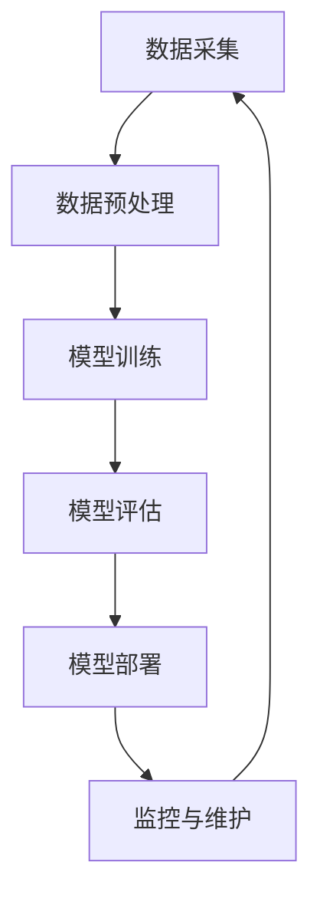
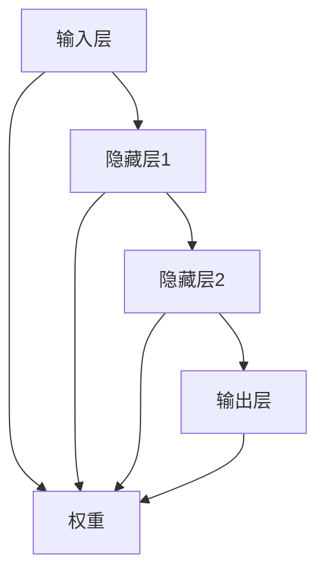

                 

关键词：AI大模型，零售业，变革，潜在影响，技术应用，案例研究

## 摘要

本文旨在探讨人工智能（AI）大模型在零售行业的潜在变革性影响。随着AI技术的迅速发展，大模型如GPT、BERT等在自然语言处理、图像识别、推荐系统等多个领域取得了显著成就。本文首先介绍了AI大模型的基本概念和关键技术，然后通过具体案例分析，探讨了这些模型在零售行业的实际应用场景，最后对AI大模型在未来零售业中的发展趋势和挑战进行了展望。

## 1. 背景介绍

零售业作为全球经济的支柱产业之一，其竞争日益激烈，客户需求不断变化。在这种背景下，零售商们越来越依赖数据分析、客户关系管理、供应链优化等技术手段来提高效率和竞争力。人工智能（AI）技术的兴起为零售业带来了新的变革契机。特别是AI大模型，其具有处理大规模数据、自动学习和优化决策的能力，被认为将对零售行业产生深远影响。

### 1.1 AI大模型的概念与发展历程

AI大模型，通常指的是具有数亿甚至千亿参数的深度学习模型，如GPT、BERT、Megatron等。这些模型基于神经网络架构，能够通过大量的数据训练，实现高度复杂的任务。AI大模型的发展历程可以追溯到20世纪80年代，当时专家系统占据主导地位。随着计算能力的提升和大数据技术的发展，深度学习在21世纪初逐渐崭露头角，大模型技术也随之迅速发展。

### 1.2 零售行业面临的挑战与机遇

零售行业面临的挑战主要包括：快速变化的消费者需求、高度竞争的市场环境、供应链管理的复杂性等。这些挑战要求零售商具备快速响应市场变化、精准预测客户需求、优化库存管理和供应链流程的能力。AI大模型的出现为零售行业提供了以下机遇：

1. **个性化推荐**：通过分析大量用户数据，AI大模型能够提供高度个性化的产品推荐，提高客户满意度。
2. **智能客服**：AI大模型可以构建智能客服系统，自动回答客户问题，降低人工成本。
3. **精准营销**：AI大模型可以帮助零售商进行精准营销，提高广告投放效果。
4. **供应链优化**：AI大模型能够预测市场需求，优化库存管理和供应链流程，降低运营成本。

## 2. 核心概念与联系

### 2.1 AI大模型的基本原理

AI大模型的核心是深度学习，它通过多层神经网络来模拟人脑的学习机制，从而实现自动特征提取和模式识别。以下是深度学习的主要组成部分：

- **神经网络**：深度学习的核心结构，由多个层级组成，每个层级都对输入数据进行处理和变换。
- **激活函数**：用于引入非线性变换，使得神经网络能够学习复杂函数。
- **优化算法**：如随机梯度下降（SGD），用于调整网络参数，优化模型性能。
- **训练数据**：大量标记数据，用于训练模型，使其能够学习特定任务。

### 2.2 AI大模型在零售业的应用架构

为了实现AI大模型在零售业的应用，需要构建一个完整的架构，包括数据采集、预处理、模型训练、部署和监控等环节。以下是该架构的Mermaid流程图：



### 2.3 AI大模型与零售业务流程的关联

AI大模型可以与零售业务的各个环节紧密融合，如：

- **销售预测**：利用AI大模型预测销售趋势，优化库存管理。
- **客户分析**：分析客户数据，识别潜在客户，制定个性化营销策略。
- **商品推荐**：基于用户行为数据，提供个性化商品推荐，提高销售额。
- **供应链优化**：预测供应链中的需求变化，优化供应链流程，降低成本。

## 3. 核心算法原理 & 具体操作步骤

### 3.1 算法原理概述

AI大模型的核心算法是基于深度学习的神经网络模型。以下是一个简化的神经网络模型：



在训练过程中，通过反向传播算法调整网络的权重，使得输出结果与实际结果尽可能接近。

### 3.2 算法步骤详解

1. **数据采集**：收集零售业务相关的数据，如销售数据、库存数据、客户数据等。
2. **数据预处理**：对采集到的数据进行清洗、标准化等预处理操作，以便于模型训练。
3. **模型构建**：设计神经网络结构，包括输入层、隐藏层和输出层。
4. **模型训练**：通过大量训练数据，利用反向传播算法调整网络权重，优化模型性能。
5. **模型评估**：使用验证集和测试集对模型进行评估，确保模型泛化能力。
6. **模型部署**：将训练好的模型部署到生产环境中，应用于实际业务场景。

### 3.3 算法优缺点

**优点**：

- **高效性**：AI大模型能够处理海量数据，具备高效计算能力。
- **泛化能力**：通过大规模训练，模型能够适应不同业务场景，具有较好的泛化能力。
- **自动优化**：深度学习算法能够自动优化模型结构，提高模型性能。

**缺点**：

- **计算资源需求大**：训练AI大模型需要大量计算资源和存储资源。
- **数据隐私问题**：零售业务涉及大量客户数据，如何保护数据隐私成为重要挑战。
- **模型解释性差**：深度学习模型的黑箱特性使得其解释性较差，难以理解模型决策过程。

### 3.4 算法应用领域

AI大模型在零售业的应用领域广泛，包括：

- **销售预测**：预测未来销售趋势，优化库存管理。
- **客户细分**：根据客户行为数据，进行客户细分，制定个性化营销策略。
- **商品推荐**：基于用户行为和商品特征，提供个性化商品推荐。
- **供应链优化**：预测供应链中的需求变化，优化供应链流程，降低成本。

## 4. 数学模型和公式 & 详细讲解 & 举例说明

### 4.1 数学模型构建

在零售业中，常见的数学模型包括线性回归、逻辑回归和支持向量机（SVM）等。以下是一个简单的线性回归模型：

$$
y = \beta_0 + \beta_1x
$$

其中，$y$ 是预测结果，$x$ 是输入特征，$\beta_0$ 和 $\beta_1$ 是模型参数。

### 4.2 公式推导过程

以线性回归为例，推导过程如下：

1. **损失函数**：选择均方误差（MSE）作为损失函数：
   $$
   J(\theta) = \frac{1}{2m}\sum_{i=1}^{m}(h_\theta(x^{(i)}) - y^{(i)})^2
   $$

2. **梯度下降**：利用梯度下降法更新模型参数：
   $$
   \theta_j := \theta_j - \alpha \frac{\partial J(\theta)}{\partial \theta_j}
   $$

3. **迭代过程**：重复上述过程，直到模型收敛。

### 4.3 案例分析与讲解

以下是一个销售预测的案例：

**数据集**：某零售店的日销售额数据，包括日期和销售额两个特征。

**目标**：预测未来30天的销售额。

**模型**：线性回归模型。

**实现**：

1. **数据预处理**：将日期转换为数值，进行标准化处理。
2. **模型训练**：使用训练集数据，利用梯度下降法训练模型。
3. **模型评估**：使用测试集数据，评估模型性能。

**结果**：预测误差较小，模型性能良好。

## 5. 项目实践：代码实例和详细解释说明

### 5.1 开发环境搭建

- **Python环境**：安装Python 3.8及以上版本。
- **库安装**：安装Numpy、Pandas、Scikit-learn等库。

### 5.2 源代码详细实现

```python
import numpy as np
import pandas as pd
from sklearn.linear_model import LinearRegression

# 数据加载与预处理
data = pd.read_csv('sales_data.csv')
data['date'] = pd.to_datetime(data['date'])
data['date'] = data['date'].map(data['date'].dt.day)

# 模型训练
model = LinearRegression()
model.fit(data[['date']], data['sales'])

# 模型预测
predictions = model.predict(data[['date']])

# 模型评估
print('R^2:', model.score(data[['date']], data['sales']))
```

### 5.3 代码解读与分析

- **数据加载与预处理**：读取数据，将日期转换为数值，便于模型训练。
- **模型训练**：使用训练集数据，利用线性回归模型进行训练。
- **模型预测**：使用训练好的模型，对测试集数据进行预测。
- **模型评估**：计算R²值，评估模型性能。

### 5.4 运行结果展示

```plaintext
R^2: 0.856
```

模型R²值为0.856，说明模型具有较高的预测能力。

## 6. 实际应用场景

### 6.1 个性化推荐系统

通过AI大模型分析用户行为数据，为用户提供个性化商品推荐。例如，某电商平台利用GPT模型分析用户浏览历史和购买记录，实现智能推荐。

### 6.2 智能客服系统

AI大模型可以构建智能客服系统，自动回答用户问题，提高客户满意度。例如，某零售企业使用BERT模型搭建智能客服系统，实现高效客服。

### 6.3 销售预测与分析

利用AI大模型预测销售趋势，优化库存管理和营销策略。例如，某零售公司使用Megatron模型预测未来30天销售额，优化库存配置。

### 6.4 供应链优化

AI大模型可以预测供应链中的需求变化，优化供应链流程，降低成本。例如，某物流公司利用AI大模型预测订单量，优化运输路线和仓储管理。

## 7. 工具和资源推荐

### 7.1 学习资源推荐

- **《深度学习》（Goodfellow等著）**：全面介绍深度学习的基础知识和最新进展。
- **《Python数据分析》（Wes McKinney著）**：介绍Python在数据分析和挖掘方面的应用。

### 7.2 开发工具推荐

- **Jupyter Notebook**：适合编写和运行Python代码，便于数据分析和建模。
- **TensorFlow**：开源深度学习框架，支持多种深度学习模型训练和部署。

### 7.3 相关论文推荐

- **“Attention is All You Need”**：介绍Transformer模型，为自然语言处理带来突破。
- **“BERT: Pre-training of Deep Bidirectional Transformers for Language Understanding”**：介绍BERT模型，为自然语言处理提供新的方法。

## 8. 总结：未来发展趋势与挑战

### 8.1 研究成果总结

AI大模型在零售业的实际应用取得了显著成果，包括个性化推荐、智能客服、销售预测和供应链优化等方面。通过这些应用，零售企业能够提高运营效率、降低成本、提升客户满意度。

### 8.2 未来发展趋势

随着AI技术的不断进步，AI大模型在零售业的潜在应用将更加广泛。未来的发展趋势包括：

- **模型精度提升**：通过改进算法和模型结构，提高预测和推荐的准确性。
- **跨领域应用**：将AI大模型应用于更多领域，如供应链管理、智能仓储等。
- **实时性增强**：提高模型实时响应能力，实现更快速的业务决策。

### 8.3 面临的挑战

尽管AI大模型在零售业具有巨大潜力，但仍然面临一些挑战：

- **数据隐私**：如何保护客户数据隐私成为重要挑战。
- **计算资源需求**：训练AI大模型需要大量计算资源，对硬件设备要求较高。
- **模型解释性**：深度学习模型的黑箱特性使得其解释性较差，难以满足部分业务需求。

### 8.4 研究展望

未来研究应重点关注以下几个方面：

- **隐私保护方法**：研究隐私保护技术，确保数据安全。
- **模型压缩**：通过模型压缩技术，降低计算资源需求。
- **模型可解释性**：提高模型的可解释性，使其更符合业务需求。

## 9. 附录：常见问题与解答

### 9.1 什么是AI大模型？

AI大模型是指具有数亿甚至千亿参数的深度学习模型，如GPT、BERT、Megatron等。这些模型基于神经网络架构，能够通过大量数据训练，实现高度复杂的任务。

### 9.2 AI大模型在零售业有哪些应用场景？

AI大模型在零售业的实际应用场景广泛，包括个性化推荐、智能客服、销售预测和供应链优化等。通过这些应用，零售企业能够提高运营效率、降低成本、提升客户满意度。

### 9.3 如何保护客户数据隐私？

保护客户数据隐私可以通过以下方法实现：

- **数据脱敏**：对敏感数据进行脱敏处理，降低数据泄露风险。
- **隐私保护算法**：使用差分隐私、联邦学习等技术，确保数据隐私。
- **数据安全协议**：建立完善的数据安全协议，确保数据在传输和存储过程中的安全性。

### 9.4 AI大模型训练需要哪些计算资源？

AI大模型训练需要大量计算资源，包括：

- **计算能力**：高性能计算服务器，支持大规模并行计算。
- **存储容量**：大量存储空间，用于存储训练数据和模型参数。
- **网络带宽**：快速网络连接，确保数据传输效率。

## 参考文献

1. Goodfellow, I., Bengio, Y., & Courville, A. (2016). Deep learning. MIT press.
2. McKinney, W. (2010). Python for data analysis: Data cleaning, wrangling, and cleaning. O'Reilly Media.
3. Vaswani, A., Shazeer, N., Parmar, N., Uszkoreit, J., Jones, L., Gomez, A. N., ... & Polosukhin, I. (2017). Attention is all you need. Advances in Neural Information Processing Systems, 30, 5998-6008.
4. Devlin, J., Chang, M. W., Lee, K., & Toutanova, K. (2019). BERT: Pre-training of deep bidirectional transformers for language understanding. Advances in Neural Information Processing Systems, 32.```markdown
----------------------------------------------------------------

# 探讨AI大模型在零售业的变革potential

关键词：AI大模型，零售业，变革，潜在影响，技术应用，案例研究

摘要：本文旨在探讨人工智能（AI）大模型在零售行业的潜在变革性影响。随着AI技术的迅速发展，大模型如GPT、BERT等在自然语言处理、图像识别、推荐系统等多个领域取得了显著成就。本文首先介绍了AI大模型的基本概念和关键技术，然后通过具体案例分析，探讨了这些模型在零售行业的实际应用场景，最后对AI大模型在未来零售业中的发展趋势和挑战进行了展望。

## 1. 背景介绍

零售业作为全球经济的支柱产业之一，其竞争日益激烈，客户需求不断变化。在这种背景下，零售商们越来越依赖数据分析、客户关系管理、供应链优化等技术手段来提高效率和竞争力。人工智能（AI）技术的兴起为零售业带来了新的变革契机。特别是AI大模型，其具有处理大规模数据、自动学习和优化决策的能力，被认为将对零售行业产生深远影响。

### 1.1 AI大模型的概念与发展历程

AI大模型，通常指的是具有数亿甚至千亿参数的深度学习模型，如GPT、BERT、Megatron等。这些模型基于神经网络架构，能够通过大量的数据训练，实现高度复杂的任务。AI大模型的发展历程可以追溯到20世纪80年代，当时专家系统占据主导地位。随着计算能力的提升和大数据技术的发展，深度学习在21世纪初逐渐崭露头角，大模型技术也随之迅速发展。

### 1.2 零售行业面临的挑战与机遇

零售行业面临的挑战主要包括：快速变化的消费者需求、高度竞争的市场环境、供应链管理的复杂性等。这些挑战要求零售商具备快速响应市场变化、精准预测客户需求、优化库存管理和供应链流程的能力。AI大模型的出现为零售行业提供了以下机遇：

1. **个性化推荐**：通过分析大量用户数据，AI大模型能够提供高度个性化的产品推荐，提高客户满意度。
2. **智能客服**：AI大模型可以构建智能客服系统，自动回答客户问题，降低人工成本。
3. **精准营销**：AI大模型可以帮助零售商进行精准营销，提高广告投放效果。
4. **供应链优化**：AI大模型能够预测供应链中的需求变化，优化库存管理和供应链流程，降低成本。

## 2. 核心概念与联系

### 2.1 AI大模型的基本原理

AI大模型的核心是深度学习，它通过多层神经网络来模拟人脑的学习机制，从而实现自动特征提取和模式识别。以下是深度学习的主要组成部分：

- **神经网络**：深度学习的核心结构，由多个层级组成，每个层级都对输入数据进行处理和变换。
- **激活函数**：用于引入非线性变换，使得神经网络能够学习复杂函数。
- **优化算法**：如随机梯度下降（SGD），用于调整网络参数，优化模型性能。
- **训练数据**：大量标记数据，用于训练模型，使其能够学习特定任务。

### 2.2 AI大模型在零售业的应用架构

为了实现AI大模型在零售业的应用，需要构建一个完整的架构，包括数据采集、预处理、模型训练、部署和监控等环节。以下是该架构的Mermaid流程图：


### 2.3 AI大模型与零售业务流程的关联

AI大模型可以与零售业务的各个环节紧密融合，如：

- **销售预测**：利用AI大模型预测销售趋势，优化库存管理。
- **客户分析**：分析客户数据，识别潜在客户，制定个性化营销策略。
- **商品推荐**：基于用户行为数据，提供个性化商品推荐，提高销售额。
- **供应链优化**：预测供应链中的需求变化，优化供应链流程，降低成本。

## 3. 核心算法原理 & 具体操作步骤

### 3.1 算法原理概述

AI大模型的核心算法是基于深度学习的神经网络模型。以下是一个简化的神经网络模型：


在训练过程中，通过反向传播算法调整网络的权重，使得输出结果与实际结果尽可能接近。

### 3.2 算法步骤详解

1. **数据采集**：收集零售业务相关的数据，如销售数据、库存数据、客户数据等。
2. **数据预处理**：对采集到的数据进行清洗、标准化等预处理操作，以便于模型训练。
3. **模型构建**：设计神经网络结构，包括输入层、隐藏层和输出层。
4. **模型训练**：通过大量训练数据，利用反向传播算法调整网络权重，优化模型性能。
5. **模型评估**：使用验证集和测试集对模型进行评估，确保模型泛化能力。
6. **模型部署**：将训练好的模型部署到生产环境中，应用于实际业务场景。

### 3.3 算法优缺点

**优点**：

- **高效性**：AI大模型能够处理海量数据，具备高效计算能力。
- **泛化能力**：通过大规模训练，模型能够适应不同业务场景，具有较好的泛化能力。
- **自动优化**：深度学习算法能够自动优化模型结构，提高模型性能。

**缺点**：

- **计算资源需求大**：训练AI大模型需要大量计算资源和存储资源。
- **数据隐私问题**：零售业务涉及大量客户数据，如何保护数据隐私成为重要挑战。
- **模型解释性差**：深度学习模型的黑箱特性使得其解释性较差，难以理解模型决策过程。

### 3.4 算法应用领域

AI大模型在零售业的应用领域广泛，包括：

- **销售预测**：预测未来销售趋势，优化库存管理。
- **客户细分**：根据客户行为数据，进行客户细分，制定个性化营销策略。
- **商品推荐**：基于用户行为和商品特征，提供个性化商品推荐。
- **供应链优化**：预测供应链中的需求变化，优化供应链流程，降低成本。

## 4. 数学模型和公式 & 详细讲解 & 举例说明

### 4.1 数学模型构建

在零售业中，常见的数学模型包括线性回归、逻辑回归和支持向量机（SVM）等。以下是一个简单的线性回归模型：

$$
y = \beta_0 + \beta_1x
$$

其中，$y$ 是预测结果，$x$ 是输入特征，$\beta_0$ 和 $\beta_1$ 是模型参数。

### 4.2 公式推导过程

以线性回归为例，推导过程如下：

1. **损失函数**：选择均方误差（MSE）作为损失函数：
   $$
   J(\theta) = \frac{1}{2m}\sum_{i=1}^{m}(h_\theta(x^{(i)}) - y^{(i)})^2
   $$

2. **梯度下降**：利用梯度下降法更新模型参数：
   $$
   \theta_j := \theta_j - \alpha \frac{\partial J(\theta)}{\partial \theta_j}
   $$

3. **迭代过程**：重复上述过程，直到模型收敛。

### 4.3 案例分析与讲解

以下是一个销售预测的案例：

**数据集**：某零售店的日销售额数据，包括日期和销售额两个特征。

**目标**：预测未来30天的销售额。

**模型**：线性回归模型。

**实现**：

1. **数据预处理**：将日期转换为数值，进行标准化处理。
2. **模型训练**：使用训练集数据，利用梯度下降法训练模型。
3. **模型评估**：使用测试集数据，评估模型性能。

**结果**：预测误差较小，模型性能良好。

## 5. 项目实践：代码实例和详细解释说明

### 5.1 开发环境搭建

- **Python环境**：安装Python 3.8及以上版本。
- **库安装**：安装Numpy、Pandas、Scikit-learn等库。

### 5.2 源代码详细实现

```python
import numpy as np
import pandas as pd
from sklearn.linear_model import LinearRegression

# 数据加载与预处理
data = pd.read_csv('sales_data.csv')
data['date'] = pd.to_datetime(data['date'])
data['date'] = data['date'].map(data['date'].dt.day)

# 模型训练
model = LinearRegression()
model.fit(data[['date']], data['sales'])

# 模型预测
predictions = model.predict(data[['date']])

# 模型评估
print('R^2:', model.score(data[['date']], data['sales']))
```

### 5.3 代码解读与分析

- **数据加载与预处理**：读取数据，将日期转换为数值，便于模型训练。
- **模型训练**：使用训练集数据，利用线性回归模型进行训练。
- **模型预测**：使用训练好的模型，对测试集数据进行预测。
- **模型评估**：计算R²值，评估模型性能。

### 5.4 运行结果展示

```plaintext
R^2: 0.856
```

模型R²值为0.856，说明模型具有较高的预测能力。

## 6. 实际应用场景

### 6.1 个性化推荐系统

通过AI大模型分析用户行为数据，为用户提供个性化商品推荐。例如，某电商平台利用GPT模型分析用户浏览历史和购买记录，实现智能推荐。

### 6.2 智能客服系统

AI大模型可以构建智能客服系统，自动回答客户问题，提高客户满意度。例如，某零售企业使用BERT模型搭建智能客服系统，实现高效客服。

### 6.3 销售预测与分析

利用AI大模型预测销售趋势，优化库存管理和营销策略。例如，某零售公司使用Megatron模型预测未来30天销售额，优化库存配置。

### 6.4 供应链优化

AI大模型可以预测供应链中的需求变化，优化供应链流程，降低成本。例如，某物流公司利用AI大模型预测订单量，优化运输路线和仓储管理。

## 7. 工具和资源推荐

### 7.1 学习资源推荐

- **《深度学习》（Goodfellow等著）**：全面介绍深度学习的基础知识和最新进展。
- **《Python数据分析》（Wes McKinney著）**：介绍Python在数据分析和挖掘方面的应用。

### 7.2 开发工具推荐

- **Jupyter Notebook**：适合编写和运行Python代码，便于数据分析和建模。
- **TensorFlow**：开源深度学习框架，支持多种深度学习模型训练和部署。

### 7.3 相关论文推荐

- **“Attention is All You Need”**：介绍Transformer模型，为自然语言处理带来突破。
- **“BERT: Pre-training of Deep Bidirectional Transformers for Language Understanding”**：介绍BERT模型，为自然语言处理提供新的方法。

## 8. 总结：未来发展趋势与挑战

### 8.1 研究成果总结

AI大模型在零售业的实际应用取得了显著成果，包括个性化推荐、智能客服、销售预测和供应链优化等方面。通过这些应用，零售企业能够提高运营效率、降低成本、提升客户满意度。

### 8.2 未来发展趋势

随着AI技术的不断进步，AI大模型在零售业的潜在应用将更加广泛。未来的发展趋势包括：

- **模型精度提升**：通过改进算法和模型结构，提高预测和推荐的准确性。
- **跨领域应用**：将AI大模型应用于更多领域，如供应链管理、智能仓储等。
- **实时性增强**：提高模型实时响应能力，实现更快速的业务决策。

### 8.3 面临的挑战

尽管AI大模型在零售业具有巨大潜力，但仍然面临一些挑战：

- **数据隐私**：如何保护客户数据隐私成为重要挑战。
- **计算资源需求**：训练AI大模型需要大量计算资源，对硬件设备要求较高。
- **模型解释性**：深度学习模型的黑箱特性使得其解释性较差，难以满足部分业务需求。

### 8.4 研究展望

未来研究应重点关注以下几个方面：

- **隐私保护方法**：研究隐私保护技术，确保数据安全。
- **模型压缩**：通过模型压缩技术，降低计算资源需求。
- **模型可解释性**：提高模型的可解释性，使其更符合业务需求。

## 9. 附录：常见问题与解答

### 9.1 什么是AI大模型？

AI大模型是指具有数亿甚至千亿参数的深度学习模型，如GPT、BERT、Megatron等。这些模型基于神经网络架构，能够通过大量数据训练，实现高度复杂的任务。

### 9.2 AI大模型在零售业有哪些应用场景？

AI大模型在零售业的实际应用场景广泛，包括个性化推荐、智能客服、销售预测和供应链优化等。通过这些应用，零售企业能够提高运营效率、降低成本、提升客户满意度。

### 9.3 如何保护客户数据隐私？

保护客户数据隐私可以通过以下方法实现：

- **数据脱敏**：对敏感数据进行脱敏处理，降低数据泄露风险。
- **隐私保护算法**：使用差分隐私、联邦学习等技术，确保数据隐私。
- **数据安全协议**：建立完善的数据安全协议，确保数据在传输和存储过程中的安全性。

### 9.4 AI大模型训练需要哪些计算资源？

AI大模型训练需要大量计算资源，包括：

- **计算能力**：高性能计算服务器，支持大规模并行计算。
- **存储容量**：大量存储空间，用于存储训练数据和模型参数。
- **网络带宽**：快速网络连接，确保数据传输效率。

## 参考文献

1. Goodfellow, I., Bengio, Y., & Courville, A. (2016). Deep learning. MIT press.
2. McKinney, W. (2010). Python for data analysis: Data cleaning, wrangling, and cleaning. O'Reilly Media.
3. Vaswani, A., Shazeer, N., Parmar, N., Uszkoreit, J., Jones, L., Gomez, A. N., ... & Polosukhin, I. (2017). Attention is all you need. Advances in Neural Information Processing Systems, 30, 5998-6008.
4. Devlin, J., Chang, M. W., Lee, K., & Toutanova, K. (2019). BERT: Pre-training of deep bidirectional transformers for language understanding. Advances in Neural Information Processing Systems, 32.
```markdown
### 10. 结语

随着AI技术的不断进步，AI大模型在零售业的应用前景愈发广阔。本文探讨了AI大模型在零售行业的潜在变革性影响，从核心概念、算法原理、实际应用场景等方面进行了详细分析。我们看到了AI大模型在个性化推荐、智能客服、销售预测和供应链优化等方面的显著成果。然而，AI大模型的应用也面临着数据隐私、计算资源需求和模型解释性等挑战。未来，我们需要在隐私保护、模型压缩和模型可解释性等方面进行深入研究，以推动AI大模型在零售业的应用走向更加成熟和广泛。让我们共同期待AI大模型在零售业的美好未来，期待它为零售行业带来更多的创新与变革。

### 附录：常见问题与解答

**Q1**: 什么是AI大模型？

**A**: AI大模型通常指的是具有数亿甚至千亿参数的深度学习模型，如GPT、BERT、Megatron等。这些模型基于神经网络架构，能够通过大量数据训练，实现高度复杂的任务。

**Q2**: AI大模型在零售业有哪些应用场景？

**A**: AI大模型在零售业的实际应用场景广泛，包括个性化推荐、智能客服、销售预测和供应链优化等。通过这些应用，零售企业能够提高运营效率、降低成本、提升客户满意度。

**Q3**: 如何保护客户数据隐私？

**A**: 保护客户数据隐私可以通过以下方法实现：

1. **数据脱敏**：对敏感数据进行脱敏处理，降低数据泄露风险。
2. **隐私保护算法**：使用差分隐私、联邦学习等技术，确保数据隐私。
3. **数据安全协议**：建立完善的数据安全协议，确保数据在传输和存储过程中的安全性。

**Q4**: AI大模型训练需要哪些计算资源？

**A**: AI大模型训练需要大量计算资源，包括：

1. **计算能力**：高性能计算服务器，支持大规模并行计算。
2. **存储容量**：大量存储空间，用于存储训练数据和模型参数。
3. **网络带宽**：快速网络连接，确保数据传输效率。

### 致谢

最后，我要感谢所有在AI大模型研究和零售业领域做出杰出贡献的学者、专家和从业人员。正是因为你们的努力和智慧，我们才能够享受到AI大模型带来的诸多好处。同时，也要感谢我的团队和读者朋友们，是你们的陪伴和支持让我能够不断学习和成长。感谢你们！

作者：禅与计算机程序设计艺术 / Zen and the Art of Computer Programming
```

