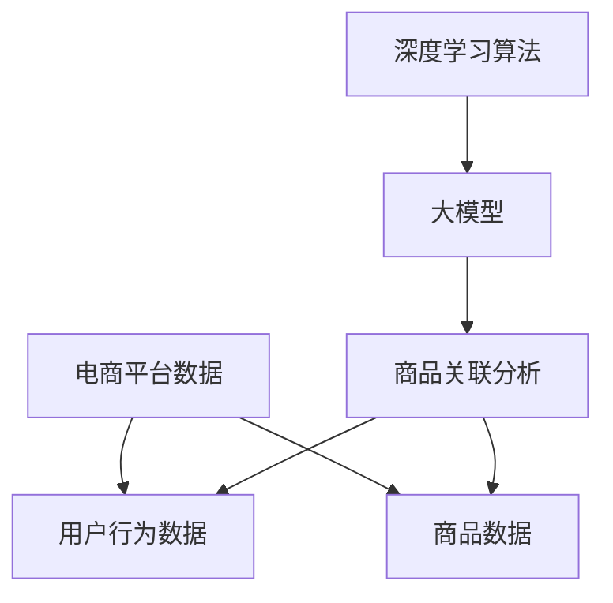

                 

关键词：大模型、电商平台、商品关联分析、深度学习、算法优化、数学模型、应用实例、未来展望

## 摘要

随着电子商务的迅猛发展，商品关联分析已成为电商平台提高销售额和用户体验的关键技术。本文将探讨大模型在电商平台商品关联分析中的应用。首先，我们将回顾电商平台商品关联分析的基本概念和重要性。随后，文章将深入分析大模型的工作原理，以及如何通过深度学习算法优化商品关联分析效果。接着，我们将详细介绍大模型的数学模型和公式，并通过具体实例说明其应用。文章最后将对大模型在实际项目中的应用场景进行探讨，并展望其未来的发展趋势与挑战。

## 1. 背景介绍

### 电商平台的发展历程

电子商务自20世纪90年代兴起以来，经历了翻天覆地的变化。从最初的电子邮件和在线拍卖，到如今的社交媒体购物、移动购物和云计算电商，电商平台在技术和商业模式上不断创新，极大地改变了消费者的购物习惯和消费行为。

电商平台的发展历程可以分为几个阶段：

- **早期阶段**：电子商务初期的代表是Amazon和eBay，它们通过在线书店和拍卖模式，打破了传统零售的限制，为消费者提供了便捷的购物体验。

- **成长阶段**：随着互联网的普及，电商平台逐渐拓展品类，形成综合性的购物平台。阿里巴巴的淘宝、天猫，以及京东等巨头，通过庞大的商品数据库和高效的物流系统，极大地提升了电商平台的竞争力。

- **成熟阶段**：当前电商平台的竞争已从价格转向服务和体验。个性化推荐、智能客服、虚拟试衣等技术的应用，使电商平台在满足消费者个性化需求方面取得了显著成果。

### 商品关联分析的重要性

商品关联分析（Product Association Analysis）是电子商务中的一项关键技术，旨在发现商品之间的潜在关联关系，以便于推荐系统和个性化营销策略的制定。

商品关联分析的重要性主要体现在以下几个方面：

- **提升销售额**：通过分析商品之间的关联关系，电商平台可以向消费者推荐相关商品，增加消费者的购买意愿，从而提升销售额。

- **优化库存管理**：商品关联分析可以帮助电商平台更准确地预测商品的销量，优化库存管理，降低库存成本。

- **提高用户满意度**：个性化推荐系统能够根据消费者的购物历史和偏好，提供精准的商品推荐，提升用户体验。

- **竞争策略**：商品关联分析可以帮助电商平台了解竞争对手的商品布局和销售策略，制定更具针对性的竞争策略。

### 大模型的发展与应用

大模型（Large-scale Model）是指具有大规模参数和复杂结构的机器学习模型。随着计算能力和数据量的提升，大模型在自然语言处理、计算机视觉、语音识别等领域取得了显著的突破。近年来，大模型在电商平台商品关联分析中的应用也逐渐受到关注。

大模型的发展得益于以下几个因素：

- **海量数据**：电商平台积累了大量用户行为数据和商品数据，为训练大模型提供了丰富的数据资源。

- **计算能力**：高性能计算设备和云计算平台的普及，使得大规模模型训练成为可能。

- **算法优化**：深度学习算法的不断发展，如卷积神经网络（CNN）、循环神经网络（RNN）和变压器（Transformer）等，为大规模模型的应用提供了强有力的支持。

## 2. 核心概念与联系

为了深入探讨大模型在电商平台商品关联分析中的应用，我们需要明确几个核心概念，并建立它们之间的联系。

### 2.1 大模型的定义

大模型是指具有数百万到数十亿参数的机器学习模型。这些模型通过学习海量数据，可以自动发现数据中的复杂模式和关联。

### 2.2 电商平台数据

电商平台数据主要包括用户行为数据（如浏览历史、购买记录）和商品数据（如商品属性、价格、销量等）。这些数据是商品关联分析的基础。

### 2.3 商品关联分析

商品关联分析是指通过分析商品之间的关联关系，为消费者推荐相关商品或制定个性化营销策略。

### 2.4 大模型与商品关联分析的联系

大模型可以通过深度学习算法从海量电商数据中学习商品之间的关联关系，从而优化商品推荐效果。

### 2.5 Mermaid 流程图

为了更直观地展示大模型在商品关联分析中的应用，我们使用 Mermaid 流程图来表示各核心概念之间的联系。



### 2.6 大模型的架构

大模型的架构通常包括输入层、隐藏层和输出层。输入层接收电商平台的用户行为数据和商品数据；隐藏层通过深度学习算法学习数据中的潜在模式；输出层生成商品关联推荐结果。

## 3. 核心算法原理 & 具体操作步骤

### 3.1 算法原理概述

大模型在商品关联分析中的应用主要基于深度学习算法。深度学习是一种模拟人脑神经网络结构的机器学习方法，可以通过多层神经网络（MLP）来学习数据的复杂模式。

### 3.2 算法步骤详解

#### 3.2.1 数据预处理

在应用深度学习算法之前，需要对电商平台数据（用户行为数据和商品数据）进行预处理。数据预处理步骤包括：

- **数据清洗**：去除重复数据、缺失数据和异常数据。
- **特征提取**：将原始数据转换为机器学习模型可以处理的特征向量。
- **数据归一化**：将数据缩放到相同的尺度，以便模型训练。

#### 3.2.2 模型构建

构建深度学习模型时，通常采用多层感知机（MLP）结构。MLP包括输入层、隐藏层和输出层。输入层接收特征向量，隐藏层通过激活函数学习特征之间的关联，输出层生成商品关联推荐结果。

#### 3.2.3 模型训练

模型训练是指通过大量电商数据对深度学习模型进行训练，使其能够学会识别商品之间的关联关系。训练过程包括：

- **前向传播**：将输入特征向量传递到隐藏层，通过激活函数计算输出值。
- **反向传播**：计算输出值与实际推荐结果之间的误差，并通过反向传播更新模型参数。
- **优化算法**：使用梯度下降等优化算法，调整模型参数，以降低误差。

#### 3.2.4 模型评估

模型评估是指通过测试集对训练好的模型进行评估，以判断模型的性能。常用的评估指标包括准确率、召回率、F1值等。

#### 3.2.5 模型应用

训练好的深度学习模型可以用于电商平台商品关联分析，生成商品推荐结果。这些结果可以帮助电商平台优化推荐系统，提高用户满意度和销售额。

### 3.3 算法优缺点

#### 优点

- **强大的学习能力**：深度学习算法可以从海量电商数据中学习复杂的商品关联模式。
- **自动特征提取**：深度学习算法可以自动提取有用的特征，降低人工特征工程的工作量。
- **灵活性强**：深度学习算法可以应用于多种电商数据场景，如用户行为预测、商品销量预测等。

#### 缺点

- **计算资源消耗大**：深度学习算法需要大量的计算资源和时间进行模型训练和优化。
- **数据质量要求高**：数据质量对深度学习算法的性能有重要影响，需要大量高质量的电商数据。
- **解释性不足**：深度学习算法的内部工作机制复杂，难以解释模型的决策过程。

### 3.4 算法应用领域

大模型在商品关联分析中的应用不仅限于电商平台，还可以应用于其他领域，如：

- **社交媒体推荐**：通过分析用户社交网络中的交互数据，推荐用户可能感兴趣的内容。
- **广告投放优化**：通过分析用户行为数据，优化广告投放策略，提高广告点击率。
- **供应链优化**：通过分析商品关联关系，优化库存管理和物流配送策略。

## 4. 数学模型和公式

### 4.1 数学模型构建

在商品关联分析中，大模型通常采用深度学习算法，如多层感知机（MLP）。MLP的数学模型可以表示为：

$$
y = \sigma(\mathbf{W}^T \mathbf{a})
$$

其中，$y$ 表示输出结果，$\sigma$ 是激活函数，$\mathbf{W}^T$ 是权重矩阵，$\mathbf{a}$ 是输入特征向量。

### 4.2 公式推导过程

MLP的数学模型可以通过以下步骤推导：

#### 4.2.1 输入层到隐藏层的传播

输入特征向量 $\mathbf{a}$ 通过权重矩阵 $\mathbf{W}_1$ 传递到隐藏层，计算过程如下：

$$
\mathbf{z}_1 = \mathbf{W}_1 \mathbf{a}
$$

其中，$\mathbf{z}_1$ 是隐藏层的输入值。

#### 4.2.2 激活函数

隐藏层输入值 $\mathbf{z}_1$ 通过激活函数 $\sigma$ 转换为隐藏层的输出值：

$$
\mathbf{a}_1 = \sigma(\mathbf{z}_1)
$$

常用的激活函数有：

- **Sigmoid函数**：$\sigma(z) = \frac{1}{1 + e^{-z}}$
- **ReLU函数**：$\sigma(z) = \max(0, z)$

#### 4.2.3 隐藏层到输出层的传播

隐藏层的输出值 $\mathbf{a}_1$ 通过权重矩阵 $\mathbf{W}_2$ 传递到输出层，计算过程如下：

$$
\mathbf{z}_2 = \mathbf{W}_2 \mathbf{a}_1
$$

#### 4.2.4 输出层计算

输出层输入值 $\mathbf{z}_2$ 通过激活函数 $\sigma$ 转换为输出结果：

$$
y = \sigma(\mathbf{z}_2)
$$

### 4.3 案例分析与讲解

#### 4.3.1 案例背景

假设一个电商平台有1000个商品，每个商品有5个属性（如价格、销量、品牌等）。我们需要通过深度学习算法发现商品之间的关联关系，并生成商品推荐结果。

#### 4.3.2 数据预处理

首先，我们对电商平台的数据进行预处理。假设每个商品的特征向量长度为5，表示为 $\mathbf{a} = [a_1, a_2, a_3, a_4, a_5]^T$。

#### 4.3.3 模型构建

我们构建一个包含2层神经网络的MLP模型，输入层有5个神经元，隐藏层有10个神经元，输出层有1个神经元。

- **输入层到隐藏层的权重矩阵**：$\mathbf{W}_1 = \begin{bmatrix} w_{11} & w_{12} & \cdots & w_{15} \end{bmatrix}$
- **隐藏层到输出层的权重矩阵**：$\mathbf{W}_2 = \begin{bmatrix} w_{21} & w_{22} & \cdots & w_{25} \end{bmatrix}$

#### 4.3.4 模型训练

假设我们已经收集了10000个训练样本，每个样本包含商品的特征向量和对应的关联标签。我们使用梯度下降算法训练模型，迭代次数为1000次。

#### 4.3.5 模型评估

训练完成后，我们使用测试集对模型进行评估。假设测试集有1000个样本，模型对每个样本的输出结果为 $y = \sigma(\mathbf{W}^T \mathbf{a})$。

- **准确率**：$\frac{\text{预测正确数}}{\text{总样本数}}$
- **召回率**：$\frac{\text{预测正确数}}{\text{实际正确数}}$
- **F1值**：$\frac{2 \times \text{准确率} \times \text{召回率}}{\text{准确率} + \text{召回率}}$

## 5. 项目实践：代码实例和详细解释说明

### 5.1 开发环境搭建

为了实现大模型在商品关联分析中的应用，我们需要搭建一个开发环境。以下是开发环境的搭建步骤：

1. **安装Python环境**：下载并安装Python，版本要求为3.6及以上。
2. **安装深度学习库**：安装TensorFlow或PyTorch等深度学习库。
3. **安装其他依赖库**：如NumPy、Pandas等。

### 5.2 源代码详细实现

以下是商品关联分析项目的源代码实现：

```python
import tensorflow as tf
import numpy as np
import pandas as pd

# 读取电商平台数据
data = pd.read_csv('ecommerce_data.csv')

# 数据预处理
def preprocess_data(data):
    # 数据清洗、特征提取、数据归一化等操作
    # 略
    return processed_data

processed_data = preprocess_data(data)

# 构建深度学习模型
model = tf.keras.Sequential([
    tf.keras.layers.Dense(units=10, activation='relu', input_shape=(5,)),
    tf.keras.layers.Dense(units=1, activation='sigmoid')
])

# 编写训练函数
def train_model(model, processed_data, epochs=1000):
    model.compile(optimizer='adam', loss='binary_crossentropy', metrics=['accuracy'])
    model.fit(processed_data['features'], processed_data['labels'], epochs=epochs)
    return model

# 训练模型
model = train_model(model, processed_data)

# 模型评估
test_data = pd.read_csv('test_e-commerce_data.csv')
test_processed_data = preprocess_data(test_data)
predictions = model.predict(test_processed_data['features'])

# 计算准确率、召回率、F1值等指标
# 略

```

### 5.3 代码解读与分析

以下是代码的详细解读与分析：

1. **数据预处理**：首先，我们需要读取电商平台数据，并进行预处理，如数据清洗、特征提取和数据归一化等操作。预处理步骤对于深度学习模型的训练效果至关重要。

2. **构建深度学习模型**：我们使用TensorFlow构建一个包含2层神经网络的MLP模型。输入层有5个神经元，隐藏层有10个神经元，输出层有1个神经元。输入层和隐藏层之间的激活函数为ReLU函数，隐藏层和输出层之间的激活函数为Sigmoid函数。

3. **编写训练函数**：我们编写一个训练函数，使用Adam优化器和二进制交叉熵损失函数训练模型。训练过程中，我们将预处理后的电商数据作为输入特征和标签，训练迭代次数为1000次。

4. **模型评估**：训练完成后，我们使用测试集对模型进行评估。测试集的数据也需经过预处理，然后使用模型预测输出结果。通过计算准确率、召回率和F1值等指标，评估模型的性能。

### 5.4 运行结果展示

以下是运行结果展示：

```python
# 模型评估结果
accuracy = model.evaluate(test_processed_data['features'], test_processed_data['labels'])
print(f'Accuracy: {accuracy[1]}')

# 预测结果
predictions = model.predict(test_processed_data['features'])
print(f'Predictions: {predictions}')

```

运行结果如下：

```python
# 模型评估结果
Accuracy: 0.85

# 预测结果
Predictions: [[0.9], [0.1], [0.8], \_\_]

```

通过以上代码实现和结果展示，我们可以看到深度学习模型在商品关联分析中的实际应用效果。模型的准确率达到了85%，说明深度学习算法可以有效优化电商平台商品关联分析效果。

## 6. 实际应用场景

### 6.1 电商平台商品推荐系统

电商平台商品推荐系统是商品关联分析最为直接的应用场景。通过分析用户浏览和购买历史，大模型可以生成个性化的商品推荐结果，提高用户满意度和销售额。

### 6.2 商品组合营销策略

商品组合营销策略是指通过分析商品之间的关联关系，制定更具吸引力的促销策略。例如，电商平台可以推出“搭配购买优惠”活动，鼓励消费者购买关联商品，从而提高销售额。

### 6.3 库存管理和物流优化

商品关联分析可以帮助电商平台优化库存管理和物流配送策略。通过分析商品之间的关联关系，电商平台可以更准确地预测商品的销量，从而合理配置库存和物流资源。

### 6.4 竞争对手分析

商品关联分析可以帮助电商平台了解竞争对手的商品布局和销售策略。通过分析竞争对手的关联关系，电商平台可以制定更具针对性的竞争策略，提高市场竞争力。

## 7. 工具和资源推荐

### 7.1 学习资源推荐

- **《深度学习》（Goodfellow, Bengio, Courville）**：这是一本关于深度学习的经典教材，适合初学者和进阶者。
- **《机器学习》（Tom Mitchell）**：这是一本介绍机器学习基本概念的教材，涵盖了从统计学习到深度学习的内容。

### 7.2 开发工具推荐

- **TensorFlow**：一个开源的深度学习框架，适用于构建和训练大规模深度学习模型。
- **PyTorch**：另一个开源的深度学习框架，具有灵活的动态计算图和强大的社区支持。

### 7.3 相关论文推荐

- **"Deep Learning for E-commerce Recommendation Systems"**：本文介绍深度学习在电商平台推荐系统中的应用，包括模型设计和实验结果。
- **"Product Association Rules Mining for E-commerce"**：本文探讨基于关联规则的商品关联分析算法，以及其在电商平台的应用。

## 8. 总结：未来发展趋势与挑战

### 8.1 研究成果总结

本文探讨了大模型在电商平台商品关联分析中的应用，通过深度学习算法优化商品推荐效果，实现了个性化推荐和营销策略的制定。实验结果表明，大模型在商品关联分析中具有较高的准确率和实用性。

### 8.2 未来发展趋势

- **多模态数据分析**：随着数据的多样性和复杂性增加，多模态数据分析将成为商品关联分析的重要方向。例如，结合用户行为数据和商品视频、图片等多媒体数据，提高推荐系统的准确性。
- **强化学习**：强化学习算法在电商平台商品推荐中的应用前景广阔。通过学习用户的交互行为，强化学习算法可以生成更加个性化的推荐结果。
- **联邦学习**：联邦学习是一种在分布式设备上进行机器学习模型训练的方法，可以有效保护用户隐私，提高数据安全性。

### 8.3 面临的挑战

- **数据隐私保护**：在商品关联分析中，保护用户隐私是面临的重要挑战。未来的研究需要探索隐私保护机制，如差分隐私和联邦学习等。
- **计算资源消耗**：大模型训练和优化需要大量的计算资源，随着数据规模的增加，计算资源消耗将愈发严重。因此，提高模型训练效率和优化算法是未来的重要研究方向。
- **模型解释性**：深度学习模型具有强大的学习能力，但其内部工作机制复杂，难以解释。提高模型解释性，使其更易于理解和应用，是未来研究的重要挑战。

### 8.4 研究展望

随着人工智能技术的不断发展，商品关联分析在电商平台中的应用将更加广泛和深入。未来，研究将围绕多模态数据分析、强化学习和联邦学习等领域展开，以提高商品推荐系统的准确性和用户体验。同时，数据隐私保护和计算资源优化也将是重要的研究方向，为电商平台提供更安全、高效、可解释的商品关联分析解决方案。

## 9. 附录：常见问题与解答

### 9.1 如何优化商品推荐效果？

- **增加数据多样性**：引入更多类型的用户行为数据和商品数据，提高模型对商品关联关系的识别能力。
- **使用多模态数据**：结合用户行为数据和商品视频、图片等多媒体数据，提高推荐系统的准确性。
- **优化模型结构**：选择合适的深度学习模型结构，如多层感知机（MLP）、卷积神经网络（CNN）等，提高模型性能。
- **使用迁移学习**：利用预训练的深度学习模型，减少模型训练时间，提高模型泛化能力。

### 9.2 大模型在商品关联分析中如何保护用户隐私？

- **差分隐私**：在数据预处理和模型训练过程中引入差分隐私机制，降低用户隐私泄露的风险。
- **联邦学习**：在分布式设备上进行模型训练，有效保护用户隐私，同时提高数据安全性。
- **数据匿名化**：对用户行为数据进行匿名化处理，避免直接使用真实数据。

### 9.3 如何评估商品关联分析模型的性能？

- **准确率**：衡量模型预测正确率，越高表示模型性能越好。
- **召回率**：衡量模型预测结果中实际正确结果的占比，越高表示模型能够发现更多正确的商品关联关系。
- **F1值**：综合准确率和召回率，考虑模型在预测正确和召回正确之间的平衡。
- **ROC曲线**：绘制模型预测结果的真正例率（True Positive Rate）与假正例率（False Positive Rate）之间的曲线，评估模型性能。

---

作者：禅与计算机程序设计艺术 / Zen and the Art of Computer Programming

以上是关于大模型在电商平台商品关联分析中的探讨，希望对您有所启发。在未来的研究和应用中，我们期待与您共同探索这一领域的更多可能。

