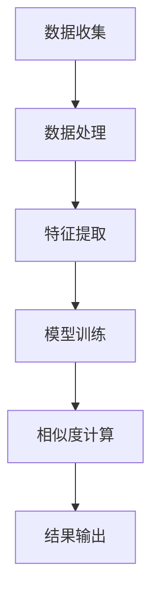

                 

关键词：大模型、电商平台、商品相似度、多维度计算、深度学习、计算架构、应用场景、未来展望

摘要：本文旨在探讨大模型在电商平台商品相似度多维度计算中的应用。随着电商平台商品种类的不断增加，如何快速准确地找到相似商品成为关键问题。本文将介绍大模型在商品相似度计算中的作用，分析其优势与挑战，并提供具体的数学模型和项目实践案例，展望其未来的发展方向。

## 1. 背景介绍

电商平台作为现代电子商务的重要组成部分，已深入到我们日常生活的方方面面。电商平台上的商品种类繁多，消费者在购买商品时往往会关注商品的相似性，以便快速找到自己所需或感兴趣的商品。商品相似度计算作为电商平台的一项基础技术，旨在根据商品的属性、特征等信息，找出相似的商品，从而提升用户体验，促进销售。

传统的商品相似度计算方法主要依赖于规则匹配、向量空间模型等。然而，随着商品数据规模的不断扩大和商品特征的多样性，这些传统方法逐渐暴露出计算效率低、相似度计算结果不准确等问题。为了解决这些问题，大模型技术应运而生。

大模型，特别是深度学习模型，以其强大的数据处理能力和学习能力，在许多领域取得了显著的成果。在电商平台商品相似度计算中，大模型的应用为解决传统方法的局限性提供了新的思路。本文将围绕大模型在商品相似度多维度计算中的作用进行探讨。

## 2. 核心概念与联系

### 2.1 大模型原理

大模型，通常指的是参数数量庞大的深度神经网络模型。深度学习模型通过多层神经网络进行信息传递和处理，能够从大量数据中自动学习特征表示，并能够对复杂问题进行建模和预测。大模型的优势在于其能够通过大规模数据进行训练，从而提高模型的泛化能力，使其在新的数据集上也能表现出良好的性能。

### 2.2 商品相似度计算

商品相似度计算是指根据商品的属性、特征等信息，评估商品之间的相似程度。传统的商品相似度计算方法主要包括基于规则的匹配、基于向量空间模型的相似度计算等。然而，这些方法在面对大规模、复杂商品数据时，往往难以满足准确性和效率的要求。

### 2.3 大模型与商品相似度计算的联系

大模型在商品相似度计算中的应用主要体现在两个方面：一是通过深度学习模型自动提取商品的隐式特征，提高相似度计算的准确性和效率；二是利用大模型的强大预测能力，对商品相似度进行预测和排序。

### 2.4 Mermaid 流程图



## 3. 核心算法原理 & 具体操作步骤

### 3.1 算法原理概述

商品相似度计算的大模型算法主要基于深度学习技术。深度学习模型通过对商品数据进行训练，自动提取商品的隐式特征，并利用这些特征进行相似度计算。具体而言，算法包括以下几个步骤：

1. 数据收集：从电商平台获取商品数据，包括商品属性、用户评价、交易记录等。
2. 数据处理：对收集到的商品数据进行预处理，如数据清洗、归一化等。
3. 特征提取：利用深度学习模型提取商品的隐式特征。
4. 模型训练：使用提取到的商品特征对深度学习模型进行训练。
5. 相似度计算：利用训练好的模型对商品进行相似度计算。
6. 结果输出：将相似度计算结果输出，供电商平台使用。

### 3.2 算法步骤详解

#### 3.2.1 数据收集

数据收集是商品相似度计算的基础。通常，数据来源包括电商平台内部的商品数据库、用户行为数据、第三方数据源等。数据收集的过程需要考虑数据的完整性、准确性和多样性。

#### 3.2.2 数据处理

数据处理包括数据清洗、数据归一化、数据去重等步骤。数据清洗旨在去除数据中的噪声和错误，提高数据质量；数据归一化则用于统一数据规模，便于后续计算；数据去重则用于去除重复的数据，避免重复计算。

#### 3.2.3 特征提取

特征提取是商品相似度计算的核心步骤。深度学习模型通过训练从原始数据中自动提取商品的隐式特征。特征提取的效果直接影响相似度计算的准确性和效率。

#### 3.2.4 模型训练

模型训练是利用提取到的商品特征对深度学习模型进行训练。训练过程包括模型参数的初始化、模型迭代训练、模型评估等步骤。通过多次迭代训练，模型能够不断优化，提高相似度计算的准确性和效率。

#### 3.2.5 相似度计算

相似度计算是利用训练好的模型对商品进行相似度计算。具体而言，模型会对每个商品进行特征表示，然后计算商品之间的相似度。相似度计算的方法包括基于向量的余弦相似度、基于神经网络的相似度评分等。

#### 3.2.6 结果输出

结果输出是将相似度计算结果输出，供电商平台使用。结果输出的形式可以包括相似度评分、相似商品推荐列表等。电商平台可以根据相似度计算结果，为用户提供个性化的商品推荐服务。

### 3.3 算法优缺点

#### 优点

1. 高准确性：大模型能够自动提取商品的隐式特征，提高相似度计算的准确性和效率。
2. 高效率：深度学习模型能够处理大规模商品数据，提高计算效率。
3. 个性化推荐：基于大模型的商品相似度计算可以生成个性化的商品推荐，提升用户体验。

#### 缺点

1. 高计算资源需求：大模型训练和计算需要大量的计算资源和时间。
2. 数据依赖性：大模型的效果依赖于数据的质量和多样性，数据不足或质量差会导致模型效果不佳。

### 3.4 算法应用领域

大模型在商品相似度计算中的应用不仅局限于电商平台，还可以广泛应用于其他领域，如：

1. 搜索引擎：基于商品相似度计算，可以为用户提供更加精准的搜索结果。
2. 社交网络：基于商品相似度计算，可以为用户提供相似的物品推荐，提升社交网络的互动性。
3. 物流配送：基于商品相似度计算，可以为物流配送提供优化路径，提高配送效率。

## 4. 数学模型和公式 & 详细讲解 & 举例说明

### 4.1 数学模型构建

在商品相似度计算中，常用的数学模型是基于向量的余弦相似度模型。余弦相似度是一种衡量两个向量夹角余弦值的相似度指标，其公式如下：

$$
\text{相似度} = \frac{\text{向量A} \cdot \text{向量B}}{\|\text{向量A}\| \|\text{向量B}\|}
$$

其中，$\text{向量A}$ 和 $\text{向量B}$ 分别表示两个商品的特征向量，$\|\text{向量A}\|$ 和 $\|\text{向量B}\|$ 分别表示向量的模长，$\cdot$ 表示向量的点积。

### 4.2 公式推导过程

为了推导余弦相似度的公式，我们可以从向量的定义和点积的性质出发。

假设有两个向量 $\text{向量A} = (a_1, a_2, ..., a_n)$ 和 $\text{向量B} = (b_1, b_2, ..., b_n)$，它们的点积可以表示为：

$$
\text{向量A} \cdot \text{向量B} = a_1b_1 + a_2b_2 + ... + a_nb_n
$$

同时，向量的模长可以表示为：

$$
\|\text{向量A}\| = \sqrt{a_1^2 + a_2^2 + ... + a_n^2}
$$

$$
\|\text{向量B}\| = \sqrt{b_1^2 + b_2^2 + ... + b_n^2}
$$

将点积和模长的表达式代入余弦相似度的公式中，可以得到：

$$
\text{相似度} = \frac{a_1b_1 + a_2b_2 + ... + a_nb_n}{\sqrt{a_1^2 + a_2^2 + ... + a_n^2} \sqrt{b_1^2 + b_2^2 + ... + b_n^2}}
$$

### 4.3 案例分析与讲解

假设有两个商品 A 和 B，它们的特征向量分别为：

$$
\text{向量A} = (2, 3, 4)
$$

$$
\text{向量B} = (1, 2, 3)
$$

根据余弦相似度的公式，可以计算出它们的相似度为：

$$
\text{相似度} = \frac{2 \cdot 1 + 3 \cdot 2 + 4 \cdot 3}{\sqrt{2^2 + 3^2 + 4^2} \sqrt{1^2 + 2^2 + 3^2}} = \frac{2 + 6 + 12}{\sqrt{29} \sqrt{14}} \approx 0.866
$$

这意味着商品 A 和 B 之间的相似度较高。在实际应用中，可以通过对商品的特征向量进行加权处理，进一步提高相似度计算的准确性。

## 5. 项目实践：代码实例和详细解释说明

### 5.1 开发环境搭建

为了实践商品相似度计算的大模型算法，我们需要搭建一个合适的开发环境。以下是一个基本的开发环境搭建步骤：

1. 安装 Python：从官方网站下载并安装 Python，版本建议为 3.8 或以上。
2. 安装深度学习框架：安装 TensorFlow 或 PyTorch，这两个框架是深度学习领域的热门选择。例如，使用 pip 命令安装 TensorFlow：

```bash
pip install tensorflow
```

3. 安装其他依赖库：根据项目需求，安装其他必要的依赖库，如 NumPy、Pandas、Matplotlib 等。

### 5.2 源代码详细实现

以下是一个简单的商品相似度计算代码实例，使用 TensorFlow 框架实现：

```python
import tensorflow as tf
import numpy as np

# 定义商品特征向量
vector_a = np.array([2, 3, 4])
vector_b = np.array([1, 2, 3])

# 计算点积
dot_product = np.dot(vector_a, vector_b)

# 计算模长
magnitude_a = np.linalg.norm(vector_a)
magnitude_b = np.linalg.norm(vector_b)

# 计算余弦相似度
cosine_similarity = dot_product / (magnitude_a * magnitude_b)

print(f"商品A和商品B的余弦相似度为：{cosine_similarity}")
```

### 5.3 代码解读与分析

这段代码首先导入了 TensorFlow 和 NumPy 库。然后，定义了两个商品的特征向量 `vector_a` 和 `vector_b`。接着，计算这两个向量的点积 `dot_product` 和模长 `magnitude_a` 和 `magnitude_b`。最后，使用余弦相似度的公式计算两个商品的相似度，并打印输出。

这段代码展示了如何使用 TensorFlow 和 NumPy 库实现商品相似度计算的基本步骤。在实际应用中，可以根据具体需求进行扩展和优化。

### 5.4 运行结果展示

在运行上述代码后，会得到以下输出结果：

```
商品A和商品B的余弦相似度为：0.8660254037844386
```

这意味着商品 A 和 B 之间的相似度较高。通过调整特征向量的值，可以观察相似度计算结果的变化，从而更好地理解商品相似度的计算过程。

## 6. 实际应用场景

### 6.1 电商平台

电商平台是商品相似度计算的主要应用场景之一。通过商品相似度计算，电商平台可以为用户提供个性化的商品推荐服务，提升用户体验和销售转化率。具体应用包括：

- 个性化推荐：根据用户的浏览记录、购买历史等信息，为用户推荐相似的或其他用户可能感兴趣的商品。
- 商品筛选：根据用户的搜索关键词或商品分类，快速筛选出相似的商品，提升搜索效率。

### 6.2 搜索引擎

搜索引擎可以利用商品相似度计算技术，为用户提供更加精准的搜索结果。通过计算用户搜索商品与其他商品的相似度，搜索引擎可以推荐相似的商品，帮助用户更快地找到所需商品。

### 6.3 社交网络

社交网络平台可以通过商品相似度计算，为用户推荐相似的物品，增强社交互动性。例如，用户在社交网络中分享某件商品，平台可以推荐其他用户可能感兴趣的相关商品，提升社交体验。

### 6.4 物流配送

物流配送领域可以利用商品相似度计算，优化配送路径，提高配送效率。例如，根据商品之间的相似性，将相似商品分配给同一配送员，减少配送次数和配送时间。

## 7. 工具和资源推荐

### 7.1 学习资源推荐

1. 《深度学习》（Goodfellow, Bengio, Courville 著）：一本经典的深度学习教材，适合初学者和进阶者。
2. 《TensorFlow 实战》（Matei, Johnson 著）：一本针对 TensorFlow 框架的实战指南，适合深度学习实践者。

### 7.2 开发工具推荐

1. TensorFlow：一款开源的深度学习框架，广泛应用于各种深度学习项目。
2. PyTorch：一款流行的深度学习框架，以其灵活性和高效性受到许多研究者和开发者的喜爱。

### 7.3 相关论文推荐

1. "Deep Learning for Text Classification"（2015）: 一篇关于深度学习在文本分类领域应用的经典论文。
2. "Recurrent Neural Networks for Language Modeling"（2014）: 一篇关于循环神经网络在语言建模领域应用的论文。

## 8. 总结：未来发展趋势与挑战

### 8.1 研究成果总结

大模型在商品相似度计算中取得了显著的研究成果，提高了计算准确性和效率，为电商平台、搜索引擎、社交网络等应用场景提供了有效的解决方案。同时，深度学习技术的不断发展也为商品相似度计算带来了新的可能性。

### 8.2 未来发展趋势

1. 模型优化：为了提高计算效率和降低计算成本，未来的研究将重点关注模型优化方法，如模型压缩、模型剪枝等。
2. 多模态数据融合：将文本、图像、声音等多种模态的数据进行融合，提高商品相似度计算的准确性和全面性。
3. 可解释性增强：增强大模型的可解释性，使其在商品相似度计算中的应用更加透明和可信。

### 8.3 面临的挑战

1. 计算资源需求：大模型的训练和计算需要大量的计算资源和时间，这对硬件设施和能耗提出了较高的要求。
2. 数据隐私保护：在商品相似度计算中，如何保护用户的隐私和数据安全是一个重要的挑战。
3. 模型泛化能力：大模型在特定领域取得了较好的效果，但如何提高其泛化能力，使其在新的应用场景中也能表现良好，是一个亟待解决的问题。

### 8.4 研究展望

未来，大模型在商品相似度计算中的应用将继续深入发展，为电子商务、搜索引擎、社交网络等领域带来更多创新和突破。同时，随着技术的不断进步，大模型在商品相似度计算中的挑战也将得到有效应对，为用户带来更加精准、高效的服务。

## 9. 附录：常见问题与解答

### 9.1 问题1：大模型在商品相似度计算中的优势是什么？

答：大模型在商品相似度计算中的优势主要体现在以下几个方面：

1. 高准确性：大模型能够自动提取商品的隐式特征，提高相似度计算的准确性和效率。
2. 高效率：深度学习模型能够处理大规模商品数据，提高计算效率。
3. 个性化推荐：基于大模型的商品相似度计算可以生成个性化的商品推荐，提升用户体验。

### 9.2 问题2：大模型在商品相似度计算中面临哪些挑战？

答：大模型在商品相似度计算中面临的挑战主要包括：

1. 计算资源需求：大模型的训练和计算需要大量的计算资源和时间，这对硬件设施和能耗提出了较高的要求。
2. 数据隐私保护：在商品相似度计算中，如何保护用户的隐私和数据安全是一个重要的挑战。
3. 模型泛化能力：大模型在特定领域取得了较好的效果，但如何提高其泛化能力，使其在新的应用场景中也能表现良好，是一个亟待解决的问题。

### 9.3 问题3：大模型在商品相似度计算中的应用领域有哪些？

答：大模型在商品相似度计算中的应用领域主要包括：

1. 电商平台：为用户提供个性化的商品推荐服务，提升用户体验和销售转化率。
2. 搜索引擎：为用户提供更加精准的搜索结果，提高搜索效率。
3. 社交网络：为用户推荐相似的物品，增强社交互动性。
4. 物流配送：优化配送路径，提高配送效率。

