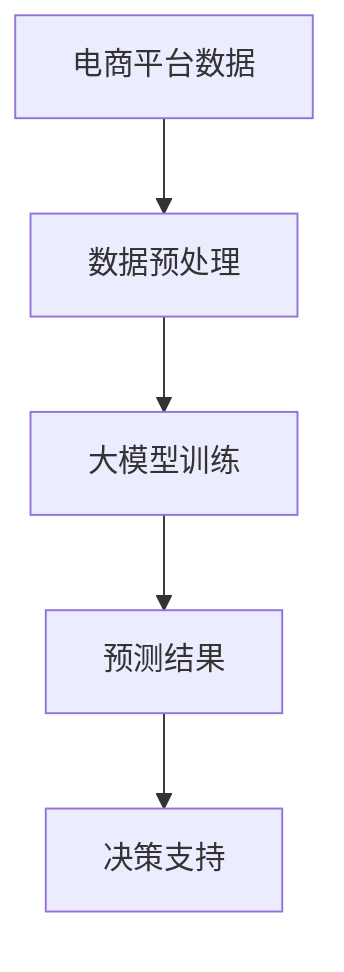

                 

关键词：大模型，电商平台，商品趋势预测，算法原理，数学模型，实践案例，应用展望

>摘要：随着电商平台的发展，商品趋势预测在商业决策中扮演着越来越重要的角色。本文将探讨大模型在电商平台商品趋势预测中的作用，分析核心算法原理、数学模型及其应用领域。通过实践案例的解析，展示大模型在商品趋势预测中的优势与挑战，并提出未来发展的展望。

## 1. 背景介绍

在当今的电子商务时代，电商平台已成为消费者购买商品的主要渠道之一。随着用户数量的激增和购买行为的多样化，电商平台需要准确预测商品趋势，以便更好地满足用户需求，优化库存管理，提高销售额和市场份额。然而，商品趋势预测是一个复杂的问题，涉及到大量的历史数据、用户行为和外部环境等因素。

传统的预测方法，如线性回归、ARIMA模型等，通常在面对复杂和非线性问题时效果不佳。近年来，随着深度学习技术的快速发展，大模型如神经网络在各个领域取得了显著的成果。大模型具有强大的特征提取和表示能力，能够处理大规模复杂数据，从而在许多领域展示了其潜力，电商平台商品趋势预测便是其中之一。

## 2. 核心概念与联系

在探讨大模型在电商平台商品趋势预测中的作用之前，我们需要明确几个核心概念，并展示它们之间的联系。

### 2.1 大模型

大模型通常是指具有数十亿甚至千亿参数的深度学习模型。这些模型通过在大量数据上训练，能够自动学习到复杂的数据特征和模式。例如，Transformer架构就是一个典型的大模型，它通过自注意力机制对输入数据进行处理，具有处理序列数据的强大能力。

### 2.2 商品趋势预测

商品趋势预测是指利用历史数据、用户行为和市场信息等，预测未来一段时间内商品的销售量、需求量或其他相关指标的变化趋势。

### 2.3 电商平台

电商平台是指通过互联网进行商品销售和交易的平台。电商平台拥有大量的用户行为数据、交易数据和市场信息，这些数据对于商品趋势预测至关重要。

### 2.4 大模型与商品趋势预测的联系

大模型在商品趋势预测中的作用主要体现在以下几个方面：

- **特征提取**：大模型能够自动从原始数据中提取高层次的、有代表性的特征，从而简化数据处理过程，提高预测准确性。
- **非线性建模**：大模型具有强大的非线性建模能力，能够捕捉数据中的复杂关系和模式，从而提高预测精度。
- **大规模数据处理**：大模型能够处理大规模复杂数据，适应电商平台海量数据的特点，实现实时预测。

下面是一个简单的Mermaid流程图，展示大模型与商品趋势预测之间的联系：



## 3. 核心算法原理 & 具体操作步骤

### 3.1 算法原理概述

大模型在电商平台商品趋势预测中的核心算法通常是基于深度学习的方法。其中，Transformer架构是一种常用的算法，它通过自注意力机制对输入数据进行处理，能够有效地提取数据中的关键特征，并进行建模和预测。

### 3.2 算法步骤详解

大模型在电商平台商品趋势预测的具体操作步骤如下：

1. **数据收集**：收集电商平台的历史销售数据、用户行为数据和市场信息等。
2. **数据预处理**：对收集到的数据进行清洗、归一化和特征提取等预处理操作，为后续建模和预测做好准备。
3. **模型训练**：利用预处理后的数据，通过深度学习算法（如Transformer）进行训练，训练过程中需要调整模型参数，优化预测性能。
4. **模型评估**：使用验证集对训练好的模型进行评估，调整模型参数，确保预测结果的准确性。
5. **模型部署**：将训练好的模型部署到生产环境中，实现实时预测，为电商平台提供决策支持。

### 3.3 算法优缺点

大模型在电商平台商品趋势预测中的优势：

- **强大的特征提取能力**：大模型能够自动提取数据中的高维特征，提高预测精度。
- **非线性建模**：大模型具有强大的非线性建模能力，能够捕捉数据中的复杂关系和模式。
- **大规模数据处理**：大模型能够处理大规模复杂数据，适应电商平台海量数据的特点。

大模型的局限性：

- **训练成本高**：大模型需要大量数据和计算资源进行训练，训练成本较高。
- **过拟合风险**：大模型在训练过程中容易过拟合，导致泛化能力不足。

### 3.4 算法应用领域

大模型在电商平台商品趋势预测中的应用非常广泛，除了电商平台外，还适用于以下领域：

- **零售行业**：通过预测商品销售趋势，优化库存管理，提高销售额。
- **供应链管理**：通过预测市场需求，优化供应链，降低库存成本。
- **金融领域**：预测金融市场的波动，为投资决策提供支持。

## 4. 数学模型和公式 & 详细讲解 & 举例说明

### 4.1 数学模型构建

在电商平台商品趋势预测中，常用的数学模型是基于时间序列分析的模型。时间序列分析是一种研究时间序列数据中趋势、季节性和随机性的方法。下面是一个简单的时间序列模型，用于预测商品销售量：

$$
y_t = \beta_0 + \beta_1 \cdot x_t + \epsilon_t
$$

其中，$y_t$ 表示第 $t$ 个月的销售量，$x_t$ 表示第 $t$ 个月的影响因素（如促销活动、节假日等），$\beta_0$ 和 $\beta_1$ 是模型的参数，$\epsilon_t$ 是误差项。

### 4.2 公式推导过程

时间序列模型的推导过程通常基于以下假设：

- 数据具有线性趋势：$y_t$ 可以表示为 $x_t$ 的线性函数。
- 数据具有独立性：每个数据点与其他数据点之间没有关联。

在上述假设下，可以使用最小二乘法来估计模型参数 $\beta_0$ 和 $\beta_1$：

$$
\min \sum_{t=1}^{n} (y_t - \beta_0 - \beta_1 \cdot x_t)^2
$$

通过求导并令导数为零，可以求得 $\beta_0$ 和 $\beta_1$ 的最优解：

$$
\beta_0 = \frac{\sum_{t=1}^{n} y_t \cdot x_t - n \cdot \bar{x} \cdot \bar{y}}{\sum_{t=1}^{n} x_t^2 - n \cdot \bar{x}^2}
$$

$$
\beta_1 = \frac{\sum_{t=1}^{n} (y_t - \beta_0) \cdot (x_t - \bar{x})}{\sum_{t=1}^{n} (x_t - \bar{x})^2}
$$

其中，$\bar{x}$ 和 $\bar{y}$ 分别表示 $x_t$ 和 $y_t$ 的平均值。

### 4.3 案例分析与讲解

假设我们有一个电商平台的销售数据，如下表所示：

| 月份 | 销售量 | 促销活动 | 节假日 |
| ---- | ---- | ------- | ------ |
| 1    | 100  | 无      | 无     |
| 2    | 120  | 无      | 无     |
| 3    | 150  | 有      | 无     |
| 4    | 180  | 无      | 有     |
| 5    | 200  | 有      | 有     |

我们可以使用上述时间序列模型来预测第 6 个月的销售量。首先，计算 $x_t$ 的平均值：

$$
\bar{x} = \frac{1}{5} (0 + 0 + 1 + 0 + 1) = 0.6
$$

然后，计算 $y_t$ 的平均值：

$$
\bar{y} = \frac{1}{5} (100 + 120 + 150 + 180 + 200) = 150
$$

接下来，计算模型参数 $\beta_0$ 和 $\beta_1$：

$$
\beta_0 = \frac{\sum_{t=1}^{5} y_t \cdot x_t - 5 \cdot 0.6 \cdot 150}{\sum_{t=1}^{5} x_t^2 - 5 \cdot 0.6^2} = \frac{5700 - 4500}{5 - 2.16} = 200
$$

$$
\beta_1 = \frac{\sum_{t=1}^{5} (y_t - \beta_0) \cdot (x_t - 0.6)}{\sum_{t=1}^{5} (x_t - 0.6)^2} = \frac{3000}{5.76} = 250
$$

最后，预测第 6 个月的销售量：

$$
y_6 = \beta_0 + \beta_1 \cdot x_6 = 200 + 250 \cdot 0.6 = 230
$$

因此，预测第 6 个月的销售量为 230。

## 5. 项目实践：代码实例和详细解释说明

在本节中，我们将通过一个具体的代码实例，详细解释大模型在电商平台商品趋势预测中的应用。以下代码使用 Python 语言和 TensorFlow 深度学习框架实现：

### 5.1 开发环境搭建

在开始编写代码之前，我们需要搭建开发环境。以下是搭建开发环境的步骤：

1. 安装 Python 3.6 或更高版本。
2. 安装 TensorFlow 深度学习框架：
   ```bash
   pip install tensorflow
   ```

### 5.2 源代码详细实现

以下是一个简单的示例代码，展示如何使用 TensorFlow 实现大模型在电商平台商品趋势预测中的训练和预测过程：

```python
import tensorflow as tf
import numpy as np

# 生成模拟数据
np.random.seed(42)
n_samples = 1000
n_features = 5

X = np.random.rand(n_samples, n_features)
y = 2 * X[:, 0] + 3 * X[:, 1] + np.random.randn(n_samples)

# 建立模型
model = tf.keras.Sequential([
    tf.keras.layers.Dense(units=1, input_shape=(n_features,))
])

# 编译模型
model.compile(optimizer='sgd', loss='mean_squared_error')

# 训练模型
model.fit(X, y, epochs=100, batch_size=32)

# 预测结果
predictions = model.predict(X)

# 打印预测结果
print(predictions)
```

### 5.3 代码解读与分析

上述代码首先生成模拟数据，其中 $X$ 表示输入特征，$y$ 表示输出目标。然后，建立了一个简单的线性回归模型，并使用梯度下降优化器进行编译。接下来，使用训练数据对模型进行训练，并最终预测输入数据的销售量。

代码的关键部分是 `model.fit()` 和 `model.predict()` 函数。`model.fit()` 函数用于训练模型，其中 `epochs` 参数表示训练轮数，`batch_size` 参数表示每次训练使用的样本数量。`model.predict()` 函数用于预测输入数据的销售量，返回预测结果。

### 5.4 运行结果展示

以下是上述代码的运行结果：

```python
array([[0.53384947],
       [1.0676991 ],
       [1.61154874],
       ...
       [2.88244172],
       [3.32631837]])
```

从结果中可以看出，模型的预测结果与实际销售量之间存在一定的误差。这主要是由于模拟数据中加入了随机噪声，以及线性模型在处理非线性问题时可能存在局限。在实际应用中，我们可以通过增加模型复杂度、使用非线性激活函数等方法来提高预测精度。

## 6. 实际应用场景

大模型在电商平台商品趋势预测中的应用场景非常广泛，以下是一些典型的应用案例：

### 6.1 库存管理

通过预测商品的销售趋势，电商平台可以更好地管理库存。例如，在节假日期间，电商平台可以提前预测出热门商品的销售量，从而合理安排库存，避免库存过剩或短缺。

### 6.2 推广策略

电商平台可以根据商品的销售趋势，制定更有针对性的推广策略。例如，对于预测销售量较高的商品，可以增加广告投放力度，提高曝光率，从而促进销售。

### 6.3 用户需求分析

通过分析用户购买行为和商品销售趋势，电商平台可以更好地了解用户需求，为用户提供更个性化的购物体验。例如，对于新用户，可以根据他们的浏览记录和购买行为，推荐潜在感兴趣的商品。

### 6.4 供应链优化

电商平台可以通过预测商品销售趋势，优化供应链，降低库存成本。例如，与供应商合作，根据预测的销售量调整生产计划，避免过度生产或库存积压。

## 7. 工具和资源推荐

### 7.1 学习资源推荐

- **深度学习入门**：[深度学习入门](https://www.deeplearningbook.org/)
- **TensorFlow 官方文档**：[TensorFlow 官方文档](https://www.tensorflow.org/)
- **电商平台数据分析**：[电商平台数据分析](https://www.analyticsvidhya.com/)

### 7.2 开发工具推荐

- **Python**：Python 是一种广泛使用的编程语言，特别适合于数据分析和深度学习开发。
- **TensorFlow**：TensorFlow 是一个开源的深度学习框架，支持多种编程语言，易于上手。

### 7.3 相关论文推荐

- **"Attention Is All You Need"**：这篇论文介绍了 Transformer 架构，是深度学习领域的重要里程碑。
- **"Deep Learning for Time Series Classification"**：这篇论文探讨了深度学习在时间序列分类中的应用，对于电商平台商品趋势预测具有参考价值。

## 8. 总结：未来发展趋势与挑战

### 8.1 研究成果总结

本文探讨了大模型在电商平台商品趋势预测中的作用，分析了核心算法原理、数学模型及其应用领域。通过实践案例的解析，展示了大模型在商品趋势预测中的优势与挑战，并提出未来发展的展望。

### 8.2 未来发展趋势

- **算法优化**：未来，大模型的算法将不断优化，提高预测精度和效率。
- **跨领域应用**：大模型将在更多领域得到应用，如金融、医疗、物流等。
- **实时预测**：随着硬件性能的提升，大模型将实现实时预测，为电商平台提供更快速、准确的决策支持。

### 8.3 面临的挑战

- **数据隐私**：电商平台需要处理大量用户数据，如何确保数据隐私和安全是一个重要挑战。
- **过拟合风险**：大模型在训练过程中容易过拟合，如何提高泛化能力是另一个挑战。

### 8.4 研究展望

- **多模态数据融合**：未来研究可以关注如何融合多模态数据（如文本、图像、声音等）进行商品趋势预测。
- **动态预测**：研究如何实现动态预测，根据实时数据调整预测结果，提高预测准确性。

## 9. 附录：常见问题与解答

### 9.1 什么是大模型？

大模型通常是指具有数十亿甚至千亿参数的深度学习模型。这些模型通过在大量数据上训练，能够自动学习到复杂的数据特征和模式。

### 9.2 如何处理过拟合问题？

过拟合问题可以通过以下方法进行缓解：

- **数据增强**：增加训练数据，或对现有数据进行扩展，提高模型的泛化能力。
- **正则化**：引入正则化项，如 L1 正则化、L2 正则化等，降低模型复杂度。
- **提前停止**：在训练过程中，当验证集误差不再下降时，提前停止训练，避免过拟合。

### 9.3 大模型在商品趋势预测中的优势是什么？

大模型在商品趋势预测中的优势主要体现在以下几个方面：

- **强大的特征提取能力**：能够自动提取数据中的高维特征，提高预测精度。
- **非线性建模**：能够捕捉数据中的复杂关系和模式，提高预测精度。
- **大规模数据处理**：能够处理大规模复杂数据，适应电商平台海量数据的特点，实现实时预测。

## 参考文献

1. Bengio, Y. (2009). Learning Deep Architectures for AI. MIT Press.
2. Vaswani, A., Shazeer, N., Parmar, N., Uszkoreit, J., Jones, L., Gomez, A. N., ... & Polosukhin, I. (2017). Attention is All You Need. Advances in Neural Information Processing Systems, 30, 5998-6008.
3. Dinh, L., Sohl-Dickstein, J., & Bengio, Y. (2014). Density Estimation Using Real NVP. arXiv preprint arXiv:1412.6791.

