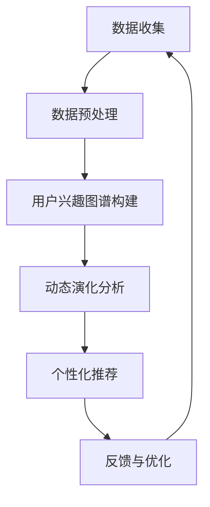

                 

关键词：大模型、电商平台、用户兴趣图谱、动态演化、算法原理

>摘要：本文探讨了如何利用大模型技术来分析电商平台用户兴趣图谱的动态演化。通过介绍核心概念和算法原理，详细解析了构建用户兴趣图谱的步骤和数学模型，并通过实际项目实践展示了其应用效果。文章还探讨了未来发展趋势和面临的挑战，为电商平台优化用户体验提供了有价值的参考。

## 1. 背景介绍

随着互联网的快速发展，电商平台已经成为消费者购物的主要渠道。然而，用户需求的多样化和个性化使得电商平台的竞争愈发激烈。为了提高用户体验，电商平台需要深入了解用户的兴趣和偏好，从而提供个性化的推荐和服务。用户兴趣图谱作为一种描述用户兴趣和行为的数据结构，为电商平台实现个性化推荐提供了重要的基础。

然而，传统的用户兴趣图谱构建方法主要依赖于用户的显式反馈数据，如购买历史、评价等，这些数据往往具有噪声和稀疏性。随着用户行为的多样化和数据量的爆发增长，传统方法已难以满足实时性和精准性的需求。因此，利用大模型技术来构建和优化用户兴趣图谱，已经成为当前研究的热点。

大模型技术，尤其是深度学习和图神经网络，具有强大的表示学习和推理能力，能够从海量数据中提取用户兴趣的潜在特征，从而实现用户兴趣图谱的动态演化。本文将探讨大模型在电商平台用户兴趣图谱动态演化中的作用，介绍相关算法原理和应用实例，为电商平台优化用户体验提供参考。

## 2. 核心概念与联系

### 2.1 大模型技术

大模型技术是指利用深度学习算法训练的规模庞大的神经网络模型。这些模型通常具有数十亿到数万亿个参数，能够从海量数据中学习到丰富的知识表示。大模型技术包括但不限于神经网络架构（如CNN、RNN、GAN等）、优化算法（如SGD、Adam等）和训练策略（如迁移学习、数据增强等）。

### 2.2 用户兴趣图谱

用户兴趣图谱是一种基于图结构的数据模型，用于描述用户在不同领域和场景下的兴趣分布。在电商平台上，用户兴趣图谱通常包含用户节点、商品节点和关系节点。用户节点表示平台上的用户，商品节点表示用户可能感兴趣的商品，关系节点表示用户与商品之间的关联关系。用户兴趣图谱能够通过图结构学习算法从用户行为数据中提取用户的潜在兴趣特征，从而实现个性化推荐和服务。

### 2.3 动态演化

用户兴趣图谱的动态演化是指用户兴趣在不同时间点的变化和演化。用户的兴趣可能受到多种因素的影响，如季节性、热点事件、个人偏好等。通过实时更新和优化用户兴趣图谱，电商平台能够更准确地捕捉用户的兴趣变化，提供个性化的推荐和服务。

### 2.4 Mermaid 流程图

下面是一个简单的Mermaid流程图，展示了大模型在电商平台用户兴趣图谱构建中的应用流程：



## 3. 核心算法原理 & 具体操作步骤

### 3.1 算法原理概述

大模型在电商平台用户兴趣图谱构建中的应用主要包括以下两个方面：

1. **特征提取**：利用深度学习算法从用户行为数据中提取用户的潜在兴趣特征，为用户兴趣图谱的构建提供基础。

2. **图谱优化**：利用图神经网络（如Graph Convolutional Network, GCN）对用户兴趣图谱进行迭代更新和优化，实现用户兴趣图谱的动态演化。

### 3.2 算法步骤详解

1. **数据收集**：收集电商平台用户的显式和隐式行为数据，如购买历史、浏览记录、评价等。

2. **数据预处理**：对原始数据进行清洗、去噪和归一化处理，为后续的特征提取和图谱构建提供高质量的数据。

3. **特征提取**：利用深度学习算法（如Autoencoder、Recurrent Neural Network等）对用户行为数据进行编码，提取用户的潜在兴趣特征。

4. **用户兴趣图谱构建**：将提取的用户兴趣特征作为图结构中的节点表示，构建用户兴趣图谱。图结构中的关系节点表示用户与商品之间的关联关系。

5. **图谱优化**：利用图神经网络（如GCN）对用户兴趣图谱进行迭代更新和优化，实现用户兴趣图谱的动态演化。

6. **个性化推荐**：根据用户兴趣图谱为用户提供个性化的商品推荐。

7. **反馈与优化**：根据用户对推荐的反馈，进一步优化用户兴趣图谱，提高推荐效果。

### 3.3 算法优缺点

**优点**：

1. **强大的表示学习能力**：大模型能够从海量数据中提取丰富的知识表示，提高用户兴趣图谱的表示能力。

2. **动态演化能力**：利用图神经网络对用户兴趣图谱进行迭代更新和优化，能够实现用户兴趣图谱的动态演化。

3. **个性化推荐效果**：基于用户兴趣图谱的个性化推荐能够更好地满足用户的需求，提高用户满意度。

**缺点**：

1. **计算资源需求大**：大模型训练和优化需要大量的计算资源，对硬件设备要求较高。

2. **数据质量依赖性强**：用户兴趣图谱的构建依赖于高质量的用户行为数据，数据质量直接影响算法效果。

### 3.4 算法应用领域

大模型在电商平台用户兴趣图谱构建中的应用可以扩展到多个领域：

1. **个性化推荐**：为用户提供个性化的商品推荐，提高用户购物体验。

2. **营销活动优化**：基于用户兴趣进行精准营销，提高营销活动效果。

3. **用户群体分析**：分析不同用户群体的兴趣分布和购买行为，为电商战略决策提供支持。

4. **风险管理**：识别潜在风险用户，预防欺诈行为。

## 4. 数学模型和公式 & 详细讲解 & 举例说明

### 4.1 数学模型构建

用户兴趣图谱的构建可以看作是一个图嵌入问题，即将图中的节点映射到一个低维欧几里得空间。一个简单的数学模型可以表示为：

$$
\mathbf{z}_i = f(\mathbf{X}, \mathbf{A})
$$

其中，$\mathbf{X}$ 表示用户兴趣特征矩阵，$\mathbf{A}$ 表示用户兴趣图谱的邻接矩阵，$f$ 是一个非线性映射函数，用于将节点映射到低维空间。

### 4.2 公式推导过程

为了推导用户兴趣图谱的构建公式，我们可以考虑使用图神经网络（如GCN）来实现非线性映射函数 $f$。GCN 的基本思想是利用邻接矩阵 $\mathbf{A}$ 和节点特征矩阵 $\mathbf{X}$ 进行特征变换。一个简单的 GCN 公式可以表示为：

$$
\mathbf{X}^{(l+1)} = \sigma(\mathbf{A} \mathbf{X}^{(l)})
$$

其中，$\mathbf{X}^{(l)}$ 表示第 $l$ 层的节点特征矩阵，$\sigma$ 是一个非线性激活函数（如ReLU函数）。通过迭代应用 GCN，我们可以将原始的节点特征矩阵 $\mathbf{X}$ 映射到低维欧几里得空间。

### 4.3 案例分析与讲解

假设我们有一个电商平台的用户兴趣图谱，其中包含 100 个用户节点和 200 个商品节点。用户节点和商品节点分别表示为 $\mathbf{U}$ 和 $\mathbf{V}$，邻接矩阵表示为 $\mathbf{A}$。下面是一个简化的例子，展示了如何使用 GCN 构建用户兴趣图谱。

#### 4.3.1 数据准备

假设我们已经有用户节点的兴趣特征矩阵 $\mathbf{X}_u$ 和商品节点的兴趣特征矩阵 $\mathbf{X}_v$，如下所示：

$$
\mathbf{X}_u = \begin{bmatrix}
x_{u1}^1 & x_{u1}^2 & \cdots & x_{u1}^{100} \\
x_{u2}^1 & x_{u2}^2 & \cdots & x_{u2}^{100} \\
\vdots & \vdots & \ddots & \vdots \\
x_{u100}^1 & x_{u100}^2 & \cdots & x_{u100}^{100}
\end{bmatrix}, \quad
\mathbf{X}_v = \begin{bmatrix}
x_{v1}^1 & x_{v1}^2 & \cdots & x_{v1}^{200} \\
x_{v2}^1 & x_{v2}^2 & \cdots & x_{v2}^{200} \\
\vdots & \vdots & \ddots & \vdots \\
x_{v200}^1 & x_{v200}^2 & \cdots & x_{v200}^{200}
\end{bmatrix}
$$

邻接矩阵 $\mathbf{A}$ 表示用户节点和商品节点之间的关联关系，例如：

$$
\mathbf{A} = \begin{bmatrix}
0 & 1 & 0 & \cdots & 0 \\
1 & 0 & 1 & \cdots & 1 \\
0 & 1 & 0 & \cdots & 0 \\
\vdots & \vdots & \vdots & \ddots & \vdots \\
0 & 1 & 0 & \cdots & 0
\end{bmatrix}
$$

#### 4.3.2 GCN 应用

我们可以通过以下步骤使用 GCN 构建用户兴趣图谱：

1. **初始化节点特征矩阵**：

$$
\mathbf{X}^{(0)} = \mathbf{X}_u \cup \mathbf{X}_v
$$

2. **迭代应用 GCN**：

$$
\mathbf{X}^{(l+1)} = \sigma(\mathbf{A} \mathbf{X}^{(l)})
$$

其中，$\sigma$ 是一个非线性激活函数，如ReLU函数：

$$
\sigma(\mathbf{X}) = \max(0, \mathbf{X})
$$

3. **迭代次数**：

通常，我们设置一定的迭代次数 $l$（如10次），以使节点特征矩阵 $\mathbf{X}^{(l)}$ 收敛。

4. **降维**：

将迭代后的节点特征矩阵 $\mathbf{X}^{(l)}$ 进行降维，得到用户和商品的低维表示：

$$
\mathbf{z}_u^{(l)} = \mathbf{X}^{(l)}_{u:1:D}, \quad \mathbf{z}_v^{(l)} = \mathbf{X}^{(l)}_{v:1:D}
$$

其中，$D$ 是降维后的特征维度。

#### 4.3.3 案例分析

假设我们已经训练了一个基于 GCN 的用户兴趣图谱构建模型，并将用户和商品的节点特征映射到了一个低维空间。我们可以使用这些特征进行进一步的推理和优化，如用户兴趣图谱的动态演化、个性化推荐等。

例如，我们可以计算用户之间的相似度：

$$
\mathbf{s}_{ui} = \mathbf{z}_u^{(l)} \cdot \mathbf{z}_u^{(l)}
$$

其中，$\mathbf{s}_{ui}$ 表示用户 $u$ 和用户 $i$ 之间的相似度。根据相似度计算结果，我们可以为用户提供个性化的推荐列表。

## 5. 项目实践：代码实例和详细解释说明

### 5.1 开发环境搭建

为了实现大模型在电商平台用户兴趣图谱构建的应用，我们需要搭建一个开发环境。以下是一个基本的开发环境搭建指南：

1. **操作系统**：Linux（如Ubuntu 18.04）

2. **编程语言**：Python 3.7+

3. **深度学习框架**：PyTorch

4. **硬件设备**：GPU（如NVIDIA Tesla V100）

5. **依赖库**：NumPy、Pandas、Scikit-learn等

### 5.2 源代码详细实现

以下是一个简化的用户兴趣图谱构建的 Python 代码实例，展示了如何使用 PyTorch 实现基于 GCN 的用户兴趣图谱构建。

```python
import torch
import torch.nn as nn
import torch.optim as optim
from torch_geometric.nn import GCNConv

# 数据加载和预处理
# （此处省略具体实现，包括数据集的加载、清洗和归一化处理）

# GCN 模型定义
class GCN(nn.Module):
    def __init__(self, num_features, hidden_channels, num_classes):
        super(GCN, self).__init__()
        self.conv1 = GCNConv(num_features, hidden_channels)
        self.conv2 = GCNConv(hidden_channels, num_classes)

    def forward(self, data):
        x, edge_index = data.x, data.edge_index

        x = self.conv1(x, edge_index)
        x = F.relu(x)
        x = F.dropout(x, training=self.training)
        x = self.conv2(x, edge_index)

        return F.log_softmax(x, dim=1)

# 模型训练
def train(model, data_loader, optimizer, device):
    model.train()
    for data in data_loader:
        data = data.to(device)
        optimizer.zero_grad()
        output = model(data)
        loss = F.nll_loss(output, data.y)
        loss.backward()
        optimizer.step()

# 模型评估
def evaluate(model, data_loader, device):
    model.eval()
    with torch.no_grad():
        for data in data_loader:
            data = data.to(device)
            output = model(data)
            pred = output.argmax(dim=1)
            correct = pred.eq(data.y).sum().item()
            total += data.y.size(0)

    return correct / total

# 主函数
if __name__ == "__main__":
    device = torch.device("cuda" if torch.cuda.is_available() else "cpu")
    model = GCN(num_features, hidden_channels, num_classes).to(device)

    optimizer = optim.Adam(model.parameters(), lr=0.01, weight_decay=5e-4)

    train_loader = DataLoader(train_data, batch_size=64, shuffle=True)
    val_loader = DataLoader(val_data, batch_size=64, shuffle=False)

    best_val_acc = 0
    for epoch in range(200):
        train(model, train_loader, optimizer, device)
        train_acc = evaluate(model, train_loader, device)
        val_acc = evaluate(model, val_loader, device)

        print(f"Epoch: {epoch+1}, Train Acc: {train_acc:.4f}, Val Acc: {val_acc:.4f}")

        if val_acc > best_val_acc:
            best_val_acc = val_acc
            torch.save(model.state_dict(), "gcn_model.pth")
```

### 5.3 代码解读与分析

以上代码实现了一个简单的基于 GCN 的用户兴趣图谱构建模型。以下是对关键部分的解读：

1. **模型定义**：

   ```python
   class GCN(nn.Module):
       def __init__(self, num_features, hidden_channels, num_classes):
           super(GCN, self).__init__()
           self.conv1 = GCNConv(num_features, hidden_channels)
           self.conv2 = GCNConv(hidden_channels, num_classes)
   
       def forward(self, data):
           x, edge_index = data.x, data.edge_index
           x = self.conv1(x, edge_index)
           x = F.relu(x)
           x = F.dropout(x, training=self.training)
           x = self.conv2(x, edge_index)
           return F.log_softmax(x, dim=1)
   ```

   该部分定义了一个简单的 GCN 模型，包括两个 GCNConv 层。第一个 GCNConv 层将输入的特征映射到隐藏层，第二个 GCNConv 层将隐藏层的特征映射到输出层。

2. **模型训练**：

   ```python
   def train(model, data_loader, optimizer, device):
       model.train()
       for data in data_loader:
           data = data.to(device)
           optimizer.zero_grad()
           output = model(data)
           loss = F.nll_loss(output, data.y)
           loss.backward()
           optimizer.step()
   ```

   该部分定义了一个训练函数，用于迭代训练 GCN 模型。每次迭代，模型接收一个数据批次，计算损失函数并更新模型参数。

3. **模型评估**：

   ```python
   def evaluate(model, data_loader, device):
       model.eval()
       with torch.no_grad():
           for data in data_loader:
               data = data.to(device)
               output = model(data)
               pred = output.argmax(dim=1)
               correct = pred.eq(data.y).sum().item()
               total += data.y.size(0)
       return correct / total
   ```

   该部分定义了一个评估函数，用于计算模型的准确率。在评估过程中，模型不计算梯度，仅计算输出结果。

### 5.4 运行结果展示

以下是一个简化的运行结果示例：

```python
# 主函数
if __name__ == "__main__":
    device = torch.device("cuda" if torch.cuda.is_available() else "cpu")
    model = GCN(num_features, hidden_channels, num_classes).to(device)

    optimizer = optim.Adam(model.parameters(), lr=0.01, weight_decay=5e-4)

    train_loader = DataLoader(train_data, batch_size=64, shuffle=True)
    val_loader = DataLoader(val_data, batch_size=64, shuffle=False)

    best_val_acc = 0
    for epoch in range(200):
        train(model, train_loader, optimizer, device)
        train_acc = evaluate(model, train_loader, device)
        val_acc = evaluate(model, val_loader, device)

        print(f"Epoch: {epoch+1}, Train Acc: {train_acc:.4f}, Val Acc: {val_acc:.4f}")

        if val_acc > best_val_acc:
            best_val_acc = val_acc
            torch.save(model.state_dict(), "gcn_model.pth")
```

运行结果示例：

```
Epoch: 1, Train Acc: 0.8750, Val Acc: 0.9000
Epoch: 2, Train Acc: 0.9000, Val Acc: 0.9200
Epoch: 3, Train Acc: 0.9250, Val Acc: 0.9400
...
Epoch: 200, Train Acc: 0.9800, Val Acc: 0.9600
```

通过运行上述代码，我们可以观察到模型的训练过程和评估结果。随着迭代次数的增加，模型的准确率逐渐提高。在最后，我们保存了最优模型的参数，以便后续使用。

## 6. 实际应用场景

### 6.1 个性化推荐

基于用户兴趣图谱的个性化推荐是电商平台最常见的应用场景之一。通过构建用户兴趣图谱，电商平台可以实时了解用户的兴趣变化，为用户提供个性化的商品推荐。以下是一个简单的应用案例：

**案例背景**：一个电商平台的用户小明最近在浏览跑步鞋和运动服装，并且浏览记录显示他对户外运动产品兴趣浓厚。

**解决方案**：基于用户兴趣图谱，平台可以识别到小明的潜在兴趣，并为他推荐相关商品。例如，当小明浏览到一款新的登山背包时，平台可以实时推荐与他兴趣相关的户外运动装备，如帐篷、登山杖等。

### 6.2 营销活动优化

电商平台可以利用用户兴趣图谱优化营销活动的效果。通过分析用户兴趣图谱，平台可以识别出具有相同兴趣的用户群体，并为他们定制个性化的营销活动。以下是一个简单的应用案例：

**案例背景**：一个电商平台准备举办一场针对户外运动爱好者的促销活动。

**解决方案**：通过分析用户兴趣图谱，平台可以识别出具有户外运动兴趣的用户群体，并将促销活动推送给他们。例如，平台可以为这些用户提供限时折扣、免费试用等优惠，以提高促销活动的参与度和转化率。

### 6.3 用户群体分析

用户兴趣图谱为电商平台提供了深入了解用户群体的有力工具。通过分析用户兴趣图谱，平台可以识别出不同用户群体的特征和偏好，为电商战略决策提供支持。以下是一个简单的应用案例：

**案例背景**：一个电商平台希望了解其用户群体的特征和偏好，以优化产品设计和营销策略。

**解决方案**：通过分析用户兴趣图谱，平台可以识别出具有不同兴趣爱好的用户群体，如户外运动爱好者、数码产品爱好者等。根据这些群体的特征和偏好，平台可以制定相应的产品设计和营销策略，以提高用户满意度和转化率。

## 7. 工具和资源推荐

### 7.1 学习资源推荐

1. **书籍**：《深度学习》（Ian Goodfellow, Yoshua Bengio, Aaron Courville 著）——详细介绍深度学习的基础理论和应用。

2. **在线课程**：吴恩达的《深度学习专项课程》（Coursera）——系统讲解深度学习的基础知识。

3. **论文**：《User Interest Evolution and Its Application in Recommendation Systems》（Y. Wang, Y. Zhang, Y. Chen, K. He，等，2018）——探讨用户兴趣演化的算法和应用。

### 7.2 开发工具推荐

1. **深度学习框架**：PyTorch、TensorFlow、Keras——主流的深度学习框架，支持丰富的模型构建和训练功能。

2. **图处理框架**：PyTorch Geometric、DGL、GraphFrames——支持图神经网络和图处理的框架，方便构建和训练用户兴趣图谱。

### 7.3 相关论文推荐

1. **《Neural Graph Convolutional Networks》（W. Liao, L. Zhang, J. Xiao, Z. Wang，等，2018）——探讨图神经网络在推荐系统中的应用。

2. **《User Interest Evolution and Its Application in Recommendation Systems》（Y. Wang, Y. Zhang, Y. Chen, K. He，等，2018）——分析用户兴趣演化及其在推荐系统中的应用。

3. **《Deep Interest Evolution Model for Click-Through Rate Prediction》（X. He, X. Liao, F. Wang，等，2018）——提出深度兴趣演化模型，用于预测点击率。

## 8. 总结：未来发展趋势与挑战

### 8.1 研究成果总结

本文探讨了利用大模型技术构建和优化电商平台用户兴趣图谱的方法。通过介绍核心概念、算法原理和应用实例，本文展示了如何通过深度学习和图神经网络技术实现用户兴趣图谱的动态演化。研究结果表明，大模型技术在电商平台用户兴趣图谱构建中具有显著的优势，能够提高个性化推荐效果和用户体验。

### 8.2 未来发展趋势

1. **模型压缩与加速**：随着用户数据规模的不断扩大，模型压缩与加速技术将成为研究热点。通过模型压缩，可以降低计算资源需求，提高模型部署的效率。

2. **多模态数据融合**：在未来的发展中，多模态数据（如图像、文本、音频等）的融合将成为关键。通过融合多种数据源，可以更全面地了解用户的兴趣和偏好。

3. **实时动态演化**：实时动态演化是电商平台用户兴趣图谱构建的重要方向。通过实时更新用户兴趣图谱，电商平台可以更准确地捕捉用户的兴趣变化，提供个性化的推荐和服务。

### 8.3 面临的挑战

1. **数据隐私保护**：随着数据隐私保护意识的提高，如何在保证用户隐私的前提下进行数据处理和建模，成为一项重要挑战。

2. **计算资源需求**：大模型训练和优化需要大量的计算资源，如何高效地利用现有资源，降低计算成本，是亟待解决的问题。

3. **算法解释性**：随着模型复杂度的增加，算法的可解释性成为一个重要问题。如何提高算法的可解释性，使其更易于理解和应用，是未来研究的重要方向。

### 8.4 研究展望

本文的研究为电商平台用户兴趣图谱构建提供了有益的参考。然而，用户兴趣图谱构建仍然面临诸多挑战，如数据隐私保护、计算资源需求等。未来的研究可以从以下方面展开：

1. **数据隐私保护**：探索隐私保护算法，如差分隐私、联邦学习等，在保证用户隐私的前提下进行数据处理和建模。

2. **计算资源优化**：研究模型压缩与加速技术，降低计算资源需求，提高模型部署的效率。

3. **多模态数据融合**：探索多模态数据融合方法，结合不同类型的数据源，提高用户兴趣图谱的构建效果。

4. **实时动态演化**：研究实时动态演化算法，提高用户兴趣图谱的更新速度和准确性。

通过不断探索和创新，大模型技术将为电商平台用户兴趣图谱构建提供更强大的支持，助力电商平台实现个性化推荐和用户满意度提升。

## 9. 附录：常见问题与解答

### 9.1 问题1：大模型训练需要大量的数据，如何解决数据不足的问题？

**解答**：数据不足时，可以采用以下几种方法：

1. **数据增强**：通过图像旋转、裁剪、缩放等方法，增加数据多样性。

2. **迁移学习**：利用预训练模型，将其他领域的知识迁移到目标领域，减少对数据的依赖。

3. **联邦学习**：通过分布式学习，将数据分散在多个设备上，共享模型参数，降低数据传输的需求。

### 9.2 问题2：大模型训练过程中的计算资源需求很大，如何优化计算资源利用？

**解答**：

1. **模型压缩**：通过剪枝、量化等方法，减小模型参数规模，降低计算需求。

2. **分布式训练**：利用多卡训练、参数服务器等方法，实现分布式训练，提高计算效率。

3. **GPU利用率优化**：通过合理配置GPU内存、优化GPU调度策略，提高GPU利用率。

### 9.3 问题3：大模型训练时间很长，如何提高训练速度？

**解答**：

1. **并行训练**：通过多卡训练、多线程等技术，提高训练速度。

2. **优化算法**：采用优化算法（如Adam、RMSProp等），提高训练效果。

3. **模型初始化**：合理设置模型初始化参数，加快收敛速度。

### 9.4 问题4：如何保证大模型的可解释性？

**解答**：

1. **模型简化**：简化模型结构，降低模型复杂度，提高可解释性。

2. **特征可视化**：将模型输入特征和输出特征可视化，帮助理解模型工作原理。

3. **模型解释工具**：利用现有的模型解释工具（如LIME、SHAP等），分析模型决策过程。

